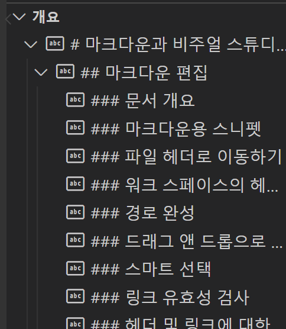
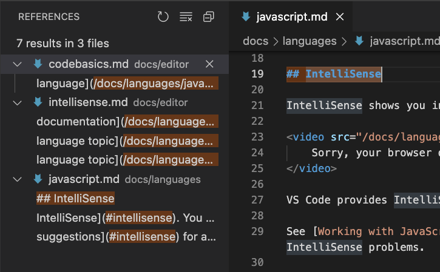
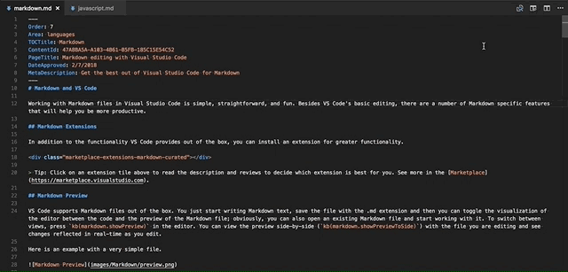
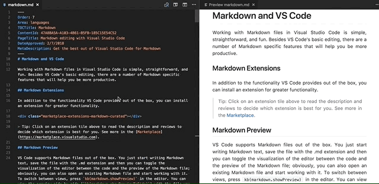

MS 공식 가이드 - 마크다운과 비주얼 스튜디오 코드

마크다운/번역/vscode

[원본 링크](https://code.visualstudio.com/docs/languages/markdown#_editing-markdown)

Visual Studio Code 에서 Markdown 파일로 작업하는 것은 간단하고 간단하며 재미있습니다. VS Code의 기본 편집 외에도 생산성을 높이는데 도움이 되는 Markdown 관련 기능이 많이 있습니다.

목차

- [1. 마크다운 편집](#1-마크다운-편집)
  - [1.1. 문서 개요](#11-문서-개요)
  - [1.2. 마크다운용 스니펫](#12-마크다운용-스니펫)
  - [1.3. 파일 헤더로 이동하기](#13-파일-헤더로-이동하기)
  - [1.4. 워크스페이스의 헤더로 이동](#14-워크스페이스의-헤더로-이동)
  - [1.5. 경로 완성](#15-경로-완성)
  - [1.6. 드래그 앤 드롭으로 링크 및 이미지 삽입](#16-드래그-앤-드롭으로-링크-및-이미지-삽입)
  - [1.7. 스마트 셀렉션](#17-스마트-셀렉션)
  - [1.8. 링크 유효성 검사](#18-링크-유효성-검사)
  - [1.9. 헤더 및 링크에 대한 모든 참조 찾기](#19-헤더-및-링크에-대한-모든-참조-찾기)
  - [1.10. 헤더 및 링크 이름 바꾸기](#110-헤더-및-링크-이름-바꾸기)
- [2. 마크다운 미리보기](#2-마크다운-미리보기)
  - [2.1. 동적 미리보기 및 미리보기 잠금](#21-동적-미리보기-및-미리보기-잠금)
  - [2.2. 에디터와 미리보기 동기화](#22-에디터와-미리보기-동기화)
- [3. 마크다운 미리보기 확장](#3-마크다운-미리보기-확장)
  - [3.1. 나만의 CSS 사용](#31-나만의-css-사용)
  - [3.2. 줄 바꿈을 만들려면 후행 공백을 유지하십시오](#32-줄-바꿈을-만들려면-후행-공백을-유지하십시오)
- [4. 마크다운 미리보기 보안](#4-마크다운-미리보기-보안)
  - [4.1. Strict](#41-strict)
  - [4.2. Allow insecure content](#42-allow-insecure-content)
  - [4.3. Disable](#43-disable)
- [5. 마크다운 확장](#5-마크다운-확장)


# 1. 마크다운 편집
## 1.1. 문서 개요
개요 뷰(Outline View)는 파일 탐색기 하단의 별도 섹션입니다. 확장하면 현재 활성화된 편집기의 심볼 트리가 표시됩니다. Markdown 파일의 경우 심볼 트리는 Markdown 파일의 헤더 계층 구조입니다.



개요 뷰는 문서의 머리글 구조와 개요를 검토하는 좋은 방법입니다.

## 1.2. 마크다운용 스니펫
VS Code 에는 몇가지 기본 제공 Markdown 스니펫이 포함되어 있습니다. **Ctrl+Space** (Trigger Suggest)를 누르면 컨텍스트별 제안 목록이 표시됩니다. 

>팁 : Markdown용 사용자 정의 스니펫을 추가할 수 있습니다. 방법을 알아보려면 "사용자 정의 조각"을 살펴보십시오.

## 1.3. 파일 헤더로 이동하기
**Ctrl+Shift+O** 를 사용하여 현재 파일의 헤더로 빠르게 이동합니다.


파일의 모든 헤더를 탐색하거나 헤더 이름을 입력하여 원하는 헤더만 찾을 수 있습니다. 원하는 헤더를 찾았으면 **Enter 키** 를 눌러 커서를 해당 헤더로 이동합니다. **Esc 키**를 눌러 헤더로의 점프를 취소합니다.

## 1.4. 워크스페이스의 헤더로 이동
**Ctrl+T** 를 사용하여 현재 워크스페이스의 모든 Markdown 파일에서 헤더를 검색합니다. 


헤더 이름을 입력하여 목록을 필터링하고 원하는 헤더를 찾으십시오.

## 1.5. 경로 완성
경로 완성은 파일 및 이미지에 대한 링크를 만드는데 도움이 됩니다. 이러한 경로는 이미지 또는 링크의 경로를 입력할 때 IntelliSense 에서 자동으로 표시되며 **Ctrl+Space** 를 사용하여 수동으로 요청할 수도 있습니다.


/로 시작하는 경로는 현재 워크스페이스 루트를 기준으로 확인하는 반면, ./ 로 시작하거나 접두사가 없는 경로는 현재 파일을 기준으로 확인합니다. 경로 제안은 /를 입력할 때 자동으로 표시되거나 **Ctrl+Space** 를 사용하여 수동으로 요청할 수도 있습니다.

경로 IntelliSense를 사용하면 현재 파일 또는 다른 Markdown 파일 내의 헤더에 연결할수도 있습니다. 파일의 모든 헤더에 대한 완성을 보려면 # 로 경로를 시작하십시오. (설정에 따라서는 **Ctrl+Space**를 사용해야 될 수도 있습니다)


경로 IntelliSense는 <code>"markdown.suggest.paths.enabled":false</code> 로 비활성화 할 수 있습니다.

## 1.6. 드래그 앤 드롭으로 링크 및 이미지 삽입
드래그 앤 드롭으로 이미지와 파일 링크를 빠르게 삽입하세요. 시작하려면 VS Code 탐색기에서 Markdown 코드 위로 파일을 드래그한 다음 Shift 키를 누른 상태에서 파일을 놓기 시작합니다. 미리보기 커서는 커서를 놓을 때 삽입될 위치를 보여줍니다.


드롭된 이미지는 마크다운 이미지를 삽입합니다. 
```

```
드롭된 파일은 일반 마크다운 링크를 삽입합니다.
```
[](path/to/file.md)
```

## 1.7. 스마트 셀렉션
스마트 셀렉션(Smart Selection)을 사용하면 Markdown 문서에서 선택 영역을 빠르게 확장 및 축소할 수 있습니다. 이것은 전체 블록 요소(예: 코드블록 또는 테이블)를 빠르게 선택하고 Markdown 파일에서 헤더 섹션의 전체 내용을 선택하는데 사용할 수 있습니다.

스마트 셀렉션은 다음 명령을 사용합니다.

- 확장 : **Shift+Alt+오른쪽**
- 축소 : **Shift+Alt+왼쪽**

선택은 다음에 적용되며 전통적인 계층적 패턴을 따릅니다.
- 헤더
- 기울기
- 따옴표 차단
- 분리된 코드 블록
- HTML 코드 블록
- 단락


## 1.8. 링크 유효성 검사
링크 유효성 검사는 마크다운 코드의 로컬 링크가 유효한지 확인합니다. 이렇게 하면 이름이 변경된 헤더나 디스크에 더이상 존재하지 않는 파일에 대한 링크와 같은 일반적인 실수를 포착할 수 있습니다.


링크 유효성 검사는 기본적으로 꺼져있습니다. 활성화하려면 <code>"markdown.validate.enabled":true</code>를 설정하십시오. 그런 다음 VS Code 는 헤더, 이미지 및 기타 로컬 파일에 대한 Markdown 링크를 분석합니다. 잘못된 링크는 경고 또는 오류로 보고됩니다. 모든 링크 유효성 검사는 로컬에서 발생하며, 외부 http(s) 링크는 확인하지 않습니다.

링크 유효성 검사를 사용자 지정하는데 사용할 수 있는 몇가지 설정이 있습니다.

```
markdown.validate.fileLinks.enable : 로컬 파일에 대한 링크 유효성 검사 활성화/비활성화
[link](/path/to/file.md)

markdown.validate.fragmentLinks.enabled : 현재 파일의 헤더에 대한 링크 유효성 검사 활성화/비활성화
[link](#_some-header)

markdown.validate.fileLinks.markdownFragmentLinks : 다른 마크다운 파일의 헤더에 대한 링크 유효성 검사 활성화/비활성화
[link](other-file.md#some-header)

markdown.validate.referenceLinks.enabled : 참조 링크 유효성 검사 활성화/비활성화
[link][ref]

markdown.validate.ignoredLinks : 유효성 검사를 건너뛰는 링크 글로브 목록입니다. 이것은 디스크에 없지만 Markdown이 게시된 후에는 존재하는 파일에 링크하는 경우에 유용합니다.
```

## 1.9. 헤더 및 링크에 대한 모든 참조 찾기
**모든 참조 찾기(Shift+Alt+F12)** 명령을 사용해서 Markdown 헤더 또는 링크가 참조되는 현재 워크스페이스의 모든 위치를 찾습니다.



**모든 참조 찾기**는 다음에 대해 지원됩니다.
```
헤더 : # My Header. #my-header 에 대한 모든 링크를 표시합니다.

외부 링크 : [text](http://example.com). http://example.com 에 대한 모든 링크를 표시합니다.

내부 링크 : [text](./path/to/file.md). ./path/to/file.md 에 대한 모든 링크를 표시합니다.

링크의 조각 : [text](./path/to/file.md#my-header). ./path/to/file.md 안의 #my-header 에 대한 모든 링크를 표시합니다.
```

## 1.10. 헤더 및 링크 이름 바꾸기
Markdown 헤더를 변경할 때 실수로 링크가 끊어지는 것에 지쳤습니까? 대신 심볼 이름 바꾸기 (**F2**)를 사용해 보십시오. 새 헤더 이름을 입력하고 Enter 키를 누르면 VS Code가 헤더를 업데이트하고 해당 헤더에 대한 모든 링크를 자동으로 업데이트합니다.


아래 용도로도 F2를 사용할 수 있습니다.
```
헤더 : # My Header. #my-header 에 대한 모든 링크가 업데이트됩니다.

외부 링크 : [text](http://example.com). http://example.com 에 대한 모든 링크가 업데이트됩니다.

내부 링크 : [text](./path/to/file.md). ./path/to/file.md 파일의 이름도 바뀌고 관련된 모든 링크도 업데이트 됩니다.

링크의 조각 : [text](./path/to/file.md#my-header). ./path/to/file.md 안의 #my-header 의 헤더 이름이 바뀌고 관련된 모든 링크도 업데이트됩니다.
```

# 2. 마크다운 미리보기
VS Code 는 기본적으로 Markdown 파일을 지원합니다. Markdown 텍스트 작성을 시작하고 파일을 .md 확장자로 저장하면 코드와 Markdown 파일의 미리보기 간에 편집기의 시작화를 전환할 수 있습니다. 분명히 기존 Markdown 파일을 열고 작업을 시작할 수도 있습니다. 보기 간에 전환하려면 편집기에서 Ctrl+Shift+V를 누릅니다. 편집 중인 파일과 미리보기를 나란히 (Ctrl+K V) 볼 수 있으며, 편집할 때 실시간으로 반영된 변경사항을 볼 수 있습니다.

다음은 간단한 파일의 예입니다.


>팁 : 편집기 탭을 마우스 오른쪽 버튼으로 클릭하고 미리보기 열기 (Ctrl+Shift+V)를 선택하거나 명령 팔레트(Ctrl+Shift+P)를 사용하여 **Markdown:측면으로 미리보기 열기** 명령 (Ctrl+K V)를 실행할 수 있습니다.

## 2.1. 동적 미리보기 및 미리보기 잠금

기본적으로 Markdown 미리보기는 현재 활성 Markdown 파일을 미리보기 위해 자동으로 업데이트합니다.



Markdown: Toggle Preview Locking 명령을 사용하여 Markdown 미리보기를 잠글 수 있습니다. 잠긴 미리보기는 제목에 [미리보기]로 표시됩니다.


>참고 : Markdown: Toggle Preview Locking 명령은 Markdown 미리보기 활성 탭인 경우에만 사용할 수 있습니다.


## 2.2. 에디터와 미리보기 동기화

VS Code 는 Markdown 편집기와 미리보기 창을 자동으로 동기화합니다. Markdown 미리보기를 스크롤하면 편집기와 미리보기의 뷰포트와 일치하도록 스크롤됩니다. Markdown 편집기를 스크롤하면 해당 뷰포트와 일치하도록 미리보기가 스크롤됩니다.



markdown.preview.scrollPreviewWithEditor 및 markdown.preview.scrollEditorWithPreview 설정을 사용하여 스크롤 동기화를 비활성화 할수 있습니다.

편집기에서 현재 선택된 라인은 마크다운 미리보기에서 왼쪽 여백에 밝은 회색 막대로 표시됩니다.


또한 Markdown 미리보기에서 요소를 두번 클릭하면 파일에 대한 편집기가 자동으로 열리고 클릭한 요소와 가장 가까운 줄로 스크롤됩니다.


# 3. 마크다운 미리보기 확장
확장 기능은 Markdown 미리보기에 사용자 정의 스타일과 스크립트를 제공하여 모양을 변경하고 새로운 기능을 추가할 수 있습니다. 다음은 미리보기를 사용자 지정하는 확장 프로그램의 예입니다.
- [마크다운 미리보기 Github 스타일](https://marketplace.visualstudio.com/items?itemName=bierner.markdown-preview-github-styles)
- [마크다운 이모지](https://marketplace.visualstudio.com/items?itemName=bierner.markdown-emoji)
- [마크다운 + 수학](https://marketplace.visualstudio.com/items?itemName=goessner.mdmath)
- [마크다운 비트버킷 스타일 미리보기](https://marketplace.visualstudio.com/items?itemName=hbrok.markdown-preview-bitbucket)

## 3.1. 나만의 CSS 사용
"markdown.styles":[] 설정을 사용하여 마크다운 미리보기에서 고유한 CSS를 사용할 수도 있습니다. 이것은 Markdown 미리보기에서 로드할 스타일 시트의 URL을 나열합니다. 이러한 스타일시트는 https URL이거나 현재 워크스페이스의 로컬 파일에 대한 상대 경로일 수 있습니다.
예를들어, 현재 워크스페이스의 루트에서 Style.css 라는 스타일시트를 로드하려면 파일 > 기본설정 > 설정 을 사용하여 워크스페이스에 있는 setting.json 파일을 불러오고 아래 옵션을 사용합니다.
```
// Place your settings in this file to overwrite default and user settings.
{
  "markdown.styles": ["Style.css"]
}
```

## 3.2. 줄 바꿈을 만들려면 후행 공백을 유지하십시오
단단한 줄 바꿈(Hard line breaks)을 만들려면 Markdown은 줄 끝에 두개 이상의 공백이 필요합니다. 사용자 또는 워크스페이스 설정에 따라 VS Code가 후행 공백을 제거하도록 구성할 수 있습니다. Markdown 파일에서만 후행 공백을 유지하려면 아래 옵션을 setting.json에 추가합니다.
```
{
  "[markdown]": {
    "files.trimTrailingWhitespace": false
  }
}
```

# 4. 마크다운 미리보기 보안
보안상의 이유로 VS Code는 Markdown 미리보기에 표시되는 콘텐츠를 제한합니다. 여기에는 스크립트 실행 비활성화 및 https로 로드된 리소스만 허용하는 것이 포함됩니다.

마크다운 미리보기가 페이지의 콘텐츠를 차단하면 미리보기 창의 오른쪽 상단 모서리에 경고 팝업이 표시됩니다.


**이 팝업을 클릭하거나 마크다운 파일에서 마크다운: 미리보기 보안 설정 변경** 명령을 실행하여 마크다운 미리보기에서 서용되는 콘텐츠를 변경할 수 있습니다.


Markdown 미리보기 보안 설정은 워크스페이스의 모든 파일에 적용됩니다. 다음은 이러한 각 보안 수준에 대한 세부 정보입니다.

## 4.1. Strict
이것이 기본 설정입니다. 신뢰할 수 있는 콘텐츠만 로드하고 스크립트 실행을 비활성화합니다. http 이미지를 차단합니다.
Strict 보안을 변경할 이유가 없고, 워크스페이스에 있는 모든 Markdown 파일을 신뢰하지 않는 한 보안을 활성화된 상태로 유지하는 것이 좋습니다.

## 4.2. Allow insecure content
스크립트를 비활성화한 상태로 유지하지만 http 콘텐츠를 로드할 수 있습니다.

## 4.3. Disable
미리보기 차에서 추가 보안을 비활성화합니다. 이렇게 하면 스크립트 실행이 가능하고 http 콘텐츠를 로드할 수 있습니다.

# 5. 마크다운 확장
VS Code가 즉시 제공하는 기능 외에도 더 많은 기능을 위해 확장을 설치할 수 있습니다.

- [markdownlint](https://marketplace.visualstudio.com/items?itemName=DavidAnson.vscode-markdownlint)
- [Markdown Theme kit](https://marketplace.visualstudio.com/items?itemName=ms-vscode.Theme-MarkdownKit)
- [Markdown Shortcuts](https://marketplace.visualstudio.com/items?itemName=mdickin.markdown-shortcuts)
- [Print](https://marketplace.visualstudio.com/items?itemName=pdconsec.vscode-print)

> 팁 : 위의 확장 타일을 선택하여 설명과 리뷰를 읽고 가장 적합한 확장을 결정하십시오.
