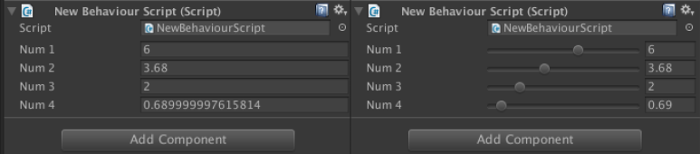
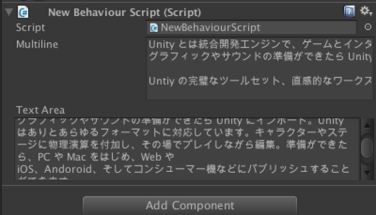
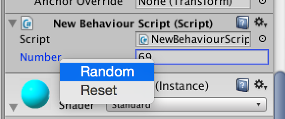
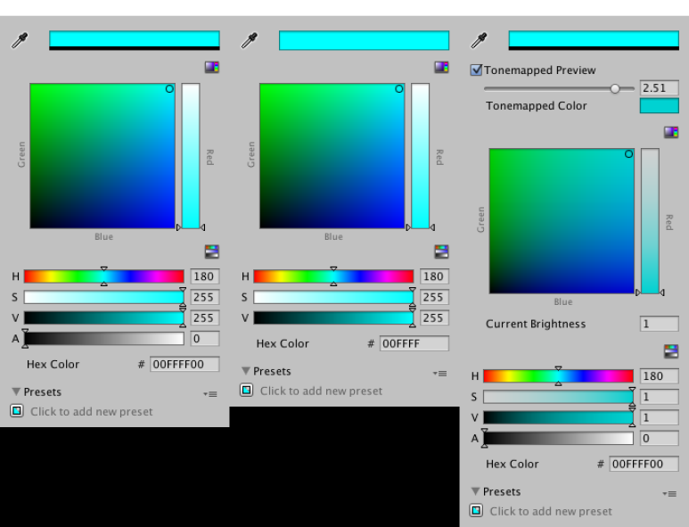
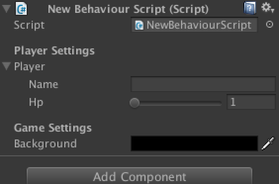
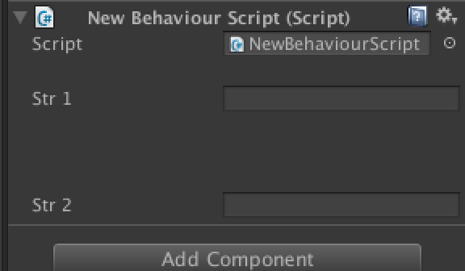
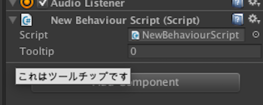
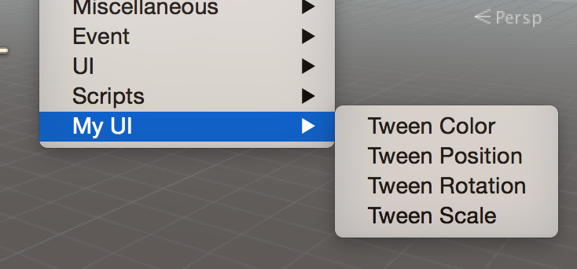
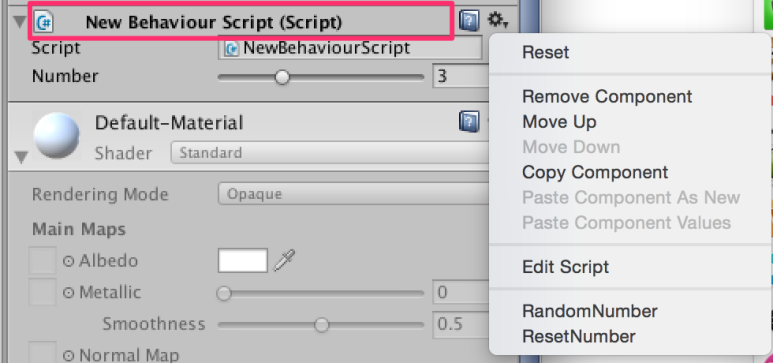
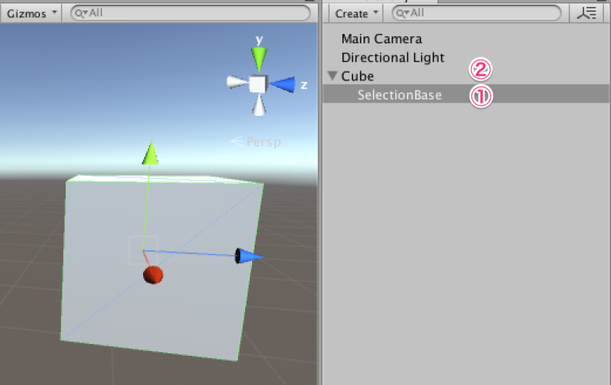

[에디터 확장 입문] 번역 2장 표준에서 사용할 수 있는 에디터 확장기능

번역/유니티/유니티에디터확장입문


><주의>
원문의 작성 시기는 2016년경으로, 코드나 일부 설명이 최신 유니티 버젼과 다소 맞지 않을 수 있습니다.
원문 작성자 분 역시 2019년경에 내용에 다소 오류가 있다는 이유로 웹 공개 버젼을 비공개 처리하였습니다.
(2022.10.08 역자)

원문 링크 (2022.10.08 지금은 폐기)

http://anchan828.github.io/editor-manual/web/part2-standardextension.html

---
목차
- [1. 인스펙터의 외관을 변경](#1-인스펙터의-외관을-변경)
  - [1.1. Range](#11-range)
  - [1.2. Multiline / TextArea](#12-multiline--textarea)
- [2. 인스펙터에서 다루는 기능을 추가](#2-인스펙터에서-다루는-기능을-추가)
  - [2.1. ContextMenuItem](#21-contextmenuitem)
  - [2.2. ColorUsage](#22-colorusage)
- [3. 인스펙터의 외관을 정리](#3-인스펙터의-외관을-정리)
  - [3.1. Header](#31-header)
  - [3.2. Space](#32-space)
  - [3.3. Tooltip](#33-tooltip)
  - [3.4. HideInInspector](#34-hideininspector)
- [4. 인스펙터를 좀 편리하게 하자](#4-인스펙터를-좀-편리하게-하자)
  - [4.1. RequireComponent](#41-requirecomponent)
  - [4.2. DisallowMultipleComponent](#42-disallowmultiplecomponent)
  - [4.3. FormerlySerializedAs](#43-formerlyserializedas)
  - [4.4. AddComponentMenu](#44-addcomponentmenu)
- [5. 게임 개발을 편하게 하자](#5-게임-개발을-편하게-하자)
  - [5.1. ExecuteInEditMode](#51-executeineditmode)
  - [5.2. ContextMenu](#52-contextmenu)
  - [5.3. SelectionBase](#53-selectionbase)


이미 유니티 상에서 준비되어 있는 Attribute를 사용하면 편하고 자유롭게

커스터마이즈 할수 있습니다.


# 1. 인스펙터의 외관을 변경

## 1.1. Range


좌측은 기본상태, 우측이 Range를 사용해 변경한 상태.
```csharp
using UnityEngine;
using System.Collections;

public class NewBehaviourScript : MonoBehaviour
{
    [Range(1, 10)]
    public int num1;

    [Range(1, 10)]
    public float num2;

    [Range(1, 10)]
    public long num3;

    [Range(1, 10)]
    public double num4;
}
```


## 1.2. Multiline / TextArea

기본적으로 1줄짜리 TextField인데, 여러줄의 TextArea로 변경할 수 있습니다.

Multiline도 TextArea랑 별 차이 없는데, Multiline은 폭에 맞춰 자동적으로 줄바꿈되지 않고,

스크롤 바를 표시하지 않으니, 특별한 이유가 없으면 TextArea를 사용하는걸 추천합니다.


```csharp
using UnityEngine;
using System.Collections;

public class NewBehaviourScript : MonoBehaviour
{
    [Multiline(5)]
    public string multiline;

    [TextArea(3, 5)]
    public string textArea;
}
```


# 2. 인스펙터에서 다루는 기능을 추가

## 2.1. ContextMenuItem

인스펙터에 표시되어 있는 변수에 콘텍스트 메뉴를 추가합니다. 다른 변수들도 일제히 수치를 변경하지 않으면 안될 때, 혹은 순서가 필요한 요소를 자동 정렬하고 싶을때 사용하면 되겠습니다. 

컴포넌트 단위로 수치를 리셋시키는 Reset 기능은 있지만 각 변수에 대한 리셋 기능은 없으므로 이 기능을 통해 추가하면 됩니다.



```csharp
using UnityEngine;

public class NewBehaviourScript : MonoBehaviour
{
    [ContextMenuItem ("Random", "RandomNumber")]
    [ContextMenuItem ("Reset", "ResetNumber")]
    public int number;

    void RandomNumber ()
    {
        number = Random.Range (0, 100);
    }

    void ResetNumber ()
    {
        number = 0;
    }
}
```

## 2.2. ColorUsage

색의 변경을 위한 컬러 픽커를 사용합니다. 알파값 사용/미사용, HDR 용 등을 설정할 수 있습니다.


```csharp
using UnityEngine;

public class NewBehaviourScript : MonoBehaviour
{
    public Color color1;

    [ColorUsage (false)]
    public Color color2;

    [ColorUsage (true, true, 0, 8, 0.125f, 3)]
    public Color color3;
}
```

# 3. 인스펙터의 외관을 정리

프로퍼티에 직접 작용하지는 않지만, 외관 정리용으로 사용하는게 있습니다.

## 3.1. Header


```csharp
using UnityEngine;
using System;

public class NewBehaviourScript : MonoBehaviour
{
    [Header("Player Settings")]
    public Player player;

    [Serializable]
    public class Player
    {
        public string name;

        [Range(1,100)]
        public int hp;
    }

    [Header("Game Settings")]
    public Color background;
}
```

## 3.2. Space 

말그대로 공백. 한줄 띄워줍니다.


```csharp
using UnityEngine;

public class NewBehaviourScript : MonoBehaviour
{
    [Space(16)]
    public string str1;

    [Space(48)]
    public string str2;
}
```

## 3.3. Tooltip

프로퍼티에 대한 설명을 인스펙터 상에서 확인하게 만들고 싶을때 사용합니다.


```csharp
using UnityEngine;

public class NewBehaviourScript : MonoBehaviour
{
    [Tooltip("これはツールチップです")]
    public long tooltip;
}
```

## 3.4. HideInInspector

본래 public인 변수는 인스펙터에 표시되지만, 이걸 사용하면 표시 안됩니다.
```csharp
using UnityEngine;

public class NewBehaviourScript : MonoBehaviour
{
    public string str1;

    [HideInInspector]
    public string str2;
}
```

# 4. 인스펙터를 좀 편리하게 하자

## 4.1. RequireComponent

"특정 컴포넌트가 최소 1개는 Attach되어 있어야 한다"고 하는 제약을 거는 Attribute입니다.

Animator와 관련된 스크립트를 작성할때, Animator 컴포넌트가 붙어있어야 한다고 제약을 건다든가.

RequireComponent가 사용된 스크립트를 Attach하면 자동으로 RequireComponent로 지정한 컴포넌트도 Attach됩니다. 이미 Attach되어 있으면 아무것도 안합니다. 그리고 지정된 컴포넌트를 삭제하려고 하면, 삭제할 수 없다고 표시됩니다.

```csharp
using UnityEngine;

[RequireComponent(typeof(Animator))]
public class NewBehaviourScript : MonoBehaviour
{
    Animator animator;

    void Awake ()
    {
        animator = GetComponent<Animator> ();
    }
}
```

## 4.2. DisallowMultipleComponent

하나의 게임 오브젝트에 같은 컴포넌트를 여러개 Attach하는것을 금지하는 Attribute입니다.

2개 이상 같은 컴포넌트 넣고 게임 실행하면 못한다고 표시됩니다.

이 Attribute가 설정된 클래스를 상속한 클래스에도 이 Attribute가 적용됩니다.
```csharp
using UnityEngine;

public class NewBehaviourScript : Base
{
}
using UnityEngine;

[DisallowMultipleComponent]
public class Base : MonoBehaviour
{
}
```

## 4.3. FormerlySerializedAs

변수명을 변경했을때에 새로운 변수명에 데이터를 이동시키기 위한 Attribute입니다.

인스펙터에 표시되듯이, Serialized된 데이터는 변수명을 경로로써 보존합니다. 이런 상태에서 변수명을 바꾸면 변수의 데이터는 초기화됩니다. 그래서 이런 문제를 회피하기 위한 Attribute입니다.

(역주 : using UnityEngine.Serialization; 추가해야함)

```csharp
using UnityEngine;

public class NewBehaviourScript : MonoBehaviour
{
    [SerializeField]
    [FormerlySerializedAs("hoge")]
    string fuga;
}
```
변수명의 변경과 FormerlySerializedAs 추가, oldName의 지정은 동시에 이루어져야 합니다.

스크립트의 컴파일에 의해 필요없는 데이터는 파괴되어버립니다. 변수명 변경하고 한번 컴파일, 그러고 나서 Attribute 추가하고 oldName 지정해봐야 데이터는 이미 날아가고 없다는 것입니다.

## 4.4. AddComponentMenu

Component 메뉴에 메뉴항목을 추가합니다.

스크립트는 모두 Component/Scripts 메뉴의 안에 정리되어 있습니다. 범용적인 스크립트 컴포넌트 군을 작성할 때, 하나의 카테고리에 정리하고 싶을때 사용합니다. 그럴 때 AddComponentMenu를 사용한 스크립트는 다른 장소에 메뉴가 작성되므로 Component/Scripts 메뉴 안에서 소거됩니다.

```csharp
using UnityEngine;

[AddComponentMenu("MyUI/Tween Color")]
public class TweenColor : MonoBehaviour
{
}
```



# 5. 게임 개발을 편하게 하자

## 5.1. ExecuteInEditMode

게임 실행중이 아니어도 MonoBehaviour를 상속한 컴포넌트의 주요 함수가 호출되는 효과가 있습니다. 호출되는 타이밍은 게임 오브젝트가 갱신되는 시점입니다. 

씬 Asset을 더블클릭하면, 유니티에서 씬을 로드하는데, 이 때 Awake와 Start 함수가 호출되고, 인스펙터 등에서의 컴포넌트의 변수가 변경되고 Update가 호출됩니다. 

또한, OnGUI도 호출되므로, GUI가 유니티 에디터의 GUI 렌더링 사이클을 돌면서 표시 상태를 계속 유지합니다.

```csharp
using UnityEngine;

[ExecuteInEditMode]
public class NewBehaviourScript : MonoBehaviour
{
    [Range(0,10)]
    public int number;

    void Awake ()
    {
        Debug.Log ("Awake");
    }

    void Start ()
    {
        Debug.Log ("Start");
    }

    void Update ()
    {
        Debug.Log ("Update");
    }
}
```

## 5.2. ContextMenu

컴포넌트의 컨텍스트 메뉴에서 함수를 실행합니다.

ContextMenuItem과 이름과 기능이 비슷하지만, 추가하는 컨텍스트 메뉴의 장소가 다릅니다.



```csharp
using UnityEngine;

public class NewBehaviourScript : MonoBehaviour
{
    [Range (0, 10)]
    public int number;

    [ContextMenu ("RandomNumber")]
    void RandomNumber ()
    {
        number = Random.Range (0, 100);
    }

    [ContextMenu ("ResetNumber")]
    void ResetNumber ()
    {
        number = 0;
    }
}
```

## 5.3. SelectionBase

씬 뷰에서 오브젝트를 선택했을때 "선택된 게임 오브젝트를 지정"하거나 "게임 오브젝트의 선택 순서를 결정"할 때 사용합니다. 보통, 씬 뷰에서 오브젝트를 선택한 때에는 루트 게임 오브젝트가 선택됩니다.



원래 Cube를 클릭하면 Cube만 선택되는데, 자식 오브젝트에 SelectionBase를 붙이면, Cube를 클릭했을때 자식 오브젝트부터 먼저 선택됩니다.

```csharp
using UnityEngine;

[SelectionBase]
public class NewBehaviourScript : MonoBehaviour
{
}
```