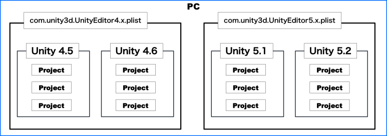
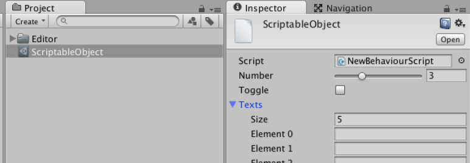
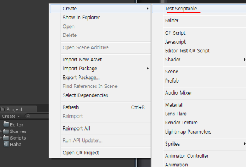

[에디터 확장 입문] 번역 3장 데이터의 보존

번역/유니티/유니티에디터확장입문

><주의>
원문의 작성 시기는 2016년경으로, 코드나 일부 설명이 최신 유니티 버젼과 다소 맞지 않을 수 있습니다.
원문 작성자 분 역시 2019년경에 내용에 다소 오류가 있다는 이유로 웹 공개 버젼을 비공개 처리하였습니다.
(2022.10.08 역자)

원문 링크 (2022.10.08 지금은 폐기)

http://anchan828.github.io/editor-manual/web/data_storage.html

---
목차
- [1. EditorPrefs](#1-editorprefs)
  - [1.1. 영향 범위](#11-영향-범위)
  - [1.2. 뭘 저장하는가](#12-뭘-저장하는가)
  - [1.3. EditorPrefs가 저장되어 있는 장소](#13-editorprefs가-저장되어-있는-장소)
  - [1.4. 사용법](#14-사용법)
- [2. EditorUserSettings.Set/GetConfigValue](#2-editorusersettingssetgetconfigvalue)
  - [2.1. 영향범위와 저장장소](#21-영향범위와-저장장소)
  - [2.2. 뭘 저장하는가](#22-뭘-저장하는가)
  - [2.3. 사용법](#23-사용법)
    - [2.3.1. <저장>](#231-저장)
    - [2.3.2. <저장된거 확인>](#232-저장된거-확인)
- [3. ScriptableObject](#3-scriptableobject)
  - [3.1. 영향 범위](#31-영향-범위)
  - [3.2. 뭘 저장하는가](#32-뭘-저장하는가)
  - [3.3. 저장되는 장소](#33-저장되는-장소)
  - [3.4. 사용법](#34-사용법)
- [4. JSON](#4-json)
  - [4.1. 사용법](#41-사용법)
  - [4.2. JsonUtility와 EditorJsonUtility의 차이](#42-jsonutility와-editorjsonutility의-차이)
  - [4.3. 배열의 사용](#43-배열의-사용)
  - [4.4. Serialize 가능한 클래스의 필드 변수이면 Serialize할수 있음](#44-serialize-가능한-클래스의-필드-변수이면-serialize할수-있음)
  - [4.5. Dictionary의 사용](#45-dictionary의-사용)

에디터 확장에서 기능을 넣을때, 수치를 보존해서 다음에도 사용하고 싶을 때가 있는데, 그 수치는 에디터 확장 설정에 관한 파라미터이기도, 게임에 관련된 파라미터이기도 하고 다양합니다. 유니티에서는 데이터 보존하는 수단이 다양한데 3가지 패턴으로 나뉩니다. 이번 장에서는 그것들을 소개하기로 합니다.


# 1. EditorPrefs

PC 내에서 공유할 수 있는 데이터 보존방법. 프로젝트에 관계없이 유니티 에디터를 통해 수치 공유.


## 1.1. 영향 범위



저장한 수치는 메이져 버젼(4.x, 5,x)이 같으면 공유 가능합니다.


## 1.2. 뭘 저장하는가

윈도우의 위치, 사이즈, 유니티 에디터의 환경설정(Preferences에 있는 설정들) 수치들. 

독자적인 에셋이어도 환경에 따른 설정이면 EditorPrefs를 사용하는 쪽이 좋습니다.

EditorPrefs 경유해서 저장한 수치는 모두 평문으로 보존됩니다. 결코, 패스워드 등의 중요한 정보를 보존하지 않도록 합시다.


## 1.3. EditorPrefs가 저장되어 있는 장소

```
Windows（Unity4.x） 
HKEY_CURRENT_USER\Software\Unity Technologies\UnityEditor 4.x

Windows（Unity5.x） 
HKEY_CURRENT_USER\Software\Unity Technologies\UnityEditor 5.x

Mac OS X（Unity4.x） 
~/Library/Preferences/com.unity3d.UnityEditor4.x.plist

Mac OS X（Unity5.x） 
~/Library/Preferences/com.unity3d.UnityEditor5.x.plist
```


EditorPrefs는 메이져 버젼끼리 나뉘어서 보존됩니다. 특히 Windows는 레지스트리에 수치를 보존합니다. EditorPrefs로만 경유하면 문제는 없지만, 직접 레지스트리를 건드려서 수정하면 그 과정에서 실수로 잘못된 설정을 넣으면 윈도우 자체가 안 돌아가기도 합니다. 


## 1.4. 사용법

OnEnable 등의 1회만 호출되는 함수 안에서 타이밍 잡고 수치를 얻습니다.

수치의 변경 타이밍에 EditorPrefs에 저장하는 식으로.
```csharp
using UnityEngine;
using UnityEditor;

public class ExampleWindow : EditorWindow
{
    int intervalTime = 60;
    const string AUTO_SAVE_INTERVAL_TIME = "AutoSave interval time (sec)";


    [MenuItem ("Window/Example")]
    static void Open ()
    {
        GetWindow <ExampleWindow> ();
    }

    void OnEnable ()
    {
        intervalTime = EditorPrefs.GetInt (AUTO_SAVE_INTERVAL_TIME, 60);
    }

    void OnGUI ()
    {
        EditorGUI.BeginChangeCheck ();

        // 씬 자동저장하는 간격(초 단위)
        intervalTime = EditorGUILayout.IntSlider ("간격（초)", intervalTime, 1, 3600);

        if (EditorGUI.EndChangeCheck ())
            EditorPrefs.SetInt (AUTO_SAVE_INTERVAL_TIME, intervalTime);
    }
}
```

또한, 윈도우 사이즈를 저장할 경우, 그렇게 중요한 수치도 아니라서 OnDisable에서 수치를 저장하는게 적당합니다. 절대 OnGUI 에서 매회 저장하지 않도록 해야 합니다. OnGUI는 호출 빈도가 정말 많은 함수이므로 여기서 저장 처리를 하면 부하가 심합니다.

```csharp
using UnityEngine;
using UnityEditor;

public class ExampleWindow : EditorWindow
{
    const string SIZE_WIDTH_KEY = "ExampleWindow size width";
    const string SIZE_HEIGHT_KEY = "ExampleWindow size height";

    [MenuItem ("Window/Example")]
    static void Open ()
    {
        GetWindow <ExampleWindow> ();
    }

    void OnEnable ()
    {
        var width = EditorPrefs.GetFloat (SIZE_WIDTH_KEY, 600);
        var height = EditorPrefs.GetFloat (SIZE_HEIGHT_KEY, 400);
        position = new Rect (position.x, position.y, width, height);
    }

    void OnDisable ()
    {
        EditorPrefs.SetFloat (SIZE_WIDTH_KEY, position.width);
        EditorPrefs.SetFloat (SIZE_HEIGHT_KEY, position.height);
    }
}
```

# 2. EditorUserSettings.Set/GetConfigValue

프로젝트 안에서 공유할 수 있는 데이터의 보존방법입니다. 여기서 저장되는 수치는 암호화됩니다.

개인정보인 패스워드 등을 저장하면 적당합니다.


## 2.1. 영향범위와 저장장소

이 API로 저장하는 데이터는, 프로젝트 안에서만 영향을 줍니다. 데이터의 저장장소는 Library/EditorUserSettings.asset 에 있고, Library 폴더를 다른 사람이 공유하지 않는 한 정보를 타인과 공유할 수는 없습니다.


## 2.2. 뭘 저장하는가

다양한 툴을 만들면, 로그인을 위한 메일 주소와 패스워드가 필요할 때가 있습니다. Oauth의 접근토큰 등.

EditorUserSettings.asset은 바이너리 형식으로 저장되어 있어, 간단하게 내용을 볼 수는 없습니다. 그래도 유니티가 제공하는 binary2text를 사용하는 것으로 바이너리를 텍스트 형식으로 변환시켜 볼수 있으므로 주의해야 합니다.


## 2.3. 사용법

### 2.3.1. <저장>

```csharp
using UnityEditor;

public class NewBehaviourScript
{
    [InitializeOnLoadMethod]
    static void SaveConfig ()
    {
        EditorUserSettings.SetConfigValue ("Data 1", "text");
    }
}
```
### 2.3.2. <저장된거 확인>
```bash
cd /Applications/Unity/Unity.app/Contents/Tools
./binary2text /path/to/unityproject/Library/EditorUserSettings.asset
```
```bash
External References

ID: 1 (ClassID: 162) EditorUserSettings
    m_ObjectHideFlags 0 (unsigned int)
    m_ConfigValues  (map)
        size 2 (int)
        data  (pair)
            first "Data 1" (string)
            second "17544c12" (string)
        data  (pair)
            first "vcSharedLogLevel" (string)
            second "0a5f5209" (string)

    m_VCAutomaticAdd 1 (bool)
    m_VCDebugCom 0 (bool)
    m_VCDebugCmd 0 (bool)
    m_VCDebugOut 0 (bool)
    m_SemanticMergeMode 2 (int)
    m_VCShowFailedCheckout 1 (bool)
```

# 3. ScriptableObject

프로젝트 안에서 공유할 수 있는 저장방법. 다양한 응용이 가능. 팀 내에서 공유하고싶은 설정, 대량의 데이터를 저장하고 싶을때 사용합니다.

## 3.1. 영향 범위

유니티 프로젝트 내부에서 데이터를 보존하기 위해 주로 사용하는 형식.

프로젝트 내에서 Asset으로써 보존되어 있어 언제든 데이터를 저장할 수 있어, 

언제든지 스크립트에서 데이터를 불러들일 수 있습니다.



```csharp
using UnityEngine;
using UnityEditor;

[CreateAssetMenu]
public class NewBehaviourScript : ScriptableObject
{
    [Range(0,10)]
    public int number = 3;

    public bool toggle = false;

    public string[] texts = new string[5];
}
```

(역주 : 위 코드처럼 스크립트 파일을 만들면 아래와 같이 Project 뷰 Create 메뉴에 ScriptableObject를 만드는 메뉴가 생깁니다.)



## 3.2. 뭘 저장하는가

에디터 확장에서 작성한 Asset의 데이터나 설정 파일, 빌드 후에 게임 데이터로써 사용하는 데이터 베이스로서의 역할.


## 3.3. 저장되는 장소

Project의 Assets 폴더 내부라면 어디에든 저장할수 있음. 에디터 확장 전용의 ScriptableObject이면 Editor 폴더 내부에 작성하는 편이 좋습니다.


## 3.4. 사용법

얘기할게 많으므로 4장에서 다루기로 합니다.


# 4. JSON

텍스트 형식의 경량 데이터 작성언어의 일종. 일반적으로 Web이나 서버에서 데이터를 얻을 때에 데이터 형식으로써 사용되는데, 그 뿐만 아니라 폭넓은 분야에 이용됩니다.

유니티 5.3부터 정식으로 JsonUtility 클래스가 추가되었고, JSON에 정식 대응할수 있게 되었습니다.

단, 보통 사용하는 JSON 라이브러리보다 고속이지만 고성능인것은 아니고, 사용에 한계가 있습니다.

오브젝트를 JSON으로 변환하는 조건은 유니티의 Serializer에서의 조건과 같은데, 다음과 같습니다.

```
1. 클래스에 [Serializable] 속성이 있을것.
2. 필드에 [SerializeField] 속성이 있을것. 혹은 public 변수일것.
3. 그외, 세부사항은 5장 [SerializedObject 에 대해서] 를 참조.
```


유니티의 Serializer를 사용한다는 것은, Serializer가 대응할수 없는 것은 JSON으로도 못한다는 것입니다.

```
1. Dictionary 는 Serialize할 수 없음
2. object[]、List<object> 같은 object 배열은 Serialize 할 수 없음
3. 배열 오브젝트를 그대로 넘겨주어도 Serialize할 수 없음(JsonUtility.ToJson(List<T>) 가 불가능)
```
  
## 4.1. 사용법

단순하게 JsonUtility.ToJson과 JsonUtility.FromJson을 호출하면 오브젝트와 JSON의 변환이 가능.

```csharp
[Serializable]
public class Example
{
    [SerializeField]
    string name = "hoge";

    [SerializeField]
    int number = 10;
}

/*
아래와 같은 JSON 데이터가 출력됨
{
    "name": "hoge",
    "number": 10
}
*/
Debug.Log(JsonUtility.ToJson(new Example(), true));
```

## 4.2. JsonUtility와 EditorJsonUtility의 차이

JsonUtility로는 UnityEngine.Object는 JSON으로 변환 할수 없습니다.(변환할수 없는걸로 되어 있는데, ScriptableObject를 포함한 일부 오브젝트는 가능)

UnityEngine.Object를 JSON으로 변환시키려면 에디터 전용의 EditorJsonUtility를 사용합니다. 단, EditorJsonUtility는, 배열에는 대응할 수 없어서 좀 연구가 필요합니다.

EditorJsonUtility의 배열대응은, 좀 무리가 있지만 최종적인 JSON 형식의 문자열의 연결로 작성합니다.

```csharp
/*
아래와 같은 JSON 을 얻을 수 있음
{"key이름":[{"name":"hoge"},{"name":"hoge"}]}
*/
public static string ToJson(string key, Object[] objs)
{
    var json = objs.Select(obj => EditorJsonUtility.ToJson(obj)).ToArray();
    var values = string.Join(",", json);
    return string.Format("{\"{0}\":{1}]}", key, values);;
}
```

## 4.3. 배열의 사용

많은 Json 라이브러리에서는 배열의 Serialize도 할수 있도록 되어 있습니다. 하지만 유니티는 사용해도 Serialize가 안됩니다. 

```csharp
var list = new List<Example>{
  new Example(),
  new Example()
};

/*
{} 가 반환됨.
우리가 얻고 싶은건 아래와 같은 배열
[{"name":"hoge","number":10},{"name":"hoge","number":10}]
*/
JsonUtility.ToJson(list)
```

꼭 배열만을 Serialize하고 싶다면 좀더 연구해봐야 할 것입니다.


## 4.4. Serialize 가능한 클래스의 필드 변수이면 Serialize할수 있음

Serialize할수 있는것은 클래스의 필드 변수이므로, 먼저 그 상태를 만들어봅니다.

아래 코드는, List를 Serialize하기 위해 범용성을 생각해 작성한 SerializableList 클래스입니다.

```csharp
/*
사용법은 List와 거의 같음(AddRange가 없으므로 자작함)
*/
[Serializable]
public class SerializableList<T> : Collection<T>, ISerializationCallbackReceiver
{
    [SerializeField]
    List<T> items;

    public void OnBeforeSerialize()
    {
        items = (List<T>)Items;
    }

    public void OnAfterDeserialize()
    {
        Clear();
        foreach (var item in items)
            Add(item);
    }
}
```
이것을 JsonUtility로 Serialize하면 다음 결과를 얻을 수 있습니다.

```csharp
var serializedList = new SerializableList<Example>
{
    new Example(),
    new Example()
};

/*
아래와 같은 JSON을 얻을 수 있음
{"items":[{"name":"hoge","number":10},{"name":"hoge","number":10}]}
*/
Debug.Log(JsonUtility.ToJson(serializedList));
```

이걸로 남은건 ISerializationCallbackReceiver의 존재.

JsonUtility에서 JSON으로 변환할 때, ISerialization CallbackReceiver의 OnBeforeSerialize와 OnAfterDeserialize가 호출됩니다. 이들을 이용해서, ToJson이 호출될때만 오브젝트를 Serialize 가능한 필드로 대입시키는 걸로 목적을 달성할수 있습니다.

Serialize 가능한 것은 좋은데, 최종적으로는 JSON 형식이 아니라 배열 형식으로 표시 가능하게 하는 편이 좋을거 같습니다("items"의 key가 필요 없어짐).

그래서 SerializableList 클래스 안에 ToJson 함수를 작성해서 문자열 커스터마이즈가 가능하도록 합니다.

```csharp
public string ToJson()
{
    var result = "[]"
    var json = JsonUtility.ToJson(this);
    var regex = new Regex("^{\"items\":(?<array>.*)}$");
    var match = regex.Match(json);
    if (match.Success)
        result = match.Groups["array"].Value;

    return result;
}
```
이 ToJson 함수를 사용하면, 아래의 결과를 얻을 수 있습니다.

```csharp
var serializedList = new SerializableList<Example>
{
    new Example(),
    new Example()
};

/*
아래의 문자열이 출력됨.
[{"name":"hoge","number":10},{"name":"hoge","number":10}]
*/
Debug.Log(serializedList.ToJson());
```

단 이런 방식이면 Deserialize를 할 수 없으므로 FromJson도 작성합니다.

```csharp
public static SerializableList<T> FromJson(string arrayString)
{
    var json = "{\"items\":" + arrayString + "}";
    return JsonUtility.FromJson<SerializableList<T>>(json);
}
```

이걸로 Deserialize도 할 수 있게 되었습니다.

```csharp
var serializedList = new SerializableList<Example>
{
    new Example(),
    new Example()
};

var json = serializedList.ToJson();
var serializableList = SerializableList<Example>.FromJson(json);
// Example 오브젝트를 두개 얻을 수 있습니다
Debug.Log(serializableList.Count == 2);
```

SerializableList.cs

```csharp
using System;
using System.Collections.Generic;
using System.Collections.ObjectModel;
using System.Text.RegularExpressions;
using UnityEngine;

[Serializable]
public class SerializableList<T> : Collection<T>, ISerializationCallbackReceiver
{
    [SerializeField]
    List<T> items;

    public void OnBeforeSerialize()
    {
        items = (List<T>)Items;
    }

    public void OnAfterDeserialize()
    {
        Clear();
        foreach (var item in items)
            Add(item);
    }

    public string ToJson(bool prettyPrint = false)
    {
        var result = "[]";
        var json = JsonUtility.ToJson(this, prettyPrint);
        var pattern = prettyPrint ? "^\\{\n\\s+\"items\":\\s(?<array>.*)\n\\s+\\]\n}$" : "^{\"items\":(?<array>.*)}$";
        var regex = new Regex(pattern, RegexOptions.Singleline);
        var match = regex.Match(json);
        if (match.Success)
        {
            result = match.Groups["array"].Value;
            if (prettyPrint)
                result += "\n]";
        }
        return result;
    }

    public static SerializableList<T> FromJson(string arrayString)
    {
        var json = "{\"items\":" + arrayString + "}";

        return JsonUtility.FromJson<SerializableList<T>>(json);
    }
}
```

## 4.5. Dictionary의 사용

JsonUtility에서 Dictionary의 사용은 매우 어렵습니다. 일반적으로 JSON 라이브러리 같은 serialize는 유니티에서는 못하기 때문에, 거의 모든 기능을 스스로 만들어야 합니다. 이렇게 되면 JsonUtility를 사용하는 의미도 없어지므로 MiniJSON을 사용하든가, 유니티에 대응하는 다른 JSON 라이브러리를 사용하는게 좋습니다.
