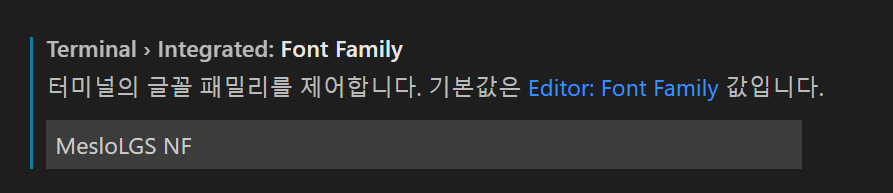
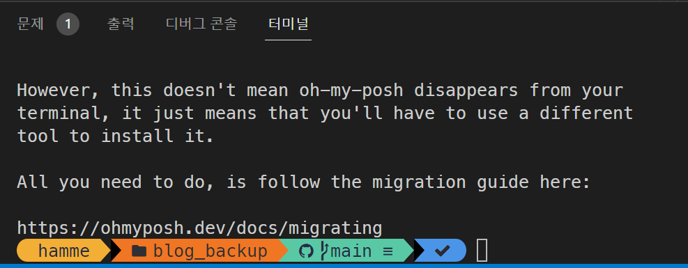

OhMyPosh 적용 후 VS Code 터미널 폰트 깨짐 수정 방법

마크다운/팁/문제해결/vscode/ohmyposh

목차
- [1. 현상](#1-현상)
- [2. 원인](#2-원인)
- [3. 수정](#3-수정)

# 1. 현상
윈도우 터미널에 OhMyPosh 테마 적용 후, VS Code 에서 터미널 란을 확인하면 정식 윈도우 터미널에서는 테마 폰트 제대로 적용되서 나오는데, VS Code 의 터미널에서는 폰트가 제대로 적용되지 않아 깨져서 나오는 경우가 있을 수 있습니다.

# 2. 원인
VS Code의 설정에서 터미널 전용 폰트를 제대로 설정하지 않아 발생한 문제입니다.

# 3. 수정
- VS Code 에서 <code>파일 - 기본 설정 - 설정</code> 을 선택합니다.

- Terminal Font Family 설정을 찾아서 터미널에서 쓰는 전용 폰트를 설정합니다. (제 경우엔 Nerd Font를 사용하고 있어서 그걸로 지정했습니다.)

- VS Code 터미널에서 정상적으로 폰트 출력되는지 확인합니다.
