[에디터 확장 입문] 번역 4장 ScriptableObject

번역/유니티/유니티에디터확장입문

><주의>
원문의 작성 시기는 2016년경으로, 코드나 일부 설명이 최신 유니티 버젼과 다소 맞지 않을 수 있습니다.
원문 작성자 분 역시 2019년경에 내용에 다소 오류가 있다는 이유로 웹 공개 버젼을 비공개 처리하였습니다.
(2022.10.08 역자)

원문 링크 (2022.10.08 지금은 폐기)
http://anchan828.github.io/editor-manual/web/scriptableobject.html

---

목차
- [1. ScriptableObject란](#1-scriptableobject란)
- [2. ScriptableObject는 유니티 에디터의 요소](#2-scriptableobject는-유니티-에디터의-요소)
- [3. ScriptableObject를 작성](#3-scriptableobject를-작성)
  - [3.1. 인스턴스 화](#31-인스턴스-화)
  - [3.2. Asset으로 저장](#32-asset으로-저장)
  - [3.3. 스크립트에서 Asset의 ScriptableObject를 로드](#33-스크립트에서-asset의-scriptableobject를-로드)
  - [3.4. 인스펙터에 프로퍼티를 표시](#34-인스펙터에-프로퍼티를-표시)
- [4. ScriptableObjecet의 부모 자식 관계](#4-scriptableobjecet의-부모-자식-관계)
  - [4.1. <부모 ScriptableObject>](#41-부모-scriptableobject)
  - [4.2. <자식 ScriptableObject>](#42-자식-scriptableobject)
  - [4.3. <자식 ScriptableObject>](#43-자식-scriptableobject)
  - [4.4. UnityEngine.Object를 Asset으로써 다루기 위해서는 디스크에 저장해야 합니다](#44-unityengineobject를-asset으로써-다루기-위해서는-디스크에-저장해야-합니다)
  - [4.5. ScriptableObject는 모두 Asset으로써 저장할것](#45-scriptableobject는-모두-asset으로써-저장할것)
  - [4.6. Sub Asset](#46-sub-asset)
  - [4.7. AssetDatabase.AddObjectToAsset](#47-assetdatabaseaddobjecttoasset)
    - [4.7.1. <자식 ScriptableObject>](#471-자식-scriptableobject)
  - [4.8. HideFlags.HideInHierarchy로 Sub Asset을 숨기기](#48-hideflagshideinhierarchy로-sub-asset을-숨기기)
  - [4.9. 메인 Asset에서 Sub Asset을 제거하기](#49-메인-asset에서-sub-asset을-제거하기)
- [5. 아이콘의 변경](#5-아이콘의-변경)
  - [5.1. 스크립트에 아이콘을 설정](#51-스크립트에-아이콘을-설정)
  - [5.2. Gismos에 아이콘을 설정](#52-gismos에-아이콘을-설정)

# 1. ScriptableObject란

ScriptableObject란 독자적인 Asset을 작성하기 위한 구조입니다. 또한, 유니티의 Serialize 구조를 사용하는 형식이라고도 할 수 있습니다.

유니티에서는 독자적인 Serialize 구조를 갖고 있어, 모든 오브젝트(UnityEngine.Object)는 그 Serialize 구조를 통해서 데이터의 Serialize / Deserialize를 실행해, 파일과 Unity 에디터간의 조합을 하고 있습니다. Serialize 구조에 대해서는 5장 SerializedObject에 대해서 를 참조하시기 바랍니다.


유니티 내부의 Asset(Material과 애니메이션 클립 등)은 모두 UnityEngine.Object의 자식 클래스입니다. 독자적인 Asset을 만들기 위해서, UnityEngine.Object의 자식 클래스를 작성하고 싶은데, 유저 측에서는 UnityEngine.Object의 자식 클래스를 작성하는게 금지되어 있습니다. 유저가 Unity의 Serialize 구조를 이용한, 독자적인 Asset을 작성하기 위해서는 ScriptableObject를 사용할 필요가 있습니다.


# 2. ScriptableObject는 유니티 에디터의 요소

ScriptableObject는 유니티 에디터의 다양한 곳에서 사용되고 있습니다. 씬 뷰나 게임 뷰 등의 에디터 윈도우는, ScriptableObject의 자식 클래스에서 생성되고, 또한 인스펙터에 GUI를 표시하는 Editor 오브젝트도 ScriptableObject의 자식 클래스에서 생성됩니다. 유니티 에디터는 ScriptableObject로 작성되어 있다고 해도 과언이 아닙니다.
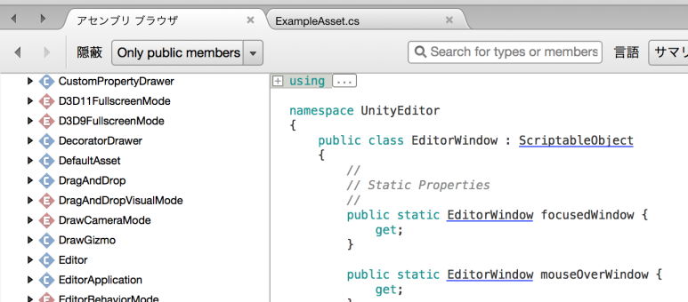


# 3. ScriptableObject를 작성

ScriptableObject를 작성하기 위해서는 먼저 ScriptableObject 클래스를 상속한 클래스를 작성해야합니다. 이때, 클래스 이름과 Asset이름은 통일시켜야 합니다. MonoBehaviour와 같은 제한을 가집니다.

```csharp
using UnityEngine;

public class ExampleAsset : ScriptableObject
{

}
```

## 3.1. 인스턴스 화
ScriptableObject는 ScriptableObject.CreateInstance로 생성합니다. new를 사용해서 인스턴스 화해선 안됩니다. 이유는 MonoBehaviour와 마찬가지로, 유니티의 Serialize 구조를 경유해서 오브젝트를 만들 필요가 있으니까.
```csharp
using UnityEngine;
using UnityEditor;

public class ExampleAsset : ScriptableObject
{
    [MenuItem ("Example/Create ExampleAsset Instance")]
    static void CreateExampleAssetInstance ()
    {
        var exampleAsset = CreateInstance<ExampleAsset> ();
    }
}
```


## 3.2. Asset으로 저장

다음은 인스턴스화시킨 오브젝트를 Asset으로 저장시킵니다. Asset의 작성은 AssetDatabase.CreateAsset을 사용해서 작성할 수 있습니다.

Asset의 확장자는, 반드시, .asset이 아니면 안됩니다. 다른 확장자로 해버리면, 유니티는 ScriptableObejct를 상속한 Asset으로서 인식하지 못합니다.

```csharp
[MenuItem ("Example/Create ExampleAsset")]
static void CreateExampleAsset ()
{
    var exampleAsset = CreateInstance<ExampleAsset> ();

    AssetDatabase.CreateAsset (exampleAsset, "Assets/Editor/ExampleAsset.asset");
    AssetDatabase.Refresh ();
}
```

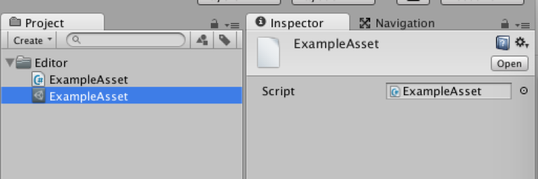

또한, CreateAssetMenu 속성을 사용하는 것으로 간단하게 Asset을 작성할 수 있습니다.

```csharp
using UnityEngine;
using UnityEditor;

[CreateAssetMenu(menuName = "Example/Create ExampleAsset Instance")]
public class ExampleAsset : ScriptableObject
{
}
```

CreateAssetMenu를 사용한 경우에는 "Assets/Create" 아래에 메뉴가 작성됩니다.

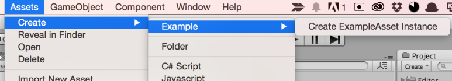


## 3.3. 스크립트에서 Asset의 ScriptableObject를 로드

불러들이는 방법은 간단한데, AssetDatabase.LoadAssetAtPath를 사용해 불러들입니다.

```csharp
[MenuItem ("Example/Load ExampleAsset")]
static void LoadExampleAsset ()
{
    var exampleAsset =
    　　　　AssetDatabase.LoadAssetAtPath<ExampleAsset>
                               ("Assets/Editor/ExampleAsset.asset");
}
```

## 3.4. 인스펙터에 프로퍼티를 표시

MonoBehaviour와 마찬가지로, 필드에 SerializeField를 붙이면 표시됩니다. 또한 PropertyDrawer도 적용시킵니다.

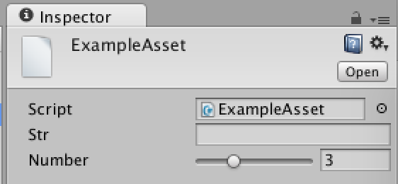


```csharp
using UnityEngine;
using UnityEditor;

public class ExampleAsset : ScriptableObject
{
    [SerializeField]
    string str;

    [SerializeField, Range (0, 10)]
    int number;

    [MenuItem ("Example/Create ExampleAsset Instance")]
    static void CreateExampleAssetInstance ()
    {
        var exampleAsset = CreateInstance<ExampleAsset> ();

        AssetDatabase.CreateAsset (exampleAsset, "Assets/Editor/ExampleAsset.asset");
        AssetDatabase.Refresh ();
    }
}
```

# 4. ScriptableObjecet의 부모 자식 관계

먼저, "부모인 ScriptableObject"와, 그 부모가 변수로서 가지는 "자식인 ScriptableObject"를 상상해주세요. 아래 코드는 그 이미지를 코드로 옮긴겁니다.

## 4.1. <부모 ScriptableObject>

```csharp
using UnityEngine;

public class ParentScriptableObject : ScriptableObject
{
    [SerializeField]
    ChildScriptableObject child;
}
```


## 4.2. <자식 ScriptableObject>

```csharp
using UnityEngine;

public class ChildScriptableObject : ScriptableObject
{
  // 아무것도 없으면 인스펙터가 허전하므로 변수 추가
  [SerializeField]
  string str;

  public ChildScriptableObject ()
  {
    // 초기 Asset 이름을 설정
    name = "New ChildScriptableObject";
  }
}
```

다음으로, ParentScriptableObject를 Asset으로 해서 저장합니다. child도 인스턴스화시킨 상태로 해봤습니다. 

## 4.3. <자식 ScriptableObject>
```csharp
using UnityEngine;
using UnityEditor;

public class ParentScriptableObject : ScriptableObject
{
  const string PATH = "Assets/Editor/New ParentScriptableObject.asset";

  [SerializeField]
  ChildScriptableObject child;

  [MenuItem ("Assets/Create ScriptableObject")]
  static void CreateScriptableObject ()
  {
    // 부모를 인스턴스화
    var parent = ScriptableObject.CreateInstance<ParentScriptableObject> ();

    // 자식을 인스턴스화
    parent.child = ScriptableObject.CreateInstance<ChildScriptableObject> ();

    // 부모를 Asset으로 저장
    AssetDatabase.CreateAsset (parent, PATH);

    // Import 해서 최신 상태로 함
    AssetDatabase.ImportAsset (PATH);
  }
}
```

ParentScriptableObject를 Asset으로 저장한 후, 인스펙터를 보면, child 프로퍼티가 Type mismatch로 되어 있습니다. 

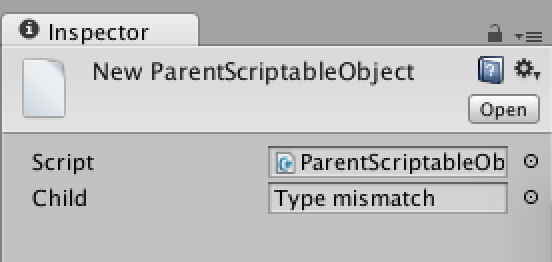


시험삼아, Type mismatch 부분을 더블클릭하면, ChildScriptableObject의 정보가 인스펙터에 표시되어, 문제 없이 올바른 동작을 하는걸 볼 수 있습니다.


## 4.4. UnityEngine.Object를 Asset으로써 다루기 위해서는 디스크에 저장해야 합니다

Type mismatch 상태의 child를 가진 ParentScriptableObject를 만들었으면, 그대로 유니티를 다시 실행해보세요. 또다시 ParentScriptableObject의 인스펙터를 보면 child 부분이 None(null)로 되어 있습니다.

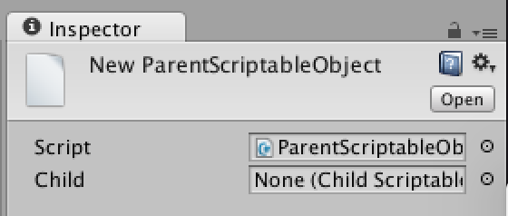


이유는 ScriptableObject의 루트 클래스인 UnityEngine.Objec를 Serialize 데이터로써 다루기 위해서는, 디스크 상에 저장해야 하기 때문입니다. Type mismatch 상태는, 인스턴스가 존재하지만, 디스크 상에 Asset으로써 존재하지 않는 상태를 가리킵니다. 즉, 그 인스턴스가 어떤 상황(유니티 재시작 등)에서 파괴되어버리면 데이터에 접근할 수 없게 됩니다.


## 4.5. ScriptableObject는 모두 Asset으로써 저장할것

Type mismatch 상태를 회피하는것은 간단합니다. ScriptableObject를 모두 Asset으로써 저장해, 그 참조를 Serialize 가능한 필드로 가지면 해결됩니다.

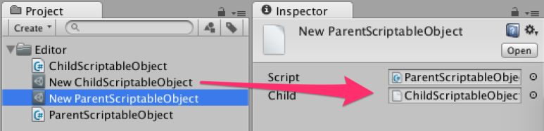


단, 이번과 같은 부모 자식 관계가 있는 상태에서, 각자 독립된 Asset을 작성해버리는것은 관리 면에서 보면 효율적이지 않습니다. 그 수가 늘어나거나, 리스트를 다루는 경우가 되면 그 만큼 Asset을 작성하는 것은 파일 관리가 매우 귀찮아집니다.


그래서 Sub Asset이라는 기능을 사용해 부모 자식 관계인 Asset을 하나로 뭉칠 수 있습니다.


## 4.6. Sub Asset

부모인 메인 Asset에 Asset 정보를 추가하는 것으로 UnityEngine.Object가 Sub Asset이 됩니다. 이 Sub Asset의 예시로 가장 알기 쉬운게 Model Asset입니다.

Model Asset의 안에는, 메쉬와 애니메이션 등의 Asset이 포함되어 있습니다. 이들은 보통, 독립된 Asset으로 존재해야 하지만, Sub Asset으로써 다뤄지면, 메쉬와 애니메이션 등의 Asset을 메인 Asset 정보에 포함해 디스크 상에 저장하는 일 없이 사용할 수 있습니다.

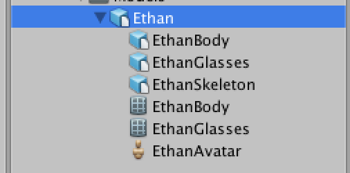


ScriptableObject도 Sub Asset의 기능을 사용하는 것으로, 디스크 상에 쓸데없는 Asset을 늘리지 않고 부모 자식 관계의 ScriptableObject를 만들 수 있습니다.

## 4.7. AssetDatabase.AddObjectToAsset

UnityEngine.Object를 Sub Asset으로써 등록하기 위해서는, 메인이 되는 Asset에 오브젝트를 추가합니다.


### 4.7.1. <자식 ScriptableObject>
```csharp
using UnityEngine;
using UnityEditor;

public class ParentScriptableObject : ScriptableObject
{
  const string PATH = "Assets/Editor/New ParentScriptableObject.asset";

  [SerializeField]
  ChildScriptableObject child;

  [MenuItem ("Assets/Create ScriptableObject")]
  static void CreateScriptableObject ()
  {
    // 부모를 인스턴스화 
    var parent = ScriptableObject.CreateInstance<ParentScriptableObject> ();

    // 자식을 인스턴스화
    parent.child = ScriptableObject.CreateInstance<ChildScriptableObject> ();

    // 부모에 자식 오브젝트를 추가
    AssetDatabase.AddObjectToAsset (parent.child, PATH);

    // 부모를 Asset으로서 저장
    AssetDatabase.CreateAsset (parent, PATH);

    // Import 해서 최신 상태를 유지
    AssetDatabase.ImportAsset (PATH);
  }
}
```

부모인 ParentScriptableObject가 둘 있는듯 보이는 점, 실질적인 데이터를 가지고 있는 것은 계층적으로는 Sub Asset의 ParentScriptableObject인 점 등 좀 특수한 계층구조로 되어 있습니다. 

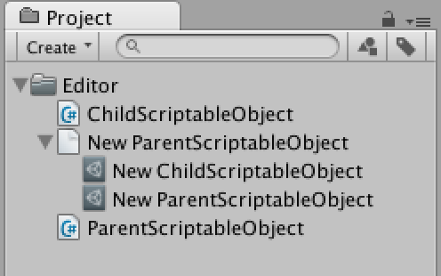


이 상태는, 유저가 (Sub Asset을 작성하는 것으로 인해) 특수한 Asset을 만들었다고 유니티가 판단해서, 메인 Asset을 아무것도 맡지 않은 Default Asset으로써 표시한 상태입니다.

메인 Asset으로써 다루고 싶은 Asset을 Sub Asset 쪽에 이동시키는 상황은 매우 안좋습니다. 이런 식으로 유저의 손으로 Sub Asset을 작성하는 것은 할 수 있지만, 이걸 Model같이 최대한 활용하는것은 안됩니다.


## 4.8. HideFlags.HideInHierarchy로 Sub Asset을 숨기기

Sub Asset 자체를 숨기는 것으로, 메인 Asset만이 존재하는듯이 외관을 만들 수 있습니다.

```csharp
[MenuItem ("Assets/Create ScriptableObject")]
static void CreateScriptableObject ()
{
  var parent = ScriptableObject.CreateInstance<ParentScriptableObject> ();
  parent.child = ScriptableObject.CreateInstance<ChildScriptableObject> ();

　// Sub Asset인 child 를 표시하지 않는다
  parent.child.hideFlags = HideFlags.HideInHierarchy;

  AssetDatabase.AddObjectToAsset (parent.child, PATH);

  AssetDatabase.CreateAsset (parent, PATH);
  AssetDatabase.ImportAsset (PATH);
}
```


이와 같이, 계층 표시는 안되지만 2개의 Asset을 하나로 뭉쳐 관리할 수 있게 되었습니다.

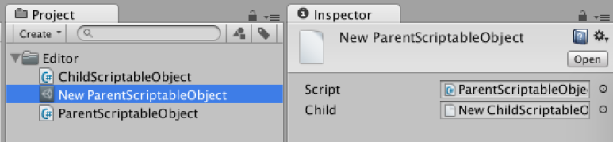


이 Sub Asset을 숨기는 방법은, AnimatorController에서도 이루어지고 있습니다. 확인해봅시다.

```csharp
[MenuItem ("Assets/Set to HideFlags.None")]
static void SetHideFlags ()
{
  // AnimatorController를 선택한 상태에서 메뉴를 실행
  var path = AssetDatabase.GetAssetPath (Selection.activeObject);

  // Sub Asset 포함해서 모두 얻기
  foreach (var item in AssetDatabase.LoadAllAssetsAtPath(path)) {
    // flag를 모두 None으로 하고 비표시 설정을 해제
    item.hideFlags = HideFlags.None;
  }
  // 다시 Import해서 최신 상태로 유지
  AssetDatabase.ImportAsset (path);
}
```
위에 적은 코드를 실행하면, HideFlags가 해제되어, Sub Asset이 표시됩니다.

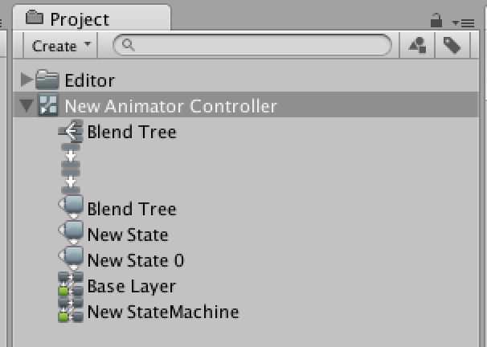


## 4.9. 메인 Asset에서 Sub Asset을 제거하기

Sub Asset의 제거 방법은 간단합니다. Object.DestroyImmediate를 사용하는 것으로 Sub Asset을 해제할 수 있습니다.

```csharp
[MenuItem ("Assets/Remove ChildScriptableObject")]
static void Remove ()
{
  var parent = AssetDatabase.LoadAssetAtPath<ParentScriptableObject> (PATH);

  // Asset의 CarentScriptableObject 를 파괴
  Object.DestroyImmediate (parent.child, true);

  // 파괴하면 Missing 상태가 되므로 null 을 대입
  parent.child = null;

  // 다시 Import해서 최신 상태를 갱신
  AssetDatabase.ImportAsset (PATH);
}
```

# 5. 아이콘의 변경

기본 아이콘


딱히 중요한 부분은 아닌데 이 아이콘을 변경하는 방법을 알아봅시다.


## 5.1. 스크립트에 아이콘을 설정

스크립트 Asset을 선택해서 아이콘 부분을 선택하면, 아이콘 변경 패널이 뜨고, 거기에 Other 버튼을 클릭하면 변경하고싶은 아이콘으로 변경 가능.

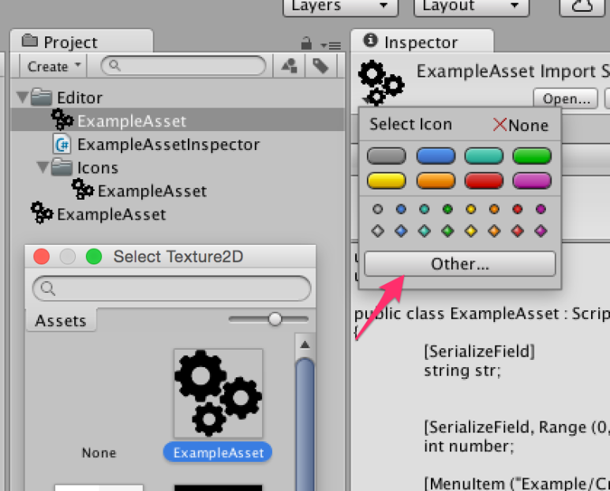

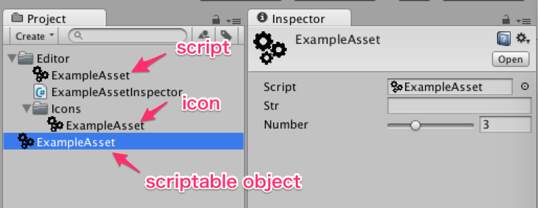


## 5.2. Gismos에 아이콘을 설정

한가지 아이콘을 변경하는 방법으로써는, Gizmos 폴더에 "클래스 명" Icon이라고 이름지어서 이미지를 넣으면 변경됩니다. Gizmos 폴더가 Assets 폴더 아래에 있어야 하는 형태로 쓰기 힘들지도 모르겠는데, 같은 아이콘 이미지가 3개 늘어놔져 있어도 괜찮다는 점에서, 이 방법도 기억해두면 편리합니다.

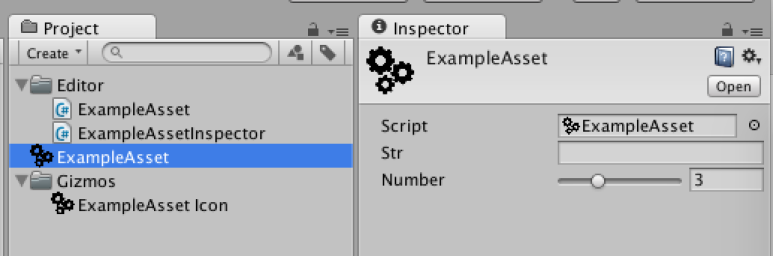