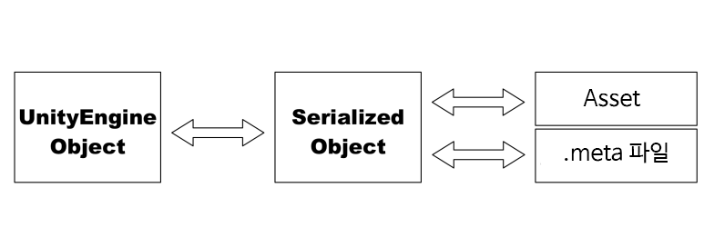
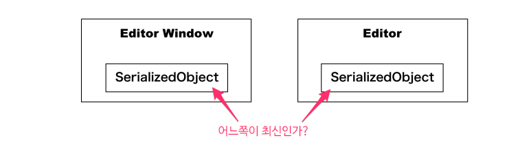

[에디터 확장 입문] 번역 5장 SerializedObject에 대해서 

번역/유니티/유니티에디터확장입문


><주의>
원문의 작성 시기는 2016년경으로, 코드나 일부 설명이 최신 유니티 버젼과 다소 맞지 않을 수 있습니다.
원문 작성자 분 역시 2019년경에 내용에 다소 오류가 있다는 이유로 웹 공개 버젼을 비공개 처리하였습니다.
(2022.10.08 역자)

원문 링크 (2022.10.08 지금은 폐기)

http://anchan828.github.io/editor-manual/web/serializedobject.html

---
목차
- [1. SerializedObject란](#1-serializedobject란)
  - [1.1. UnityEngine.Object와 SerializedObject의 관계](#11-unityengineobject와-serializedobject의-관계)
    - [1.1.1. Undo의 조작](#111-undo의-조작)
    - [1.1.2. Selection의 조작](#112-selection의-조작)
  - [1.2. Asset과 SerializedObject의 관계](#12-asset과-serializedobject의-관계)
  - [1.3. Asset과 .meta 파일](#13-asset과-meta-파일)
  - [1.4. Serialize 대상의 클래스 변수](#14-serialize-대상의-클래스-변수)
- [2. SerializedObject의 사용법](#2-serializedobject의-사용법)
  - [2.1. SerializedObject에서 파라미터를 얻기](#21-serializedobject에서-파라미터를-얻기)
  - [2.2. 최신 데이터를 얻고 갱신하기](#22-최신-데이터를-얻고-갱신하기)
    - [2.2.1. Update](#221-update)
    - [2.2.2. ApplyModifiedProperties](#222-applymodifiedproperties)
- [3. 여러개의 UnityEngine.Object를 1개의 SerializedObject로 다루기](#3-여러개의-unityengineobject를-1개의-serializedobject로-다루기)
- [4. 프로퍼티 이름을 알기 위해서는](#4-프로퍼티-이름을-알기-위해서는)
  - [4.1. SerializedObject.GetIterator](#41-serializedobjectgetiterator)
  - [4.2. [Asset을 텍스트에디터로 보기]](#42-asset을-텍스트에디터로-보기)

유니티에서는 파일(유니티의 Asset)을 조금 특수한 형식으로 변환시켜 사용합니다. 본 장에서는, 유니티에서 오브젝트를 다룰 때 기반으로 하는 SerializedObject에 대해서 해설합니다. 또한, "Serialize에 대한 모든 것을 망라한 정보"는 유니티 공식 메뉴얼에 설명되어 있습니다. 본 장에서는 입문으로써 알아야 하는 정보를 해설합니다.

http://docs.unity3d.com/Manual/script-Serialization.html


# 1. SerializedObject란

SerializedObject는, Serialize된 데이터를 Unity에서 다루기 쉬운 쪽으로 가공한 것입니다. 이로 인해, 다양한 데이터에 접근할 수 있습니다. 또한 Undo 처리와 게임 오브젝트에서 Prefab를 쉽게 작성할 수 있도록 합니다.

SerializedObject는, Unity 상에서 다루는 모든 오브젝트와 관계되어 있습니다. 보통 다루고 있는 Asset(재질이나 텍스쳐, 애니메이션 클립 등)도 SerializedObject가 없으면 만들 수 없습니다.

## 1.1. UnityEngine.Object와 SerializedObject의 관계

유니티 에디터 상에서는, 모든 오브젝트(UnityEngine.Object)는 SerializedObject로 변환되어 다루어집니다. 인스펙터에서 컴포넌트의 수치를 편집할 때도, Component의 인스턴스를 편집하고 있는게 아니라, SerializedObject의 인스턴스를 편집하고 있는 것입니다.


유니티 에디터 상에서는 반드시 SerializedObject 경유로 수치를 편집합니다. 단, CustomEditor를 껴넣은 경우에는 아닙니다.

유니티 에디터 상에서, 즉 에디터 확장에서는 가능한 한 모든 오브젝트 조작을 SerializedObject에서 실행할 필요가 있습니다. 그렇기 때문에 SerializedObject에서는 Serialize된 데이터를 다루는 것 뿐만 아니라 Undo 나 Selection의 조작도 실행합니다.

### 1.1.1. Undo의 조작

SerializedObject에서 수치를 편집할 때, Undo 처리는 의식하지 않고도 등록되어 있습니다. UnityEngine.Object의 인스턴스를 직접 편집한 경우에는, Undo 처리를 독자적으로 만들어야 합니다. Undo에 대해서 자세한 것은 12장에서 다룹니다.

### 1.1.2. Selection의 조작

프로젝트 윈도우에서 Asset을 선택할때, 즉석에서 Deserialize해서 UnityEngine.Object의 인스턴스를 얻어와서, 인스펙터에 수치를 표시합니다. 이 조작은 다수의 오브젝트를 선택했을때에 Serialize된 프로퍼티의 동시 편집을 가능하게 하는 구조에서 도움이 됩니다.

이렇듯 유니티에서 오브젝트를 다룰 때 편리한 기능을 포함하고 있습니다. 만약, SerializedObject를 경유해서 오브젝트를 다루지 않을경우, Undo나 Selection같은 조작을 직접 만들어야 합니다. 이 두개의 조작에 대해서는 9장 CustomEditor에서 설명하고 있습니다. 또한, 이 장의 후반에서도 가볍게 설명합니다.


## 1.2. Asset과 SerializedObject의 관계

UnityEngine.Object를 Asset으로 저장할 때, 바이너리 형식, 혹은 YAML 형식의 텍스트데이터로써 보존합니다. 이들의 Serial화를 담당하는게 SerializedObject입니다.

단순하게 이미지화 해보면 아래 그림과 같이 됩니다. UnityEngine.Object를 Asset으로 보존하는것은 SerializedObject로 한번 변환시키고, 다음에 변환시킨 SerializedObject는 Asset과 .meta 파일의 작성을 시도합니다.



## 1.3. Asset과 .meta 파일

SerializedObjec에서는 Asset과 .meta 파일의 2가지를 작성합니다. Asset은 실제 오브젝트가 Serial화 된 것입니다. .meta 파일은 importer의 설정 등을 저장합니다.

예시로써 아래의 코드를 작성해보았습니다.

```csharp
[InitializeOnLoadMethod]
static void CheckPropertyPaths ()
{
        var so = new SerializedObject (Texture2D.whiteTexture);

        var pop = so.GetIterator ();

        while (pop.NextVisible (true))
                Debug.Log (pop.propertyPath);

}
```
로그에 표시되는 것은 아래와 같습니다.

```
m_ImageContentsHash.bytes[0]
m_ImageContentsHash.bytes[1]
.
.
.
m_IsReadable
m_TextureSettings
m_ColorSpace
```
이와 같이 Texture2D 오브젝트는 SerializedObject로 변환한 때에는 importer의 설정도 가지고 있습니다. Texture2D를 Asset으로써 저장할 경우에는, 이들 설정을 디스크 상에 있는 텍스쳐(jpg, png) 에 덮어쓸 수는 없기 때문에 .meta 파일에 쓰는 형태로 되어 있습니다.

또한 반대로, Asset을 import할 때에는 Asset과 .meta파일(.meta 파일이 없으면 기본 설정으로 자동생성)로부터 SerializedObject가 생성되어, UnityEngine.Object로 변환됩니다.

## 1.4. Serialize 대상의 클래스 변수

UnityEngine.Objectr의 자식 클래스(유저가 자주 손대는 MonoBehaviour, ScriptableObject, Editor, EditorWindow 등)에서, Serialize 대상의 필드라고 판단시키기 위해서는 조건을 충족해야 합니다.

- public 변수일것. 혹은 SerializedField 속성이 붙은 필드일것.

- Serialize 가능한 유니티가 지원하고 있는 자료형일것.(byte、short、int、long、byte、ushort、uint、ulong、float、double、bool、char、string、UnityEngine.Object、Serializable 속성을 추가한 클래스와 구조체 등)

더해서 자세하게 들어가면 두개가 더 붙습니다.

- 변수가 static, const, readonly가 아닐것.

- abstract 클래스가 아닐것.


입문서 등에서는 곧잘 "인스펙터에 변수의 수치를 표시하기 위해서는 public으로 둡니다"라고 하고 있습니다만, 이것은 프로그래머 이외의 사람들도 이해하기 쉽게 말한 것이고, public 변수로 두는 것은 serialize 대상의 조건 중 하나일 뿐입니다. 에디터 확장을 하는 유저는 private 필드에 serializeField 속성을 붙이는 것을 추천합니다.

```csharp
[SerializeField]
private string m_str;

public string str {
        get {
                return m_str;
        }
        set {
                m_str = value;
        }
}
```
외부에서 SerializeField 속성을 붙인 필드에 접근할 때 SerializedObject를 경유해서 접근합니다.


# 2. SerializedObject의 사용법

본격적인 예시는 9장 CustomEditor에서 소개합니다. 여기서는, SerializedObejct를 능숙하게 다루기 위한 API를 소개합니다.

## 2.1. SerializedObject에서 파라미터를 얻기

Serialize된 데이터는 SerializedProperty로써 얻을수 있습니다.

iterator로써 얻을수 있고, 본 장의 전반부에 소개했던, 프로퍼티의 목록을 로그로 표시하는 코드는 iterator를 써서 조작가능한 모든 프로퍼티를 얻어옵니다.

```csharp
[InitializeOnLoadMethod]
static void CheckPropertyPaths ()
{
        var so = new SerializedObject (Texture2D.whiteTexture);

        var pop = so.GetIterator ();

        while (pop.NextVisible (true))
                Debug.Log (pop.propertyPath);

}
```
또한, Path를 지정해서 특정 SerializedProperty를 얻을 수 있습니다.

예를들어 Vector3 형 position변수의 수치를 얻을 때,

```csharp
public class Hoge : MonoBehaviour
{
    [SerializeField] Vector3 position;
}
```

```csharp
var hoge = /* 다양한 방법으로 Hoge 컴포넌트를 얻을 수 있음 */;

var serializedObject = new SerializedObject(hoge);
serializedObject.FindProperty ("position").vector3Value;
```

Fuga형의 fuga 변수 안에 있는 string형 bar 변수의 수치를 얻고싶을때

```csharp
[System.Serializable]
public class Fuga
{
        [SerializeField] string bar;
}
```
```csharp
public class Hoge : MonoBehaviour
{
    [SerializeField] Fuga fuga;
}
```
```csharp
var hoge = /* 다양한 방법으로 Hoge 컴포넌트를 얻을 수 있음 */;

var serializedObject = new SerializedObject(hoge);
serializedObject.FindProperty ("fuga.bar").stringValue;
```

"string형 배열에서 두번째" 수치를 얻고 싶을때

```csharp
public class Hoge : MonoBehaviour
{
    [SerializeField] string[] names;
}
```
```csharp
var hoge = /* 다양한 방법으로 Hoge 컴포넌트를 얻을 수 있음 */;

var serializedObject = new SerializedObject(hoge);
serializedObject.FindProperty ("names").GetArrayElementAtIndex(1);
```

## 2.2. 최신 데이터를 얻고 갱신하기

SerializedObject는 내부에서 캐싱되고 인스턴스화될 때, 이미 캐싱되어 있으면 캐쉬로부터 끌어옵니다. 예를들어, 에디터 윈도우와 인스펙터 내부에서 각자 1개의 오브젝트에 대한 SerializedObject를 생성하는 경우, 2개의 SerializedObject를 동기화하지 않으면, 둘중 하나는 낡은 정보로 갱신되어 버릴지도 모릅니다.




이렇듯 오브젝트에 대한 SerializedObject가 2개 존재하는 경우, 한쪽이 낡은 정보로 갱신되면 안되듯이, 2개의 SerializedObject는 항상 최신 상태를 유지해야 합니다.

이 현상을 해결하기 위해서 2개의 API가 제공됩니다.

### 2.2.1. Update

내부 캐쉬에서 최신 데이터를 얻습니다. 항상 최신 정보를 다루기 위해서 SerializedObject에 접근하기 전에 호출해주세요.

```csharp
using UnityEngine;
using UnityEditor;

public class NewBehaviourScript : Editor
{
        public override void OnInspectorGUI ()
        {
                serializedObject.Update ();

                EditorGUILayout.PropertyField (serializedObject.FindProperty ("name"));
        }
}
```

### 2.2.2. ApplyModifiedProperties

내부 캐쉬에 변경점을 적용합니다. 앞서 본 Update로 항상 최신 정보를 받으면, ApplyModifiedProperties로 변경점을 적용합니다. 이것들을 한 세트로 써야한다고 생각해주세요.

딱히 변경점을 적용하기 위한 조건이 없는 경우, Update를 함수의 처음 행에, ApplyModifiedProperties를 함수의 마지막 행에 넣습니다.

```csharp
using UnityEngine;
using UnityEditor;

public class NewBehaviourScript : Editor
{
        public override void OnInspectorGUI ()
        {
                serializedObject.Update ();
                EditorGUILayout.PropertyField (serializedObject.FindProperty ("name"));

                // 그외, 여러가지 처리
                serializedObject.ApplyModifiedProperties ();
        }
}
```
반대로 말하면, Update를 하지 않는 한 외부에서 변경된 프로퍼티를 반영하지 않고, 또한 ApplyModifiedProperties를 하지 않는 한 외부에 적용하지 않는다는 것입니다.


# 3. 여러개의 UnityEngine.Object를 1개의 SerializedObject로 다루기

SerializedObject의 생성자(Constructor)에서 배열을 건네주는 것만으로 여러 개의 UnityEngine.Object를 다룰 수 있습니다. 단, 인자로써 넘겨주는 것은 같은 자료형만 가능합니다. 만약 다른 자료형의 오브젝트를 인자로 넘겨주면 키맵(?)이 일치하지 않고 에러가 발생합니다.

```csharp
// 여러개의 Rigidbody
Rigidbody[] rigidbodies = /* 다양한 방법으로 Rigidbody 컴포넌트를 얻기 */;

var serializedObject = new SerializedObject(rigidbodies);

serializedObject.FindProperty ("m_UseGravity").boolValue = true;
```

# 4. 프로퍼티 이름을 알기 위해서는
SerializedProperty에 접근하기 위해서는 프로퍼티의 경로를 알아야 합니다. 직접 만든 MonoBehaviour 컴포넌트에 접근하는 경우에는 프로퍼티의 경로는 스크립트 파일을 보면 바로 알 수 있습니다. 유니티 측에서 설치한 컴포넌트와 UnityEngine.Object 관련 프로퍼티는 프로퍼티 이름이 m_이 붙어 있는 경우가 있습니다. m_은 인스펙터 상에서는 생략되어 프로퍼티 이름으로써 표시되기 때문에, 실제 프로퍼티를 다루기 힘들게 되어 있습니다. 또한, 인스펙터에 표시되는 프로퍼티 이름과 실제 프로퍼티 이름이 일치하지 않는 경우가 있습니다.

프로퍼티를 아는 방법은 크게 2가지 패턴이 있습니다.

## 4.1. SerializedObject.GetIterator

iterator를 사용해 프로퍼티 이름을 아는 방법입니다. 이것은 본 장의 처음에 소개하고 있습니다.


## 4.2. [Asset을 텍스트에디터로 보기]

대상이 컴포넌트이면, Asset Serialization을 Force Text로 설정한 다음에 Prefab으로 만들어, 텍스트 에디터로 Prefab을 엽니다.

YAML 형식의 데이터를 볼 수 있고, 거기에 프로퍼티 이름이 들어있습니다.

```
%YAML 1.1
%TAG !u! tag:unity3d.com,2011:
--- !u!1 &113998
GameObject:
  m_ObjectHideFlags: 0
  m_PrefabParentObject: {fileID: 0}
  m_PrefabInternal: {fileID: 100100000}
  serializedVersion: 4
  m_Component:
  - 4: {fileID: 442410}
  - 54: {fileID: 5488994}

... 略 ...

--- !u!54 &5488994
Rigidbody:
  m_ObjectHideFlags: 1
  m_PrefabParentObject: {fileID: 0}
  m_PrefabInternal: {fileID: 100100000}
  m_GameObject: {fileID: 113998}
  serializedVersion: 2
  m_Mass: 1
  m_Drag: 0
  m_AngularDrag: .0500000007
  m_UseGravity: 1
  m_IsKinematic: 0
  m_Interpolate: 0
  m_Constraints: 0
  m_CollisionDetection: 0
```
또한, 재질 등의 Unity 독자적인 Asset도 텍스트에디터로 볼 수 있습니다.

추가적인 지식으로써, UnityEditorInternal 네임 스페이스에 있는 InternalEditorUnity.SaveToSerializedFileAndForget 으로 UnityEngine.Object를 Asset으로써 저장할 수 있습니다.

```csharp
using UnityEngine;
using UnityEditorInternal;
using UnityEditor;

public class NewBehaviourScript : MonoBehaviour
{
        void Start ()
        {
                var rigidbody = GetComponent<Rigidbody> ();

                InternalEditorUtility.SaveToSerializedFileAndForget (
                    new Object[]{ rigidbody },
                    "Rigidbody.yml",
                    true);
        }
}
```