[에디터 확장 입문] 번역 6장 EditorGUI(EditorGUILayout)

번역/유니티/유니티에디터확장입문

><주의>
원문의 작성 시기는 2016년경으로, 코드나 일부 설명이 최신 유니티 버젼과 다소 맞지 않을 수 있습니다.
원문 작성자 분 역시 2019년경에 내용에 다소 오류가 있다는 이유로 웹 공개 버젼을 비공개 처리하였습니다.
(2022.10.08 역자)

원문 링크 (2022.10.08 지금은 폐기)

http://anchan828.github.io/editor-manual/web/part1-editorgui.html

---
목차
- [1. EditorGUI란?](#1-editorgui란)
- [2. ChangeCheck](#2-changecheck)
  - [2.1. [실은 GUI.changed]](#21-실은-guichanged)
- [3. DisabledGroup](#3-disabledgroup)
  - [3.1. [실은 GUI.enabled]](#31-실은-guienabled)
- [4. FadeGroup](#4-fadegroup)
- [5. EditorGUI.ObjectField](#5-editorguiobjectfield)
- [6. EditorGUI.MultiFloatField](#6-editorguimultifloatfield)
- [7. EditorGUI.indentLevel](#7-editorguiindentlevel)
- [8. EditorGUILayout.Knob](#8-editorguilayoutknob)
- [9. Scope](#9-scope)
  - [9.1. [Scope의 자체제작 - BackgroundColorScope]](#91-scope의-자체제작---backgroundcolorscope)
- [10. 외관은 버튼, 안쪽은 토글](#10-외관은-버튼-안쪽은-토글)
  - [10.1. [스타일이 버튼인 토글(싱글)]](#101-스타일이-버튼인-토글싱글)
  - [10.2. [스타일이 버튼인 토글(멀티플)]](#102-스타일이-버튼인-토글멀티플)


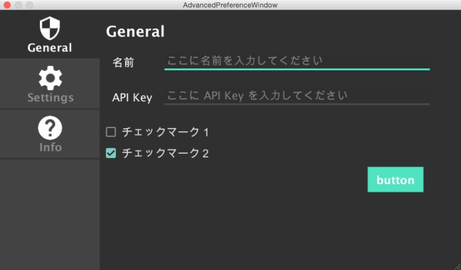


이런 GUI 스타일도 만들 수 있습니다.


이 기능을 모르고서는 에디터 확장에서는 아무것도 할 수 없다고 할 수 있습니다. 이번 장에서는 모든것을 소개할 수는 없지만, 알아두면 EditorGUI와 EditorGUILayout으로 할 수 있는 것의 폭이 넓어지는 기능을 중심으로 설명합니다. 샘플코드는 간략화하기 위해 EditorGUILayout을 사용한 곳이 많습니다.


# 1. EditorGUI란?

런타임 측에 있는 GUI 클래스와 역할은 동일합니다만 Editor 지향의 기능이 추가된 클래스입니다. 차례대로 배치되는 EditorGUILayout 클래스도 준비되어 있습니다.


먼저 간단하게 EditorWindow의 위에 EditorGUILayout으로 문자를 표시해봅시다.
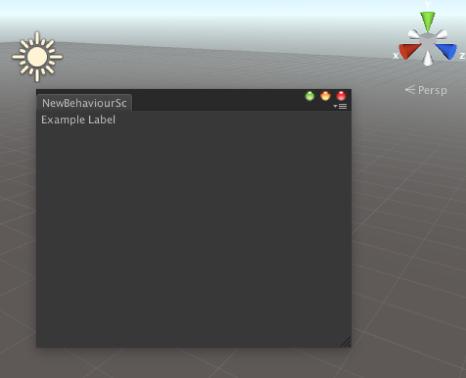


```csharp
using UnityEngine;
using UnityEditor;

public class NewBehaviourScript : EditorWindow
{
    [MenuItem("Window/Example")]
    static void Open ()
    {
        GetWindow<NewBehaviourScript> ();
    }

    void OnGUI ()
    {
        EditorGUILayout.LabelField ("Example Label");
    }
}
```

# 2. ChangeCheck

BeginChangeCheck와 EndChangeCheck로 둘러싸인 GUI에 어떤 변경을 실행했을때, EndChangeCheck가 true를 반환합니다. 

```csharp
using UnityEngine;
using UnityEditor;

public class NewBehaviourScript : EditorWindow
{
    [MenuItem("Window/Example")]
    static void Open ()
    {
        GetWindow<NewBehaviourScript> ();
    }

    bool toggleValue;

    void OnGUI ()
    {
        EditorGUI.BeginChangeCheck ();

        //toggle 을 마우스로 클릭해서 수치를 변경
        toggleValue = EditorGUILayout.ToggleLeft ("Toggle", toggleValue);

        //toggleValue 의 수치가 변경될 때마다 true가 됩니다
        if (EditorGUI.EndChangeCheck ()) {
            if (toggleValue) {
                Debug.Log ("toggleValue 이 true 로 된 순간 호출됨");
            }

        }
    }
}
```

## 2.1. [실은 GUI.changed]

ChangeCheck는 GUI.changed로 구현되어 있습니다. GUI.changed로 ChangeCheck와 같은 기능을 하게 구현하면, 아래와 같이 구현할 수 있겠습니다.

```csharp
bool toggleValue;

Stack<bool> stack = new Stack<bool> ();

void OnGUI ()
{
    //BeginChangeCheck 의 역할
    {
        // 앞쪽에 수치를 push
        stack.Push (GUI.changed);
        GUI.changed = false;
    }


    toggleValue = EditorGUILayout.ToggleLeft ("Toggle", toggleValue);


    //EndChangeCheck 의 역할
    {
        bool changed = GUI.changed;
        // 어느쪽이든 true 이기만 하면 아래는 모두 변경 되어있는걸로 한다
        GUI.changed |= stack.Pop ();
    }

    if (changed) {
        Debug.Log ("toggleValue 이 true 로 된 순간 호출됨");
    }
}
```

# 3. DisabledGroup


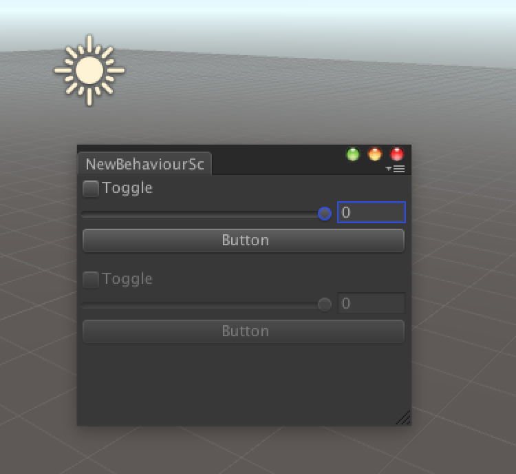

아래 쪽의 GUI가 흐려져서 조작할 수 없는 상태가 되어있습니다.
```csharp
using UnityEngine;
using UnityEditor;

public class NewBehaviourScript : EditorWindow
{
    [MenuItem("Window/Example")]
    static void Open ()
    {
        GetWindow<NewBehaviourScript> ();
    }

    void OnGUI ()
    {
        Display ();

        EditorGUILayout.Space ();

        EditorGUI.BeginDisabledGroup (true);

        Display ();

        EditorGUI.EndDisabledGroup ();
    }

    void Display ()
    {
        EditorGUILayout.ToggleLeft ("Toggle", false);
        EditorGUILayout.IntSlider (0, 10, 0);
        GUILayout.Button ("Button");
    }
}
```

## 3.1. [실은 GUI.enabled]

DisabledGroup의 내부는 GUI.enabled로 구현되어 있습니다. GUI.enabled로 DisabledGroup과 같은 기능을 하게 구현하면, 다음과 같이 구현됩니다.

```csharp
void OnGUI ()
{
    Display ();

    EditorGUILayout.Space ();

    GUI.enabled = false;

    Display ();

    GUI.enabled = true;
}

void Display ()
{
    EditorGUILayout.ToggleLeft ("Toggle", false);
    EditorGUILayout.IntSlider (0, 10, 0);
    GUILayout.Button ("Button");
}
```

# 4. FadeGroup

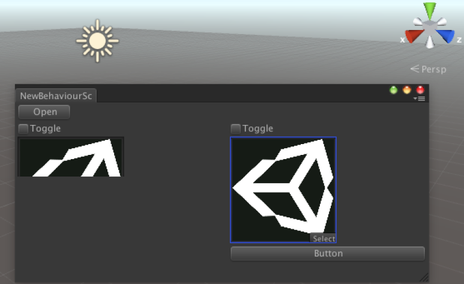

좌측이 페이드 중, 우측이 보통 상태입니다.

GUI의 그룹을 페이드인/페이드아웃 시키는 경우에 사용합니다. 어떤 트리거, 이번에는 버튼을 누르면 GUI가 표시되게 해놨습니다.

페이드 중에는 GUI를 조작할 수 없습니다. 페이드의 스피드는 어느정도 빠르게 해서 유저를 기다리지 않게 합시다.

```csharp
using UnityEngine;
using UnityEditor;
using UnityEditor.AnimatedValues;
using UnityEngine.Events;

public class NewBehaviourScript : EditorWindow
{
    [MenuItem("Window/Example")]
    static void Open ()
    {
        GetWindow<NewBehaviourScript> ();
    }

    //초기 수치가 0이면 페이드를 하지 않는다고 판단하므로 0.0001f 같이 0에 근접한 수치로 합니다
    AnimFloat animFloat = new AnimFloat (0.0001f);
    Texture tex;
    void OnGUI ()
    {
        bool on = animFloat.value == 1;

        if (GUILayout.Button (on ? "Close" : "Open", GUILayout.Width (64))) {
            animFloat.target = on ? 0.0001f : 1;
            animFloat.speed = 0.05f;

            //수치가 바뀌면 EditorWindow 를 다시 Render합니다
            var env = new UnityEvent ();
            env.AddListener (() => Repaint ());
            animFloat.valueChanged = env;
        }

        EditorGUILayout.BeginHorizontal ();
        EditorGUILayout.BeginFadeGroup (animFloat.value);
        Display ();
        EditorGUILayout.EndFadeGroup ();
        Display ();
        EditorGUILayout.EndHorizontal ();
    }

    void Display ()
    {
        EditorGUILayout.BeginVertical ();
        EditorGUILayout.ToggleLeft ("Toggle", false);

        var options = new []{GUILayout.Width (128), GUILayout.Height (128)};

        tex = EditorGUILayout.ObjectField (
                tex, typeof(Texture), false, options) as Texture;

        GUILayout.Button ("Button");
        EditorGUILayout.EndVertical ();
    }
}
```

# 5. EditorGUI.ObjectField

오브젝트의 참조를 다루는 필드입니다. 인자에 붙는 오브젝트의 자료형을 지정할 수 있습니다. 또한, 텍스쳐계(Texture2D나 Sprite)는 특수한 썸네일 형식의 필드가 됩니다.

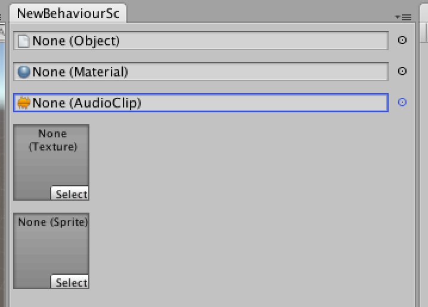

```csharp
void OnGUI ()
{
    EditorGUILayout.ObjectField (null, typeof(Object), false);

    EditorGUILayout.ObjectField (null, typeof(Material), false);

    EditorGUILayout.ObjectField (null, typeof(AudioClip), false);

    var options = new []{GUILayout.Width (64), GUILayout.Height (64)};

    EditorGUILayout.ObjectField (null, typeof(Texture), false, options);

    EditorGUILayout.ObjectField (null, typeof(Sprite), false, options);
}
```

# 6. EditorGUI.MultiFloatField

다수의 float 수치를 편집하는 필드를 1행으로 표시할 수 있게 해줍니다.

인스펙터에서 Vector3의 수치를 편집하는 것 같은 형식이 됩니다.

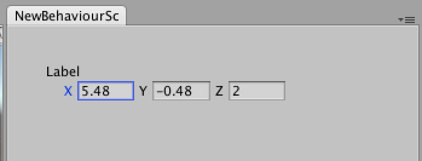


정해진 Rect 안에서 모든 요소를 균등하게 표시합니다.

```csharp
float[] numbers = new float[] {
    0,
    1,
    2
};

GUIContent[] contents = new GUIContent[] {
    new GUIContent ("X"),
    new GUIContent ("Y"),
    new GUIContent ("Z")
};

void OnGUI ()
{
    EditorGUI.MultiFloatField (
        new Rect (30, 30, 200, EditorGUIUtility.singleLineHeight),
        new GUIContent ("Label"),
        contents,
        numbers);
}
```

# 7. EditorGUI.indentLevel

들여쓰기 레벨(정도)를 관리합니다. 다음 코드와 같이 부분적으로 들여쓰기 레벨을 증가/감소시키는 것을 통해, 인스펙터와 Hierarchy 에서 볼 수 있는 계층구조를 구성합니다.

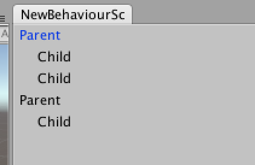

```csharp
void OnGUI ()
{
    EditorGUILayout.LabelField ("Parent");

    EditorGUI.indentLevel++;

    EditorGUILayout.LabelField ("Child");
    EditorGUILayout.LabelField ("Child");

    EditorGUI.indentLevel--;

    EditorGUILayout.LabelField ("Parent");

    EditorGUI.indentLevel++;

    EditorGUILayout.LabelField ("Child");
}
```
이것은 EditorGUI와 EditorGUILayout 양쪽에 모두 효과가 있습니다.


# 8. EditorGUILayout.Knob

각도나, 정해진 범위 내에서의 수치를 설정하기 위해 "노브"를 작성합니다. 마우스로 드래그하면, 표시되어있는 라벨을 클릭하는 것으로 직접 입력할 수 있습니다.

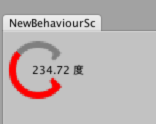

```csharp
float angle = 0;

void OnGUI ()
{
    angle = EditorGUILayout.Knob (Vector2.one * 64,
        angle, 0, 360, "度", Color.gray, Color.red, true);
}
```

# 9. Scope

EditorGUILayout.BeginHorizontal/EndHorizontal 등에서 보이는 Begin/End로 시작하는 GUI 그룹의 도우미 기능입니다. 표준적으로 HorizontalScope, VerticalScope, ScrollViewScope 등의 스코프가 준비되어 있습니다. 스코프 자체는 IDisposable 오브젝트에서 구현되어 있어서, using을 사용할 수 있습니다.

```csharp
using (new EditorGUILayout.HorizontalScope ()) {
  GUILayout.Button ("Button1");
  GUILayout.Button ("Button2");
}
```


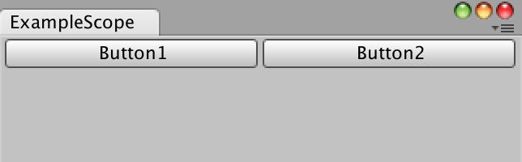


## 9.1. [Scope의 자체제작 - BackgroundColorScope]

HorizontalScope와 같이, 스코프는 GUI.Scope 클래스를 상속해서 작성하고 있습니다.

```csharp
public class HorizontalScope : GUI.Scope
{
  public HorizontalScope()
  {
    EditorGUILayout.BeginHorizontal();
  }

  protected override void CloseScope()
  {
    EditorGUILayout.EndHorizontal();
  }

  //생략
}
```

CloseScope 함수는 Dispose 시에 호출되는 함수입니다. 생성자 안에서 Begin, CloseScope 함수 안에서 End를 호출하고 있습니다.

같은 식으로 GUI.Scope를 상속한 클래스에서 스코프를 작성할 수 있습니다. 

이번에는 시험삼아 GUI.Scope 안에서만 GUI의 배경을 갱신하는 BackgroundColorScope를 작성해봅시다.

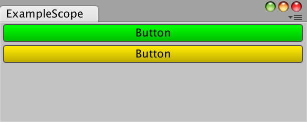

```csharp
using UnityEngine;

public class BackgroundColorScope : GUI.Scope
{
    private readonly Color color;
    public BackgroundColorScope(Color color)
    {
        this.color = GUI.backgroundColor;
        GUI.backgroundColor = color;
    }


    protected override void CloseScope()
    {
        GUI.backgroundColor = color;
    }
}
```
이와 같이 GUI.backgroundColor에서 Color 정보를 넘겨주기 전에 변수로써 유지하고, CloseScope로 원래대로의 색으로 돌립니다.

```csharp
using (new BackgroundColorScope (Color.green)) {
  // 녹색 버튼
  GUILayout.Button ("Button");

  using (new BackgroundColorScope (Color.yellow)) {
    // 황색 버튼
    GUILayout.Button ("Button");
  }
}
```

# 10. 외관은 버튼, 안쪽은 토글

Unity 에디터의 GUI에는 외관은 버튼인데 안의 동작이 토글인 On/Off 기능이 갖춰진, 버튼 집단이 몇개 존재합니다.

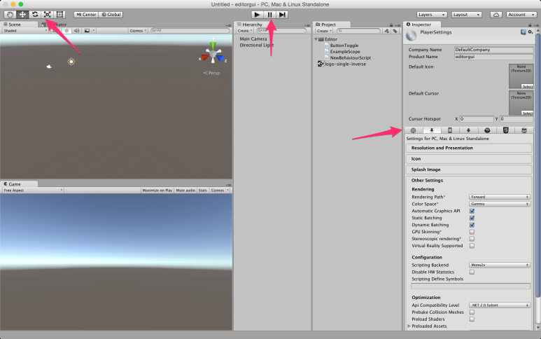

이들의 버튼? 토글?의 구현방법을 소개합니다.

## 10.1. [스타일이 버튼인 토글(싱글)]

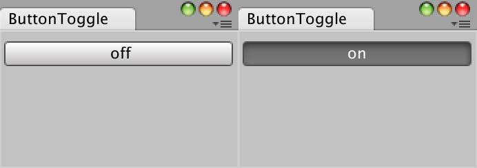


on일때는 버튼이 계속 눌려져 있는 상태입니다.

만드는 법은 매우 간단. Toggle에 버튼의 스타일을 준비하면 됩니다.

```csharp
bool on;
void OnGUI ()
{
    //GUIStyle 는 문자열에서 지정하는것도 가능
    on = GUILayout.Toggle (on, on ? "on" : "off", "button");
}
```

## 10.2. [스타일이 버튼인 토글(멀티플)]

다수의 선택지 중에 1개를 선택할 수 있게 할때 토글 집단을 작성합니다.

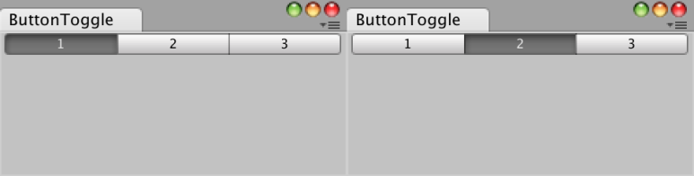

```csharp
bool one, two, three;

void OnGUI ()
{
  using (new EditorGUILayout.HorizontalScope ()) {
    one = GUILayout.Toggle (one, "1", EditorStyles.miniButtonLeft);
    two = GUILayout.Toggle (two, "2", EditorStyles.miniButtonMid);
    three = GUILayout.Toggle (three, "3", EditorStyles.miniButtonRight);
  }
}
```
아마, 다수의 토글을 배치하려고 하면, 위와 같은 코드가 됩니다. 하지만 이것은 안좋은 방법입니다. 이대로 하면 bool 변수의 갯수가 토글의 갯수에 따라 달라지고, 그 관리도 귀찮습니다. 

```csharp
int selected;

void OnGUI ()
{
  selected = GUILayout.Toolbar (selected, new string[]{ "1", "2", "3" });
}
```
뭐가 선택되어 있는지를 int 변수로 관리해, 표시하는 토글(의 문자열)은 string 배열로 관리합니다. 

또한, GUIStyle을 변경하는 것으로 다양한 표시를 할 수 있습니다.

EditorStyles.toolbarButton을 사용하는 것으로 툴바와, PlayerSettings의 플랫폼별 설정이 있듯이 토글 집단을 표시할 수 있습니다.

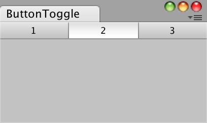

```csharp
int selected;

void OnGUI ()
{
  selected = GUILayout.Toolbar (selected,
      new string[]{ "1", "2", "3" }, EditorStyles.toolbarButton);
}
```

아래 코드의 1열에 표시된 GUILayout.SelectionGrid에서, 스타일을 PreferencesKeysElement(유니티 내부에 구현된 GUIStyle)이라고 하면 Preferences 윈도우에서 표시되고 있는 선택 메뉴처럼 됩니다.

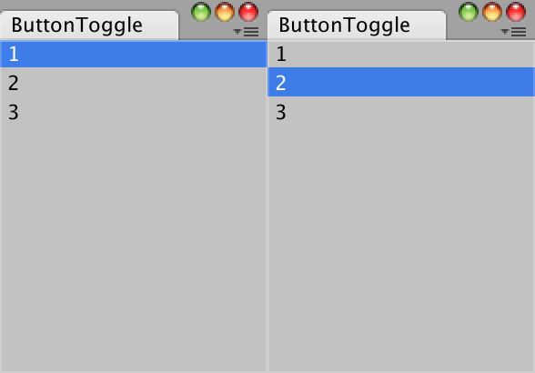

```csharp
int selected;

void OnGUI ()
{
  selected = GUILayout.SelectionGrid (selected,
      new string[]{ "1", "2", "3" },1, "PreferencesKeysElement");
}
```