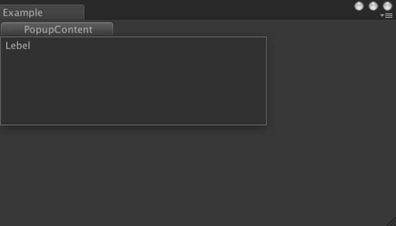
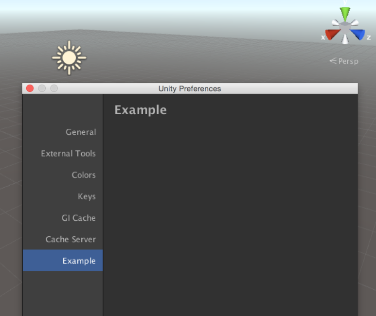

[에디터 확장 입문] 번역 7장 EditorWindow

번역/유니티/유니티에디터확장입문


><주의>
원문의 작성 시기는 2016년경으로, 코드나 일부 설명이 최신 유니티 버젼과 다소 맞지 않을 수 있습니다.
원문 작성자 분 역시 2019년경에 내용에 다소 오류가 있다는 이유로 웹 공개 버젼을 비공개 처리하였습니다.
(2022.10.08 역자)

원문 링크 (2022.10.08 지금은 폐기)

http://anchan828.github.io/editor-manual/web/part1-editorwindow.html

---
목차
- [1. EditorWindow 란](#1-editorwindow-란)
- [2. HostView와 SplitView와 DockArea](#2-hostview와-splitview와-dockarea)
- [3. EditorWindow의 작성](#3-editorwindow의-작성)
  - [3.1. [EditorWindow를 표시하기까지]](#31-editorwindow를-표시하기까지)
- [4. EditorWindow.GetWindow](#4-editorwindowgetwindow)
  - [4.1. [1개만 허가하는 EditorWindow]](#41-1개만-허가하는-editorwindow)
- [5. 어느 Show 함수를 호출하는가로 바뀌는 특수한 EditorWindow](#5-어느-show-함수를-호출하는가로-바뀌는-특수한-editorwindow)
  - [5.1. Show](#51-show)
  - [5.2. ShowUtility](#52-showutility)
  - [5.3. ShowPopup](#53-showpopup)
  - [5.4. PopupWindow](#54-popupwindow)
  - [5.5. ShowAuxWindow](#55-showauxwindow)
  - [5.6. ShowAsDropDown](#56-showasdropdown)
  - [5.7. ScriptableWizard](#57-scriptablewizard)
  - [5.8. [ScriptableWizard의 사용법]](#58-scriptablewizard의-사용법)
  - [5.9. [ScriptableWizard에는 클래스의 필드가 표시됩니다]](#59-scriptablewizard에는-클래스의-필드가-표시됩니다)
  - [5.10. OnWizardCreate]](#510-onwizardcreate)
  - [5.11. OnWizardOtherButton](#511-onwizardotherbutton)
  - [5.12. OnWizardUpdate](#512-onwizardupdate)
  - [5.13. DrawWizardGUI](#513-drawwizardgui)
  - [5.14. [OnGUI 함수는 사용하지 말것]](#514-ongui-함수는-사용하지-말것)
  - [5.15. PreferenceItem](#515-preferenceitem)
- [6. 메뉴를 추가하는 IHasCustomMenu](#6-메뉴를-추가하는-ihascustommenu)
- [7. EditorWindow의 사이즈를 변경할 수 없게 하기](#7-editorwindow의-사이즈를-변경할-수-없게-하기)
- [8. 윈도우에 아이콘을 추가하기](#8-윈도우에-아이콘을-추가하기)
- [9. GetWindow를 사용하지 않고 이미 있는 EditorWindow를 얻기 위해서는?](#9-getwindow를-사용하지-않고-이미-있는-editorwindow를-얻기-위해서는)
- [10. EditorWindow도 ScriptableObject임을 확인](#10-editorwindow도-scriptableobject임을-확인)


에디터 확장을 처음 접하면, 먼저 윈도우를 표시하는 것에서 시작할 수도 있습니다. 이 장에서는 간단하게 EditorWindow를 표시하는 방법에서 목적에 맞는 EditorWindow 선택, 그 특성에 대해서 설명합니다.


# 1. EditorWindow 란

씬 윈도우, 게임 윈도우, 인스펙터 윈도우 등, 이들 모두는 EditorWindow입니다. 유니티 에디터는 다양한 기능을 가진 EditorWindow의 집합으로 되어 있습니다.


# 2. HostView와 SplitView와 DockArea

EditorWindow는 혼자서 표시 될 수 없고, 부모로써 DockArea를 가지고, 이 DockArea에 의해 EditorWindow는 표시됩니다.


DockArea는 "웹 브라우저의 탭"과 같은 기능을 제공합니다.

예를들어, 윈도우는 각각 독립된 3개의 윈도우로도 될 수 있고, 3개의 탭으로써 1개의 윈도우에 합쳐들어가는 것도 할 수 있습니다.


외관도 닮았고, 탭의 기능으로써, 탭을 끌어내 별개의 윈도우로 만들 수 있는것도 가능합니다.


이와 같이, DockArea에는 1개 이상의 EditorWindow를 표시하기 위한 기능이 포함되어 있습니다. 예를들어, 2개 이상의 EditorWindow가 DockArea에 있을 경우, 탭 기능을 사용해 각각의 EditorWindow를 표시하거나, SplitWindow로 DockArea의 영역을 분할하여 표시합니다.


게다가 DockArea는 HostView의 역할도 가지고 있습니다. HostView는, 다양한 오브젝트, 이벤트와의 통신을 실행하기 위한 기능을 가지고 있습니다. 윈도우의 "Update 함수"와 "OnSelectionChange 함수" 등을 실행하기 위한 기능이 포함되어 있습니다.


3개의 윈도우 "HostView" "SplitView" "DockArea"를 소개했습니다. 이들의 영역(클래스)에는 유감스럽게도 접근할 수 없습니다. 하지만, 기억해두면 EditorWindow의 구조를 보다 잘 이해할 수 있을 것입니다.


# 3. EditorWindow의 작성

먼저 일반적인 EditorWindow를 작성해봅시다.


## 3.1. [EditorWindow를 표시하기까지]

EditorWindow를 표시하기까지의 기본적인 흐름은 3개의 스텝으로 구성되어 있습니다. 먼저 이 3개 스텝을 기억합시다. 

1. EditorWindow를 작성하기 위해 EditorWindow를 상속한 클래스를 작성합니다.

```csharp
using UnityEditor;

public class Example : EditorWindow
{
}
```

2. 다음엔 EditorWindow를 표시하기 위한 트리거로써의 메뉴를 추가합니다.

```csharp
using UnityEditor;

public class Example : EditorWindow
{
    //MenuItem 에 대해서는 8장 MenuItem을 봐주세요
    [MenuItem("Window/Example")]
    static void Open ()
    {
    }
}
```

3. 마지막으로 EditorWindow를 표시합니다. EditorWindow는 ScriptableObject를 상속하고 있으므로, EditorWindow.CreateInstance로 EditorWindow 오브젝트를 생성합니다. 그리고 Show를 호출하면 EditorWindow가 표시됩니다.

```csharp
using UnityEditor;

public class Example : EditorWindow
{
    [MenuItem("Window/Example")]
    static void Open ()
    {
        var exampleWindow = CreateInstance<Example> ();
        exampleWindow.Show ();
    }
}
```


"Window/Example" 메뉴를 실행해서 표시합니다. 실행하기 위해서는 EditorWindow를 새로 작성합니다.


# 4. EditorWindow.GetWindow

EditorWindow를 작성할 경우, "다수의 존재를 허가하는 EditorWindow"와 "1개만 허가하는 EditorWindow" 2종류를 생각해볼 수 있습니다. 다수의 존재를 허가하는 EditorWindow는 방금전 설명한 EditorWindow.CreateInstance를 사용해 EditorWindow를 작성해 표시합니다.

## 4.1. [1개만 허가하는 EditorWindow]

"이미 EditorWindow가 존재하고 있는 경우에는 생성하지 않는다"라는 확인처리를 구현하지 않으면 안됩니다.

```csharp
using UnityEditor;

public class Example : EditorWindow
{
    static Example exampleWindow;

    [MenuItem("Window/Example")]
    static void Open ()
    {
        if (exampleWindow == null) {
            exampleWindow = CreateInstance<Example> ();
        }
        exampleWindow.Show ();
    }
}
```

이렇게 해도 되지만, "이미 EditorWindow가 존재하면 그 인스턴스를 얻는다. 없으면 생성한다. 마지막으로 Show 함수를 호출한다"라는 다수의 기능을 1개에 집약한 API가 존재합니다. EditorWindow.GetWindow입니다.

```csharp
using UnityEditor;

public class Example : EditorWindow
{
    [MenuItem("Window/Example")]
    static void Open ()
    {
        GetWindow<Example> ();
    }
}
```

GetWindow를 실행하면 내부에서 인스턴스가 캐쉬됩니다.

게다가 GetWindow 함수에는 편리한 기능이 있어서, 특정 EditorWindow에 탭윈도우로써 표시할 수 있습니다. (DockArea에 EditorWindow를 추가)


씬 윈도우에 탭 윈도우로써 추가할 수 있습니다.

```csharp
using UnityEditor;

public class Example : EditorWindow
{
    [MenuItem("Window/Example")]
    static void Open ()
    {
        GetWindow<Example> (typeof(SceneView));
    }
}
```

# 5. 어느 Show 함수를 호출하는가로 바뀌는 특수한 EditorWindow

지금까지 이 장에서 다루었던 EditorWindow는 기본적인 탭 기능을 쓸수 있는 윈도우입니다. 그 외에도 EditorWindow는 다양한 종류의 윈도우를 작성할 수 있습니다.

Show 함수는 여러 종류 준비되어 있으며, 어느 Show 함수를 호출할 것인지로 표시되는 EditorWindow가 변화합니다.

## 5.1. Show

기본 기능의 탭 윈도우로써 사용됩니다. EditorWindow.GetWindow를 사용하고 있는 경우, 내부에서 Show가 호출됩니다.

## 5.2. ShowUtility

탭 윈도우로써 사용되지 않고, 항상 앞에 표시되는 윈도우입니다. 예를들어 다른 윈도우에 Focus를 맞추어도 그 Window자체가 뒤쪽으로 돌아가지 않습니다. 설정 윈도우같이 다른 윈도우를 조작하더라도 제일 앞에 표시하고 싶은 경우에 사용합니다.


GetWindow는 사용할 수 없으므로 그 대신에 CreateInstance를 사용합니다.

```csharp
using UnityEditor;

public class Example : EditorWindow
{
    static Example exampleWindow;

    [MenuItem("Window/Example")]
    static void Open ()
    {
        if (exampleWindow == null) {
            exampleWindow = CreateInstance<Example> ();
        }
        exampleWindow.ShowUtility ();
    }
}
```

## 5.3. ShowPopup

윈도우 타이틀과 닫기 버튼이 없는 윈도우입니다. 예를들어 다른 Window에 Focus를 맞춰도 그 Window 자체가 뒤쪽으로 돌아가는 일 없이, 닫음 버튼이 없기 때문에, 윈도우를 닫는 처리는 스스로 구현할 필요가 있습니다.


```csharp
using UnityEditor;
using UnityEngine;

public class Example : EditorWindow
{
    static Example exampleWindow;

    [MenuItem("Window/Example")]
    static void Open ()
    {
        if (exampleWindow == null) {
            exampleWindow = CreateInstance<Example> ();
        }
        exampleWindow.ShowPopup ();
    }


    void OnGUI ()
    {
        // Escape를 누른 때에 닫는다
        if (Event.current.keyCode == KeyCode.Escape) {
            exampleWindow.Close();
        }
    }
}
```
SpriteEditor같은 슬라이스 메뉴 버튼에서 Popup을 표시하곤 합니다.


## 5.4. PopupWindow

이전에 소개한 ShowPopup과 거의 비슷하여, Popup을 표시하기 위한 기능입니다. PopupWindow는 Popup을 범용적으로 다루기 위한 것이라고 생각하시면 됩니다.




버튼을 누르면 아래에 Popup이 표시됩니다.

사용법은 매우 간단합니다. 먼저 PopupWindowContent를 상속한 클래스를 작성합니다. 그리고 PopupWindow.Show에서 Popup을 표시합니다.

```csharp
using UnityEditor;
using UnityEngine;

public class Example : EditorWindow
{
    [MenuItem("Window/Example")]
    static void Open ()
    {
        GetWindow<Example> ();
    }

    //인스턴스화
    ExamplePupupContent popupContent = new ExamplePupupContent ();

    void OnGUI ()
    {
        if (GUILayout.Button ("PopupContent",GUILayout.Width(128))) {
            var activatorRect = GUILayoutUtility.GetLastRect ();
            //Popup을 표시한다
            PopupWindow.Show (activatorRect, popupContent);
        }
    }
}

public class ExamplePupupContent : PopupWindowContent
{
    public override void OnGUI (Rect rect)
    {
        EditorGUILayout.LabelField ("Lebel");
    }

    public override void OnOpen ()
    {
        Debug.Log ("표시할 때에 호출됨");
    }

    public override void OnClose ()
    {
        Debug.Log ("닫을때 호출됨");
    }

    public override Vector2 GetWindowSize ()
    {
        //Popup 의 사이즈
        return new Vector2 (300, 100);
    }
}
```

## 5.5. ShowAuxWindow

탭 윈도우로써 다루어지지 않는 윈도우를 작성합니다. 외관은 ShowUtility와 같습니다만 다른 윈도우에 Focus를 두면 윈도우는 소거됩니다. 윈도우를 생성해놓고 지우는걸 깜빡하는 일이 없으므로 수가 늘어나지 않으니, 간단한 설정, 조작에서 사용하는것을 추천합니다.


## 5.6. ShowAsDropDown

팝업과 마찬가지로, [윈도우 타이틀] [닫기 버튼]이 없는 윈도우입니다. 단, PC의 화면 사이즈를 고려해서, 윈도우를 표시하는 위치에서 충분한 넓이를 확보할 수 없는 경우, 윈도우의 표시 영역을 화면 안으로 넣기 위한 X/Y축의 위치가 자동적으로 보정됩니다. 바꿔 말해, 화면의 구석에서 윈도우를 연다고 하여도, 반드시 PC의 표시영역에 모두 표시됩니다.


```csharp
using UnityEditor;
using UnityEngine;

public class Example : EditorWindow
{
    static Example exampleWindow;

    [MenuItem("Window/Example")]
    static void Open ()
    {
        if (exampleWindow == null) {
            exampleWindow = CreateInstance<Example> ();
        }

        var buttonRect = new Rect (100, 100, 300, 100);
        var windowSize = new Vector2 (300, 100);
        exampleWindow.ShowAsDropDown (buttonRect, windowSize);
    }
}
```
그외에는 Popup과 같은 기능을 합니다.

## 5.7. ScriptableWizard

"GameObject를 만든다" "Prefab을 만든다" "Asset을 만든다" 이와 같이 뭔가를 "만들" 때에 사용하는 윈도우입니다. ScriptableWizard는 지금까지 소개해온 윈도우와는 조금 다릅니다.

## 5.8. [ScriptableWizard의 사용법]

1. ScriptableWizard를 상속하는 클래스를 만듭니다.

```csharp
using UnityEditor;

public class Example : ScriptableWizard
{
}
```

2. 다음으로 ScriptableWizard를 표시하기 위한 트리거로써 메뉴를 추가합니다.

```csharp
using UnityEditor;

public class Example : ScriptableWizard
{
    //MenuItem 에 대해서는 8장「MenuItem」 를 봐주세요.
    [MenuItem("Window/Example")]
    static void Open ()
    {
    }
}
```

3. ScriptableWizard를 표시합니다. 표시는 ScriptableWizard.DisplayWizard로 합니다.

```csharp
using UnityEditor;

public class Example : ScriptableWizard
{
    [MenuItem("Window/Example")]
    static void Open ()
    {
        DisplayWizard<Example> ("Example Wizard");
    }
}
```


표준에서 우측 하단에 Create버튼이 표시됩니다.


## 5.9. [ScriptableWizard에는 클래스의 필드가 표시됩니다]

다른 EditorWindow에서는 GUI의 표시에 EditorGUI 클래스를 사용합니다만, ScriptableWizard에서는 사용할 수 없습니다. ScriptableWizard에서는 인스펙터에서 표시되듯이 "public 필드" "Serialize 가능한 필드"가 윈도우에 표시됩니다.


```csharp
using UnityEditor;

public class Example : ScriptableWizard
{
    public string gameObjectName;

    [MenuItem("Window/Example")]
    static void Open ()
    {
        DisplayWizard<Example> ("Example Wizard");
    }
}
```

## 5.10. OnWizardCreate]

ScriptableWizard의 오른쪽 아래에 있는 Create 버튼을 눌렀을때 호출되는 함수입니다.

```csharp
using UnityEditor;
using UnityEngine;

public class Example : ScriptableWizard
{
    public string gameObjectName;

    [MenuItem("Window/Example")]
    static void Open ()
    {
        DisplayWizard<Example> ("Example Wizard");
    }

    void OnWizardCreate ()
    {
        new GameObject (gameObjectName);
    }
}
```

## 5.11. OnWizardOtherButton

Create 버튼 외에 또 1개 버튼을 추가할 수 있습니다. 작성 관련해서 2개의 패턴을 만들고 싶은 경우에 사용해주세요. 버튼을 추가하기 위해서는 ScriptableWizard.DisplayWizard의 3번째 인자로 버튼 이름을 지정해야 합니다.

```csharp
using UnityEditor;
using UnityEngine;

public class Example : ScriptableWizard
{
    public string gameObjectName;

    [MenuItem("Window/Example")]
    static void Open ()
    {
        DisplayWizard<Example> ("Example Wizard", "Create", "Find");
    }

    void OnWizardCreate ()
    {
        new GameObject (gameObjectName);
    }

    void OnWizardOtherButton ()
    {
        var gameObject = GameObject.Find (gameObjectName);

        if (gameObject == null)
        {
            Debug.Log ("게임 오브젝트를 찾을 수 없습니다");
        }
    }
}
```

## 5.12. OnWizardUpdate

모든 필드의 수치를 대상으로, 수치의 변경이 있을 경우에 호출되는 함수입니다.
```csharp
using UnityEditor;
using UnityEngine;

public class Example : ScriptableWizard
{
    [MenuItem("Window/Example")]
    static void Open ()
    {
        DisplayWizard<Example> ("Example Wizard");
    }

    void OnWizardUpdate ()
    {
        Debug.Log ("Update");
    }
}
```

## 5.13. DrawWizardGUI

위자드 안에서의 GUI를 표시하기 위한 함수입니다. 이 함수를 오버라이드하는 것을 통해 GUI를 커스터마이즈 할 수 있습니다.

단, 반환값으로 true를 반환하도록 해주세요. true를 반환하지 않으면 OnWizardUpdate가 호출되지 않게 되어 버립니다.


지금까지 표시된 프로퍼티가 없어져버리고, 라벨이 표시됩니다.

```csharp
using UnityEditor;
using UnityEngine;

public class Example : ScriptableWizard
{
    public string gameObjectName;

    [MenuItem ("Window/Example")]
    static void Open ()
    {
        DisplayWizard<Example> ("Example Wizard");
    }

    protected override bool DrawWizardGUI ()
    {
        EditorGUILayout.LabelField ("Label");
        //false 를 반환하면 OnWizardUpdate 가 호출되지 않게 됩니다
        return true;
    }
}
```

## 5.14. [OnGUI 함수는 사용하지 말것]

ScriptableWizard 클래스는 EditorWindow를 상속합니다. 그러므로 OnGUI 함수를 사용하면 보통의 EditorWindow로써 표시되어 버리므로, 필드의 수치와 Create버튼이 표시되지 않습니다.


## 5.15. PreferenceItem

PreferenceItem은 Unity Preferences에 메뉴를 추가하기 위한 기능입니다. Unity Preferences는 Unity 에디터 전체에 영향을 주는 설정을 하기 위해 있습니다.




추가된 메뉴는 가장 마지막 위치에 추가됩니다.
```csharp
using UnityEditor;

public class Example
{
    [PreferenceItem("Example")]
    static void OnPreferenceGUI ()
    {

    }
}
```

# 6. 메뉴를 추가하는 IHasCustomMenu

탭에서 우클릭, 혹은 ≡ 을 클릭하면 표시되는 컨텍스트 메뉴에 메뉴를 추가합니다.


IHasCustomMenu는 인터페이스로서 구현되어 있습니다.

```csharp
using UnityEditor;
using UnityEngine;

public class Example : EditorWindow, IHasCustomMenu
{

    public void AddItemsToMenu (GenericMenu menu)
    {
        menu.AddItem (new GUIContent ("example"), false, () => {

        });

        menu.AddItem (new GUIContent ("example2"), true, () => {

        });
    }

    [MenuItem("Window/Example")]
    static void Open ()
    {
        GetWindow<Example> ();
    }
}
```

# 7. EditorWindow의 사이즈를 변경할 수 없게 하기


우측 하단에 있는 사이즈조절하는 3각 마크가 사라집니다.

EditorWindow.minSize와 EditorWindow.maxSize에 의해 EditorWindow의 크기를 제한할 수 있습니다. 최소 수치와 최대 수치가 같으면 EditorWindow의 크기를 변경할 필요가 없다고 판단해서 우측 하단의 3각 마크가 표시되지 않습니다.

```csharp
using UnityEditor;
using UnityEngine;

public class Example : EditorWindow
{
    [MenuItem("Window/Example")]
    static void Open ()
    {
        var window = GetWindow<Example> ();
        window.maxSize = window.minSize = new Vector2 (300, 300);
    }
}
```

# 8. 윈도우에 아이콘을 추가하기

아이콘을 추가하기 위해서는 EditorWindow.titleContent에 아이콘을 가진 GUIContent를 대입합니다.


아이콘은 매우 작으므로 알아보기 쉬운것으로 하는걸 추천.

```csharp
using UnityEditor;
using UnityEngine;

public class Example : EditorWindow
{
    [MenuItem ("Window/Example")]
    static void SaveEditorWindow ()
    {
        var window = GetWindow<Example> ();

        var icon = AssetDatabase.LoadAssetAtPath<Texture> ("Assets/Editor/Example.png");

        window.titleContent = new GUIContent ("Hoge", icon);
    }
}
```

# 9. GetWindow를 사용하지 않고 이미 있는 EditorWindow를 얻기 위해서는?

싱글톤을 구현하든지, GetWindow를 통해 내부에 캐쉬해두든지 하는 방법으로 EditorWindow에 접근할 수 있습니다. 하지만, 먼저 올렸던 2가지 방법을 쓸 수 없는 상황에서는 Resources 클래스에 있는 Resources.FindObjectsOfTypeAll을 사용합니다.

FindObjectOfAll은 현재 로드되어 있는 모든 오브젝트로부터 특정 오브젝트를 검색해서, 얻습니다. 이것은 런타임에서 사용하는 오브젝트뿐만 아니라 에디터에서 사용하는 오브젝트도 검색 대상입니다.

```csharp
using UnityEditor;
using UnityEngine;

public class Example : EditorWindow
{
    [MenuItem("Window/Example")]
    static void Open ()
    {
        // 모든 SceneView를 얻습니다
        var sceneViews = Resources.FindObjectsOfTypeAll<SceneView> ();
    }
}
```

# 10. EditorWindow도 ScriptableObject임을 확인


어셈블리 브라우저에서 보면, ScriptableObject가 상속되어 있는것을 확인가능.

EditorWindow는, ScriptableObject의 동작에 따라, EditorWindow 오브젝트를 Asset으로서 저장할 수 있습니다. 그 때 인스펙터에서는 Serialize된 프로퍼티도 표시합니다.


Example 윈도우를 Asset으로써 저장할 때의 인스펙터

```csharp
using UnityEditor;
using UnityEngine;
public class Example : EditorWindow
{
    [MenuItem ("Assets/Save EditorWindow")]
    static void SaveEditorWindow ()
    {
        AssetDatabase.CreateAsset (CreateInstance<Example> (), "Assets/Example.asset");
        AssetDatabase.Refresh ();
    }

    [SerializeField]
    string text;

    [SerializeField]
    bool boolean;
}
```

윈도우 위치와 사이즈 등도 저장됩니다. 그것들의 데이터는 직접 YAML 형식의 파일을 텍스트 에디터로 보면 확인할 수 있습니다.

```
 m_MinSize: {x: 100, y: 100}
  m_MaxSize: {x: 4000, y: 4000}
  m_TitleContent:
    m_Text: Example
    m_Image: {fileID: 0}
    m_Tooltip:
  m_DepthBufferBits: 0
  m_AntiAlias: 0
  m_Pos:
    serializedVersion: 2
    x: 0
    y: 0
    width: 320
    height: 240
```