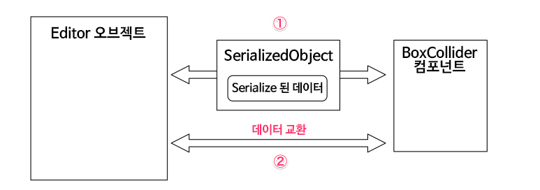

[에디터 확장 입문] 번역 9장 CustomEditor

번역/유니티/유니티에디터확장입문


><주의>
원문의 작성 시기는 2016년경으로, 코드나 일부 설명이 최신 유니티 버젼과 다소 맞지 않을 수 있습니다.
원문 작성자 분 역시 2019년경에 내용에 다소 오류가 있다는 이유로 웹 공개 버젼을 비공개 처리하였습니다.
(2022.10.08 역자)

원문 링크 (2022.10.08 지금은 폐기)

http://anchan828.github.io/editor-manual/web/customeditor.html

---
목차
- [1. 인스펙터의 Debug모드](#1-인스펙터의-debug모드)
- [2. 오브젝트와 Editor 클래스](#2-오브젝트와-editor-클래스)
  - [2.1. [평소 보고 있는 인스펙터에는 이미 커스텀 에디터가 쓰이고 있습니다]](#21-평소-보고-있는-인스펙터에는-이미-커스텀-에디터가-쓰이고-있습니다)
- [3. 커스텀에디터를 사용하기](#3-커스텀에디터를-사용하기)
  - [3.1. [Editor 클래스의 상속 클래스를 작성]](#31-editor-클래스의-상속-클래스를-작성)
  - [3.2. [인스펙터의 GUI 커스터마이즈]](#32-인스펙터의-gui-커스터마이즈)
  - [3.3. [씬 뷰의 GUI를 커스터마이즈]](#33-씬-뷰의-gui를-커스터마이즈)
- [4. 커스텀 에디터에서 데이터를 교환하기](#4-커스텀-에디터에서-데이터를-교환하기)
  - [4.1. [유니티의 Serializer를 통해서 접근하는 방법]](#41-유니티의-serializer를-통해서-접근하는-방법)
  - [4.2. [컴포넌트에 직접 접근하는 방법]](#42-컴포넌트에-직접-접근하는-방법)
  - [4.3. [Undo를 구현하는것]](#43-undo를-구현하는것)
  - [4.4. [Asset이 갱신된 것을 에디터에 알리는 SetDirty]](#44-asset이-갱신된-것을-에디터에-알리는-setdirty)
- [5. 다수의 컴포넌트를 동시 편집](#5-다수의-컴포넌트를-동시-편집)
  - [5.1. CanEditMultipleObjects](#51-caneditmultipleobjects)
  - [5.2. [SerializedObject를 사용한 동시편집]](#52-serializedobject를-사용한-동시편집)
  - [5.3. [컴포넌트에 직접 접근할 때의 동시편집]](#53-컴포넌트에-직접-접근할-때의-동시편집)
- [6. 커스텀 에디터 안에서 PropertyDrawer를 사용하기](#6-커스텀-에디터-안에서-propertydrawer를-사용하기)
- [7. 프리뷰](#7-프리뷰)
  - [7.1. [프리뷰 화면을 표시하기]](#71-프리뷰-화면을-표시하기)
  - [7.2. [프리뷰 표시]](#72-프리뷰-표시)
  - [7.3. [프리뷰의 최소한의 구현]](#73-프리뷰의-최소한의-구현)
    - [7.3.1. GetPreviewTitle](#731-getpreviewtitle)
    - [7.3.2. OnPreviewSettings](#732-onpreviewsettings)
    - [7.3.3. OnPreviewGUI](#733-onpreviewgui)
- [8. 프리뷰에서 카메라를 사용하기](#8-프리뷰에서-카메라를-사용하기)
  - [8.1. PreviewRenderUtility](#81-previewrenderutility)
  - [8.2. [프리뷰 용 오브젝트를 만들기]](#82-프리뷰-용-오브젝트를-만들기)
  - [8.3. [프리뷰의 게임 오브젝트 생성 장소]](#83-프리뷰의-게임-오브젝트-생성-장소)
    - [8.3.1. Object.Instantiate로 프리뷰 용 게임 오브젝트를 생성한다.](#831-objectinstantiate로-프리뷰-용-게임-오브젝트를-생성한다)
    - [8.3.2. 프리뷰 용 게임 오브젝트에 Preview 전용 레이어 PreviewCullingLayer를 설정한다.](#832-프리뷰-용-게임-오브젝트에-preview-전용-레이어-previewcullinglayer를-설정한다)
    - [8.3.3. Camera.Render 직전/직후에 프리뷰용 오브젝트를 활성화/비활성화 로 만든다.](#833-camerarender-직전직후에-프리뷰용-오브젝트를-활성화비활성화-로-만든다)
  - [8.4. [이리저리 움직이기]](#84-이리저리-움직이기)
  - [8.5. [중심위치를 얻어오기]](#85-중심위치를-얻어오기)
  - [8.6. [오브젝트를 회전시키기]](#86-오브젝트를-회전시키기)
- [9. 유니티가 지원하지 않는 Asset의 커스텀 에디터](#9-유니티가-지원하지-않는-asset의-커스텀-에디터)


커스텀 에디터는, 인스펙터와 씬 뷰에 표시되고 있는 GUI를 커스터마이즈하기 위한 기능입니다. 이번 장에서는 커스텀 에디터의 기본적인 사용법과 더불어, 인스펙터의 구조에 대해서도 소개합니다.

# 1. 인스펙터의 Debug모드

예를들어, Cube를 만들어, 인스펙터를 보면 BoxCollider와 MeshRenderer 등의 컴포넌트가 Attach되어 있는것을 볼 수 있습니다.


이때, 인스펙터의 탭 부분을 우클릭, 혹은 三을 클릭하면 아래와 같은 컨텍스트 메뉴가 표시되고 Normal과 Debug 항목을 찾을 수 있습니다.


보통은 Normal에 체크되어 있습니다.

여기서 Debug를 선택하면, 평소에 볼 수 있는 인스펙터와는 조금 다른 외관이 됩니다.


Debug모드는, 인스펙터가 커스터마이즈되기 전의 원래 상태를 표시합니다. 유니티 에디터는 기본적으로, 인스펙터에 표시하고 싶은 요소를 취사선택해서, GUI를 커스터마이즈 해서 표시합니다.


# 2. 오브젝트와 Editor 클래스

Editor클래스는, 오브젝트의 정보를 인스펙터와 씬 뷰에 표시하기 위한 중개역이 되는 기능입니다. 인스펙터에 어떤 정보가 표시되어 있을때에, 각 오브젝트에 대응하는 Editor 오브젝트가 생성되어, Editor 오브젝트를 통해서 필요한 정보를 GUI에서 표시합니다.


또한, 인스펙터에 표시되는 필요없는 요소가 있거나, 버튼 등 독자적으로 추가하고 싶은 GUI 요소가 있을지도 모르는데, 그런 때에는 CustomEditor 기능을 사용하는것으로 Editor 오브젝트를 커스터마이즈 할수 있습니다.


## 2.1. [평소 보고 있는 인스펙터에는 이미 커스텀 에디터가 쓰이고 있습니다]

평소 인스펙터에서 접하고있는 컴포넌트는, 이미 커스텀 에디터에 의해 커스터마이즈 되어 있습니다. 원래의 형태는 이번 장의 처음에 설명한 Debug모드의 그 상태입니다.


어미에 Inspector와 Editor 표기가 붙었지만 기능 면에서는 차이가 없습니다.

즉, 평소 보고 있는 인스펙터의 표시를, 유저 손으로 커스텀 에디터를 사용하는것을 통해 구현할 수 있다는 것입니다. 유저의 손으로 구현하기 위해서, 다시금 "무엇이 가능한지"를 참고해서 인스펙터의 표시를 확인해보는것도 좋겠군요.


# 3. 커스텀에디터를 사용하기

예를들어, 게임 중에 사용하는 실제 공격력은, 캐릭터의 "힘"과 "검의 강함" 등여러가지 요소가 합쳐져 결정된 것입니다. 그 때에 프로그램 상에서 사용하는 실제 "공격력"이라는 프로퍼티를 가진 getter로 공격력을 구하는 계산을 합니다.

(소스코드는 계산식을 조금 알기 쉽게 하려고 일본어 변수로 하였습니다)

(역주 - 근데 제가 한글로 바꿀겁니다~)

```csharp
using UnityEngine;

public class Character : MonoBehaviour
{
  [Range (0, 255)]
  public int 기본공격력;
  [Range (0, 99)]
  public int 검의 강함;
  [Range (0, 99)]
  public int 힘;

  // 플레이어의 능력과, 검의 강함에서 공격력을 구하는 프로퍼티
  public int 공격력 {
      get {
        return 기본공격력 + Mathf.FloorToInt (기본공격력 * (검의 강함 + 힘 - 8) / 16);
      }
  }
}
```

프로그램 상에서는 이걸로 됐습니다만, 공격력 수치를 유니티 에디턱의 인스펙터에서 확인하고 싶은 경우에는 조금 곤란한 부분이 있습니다. 인스펙터는, Serialize 가능한 필드를 표시합니다. Serialize 대상이 아닌 프로퍼티는 표시되지 않습니다.


이번에는, 프로퍼티인 "공격력"을 인스펙터 상에 표시해서, 확인하면서 파라메터를 조정할 수 있도록 구현해보겠습니다.


## 3.1. [Editor 클래스의 상속 클래스를 작성]

Editor클래스의 상속 클래스를 작성한 후에, Character 컴포넌트에 대해서 Editor 클래스로써 CustomEditor 속성을 추가합니다. 이걸로 커스텀 에디터에서 커스터마이즈할 준비가 끝납니다.

```csharp
using UnityEngine;
using UnityEditor;

[CustomEditor (typeof(Character))]
public class CharacterInspector : Editor
{
}
```

## 3.2. [인스펙터의 GUI 커스터마이즈]

인스펙터의 GUI는 OnInspectorGUI를 오버라이드 해서 커스터마이즈합니다.

```csharp
using UnityEngine;
using UnityEditor;

[CustomEditor (typeof(Character))]
public class CharacterInspector : Editor
{
    Character character = null;

    void OnEnable ()
    {
        //Character 컴포넌트를 얻어오기
        character = (Character) target;
    }

    public override void OnInspectorGUI ()
    {
        base.OnInspectorGUI ();

        //공격력 수치를 라벨로 표시한다
        EditorGUILayout.LabelField ("공격력", character.공격력.ToString ());
    }
}
```

이걸로 공격력 수치를 표시할 수 있게 되었습니다. 이와 같이, 인스펙터의 GUI를 커스터마이즈할 때에, OnInspectorGUI를 오버라이드하는것 뿐만 아니라, base.OnInspectorGUI를 호출하는 것으로, 원래의 GUI 요소는 그대로인채로, 인스펙터에 커스텀 요소를 추가할 수 있습니다.

## 3.3. [씬 뷰의 GUI를 커스터마이즈]

씬 뷰의 GUI는 OnSceneGUI를 사용하는 것으로 커스터마이즈 할수 있습니다. OnSceneGUI는, 주로 게임 오브젝트에 대해서 사용합니다. 그리고 OnSceneGUI가 실행되는 타이밍은, 게임 오브젝트를 선택하고 있는(인스펙터가 표시되어 있는) 때 입니다.

OnSceneGUI에서는 조금 특수하게도 3D에 특화된 GUI를 다룹니다. 이에 대한 설명은 17장 Handle에서 자세히 설명할 것이므로, 그쪽을 참고해주세요.


# 4. 커스텀 에디터에서 데이터를 교환하기

커스텀 에디터로부터 컴포넌트의 수치에 접근하는 방법은 두 종류가 있습니다. [유니티의 Serializer를 통한 접근 방법] 과 [컴포넌트에 직접 접근하는 방법]입니다.




지금부터 그 두 종류의 방법에 대해 설명합니다. 설명할 때에는, 아래와 같은 컴포넌트가 있다고 치고, 이에 대한 커스텀 에디터를 작성하고 하는 식으로 진행하겠습니다.

```csharp
using UnityEngine;

public class Character : MonoBehaviour
{
    public int hp;
}
```

## 4.1. [유니티의 Serializer를 통해서 접근하는 방법]

유니티 에디터는 데이터를 얻는 방법으로써 SerializedObject에서 모든 데이터를 관리합니다. SerializedObject를 경유해서 데이터에 접근하는 것을 통해서, 데이터를 만지고 있을 때에 유연한 대응을 할 수 있게 됩니다. SerializedObject의 자세한 설명은 5장을 참고해주세요.

Editor 오브젝트가 생성됨과 동시에, 컴포넌트가 Serialize되어, Editor 클래스의 serializedObject 변수에 들어갑니다. 그리고 serializedObejct 변수로부터 Serialize된 각 수치에 접근할 수 있습니다. 

아래의 코드와 같이, "SerializedProperty에 접근하기 "전"에는 반드시 SerializedObject를 최신 상태로 갱신"해야 합니다. 이것은 같은 컴포넌트의 SerializedObject가 다른 장소에 갱신되었을 경우에 그 변경점을 적용하기 위해서입니다.

"SerializedProperty에 접근한 "후"에는 반드시 프로퍼티의 변경점을 SerializedObject에 적용"합니다. 이것으로 데이터를 저장하는 처리가 실행됩니다.

```csharp
using UnityEngine;
using UnityEditor;

[CustomEditor (typeof(Character))]
public class CharacterInspector : Editor
{
    SerializedProperty hpProperty;

    void OnEnable ()
    {
        hpProperty = serializedObject.FindProperty ("hp");
    }

    public override void OnInspectorGUI ()
    {
        serializedObject.Update ();

        EditorGUILayout.IntSlider (hpProperty, 0, 100);

        serializedObject.ApplyModifiedProperties ();
    }
}
```

## 4.2. [컴포넌트에 직접 접근하는 방법]

컴포넌트에 직접 접근하는것으로, 수치의 변경과 GUI 작성을 간단하게 실행할 수 있습니다.

대상 컴포넌트는 Editor 오브젝트의 target 변수로 접근할 수 있습니다.

UnityEngine.Object 형식이므로 캐스트 작업이 필요합니다.


## 4.3. [Undo를 구현하는것]

컴포넌트에 직접 접근하는 방법은 매우 편합니다. 문자열로 프로퍼티에 접근하는 SerializedObject와 비교하면, typo 등 부주의로 인한 미스도 적습니다. 하지만 이 방법은, 변경한 수치를 저장하려고 한다면 Undo 처리를 구현해야 합니다. Undo는 자동으로 등록되는게 아니라, 수치를 저장/변경하는 때에는 Undo 처리를 스스로 구현합니다. 그에 반해, SerializedObject로 하면 Undo는 자동으로 등록되므로, Undo에 대해서 신경쓸 필요가 없습니다. Undo의 자세한 설명은 12장을 참고해주세요.


## 4.4. [Asset이 갱신된 것을 에디터에 알리는 SetDirty]

유니티 5.2 까지는 마지막에 EditorUtility.SetDirty를 호출하는 것으로, 변경된 수치를 저장(컴포넌트의 수치이면 씬에 저장)할 수 있었습니다. 하지만 유니티 5.3부터는 SetDirty는 Asset에 대해서만 동작하는 식으로 바뀌었습니다. Asset의 수치를 변경할 때에는, 반드시 EditorUtility.SetDirty를 호출합니다. 이것은 유니티 에디터에 Asset 상태가 갱신된것을 알리기 위해서 사용합니다.


Asset에는 Dirty flag가 있어, 이 플래그를 세우는것을 통해, 유니티 에디터는 "Asset을 최신 상태로 할" 수 있습니다. 예를 들어, 프리펩에 Attach되어 있는 컴포넌트의 수치를 변경했을때에 EditorUtility.SetDirty를 사용합니다. 그리고 Unity 프로젝트를 저장(File->Save Project와 AssetDatabase.SaveAssets)했을때, Dirty flag가 세워진 오브젝트 전체가 Asset에 덮어쓰기 됩니다.

```csharp
Character character;

void OnEnable ()
{
    character = (Character) target;
}

public override void OnInspectorGUI ()
{
    EditorGUI.BeginChangeCheck ();

    var hp = EditorGUILayout.IntSlider ("Hp", character.hp, 0, 100);

    if (EditorGUI.EndChangeCheck ()) {

        //변경전에 Undo 에 등록
        Undo.RecordObject (character, "Change hp");

        character.hp = hp;

    }
}
```

# 5. 다수의 컴포넌트를 동시 편집

유니티에서는 게임 오브젝트를 여러개 선택해서 동시에 같은 프로퍼티의 수치를 편집할 수 있습니다. 단, 동시편집이 가능한 것은 동시편집이 허가된 컴포넌트만 그렇습니다.


유저 손으로 커스텀 에디터를 구현하지 않은 보통의 컴포넌트에서는, 기본적으로 동시 편집이 가능하지만, 커스텀 에디터를 구현한 컴포넌트는 기본적으로 동시편집을 할 수 없게 됩니다.

## 5.1. CanEditMultipleObjects

동시 편집을 할 수 있게 하려면 CanEditMultipleObjects 속성을 Editor의 자식 클래스에 추가할 필요가 있습니다. 

```csharp
using UnityEngine;
using UnityEditor;

[CanEditMultipleObjects]
[CustomEditor (typeof(Character))]
public class CharacterInspector : Editor
{
}
```
CanEditMultipleObjects 속성을 붙이는 것으로 동시 편집을 구현할 밑작업이 끝났습니다. 지금부터 실제로 프로퍼티의 동시편집을 구현할 것입니다. 여기서도 프로퍼티로의 접근을 SerializedObject를 통해서 접근할건지 직접 컴포넌트로 접근할건지에 따라 구현 방법이 나뉩니다.


## 5.2. [SerializedObject를 사용한 동시편집]

SerializedObject를 통해서 편집을 하는 경우에는 CanEditMultipleObjects 속성을 추가하는 것만으로, SerializedObject 측에서 동시편집에 대응해줍니다.

```csharp
using UnityEngine;
using UnityEditor;

[CanEditMultipleObjects]
[CustomEditor (typeof(Character))]
public class CharacterInspector : Editor
{
    SerializedProperty hpProperty;

    void OnEnable ()
    {
        hpProperty = serializedObject.FindProperty ("hp");
    }

    public override void OnInspectorGUI ()
    {
        serializedObject.Update ();

        EditorGUILayout.IntSlider (hpProperty, 0, 100);

        serializedObject.ApplyModifiedProperties ();
    }
}
```

## 5.3. [컴포넌트에 직접 접근할 때의 동시편집]

동시편집을 가능하게 하기 위해서는 다수의 컴포넌트에 접근해야 합니다. 여러개 선택한 경우엔 target 변수가 아니라 targets 변수를 사용합니다. targets에는 현재 선택중인 오브젝트 전체가 들어가 있습니다.

다수 선택한 때에 인스펙터에 표시되는 것은 처음에 선택한 컴포넌트입니다. 이는 target에 들어가고 또한 targets의 첫번째 요소가 되기도 합니다.


선택한 컴포넌트의 각 프로퍼티가 모두 같은 수치인 경우도 있을테고, 다른 경우도 있을 것입니다. 같은 수치가 아닌 경우에는 유니티는 "-"라고 표시하여, 각기 다른 수치가 대입되어 있다고 표현합니다.


"-"를 표시하는 구조는, 컴포넌트에 직접 접근하는 방법으로는 자동으로 적용되지 않습니다. 스스로 구현할 필요가 있습니다. EditorGUI.showMixedValue의 static 변수가 있는데, GUI의 코드 앞에 true를 설정하면 "다른 수치가 있다"고 표현할 수 있습니다.

아래 코드가 위에서 설명한 것을 모두 포함한 코드입니다.

```csharp
using UnityEngine;
using UnityEditor;
using System.Linq;

[CanEditMultipleObjects]
[CustomEditor (typeof(Character))]
public class CharacterInspector : Editor
{
    Character[] characters;

    void OnEnable ()
    {
        characters = targets.Cast<Character> ().ToArray ();
    }

    public override void OnInspectorGUI ()
    {
        EditorGUI.BeginChangeCheck ();

        //다른 수치가 2개 이상 있으면 true
        EditorGUI.showMixedValue =
            characters.Select (x => x.hp).Distinct ().Count () > 1;

        var hp = EditorGUILayout.IntSlider ("Hp", characters [0].hp, 0, 100);

        EditorGUI.showMixedValue = false;

        if (EditorGUI.EndChangeCheck ()) {

            //모든 컴포넌트를 Undo 에 등록
            Undo.RecordObjects (characters, "Change hp");

            //모든 컴포넌트에 수치를 대입하고 갱신
            foreach (var character in characters) {
                character.hp = hp;
            }
        }
    }
}
```

# 6. 커스텀 에디터 안에서 PropertyDrawer를 사용하기

커스텀 에디터 안에서도 PropertyDrawer를 사용할 수 있습니다. 사용법은 EditorGUILayout.PropertyField에 대상 SerilaizedProperty를 넘기면 됩니다. PropertyDrawer의 상세한 설명은 10장을 참고해주세요.


먼저 PropertyDrawer 대상으로 하는 Example 클래스를 만들어서, Character 클래스에 변수로써 넣습니다.

```csharp
[System.Serializable]
public class Example
{
    public int minHp;
    public int maxHp;
}
```

```csharp
using UnityEngine;

public class Character : MonoBehaviour
{
    public Example example;
}
```

다음으로, Example 클래스의 PropertyDrawer를 작성합니다. MinMaxSlider의 구현과, 각자의 수치를 라벨로서 표현하고 있습니다.

```csharp
[CustomPropertyDrawer (typeof(Example))]
public class ExampleDrawer : PropertyDrawer
{
    public override void OnGUI (Rect position,
                           SerializedProperty property, GUIContent label)
    {
        using (new EditorGUI.PropertyScope (position, label, property)) {

            //각 프로퍼티를 얻어오기
            var minHpProperty = property.FindPropertyRelative ("minHp");
            var maxHpProperty = property.FindPropertyRelative ("maxHp");

            //표시수치를 조정
            var minMaxSliderRect = new Rect (position) {
                height = position.height * 0.5f
            };

            var labelRect = new Rect (minMaxSliderRect) {
                x = minMaxSliderRect.x + EditorGUIUtility.labelWidth,
                y = minMaxSliderRect.y + minMaxSliderRect.height
            };

            float minHp = minHpProperty.intValue;
            float maxHp = maxHpProperty.intValue;

            EditorGUI.BeginChangeCheck ();

            EditorGUI.MinMaxSlider (label,
                        minMaxSliderRect, ref minHp, ref maxHp, 0, 100);

            EditorGUI.LabelField (labelRect, minHp.ToString (), maxHp.ToString ());

            if (EditorGUI.EndChangeCheck ()) {
                minHpProperty.intValue = Mathf.FloorToInt (minHp);
                maxHpProperty.intValue = Mathf.FloorToInt (maxHp);
            }
        }
    }

    //GUI 요소의 높이
    public override float GetPropertyHeight (SerializedProperty property, GUIContent label)
    {
        return base.GetPropertyHeight (property, label) * 2;
    }
}
```

이제 커스텀 에디터 안에서 사용하면 됩니다.

```csharp
using UnityEngine;
using UnityEditor;

[CanEditMultipleObjects]
[CustomEditor (typeof(Character))]
public class CharacterInspector : Editor
{
    SerializedProperty exampleProperty;

    void OnEnable ()
    {
        exampleProperty = serializedObject.FindProperty ("example");
    }

    public override void OnInspectorGUI ()
    {
        serializedObject.Update ();

        EditorGUILayout.PropertyField (exampleProperty);

        serializedObject.ApplyModifiedProperties ();
    }
}
```
이와 같이 세세하게 부품으로 만들 수 있는것은 PropertyDrawer로서 구현하면, 복잡한 스파게티 코드가 되지 않고 끝낼 수 있을 것입니다. 괜히 하는 얘기가 아니라, GUI를 표시하기 위한 코드는 아주 길어지기 쉬우므로 이런 방식을 사용하기를 추천합니다.


# 7. 프리뷰

인스펙터에서는 메쉬와 텍스쳐, 스프라이트 등 프리뷰 가능한 요소가 있으면 프리뷰 화면에서 확인할 수 있습니다.


## 7.1. [프리뷰 화면을 표시하기]

커스텀 에디터를 구현할 때, 프리뷰의 표시는 기본적으로 무효화됩니다. "프리뷰 할 수 있는 상태입니다"라고 인스펙터가 판단할 수 있게 하려면 HasPreviewGUI 함수를 오버라이드 해서, 반환값으로 true를 반환할 필요가 있습니다.

```csharp
public override bool HasPreviewGUI ()
{
    //프리뷰 표시할 수 있는 것이 있으면 true 를 반환
    return true;
}
```
이것으로 평소에는 빈 게임 오브젝트에서는 프리뷰의 표시를 할수 없지만, 프리뷰 화면을 표시할 수 있게 되었습니다. 


## 7.2. [프리뷰 표시]

- 사전준비

: 먼저 아래의 스크립트 파일을 생성해둡니다.

```csharp
using UnityEngine;

public class PreviewExample : MonoBehaviour {

}
```

```csharp
using UnityEngine;
using UnityEditor;

[CustomEditor (typeof(PreviewExample))]
public class PreviewExampleInspector : Editor
{
    public override bool HasPreviewGUI ()
    {
        return true;
    }
}
```

그리고 새로 생성한 큐브에 PreviewExample을 Attach시킵니다.


## 7.3. [프리뷰의 최소한의 구현]

프리뷰 윈도우가 표시되는 최소한의 구현을 위해 3개의 함수를 알아둬야 합니다.

### 7.3.1. GetPreviewTitle

: 프리뷰 이름을 설정합니다. 1개의 오브젝트에 대해서 다수의 프리뷰를 가지고 있는 경우, 식별자로도 사용됩니다.


프리뷰가 다수 있을 경우 프리뷰 이름 부분이 드롭다운 형태로 바뀝니다.

```csharp
public override GUIContent GetPreviewTitle ()
{
    return new GUIContent ("프리뷰 이름");
}
```

### 7.3.2. OnPreviewSettings

: 우측 상단의 탭에 GUI를 추가하기 위해 사용합니다. 프리뷰 환경을 변경하는 버튼과 정보를 기재합니다. 여기서는 적절한 GUIStyle이 문서화되어 있지 않고, 찾기 힘들지만 "라벨은 preLabel" "버튼은 preButton" "드롭다운은 preDropDown" "슬라이더는 preSlider"로 되어 있습니다. 또한, 여기서는 (Editor)GUILayout을 사용하는 것을 추천하며, EditorGUILayout.BeginHorizontal를 쓰면 수평으로 GUI가 늘어서도록 설정할 수 있습니다.


가장 우측에서부터 늘어서게 됩니다

```csharp
public override void OnPreviewSettings ()
{
    GUIStyle preLabel = new GUIStyle ("preLabel");
    GUIStyle preButton = new GUIStyle ("preButton");

    GUILayout.Label ("라벨", preLabel);
    GUILayout.Button ("버튼", preButton);
}
```

### 7.3.3. OnPreviewGUI

: 프리뷰를 표시(즉 텍스쳐와 렌더링 결과를 표시하기 위한 GUI를 표시)하는 곳입니다. 함수의 인자로서 표시해야 하는 영역의 Rect를 가져올 수 있으므로 프리뷰에 맞춰 Rect를 커스터마이즈 할 수 있습니다.


프리뷰 영역 전체에 Box가 표시됩니다.

```csharp
public override void OnPreviewGUI (Rect r, GUIStyle background)
{
    GUI.Box (r, "Preview");
}
```

# 8. 프리뷰에서 카메라를 사용하기

모델 데이터와 애니메이션 편집 시에 프리뷰 화면에서, 마우스 드래그에 의해 대상 오브젝트를 회전하고, 이리저리 볼 수 있는 기능이 있습니다.


이들의 구조는 특별한 것을 하고 있는게 아닙니다. 자세한 것은 이번 장에서 하지 않겠지만, 최소한의 구현을 위한 순서를 소개해두겠습니다.


## 8.1. PreviewRenderUtility

프리뷰의 유틸리티 클래스로서 PreviewRenderUtility가 있습니다. 이 클래스에는 프리뷰 전용의 카메라가 준비되어 있고, 간단하게 씬 안의 배경색을 그려내는 일을 할 수 있습니다.

예시로서 "대상 게임 오브젝트를 카메라에 투영시키는 프리뷰 화면"을 만들어 봅시다.


먼저 OnEnable 함수의 안에 PreviewRenderUtility의 인스턴스를 생성해 LookAt 하는 대상의 게임 오브젝트를 컴포넌트를 경유해 가져옵니다. 

```csharp
using UnityEngine;
using UnityEditor;

[CustomEditor (typeof(PreviewExample))]
public class PreviewExampleInspector : Editor
{
    PreviewRenderUtility previewRenderUtility;
    GameObject previewObject;

    void OnEnable ()
    {
        //true 로 하면 씬 안의 게임 오브젝트를 그릴 수 있게 됩니다
        previewRenderUtility = new PreviewRenderUtility (true);

        //FieldOfView 를 30으로 하면 조금 보기 좋게 됩니다
        previewRenderUtility.m_CameraFieldOfView = 30f;

        //필요에 맞춰 nearClipPlane 과 farClipPlane 을 설정
        previewRenderUtility.m_Camera.nearClipPlane = 0.3f;
        previewRenderUtility.m_Camera.farClipPlane = 1000;

        //컴포넌트를 경유해서 게임 오브젝트를 얻어오기
        var component = (Component)target;
        previewObject = component.gameObject;
    }
}
```
그리고 표시하는 부분입니다. BeginPreview와 EndAndDrawPreview로 둘러싸서, 그 안에 Camera.Render를 호출합니다. 그러면 프리뷰 화면에 "PreviewrRenderUtility가 가진 카메라로부터 가져온 렌더링 결과"를 표시할 수 있게 됩니다.

```csharp
public override void OnPreviewGUI (Rect r, GUIStyle background)
{
    previewRenderUtility.BeginPreview (r, background);

    var previewCamera = previewRenderUtility.m_Camera;

    previewCamera.transform.position =
        previewObject.transform.position + new Vector3 (0, 2.5f, -5);

    previewCamera.transform.LookAt (previewObject.transform);

    previewCamera.Render ();

    previewRenderUtility.EndAndDrawPreview (r);


    //렌더링 타이밍이 적기 때문에
    //프레임 드랍되는 경우에는 Repaint 를 호출（부하 큼）
    //Repaint ();
}
```

이걸로 원하는 프리뷰 화면을 만들 수 있습니다.

```csharp
using UnityEngine;
using UnityEditor;

[CustomEditor (typeof(PreviewExample))]
public class PreviewExampleInspector : Editor
{
    PreviewRenderUtility previewRenderUtility;
    GameObject previewObject;

    void OnEnable ()
    {
        previewRenderUtility = new PreviewRenderUtility (true);
        previewRenderUtility.m_CameraFieldOfView = 30f;

        previewRenderUtility.m_Camera.farClipPlane = 1000;
        previewRenderUtility.m_Camera.nearClipPlane = 0.3f;

        var component = (Component)target;
        previewObject = component.gameObject;
    }

    void OnDisable ()
    {
        previewRenderUtility.Cleanup ();
        previewRenderUtility = null;
        previewObject = null;
    }

    public override bool HasPreviewGUI ()
    {
        return true;
    }

    public override void OnPreviewGUI (Rect r, GUIStyle background)
    {
        previewRenderUtility.BeginPreview (r, background);

        var previewCamera = previewRenderUtility.m_Camera;

        previewCamera.transform.position =
            previewObject.transform.position + new Vector3 (0, 2.5f, -5);

        previewCamera.transform.LookAt (previewObject.transform);

        previewCamera.Render ();

        previewRenderUtility.EndAndDrawPreview (r);

    }
}
```

## 8.2. [프리뷰 용 오브젝트를 만들기]

다음은 마우스로 이리저리 움직일 수 있는 프리뷰를 작성합니다.


## 8.3. [프리뷰의 게임 오브젝트 생성 장소]

프리뷰에서 사용되는 게임 오브젝트도, 씬 안에 생성되어 있습니다.

아래의 순서대로 하면, 씬 안에 있는 프리뷰 용 게임 오브젝트를, 프리뷰 화면에서 표시할 수 있습니다.

Object.Instantiate로 프리뷰 용 게임 오브젝트를 생성한다.

프리뷰 용 게임 오브젝트에 Preview 전용 레이어 PreviewCullingLayer를 설정한다.

Camera.Render 직전/직후에 프리뷰용 오브젝트를 활성화/비활성화 로 만든다.

### 8.3.1. Object.Instantiate로 프리뷰 용 게임 오브젝트를 생성한다.

컴포넌트로부터 게임 오브젝트를 얻어와서, Instantiate로 복제합니다. 이 때, 반드시 HideFlags.HideAndDontSave를 설정합니다. 이걸로 게임 오브젝트는, Hierarchy에 게임 오브젝트의 표시를 실행하지 않고, 씬에 저장되지도 않습니다.

마지막으로, 게임 오브젝트를 비활성화해서 메쉬 등을 씬 안에서 표시되지 않게 합니다.

```csharp
GameObject previewObject;

void OnEnable ()
{
    var component = (Component)target;
    previewObject = Instantiate (component.gameObject);
    previewObject.hideFlags = HideFlags.HideAndDontSave;
    previewObject.SetActive (false);
}
```

### 8.3.2. 프리뷰 용 게임 오브젝트에 Preview 전용 레이어 PreviewCullingLayer를 설정한다.

프리뷰 전용 레이어로써 Camera.PreviewCullingLayer가 준비되어 있습니다. 하지만, public이 아니므로 Reflection에서 접근할 필요가 없습니다.

```csharp
var flags = BindingFlags.Static | BindingFlags.NonPublic;
var propInfo = typeof(Camera).GetProperty ("PreviewCullingLayer", flags);
int previewLayer = (int)propInfo.GetValue (null, new object[0]);
```

얻어온 previewLayer를 프리뷰 용의 카메라와 게임 오브젝트에 설정합니다.

```csharp
previewRenderUtility = new PreviewRenderUtility (true);

//previewLayer 만 표시한다
previewRenderUtility.m_Camera.cullingMask = 1 << previewLayer;
```

계층 아래의 모든것에 previewLayer를 설정합니다.

```csharp
previewObject.layer = previewLayer;
foreach (Transform transform in previewObject.transform) {
    transform.gameObject.layer = previewLayer;
}
```

### 8.3.3. Camera.Render 직전/직후에 프리뷰용 오브젝트를 활성화/비활성화 로 만든다.

Camera.Render를 실행하고 전후에, 게임 오브젝트를 활성화/비활성화 시킵니다. 이렇게 하면 프리뷰의 게임 오브젝트는 프리뷰할 때만 표시되게 됩니다.

만약, 게임 실행중에 프리뷰를 표시하는 경우, 게임으로부터 영향을 받는 컴포넌트는 무효화되거나, 파괴되도록 해주세요. 프리뷰 화면에서 표시하고 있는 게임 오브젝트는, 씬 안의 게임 오브젝트를 표시하고 있는 것 뿐이므로, 게임 사이클의 영향을 받아버립니다.

```csharp
public override void OnInteractivePreviewGUI (Rect r, GUIStyle background)
{
    previewRenderUtility.BeginPreview (r, background);

    previewObject.SetActive (true);

    previewRenderUtility.m_Camera.Render ();

    previewObject.SetActive (false);

    previewRenderUtility.EndAndDrawPreview (r);

}
```

## 8.4. [이리저리 움직이기]

마우스로 드래그해서 프리뷰의 게임 오브젝트를 이리저리 움직입니다.

마우스 드래그할때 마우스의 위치의 차이는 Event.current.delta로 얻을 수 있습니다. 이 차이로 얻은것을 transform.RotateAround를 사용해서 프리뷰 용의 게임 오브젝트를 회전합니다.

이 때 한가지 문제가 발생합니다. transform.RotateAround로 회전하기 위해서는 게임 오브젝트의 중심위치를 파악해둬야 합니다.


## 8.5. [중심위치를 얻어오기]

transform.position에서 얻어올 수 있는 것은 꼭 게임 오브젝트의 중심 위치만으로 한정되지 않습니다. 모델 데이터이면 발쪽에 원점이 있을 가능성도 있습니다. 중심위치를 구하기 위해서는, 프리뷰 대상이 메쉬일 경우 Bounds를 얻어와서, 그 중심 위치를 구해야 합니다.


프리뷰 대상의 게임 오브젝트가 씬 안의 것이라면, 간단하게 중심을 구하는 방법이 있습니다. Pivot이 PivotMode.Center일 경우, 게임 오브젝트는 원점이 아니라 게임 오브젝트 전체의 중심좌표에 Pivot을 설정하도록 되어 있습니다. 이것으로, 툴 계(위치, 회전 ,스케일 등의 핸들)의 표시 위치가 변화됩니다. 이것을 써서, Tools.handlePosition에서 게임 오브젝트의 중심 위치를 얻어올 수 있습니다.


왼쪽이 PivotMode.Pivot, 오른쪽이 PivotMode.Center입니다.

단, 이 방법이면 프리펩을 프리뷰할 때에 잘 안됩니다. 프리펩은 Asset이고 씬 위에 있는게 아니기 때문에, 툴 계를 표시하는 위치인 Tools.handlePosition은, 사용할 수 없습니다. 프리펩 이외로는 이 방법을 사용할 수 있으므로, 많이 쓸 수 없지만 방법 중 하나로서 기억해두면 좋겠지요.

씬 안의 게임 오브젝트, 그리고 프리펩 양쪽을 지원하는 프리펩을 만들 경우에는, 중심위치를 구하는 계산을 독자적으로 구현할 필요가 있습니다. 이 때, 메쉬가 있다면 Bounds로부터 구하게 됩니다.


Primitive인 Cube 등이라면 같은 게임 오브젝트에 Attach되어 있는 Renderer 컴포넌트를 얻어와서, Renderer.bounds.center로 중심 위치를 얻을 수 있습니다.

단, 모델과 같은 다수의 Renderer를 가진 게임 오브젝트라면, 조금 공부가 필요합니다. 어느 Renderer 컴포넌트의 Bounds.center를 쓰면 좋을지 판단해야 합니다.


거의 대부분의 경우, 가장 큰 Bounds를 사용하면 문제는 없으므로 Bounds.Encapsulate를 사용합니다. 이 함수는 인자로 얻은 Bounds와 비교해서 최대 사이즈로 치환합니다.

```csharp
Bounds bounds = new Bounds (component.transform.position, Vector3.zero);

// 계층 아래의 Renderer 컴포넌트를 모두 얻어오기
foreach (var renderer in previewObject.GetComponentsInChildren<Renderer>()) {
        bounds.Encapsulate (renderer.bounds);
}

// 가장 큰 Boudns의 중심 위치
var centerPosition = bounds.center;
```

## 8.6. [오브젝트를 회전시키기]

중심위치를 구할 수 있으므로, Event.current.delta와 transform.RotateAround를 조합해서 오브젝트를 회전시킵니다. 먼저 마우스 이동량을 얻어옵니다. 이것은 Event.current.type이 드래그할때를 뜻하는 EventType.MouseDrag일때 Event.current.delta 수치를 얻어올 뿐입니다.

```csharp
public override void OnInteractivePreviewGUI (Rect r, GUIStyle background)
{
    var drag = Vector2.zero;

    if (Event.current.type == EventType.MouseDrag) {
        drag = Event.current.delta;
    }
    //...생략...
}
```

그리고 Bounds로 구한 중심위치를 사용해, X축과 Y축에 맞춰 회전시킵니다.

```csharp
private void RotatePreviewObject (Vector2 drag)
{
  previewObject.transform.RotateAround (centerPosition, Vector3.up, -drag.x);
  previewObject.transform.RotateAround (centerPosition, Vector3.right, -drag.y);
}
```

단지 이것 뿐입니다. 마우스로 이리저리 움직이는 프리뷰 화면이 완성되었습니다.

완전한 소스 코드는 아래와 같습니다.

```csharp
using UnityEngine;
using UnityEditor;
using System.Reflection;

[CustomEditor (typeof(PreviewExample))]
public class PreviewExampleInspector : Editor
{
    PreviewRenderUtility previewRenderUtility;
    GameObject previewObject;
    Vector3 centerPosition;

    void OnEnable ()
    {

        var flags = BindingFlags.Static | BindingFlags.NonPublic;
        var propInfo = typeof(Camera).GetProperty ("PreviewCullingLayer", flags);
        int previewLayer = (int)propInfo.GetValue (null, new object[0]);

        previewRenderUtility = new PreviewRenderUtility (true);
        previewRenderUtility.m_CameraFieldOfView = 30f;
        previewRenderUtility.m_Camera.cullingMask = 1 << previewLayer;

        var component = (Component)target;
        previewObject = Instantiate (component.gameObject);
        previewObject.hideFlags = HideFlags.HideAndDontSave;

        previewObject.layer = previewLayer;

        foreach (Transform transform in previewObject.transform) {
            transform.gameObject.layer = previewLayer;
        }

        //초기 수치의 Bounds 를 작성
        Bounds bounds = new Bounds (component.transform.position, Vector3.zero);

        //모든 Renderer 컴포넌트를 얻어옵니다
        foreach (var renderer in previewObject.GetComponentsInChildren<Renderer>()) {
            //가장 큰 Bounds를 얻어옵니다
            bounds.Encapsulate (renderer.bounds);
        }

        //프리뷰 오브젝트의 중심위치로 변수에 대입
        centerPosition = bounds.center;

        previewObject.SetActive (false);

        //오브젝트 각도의 초기수치
        //이렇게 수치를 넣으면 위에서 아래로 내려다보는 형태가 됩니다
        RotatePreviewObject (new Vector2 (-120, 20));
    }

    public override GUIContent GetPreviewTitle ()
    {
        return new GUIContent (target.name + " Preview");
    }

    void OnDisable ()
    {
        DestroyImmediate (previewObject);
        previewRenderUtility.Cleanup ();
        previewRenderUtility = null;
    }

    public override bool HasPreviewGUI ()
    {
        return true;
    }

    public override void OnInteractivePreviewGUI (Rect r, GUIStyle background)
    {
        previewRenderUtility.BeginPreview (r, background);

        var drag = Vector2.zero;
        //드래그 할 때의 마우스 이동량을 얻어옵니다
        if (Event.current.type == EventType.MouseDrag) {
            drag = Event.current.delta;
        }

        //중심위치로부터 일정 거리 떨어진 곳에 카메라를 위치
        previewRenderUtility.m_Camera.transform.position =
                                        centerPosition + Vector3.forward * -5;

        //마우스의 이동량을 오브젝트의 각도에 적용
        RotatePreviewObject (drag);

        previewObject.SetActive (true);
        previewRenderUtility.m_Camera.Render ();
        previewObject.SetActive (false);

        previewRenderUtility.EndAndDrawPreview (r);

        //드래그했을 때는 다시 Rendering 처리합니다
        //이것을 하지 않으면 프레임 드랍 나는거처럼 움직임이 뚝뚝 끊깁니다
        if (drag != Vector2.zero)
            Repaint ();
    }

    private void RotatePreviewObject (Vector2 drag)
    {
        previewObject.transform.RotateAround (centerPosition, Vector3.up, -drag.x);
        previewObject.transform.RotateAround (centerPosition, Vector3.right, -drag.y);
    }
}
```

# 9. 유니티가 지원하지 않는 Asset의 커스텀 에디터

예를들어 Zip 파일과 Excel 파일을 유니티 상에서 다루고 싶은때가 있을수 있습니다. 하지만, 이들 파일은 유니티에서 지원해주지 않아서, 유니티 상에서 액션을 취할 수가 없습니다.

이때 유니티 상에서는, 지원할 수 없는 파일은 모두 DefaultAsset으로 인식합니다. 즉, DefaultAsset의 커스텀 에디터를 작성하면, 지원하지 않는 파일도 Asset과 동일하게 다룰 수 있습니다.

그래서, 범용성을 생각한 CustomEditor 속성 같은 CustomAsset 속성을 만듭니다.


```csharp
[AttributeUsage(AttributeTargets.Class, Inherited = false)]
public class CustomAssetAttribute : Attribute
{
    public string[] extensions;

    public CustomAssetAttribute(params string[] extensions)
    {
        this.extensions = extensions;
    }
}
```

아래 코드는 CustomAsset의 사용 이미지입니다. 속성의 인자에 확장자를 넘겨서, 그에 맞는 Asset의 인스펙터를 커스터마이즈 할수 있게 됩니다. 

```csharp
//Zip 파일
[CustomAsset(".zip")]
public class ZipInspector : Editor
{
    public override void OnInspectorGUI()
    {
        GUILayout.Label("예시 : zip 의 안쪽을 프리뷰로서 계층표시");
    }
}

//Excel 파일
[CustomAsset(".xlsx", ".xlsm", ".xls")]
public class ExcelInspector : Editor
{
    public override void OnInspectorGUI()
    {
        GUILayout.Button("예시 : ScriptableObject 로 변환하는 버튼을 추가");
    }
}
```
  


마지막으로, DefaultAsset에 대한 커스텀 에디터를 작성하면 위의 사진처럼 표시됩니다.

```csharp
using System;
using System.Collections.Generic;
using System.IO;
using System.Linq;
using System.Reflection;
using UnityEditor;
using UnityEngine;

[CustomEditor(typeof(DefaultAsset))]
public class DefaultAssetInspector : Editor
{
    private Editor editor;
    private static Type[] customAssetTypes;

    [InitializeOnLoadMethod]
    static void Init()
    {
        customAssetTypes = GetCustomAssetTypes();
    }

    /// <summary>
    /// CustomAsset 속성이 붙은 클래스를 얻어옵니다
    /// </summary>
    private static Type[] GetCustomAssetTypes()
    {
        // 유저가 작성한 DLL 안으로부터 얻어옵니다
        var assemblyPaths = Directory.GetFiles("Library/ScriptAssemblies", "*.dll");
        var types = new List<Type>();
        var customAssetTypes = new List<Type>();

        foreach (var assembly in assemblyPaths
            .Select(assemblyPath => Assembly.LoadFile(assemblyPath)))
        {
            types.AddRange(assembly.GetTypes());
        }

        foreach (var type in types)
        {
            var customAttributes =
                type.GetCustomAttributes(typeof(CustomAssetAttribute), false)
                                                      as CustomAssetAttribute[];

            if (0 < customAttributes.Length)
                customAssetTypes.Add(type);
        }
        return customAssetTypes.ToArray();
    }

    /// <summary>
    /// 확장자에 따른 CustomAsset 속성이 붙은 클래스를 얻어옵니다
    /// </summary>
    /// <param name="extension">확장자（예시: .zip）</param>
    private Type GetCustomAssetEditorType(string extension)
    {
        foreach (var type in customAssetTypes)
        {
            var customAttributes =
              type.GetCustomAttributes(typeof(CustomAssetAttribute), false)
                                                      as CustomAssetAttribute[];

            foreach (var customAttribute in customAttributes)
            {
                if (customAttribute.extensions.Contains(extension))
                    return type;
            }
        }
        return typeof(DefaultAsset);
    }

    private void OnEnable()
    {
        var assetPath = AssetDatabase.GetAssetPath(target);

        var extension = Path.GetExtension(assetPath);
        var customAssetEditorType = GetCustomAssetEditorType(extension);
        editor = CreateEditor(target, customAssetEditorType);
    }

    public override void OnInspectorGUI()
    {
        if (editor != null)
        {
            GUI.enabled = true;
            editor.OnInspectorGUI();
        }
    }

    public override bool HasPreviewGUI()
    {
        return editor != null ? editor.HasPreviewGUI() : base.HasPreviewGUI();
    }

    public override void OnPreviewGUI(Rect r, GUIStyle background)
    {
        if (editor != null)
            editor.OnPreviewGUI(r, background);
    }

    public override void OnPreviewSettings()
    {
        if (editor != null)
            editor.OnPreviewSettings();
    }

    public override string GetInfoString()
    {
        return editor != null ? editor.GetInfoString() : base.GetInfoString();
    }

    //아래로는 임의로 다루고 싶은 Editor 클래스의 확장을 실행합니다
}
```
이걸로 지원하지 않는 Asset의 커스텀 에디터를 만들 수 있게 되었습니다. 다만, 기초 부분인 DefaultAsset을 커스터마이즈하고 있으므로 "다른 Asset과 동일하게 DefaultAsset을 확장하는 경우에는 작동하지 않는다"는 것을 주의해주십시오.