[에디터 확장 입문] 번역 10장 PropertyDrawer 

번역/유니티/유니티에디터확장입문

><주의>
원문의 작성 시기는 2016년경으로, 코드나 일부 설명이 최신 유니티 버젼과 다소 맞지 않을 수 있습니다.
원문 작성자 분 역시 2019년경에 내용에 다소 오류가 있다는 이유로 웹 공개 버젼을 비공개 처리하였습니다.
(2022.10.08 역자)

원문 링크 (2022.10.08 지금은 폐기)

http://anchan828.github.io/editor-manual/web/property_drawer.html

---
목차
- [1. PropertyDrawer란](#1-propertydrawer란)
- [2. PropertyAttribute](#2-propertyattribute)
- [3. CustomPropertyDrawer 와 PropertyDrawer](#3-custompropertydrawer-와-propertydrawer)
- [4. RangeAtribute를 시험사기](#4-rangeatribute를-시험사기)
- [5. RangeAttribute를 자작하기](#5-rangeattribute를-자작하기)
  - [5.1. [Range2Attribute의 작성]](#51-range2attribute의-작성)
  - [5.2. [Range2Drawer의 작성]](#52-range2drawer의-작성)
- [6. Range2Attribute를 사용하기](#6-range2attribute를-사용하기)
- [7. 다양한 PropertyDrawer](#7-다양한-propertydrawer)
  - [7.1. Angle](#71-angle)
  - [7.2. GetPropertyHeight](#72-getpropertyheight)
  - [7.3. AnimatorParameter](#73-animatorparameter)
  - [7.4. [같은 오브젝트의 컴포넌트를 얻어오기]](#74-같은-오브젝트의-컴포넌트를-얻어오기)
  - [7.5. DisableAttribute](#75-disableattribute)
  - [7.6. EnumLabel](#76-enumlabel)
  - [7.7. Popup](#77-popup)
  - [7.8. PreviewTexture](#78-previewtexture)
  - [7.9. [텍스쳐 표시는 GUIStyle을 쓴다]](#79-텍스쳐-표시는-guistyle을-쓴다)
    - [7.9.1. SceneName](#791-scenename)
  - [7.10. [EditorBuildSettings.scenes에서 씬의 목록을 얻어오기]](#710-editorbuildsettingsscenes에서-씬의-목록을-얻어오기)

예를들어, 캐릭터를 위한 스크립트가 있고, 히트포인트의 hp 변수가 있다고 합시다.

```csharp
using UnityEngine;

public class Example : MonoBehaviour
{
    [SerializeField]
    int hp;
}
```

위의 코드는 SerializedField 속성이 붙어 있고, 인스펙터에 표시되게 되어 있습니다.

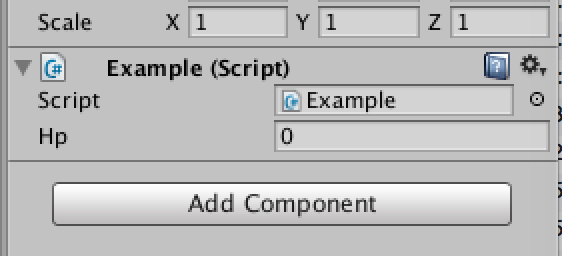


이 hp 변수에 다음의 제한이 걸려 있는 경우, 어떻게 하는게 좋을까요.
- HP의 상한 하한은 정해져 있다.
- 이 수치는 조정되지 않은 것으로, 수치를 변경하면서 적절한 수치를 찾아야 한다.
이들 제한(모양)은 개발할 때는 고려해야 하는 것으로, 특히 인스펙터에서 수치를 편집할 때는, 이러한 제한을 붙이는것은 표준 기능으로는 어렵습니다.


# 1. PropertyDrawer란

유니티는, Serialize된 데이터를 유니티가 자동판단해서 적절한 GUI를 사용해, 인스펙터에 표시합니다.

PropertyDrawer는 그 유니티에 의한 자동판단 처리를 Hook해서 스스로 GUI를 사용하기 위한 기술입니다. 이것을 통해 특정 GUI만을 커스터마이즈 할 수 있습니다.

인스펙터에 표시되는 컴포넌트의 GUI를 변경하기 위해서는 CustomEditor가 적절합니다. 하지만, 이것은 컴포넌트 전체의 커스터마이즈입니다. 지금은, 컴포넌트의 일부인 hp 변수(프로퍼티)만을 커스터마이즈 하고 싶은것이므로 CustomEditor가 아니라 PropertyDrawer를 사용합니다.


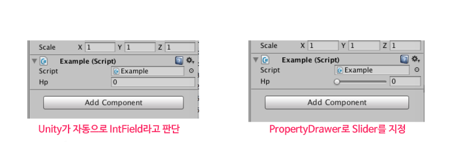


왼쪽은 유니티가 자동으로 IntField라고 판단했을 경우이고,
오른쪽은 PropertyDrawer로 Slider를 지정한 경우입니다.

예를들어 다음과 같이 Serialize 가능한 클래스가 있다고 합시다.

```csharp
[Serializable]
public class Character
{
        [SerializeField]
        string name;

        [SerializeField]
        int hp;
}
```

이것을 인스펙터로 표시하려고 하면 컴포넌트에는 있지만 실로 보기 힘들게 표시됩니다.

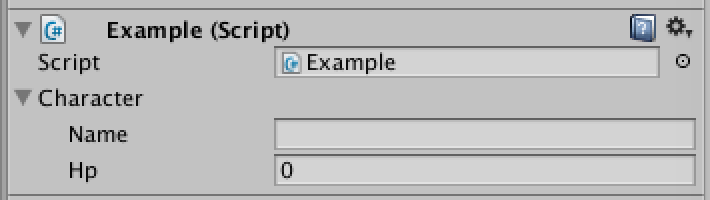


이것을 PropertyDrawer를 통해 GUI의 표시를 커스터마이즈해서, 1행에 표시시킬 수 있습니다.

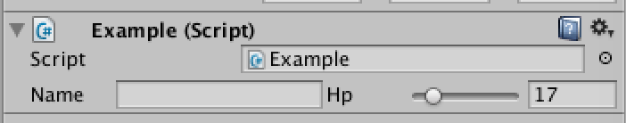


이렇게 인스펙터의 조자에서 불편하다고 생각한 부분을 커스터마이즈해나갈수 있습니다.


# 2. PropertyAttribute

PropertyAttribute는 단순히 Attribute를 상속한 클래스입니다. CustomEditor가 컴포넌트의 Editor 오브젝트를 확장하였듯이, PropertyDrawer는, PropertyAttribute를 확장합니다. (정확히 말해 PropertyAttribute가 붙은 Serialize 가능한 필드입니다).

```csharp
using UnityEngine;

public class ExampleAttribute : PropertyAttribute
{
}
```


# 3. CustomPropertyDrawer 와 PropertyDrawer

CustomEditor와 마찬가지인 구현방법으로, PropertyDrawer도 확장을 실행합니다.

PropertyDrawer를 상속한 자식 클래스를 생성하고, 확장하고 싶은 클래스를 CustomPropertyDrawer의 인자에 넘깁니다. Serialize 가능한 클래스이면 아래의 클래스를 작성합니다.

```csharp
[CustomPropertyDrawer (typeof(Character))]
public class CharacterDrawer : PropertyDrawer
{
}
```

PropertyAttribute의 자식 클래스의 경우도 같습니다.

```csharp
using UnityEngine;
using UnityEditor;

[CustomPropertyDrawer (typeof(ExampleAttribute))]
public class ExampleDrawer : PropertyDrawer
{
}
```

남은것은 작성한 PropertyAttribute를 필드에 추가시키는 것 뿐입니다.

```csharp
using UnityEngine;

public class Hoge : MonoBehaviour
{
    [SerializeField, Example]
    int hp;
}
```

# 4. RangeAtribute를 시험사기

이미 표준에서 몇개 정도 PropertyDrawer가 구현되어 있습니다.

그 중 하나인 RangeAttribute를 사용해 봅시다.

```csharp
using UnityEngine;

public class Example : MonoBehaviour
{
    [SerializeField, Range (0, 10)]
    int hp;
}
```

속성으로써 Range(0, 10)을 추가하는것 뿐인데, 0부터 10까지 슬라이드 가능한 Slider를 작성할 수 있습니다.

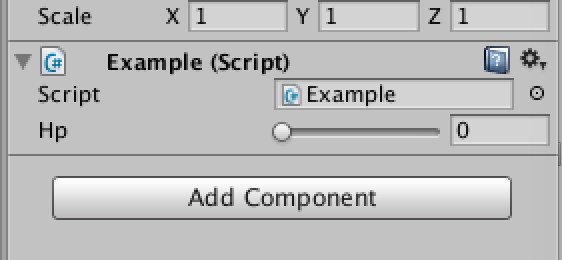


# 5. RangeAttribute를 자작하기

시험삼아, 표준 구현되어 있는 RangeAttribute와 같은 것을 작성해 봅니다.


## 5.1. [Range2Attribute의 작성]

최저치와 최고치를 유지하도록 하여, Attribute의 사용 제한을 설정합니다. AttributeUsage에 대해서는 이쪽 링크를 참고하여 주십시오.

(역주 : 한글 버젼 링크를 걸었습니다)

https://msdn.microsoft.com/ko-kr/library/system.attributeusageattribute(v=vs.110).aspx

```csharp
using UnityEngine;

[System.AttributeUsage (System.AttributeTargets.Field,
                               Inherited = true, AllowMultiple = false)]
public class Range2Attribute : PropertyAttribute
{
    public readonly int min;
    public readonly int max;

    public Range2Attribute (int min, int max)
    {
        this.min = min;
        this.max = max;
    }
}
```

## 5.2. [Range2Drawer의 작성]

속성에 붙은 필드는 SerializedProperty를 경유해 다룹니다. propertyType이 int이면 IntSlider를 사용하고, int 이외라면 표준 GUI를 사용합니다.

```csharp
using UnityEditor;
using UnityEngine;

[CustomPropertyDrawer (typeof(Range2Attribute))]
internal sealed class RangeDrawer : PropertyDrawer
{
    public override void OnGUI (Rect position,
                      SerializedProperty property, GUIContent label)
    {
        Range2Attribute range2 = (Range2Attribute)attribute;

        if (property.propertyType == SerializedPropertyType.Integer)
            EditorGUI.IntSlider (position, property, range2.min, range2.max, label);
        else
            EditorGUI.PropertyField (position, property, label);
    }
}
```

# 6. Range2Attribute를 사용하기

이상으로 구현이 끝났으므로 Range2Attribute를 사용해보았습니다. int 이외에서는 다룰 수 없는것을 확인하기 위해서 string에 대해서도 속성을 추가해보았습니다.

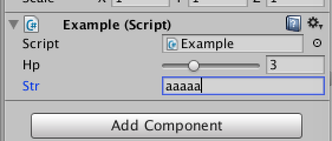

```csharp
using UnityEngine;

public class Example : MonoBehaviour
{
    [SerializeField, Range2 (0, 10)]
    int hp;

    [SerializeField, Range2 (0, 10)]
    string str;
}
```

# 7. 다양한 PropertyDrawer

유니티에 표준 구현되어 있는 것은 2장 "표준에서 사용하는 에디터 확장 기능"에서 소개해드렸습니다. 여기서는 제가 지금까지 작성한 PropertyDrawer를 소개하고자 합니다.


## 7.1. Angle

API로서 노브(손잡이)를 표시하는 EditorGUILayout.Knob가 있습니다. 하지만 PropertyDrawer에서는 EditorGUILayout의 사용이 금지되어 있어서 쓸 수 없습니다. 내부적으로는 EditorGUI.Knob이 구현되어 있어, 리플렉션을 사용해서 호출하는 것으로 사용이 가능하게 됩니다.

```csharp
private readonly MethodInfo knobMethodInfo = typeof(EditorGUI).GetMethod("Knob",
       BindingFlags.Instance | BindingFlags.NonPublic | BindingFlags.Static);

private float Knob(Rect position, Vector2 knobSize,
                      float currentValue, float start,
                      float end, string unit,
                      Color backgroundColor, Color activeColor,
                      bool showValue)
{
    var controlID = GUIUtility.GetControlID("Knob".GetHashCode(),
                                              FocusType.Native, position);

    var invoke = knobMethodInfo.Invoke(null, new object[] {
        position, knobSize, currentValue,
        start, end, unit, backgroundColor,
        activeColor, showValue,
        controlID });
    return (float)(invoke ?? 0);
}
```

## 7.2. GetPropertyHeight

GUI의 기본 높이값(EditorGUIUtility.singleLineHeight)을 변경하고 싶을 때는 GetPropertyHeight를 오버라이드 합니다.

```csharp
[CustomPropertyDrawer(typeof(AngleAttribute))]
public class AngleDrawer : PropertyDrawer
{
  private AngleAttribute angleAttribute { get { return (AngleAttribute)attribute; } }

  public override void OnGUI (Rect position,
                    SerializedProperty property, GUIContent label)
  {
    //생략
  }

  //반환값으로써 반환된 값이 GUI의 높이로써 사용됩니다
  public override float GetPropertyHeight(SerializedProperty property,
                                                            GUIContent label)
  {
      var height = base.GetPropertyHeight(property, label);

      var floatType = property.propertyType != SerializedPropertyType.Float;

      return floatType ? height : angleAttribute.knobSize + 4;
  }
}
```

## 7.3. AnimatorParameter

Animator 윈도우에 있는 파라메터 이름을 타입 상관없이 필드에 Attach할 수 있습니다. 얻어올 수 있는 파라메터는 같은 게임 오브젝트에 Attach되어 있는 Animator Controller의 파라메터가 됩니다.

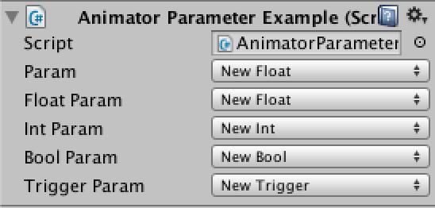

```csharp
using UnityEngine;

[RequireComponent(typeof(Animator))]
public class AnimatorParameterExample : MonoBehaviour
{
    //모든 타입의 파라메터를 얻어오기
    [AnimatorParameter]
    public string param;

    //Float만
    [AnimatorParameter(AnimatorParameterAttribute.ParameterType.Float)]
    public string floatParam;

    //Int만
    [AnimatorParameter(AnimatorParameterAttribute.ParameterType.Int)]
    public string intParam;

    //Bool만
    [AnimatorParameter(AnimatorParameterAttribute.ParameterType.Bool)]
    public string boolParam;

    //Trigger만
    [AnimatorParameter(AnimatorParameterAttribute.ParameterType.Trigger)]
    public string triggerParam;
}
```

## 7.4. [같은 오브젝트의 컴포넌트를 얻어오기]

이번에는 같은 게임오브젝트에 Attach되어 있는 Animator 컴포넌트로부터 AnimatorController를 얻어옵니다. 컴포넌트는 SerializedProperty->SerializedObject->Component의 순서로 얻어올 수 있습니다.

```csharp
AnimatorController GetAnimatorController(SerializedProperty property)
{
    var component = property.serializedObject.targetObject as Component;

    if (component == null)
    {
        Debug.LogException(new InvalidCastException("Couldn't cast targetObject"));
    }

    var anim = component.GetComponent<Animator>();

    if (anim == null)
    {
        var exception = new MissingComponentException("Missing Aniamtor Component");
        Debug.LogException(exception);
        return null;
    }

    return anim.runtimeAnimatorController as AnimatorController;
}
```

## 7.5. DisableAttribute

프로퍼티를 인스펙터 상에서 편집 못하게 막습니다. 인스펙터에 표시하고 싶은데, 수치를 변경시키고 싶지 않은 때에 사용합니다.

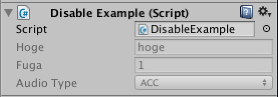

```csharp
using UnityEngine;

public class DisableExample : MonoBehaviour
{
    [Disable]
    public string hoge = "hoge";

    [Disable]
    public int fuga = 1;

    [Disable]
    public AudioType audioType = AudioType.ACC;
}
```

구현 방법은 간단합니다.

BeginDisabledGroup과 EndDisabledGroup, 혹은 DisabledGroupScope를 사용해 PropertyField를 감싸는 걸로 구현할 수 있습니다.

인스펙터에서 편집할 수 없게 되었다 해도, 인스펙터를 Debug 모드로 하면 편집할수 있고, 스크립트에서 수치의 편집이 가능하므로 주의해주세요.

```csharp
public override void OnGUI(Rect position,
                             SerializedProperty property, GUIContent label)
{
    EditorGUI.BeginDisabledGroup(true);
    EditorGUI.PropertyField(position, property, label);
    EditorGUI.EndDisabledGroup();
}
```

## 7.6. EnumLabel

Enum의 표시 이름을 변경합니다.

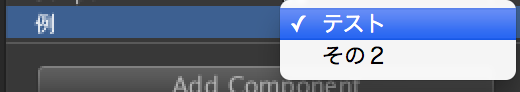

```csharp
using UnityEngine;

public class EnumLabelExample : MonoBehaviour
{
    public enum Example
    {
        [EnumLabel("テスト")]
        HIGH,
        [EnumLabel("その２")]
        LOW
    }

    [EnumLabel("例")]
    public Example test = Example.HIGH;
}
```

GUI를 표시할 때에 EnumLabel에 건네준 문자열을 사용해서 Popup을 표시합니다. 위의 예시같이 test 변수에도 속성을 붙이지 않으면 적용되지 않습니다. 이것은 PropertyAttribute가 필드에 붙어있지 않으면 이벤트가 발생하지 않기 때문입니다.


## 7.7. Popup

Attribute에 넘겨준 파라메터를 사용해 Popup을 표시합니다. 수치를 Popup으로 선택할 수 있게 됩니다.

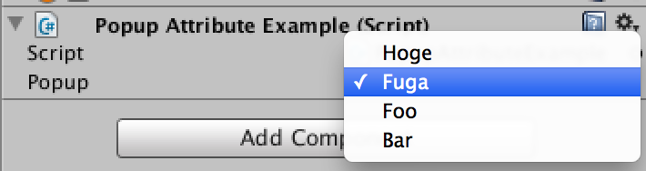

```csharp
using UnityEngine;
using System.Collections;

public class PopupExample : MonoBehaviour
{
    [Popup("Hoge","Fuga","Foo","Bar")]
    public string popup;

    [Popup(1,2,3,4,5,6)]
    public int popup2;

    [Popup(1.5f,2.3f,3.4f,4.5f,5.6f,6.7f)]
    public float popup3;
}
```

수치를 가진 쪽을 object로 하고 있으므로 다수의 타입을 지원합니다.

```csharp
public class PopupAttribute : PropertyAttribute
{
    public object[] list;

    // 인자는 object 배열
    public PopupAttribute (params object[] list)
    {
        this.list = list;
    }
}
```

하지만 이렇게 하면 Popup에서 선택된 수치를 대입할 때에 조금 고생합니다.

SerializedProperty에 수치를 대입하는 것은 property.stringValue, property.intValue, property.floatValue와 같이 각자의 변수에 대입해야 합니다.


## 7.8. PreviewTexture

텍스쳐의 프리뷰를 표시합니다.

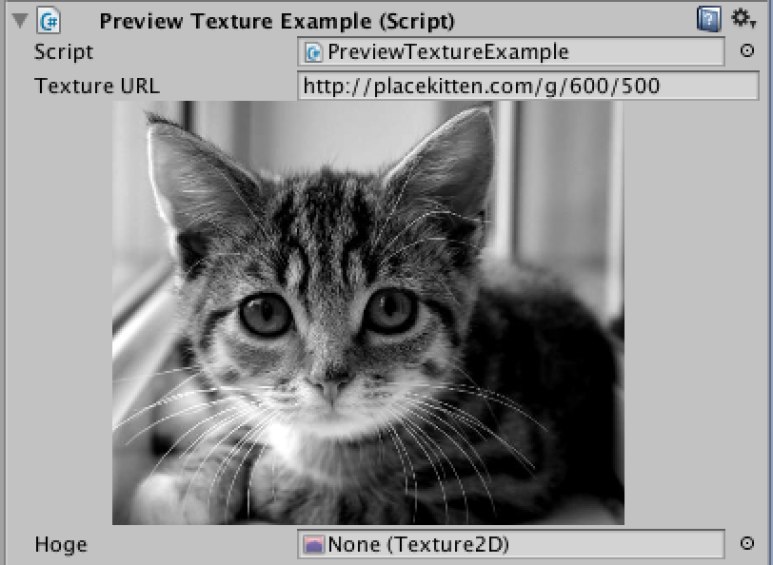

```csharp
using UnityEngine;

public class PreviewTextureAttributeExample : MonoBehaviour
{
    //60초 캐쉬일것
    [PreviewTexture(60)]
    public string textureURL = "https://www.hogehoge.com/image.png";

    [PreviewTexture]
    public Texture hoge;
}
```

## 7.9. [텍스쳐 표시는 GUIStyle을 쓴다]

텍스쳐의 표시는 EditorGUI.DrawPreviewTextrue를 사용하고 있는데, PropertyDrawer에서는 렌더링 타이밍의 관계에서 텍스쳐가 표시/비표시되는것을 조절해버리는 문제가 발생합니다. 이런 문제가 있어서 대안으로서 GUIStyle을 사용해서 스타일의 배경으로서 텍스쳐를 렌더링합니다.

```csharp
void DrawTexture(Rect position, Texture2D texture)
{
    float width = Mathf.Clamp(texture.width,
                              position.width * 0.7f,
                              position.width * 0.7f);

    var rect = new Rect(position.width * 0.15f,
                        position.y + 16,
                        width,
                        texture.height * (width / texture.width));

    if (style == null)
    {
        style = new GUIStyle();
        style.imagePosition = ImagePosition.ImageOnly;
    }

    style.normal.background = texture;
    GUI.Label(rect, "", style);
}
```

### 7.9.1. SceneName

: 유효한 씬 이름을 Popup으로 선택할 수 있습니다. Popup으로 표시되는 것은 Build Settings 의 Scene In Build에 포함되어 있는 씬 이름입니다.

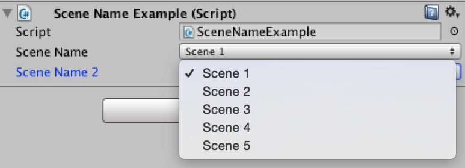

```csharp
using UnityEngine;

public class SceneNameExample : MonoBehaviour
{
    [SceneName]
    public string sceneName;

    //무효 상태의 씬을 표시합니다.
    [SceneName(false)]
    public string sceneName2;
}
```

## 7.10. [EditorBuildSettings.scenes에서 씬의 목록을 얻어오기]

씬은 EditorBuildSettings.scenes 변수에서 관리되고 있습니다. 단, Build Settings의 Scene In Build에 씬 등록되어 있지 않으면 목록에 포함되지 않기 때문에 주의해주세요. 