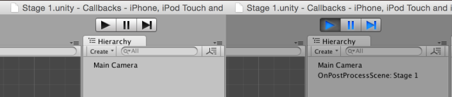
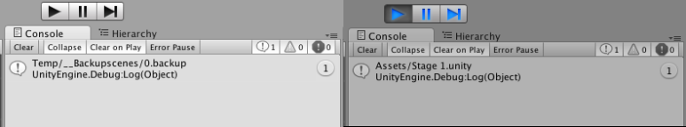
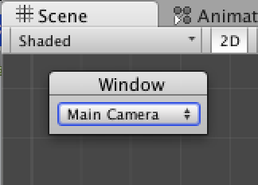
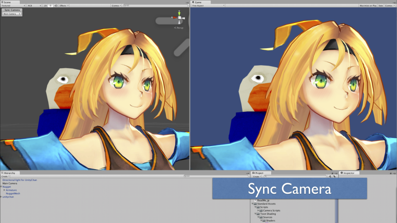
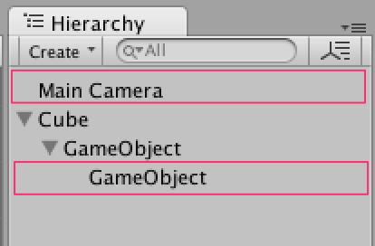
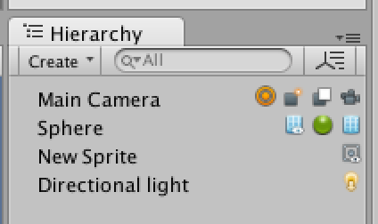
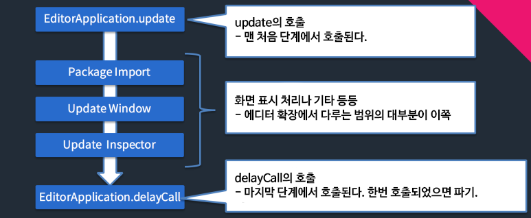
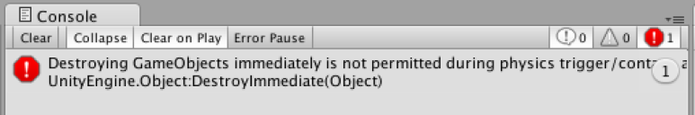
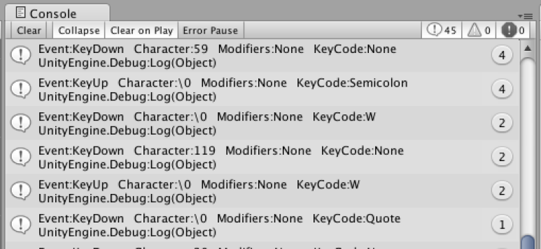

[에디터 확장 입문] 번역 13장 다양한 이벤트 콜백

번역/유니티/유니티에디터확장입문


><주의>
원문의 작성 시기는 2016년경으로, 코드나 일부 설명이 최신 유니티 버젼과 다소 맞지 않을 수 있습니다.
원문 작성자 분 역시 2019년경에 내용에 다소 오류가 있다는 이유로 웹 공개 버젼을 비공개 처리하였습니다.
(2022.10.08 역자)

원문 링크 (2022.10.08 지금은 폐기)

http://anchan828.github.io/editor-manual/web/callbacks.html

---
목차
- [1. PostProcessBuildAttribute](#1-postprocessbuildattribute)
- [2. PostProcessSceneAttribute](#2-postprocesssceneattribute)
- [3. InitializeOnLoad](#3-initializeonload)
- [4. InitializeOnLoadMethod](#4-initializeonloadmethod)
- [5. DidReloadScripts](#5-didreloadscripts)
- [6. EditorUserBuildSettings.activeBuildTargetChanged](#6-editoruserbuildsettingsactivebuildtargetchanged)
- [7. EditorApplication.hierarchyWindowChanged와 projectWindowChanged](#7-editorapplicationhierarchywindowchanged와-projectwindowchanged)
- [8. EditorApplication.hierarchyWindowItemOnGUI와 projectWindowItemOnGUI](#8-editorapplicationhierarchywindowitemongui와-projectwindowitemongui)
- [9. EditorApplication.playmodeStateChanged](#9-editorapplicationplaymodestatechanged)
- [10. EditorApplication.modifierKeysChanged](#10-editorapplicationmodifierkeyschanged)
- [11. EditorApplication.update](#11-editorapplicationupdate)
- [12. EditorApplication.delayCall](#12-editorapplicationdelaycall)
- [13. EditorApplication.globalEventHandler](#13-editorapplicationglobaleventhandler)


Unity에서는 "빌드 후", "컴파일 후", "플랫폼의 변경 후" 등 특정 액션 뒤에 호출되는 다양한 콜백 함수가 존재합니다. 이들 콜백의 안에는 사용함으로써 작업의 자동화가 이루어지는 "모르면 손해"인 콜백도 있습니다.


# 1. PostProcessBuildAttribute

Build Settings 윈도우와 BuildPipeline.BuildPlayer에 따른 앱의 빌드 후에 호출될 콜백입니다. 

빌드에서 생성된 Xcode프로젝트나 Android Project 등으로 성과물을 더 가공하거나 앱을 생성하는 것까지 자동화할 수도 있습니다. CI툴과 조합하거나 게임 개발에 있어서 필수라고 할 정도로 중요한 콜백이므로 꼭 기억하세요. 

http://docs.unity3d.com/ScriptReference/iOS.Xcode.PBXProject.html

다음 샘플에서는 Xcode Manipulation API를 사용하여 프레임워크를 추가하고 있습니다.

```csharp
using UnityEditor;
using UnityEditor.Callbacks;
using System.IO;
using UnityEditor.iOS.Xcode;

public class NewBehaviourScript
{
    //callbackOrder 으로 실행 순서를 지정할 수 있다
    //0 이 내부에서 쓰이는 order 이므로 1 이상을 지정한다
    [PostProcessBuild(1)]
    static void OnPostProcessBuild (BuildTarget buildTarget, string path)
    {
        if (buildTarget != BuildTarget.iOS)
            return;

        //Xcode 프로젝트의 경로를 얻어오기
        var xcodeprojPath = Path.Combine (path, "Unity-iPhone.xcodeproj");
        var pbxprojPath = Path.Combine (xcodeprojPath, "project.pbxproj");

        //Xcode 프로젝트 로드
        PBXProject proj = new PBXProject ();
        proj.ReadFromFile (pbxprojPath);

        var target = proj.TargetGuidByName("Unity-iPhone");

        proj.AddFrameworkToProject (target, "Social.framework", false);
        proj.WriteToFile (pbxprojPath);
    }
}
```

# 2. PostProcessSceneAttribute

씬을 재생할 때나 빌드 시 형태 구축할 때 등의 "장면을 로드한 뒤"에 호출되는 콜백입니다. 이 속성을 붙인 함수 내에서 게임 오브젝트나 프리펩에서 생성함으로써 "수동으로 Prefab을 씬에 포함시키는 작업" 이상의 강제력을 갖게 할 수 있습니다.



게임 재생 시 자동으로 게임 오브젝트가 생성됩니다.

```csharp
using UnityEngine;
using UnityEditor;
using UnityEditor.Callbacks;
using UnityEditor.SceneManagement;

public class NewBehaviourScript
{
    [PostProcessScene]
    static void OnPostProcessScene ()
    {
        //현재 멀티 씬 정보를 얻어오기
        foreach (var sceneSetup in EditorSceneManager.GetSceneManagerSetup()) {

            var scene = EditorSceneManager.GetSceneByPath (sceneSetup.path);
            var go = new GameObject ("OnPostProcessScene: " + scene.name);

            EditorSceneManager.MoveGameObjectToScene (go, scene);
        }
    }
}
```
다만, 게임 재생시 및 빌드 시 씬 에셋의 경로를 취득하는 방법에 문제가 발생합니다. 보통 현재 열고 있는 씬의 경로를 얻어오려면 EditorSceneManager.GetActiveScene이나 EditorSceneManager.GetSceneManagerSetup을 사용하고 씬 정보를 얻어옵니다. 에디터 상에서 게임을 재생할 때는 괜찮지만, 문제인 것은 빌드 시입니다. 빌드 시는 현재 에디터로 열고 있는 씬은 백업된 씬을 사용합니다.




왼쪽이 빌드 시의 Debug.Log이고, 오른쪽이 에디터 상에서 게임 재생 시의 Debug.Log입니다.

```csharp
using UnityEngine;
using UnityEditor;
using UnityEditor.Callbacks;
using UnityEditor.SceneManagement;

public class NewBehaviourScript1
{
    [PostProcessScene]
    static void OnPostProcessScene ()
    {
        foreach (var sceneSetup in EditorSceneManager.GetSceneManagerSetup()) {
            Debug.Log (sceneSetup.path);
        }
    }
}
```

대책으로서는, 빌드 전에, 빌드 시에 포함되는 씬 파일을 열지 않는 것입니다. 새로운 씬을 작성하는 것으로 회피할 수 있습니다. 이것은 분명히 버그이기 때문에 조만간 해결될 가능성이 있습니다.


# 3. InitializeOnLoad

Unity 에디터의 기동시, 스크립트의 컴파일 직후에 클래스의 static 생성자를 불러내기 위한 속성입니다. 컴파일 직후에 매번 하고 싶은 처리, 예를 들면 (컴파일마다 델리 게이트에 등록한 것이 초기화되기 때문에) 델리 게이트의 재등록을 할 목적으로 사용됩니다. 

주의할 점은 에디터 상에서 게임을 재생한 직후에도 InitializeOnLoad 속성이 붙은 static 생성자가 호출됩니다. 

이것에 대한 대책으로는 static 생성자 내에서 EditorApplication.isPlayingOrWillChangePlaymode를 사용, 게임 재생시에 호출된 것인지를 판단합니다.

```csharp
using UnityEditor;
using UnityEngine;

[InitializeOnLoad]
public class NewBehaviourScript
{
    static NewBehaviourScript ()
    {
        if (EditorApplication.isPlayingOrWillChangePlaymode)
            return;

        Debug.Log ("call");
    }
}
```
또 Unity 에디터를 기동한 직후에만 실행하고 싶은 경우는 EditorApplication.timeSinceStartup을 조합해서 사용합니다.

```csharp
using UnityEditor;
using UnityEngine;

[InitializeOnLoad]
public class NewBehaviourScript
{
    static NewBehaviourScript ()
    {
        //10초 안이면 기동 시에 판단한다
        if (10 < EditorApplication.timeSinceStartup)
            return;

        Debug.Log ("기동 시에 호출된다");
    }
}
```

# 4. InitializeOnLoadMethod

InitializeOnLoad의 함수 판입니다. static 함수에 이 속성을 부가함으로써 InitializeOnLoad와 같은 타이밍(정확히는 InitializeOnLoad가 먼저 호출됩니다)로 불러낼 수 있습니다.

```csharp
using UnityEditor;
using UnityEngine;

public class NewBehaviourScript
{
    [InitializeOnLoadMethod]
    static void RunMethod ()
    {
    }
}
```
단, InitializeOnLoadMethod의 실행 순서를 지정하는 것은 불가능하다는 것을 주의합시다.

# 5. DidReloadScripts

기능적으로는 InitializeOnLoadMethod와 거의 같습니다. 단지 하나 다른 점은 실행 순서를 선택할 수 있다는 점입니다. 인자로서 callbackOrder가 있어 오름차순으로 실행할 수 있습니다.

```csharp
using UnityEditor;
using UnityEngine;
using UnityEditor.Callbacks;

public class NewBehaviourScript
{

    [DidReloadScripts(0)]
    static void First ()
    {
        Debug.Log ("처음에 처리한다");
    }

    [DidReloadScripts(1)]
    static void Second ()
    {
        Debug.Log ("다음에 처리한다");
    }
}
```

# 6. EditorUserBuildSettings.activeBuildTargetChanged

Build Settings 윈도우와 EditorUserBuildSettings.SwitchActiveBuildTarget의 플랫폼이 변경될 때 호출되는 콜백입니다. 플랫폼마다 다른 설정, 예를 들면 BundleIdentifier의 변경이나, StreamingAssets와 Resources폴더의 내용 변경 등으로 활용할 수 있습니다.

```csharp
using UnityEditor;
using UnityEngine;

public class NewBehaviourScript
{

    [InitializeOnLoadMethod]
    static void ChangeBundleIdentifier ()
    {
        //플랫폼에 따라 bundleIdentifier 를 변경한다
        EditorUserBuildSettings.activeBuildTargetChanged += () => {

            var bundleIdentifier = "com.kyusyukeigo.superapp";

            switch (EditorUserBuildSettings.activeBuildTarget) {
                case BuildTarget.iOS:
                    bundleIdentifier += ".ios";
                    break;
                case BuildTarget.Android:
                    bundleIdentifier += ".android";
                    break;
                case BuildTarget.WSAPlayer:
                    bundleIdentifier += ".wp";
                    break;
                default:
                    break;
            }

            if (Debug.isDebugBuild)
                bundleIdentifier += ".dev";

            PlayerSettings.bundleIdentifier = bundleIdentifier;
        };
    }
}
```

# 7. EditorApplication.hierarchyWindowChanged와 projectWindowChanged

선택하고 있는 오브젝트를 변경하거나 신규 게임 오브젝트를 작성하는 등 여러 요인에 의해서 조직이나 프로젝트 구성이 변경될 때 호출됩니다. 씬 내의 게임 오브젝트를 대상으로 어떤 처리를 하고 있는 경우에 사용하면 편리합니다. 다음 코드는 씬 내 카메라를 나열하는 코드입니다.



```csharp
using System.IO;
using UnityEditor;
using UnityEngine;
using System.Linq;

public class NewBehaviourScript
{

  [InitializeOnLoadMethod]
  static void DrawCameraNames()
  {

    var selected = 0;
    var displayNames = new string[0];
    var windowRect = new Rect(10, 20, 200, 24);

    //변경점이 있으면 초기화
    EditorApplication.hierarchyWindowChanged += () =>
    {
      var cameras = Object.FindObjectsOfType<Camera>();
      var cameraNames = new string[0];

      // 멀티 씬이면, 어느 씬에 있는 카메라인지를 파악할 수 있게 하기
      if (1 < EditorSceneManager.loadedSceneCount)
      {
        //Main Camera (Stage 1.unity) 라는 식으로 표시
        cameraNames =
          cameras.Select(camera => new
          {
            cameraName = camera.name,
            sceneName = Path.GetFileName(AssetDatabase.GetAssetOrScenePath(camera))
          })
            .Select(x => string.Format("{0} ({1})", x.cameraName, x.sceneName))
            .ToArray();
      }
      else
        cameraNames = cameras.Select(c => c.name).ToArray();

      displayNames = new[] { "None", "" };
      ArrayUtility.AddRange(ref displayNames, cameraNames);
    };

    //임의의 타이밍에 호출시킬 수도 있음
    EditorApplication.hierarchyWindowChanged();

    //전체 씬 뷰의 GUI 델리게이트
    SceneView.onSceneGUIDelegate += (sceneView) =>
    {

      GUI.skin = EditorGUIUtility.GetBuiltinSkin(EditorSkin.Inspector);

      Handles.BeginGUI();

      int windowID =
        EditorGUIUtility.GetControlID(FocusType.Passive, windowRect);
      //씬 뷰에 윈도우를 추가
      windowRect = GUILayout.Window(windowID, windowRect, (id) =>
      {

        selected = EditorGUILayout.Popup(selected, displayNames);

        //드래그 할수 있도록 함
        GUI.DragWindow();

      }, "Window");

      Handles.EndGUI();
    };
  }
}
```

또 위의 코드에 씬의 카메라와 게임 내의 카메라의 Transform을 동기화시키면 씬 뷰 카메라의 위치/경향이 그대로 게임 뷰에도 반영됩니다. 




https://github.com/anchan828/unitejapan2014/tree/master/SyncCamera/Assets


# 8. EditorApplication.hierarchyWindowItemOnGUI와 projectWindowItemOnGUI

Hierarchy와 프로젝트 창에서 각 게임 오브젝트와 에셋의 문자가 렌더링되고 있는 범위를 콜백으로 취득할 수 있습니다.




이들은 작은 범위 안에서 게임 오브젝트 정보를 표시해도 좋고, 버튼 등을 배치 해서 뭔가에 대한 트리거로 삼는 것도 좋을지도 모릅니다. 


다만, 주의할 점은 에셋 스토어에 있는 에셋에서도 hierarchyWindowItemOnGUI을 사용하고 있을 가능성이 있다는 점입니다. 만약 사용하는 경우이고, 또한 뭔가에 대한 트리거가 되어 있는 경우는 hierarchyWindowItemOnGUI의 사용은 삼가해야 될 수도 있습니다.



```csharp
using UnityEditor;
using UnityEngine;

public class NewBehaviourScript
{

    [InitializeOnLoadMethod]
    static void DrawComponentIcons ()
    {
        EditorApplication.hierarchyWindowItemOnGUI += (instanceID, selectionRect) => {
            //인스턴스 ID 로부터 게임 오브젝트를 얻어오기
            var go = (GameObject)EditorUtility.InstanceIDToObject (instanceID);

            if (go == null)
                return;

            var position = new Rect (selectionRect) {
                width = 16,
                height = 16,
                x = Screen.width - 20
            };

            foreach (var component in go.GetComponents<Component>()) {
                //Transform는 모든 게임 오브젝트에 있으므로
                //쓸데없는 정보이므로 표시하지 않는다
                if (component is Transform)
                    continue;

                var icon = AssetPreview.GetMiniThumbnail (component);

                GUI.Label (position, icon);
                position.x -= 16;
            }
        };
    }
}
```

# 9. EditorApplication.playmodeStateChanged


이것의 재생 상태를 바꾸었을 때 호출될 콜백입니다. 다만, 인자도 없으므로 "현재의 재생 상태는 무엇인지"는 유저의 손으로 직접 판단해야 합니다. 

```csharp
[InitializeOnLoadMethod]
static void CheckPlaymodeState ()
{
    EditorApplication.playmodeStateChanged += () => {

        if (EditorApplication.isPaused) {
            //일시정지중
        }

        if (EditorApplication.isPlaying) {
            //재생중
        }

        if (EditorApplication.isPlayingOrWillChangePlaymode) {
            //재생중 혹은 재생 버튼을 누른 직후
            //컴파일과 다양한 처리가 이루어지는 상태
            //혹은 재생을 중지한 때에도 호출됩니다
        }
    };
}
```
다음은 "컴파일 오류가 나온 채로 재생 버튼을 누르면, 드래곤 퀘스트의 저주의 효과음을 재생하는" 샘플

```csharp
using UnityEngine;
using UnityEditor;
using System.Reflection;

[InitializeOnLoad]
public class CompileError
{
    //효과음. 원하는 곡으로 변경하기
    //http://commons.nicovideo.jp/material/nc32797
    const string musicPath = "Assets/Editor/nc32797.wav";
    const BindingFlags flags = BindingFlags.NonPublic | BindingFlags.Instance;

    static CompileError ()
    {
        EditorApplication.playmodeStateChanged += () => {

            //재생 버튼을 눌렀을때여야 할것
            if (!EditorApplication.isPlayingOrWillChangePlaymode
                 && EditorApplication.isPlaying)
                return;

            //SceneView 이 존재할 것
            if (SceneView.sceneViews.Count == 0)
                return;

            EditorApplication.delayCall += () => {
                var content = typeof(EditorWindow)
                    .GetField ("m_Notification", flags)
                    .GetValue (SceneView.sceneViews [0]) as GUIContent;

                if (content != null && !string.IsNullOrEmpty (content.text)) {
                    GetAudioSource ().Play ();
                }
            };
        };
    }

    static AudioSource GetAudioSource ()
    {
        var gameObjectName = "HideAudioSourceObject";
        var gameObject = GameObject.Find (gameObjectName);

        if (gameObject == null) {
            //HideAndDontSave 플래그를 세우면 표시 안하고 저장 안하는걸로 하기
            gameObject =
                EditorUtility.CreateGameObjectWithHideFlags (gameObjectName,
                    HideFlags.HideAndDontSave, typeof(AudioSource));
        }

        var hideAudioSource = gameObject.GetComponent<AudioSource> ();

        if (hideAudioSource.clip == null) {
            hideAudioSource.clip =
                AssetDatabase.LoadAssetAtPath (musicPath,
                                            typeof(AudioClip)) as AudioClip;
        }

        return hideAudioSource;
    }
}
```

# 10. EditorApplication.modifierKeysChanged

어떤 수식 키를 눌렀을 때 호출될 콜백입니다. EditorWindow, 인스펙터에서는 수식 키를 누른 것만으로는 GUI를 다시 렌더링하는 처리가 이루어지지 않습니다. 그것이 가능하도록 이 콜백을 사용합니다.

```csharp
using UnityEditor;
using UnityEngine;

public class NewBehaviourScript : EditorWindow
{
    [MenuItem ("Window/Example")]
    static void CheckModifierKeysChanged ()
    {
        GetWindow<NewBehaviourScript> ();
    }

    void OnEnable ()
    {
        EditorApplication.modifierKeysChanged += Repaint;
    }

    void OnGUI ()
    {
        GUILayout.Label (Event.current.modifiers.ToString());
    }
}
```

# 11. EditorApplication.update

Unity 에디터의 갱신 시기에 호출될 콜백입니다. 에디터에도 MonoBehaviour의 Update 같은 일정한 갱신 시기가 있습니다. 호출 빈도는 약 200회/초로, 렌더링 처리 전에 실행됩니다.

예를 들어 WWW의 통신도 사용할 수 있습니다.

(200회/초 실행되는 것은 버그라는 보고가 있습니다. 문서에서는 100회/초라고 기재되어 있습니다.)

```csharp
using UnityEditor;
using UnityEngine;
using System;
using System.IO;
using UnityEngine.Experimental.Networking;
public class NewBehaviourScript
{
    [MenuItem("Assets/Get Texture")]
    static void TestWWW()
    {
        //이미지 URL
        var www = UnityWebRequest.GetTexture("http://placehold.it/350x150");

        //이미지를 얻어와서 저장한다
        EditorUnityWebRequest(www, () =>
        {
            var downloadHandler = (DownloadHandlerTexture)www.downloadHandler;
            var assetPath = "Assets/New Texture.png";
            File.WriteAllBytes(assetPath, downloadHandler.data);
            AssetDatabase.ImportAsset(assetPath);
        });
    }

    static void EditorUnityWebRequest(UnityWebRequest www, Action callback)
    {
        www.Send();
        EditorApplication.CallbackFunction update = null;

        update = () =>
        {
            //매 프레임 체크
            if (www.isDone && string.IsNullOrEmpty(www.error))
            {
                callback();
                EditorApplication.update -= update;
            }
        };

        EditorApplication.update += update;
    }
}
```
이 밖에도 독자적인 콜백을 구현할 때도 사용할 수 있습니다. 

다음 코드는 Focus를 맞춘 EditorWindow가 변경할 때마다 호출될 콜백을 작성합니다.

```csharp
using UnityEngine;
using UnityEditor;
using System;

[InitializeOnLoad]
class EditorApplicationUtility
{
    public static Action<EditorWindow> focusedWindowChanged;

    static EditorWindow currentFocusedWindow;

    static EditorApplicationUtility ()
    {
        EditorApplication.update += FocusedWindowChanged;

    }

    static void FocusedWindowChanged ()
    {
        if (currentFocusedWindow != EditorWindow.focusedWindow) {
            currentFocusedWindow = EditorWindow.focusedWindow;
            focusedWindowChanged (currentFocusedWindow);
        }
    }
}


[InitializeOnLoad]
public class Test
{
    static Test ()
    {
        EditorApplicationUtility.focusedWindowChanged += (window) => {
            Debug.Log (window);
        };
    }
}
```

25장 "시간을 제어하는 TimeControl"과 같이 시간관리를 위해 사용하는 것도 추천합니다.


# 12. EditorApplication.delayCall

인스펙터 관련의 갱신 처리 후 실행되는 콜백입니다. 1번 실행하면 등록된 델리 게이트는 파기됩니다.




쓸 만한 사용처로는, 에디터의 라이프 사이클을 불가피하게 위반해야 하는 경우에 사용합니다. 예를 들어 MonoBehaviour의 OnValidate메서드 내에서 오브젝트의 파기는 없습니다. OnValidate은 인스펙터의 갱신 중에 실행되므로 오브젝트의 파기가 금지되어 있습니다.




불가피하게 오브젝트의 파기를 하고 싶을 때 EditorApplication.delayCall을 사용하여 가장 마지막으로 처리를 미루는 것으로 여러가지 문제를 회피합니다.

```csharp
using UnityEngine;

public class NewBehaviourScript : MonoBehaviour
{
    public GameObject go;

    #if UNITY_EDITOR
    void OnValidate ()
    {
        UnityEditor.EditorApplication.delayCall += () => {
            DestroyImmediate (go);
            go = null;
        };
    }
    #endif
}
```

# 13. EditorApplication.globalEventHandler

Unity 에디터 전체에서 어떤 이벤트가 실행될 때 실행되는 콜백입니다. 이것은 정식으로 공개되지 않지만 어떤 키 이벤트나 마우스 위치 등 파악하고 싶을 때 사용하면 편리합니다. 

다음 코드는 globalEventHandler를 사용하기 쉽게 한 래퍼 클래스입니다.



```csharp
using UnityEngine;
using UnityEditor;
using System.Reflection;
using CallbackFunction = UnityEditor.EditorApplication.CallbackFunction;

[InitializeOnLoad]
class EditorApplicationUtility
{
    static BindingFlags flags =
        BindingFlags.Static | BindingFlags.Instance | BindingFlags.NonPublic;

    static FieldInfo info = typeof(EditorApplication)
                                     .GetField ("globalEventHandler", flags);

    public static CallbackFunction globalEventHandler {
        get {
            return  (CallbackFunction)info.GetValue (null);
        }
        set {
            CallbackFunction functions = (CallbackFunction)info.GetValue (null);
            functions += value;
            info.SetValue (null, (object)functions);
        }
    }
}


[InitializeOnLoad]
public class Test
{
    static Test ()
    {
        EditorApplicationUtility.globalEventHandler += () => {
            Debug.Log (Event.current);
        };
    }
}
```
단, 게임 뷰와, 다른 일부 윈도우 상에서는 동작하지 않으므로 주의해주세요.