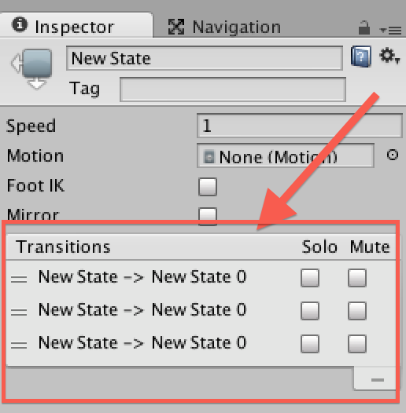
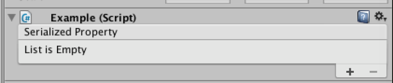
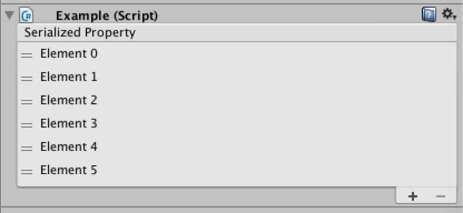
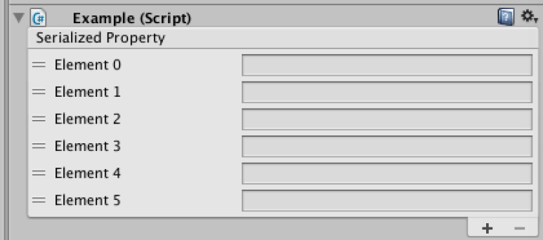
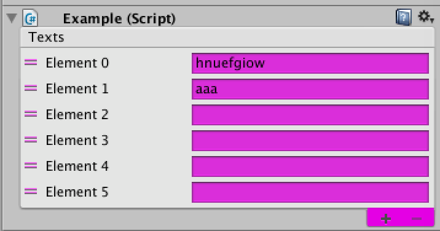
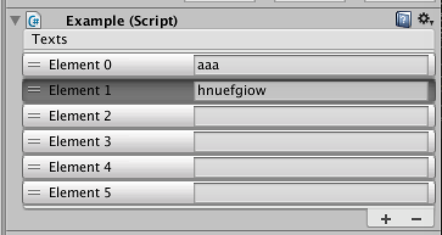
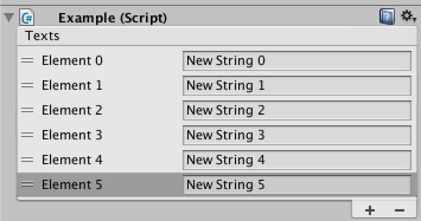
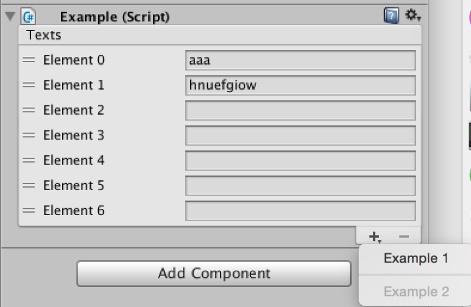
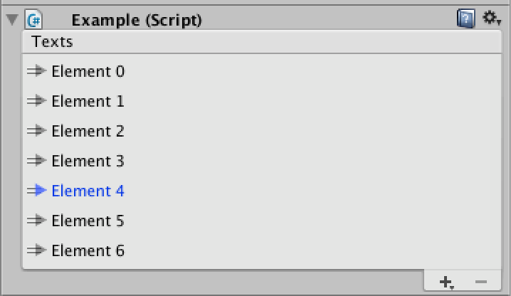
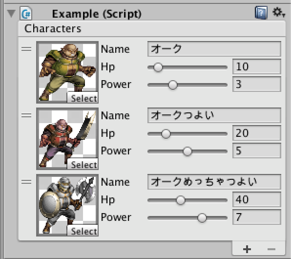

[에디터 확장 입문] 번역 14장 ReorderbleList

번역/유니티/유니티에디터확장입문

><주의>
원문의 작성 시기는 2016년경으로, 코드나 일부 설명이 최신 유니티 버젼과 다소 맞지 않을 수 있습니다.
원문 작성자 분 역시 2019년경에 내용에 다소 오류가 있다는 이유로 웹 공개 버젼을 비공개 처리하였습니다.
(2022.10.08 역자)

원문 링크 (2022.10.08 지금은 폐기)

http://anchan828.github.io/editor-manual/web/reorderblelist.html

---
목차
- [1. ReorderbleList의 사용법](#1-reorderblelist의-사용법)
- [2. 커스터마이즈](#2-커스터마이즈)
  - [2.1. [요소의 표시]](#21-요소의-표시)
  - [2.2. [프로퍼티의 저장]](#22-프로퍼티의-저장)
- [3. 헤더의 표시](#3-헤더의-표시)
- [4. 헤더의 표시는 커스터마이즈하지 않는다](#4-헤더의-표시는-커스터마이즈하지-않는다)
- [5. 각 요소의 배경](#5-각-요소의-배경)
- [6. 요소의 추가](#6-요소의-추가)
- [7. "+" 버튼에 드롭다운 메뉴를 추가](#7--버튼에-드롭다운-메뉴를-추가)
- [8. 요소를 정렬한 직후의 콜백](#8-요소를-정렬한-직후의-콜백)
- [9. 아직 다른 것도 있습니다](#9-아직-다른-것도-있습니다)
- [10. 요소의 GUI를 커스터마이즈](#10-요소의-gui를-커스터마이즈)





ReorderbleList는 인스펙터나 EditorWindow에 표시되는 리스트의 프로퍼티를 더 시각화한 것입니다. 요소 정렬 및 요소 추가 방법의 커스터마이즈 등 폭넓은 기능을 사용할 수 있게 됩니다. 

이 기능은 공식으로 문서화되지 않고 비 권장 취급이 되고 있지만 Animator와 Tag and Layer 설정 화면에서 오랫동안 사용되고 있어 당장 못 쓰게 될 리는 없습니다.

# 1. ReorderbleList의 사용법

ReorderbleList은 IList의 상속 클래스 또는 Array나 List의 SerializedProperty를 사용하여 GUI을 렌더링합니다.

```csharp
using UnityEngine;

public class Example : MonoBehaviour
{
    [SerializeField]
    string[] texts;
}
```

```csharp
using UnityEngine;
using UnityEditor;
using UnityEditorInternal;

[CustomEditor (typeof(Example))]
public class ExampleInspector : Editor
{
    ReorderableList reorderableList;

    void OnEnable ()
    {
        reorderableList = new ReorderableList (serializedObject,
                                 serializedObject.FindProperty ("texts"));
    }

    public override void OnInspectorGUI ()
    {
        reorderableList.DoLayoutList ();
    }
}
```

이걸로 GUI가 표시되게 되었습니다.




하지만 이대로 요소를 추가해도 "Element(숫자)"이란 요소의 이름만 표시되어 버립니다.




# 2. 커스터마이즈

요소의 이름이 아니라, 수치를 표시하기 위해서는 커스터마이즈를 해야 합니다.

## 2.1. [요소의 표시]

요소를 변경하려면 drawElementCallback을 사용합니다. 렌더링하는 rect, 몇번째 요소인지를 나타내는 index, 상태를 나타내는 isActive과 isFocused을 다룰 수 있습니다. 

rect가 렌더링할 수 있는 최대 범위이므로, 조금 작게 합니다.

```csharp
var prop = serializedObject.FindProperty ("texts");

reorderableList = new ReorderableList (serializedObject, prop);

reorderableList.drawElementCallback = (rect, index, isActive, isFocused) => {
    var element = prop.GetArrayElementAtIndex (index);
    rect.height -= 4;
    rect.y += 2;
    EditorGUI.PropertyField (rect, element);
};
```





## 2.2. [프로퍼티의 저장]

마지막으로 변경된 프로퍼티를 적용/저장을 합니다.

```csharp
public override void OnInspectorGUI ()
{
    serializedObject.Update ();
    reorderableList.DoLayoutList ();
    serializedObject.ApplyModifiedProperties ();
}
```

이걸로 다룰 수 있게 되었습니다. 이것이 최소한으로 다룰 수 있는 구성입니다.


# 3. 헤더의 표시

헤더는 drawHeaderCallback에 델리 게이트를 등록함으로써 구현이 가능합니다.

```csharp
reorderableList = new ReorderableList (serializedObject, prop);

reorderableList.drawHeaderCallback = (rect) =>
                     EditorGUI.LabelField (rect, prop.displayName);
```                     
                     
# 4. 헤더의 표시는 커스터마이즈하지 않는다

drawFooterCallback가 있습니다만, 우측 하단에 있는 "+" "-" 버튼을 위해 있는 것이므로 사용하면 안됩니다.

# 5. 각 요소의 배경

각 요소의 배경을 그리기하기 위한 콜백입니다. 다만 GUI.backgroundColor에서 배경을 변경하려 하면 "+" "-"버튼까지 영향을 주기 때문에 주의가 필요합니다.



```csharp
reorderableList.drawElementBackgroundCallback = (rect, index, isActive, isFocused) => {
    GUI.backgroundColor = Color.yellow;
};
```

이를 고려하면 GUIStyle.Draw를 사용하는 방법이 있습니다. 시험삼아 miniButton을 표시해 보겠습니다.



```csharp
reorderableList.drawElementBackgroundCallback = (rect, index, isActive, isFocused) => {
    if (Event.current.type == EventType.Repaint) {
        EditorStyles.miniButton.Draw (rect, false, isActive, isFocused, false);
    }
};
```
drawElementBackgroundCallback은 쓰기가 어렵고, 커스터마이즈는 하지 않고 기본은 안 건드리는 편이 나을지도 모릅니다.


# 6. 요소의 추가

onAddCallback을 사용함으로써 "+"버튼 등을 눌렀을 때 요소를 추가하는 흐름을 스스로 구현할 수 있습니다.



```csharp
reorderableList.onAddCallback += (list) => {

    //요소를 추가
    prop.arraySize++;

    //마지막 요소를 선택상태로 만들기
    list.index = prop.arraySize - 1;

    //추가한 요소에 문자열을 추가하기(배열이 string[]일 것을 전제로 합니다）
    var element = prop.GetArrayElementAtIndex (list.index);
    element.stringValue = "New String " + list.index;
};
```

# 7. "+" 버튼에 드롭다운 메뉴를 추가



```csharp
reorderableList.onAddDropdownCallback = (Rect buttonRect, ReorderableList list) => {

    var menu = new GenericMenu ();

    menu.AddItem (new GUIContent ("Example 1"), false, () => {
    });
    menu.AddSeparator ("");

    menu.AddDisabledItem (new GUIContent ("Example 2"));

    menu.DropDown(buttonRect);

};
```

# 8. 요소를 정렬한 직후의 콜백

```csharp
reorderableList.onReorderCallback = (list) => {
    //어떤 배열 프로퍼티에 얽힌 요소의 갱신
    Debug.Log ("onReorderCallback");
};
```

# 9. 아직 다른 것도 있습니다

모든 것을 설명해도 되지만, 설명해야 할 정도까지는 아닌 알기 쉬운 콜백이 준비되어 있으므로 필요에 맞춰서 써보시면 됩니다.

- 요소를 삭제해도 좋은지 판단하는 onCanRemoveCallback 
- 배열에 무언가 변화(요소의 정렬, 추가 삭제)이 있을 때 호출되는 onChangedCallback 
- 요소를 정렬하지 않고 클릭한 후에 호출되는 onMouseUpCallback 
- 배열에서 요소를 삭제할 때 호출되는 onRemoveCallback 
- 요소를 선택할 때 호출되는 onSelectCallback


# 10. 요소의 GUI를 커스터마이즈

이러한 클래스가 있다고 합시다.

```csharp
[Serializable]
public class Character
{
    [SerializeField]
    Texture icon;

    [SerializeField]
    string name;

    [SerializeField]
    int hp;

    [SerializeField]
    int power;
}
```

이대로 하면 아래와 같이 표시됩니다.



그래서 PropertyDrawer를 사용하여 요소의 표시를 변경합니다. PropertyDrawer자체의 설명에 대해서는 10장 "PropertyDrawer"을 보세요. 요소의 GUI를 drawElementCallback안에서 커스터마이즈 해도 되긴 한데, 범용성을 고려해서 가급적 PropertyDrawer를 사용하도록 합시다.



게임 오브젝트에 Attach하는 Example 컴포넌트

```csharp
using UnityEngine;

public class Example : MonoBehaviour
{
  [SerializeField]
  Character[] characters;
}
```

ReorderbleList의 요소로서 표시하는 Character

```csharp
using UnityEngine;
using System;

[Serializable]
public class Character
{
  [SerializeField]
  Texture icon;

  [SerializeField]
  string name;

  [SerializeField]
  int hp;

  [SerializeField]
  int power;
}
```

Character의 PropertyDrawer

```csharp
using UnityEngine;
using UnityEditor;

[CustomPropertyDrawer (typeof(Character))]
public class CharacterDrawer : PropertyDrawer
{
  private Character character;


  public override void OnGUI (Rect position,
    SerializedProperty property, GUIContent label)
  {
    //원래는 1개의 프로퍼티인 것을 나타내기 위해서 PropertyScope로 둘러쌉니다
    using (new EditorGUI.PropertyScope (position, label, property)) {

      //썸네일의 영역을 확보하기 위해서 라벨 영역의 폭을 줄입니다
      EditorGUIUtility.labelWidth = 50;

      position.height = EditorGUIUtility.singleLineHeight;

      var halfWidth = position.width * 0.5f;

      //각 프로퍼티의 Rect을 구합니다
      var iconRect = new Rect (position) {
        width = 64,
        height = 64
      };

      var nameRect = new Rect (position) {
        width = position.width - 64,
        x = position.x + 64
      };

      var hpRect = new Rect (nameRect) {
        y = nameRect.y + EditorGUIUtility.singleLineHeight + 2
      };

      var powerRect = new Rect (hpRect) {
        y = hpRect.y + EditorGUIUtility.singleLineHeight + 2
      };

      //각 프로퍼티의 SerializedProperty를 구합니다
      var iconProperty = property.FindPropertyRelative ("icon");
      var nameProperty = property.FindPropertyRelative ("name");
      var hpProperty = property.FindPropertyRelative ("hp");
      var powerProperty = property.FindPropertyRelative ("power");

      //각 프로퍼티의 GUI을 표시
      iconProperty.objectReferenceValue =
        EditorGUI.ObjectField (iconRect,
          iconProperty.objectReferenceValue, typeof(Texture), false);

      nameProperty.stringValue =
        EditorGUI.TextField (nameRect,
          nameProperty.displayName, nameProperty.stringValue);

      EditorGUI.IntSlider (hpRect, hpProperty, 0, 100);
      EditorGUI.IntSlider (powerRect, powerProperty, 0, 10);

    }
  }
}
```

Example의 CustomEditor

```csharp
using UnityEngine;
using UnityEditor;
using UnityEditorInternal;

[CustomEditor (typeof(Example))]
public class ExampleInspector : Editor
{
  ReorderableList reorderableList;

  void OnEnable ()
  {
    var prop = serializedObject.FindProperty ("characters");

    reorderableList = new ReorderableList (serializedObject, prop);
    reorderableList.elementHeight = 68;
    reorderableList.drawElementCallback =
      (rect, index, isActive, isFocused) => {
        var element = prop.GetArrayElementAtIndex (index);
        rect.height -= 4;
        rect.y += 2;
        EditorGUI.PropertyField (rect, element);
    };

    var defaultColor = GUI.backgroundColor;

    reorderableList.drawHeaderCallback = (rect) =>
      EditorGUI.LabelField (rect, prop.displayName);

  }

  public override void OnInspectorGUI ()
  {
    serializedObject.Update ();
    reorderableList.DoLayoutList ();
    serializedObject.ApplyModifiedProperties ();
  }
}
```