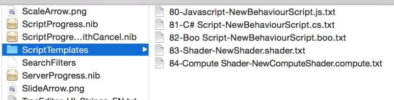
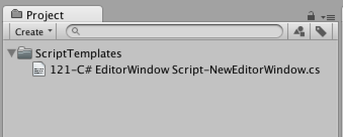
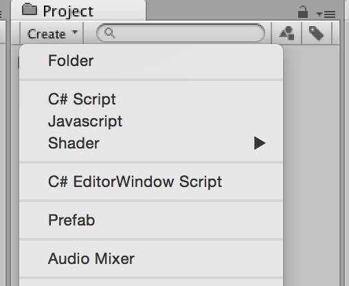
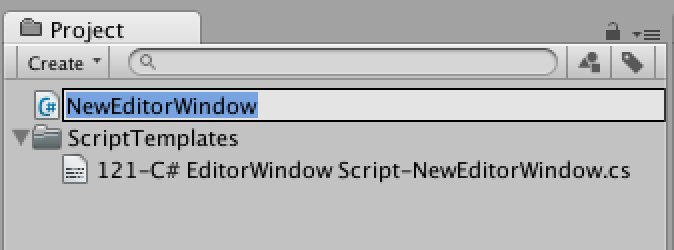
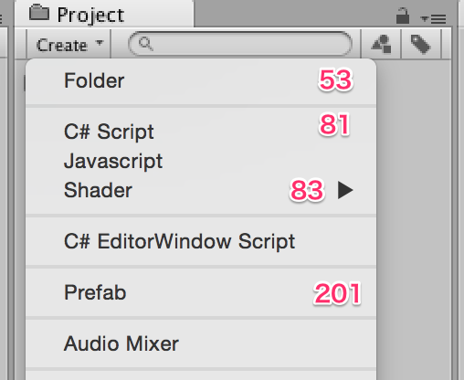

[에디터 확장 입문] 번역 15장 ScriptTemplates

번역/유니티/유니티에디터확장입문

><주의>
원문의 작성 시기는 2016년경으로, 코드나 일부 설명이 최신 유니티 버젼과 다소 맞지 않을 수 있습니다.
원문 작성자 분 역시 2019년경에 내용에 다소 오류가 있다는 이유로 웹 공개 버젼을 비공개 처리하였습니다.
(2022.10.08 역자)

원문 링크 (2022.10.08 지금은 폐기)
http://anchan828.github.io/editor-manual/web/scripttemplates.html

---
목차
- [1. ScriptTemplates이란](#1-scripttemplates이란)
  - [1.1. [템플릿 파일이 저장된 장소]](#11-템플릿-파일이-저장된-장소)
  - [1.2. [템플릿 파일의 내용]](#12-템플릿-파일의-내용)
- [2. 템플릿 파일의 작성](#2-템플릿-파일의-작성)
- [3. 템플릿 파일의 배치](#3-템플릿-파일의-배치)
- [4. 메뉴 표시 위치](#4-메뉴-표시-위치)
- [5. ProjectWindowUtil와의 조합](#5-projectwindowutil와의-조합)

EditorWindow를 생성하는 스크립트를 작성할 때 여러분은 어떻게 합니까? 

이번 장에서는 길지만 "EditorWindow를 작성하고 GUI 렌더링 부분을 구현할 준비가 갖추어질 때까지 "를 차례대로 설명합니다.

- NewBehaviourScript.cs을 작성

```csharp
using UnityEngine;
using System.Collections;

public class NewBehaviourScript : MonoBehaviour {

    //Use this for initialization
    void Start () {

    }

    //Update is called once per frame
    void Update () {

    }
}
```

- Start와 Update 함수, System.Collections를 지우고

```csharp
using UnityEngine;

public class NewBehaviourScript : MonoBehaviour {
}
```

- using UnityEditor를 붙이고

```csharp
using UnityEngine;
using UnityEditor;

public class NewBehaviourScript : MonoBehaviour {
}
```

- EditorWindow를 상속하고

```csharp
using UnityEngine;
using UnityEditor;

public class NewBehaviourScript : EditorWindow {
}
```

- EditorWindow를 열기 위해 MenuItem을 추가하고

```csharp
using UnityEngine;
using UnityEditor;

public class NewBehaviourScript : EditorWindow
{
    [MenuItem("Window/NewBehaviourScript")]
    static void Open ()
    {

    }
}
```

- GetWindow와 OnGUI를 추가한다

```csharp
using UnityEngine;
using UnityEditor;

public class NewBehaviourScript : EditorWindow
{
    [MenuItem("Window/NewBehaviourScript")]
    static void Open ()
    {
        GetWindow<NewBehaviourScript> ();
    }

    void OnGUI ()
    {

    }
}
```
여기까지 하고 드디어 EditorWindow의 GUI부분을 작성할 준비가 갖추어졌습니다. 실제로는 순서가 적게 느껴지지만, MenuItem를 추가할때 꽤 번거롭습니다. 

- 꼭 EditorWindow를 상속하고 싶다
- 꼭 MenuItem을 추가하고 싶다
- 꼭 OnGUI을 추가하고 싶다

라고 하는 경우 ScriptTemplates을 작성하는 것으로 해결할 수 있습니다.


# 1. ScriptTemplates이란

스크립트 파일을 작성할 때는 템플릿 파일이라고 불리는 것에 스크립트 파일을 작성합니다. 여러분이 자주 쓰는, 메뉴의 Assets/Create/C#Script도 템플릿 파일을 사용하여 NewBehaviourScript.cs가 작성되는 것입니다.


## 1.1. [템플릿 파일이 저장된 장소]

템플릿 파일은 다음 장소에 저장되어 있습니다. 

표 : 빌트 인의 ScriptTemplates
```
Mac : /Applications/Unity/Unity.app/Contents/Resources/ScriptTemplates

Windows : C:\Program Files\Unity\Editor\Data\Resources\ScriptTemplates
```



  
## 1.2. [템플릿 파일의 내용]

81-C#Script-NewBehaviourScript.cs.txt의 내용을 봅시다.

```csharp
using UnityEngine;
using System.Collections;

public class #SCRIPTNAME# : MonoBehaviour {

    //Use this for initialization
    void Start () {

    }

    //Update is called once per frame
    void Update () {

    }
}
```

#SCRIPTNAME#라는 것이 있습니다. 이는 Unity상에서 스크립트 이름을 결정했을 때 치환하기 위한 파라미터로 설정되어 있습니다. 그외에도 전용의 파라미터가 존재합니다. 모든 파라미터를 표로 정리합니다. 


표 : ScriptTemplates에서 사용할 수 있는 파라미터

```
#NAME# : 스크립트 파일 이름(확장자 없음)

#SCRIPTNAME# : 스크립트 이름. 띄어쓰기는 삭제됩니다(확장자 없음) 예:New Script->NewScript

#SCRIPTNAME_LOWER# : 스크립트 이름. 띄어쓰기는 삭제됩니다(확장자 없음). 만약 입력한 첫 글자가 소문자인 경우 선두에 "my"를 붙입니다. 예:new Script->myNewScript
```


# 2. 템플릿 파일의 작성 

템플릿 파일 이름에는 규칙이 있습니다. 이 규칙은 반드시 지키도록 합시다. 

{priority}-{메뉴명}-{파일 이름}.{확장자}.txt 

표 :파라미터의 설명

```
priority : 메뉴의 표시 순서. 값이 높을수록 메뉴 아래쪽에 표시됩니다.

메뉴명 : Unity로 표시하는 메뉴 이름

파일명 : 새로 작성 시 기본적으로 설정되어 있는 파일 이름 

확장자 : 하고 싶은 파일의 확장자
```

예시로 EditorWindow를 작성하는 스크립트 템플릿은 다음의 코드입니다. 

작성할 파일: 
121-C#EditorWindow Script-NewEditorWindow.cs.txt

```csharp
using UnityEngine;
using UnityEditor;

public class #SCRIPTNAME# : EditorWindow
{
    [MenuItem("Window/#SCRIPTNAME#")]
    static void Open()
    {
        GetWindow<#SCRIPTNAME#> ();
    }

    void OnGUI ()
    {

    }
}
```

# 3. 템플릿 파일의 배치 

템플릿 파일을 배치할 수 있는 곳은 2군데 있습니다. 
하나는 Unity가 설치되어 있는 장소


표 : 빌트 인의 ScriptTemplates

```
Mac : /Applications/Unity/Unity.app/Contents/Resources/ScriptTemplates

Windows : C:\Program Files\Unity\Editor\Data\Resources\ScriptTemplates

```

다른 하나는 Unity 프로젝트의 Assets/ScriptTemplates입니다. 
이번에는 Assets/ScriptTemplates에 배치해 봅시다.




배치한 후는 반드시 Unity 에디터를 재기동합니다. 이 ScriptTemplates를 읽는 것은 Unity 에디터를 기동했을때 뿐이기 때문입니다. 

재기동한 뒤 Assets/Create 메뉴에 자작한 템플릿 파일 메뉴가 추가되는 것을 알 수 있습니다.



실제로 템플릿을 사용하여 스크립트를 만들어 봅시다.



기본 이름 "NewEditorWindow"로 작성하면 스크립트의 내용은 아래와 같이 됩니다.

```csharp
using UnityEngine;
using UnityEditor;

public class NewEditorWindow : EditorWindow
{
    [MenuItem("Window/NewEditorWindow")]
    static void Open()
    {
        GetWindow<NewEditorWindow> ();
    }

    void OnGUI ()
    {

    }
}
```

# 4. 메뉴 표시 위치 

메뉴의 위치는 priority에 의해 결정됩니다. priority에 대한 자세한 사항은 8장 "MenuItem"을 봐주세요.
  


표 : Assets/Create의 각 priority

```
Folder : 53
C# Script : 81
Javascript : 82
Shader : 83
```

priority 가 86인 C# Script가 2개 있습니다만, priority가 낮은 물건들이 템플릿으로 우선됩니다. 

자작 템플릿으로 표시할 때에는 기본 템플릿의 근처에 있는 것이 좋기 때문에, priority는 64-70, 또는 95-190이 적당합니다. 


# 5. ProjectWindowUtil와의 조합 

ProjectWindowUtil클래스 StartNameEditingIfProjectWindowExists와 조합하면Assets/ScriptTemplates에 템플릿 파일을 두지 않고 스크립트를 작성할 수 있게 됩니다.자세한 것은 11장 "ProjectWindowUtil"을 보세요.