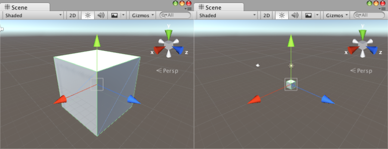

[에디터 확장 입문] 번역 17장 Handle(핸들)

번역/유니티/유니티에디터확장입문


><주의>
원문의 작성 시기는 2016년경으로, 코드나 일부 설명이 최신 유니티 버젼과 다소 맞지 않을 수 있습니다.
원문 작성자 분 역시 2019년경에 내용에 다소 오류가 있다는 이유로 웹 공개 버젼을 비공개 처리하였습니다.
(2022.10.08 역자)

원문 링크 (2022.10.08 지금은 폐기)

http://anchan828.github.io/editor-manual/web/handles.html

---
목차
- [1. 게임 오브젝트에 핸들을 추가](#1-게임-오브젝트에-핸들을-추가)
  - [1.1. [위치와 회전에 대한 핸들을 동시에 표시하기]](#11-위치와-회전에-대한-핸들을-동시에-표시하기)
- [2. PositionHandle을 직접 만들기](#2-positionhandle을-직접-만들기)
  - [2.1. [화살표의 핸들]](#21-화살표의-핸들)
  - [2.2. [핸들에 색을 칠하기]](#22-핸들에-색을-칠하기)
  - [2.3. [핸들로 위치를 이동]](#23-핸들로-위치를-이동)
  - [2.4. [핸들의 크기를 고정하기]](#24-핸들의-크기를-고정하기)
- [3. 특수한 핸들](#3-특수한-핸들)
  - [3.1. FreeMoveHandle](#31-freemovehandle)
  - [3.2. FreeRotateHandle](#32-freerotatehandle)
  - [3.3. DrawAAPolyLine](#33-drawaapolyline)
  - [3.4. PositionHandle](#34-positionhandle)
  - [3.5. ReorderableList](#35-reorderablelist)
- [4. GUI의 표시(2D)](#4-gui의-표시2d)
  - [4.1. [3D공간과 2D공간]](#41-3d공간과-2d공간)
  - [4.2. [Handles.BeginGUI을 GUI.Scope로 표현하기]](#42-handlesbegingui을-guiscope로-표현하기)
  - [4.3. [윈도우 표시]](#43-윈도우-표시)


16장 "Gizmo(기즈모)"에서 오브젝트의 위치나 범위, 특정 요소를 가시화하기 위한 구조를 소개했습니다. 본 장에서는 더 복잡한 가시화, 그에 더해서 "조작"을 실시하는 Handles에 대해서 소개하겠습니다. 

핸들은 오브젝트에 액션을 일으키기 위한 구조입니다. 예를 들면 아래 그림의 표시는 모두 핸들입니다.


# 1. 게임 오브젝트에 핸들을 추가 

게임 오브젝트에 자작 핸들을 추가합니다. 핸들의 구현은 보통 CustomEditor의 OnSceneGUI 함수에서 실시합니다.

```csharp
using UnityEngine;

public class Example : MonoBehaviour {

}
```

우선 MonoBehaviour 상속 클래스를 작성하여 그 클래스에 대한 커스텀 에디터를 작성합니다. 표준으로 구현되어 있는 핸들이 표시되지 않도록 Tools.current=Tool.None;로 둡니다. 이것으로 게임 오브젝트의 위치를 변경하기 위한 핸들이 작성되었습니다.

```csharp
using UnityEngine;
using UnityEditor;

[CustomEditor (typeof(Example))]
public class ExampleInspector : Editor
{
    void OnSceneGUI ()
    {
        Tools.current = Tool.None;
        var component = target as Example;


        var transform = component.transform;
        transform.position =
            Handles.PositionHandle (transform.position, transform.rotation);
    }
}
```

## 1.1. [위치와 회전에 대한 핸들을 동시에 표시하기]

핸들을 동시에 다수 표시할 수도 있습니다.


```csharp
void OnSceneGUI ()
{
    var component = target as Example;

    var transform = component.transform;

    if (Tools.current == Tool.Move) {
        transform.rotation =
            Handles.RotationHandle (transform.rotation, transform.position);
    } else if (Tools.current == Tool.Rotate) {
        transform.position =
            Handles.PositionHandle (transform.position, transform.rotation);
    }
}
```

# 2. PositionHandle을 직접 만들기

핸들은 여러 부품을 조합되어 있습니다. 기본적인 것도 8종류의 파트가 준비되어 있습니다.


이들 파츠를 사용하여 PositionHandle과 같은 것을 만들어 보겠습니다. 


## 2.1. [화살표의 핸들]

화살표의 핸들은 Handles.Slider를 사용합니다. 위치를 "슬라이드" 하는 것에 적합하므로 사용되고 있습니다.

```csharp
void OnSceneGUI ()
{
    Tools.current = Tool.None;
    var component = target as Example;
    PositionHandle (component.transform);
}

void PositionHandle (Transform transform)
{
    Handles.Slider (transform.position, transform.right); //X 축
    Handles.Slider (transform.position, transform.up); //Y 축
    Handles.Slider (transform.position, transform.forward); //Z 축
}
```


## 2.2. [핸들에 색을 칠하기]

색을 칠하기 위해서는, 핸들을 렌더링하기 "전"에 Handles.color에 값을 대입합니다. 각 축의 색은 이미 준비되어 있는 것을 사용합니다.

```csharp
void PositionHandle (Transform transform)
{
    Handles.color = Handles.xAxisColor;
    Handles.Slider (transform.position, transform.right); //X 축

    Handles.color = Handles.yAxisColor;
    Handles.Slider (transform.position, transform.up); //Y 축

    Handles.color = Handles.zAxisColor;
    Handles.Slider (transform.position, transform.forward); //Z 축
}
```


## 2.3. [핸들로 위치를 이동]

Slider로 이동시킨 결과를 오브젝트에 반영합니다.

```csharp
void OnSceneGUI ()
{
    Tools.current = Tool.None;
    var component = target as Example;
    var transform = component.transform;

    transform.position = PositionHandle (transform);
}

Vector3 PositionHandle (Transform transform)
{
    var position = transform.position;

    Handles.color = Handles.xAxisColor;
    position = Handles.Slider (position, transform.right); //X축

    Handles.color = Handles.yAxisColor;
    position = Handles.Slider (position, transform.up); //Y축

    Handles.color = Handles.zAxisColor;
    position = Handles.Slider (position, transform.forward); //Z축

    return position;
}
```

## 2.4. [핸들의 크기를 고정하기]

이미 구현된 PositionHandle은 씬 뷰를 줌 인, 줌 아웃해도 핸들의 크기는 바뀌지 않습니다. 이는 내부에서 "씬 뷰 카메라"와 "핸들"의 위치를 사용하여 핸들의 사이즈가 계산되고 있습니다.이로써 아무리 줌 인, 줌 아웃을 하더라도 적절한 크기로 확대 축소되어, 외관의 길이가 같게 됩니다.




항상 핸들의 크기를 고정하고 싶을 때는 Handles.Slider로 크기를 지정해야 합니다. 

다음 코드는 인자로 snap 값도 필요하므로 snap 설정 코드도 추가되어 있습니다.

```csharp
Vector3 snap;

void OnEnable ()
{
    //SnapSettings 의  수치를 얻어오기
    var snapX = EditorPrefs.GetFloat ("MoveSnapX", 1f);
    var snapY = EditorPrefs.GetFloat ("MoveSnapY", 1f);
    var snapZ = EditorPrefs.GetFloat ("MoveSnapZ", 1f);
    snap = new Vector3 (snapX, snapY, snapZ);
}

Vector3 PositionHandle (Transform transform)
{
    var position = transform.position;

    var size = 1;

    //X축
    Handles.color = Handles.xAxisColor;
    position =
        Handles.Slider (position, transform.right, size, Handles.ArrowCap, snap.x);

    //Y축
    Handles.color = Handles.yAxisColor;
    position =
        Handles.Slider (position, transform.up, size, Handles.ArrowCap, snap.y);

    //Z축
    Handles.color = Handles.zAxisColor;
    position =
        Handles.Slider (position, transform.forward, size, Handles.ArrowCap, snap.z);

    return position;
}
```


반대로 핸들의 겉보기 크기를 같게 하려면 HandleUtility.GetHandleSize을 사용하여 크기를 구합니다.

```csharp
var size = HandleUtility.GetHandleSize (position);
```

# 3. 특수한 핸들 

Handles 클래스에는 특수한 핸들을 작성할 수 있는 API가 몇가지 존재합니다. 

## 3.1. FreeMoveHandle

3축을 의식하지 않고 자유롭게 움직일 수 있는 핸들을 작성합니다. 표시하는 파츠는 RectangleCap이 적당합니다.

```csharp
transform.position =
    Handles.FreeMoveHandle (
        transform.position,
        transform.rotation,
        size,
        snap, Handles.RectangleCap);
```


네모 안에서 드래그 하면 움직일 수 있습니다

이는 씬 뷰의 방향을 2D모드와 같은 2축으로 표시했을 때에 편리합니다. 이렇게 하면 3D객체라도 X와 Y축의 위치를 한꺼번에 조정이 가능합니다.


## 3.2. FreeRotateHandle

3축을 의식하지 않고 자유롭게 회전할 수 있는 핸들을 작성합니다.

표시하는 파츠는 원으로 고정입니다.

```csharp
transform.rotation =
    Handles.FreeRotateHandle (
        transform.rotation,
        transform.position,
        size);
```


## 3.3. DrawAAPolyLine

각 정점(Vector3배열)을 선으로 연결, 표시합니다.
MonoBehaviour 상속 클래스에 Vector3 배열을 놓고,

```csharp
public class Example2 : MonoBehaviour {

    public Vector3[] vertexes;
}
```
CustomEditor 쪽에서 사용합니다.

```csharp
void OnSceneGUI ()
{
    Handles.DrawAAPolyLine (component.vertexes);
}
```


복잡한 선이 빠지게 된 것은 좋지만 값의 설정이 아래 그림처럼 다루기 어렵기 때문에 2개를 구현합니다.


값을 직접 입력해야 하고, 선을 긋는 순서를 변경할때 귀찮습니다.


## 3.4. PositionHandle

우선 Vector3의 값을 씬 뷰에서 편집할 수 있도록 핸들을 추가합니다.

```csharp
void OnSceneGUI ()
{
    var vertexes = component.vertexes;

    for (int i = 0; i < vertexes.Length; i++) {

        vertexes [i] = Handles.PositionHandle (vertexes [i], Quaternion.identity);
    }

    Handles.DrawAAPolyLine (vertexes);
}
```

핸들이 크다고 느낄 경우, 본 장에서 직접 만든 PositionHandle을 사용하여 봅니다.


각 점에 PositionHandle이 표시됩니다.


## 3.5. ReorderableList

인스펙터의 표시를 ReorderableList에서 실시합니다. ReorderableList를 사용함으로써 요소의 추가 및 정렬이 아주 편하게 됩니다. 자세한 것은 14장"ReorderbleList"을 보세요.


```csharp
using UnityEngine;
using UnityEditor;
using UnityEditorInternal;

[CustomEditor (typeof(Example2))]
public class ExampleInspector2 : Editor
{
    ReorderableList reorderableList;
    Example2 component;

    void OnEnable ()
    {
        Tools.current = Tool.None;
        component = target as Example2;
        reorderableList = new ReorderableList (component.vertexes, typeof(Vector3));

        reorderableList.drawElementCallback = (rect, index, isActive, isFocused) => {
            component.vertexes [index] =
                EditorGUI.Vector3Field (rect, GUIContent.none,
                                          component.vertexes [index]);
        };

        reorderableList.onAddCallback = (list) => {
            ArrayUtility.Add (ref component.vertexes, Vector3.zero);
            ActiveEditorTracker.sharedTracker.ForceRebuild ();
        };
        reorderableList.onRemoveCallback = (list) => {
            ArrayUtility.Remove (ref component.vertexes,
                                    component.vertexes [list.index]);
            ActiveEditorTracker.sharedTracker.ForceRebuild ();
        };
        reorderableList.onChangedCallback = (list) => SceneView.RepaintAll ();
    }

    public override void OnInspectorGUI ()
    {
        reorderableList.DoLayoutList ();
    }
}
```

# 4. GUI의 표시(2D)


내비게이션 창이 뜨고 있을 때에 우측 하단에 GUI가 표시되고 있습니다.
핸들은 3D공간에 특화된 가시화지만 2D공간에 대한 그리기도 할 수 있습니다. 


## 4.1. [3D공간과 2D공간]

이 2가지가 렌더링되는 구조는 따로 분리되어 있어 조금 주의해야 할 부분이 있습니다. 2D용 GUI을 렌더링하려면 Handles.BeginGUI와 Handles.EndGUI을 호출해야 합니다.

```csharp
void OnSceneGUI ()
{
    Handles.BeginGUI ();

    GUILayout.Button ("Button", GUILayout.Width (50));

    Handles.EndGUI ();
}
```


왼쪽 위에 단추가 표시됩니다.

## 4.2. [Handles.BeginGUI을 GUI.Scope로 표현하기]

GUI.Scope의 기능을 사용하여 Handles.BeginGUI와 EndGUI를 생략하는 것으로, 어느 정도 코드 가독성이 오를 수 있습니다. 우선 HandleGUIScope을 작성합니다.

```csharp
public class HandleGUIScope : GUI.Scope
{
    public HandleGUIScope ()
    {
        Handles.BeginGUI ();
    }

    protected override void CloseScope ()
    {
        Handles.EndGUI ();
    }
}
```

그 다음엔 아래와 같이 사용하면 됩니다.

```csharp
void OnSceneGUI ()
{
    using (new HandleGUIScope ()) {
        GUILayout.Button ("Button", GUILayout.Width (50));
    }
}
```

## 4.3. [윈도우 표시]

GUI클래스의 사용법은 인스펙터나 다른 윈도우에서의 사용법과 다르지 않습니다. 시험 삼아 윈도우를 표시해 보겠습니다.


좌측 상단에 GUI 윈도우가 표시됩니다.

```csharp
int windowID = 1234;
Rect windowRect;

void OnSceneGUI ()
{
    Handles.BeginGUI ();

    windowRect = GUILayout.Window (windowID, windowRect, (id) => {

        EditorGUILayout.LabelField ("Label");

        EditorGUILayout.ToggleLeft ("Toggle", false);

        GUILayout.Button ("Button");

        GUI.DragWindow();

    }, "Window", GUILayout.Width (100));

    Handles.EndGUI ();
}
```