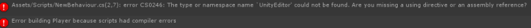

[에디터 확장 입문] 번역 1장 에디터 확장에 사용하는 폴더

번역/유니티/유니티에디터확장입문


><주의>
원문의 작성 시기는 2016년경으로, 코드나 일부 설명이 최신 유니티 버젼과 다소 맞지 않을 수 있습니다.
원문 작성자 분 역시 2019년경에 내용에 다소 오류가 있다는 이유로 웹 공개 버젼을 비공개 처리하였습니다.
(2022.10.08 역자)

원문 링크 (2022.10.08 지금은 폐기)

http://anchan828.github.io/editor-manual/web/part2-beginner.html

---

목차
- [1. Editor 폴더](#1-editor-폴더)
  - [1.1. Editor 폴더에 포함 안시키고 동작시키는 방법](#11-editor-폴더에-포함-안시키고-동작시키는-방법)
- [2. Editor Default Resources 폴더](#2-editor-default-resources-폴더)


# 1. Editor 폴더


Editor폴더는 에디터 API를 사용하기 위한 특별한 폴더입니다.
보통 에디터 API는, 런타임으로 동작하지 않습니다.

아래 코드를 Assets 폴더 바로 아래에 작성해서 빌드해보면 빌드 실패가 뜹니다. 

```csharp
using UnityEngine;
using UnityEditor;

public class NewBehaviourScript : MonoBehaviour
{
}
```


개발 중의 유니티 에디터 상에서 생성되는 Assembly-CSharp.dll에서는 UnityEditor.dll에의 참조가 발생하므로 스크립트의 컴파일 에러는 발생하지 않습니다.

빌드 시에 생성되는 Assembly-CSharp.dll에서는  UnityEditor.dll에의 참조가 발생하지 않기 때문에 빌드 에러가 발생하는것입니다. 중요한 부분으로, 이걸 몰라서 빌드 에러 원인 못찾는 경우도 있습니다.

UnityEditor에서는 Assembly-CSharp-Editor.dll을 생성해서, 에디터 API와 런타임 API를 구분하는 것으로 문제를 해결합니다. Assembly-CSharp-Editor.dll는 빌드 시에는 포함되지 않으므로 빌드 에러도 발생 안합니다. 

그리고 Assembly-CSharp-Editor.dll은 Editor 폴더 안의 스크립트 파일이 컴파일 되어 생성되는것입니다.

Editor 폴더의 생성장소는 별 제한 없습니다. 여러개의 Editor 폴더를 생성할수도 있습니다.

단, Standard Assets, Pro Standard Assets, Plugins 폴더 안에 생성하면 그 안의 스크립트는 Assembly-CSharp-Editor-firstpass.dll에 컴파일됩니다.

Assembly-CSharp-Editor.dll에서 firstpass를 참조할수는 있지만 firstpass에서 Assembly-CSharp-Editor.dll를 참조할수는 없으므로 주의해주세요.

## 1.1. Editor 폴더에 포함 안시키고 동작시키는 방법

런타임에서 동작하는 스크립트에 에디터 API 꺼를 사용하는 겨우가 있습니다. 이 경우에는 아래와 같이 처리합니다.

```csharp
using UnityEngine;

#if UNITY_EDITOR
using UnityEditor;
#endif

public class NewBehaviourScript : MonoBehaviour
{
    void OnEnable ()
    {
        #if UNITY_EDITOR
        EditorWindow.GetWindow<ExampleWindow> ();
        #endif
    }
}
```

# 2. Editor Default Resources 폴더

Resources 폴더랑 마찬가지로 에디터 확장에서만 사용할 리소스를 넣어둘 수 있는 폴더입니다.

Editor Default Resources 폴더 안에 있는 에셋은 EditorGUIUtility.Load로 접근 가능합니다.

```csharp
var tex = EditorGUIUtility.Load ("logo.png") as Texture;
```
