[에디터 확장 입문] 번역 8장 MenuItem

번역/유니티/유니티에디터확장입문

><주의>
원문의 작성 시기는 2016년경으로, 코드나 일부 설명이 최신 유니티 버젼과 다소 맞지 않을 수 있습니다.
원문 작성자 분 역시 2019년경에 내용에 다소 오류가 있다는 이유로 웹 공개 버젼을 비공개 처리하였습니다.
(2022.10.08 역자)

원문 링크 (2022.10.08 지금은 폐기)

http://anchan828.github.io/editor-manual/web/part1-menuitem.html

---
목차
- [1. MenuItem이란](#1-menuitem이란)
- [2. MenuItem의 사용 예시](#2-menuitem의-사용-예시)
- [3. MenuItem을 사용해서 메뉴를 표시하기](#3-menuitem을-사용해서-메뉴를-표시하기)
- [4. 실행할 수 없는 MenuItem을 작성하기](#4-실행할-수-없는-menuitem을-작성하기)
- [5. MenuItem의 표시 순서를 변경하기](#5-menuitem의-표시-순서를-변경하기)
  - [5.1. [priority의 형태]](#51-priority의-형태)
- [6. MenuItem에 체크 표시 넣기](#6-menuitem에-체크-표시-넣기)
- [7. Hot키(단축키)를 구현](#7-hot키단축키를-구현)
- [8. CONTEXT](#8-context)
  - [8.1. MenuCommand](#81-menucommand)

모르면 에디터 확장에서는 아무것도 할 수 없을 정도로 중요한 MenuItem에 대해 설명합니다. 이번 장에서는 MenuItem에서 할 수 있는 것을 소개하고 있습니다. "실제로 어떻게 쓰는가"에 대해서는 이 장에서도 간략하게 설명하겠지만 이 장을 넘어가서도 싫증이 날 정도로 다루게 되므로 자연스럽게 이해하시게 되겠지요.

# 1. MenuItem이란

MenuItem이란 "유니티 에디터의 위쪽에 있는 메뉴 바나, 컨텍스트 메뉴에 항목을 추가하기 위한 기능"입니다.

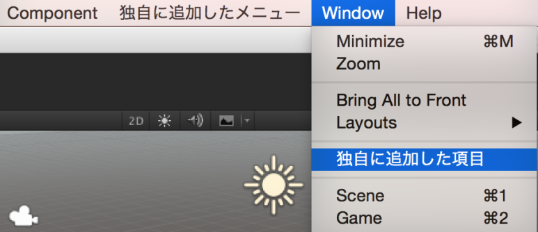

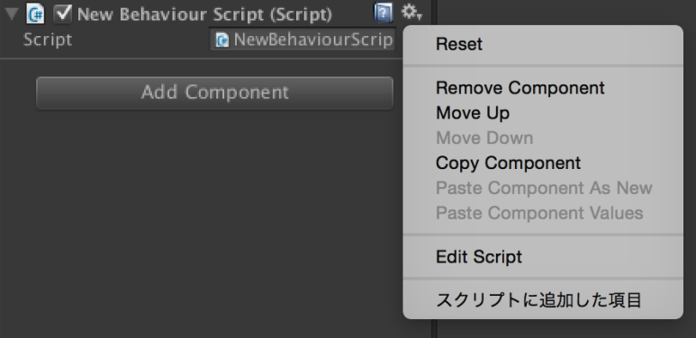


# 2. MenuItem의 사용 예시

메뉴는 일종의 트리거로 되어 있습니다. 유니티 표준에서는

- 게임 오브젝트의 생성(GameObject/Create Empty)
- 씬의 생성(File/New Scene)
- 윈도우의 표시(Window/Inspector)

등이 메뉴로서 이미 등록되어 있습니다.

유저가 MenuItem을 사용해서 독자적인 메뉴를 추가하려고 한다면 임의의 타이밍에 Editor 스크립트를 실행하고 싶을 때입니다. 목적 별로 나열해보면

- 독자적인 윈도우를 표시
- AssetBundle 의 작성
- Asset의 작성
- 선택한 Asset에 대해서 어떤 액션을 실행

등이 있습니다. 이들을 실행하기 위한 입구(트리거)가 되는게 MenuItem입니다.


# 3. MenuItem을 사용해서 메뉴를 표시하기

먼저 간단하게 메뉴를 추가해봅시다. MenuItem은 Attribute로서 제공되어 있고, static 함수에 첨가되어 있는 기능입니다.

```csharp
using UnityEditor;

public class NewBehaviourScript
{
    [MenuItem("CustomMenu/Example")]
    static void Example ()
    {
    }
}
```


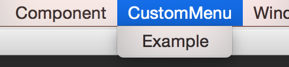

물론 기존 메뉴에 자식 메뉴를 추가하는것도 할 수 있습니다.

```csharp
using UnityEditor;

public class NewBehaviourScript
{
    [MenuItem("Assets/Example")]
    static void Example ()
    {
    }
}
```

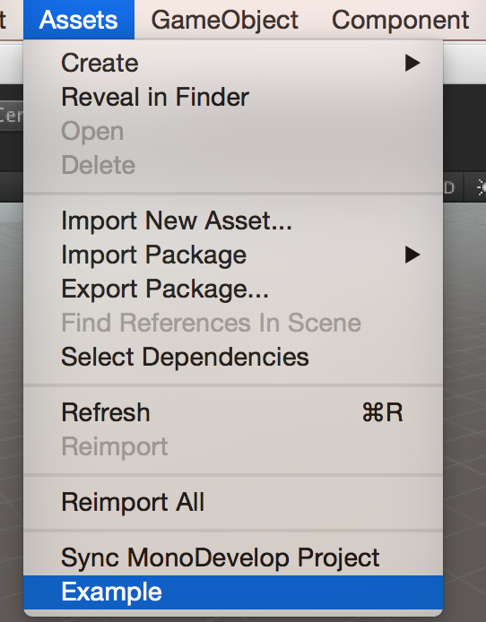

자식 메뉴의 자식 메뉴를 작성하는것도 가능합니다.

```csharp
using UnityEditor;

public class NewBehaviourScript
{
    [MenuItem("CustomMenu/Example/Child1/Grandchild")]
    static void Example1 ()
    {
    }

    [MenuItem("CustomMenu/Example/Child2/Grandchild")]
    static void Example2 ()
    {
    }
}
```

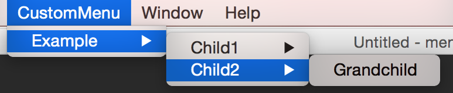


# 4. 실행할 수 없는 MenuItem을 작성하기

MenuItem에서 추가한 메뉴가 실행되어 버리면 보기가 안좋은 경우도 있습니다. 그럴때 MenuItem에 추가한 메뉴를 실행할 수 없게 막는 기능이 있습니다.

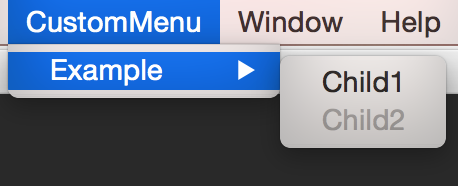

MenuItme의 두번째 인자에 isValidateFunction이 있는데, 이것은 메뉴를 표시할 때에 실행가능한지 어떤지를 체크하기 위해 있는 것입니다. isValidateFunction에 true를 설정하는 것으로 함수는 Validate 함수가 됩니다. 거기에 더해 Validate 함수는 반환값이 bool 형의 함수가 되어, 반환값으로서 true를 반환하면 실행 가능, false를 반환하면 실행불가가 됩니다.

또한, Validate 함수는 단독으로는 동작할 수 없습니다. isValidateFunction이 false인 함수를 준비할 필요가 있습니다. isValidateFunction의 기본값이 false이므로 인자를 생략해도 문제는 없습니다.

```csharp
using UnityEditor;

public class NewBehaviourScript
{
    [MenuItem("CustomMenu/Example/Child1")]
    static void Example1 ()
    {
    }

    //isValidateFunction이 false
    [MenuItem("CustomMenu/Example/Child2")]
    static void Example2 ()
    {
    }

    //isValidateFunction이 true
    [MenuItem("CustomMenu/Example/Child2", true)]
    static bool ValidateExample2 ()
    {
        //이번에는 false 고정으로 해서 실행할 수 없게 합니다
        return false;
    }
}
```

# 5. MenuItem의 표시 순서를 변경하기

메뉴의 표시 순을 지정할 수 있습니다. MenuItem의 세번째 인자 priority에서 지정합니다.

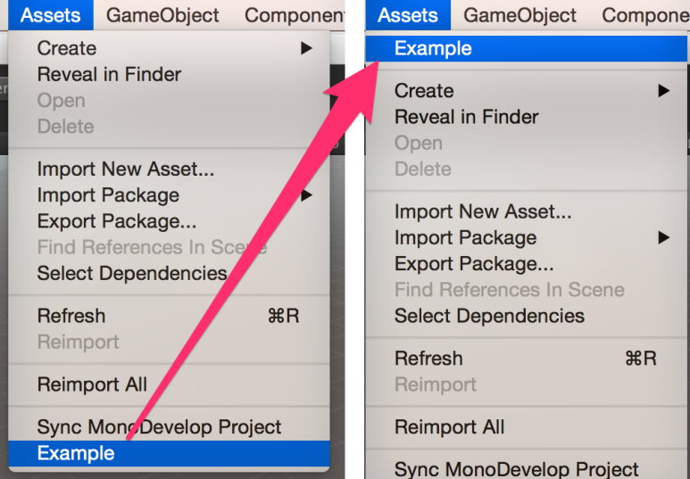

```csharp
using UnityEditor;

public class NewBehaviourScript
{
    [MenuItem("Assets/Example", false, 1)]
    static void Example ()
    {
    }
}
```

## 5.1. [priority의 형태]

priority의 수치를 작게 설정할수록 위쪽에 표시되게 됩니다.

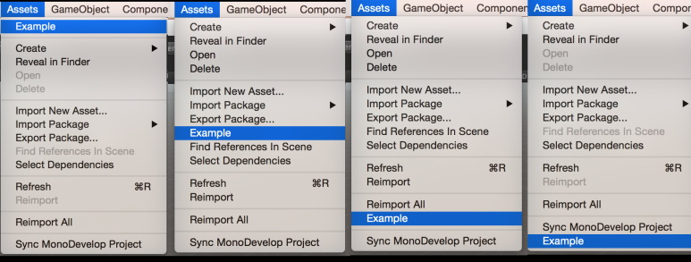


priority가 왼쪽부터 1, 20, 40, 1000으로 설정될때의 사진입니다.


또한 priority의 수치가 앞쪽과 비교해 11 이상 건너뛴 수치라면 메뉴 항목의 사이에 구분선이 생깁니다.

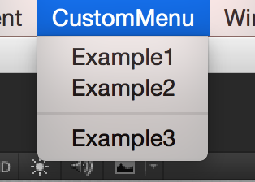

```csharp
using UnityEditor;

public class NewBehaviourScript
{
    [MenuItem("CustomMenu/Example1", false, 1)]
    static void Example1 ()
    {
    }

    [MenuItem("CustomMenu/Example2", false, 2)]
    static void Example2 ()
    {
    }

    [MenuItem("CustomMenu/Example3", false, 13)]
    static void Example3 ()
    {
    }
}
```

# 6. MenuItem에 체크 표시 넣기

Menu.GetChecked와 Menu.SetChecked를 사용하여 자식 메뉴에 체크를 넣을 수 있습니다.

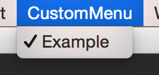

```csharp
using UnityEditor;

public class NewBehaviourScript
{
    [MenuItem("CustomMenu/Example")]
    static void Example ()
    {
        var menuPath = "CustomMenu/Example";
        var @checked = Menu.GetChecked (menuPath);
        Menu.SetChecked (menuPath, !@checked);
    }
}
```

# 7. Hot키(단축키)를 구현

MenuItem에 추가한 메뉴는 단축키로 실행시킬 수 있습니다. 첫번째 인자인 메뉴 패스의 마지막에 [반각 스페이스 + 수식자 키 + 임의의 문자]로 되어있는 문자열을 붙이면 구현할 수 있습니다.

```csharp
using UnityEditor;
using UnityEngine;

public class NewBehaviourScript
{
    //command(ctrl) + shift + g 로 실행
    [MenuItem("CustomMenu/Example %#g")]
    static void Example ()
    {
        Debug.Log ("실행되었습니다");
    }
}
```

표 8.1 수식자 키를 나타내는 특수문자
```
% : Ctrl(Windows) 혹은 command(MacOSX)
# : Shift
& : Alt(Windows) 혹은 option(Mac OS X)
_ : 수식자 키 없음
F1 ... F12 : Function키
HOME : Home 키
END : End 키
PGUP : PageUp 키
PGDN : PageDown 키
KP0 ... KP9 : 0부터 9까지의 숫자키
KP. : .
KP+ : +
KP- : -
KP* : *
KP/ : /
KP= : =
```

Function 키만으로 되어 있는 단축키는 만들 수 없습니다.


# 8. CONTEXT

각 컴포넌트의 톱니바퀴 아이콘을 누르면 표시되는 컨텍스트 메뉴에 메뉴 항목을 추가할 수 있습니다.

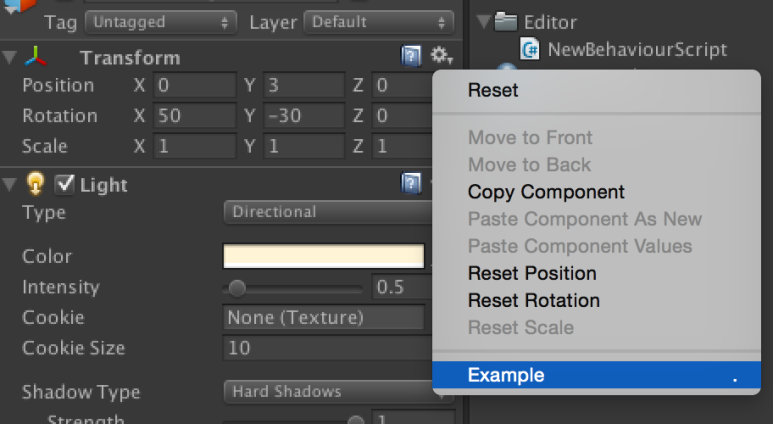


표시하기 위한 규칙이 있는데, 메뉴 패스의 앞쪽에 "CONTEXT/"를 추가합니다. 그리고 [CONTEXT/컴포넌트 이름/메뉴 이름]이라고 치면 컨텍스트 메뉴에 표시됩니다.

```csharp
using UnityEditor;

public class NewBehaviourScript
{
    //Transform 에 메뉴를 추가
    [MenuItem("CONTEXT/Transform/Example1")]
    static void Example1 () { }

    //컴포넌트 (전체)에 메뉴를 추가
    [MenuItem("CONTEXT/Component/Example2")]
    static void Example2 () { }

    //ExampleScript 스크립트에 메뉴를 추가
    [MenuItem("CONTEXT/ExampleScript/Example3")]
    static void Example3 () { }
}
```

컨텍스트 메뉴에 대해서도 단축키는 적용시킬 수 있습니다. 컨텍스트 메뉴에 표시되지 않으면 실행되지 않습니다.


## 8.1. MenuCommand

컨텍스트 메뉴만이 MenuCommand를 인자로 하여 컴포넌트 정보를 받을 수 있습니다.

```csharp
using UnityEditor;
using UnityEngine;

public class NewBehaviourScript
{
    [MenuItem("CONTEXT/Transform/Example1")]
    static void Example1 (MenuCommand menuCommand)
    {
        // 실행한 Transform의 정보를 얻을 수 있음
        Debug.Log (menuCommand.context);
    }
}
```

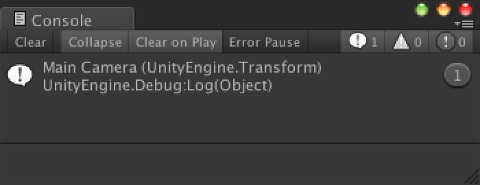

위의 코드를 MainCamera의 Transform에서 실행시킨 모습입니다.

