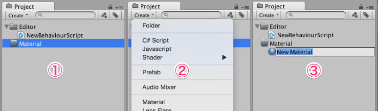
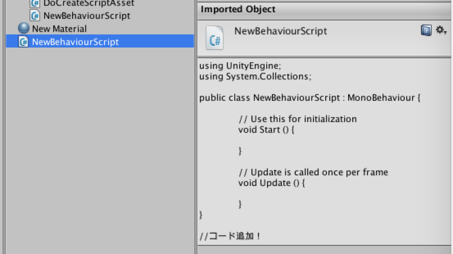
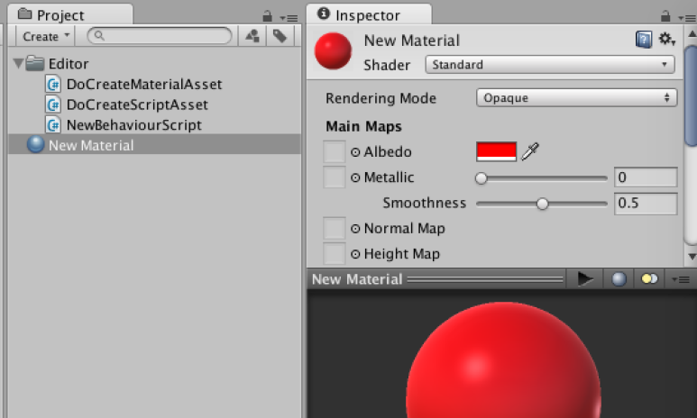

[에디터 확장 입문] 번역 11장 ProjectWindowUtil

번역/유니티/유니티에디터확장입문

><주의>
원문의 작성 시기는 2016년경으로, 코드나 일부 설명이 최신 유니티 버젼과 다소 맞지 않을 수 있습니다.
원문 작성자 분 역시 2019년경에 내용에 다소 오류가 있다는 이유로 웹 공개 버젼을 비공개 처리하였습니다.
(2022.10.08 역자)

원문 링크 (2022.10.08 지금은 폐기)
http://anchan828.github.io/editor-manual/web/projectWindowUtil.html

---
목차
- [1. Asset 생성](#1-asset-생성)
- [2. Asset 이름 결정 후에 실행되는 EndNameEditAction을 쓰기](#2-asset-이름-결정-후에-실행되는-endnameeditaction을-쓰기)
  - [2.1. [EndNameEditAction을 상속하는 클래스 작성]](#21-endnameeditaction을-상속하는-클래스-작성)
  - [2.2. StartNameEditingIfProjectWindowExists](#22-startnameeditingifprojectwindowexists)


보통 "Assets/Create/"메뉴에서 스크립트 파일이나 자료 등 다양한 에셋을 작성합니다. 작성 시, "NewBehaviourScript"가 초기이름으로 되어있는데 이를 변경하는 텍스트필드가 표시되거나 사용자에게 에셋을 작성하는데 편리한 기능을 갖추고 있습니다.



이들 기능은 ProjectWindowUtil 클래스로 제공되고 있으며, AssetDatabase.CreateAsset보다 사용자와의 대화에 뛰어난 인터랙티브한 구현을 할 수 있습니다.


# 1. Asset 생성

에셋의 생성은 ProjectWindowUtil.CreateAsset을 사용합니다. 두번째 인자인 pathName은 "Assets/New Material.mat" 같이 계층을 표현하는 경로가 아니라 "New Material.mat"의 에셋 이름만 설정하도록 하세요. 이렇게 함으로써, 현재 선택 중인 폴더 아래에 에셋을 생성하게 됩니다.

```csharp
using UnityEngine;
using UnityEditor;

public class NewBehaviourScript
{
    [MenuItem ("Assets/Create ExampleAssets")]
    static void CreateExampleAssets ()
    {
        var material = new Material (Shader.Find ("Standard"));

        ProjectWindowUtil.CreateAsset (material, "New Material.mat");
    }
}
```

# 2. Asset 이름 결정 후에 실행되는 EndNameEditAction을 쓰기

예를 들어 Unity 상에서 스크립트 파일을 작성했을 때 클래스 이름이 스크립트 파일 이름과 같게 됩니다. 에셋 이름 결정 후에 EndNameEditAction이 실행되고 그 안에서 스크립트 파일의 텍스트를 다시 쓰고 있습니다.

그럼 "Unity표준의 스크립트 파일을 작성 때와 같은 동작"을 하는 EndNameEditAction을 만들어 봅시다.


## 2.1. [EndNameEditAction을 상속하는 클래스 작성]

EndNameEditAction을 계승한 클래스를 작성합니다.그리고 Action 함수를 오버 라이드, 그 중에서 pathName과 resourceFile(템플릿 파일의 패스)를 사용하여 텍스트 에셋을 작성합니다.

```csharp
using System.IO;
using System.Text;
using UnityEditor;
using UnityEditor.ProjectWindowCallback;

public class DoCreateScriptAsset : EndNameEditAction
{
    public override void Action (int instanceId, string pathName, string resourceFile)
    {
        var text = File.ReadAllText (resourceFile);

        var className = Path.GetFileNameWithoutExtension (pathName);

        //반각 스페이스를 제외
        className = className.Replace (" ", "");

        //다른 파라메터에 대해서 알고 싶다면
        //15장「ScriptTemplates」 을 참조해주세요
        text = text.Replace ("#SCRIPTNAME#", className);

        text += "\n//코드 추가！";

        //UTF8 에 BOM 붙여서 저장
        var encoding = new UTF8Encoding (true, false);

        File.WriteAllText (pathName, text, encoding);

        AssetDatabase.ImportAsset (pathName);
        var asset = AssetDatabase.LoadAssetAtPath<MonoScript> (pathName);
        ProjectWindowUtil.ShowCreatedAsset (asset);
    }
}
```


## 2.2. StartNameEditingIfProjectWindowExists

ProjectWindowUtil.StartNameEditingIfProjectWindowExists를 사용하고 에셋을 작성합니다. 이 함수는 ProjectWindowUtil.CreateAsset의 내부에서도 사용되고 있어 올바르게 사용하면 같은 동작을 구현할 수 있습니다.

StartNameEditingIfProjectWindowExists는 2개의 생성 패턴을 지원합니다.

1번째는 Unity 에디터 상에는 없는 외부 파일을 바탕으로 에셋을 생성하는 방법입니다. 

이는 스크립트 파일의 생성과 같은 경우에 사용합니다. 5번째 인자가 외부 파일(= 리소스)의 패스를 지정하도록 하고 있습니다. 이때 인스턴스 ID는 필요 없으니 0으로 합니다. 

예시로 아래의 코드를 작성했습니다.이 코드와 방금 작성한 DoCreateScriptAsset클래스를 사용함으로써 스크립트 파일을 작성할 수 있습니다.

```csharp
[MenuItem ("Assets/Create ExampleAssets")]
static void CreateExampleAssets ()
{
    var resourceFile = Path.Combine (EditorApplication.applicationContentsPath,
     "Resources/ScriptTemplates/81-C# Script-NewBehaviourScript.cs.txt");

    //cs 는 "cs Script Icon"
    //js 는 "js Script Icon"
    Texture2D csIcon =
                   EditorGUIUtility.IconContent ("cs Script Icon").image as Texture2D;

    var endNameEditAction =
                   ScriptableObject.CreateInstance<DoCreateScriptAsset> ();

    ProjectWindowUtil.StartNameEditingIfProjectWindowExists (0, endNameEditAction,
                                "NewBehaviourScript.cs", csIcon, resourceFile);
}
```





2번째는 이미 인스턴스화된 객체를 에셋으로써 생성하는 방법입니다. 

이는 Material 같이 Unity 상에서 생성할 수 있는 에셋(그 외 AnimationClip과 ScriptableObject)을 생성할 때 사용합니다. 첫번째 인자는 오브젝트 인스턴스 ID입니다. 5번째 인자인 리소스 경로는 필요 없으니 공백 문자로 합니다. 
예시로써 Material을 생성해 보겠습니다.우선은 EndNameEditAction의 DoCreateMaterialAsset 클래스를 작성합시다.

```csharp
using UnityEngine;
using UnityEditor;
using UnityEditor.ProjectWindowCallback;

public class DoCreateMaterialAsset : EndNameEditAction
{
    public override void Action (int instanceId, string pathName, string resourceFile)
    {
        var mat = (Material)EditorUtility.InstanceIDToObject (instanceId);

        //강제적으로 Material을 빨간색으로 설정
        mat.color = Color.red;

        AssetDatabase.CreateAsset (mat, pathName);
        AssetDatabase.ImportAsset (pathName);
        ProjectWindowUtil.ShowCreatedAsset (mat);
    }
}
```
작성한 DoCreateMaterialAsset을 사용하고 StartNameEditingIfProjectWindowExists를 호출합니다.

```csharp
using UnityEngine;
using UnityEditor;

public class NewBehaviourScript
{
    [MenuItem ("Assets/Create ExampleAssets")]
    static void CreateExampleAssets ()
    {
        var material = new Material (Shader.Find ("Standard"));
        var instanceID = material.GetInstanceID ();
        //Material의 아이콘을 얻어오기
        var icon = AssetPreview.GetMiniThumbnail (material);

        var endNameEditAction =
                   ScriptableObject.CreateInstance<DoCreateMaterialAsset> ();

        ProjectWindowUtil.StartNameEditingIfProjectWindowExists (instanceID,
                                    endNameEditAction, "New Material.mat", icon, "");
    }
}
```



