[에디터 확장 입문] 번역 12장 Undo에 대해서

번역/유니티/유니티에디터확장입문


><주의>
원문의 작성 시기는 2016년경으로, 코드나 일부 설명이 최신 유니티 버젼과 다소 맞지 않을 수 있습니다.
원문 작성자 분 역시 2019년경에 내용에 다소 오류가 있다는 이유로 웹 공개 버젼을 비공개 처리하였습니다.
(2022.10.08 역자)

원문 링크 (2022.10.08 지금은 폐기)
http://anchan828.github.io/editor-manual/web/undo.html

---
목차
- [1. Undo의 조작을 체험해보기](#1-undo의-조작을-체험해보기)
- [2. Undo의 구조](#2-undo의-구조)
- [3. Undo를 구현해보기](#3-undo를-구현해보기)
  - [3.1. [오브젝트의 작성에 대한 Undo]](#31-오브젝트의-작성에-대한-undo)
  - [3.2. [프로퍼티 변경에 대한 Undo]](#32-프로퍼티-변경에-대한-undo)
- [4. 어느 프로퍼티가 변경되었는지를 알기 위한 PropertyDiffUndoRecorder](#4-어느-프로퍼티가-변경되었는지를-알기-위한-propertydiffundorecorder)
- [5. Redo의 구조](#5-redo의-구조)
- [6. Undo의 대상](#6-undo의-대상)
  - [6.1. [Undo의 구현에서 자주 대상이 되는 것]](#61-undo의-구현에서-자주-대상이-되는-것)
  - [6.2. [System.Serializable속성을 붙인 클래스를 Undo대상으로 하려면]](#62-systemserializable속성을-붙인-클래스를-undo대상으로-하려면)
- [7. Undo의 종류](#7-undo의-종류)
  - [7.1. [오브젝트의 프로퍼티 (값) 변경에 대한 Undo]](#71-오브젝트의-프로퍼티-값-변경에-대한-undo)
    - [7.1.1. Undo.RecordObject(s)](#711-undorecordobjects)
  - [7.2. [오브젝트를 대상으로 한 액션에 대한 Undo]](#72-오브젝트를-대상으로-한-액션에-대한-undo)
    - [7.2.1. Undo.AddComponent](#721-undoaddcomponent)
    - [7.2.2. Undo.RegisterCreatedObjectUndo](#722-undoregistercreatedobjectundo)
    - [7.2.3. Undo.DestroyObjectImmediate](#723-undodestroyobjectimmediate)
    - [7.2.4. Undo.SetTransformParent](#724-undosettransformparent)
- [8. 취소 처리(Revert)](#8-취소-처리revert)
  - [8.1. Undo.RevertAllInCurrentGroup](#81-undorevertallincurrentgroup)
  - [8.2. Undo.RevertAllDownToGroup](#82-undorevertalldowntogroup)
- [9. 그룹을 이해하기](#9-그룹을-이해하기)
  - [9.1. [한꺼번에 Undo하기]](#91-한꺼번에-undo하기)
  - [9.2. [각각의 Undo를 개별적으로 실행하기]](#92-각각의-undo를-개별적으로-실행하기)
  - [9.3. Undo.IncrementCurrentGroup](#93-undoincrementcurrentgroup)
  - [9.4. [개별적이었던 Undo를 1개로 합치기]](#94-개별적이었던-undo를-1개로-합치기)
  - [9.5. CollapseUndoOperations](#95-collapseundooperations)


에디터 확장으로 변경한 상태는 "이전으로 돌아가는" 처리를 직접 구현해야 합니다. 그래서 이번 장에서는 간단한 샘플을 바탕으로 Undo의 사용법을 마스터합니다.


# 1. Undo의 조작을 체험해보기

우선 어떤 조작이 Undo인가 체험해 봅시다.우선은 Cube를 작성합니다.


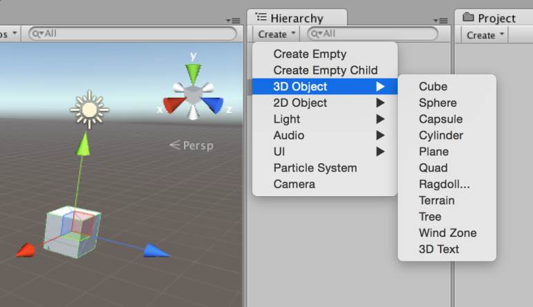


다음은 Edit/Undo Create Cube를 실행합니다. 단축키로 실행하는 경우는 "command/ctrl+Z"입니다.


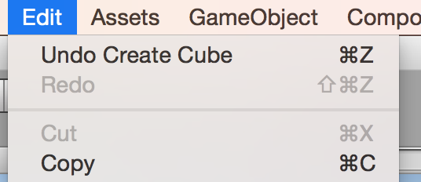


메뉴 이름이 Undo Create Cube가 아닌 경우 불필요한 조작을 실시하고 있을 가능성이 있습니다. 다시 한번 Cube을 생성하는세요.


생성된 Cube가 삭제되었습니까? Cube를 생성하기 전으로 돌아갔습니다. 이것이 "이전으로 돌아가기=Undo"라는 조작입니다.


# 2. Undo의 구조

Undo의 관리는 스택으로 실행하고있습니다. 스택은 나중에 넣은 것을 먼저 내보내는 "LIFO(Last In, First Out, 선입선출 구조)"입니다.

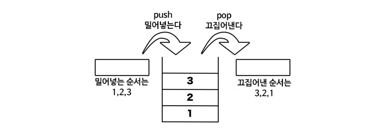

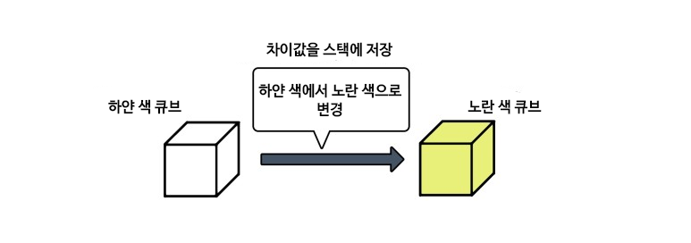


# 3. Undo를 구현해보기

Undo의 조작을 체험했다면, 다음은 Undo를 구현해봅시다.

이전 Undo 이력을 리셋하기 위해서 File/New Scene에서 신규 씬을 만들어둡시다.

## 3.1. [오브젝트의 작성에 대한 Undo]

다음 코드는 Cube를 생성하기 위한 코드입니다. Example/Create Cube를 실행함으로써 Cube을 생성할 수 있습니다.

```csharp
using UnityEngine;
using UnityEditor;

public class Example
{
    [MenuItem("Example/Create Cube")]
    static void CreateCube ()
    {
        GameObject.CreatePrimitive (PrimitiveType.Cube);
    }
}
```

Cube를 생성해도 Undo를 실행하지는 못합니다. 이건 Undo의 구현이 되어 있지 않아서 그렇습니다.

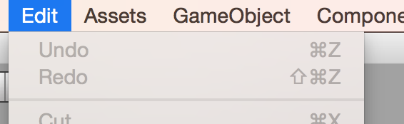

곧바로 Undo클래스를 사용하여 Undo를 구현합니다.

Undo 조작의 한 예시로서 Undo.RegisterCreatedObjectUndo함수를 사용하고 Undo를 구현해 봅시다. 이 함수는 개체가 생성된 때에 사용하는 Undo로, 이 함수에 의해서 등록된 오브젝트는 Undo 실행시에 파기됩니다.


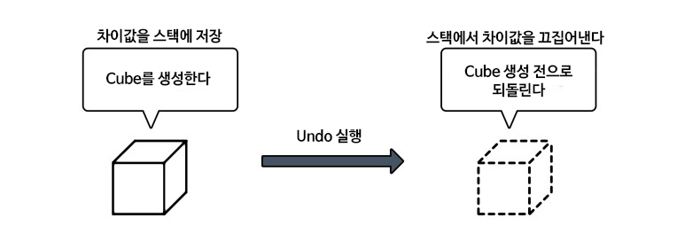


RegisterCreatedObjectUndo 함수를 실행하면 "Cube를 작성한다"는 처리를 스택에 추가합니다. 실제로는 오브젝트와 Undo 이름이 한꺼번에 스택에 저장됩니다. Undo가 실행될 때에는 "Cube를 작성하기 전으로 되돌린다", 즉 Cube를 삭제하는 처리를 하게 됩니다.


다음 코드처럼 구현하고 실행해 봅시다.

```csharp
using UnityEngine;
using UnityEditor;

public class Example
{
    [MenuItem("Example/Create Cube")]
    static void CreateCube ()
    {
        var cube = GameObject.CreatePrimitive (PrimitiveType.Cube);
        Undo.RegisterCreatedObjectUndo (cube, "Create Cube");
    }
}
```

아래의 이미지처럼 Undo가 등록되어 있으면 성공입니다. 실제로 Undo해 봅시다.


Undo를 실행한 후에는 Undo한 것을 되돌리는 Redo(취소)도 실행할 수 있습니다.


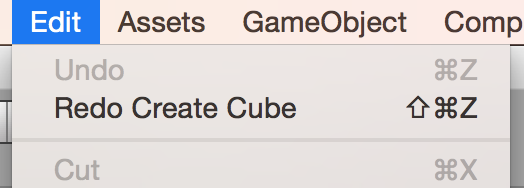


## 3.2. [프로퍼티 변경에 대한 Undo]

다음 코드는 오브젝트의 회전을 랜덤으로 설정하는 코드입니다. Example/Random Rotate를 실행함으로써 선택하고 있는 오브젝트를 랜덤으로 회전시킬 수 있습니다.

```csharp
using UnityEngine;
using UnityEditor;

public class Example
{
    [MenuItem("Example/Random Rotate")]
    static void RandomRotate ()
    {
        var transform = Selection.activeTransform;

        if (transform) {
            transform.rotation = Random.rotation;
        }
    }
}
```

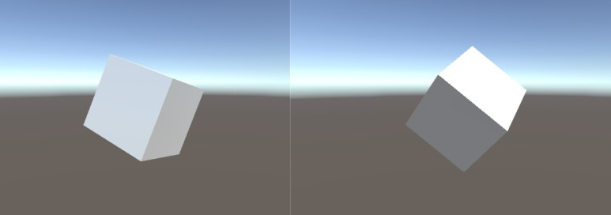


여기에 Undo.RecordObject함수를 사용함으로써 Undo를 구현합니다.

```csharp
using UnityEngine;
using UnityEditor;

public class Example
{
    [MenuItem("Example/Random Rotate")]
    static void RandomRotate ()
    {
        var transform = Selection.activeTransform;

        if (transform) {
            Undo.RecordObject (transform, "Rotate " + transform.name);
            transform.rotation = Random.rotation;
        }
    }
}
```

랜덤 한 회전이 설정되기 전에 Undo.RecordObject함수를 실행합니다. 이에 따라 "변경전"의 Transform의 프로퍼티를 Undo 스택에 저장할 수 있게 됩니다.

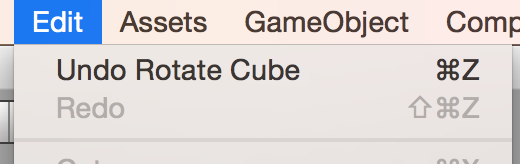


# 4. 어느 프로퍼티가 변경되었는지를 알기 위한 PropertyDiffUndoRecorder

Undo의 스택에 저장되는 것은 "값 변경 전과 변경 후의 차이"입니다. 

그래서 "어느 프로퍼티가 변경되었는지"를 알 필요가 있습니다. 그 역할을 담당하는 것이 PropertyDiffUndoRecorder입니다.


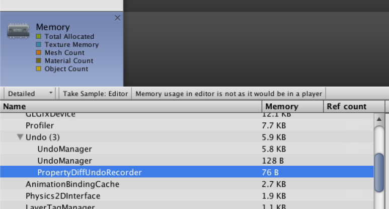

PropertyDiffUndoRecorder는 Unity 에디터의 라이프 사이클의 끝에 Undo의 Flush를 호출합니다. 그 때에 RecordObject에서 등록된 오브젝트의 각 프로퍼티와 Flush가 호출된 때의 각 프로퍼티를 사용해서 차이를 구합니다.


아래의 순서로 실행되며, 이를 옮긴게 아래의 그림입니다.

```
1. 오브젝트의 등록
2. 값 변경
3. Flush 실행
4. 차이의 출력
```

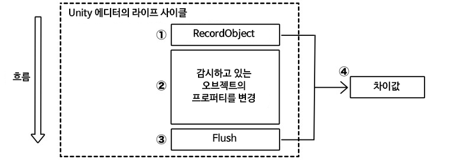

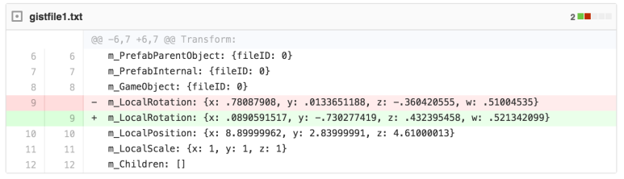


차이의 이미지(이미지는 gist의 diff 뷰입니다)

이러한 사이클을 확인해봅시다. 

```csharp
using UnityEngine;
using UnityEditor;

public class Example
{
    [MenuItem("Example/Random Rotate")]
    static void RandomRotate ()
    {
        var transform = Selection.activeTransform;

        if (transform) {
            Undo.willFlushUndoRecord += () => Debug.Log ("flush");

            Undo.postprocessModifications += (modifications) => {
                Debug.Log ("modifications");
                return modifications;
            };

            Undo.RecordObject (transform, "Rotate " + transform.name);
            Debug.Log ("recorded");

            transform.rotation = Random.rotation;
            Debug.Log("changed");
        }
    }
}
```

실행하면 아래와 같은 순서대로 출력됩니다.

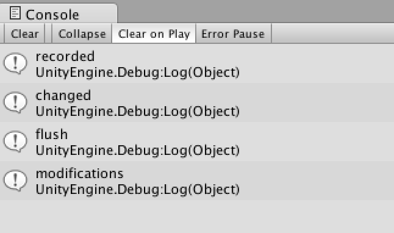


# 5. Redo의 구조

Redo는 Undo에서 처리한 것을 실행 취소시키는 기능입니다. Redo를 써서 Undo의 실행을 없었던 것으로 하겠습니다.

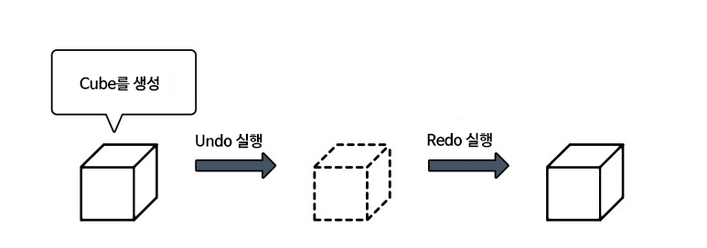


Redo도 스택으로 관리됩니다.

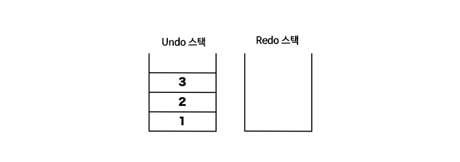


Undo가 실행되면, 스택에서 빠진 것은 Redo의 스택에 쌓입니다.

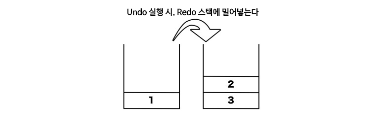


Redo를 실행하면 Redo 스택에 저장되었던 것이 다시 Undo스택에 저장됩니다.

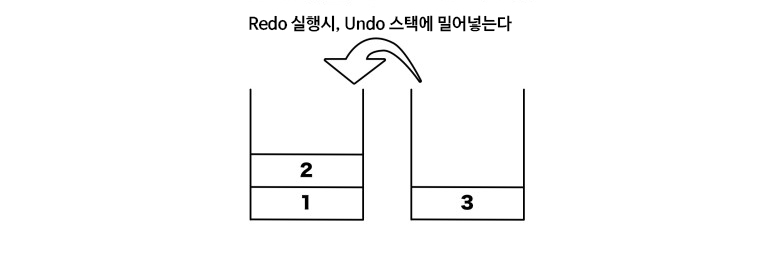


이처럼 Redo는 Undo에서 처리된 것을 이용하므로 특별한 구현은 필요 없습니다.

# 6. Undo의 대상

Undo의 대상이 되는 것은 UnityEngine.Object를 상속한, Serialize 가능한 오브젝트입니다.

## 6.1. [Undo의 구현에서 자주 대상이 되는 것]

Undo의 구현에서 자주 대상이 되는 것은 아래의 3가지입니다. 이들의 오브젝트를 생성하거나 오브젝트의 프로퍼티 값을 변경하는 경우에는 Undo의 구현을 해야 한다고 생각하시면 됩니다.

- GameObject
- Component(MonoBehaviour도 포함)
- ScriptableObject


## 6.2. [System.Serializable속성을 붙인 클래스를 Undo대상으로 하려면]

System.Serializable속성을 붙인 클래스를 Undo대상으로 할 때, Component와 ScriptableObject의 프로퍼티로서 갖는 것을 통해 Undo대상으로 할 수 있습니다.

```csharp
[System.Serializable]
public class PlayerInfo
{
    public string name;
    public int hp;
}
```

예시로서 Player 컴포넌트에 변수로 해서 가집니다.

```csharp
using UnityEngine;

public class Player : MonoBehaviour
{
    [SerializeField]
    PlayerInfo info;
}
```

그리고 Player 컴포넌트를 Undo대상으로 해서 등록합니다.

```csharp
using UnityEngine;
using UnityEditor;

public class Example
{
    [MenuItem("Example/Change PlayerInfo")]
    static void ChangePlayerInfo ()
    {
        var player = Selection.activeGameObject.GetComponent<Player> ();

        if (player) {
            Undo.RecordObject (player, "Change PlayerInfo");
            player.info = new PlayerInfo{
                name = "New PlayerName",
                hp = Random.Range(0,10)
            };
        }
    }
}
```

# 7. Undo의 종류

Undo의 종류는 크게 2종류가 있습니다. 

- 오브젝트의 프로퍼티 (값) 변경에 대한 Undo 
- 오브젝트를 대상으로 한 액션에 대한 Undo

## 7.1. [오브젝트의 프로퍼티 (값) 변경에 대한 Undo]
### 7.1.1. Undo.RecordObject(s)
Undo의 구현은 대개 Undo.RecordObject로 됩니다. 우선 이 API를 기억합시다.

```csharp
using UnityEngine;
using UnityEditor;

public class NewBehaviourScript
{
    [MenuItem("Undo/RecordObject")]
    static void RecordObject ()
    {
        //선택상태의 Transform 을 얻어오기
        Transform transform = Selection.activeTransform;

        //여기서 변경하는 프로퍼티의 오브젝트의 지정과 Undo 이름
        Undo.RecordObject (transform, "position를 Vector3(0,0,0)로 변경");
        transform.position = new Vector3 (0, 0, 0);
    }
}
```

## 7.2. [오브젝트를 대상으로 한 액션에 대한 Undo]

### 7.2.1. Undo.AddComponent

게임 오브젝트에 컴포넌트를 추가하고 Undo 대상으로 합니다. Editor 확장으로 기능을 추가할 때는 이쪽을 씁시다.

```csharp
using UnityEngine;
using UnityEditor;

public class NewBehaviourScript
{

    [MenuItem("Undo/AddComponent")]
    static void AddComponent ()
    {
        GameObject go = Selection.activeGameObject;

        Rigidbody rigidbody = Undo.AddComponent<Rigidbody> (go);

        //이후, Undo 실행을 하면 컴포넌트가 제거된다
    }
}
```

### 7.2.2. Undo.RegisterCreatedObjectUndo

오브젝트를 작성했을 때 Undo로 파기하기 위해서 사용합니다. 자주 사용하는 것은 게임 오브젝트 작성 때와 ScriptableObject 작업할 때입니다.

```csharp
using UnityEngine;
using UnityEditor;

public class NewBehaviourScript
{
    [MenuItem("Undo/RegisterCreatedObjectUndo")]
    static void RegisterCreatedObjectUndo ()
    {
        GameObject go = new GameObject ();
        Undo.RegisterCreatedObjectUndo (go, "GameObject 을 작성");

        //그룹을 increment
        Undo.IncrementCurrentGroup ();

        Hoge hoge = ScriptableObject.CreateInstance<Hoge> ();
        Undo.RegisterCreatedObjectUndo (hoge, "Hoge 를 작성");
        //실제로 hoge 가 Undo 되는지 확인. Undo 되면 null 이 된다
        EditorApplication.update += () => Debug.Log (hoge);
    }
}
```

### 7.2.3. Undo.DestroyObjectImmediate

RegisterCreatedObjectUndo와는 반대로, 파기한 것을 Undo로 되돌리기(다시 생성하기) 위해 사용합니다.

```csharp
using UnityEngine;
using UnityEditor;

public class NewBehaviourScript
{
    [MenuItem("Undo/DestroyObjectImmediate")]
    static void DestroyObjectImmediate ()
    {
        GameObject go = Selection.activeGameObject;
        //선택한 GameObject를 파기. Undo로 폐기 이전 상태로 되돌아갑니다
        Undo.DestroyObjectImmediate (go);
    }
}
```

### 7.2.4. Undo.SetTransformParent

게임 오브젝트의 부모자식 관계를 작성/변경 할 때 사용하는 Undo의 구현입니다.

```csharp
using UnityEngine;
using UnityEditor;

public class NewBehaviourScript
{
    [MenuItem("Undo/SetTransformParent")]
    static void SetTransformParent ()
    {

        Transform root = GameObject.Find("Main Cameta").transform;

        Transform transform = Selection.activeTransform;

        Undo.SetTransformParent (transform, root, "Main Cameta 오브젝트의 자식 요소로 한다");
    }
}
```

# 8. 취소 처리(Revert)

Undo 등록하고 값을 변경하면서, "Esc"버튼 등으로 그 조작 자체를 취소하고 싶을 때가 있습니다. 취소 때는 Undo등록할 때의 값으로 돌아옵니다만, 취소이기 때문에 Redo(Esc 누르기 직전의 상태)을 실행할 수 있으면 부자연스럽습니다. 그래서 Redo를 하지 않는 Undo의 구현을 해야 합니다. 

이 취소 처리를 Revert라고 합니다.

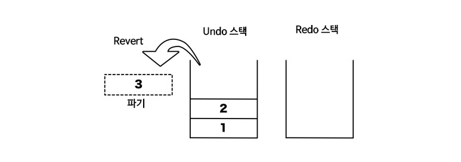

## 8.1. Undo.RevertAllInCurrentGroup

현재 그룹의 Undo를 실행합니다. "Revert"는 되돌리는 처리뿐이라 Redo는 안 됩니다.

```csharp
using UnityEngine;
using UnityEditor;

public class NewBehaviourScript
{
    // 반드시 복권에 당첨되는 함수
    [MenuItem("Undo/RevertAllInCurrentGroup")]
    static void RevertAllInCurrentGroup ()
    {
        GameObject ticket = new GameObject ("Ticket");

        Undo.RegisterCreatedObjectUndo (ticket, "복권 샀습니다");

        //티켓의 번호는 이것입니다
        int number = ticket.GetInstanceID ();

        //당첨번호는 이것입니다
        int winningNumber = 1234;

        if (ticket.GetInstanceID () != winningNumber) {
          //당첨되지 않았습니다
          //복권을 산것을 없었던 일로 합니다
          Undo.RevertAllInCurrentGroup ();
        }
    }
}
```

## 8.2. Undo.RevertAllDownToGroup

다른 하나로는 Undo.RevertAllDownToGroup이 있습니다. 이것은 지정한 그룹 인덱스까지 되돌립니다. 연속적으로 값이 변경된 것을 Revert할 때 RevertAllDownToGroup을 사용합니다. 예를 들어 게임 오브젝트에 3개의 컴포넌트를 붙입시다. 이 때 그룹 인덱스는 각각 다르다고 합시다. "1번째 컴포넌트를 추가한 상태까지로 되돌아가"와 같은 구현을 실시하려면 아래 코드처럼 됩니다.

```csharp
using UnityEngine;
using UnityEditor;

public class ExampleWindow : EditorWindow
{

    //윈도우 작성ウィンドウ作成
    [MenuItem("Window/ExampleWindow")]
    static void Open ()
    {
      GetWindow<ExampleWindow> ();
    }

    GameObject go;

    int group1 = 0;
    int group2 = 0;
    int group3 = 0;

    void OnEnable ()
    {
        go = GameObject.Find ("New Game Object");
    }

    void OnGUI ()
    {
        //마우스를 클릭하면
        if (Event.current.type == EventType.MouseDown) {

            //현재의 그룹 인덱스를 가져옴
            group1 = Undo.GetCurrentGroup();

            //1개째 추가
            Undo.AddComponent<Rigidbody> (go);

            //increment
            Undo.IncrementCurrentGroup();

            //현재의 그룹 인덱스를 가져옴
            group2 = Undo.GetCurrentGroup();

            //2개째 추가
            Undo.AddComponent<BoxCollider> (go);

            //increment
            Undo.IncrementCurrentGroup();

            //현재의 그룹 인덱스를 가져옴
            group3 = Undo.GetCurrentGroup();

            //3개째 추가
            Undo.AddComponent<ConstantForce>(go);
        }

        if (Event.current.type == EventType.MouseUp) {
            //group2까지 되돌림(1개째만이 추가되어있는 상황으로）
            Undo.RevertAllDownToGroup(group2);
            //컴포넌트의 GUI가 변경된것에 의한
            //렌더링 에러를 회피하기 위해 ExitGUI 를 호출
            EditorGUIUtility.ExitGUI();
        }
    }
}
```

# 9. 그룹을 이해하기

Undo에는 그룹이라는 개념이 존재합니다.

예를들어 아래 코드

```csharp
GameObject enemy = new GameObject ("Enemy");
Undo.RegisterCreatedObjectUndo (enemy, "Enemy 를 작성");

GameObject effect = new GameObject ("Effect");
Undo.RegisterCreatedObjectUndo (effect, "Effect 를 작성");
```

와 같이 써서, 다수의 Undo 대상을 등록해서, 이들을 실제로 Undo 실행하면 어떻게 되겠습니까.

## 9.1. [한꺼번에 Undo하기]
방금전 코드에서 Undo를 실행하면, 2개의 오브젝트의 Undo가 동시에 실행됩니다.

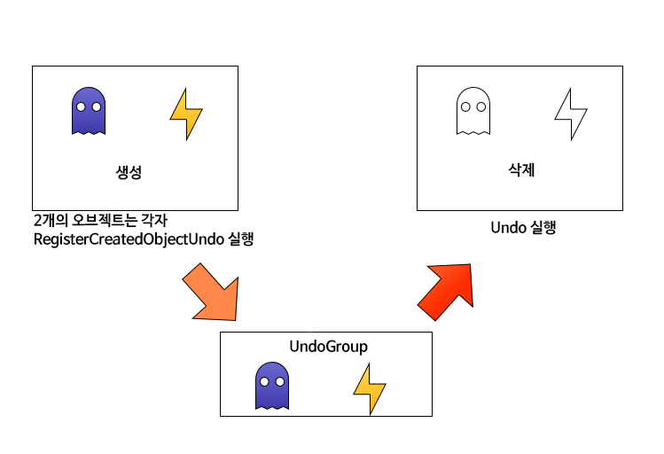


이는 PropertyDiffUndoRecorder가 Flush될 때까지 1개 그룹으로써 뭉쳐지기 때문입니다. Undo때에는 1개 그룹이 한꺼번에 처리됩니다.


이러한 작동 상황에서 문제 없는 경우도 있을지도 모르겠지만, "각각의 Undo를 따로 실행하고 싶은" 경우도 있습니다.


## 9.2. [각각의 Undo를 개별적으로 실행하기]

1개 그룹이 되어 있기 때문에 한꺼번에 Undo되는 것이므로, 이를 2개 그룹으로 나누면 문제 없습니다.이를 위한 API가 준비되어 있습니다.


## 9.3. Undo.IncrementCurrentGroup

그룹은 int 형 index로 관리되고 있으므로 그것을 증가(+1) 시키고 그룹을 분리합니다. 그러면, 각각의 것은 다른 그룹으로서 인식되어 개별적으로 Undo할 수 있게 됩니다.

```csharp
GameObject enemy = new GameObject ("Enemy");
Undo.RegisterCreatedObjectUndo (enemy, "Enemy를 작성");

Undo.IncrementCurrentGroup();

GameObject effect = new GameObject ("Effect");
Undo.RegisterCreatedObjectUndo (effect, "Effect를 작성");
```

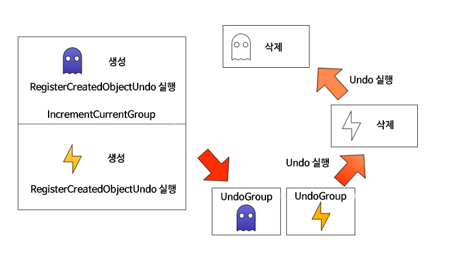


## 9.4. [개별적이었던 Undo를 1개로 합치기]
처음에는 개별적 독립적이었던 Undo 처리였지만 마지막에는 Undo를 1개로 합칠 수 있습니다. 

컬러 피커에서 이 예를 볼 수 있습니다. 

컬러 피커의 표시 중에는, 각 RGBA성분에 대한 Undo가 적용됩니다. 그러나 컬러 피커에서 색을 결정한 후에는 컬러 피커를 열기 전의 색깔로 Undo 하지 않으면 안 됩니다. 이는 컬러 피커를 내렸을 때, 각 RGBA성분별로 나뉜 Undo를 1개로 합쳤기 때문에 실현이 가능한 것입니다.

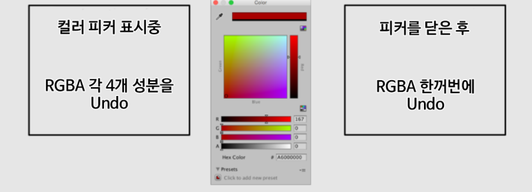


## 9.5. CollapseUndoOperations

Undo를 묶는 방법으로는 CollapseUndoOperations를 사용하는 방법이 있습니다.

CollapseUndoOperations는 지정한 group에서부터 지금까지의 그룹을 모두 1개로 합치는 기능입니다. 

다음 코드는 Cube/Plane/Cylinder를 작성하는 코드입니다. 각 게임 오브젝트의 생성에 대해서 Undo가가 실행됩니다. 또 EditorWindow을 내렸을 때는 Undo를 실행했을 때 Cube/Plane/Cylinder가 모두 삭제됩니다. 

다음 코드처럼 OnEnable안에서 그룹 ID를 보유하고, OnDisable에서 지금까지 Undo를 1개로 정리합니다.

```csharp
using UnityEngine;
using UnityEditor;

public class NewBehaviourScript : EditorWindow
{
    int groupID = 0;

    [MenuItem ("Window/Example")]
    static void Open ()
    {
        GetWindow<NewBehaviourScript> ();
    }

    void OnEnable ()
    {
        groupID = Undo.GetCurrentGroup ();
    }

    void OnDisable ()
    {
        Undo.CollapseUndoOperations (groupID);
    }

    void OnGUI ()
    {
        if (GUILayout.Button ("Cube 작성")) {
            var cube = GameObject.CreatePrimitive (PrimitiveType.Cube);
            Undo.RegisterCreatedObjectUndo (cube, "Create Cube");
        }

        if (GUILayout.Button ("Plane 작성")) {
            var plane = GameObject.CreatePrimitive (PrimitiveType.Plane);
            Undo.RegisterCreatedObjectUndo (plane, "Create Plane");
        }

        if (GUILayout.Button ("Cylinder 작성")) {
            var cylinder = GameObject.CreatePrimitive (PrimitiveType.Cylinder);
            Undo.RegisterCreatedObjectUndo (cylinder, "Create Cylinder");
        }
    }
}
```