[에디터 확장 입문] 번역 16장 Giszmo(기즈모)

번역/유니티/유니티에디터확장입문

><주의>
원문의 작성 시기는 2016년경으로, 코드나 일부 설명이 최신 유니티 버젼과 다소 맞지 않을 수 있습니다.
원문 작성자 분 역시 2019년경에 내용에 다소 오류가 있다는 이유로 웹 공개 버젼을 비공개 처리하였습니다.
(2022.10.08 역자)

원문 링크 (2022.10.08 지금은 폐기)

http://anchan828.github.io/editor-manual/web/gizmo.html

---
목차
- [1. 게임 오브젝트에 기즈모를 추가](#1-게임-오브젝트에-기즈모를-추가)
- [2. 기즈모 표시](#2-기즈모-표시)
  - [2.1. [OnDrawGizmos와 OnDrawGizmosSelected]](#21-ondrawgizmos와-ondrawgizmosselected)
  - [2.2. DrawGizmoAttribute](#22-drawgizmoattribute)
  - [2.3. [씬 뷰와 게임 뷰에서 기즈모의 색을 바꾸기]](#23-씬-뷰와-게임-뷰에서-기즈모의-색을-바꾸기)


기즈모는 씬 뷰에서 편집이나 디버깅을 위해 오브젝트의 위치나 범위, 특정 요소를 가시화하기 위한 구조입니다. 옵션에 따라 게임 뷰에서도 렌더링 시킬 수 있습니다.

예를 들면, Primitive의 Cube를 작성했다고 합시다.

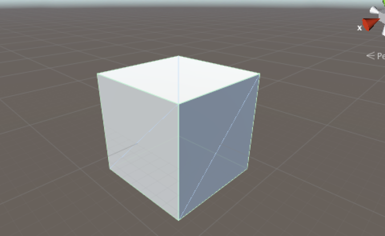


조금 알기 어렵지만 위 사진의 Cube의 근처에는 녹색선 또는 청색 줄이 표시되고 있습니다. 이 보이는 선이 기즈모입니다. 이 기즈모가 있음으로 해서,"이 게임 오브젝트에는 Collider가 Attach되어있다""Collider의 크기는 이 정도다" 같은 정보를 얻을 수 있습니다. 


# 1. 게임 오브젝트에 기즈모를 추가 


또 기즈모는 아이콘도 표시할 수 있습니다. 이는 표준 기능으로 구현되어있어, 인스팩터에 있는 게임 오브젝트의 아이콘을 클릭하면 아이콘 선택 화면이 표시됩니다.

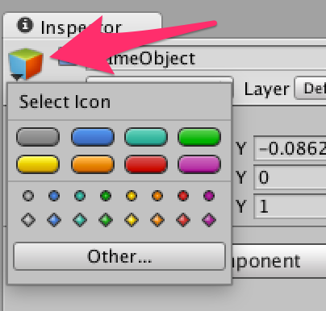


기본적으로 3개의 형태와 다양한 색이 준비되어 있습니다.

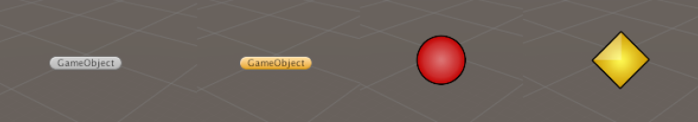


또한, 원하는 텍스쳐를 아이콘으로 지정할 수 있습니다.

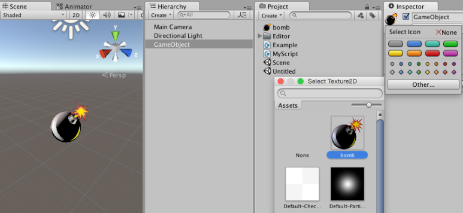


아이콘을 붙임으로써 "어디에 개체가 있는지 알기 쉽게 된다""렌더링하는 것이 없는 씬 뷰에서 선택할 수 없었던 오브젝트를 선택할 수 있다"는 메리트가 생깁니다.

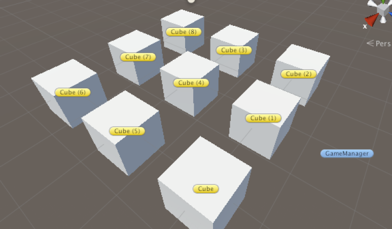


GameManager는 보통 기즈모가 표시되지 않는 씬 뷰에서 선택할 수 없지만, 아이콘을 클릭하면 선택할 수 있습니다.


# 2. 기즈모 표시

"Box Collider가 Attach되어 있는것 같은 상태"를 기즈모로 표현해 봅시다. 

빈 게임 오브젝트를 작성하여 작성한 스크립트를 Attach합니다.

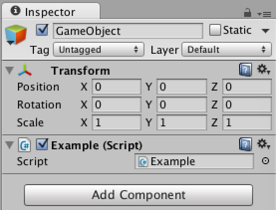


## 2.1. [OnDrawGizmos와 OnDrawGizmosSelected]

가장 쉽게 기즈모를 표시하는 방법으로 2개의 함수가 준비되어 있습니다. 그 함수는 MonoBehaviour상속 클래스 내에서 Update함수 같은 콜백으로 사용할 수 있습니다. 게임 오브젝트 또는 부모를 선택 중일 때만 표시하는 OnDrawGizmosSelected, 게임 오브젝트가 활성화 상태일때 항상 표시하는OnDrawGizmos의 2개가 있습니다.

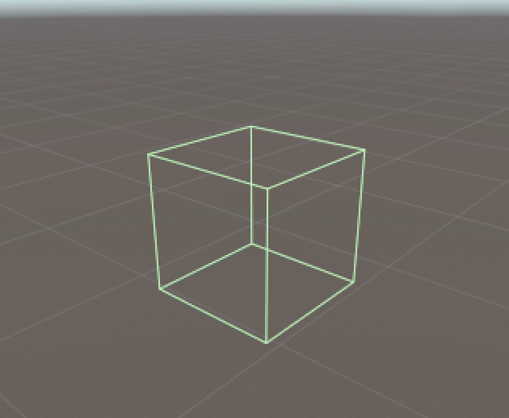

OnDrawGizmosSelected를 사용하여 오브젝트를 선택 중에 기즈모를 표시

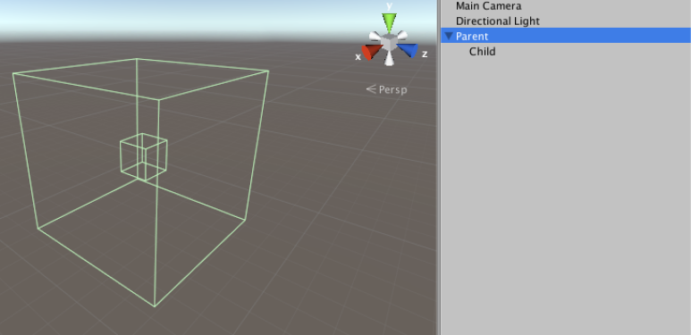


OnDrawGizmosSelected로 자식 요소의 기즈모도 한꺼번에 표시

```csharp
using UnityEngine;

public class Example : MonoBehaviour
{
    void OnDrawGizmosSelected ()
    {
        //기즈모의 색을 변경
        Gizmos.color = new Color32 (145, 244, 139, 210);
        Gizmos.DrawWireCube (transform.position, transform.lossyScale);
    }
}
```


## 2.2. DrawGizmoAttribute

간편하게 사용하는 OnDrawGizmos와 OnDrawGizmosSelected를 소개했지만 원래 기즈모는 에디터 측의 기능입니다. 런타임의 스크립트에 에디터의 코드를 쓰는 것은 좋지 않을 수 있습니다. #if UNITY_EDITOR로 둘러싸면 컴파일은 문제 없습니다.

기즈모를 그리는 방법으로서 DrawGizmoAttribute이 있습니다. 이 속성은 특정 컴포넌트에 대해서 기즈모를 적용하기 위한 것입니다. 즉, OnDrawGizmos와 OnDrawGizmosSelected와 같은 기능을 다룬다는 것입니다. 

OnDrawGizmos와 같은 기능을 DrawGizmoAttribute에서 구현하면 아래의 코드처럼 됩니다. GizmoType.NonSelected뿐이라면, 오브젝트를 선택했을 때에 표시되지 않게 되어 버리므로 GizmoType.Active("기즈모가" 활성화된다고 판단되는 경우는 "게임 오브젝트가" 활성화 되거나 게임 오브젝트를 선택했을 때)도 추가하여 선택 상태에서도 기즈모를 표시하도록 하겠습니다.

```csharp
using UnityEngine;
using UnityEditor;

public class EditorScript
{
    [DrawGizmo (GizmoType.NonSelected | GizmoType.Active)]
    static void DrawExampleGizmos (Example example, GizmoType gizmoType)
    {
        var transform = example.transform;
        Gizmos.color = new Color32 (145, 244, 139, 210);

        //GizmoType.Active 일 때는 빨간색으로 한다
        if ((gizmoType & GizmoType.Active) == GizmoType.Active)
            Gizmos.color = Color.red;

        Gizmos.DrawWireCube (transform.position, transform.lossyScale);
    }
}
```

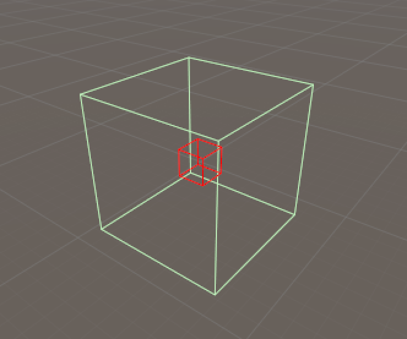


OnDrawGizmosSelected을 표현하는 경우에는 GizmoType.InSelectionHierarchy로 가능합니다.

```csharp
[DrawGizmo (GizmoType.InSelectionHierarchy)]
static void DrawExampleGizmos (Example example, GizmoType gizmoType)
{
    // 생략
}
```

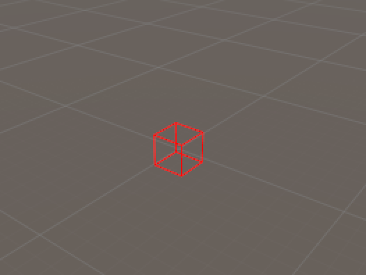


## 2.3. [씬 뷰와 게임 뷰에서 기즈모의 색을 바꾸기]

씬 뷰와 게임 뷰에서 다른 기즈모의 색을 표시하고 싶을 수 있습니다. 그렇지만, 기즈모에는 "어느 뷰에서 렌더링 할지"를 판단하는 API는 존재하지 않습니다. 

게임 뷰에 렌더링하는 기즈모는 내부에서 렌더링 직전에 INTERNAL_CALL_RenderGameViewCameras가 호출됩니다. 그것이 어느 쪽의 뷰에 렌더링되는지의 유일한 판단 근거가 될 것입니다. 

스택 추적을 사용하여 INTERNAL_CALL_RenderGameViewCameras가 호출되는지 확인합니다. 다음 코드는 그 샘플입니다.

```csharp
void OnDrawGizmosSelected ()
{
  var trace = new System.Diagnostics.StackTrace ();
  var frame = trace.GetFrames () [1];

  if (frame.GetMethod ().Name == "INTERNAL_CALL_RenderGameViewCameras")
    Gizmos.color = Color.red;

  Gizmos.DrawCube (Vector3.zero, Vector3.one);
}
```

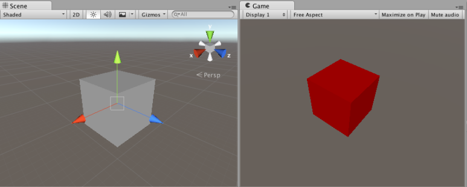

씬 뷰에서는 회색, 게임 뷰에서는 빨간 색으로 표시됩니다 


다만, 기즈모를 렌더링하는 매 프레임마다 StackTrace를 생성하고 있으므로 약간 퍼포먼스적으로 불안합니다. 대량의 기즈모에 대해서 이 처리를 실시하는 것은 되도록 피하는 게 좋겠습니다. 

기즈모는 단순한 기능이지만 아이디어에 따라서는 씬 안의 상황을 더 쉽게 이해할 수 있게 합니다.

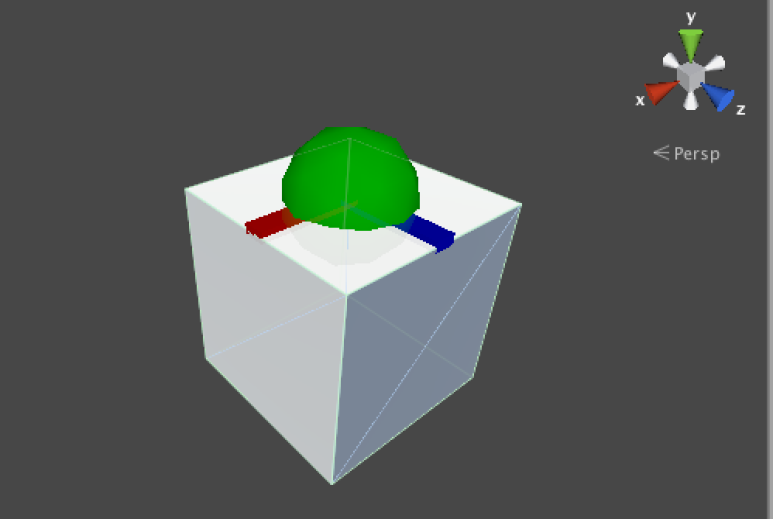


Cube에 위쪽임을 표시하는 반구와 축을 표시