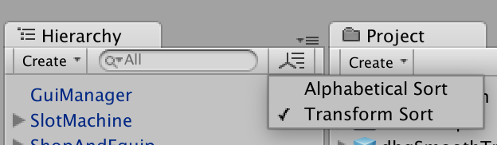
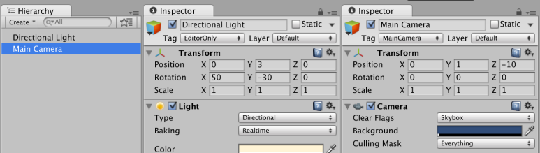
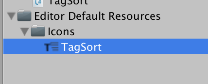

[에디터 확장 입문] 번역 18장 HierarchySort

번역/유니티/유니티에디터확장입문

><주의>
원문의 작성 시기는 2016년경으로, 코드나 일부 설명이 최신 유니티 버젼과 다소 맞지 않을 수 있습니다.
원문 작성자 분 역시 2019년경에 내용에 다소 오류가 있다는 이유로 웹 공개 버젼을 비공개 처리하였습니다.
(2022.10.08 역자)

원문 링크 (2022.10.08 지금은 폐기)
http://anchan828.github.io/editor-manual/web/hierarchysort.html

---
목차
- [1. HierarchySort를 직접 만들기](#1-hierarchysort를-직접-만들기)
- [2. TagSort를 작성한다](#2-tagsort를-작성한다)
  - [2.1. [BaseHierarchySort를 상속한 클래스를 작성하기]](#21-basehierarchysort를-상속한-클래스를-작성하기)
  - [2.2. [Compare를 오버 라이드 하고 비교를 실시하기]](#22-compare를-오버-라이드-하고-비교를-실시하기)
  - [2.3. [Hierarchy의 게임 오브젝트 이름 옆에 태그 이름을 입력한다]](#23-hierarchy의-게임-오브젝트-이름-옆에-태그-이름을-입력한다)
- [3. 현재 무엇으로 정렬 하는지를 알 수 있게 만들기](#3-현재-무엇으로-정렬-하는지를-알-수-있게-만들기)
  - [3.1. [현재 정렬 이름이 TagSort의 이름과 같지 않으면 태그 보기를 그만두기]](#31-현재-정렬-이름이-tagsort의-이름과-같지-않으면-태그-보기를-그만두기)
  - [3.2. [HierarchySort아이콘을 변경]](#32-hierarchysort아이콘을-변경)

Hierarchy창에서는 게임 오브젝트의 순서를 임의로 정렬할 수 있습니다. 기본적으로는 uGUI의 그리기 순서를 결정하는 Transform Sort입니다. 또 Preferences창에 있는 "Enable Alpha Numeric Sorting"를 유효하게 하면, 게임 오브젝트를 알파벳 순으로 정렬하는 Alphabetical Sort를 선택할 수 있게 됩니다.




Alphabetical Sort은 Unity4.5까지 기본이었던 Sort 방식입니다.


다만 여기서 한가지 주의해야 할 점은, 어디까지나 Hierarchy의 표시 순서를 바꿀 수 있다는 것이고, GameObject.Find등의 게임 오브젝트의 취득 순서는 변경되지 않는다는 점에 주의하세요. 

본 장에서는 HierarchySort를 직접 작성하는 방법을 소개하겠습니다. 

# 1. HierarchySort를 직접 만들기

공식 스크립트 레퍼런스에는 샘플로서 Alphabetical Sort를 작성하는 방법이 게재되어 있습니다. 

HierarchySort를 직접 만들려면 BaseHierarchySort를 상속한 클래스를 준비하고 Compare 함수를 오버 라이드 합니다.

```csharp
public class AlphaNumericSort : BaseHierarchySort
{
    public override int Compare(GameObject lhs, GameObject rhs)
    {
        if (lhs == rhs) return 0;
        if (lhs == null) return -1;
        if (rhs == null) return 1;

        return EditorUtility.NaturalCompare(lhs.name, rhs.name);
    }
}
```

# 2. TagSort를 작성한다 

이번에는 게임 오브젝트의 태그 이름으로 정렬하는 HierarchySort을 만들어 보겠습니다. 

## 2.1. [BaseHierarchySort를 상속한 클래스를 작성하기]

아까 AlphaNumericSort샘플에서 본것처럼 BaseHierarchySort클래스를 상속한 TagSort클래스를 작성합니다.

```csharp
using UnityEngine;
using UnityEditor;
public class TagSort : BaseHierarchySort
{
}
```

## 2.2. [Compare를 오버 라이드 하고 비교를 실시하기]

그 다음엔 게임 오브젝트의 태그로 비교하도록 구현합니다.

```csharp
using UnityEngine;
using UnityEditor;
public class TagSort : BaseHierarchySort
{
  public override int Compare (GameObject lhs, GameObject rhs)
  {
    if (lhs == rhs) return 0;
    if (lhs == null) return -1;
    if (rhs == null) return 1;
    return EditorUtility.NaturalCompare (lhs.tag, rhs.tag);
  }
}
```



EditorOnly와 MainCamera의 태그가 설정되어 있으며, 태그 이름의 알파벳 순서대로 나열되어 있는 것을 알 수 있습니다.

이걸로 Tag를 사용하여 정렬이 가능하게 되었습니다. 인스펙터를 보면 확실히 함께 바뀌고 있는 것으로 나타나지만 GameObject가 어느 Tag를 갖고 있는지 Hierarchy창으로 보면 모릅니다.

## 2.3. [Hierarchy의 게임 오브젝트 이름 옆에 태그 이름을 입력한다]

거기서 EditorApplication.hierarchyWindowItemOnGUI을 사용하고 태그 이름을 표시하고 싶습니다.

```csharp
using UnityEngine;
using UnityEditor;

[InitializeOnLoad]
public class TagSort : BaseHierarchySort
{
  static TagSort()
  {
    EditorApplication.hierarchyWindowItemOnGUI += (instanceID, selectionRect) =>
    {
      var go = EditorUtility.InstanceIDToObject(instanceID) as GameObject;
      selectionRect.x += selectionRect.width - 64;
      selectionRect.width = 64;
      style.fontSize = 8;
      EditorGUI.LabelField(selectionRect, go.tag, Style.miniBox);
    };
  }

  public override int Compare(GameObject lhs, GameObject rhs)
  {
    if (lhs == rhs)
      return 0;
    if (lhs == null)
      return -1;
    if (rhs == null)
      return 1;
    return EditorUtility.NaturalCompare(lhs.tag, rhs.tag);
  }

  private class Style
  {
    public static GUIStyle miniBox;

    static Style ()
    {
      miniBox = new GUIStyle ("box");
      miniBox.fontSize = 8;
    }
  }
}
```

표시를 할 뿐이라면 위의 코드 정도로 괜찮을 것입니다. 그렇지만 이는 "TagSort를 선택하지 않고도 Tag이름이 표시되어 버린다"라고 하는, 상황에 따라서는 " 성가시다"라고 생각하시는 분도 있다고 생각합니다.

# 3. 현재 무엇으로 정렬 하는지를 알 수 있게 만들기

그래서 이번에는 "TagSort를 선택하고 있을 때만 태그 이름을 표시하는" 식으로 하고 싶습니다. 현재 무엇으로 정렬하는지 아는 방법을 API로 정식으로 제공되지 않아 조금 귀찮은 일을 해야 합니다. 귀찮은 일을 하기에 앞서 Hierarchy창의 Type을 취득해야 합니다. 이 때 UnityEngine.Types.GetType을 사용하면 편리합니다. Types.GetType은 Assembly에서 특정 Type을 취득하기 위한 API로 되어 있습니다.

```csharp
Type hierarcyType =
    Types.GetType("UnityEditor.SceneHierarchyWindow", "UnityEditor.dll");
```
    
다음으로, 아까 받은 hierarcyType을 사용하여 Hierarchy창을 얻어옵니다.

```csharp
EditorWindow hierarcyWindow = EditorWindow.GetWindow(hierarcyType, false);
```

다수에 대응하는 경우는 Resources.FindObjectsOfTypeAll(Type)을 사용하여 모든 Hierarchy 윈도우를 얻어오지만 복잡하게 되버려서 이번에 1개 윈도우만 대응해서 구현을 실시합니다. Hierarchy 윈도우의 오브젝트 중에 Serialize된 m_CurrentSortMethod라고 하는 문자열 데이터가 존재합니다. 이것이 현재 선택되고 있는 정렬 이름입니다. 

m_CurrentSortMethod는 Serialize된 데이터이므로 SerializedObject#FindProperty에서 얻어오도록 합시다. 그러기 위해서는 우선 Hierarchy 윈도우의 SerializedObject를 얻어와야 합니다. 이번에는 SerializedObject를 얻어오지 않고 작성합니다. SerializedObject를 사용하는 장면은 평소에는 CustomEditor등으로 이미 작성된 SerializedObject를 사용하고 접근하고 있는 경우가 많다고 생각합니다. 그래서, 자기 손으로 작성하는 것은 처음인 분도 많지 않을까요?

```csharp
SerializedObject hierarcyWindowObject = new SerializedObject(hierarcyWindow);
```

이렇게 현재의 정렬 이름을 취득할 수 있게 되었습니다.

```csharp
var currentSortName = hierarcyWindowObject.FindProperty("m_CurrentSortMethod").stringValue;
```

하지만 이것만으로는 정렬 이름을 얻어오는 데는 미흡합니다. 확실히 현재의 태그 이름을 취득한 것처럼 보이지만 자세히 말하면"SerializedObject 작성 시의 정렬 이름을 얻어오고 있다"는 게 됩니다. "최신 SerializedObject에서 정렬 이름을 따기 위해서는 SerializedObject#Update를 호출해 주세요. 이렇게 항상 최신의 "현재의 정렬 이름"을 취득할 수 있습니다. 


## 3.1. [현재 정렬 이름이 TagSort의 이름과 같지 않으면 태그 보기를 그만두기]

여기까지 오면 나머지 구현은 간단합니다.

```csharp
EditorApplication.hierarchyWindowItemOnGUI += HierarchyWindowItemOnGUI;

private void HierarchyWindowItemOnGUI(int instanceID, Rect selectionRect)
{
  hierarcyWindowObject.Update();
  var currentSortName =
      hierarcyWindowObject.FindProperty("m_CurrentSortMethod").stringValue;

  if (currentSortName != "TagSort")
  {
    EditorApplication.hierarchyWindowItemOnGUI -= HierarchyWindowItemOnGUI;
    hierarcyWindowObject = null;
    return;
  }

  //Tag명 표시
}
```

## 3.2. [HierarchySort아이콘을 변경]

TagSort전용의 아이콘으로 변경합니다.


준비한 아이콘을 "Editor Default Resources/Icons"폴더에 저장합니다.




이로써 EditorGUIUtility.IconContent("TagSort")에서 아이콘을 로드하는 것이 가능하게 되었습니다.이 아이콘을 적용하기 위해서, content변수를 오버 라이드 합니다.

```csharp
public class TagSort : BaseHierarchySort
{
    private GUIContent m_content = EditorGUIUtility.IconContent ("TagSort");

    public override GUIContent content {
        get {
            return m_content;
        }
    }

    //생략
}
```
실제 코드는 아래와 같습니다.

```csharp
using UnityEngine;
using UnityEditor;

public class TagSort : BaseHierarchySort
{
  private SerializedObject hierarcyWindowObject;

  public override int Compare (GameObject lhs, GameObject rhs)
  {
    if (lhs == rhs)
      return 0;
    if (lhs == null)
      return -1;
    if (rhs == null)
      return 1;
    return EditorUtility.NaturalCompare (lhs.tag, rhs.tag);
  }
  private GUIContent m_content = EditorGUIUtility.IconContent ("TagSort");

  public override GUIContent content {
    get {

      if (hierarcyWindowObject == null) {
        var hierarcyType =
          Types.GetType ("UnityEditor.SceneHierarchyWindow", "UnityEditor.dll");
        var hierarcyWindows = Resources.FindObjectsOfTypeAll (hierarcyType);
        if (hierarcyWindows.Length != 0) {
          hierarcyWindowObject = new SerializedObject (hierarcyWindows[0]);
          EditorApplication.hierarchyWindowItemOnGUI += HierarchyWindowItemOnGUI;
        }
      }

      return m_content;
    }
  }

  private void HierarchyWindowItemOnGUI (int instanceID, Rect selectionRect)
  {
    hierarcyWindowObject.Update ();

    var currentSortName =
      hierarcyWindowObject.FindProperty ("m_CurrentSortMethod").stringValue;

    if (currentSortName != "TagSort") {
      EditorApplication.hierarchyWindowItemOnGUI -= HierarchyWindowItemOnGUI;
      hierarcyWindowObject = null;
      return;
    }

    var go = EditorUtility.InstanceIDToObject (instanceID) as GameObject;

    selectionRect.x += selectionRect.width - 64;
    selectionRect.width = 64;

    EditorGUI.LabelField (selectionRect, go.tag, Style.miniBox);
  }

  private class Style
  {
    public static GUIStyle miniBox;

    static Style ()
    {
      miniBox = new GUIStyle ("box");
      miniBox.fontSize = 8;
    }
  }
}
```