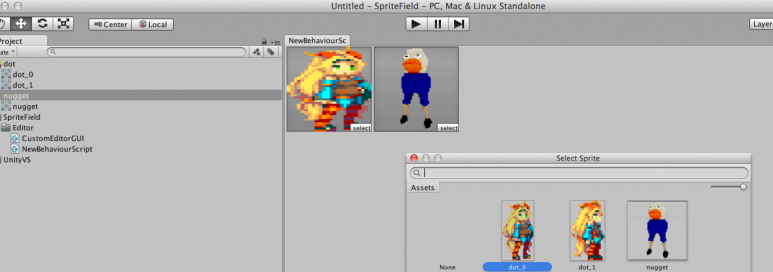

[에디터 확장 입문] 번역 19장 GUI를 직접 만들기

번역/유니티/유니티에디터확장입문


><주의>
원문의 작성 시기는 2016년경으로, 코드나 일부 설명이 최신 유니티 버젼과 다소 맞지 않을 수 있습니다.
원문 작성자 분 역시 2019년경에 내용에 다소 오류가 있다는 이유로 웹 공개 버젼을 비공개 처리하였습니다.
(2022.10.08 역자)

원문 링크 (2022.10.08 지금은 폐기)

http://anchan828.github.io/editor-manual/web/guicreation.html

---
목차

- [1. GUI을 만들기](#1-gui을-만들기)
- [2. GUIStyle](#2-guistyle)
  - [2.1. [1. GUISkin속에 다수의 GUIStyle을 설정하여 사용하기]](#21-1-guiskin속에-다수의-guistyle을-설정하여-사용하기)
  - [2.2. [2. GUI클래스의 인자로 지정하고 스타일을 변경하기]](#22-2-gui클래스의-인자로-지정하고-스타일을-변경하기)
  - [2.3. [3. 스타일을 렌더링]](#23-3-스타일을-렌더링)
- [3. Event](#3-event)
- [4. Control ID](#4-control-id)
  - [4.1. [컨트롤 ID의 생성/취득]](#41-컨트롤-id의-생성취득)
  - [4.2. [컨트롤 ID와 그리기 부분의 연관]](#42-컨트롤-id와-그리기-부분의-연관)
  - [4.3. [현재 포커스 중인 컨트롤 ID]](#43-현재-포커스-중인-컨트롤-id)
- [5. ObjectPicker](#5-objectpicker)
- [6. DragAndDrop](#6-draganddrop)
- [7. HandleUtility.Repaint](#7-handleutilityrepaint)
- [8. GUIUtility.ExitGUI](#8-guiutilityexitgui)
- [9. GUILayout 대응](#9-guilayout-대응)
- [10. SpriteField함수를 작성하기](#10-spritefield함수를-작성하기)


주: 이번 장은 ObjectField가 Sprite에 대응하지 못했던 시절에 집필된 것입니다. 그래서 목적이 되는 "Sprite에 대응하는 필드의 작성"은 필요 없는 확장이 되어 버렸습니다만, 그 과정에서 사용한 기술을 위해 게재하고 있습니다. 

예를 들면 EditorGUILayout.ObjectField에서 Sprite필드를 표시했을 때 Texture계열이면 프리뷰 형식의 GUI로 변화하지만 Sprite은 프리뷰 형식이 안 됩니다.(주:최신 버전의 Unity에서는 프리뷰 형식이 됩니다)


```csharp
void OnGUI ()
{
    GUILayoutOption[] options = new [] {
        GUILayout.Width (96),
        GUILayout.Height (96)
    };
    EditorGUILayout.ObjectField (null, typeof(Texture2D), false, options);
    EditorGUILayout.Space ();
    EditorGUILayout.ObjectField (null, typeof(Sprite), false, options);
}
```

프리뷰 형식에 대응한 SpriteField를 직접 만들어 봅시다. 

# 1. GUI을 만들기

IMGUI(Immediate Mode GUI. Unity4.5까지 주류였던 GUI시스템을 이렇게 부릅니다)로 런타임에서도 에디터 상에서도 자유롭게 GUI을 작성할 수 있습니다. 그렇지만 NGUI나 Unity4.6부터 탑재되는 uGUI을 만지는 사람이 많아, GUI클래스를 사용하고 GUI을 작성하는 것은 거의 에디터 확장을 할 때만 그렇게 하는걸로 되고 말았습니다. 그래서 GUI 클래스에 있는 IntField 같은 GUI필드를 작성하는 기술은 그렇게 많이 인지되지 않았습니다. 

그래서 이번엔 GUI필드를 작성할 때 필요한 최소한의 지식을 소개하겠습니다. 

# 2. GUIStyle 

GUIStyle은 GUI의 스타일을 설정하는 것으로 여러분은 대개 처음의 2가지 패턴으로 사용하고 있지 않을까라고 생각합니다. 

## 2.1. [1. GUISkin속에 다수의 GUIStyle을 설정하여 사용하기]

GUISkin을 만들어 기존 스타일을 변경하거나 커스텀 스타일로 작성할 수 있습니다. 그리고 스크립트 측에서 GUI.skin에 자신이 작성한 GUISkin을 대입하면 한번에 스타일이 적용됩니다.


직접 이미지를 준비하면 버튼이나 토글의 이미지를 변경할 수 있습니다


## 2.2. [2. GUI클래스의 인자로 지정하고 스타일을 변경하기]

GUI을 렌더링할 때 기존 스타일을 사용하지 않고 인자로서 전달된 GUIStyle을 사용합니다.

```csharp
//GUIStyle 는 스타일 이름으로 지정하는 것도 가능
GUILayout.Label ("라벨", "box");
```

## 2.3. [3. 스타일을 렌더링]

2가지 패턴을 소개했습니다. 마지막으로 한가지 더 있는데, 이것이 GUI을 작성하는 데 필요한 지식이 됩니다. 

GUIStyle에는 GUIStyle.Draw라는 API가 존재합니다. 이는 GUIStyle로 설정된 폰트나 텍스처, 문자의 색을 사용하여 렌더링을 행하는 것입니다. 여러분이 평소 보는 GUILayout.Button 버튼 영상도 GUILayout.Button의 내부에서 GUIStyle.Draw가 호출되고 있습니다.

# 3. Event 

Event클래스는 모든 이벤트를 관리하기 위한 기능입니다. 

GUI에 대한 이벤트는 다양한 종류가 있고 예를 들면 버튼을 마우스로 클릭할 때 

- 버튼 위에 마우스가 있을 때
- 클릭되었을때
- 버튼을 누른 채로 있을때

이벤트가 발생합니다. 이 때 이벤트를 적절히 처리함으로써 버튼의 움직임을 표현할 수 있습니다. 
예를 들면"버튼을 눌렀다"라는 이벤트를 코드화하면 다음과 같습니다.

```csharp
if (Event.current.type == EventType.MouseDown) {

    ...버튼을 눌렀을 때의 처리...

    //버튼을 눌렀을 때 (사용 끝) 으로 처리
    Event.current.Use();
}
```

"버튼을 눌렀다"라는 이벤트를 사용할 경우 반드시 Event.Use를 호출합니다. 그러면 이번 이벤트는 이미 사용이 끝난 상태가 됩니다. 

Event.Use를 호출한 후에는 Event.type는 used입니다. 이렇게 함으로써 다른 이벤트 처리는 실행되지 않게 되어, 다른 이벤트와 경쟁하지 않습니다. 

# 4. Control ID 

모든 GUI에 대해서 컨트롤 ID라는 것이 배정되고 있습니다. 이 ID에 의해 각각의 GUI는 독립된 것이 됩니다. 이 ID를 적절하게 배정하지 않으면 "GUI.Window를 마우스로 드래그 할 때 범위 선택 도구가 작동하고 말았다"라고 하는 의도하지 않는 GUI의 다수 조작(경쟁)을 하게 됩니다. 

## 4.1. [컨트롤 ID의 생성/취득]

```csharp
int id = GUIUtility.GetControlID(FocusType.Passive, rect);
```
이 경우는 키보드 이외의 포커스를 받아 특정 범위(rect)내의 컨트롤 ID를 생성/취득하고 있습니다. 

## 4.2. [컨트롤 ID와 그리기 부분의 연관]

```csharp
EditorStyles.objectFieldThumb.Draw(rect, content, id);
```

GUIStyle.Draw에 컨트롤 ID를 건넴으로써, 스타일의 렌더링은 건네준 컨트롤 ID에 의해서 제어됩니다. 


## 4.3. [현재 포커스 중인 컨트롤 ID]

현재 어느 컨트롤 ID에 포커스가 맞춰지고 있는지를 알려면 GUIUtility.hotControl을 사용합니다. 또는 키보드 포커스를 알려면 GUIUtility.keyboardControl입니다. 또 GUIUtility.hotControl에 대입함으로써 강제적으로 컨트롤 ID을 바꾸는 게 가능합니다. 


# 5. ObjectPicker


오브젝트 피커는 특정 오브젝트와 에셋을 선택하기 위한 윈도우입니다. ObjectField 같은 오브젝트 참조를 가진 GUI의 경우는 이 오브젝트 피커가 있으면 사용자가 조작할 때 편리하게 됩니다. 

오브젝트 피커의 표시는 EditorGUIUtility.ShowObjectPicker에서 실시할 수 있습니다. 

그리고 오브젝트 피커에서 선택 중인 오브젝트, 선택된 오브젝트를 파악하기 위해서, Event의 커맨드명(Event.commandname)이 ObjectSelectorUpdated와 EditorGUIUtility.GetObjectPickerObject를 조합하여 사용하게 됩니다.

```csharp
//커맨드명이 ObjectSelectorUpdated이고 오브젝트 피커가
//현재 컨트롤 중인 GUI에 의한 것인 경우
if (evt.commandName == "ObjectSelectorUpdated"
    && id == EditorGUIUtility.GetObjectPickerControlID())
{
    //오브젝트 피커에서 선택 중의 객체를 취득
    sprite = EditorGUIUtility.GetObjectPickerObject() as Sprite;
    //GUI 를 다시 렌더링
    HandleUtility.Repaint();
}

if (GUI.Button(buttonRect, "select", EditorStyles.objectFieldThumb.name + "Overlay2"))
{
    //현재 컨트롤 ID에 대한 오브젝트 피커를 표시하기
    EditorGUIUtility.ShowObjectPicker<Sprite>(sprite, false, "", id);
    //오브젝트 피커를 표시하는 이벤트를 발행해서 이벤트의 Use를 실행하기
    evt.Use();
}
```

# 6. DragAndDrop 

ObjectField처럼 드래그 앤 드롭하고 오브젝트의 참조를 저장하고 싶은 경우가 있습니다. 그때는 DragAndDrop을 사용합니다. DragAndDrop에서는 오브젝트를 드래그 하는 처리와 드롭 하는 처리 2개로 나눠집니다. ObjectField과 비슷한 GUI을 작성할 때는 Hierarchy나 프로젝트 브라우저에서는 이미 드래그 처리가 구현이 끝났으므로 GUI에 드롭 처리만을 구현하면 됩니다.

```csharp
//마우스의 위치가 GUI 의 범위 안이라면
if (rect.Contains(evt.mousePosition))
{
    switch (evt.type)
    {
        //드래그 중
        case EventType.DragUpdated:
        case EventType.DragPerform:

            //드래그하고 있는것이 참조 가능한 오브젝트일 경우
            if (DragAndDrop.objectReferences.Length == 1)

                //오브젝트를 받아들임
                DragAndDrop.AcceptDrag();

            //드래그하고 있는 것을 현재의 컨트롤 ID와 연계하기
            DragAndDrop.activeControlID = id;

            //이 오브젝트를 받아들여 외관으로 삼기
            DragAndDrop.visualMode = DragAndDropVisualMode.Generic;
            break;

        //드래그 종료 = 드롭
        case EventType.DragExited:

            //드롭하고 있는것이 참조 가능한 오브젝트일 경우
            if (DragAndDrop.objectReferences.Length == 1)
            {
                var reference = DragAndDrop.objectReferences[0] as Sprite;
                if (reference != null)
                {
                    sprite = reference;
                    HandleUtility.Repaint();
                }
            }
            break;
    }
}
```

# 7. HandleUtility.Repaint 

HandleUtility.Repaint는 현재의 뷰를 다시 렌더링하는 것입니다. 

현재의 "뷰"를 조금 바꾸어 말하면, "EditorWindow와 ScriptableWizard등 GUI을 렌더링하는 윈도우"가 되는데, 그것들을 다시 렌더링합니다. 

더 자세하게 인용하자면 "GUIView를 상속하고 있는 뷰"를 다시 렌더링합니다. 

기능적으로는 EditorWindow.Repaint과 다르지 않습니다. 

프리뷰 표시 같은 GUI의 보기를 변경할 경우 아무것도 대책을 실시하지 않으면 EditorWindow등의 GUIView가 다시 렌더링하는 처리에 의존하게 되어, GUI는 최신의 렌더링을를 유지할 수 없습니다. 이를 GUI측으로부터 다시 렌더링하기를 신청하는 것이 HandleUtility.Repaint입니다. 

요약하면 다시 렌더링하는 처리가 이루어지는 것은 다음 3패턴입니다. 

- GUIView에서 Event의 Repaint가 발행된 때 
- GUIView위에 마우스를 올렸을때
- GUIView에 Focus를 맞췄을때
- GUIView의 Repaint을 요청했을때 때 
- EditorWindow.Repaint 등 
- HandleUtility.Repaint을 발행했을 때 

# 8. GUIUtility.ExitGUI 

GUI에서는 렌더링에 관한 Event을 2가지 발행하고 있습니다. GUI의 레이아웃을 구성하는 "Layout"과 다시 렌더링하는 "Repaint"입니다. 이들 이벤트 이외에서 렌더링을 변경하는 처리를 가할 경우 GUI의 레이아웃이 무너지게 되어, Unity측은 이를 오류라고 판단하고 GUI가 올바르게 렌더링 되지 않게 됩니다. 


이 현상은 "GUI함수의 인자로 사용 요소를 배열로 유지하고 있을 때 특정 요소를 배열에서 삭제" 할 때 잘 일어납니다. 

이를 회피하려면 GUIUtility.ExitGUI을 호출하여, 이후 GUI의 렌더링에 관한 처리는 모두 무시할 수 있습니다. 이렇게 하면 문제 없는 다음 프레임의 "Layout"과 "Repaint"처리가 발행되고 오류가 발생하지 않습니다. 

# 9. GUILayout 대응 

GUILayout의 구조는 GUILayoutUtility.GetRect에서 Rect정보를 취득해서 렌더링하게 됩니다. 

하지만 가장 손쉬운 방법이 있습니다.

```csharp
public static Sprite SpriteField(Sprite sprite, params GUILayoutOption[] options)
{
    EditorGUILayout.LabelField("", "", options);
    var rect = GUILayoutUtility.GetLastRect();
    return CustomEditorGUI.SpriteField(rect, sprite);
}
```

이처럼 이미 구현된 GUILayout의 API을 발행한 뒤 GUILayoutUtility.GetLastRect를 실행해서 쉽게 Rect정보를 취득할 수 있습니다. 

이로써 SpriteField를 작성하기 위한 지식이 갖춰졌습니다. 자세한 설명을 하면서 코드를 만들어 갑시다. 

# 10. SpriteField함수를 작성하기

우선 CustomEditorGUI 클래스를 작성, 그 안에 SpriteField의 함수를 추가합니다.

```csharp
using UnityEditor;
using UnityEngine;

public class CustomEditorGUI
{
    public static Sprite SpriteField (Rect rect, Sprite sprite)
    {
    }
}
```

다음으로는, GUIStyle.Draw를 사용해 배경을 렌더링합니다. GUIStyle.Draw는 EventType.Repaint때만 실행되므로 조심하세요.

```csharp
using UnityEditor;
using UnityEngine;

public class CustomEditorGUI
{
    public static Sprite SpriteField (Rect rect, Sprite sprite)
    {
        var evt = Event.current;
        if (evt.type == EventType.Repaint) {
            //썸네일 형식의 배경을 렌더링
            EditorStyles.objectFieldThumb.Draw (rect, GUIContent.none, id, false);

            if (sprite) {
                //스프라이트로부터 프리뷰 용 텍스쳐를 얻어오기
                var spriteTexture = AssetPreview.GetAssetPreview (sprite);

                if (spriteTexture) {
                    spriteStyle.normal.background = spriteTexture;
                    //스프라이트를 렌더링
                    spriteStyle.Draw (rect, false, false, false, false);
                }
            }
        }
    }
}
```
다음은 드래그 앤 드롭 처리입니다. GUI위에 마우스가 있을 때만 처리를 하므로 Rect.Contains에서 마우스의 위치를 감시합니다.

다음에 렌더링 범위에 대한 컨트롤 ID를 가져옵니다. 이번에는 Tab키를 누르는 것으로 다른 GUI요소로 이동하는 구현을 실시합니다. 그때는 FocusType.Keyboard를 사용하여 ID를 작성합니다.

```csharp
using UnityEditor;
using UnityEngine;

public class CustomEditorGUI
{
    public static Sprite SpriteField (Rect rect, Sprite sprite)
    {
        var evt = Event.current;

        //... 배경 렌더링 코드는 생략 ...


        if (rect.Contains (evt.mousePosition)) {

            switch (evt.type) {

            case EventType.DragUpdated:
            case EventType.DragPerform:

                if (DragAndDrop.objectReferences.Length == 1)
                    DragAndDrop.AcceptDrag ();

                DragAndDrop.visualMode = DragAndDropVisualMode.Generic;

                break;
            case EventType.DragExited:

                if (DragAndDrop.objectReferences.Length == 1) {
                    var reference = DragAndDrop.objectReferences [0] as Sprite;
                    if (reference != null) {
                        sprite = reference;
                        HandleUtility.Repaint ();
                    }
                }
                break;
            }
        }
    }
}
```

```csharp
using UnityEditor;
using UnityEngine;

public class CustomEditorGUI
{
    public static Sprite SpriteField (Rect rect, Sprite sprite)
    {
          var id = GUIUtility.GetControlID (FocusType.Keyboard, rect);
    }
}
```

또 Draw의 인자에 컨트롤 ID을 사용할 수 있습니다. 이는 드래그 앤 드롭과 관계가 있습니다. 현재 드래그  중에 마우스가 GUI위에 있는 경우는 on은 true가 되어, GUI에 포커스가 있는 상태를 표현할 수 있습니다.

```csharp
var on = DragAndDrop.activeControlID == id;
EditorStyles.objectFieldThumb.Draw (rect, GUIContent.none, id, on);

.
.
.

switch (evt.type)
{
case EventType.DragUpdated:
case EventType.DragPerform:
    DragAndDrop.activeControlID = id;
```

마지막으로 오브젝트 피커를 구현합니다. 

우선은 오브젝트 피커를 표시하기 위한 작은 버튼을 오른쪽 아래에 표시합니다. 

단지 버튼을 표시하는 것만이 아니라 키보드 조작에서도 버튼을 누를 수 있도록 하겠습니다.

```csharp
var buttonRect = new Rect (rect);
//가공
buttonRect.x += buttonRect.width * 0.5f;
buttonRect.width *= 0.5f;
buttonRect.y += rect.height - 16;
buttonRect.height = 16;

//키를 눌렀을때
//엔터키 일 때 
//그리고 조작하고 있는것이 이 GUI일때
var hitEnter = evt.type == EventType.KeyDown
            && (evt.keyCode == KeyCode.Return || evt.keyCode == KeyCode.KeypadEnter)
            && EditorGUIUtility.keyboardControl == id;

//버튼을 눌렀을때 혹은 엔터키를 눌렀을때에 오브젝트 피커를 표시
if (GUI.Button (buttonRect, "select", EditorStyles.objectFieldThumb.name + "Overlay2")
     || hitEnter) {
    //어느 GUI로 표시했는지 판단할 수 있도록 컨트롤 ID를 넘기기
    EditorGUIUtility.ShowObjectPicker<Sprite> (sprite, false, "", id);
    evt.Use ();
    GUIUtility.ExitGUI ();
}
```

마지막으로 오브젝트 피커에서 선택한 것을 취득하고 구현은 완료됩니다.

```csharp
//오브젝트 피커가 이 GUI에 의한 것인지를 판단
if (evt.commandName == "ObjectSelectorUpdated"
    && id == EditorGUIUtility.GetObjectPickerControlID ()) {

    sprite = EditorGUIUtility.GetObjectPickerObject () as Sprite;

    //렌더링하는 스프라이트가 변경되었으므로 다시 렌더링
    HandleUtility.Repaint ();
}
```

GUILayout으로도 클래스를 작성합니다.

```csharp
public class CustomEditorGUILayout
{
    public static Sprite SpriteField (Sprite sprite, params GUILayoutOption[] options)
    {
        EditorGUILayout.LabelField ("", "", options);
        var rect = GUILayoutUtility.GetLastRect ();
        return CustomEditorGUI.SpriteField (rect, sprite);
    }
}
```

작성한 것은 아래와 같이 사용합니다.

```csharp
using UnityEditor;
using UnityEngine;

public class NewBehaviourScript : EditorWindow
{
    [MenuItem("Window/SpriteEditor")]
    static void Open()
    {
        GetWindow<NewBehaviourScript>();
    }

    private Sprite sprite1,sprite2;
    void OnGUI()
    {
        sprite1 = CustomEditorGUI.SpriteField(new Rect(134, 1, 128, 128), sprite1);
        sprite2 = CustomEditorGUILayout.SpriteField(sprite2,
                                      GUILayout.Width(128), GUILayout.Height(128));
    }
}
```


