[에디터 확장 입문] 번역 20장 Overwriter

번역/유니티/유니티에디터확장입문

><주의>
원문의 작성 시기는 2016년경으로, 코드나 일부 설명이 최신 유니티 버젼과 다소 맞지 않을 수 있습니다.
원문 작성자 분 역시 2019년경에 내용에 다소 오류가 있다는 이유로 웹 공개 버젼을 비공개 처리하였습니다.
(2022.10.08 역자)

원문 링크 (2022.10.08 지금은 폐기)

http://anchan828.github.io/editor-manual/web/overwriter.html

---
목차
- [1. Unity의 관리 밖에서 파일의 변경이 권장되지 않는 이유](#1-unity의-관리-밖에서-파일의-변경이-권장되지-않는-이유)
- [2. Overwriter 사용법](#2-overwriter-사용법)
- [3. Overwriter의 생성 방법](#3-overwriter의-생성-방법)
- [4. 파일의 Import 감시](#4-파일의-import-감시)
  - [4.1. [DragAndDrop클래스에서 Rename 전의 패스를 받기]](#41-draganddrop클래스에서-rename-전의-패스를-받기)
- [5. [드래그 했을 때만 처리를 수행하기]](#5-드래그-했을-때만-처리를-수행하기)
- [6. 대화상자(Dialog) 표시](#6-대화상자dialog-표시)
- [7. 덮어쓰기](#7-덮어쓰기)
  - [7.1. [AssetDatabase.CopyAsset의 불량?]](#71-assetdatabasecopyasset의-불량)

Finder 및 Explorer에서는 파일을 드래그 앤 드롭하는 곳에 같은 이름의 파일이 있는 경우, 덮어쓰기 여부를 묻는 다이얼로그를 표시할 수 있습니다.

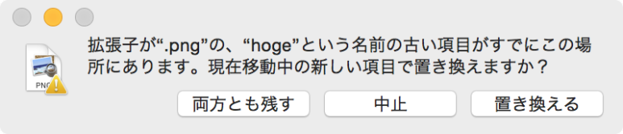


Unity에서도 이러한 다이얼로그를 표시하고 싶은데 Unity에는 이러한 파일 덮어쓰기 기능은 없습니다.같은 이름의 파일이 드래그 앤 드롭된 경우 파일 이름 끝에 숫자를 붙이고 다른 파일로 취급됩니다.

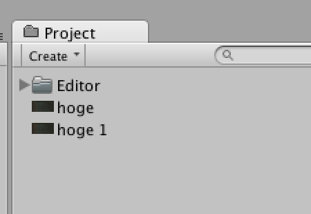

hoge 1.png로 별개 파일 취급 됩니다.


파일 덮어쓰기를 하고 싶은 경우는 Unity상이 아니라 Finder를 경유하여 덮어쓰기를 해야 합니다. 그러나 Finder상에서 조작하는 것은 에셋이 깨질지도 모르는 큰 위험을 안고 버립니다. Unity 에디터의 관리 밖에서 에셋의 변경을 하는 것은 권장하지 않고 있기 때문입니다.

# 1. Unity의 관리 밖에서 파일의 변경이 권장되지 않는 이유

이는 Unity에서 관리하는 데이터베이스와 실제 에셋의 정합성이 맞지 않게 되기 때문입니다. 

각 에셋에는 GUID가 할당되고 이를 key로서 데이터베이스를 관리하고 있습니다.이 GUID는 meta파일에 기술되어 있습니다.

```
fileFormatVersion: 2
guid: 4498d464658a84c7c8998b6b66709951
TextureImporter:
  fileIDToRecycleName: {}
  serializedVersion: 2
```
  
이 GUID가 변경되면 아래 그림과 같이 참조가 "Missing"상태가 됩니다.

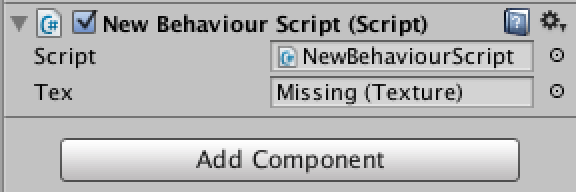

컴포넌트에서의 오브젝트 참조도 GUID로 하고 있습니다.
의도적으로 Missing을 발생시키려면 Finder상에서 대상 파일을 이동시켜야 합니다.

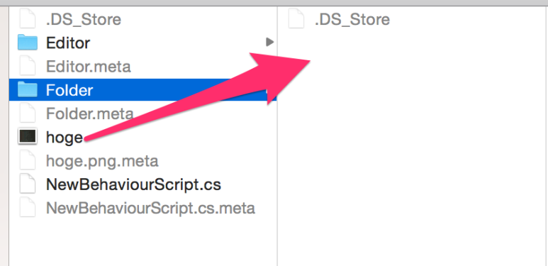


hoge.png을 Folder로 이동시킵니다.


이렇게 하면 Unity는 

- hoge.png가 삭제되었다
- hoge.png가 새로운 Folder 안에 Import되었다

라고 판단하고 같은 hoge.png여도 전혀 다른 파일로 취급됩니다. 

파일을 별개로 취급하지 않게 하려면. meta파일도 함께 이동시키면 되지만, Unity의 독특한 사양 때문에, meta파일을 함께 이동시키는 것을 잊어먹기 쉽습니다.(잊어먹은 채 Unity 에디터로 돌아간다면. meta파일이 자동으로 삭제/생성되어버립니다) 
파일 덮어쓰기 문제를 Unity상에서 해결한 것이 본 장에서 작성하는 Overwriter입니다. 


# 2. Overwriter 사용법

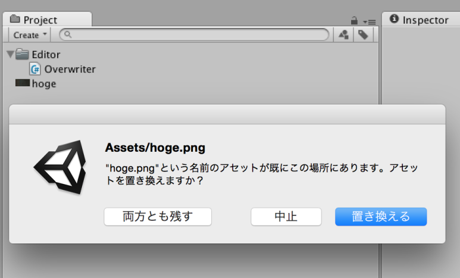


같은 이름의 에셋이 존재하면 대화 상자가 나옵니다.

설명할 필요도 없다고 생각합니다만, 에셋을 가져오겠다고 할 때 이미 같은 파일 이름이 존재했을 경우에 대화 상자가 표시됩니다. "대체한다"를 선택한 경우는 수정되고, "둘 다 남긴다"를 선택한 경우는 별도의 에셋으로 Import됩니다.

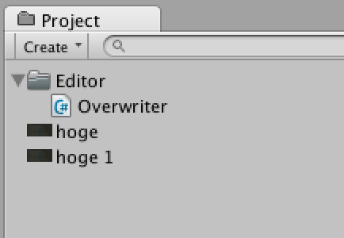


# 3. Overwriter의 생성 방법

이후는 Overwriter를 작성하기까지의 순서를 설명합니다. 


# 4. 파일의 Import 감시 
우선 에셋의 덮어쓰기 처리를 하기 위해서는, Unity 에디터에서 어떤 에셋을 가져오려 하고 있는지, 무엇이 Import 되었는지를 알아야 합니다. 에셋의 Import에 관한 처리는 AssetPostprocessor 클래스를 사용함으로써 구현할 수 있습니다.

```csharp
using UnityEditor;

public class Overwriter : AssetPostprocessor
{
    static void OnPostprocessAllAssets (
        string[] importedAssets,
        string[] deletedAssets,
        string[] movedAssets,
        string[] movedFromPath)
    {
        foreach (var assetPath in importedAssets) {
            //Import된 에넷을 감시
        }
    }
}
```

본장에서는 에셋을 덮어쓰는것을 목적으로 하고있습니다만, 처리적으로는 "별도의 에셋으로 Import한 뒤 대체하는" 처리가 됩니다. 이는 Unity의 사양과 관계되어 있는데, Import할 때 같은 계층에 같은 이름의 파일이 있는 경우에는 이미 Rename한 상태에서 가져오는기 때문입니다. 예컨대 hoge.png를 가져올 때에 이미 동명의 에셋이 있으면 hoge 1.png이 됩니다.


사양상, 같은 이름이 되지 않도록 수치가 붙습니다.

이런 사양을 받아서, Overwriter의 처리 순서는 다음과 같습니다. 

```
1. 우선 Import한다. 여기서 hoge.png이라는 에셋이 이미 있는 경우는 hoge 1.png이 된다. 

2. 별도의 에셋으로 Import되었을 때에 말미에 붙은 "<반각 스페이스><숫자>"가 존재하는 경우, 에셋을 덮어쓰고 싶은 것으로 판단한다. 

3. 덮어쓰기 여부의 다이얼로그를 내고 사용자의 확인이 되면 수정한다.
```

## 4.1. [DragAndDrop클래스에서 Rename 전의 패스를 받기]

같은 이름의 파일을 Import할 때 리네임된 상태에서  Import할 수 있습니다. 그렇지만, DragAndDrop.paths에는 Rename 전의 파일 경로가 저장되어 남아 있습니다.

```csharp
//hoge.png가 있는 상태에서 hoge.png을 Import
static void OnPostprocessAllAssets (
        string[] importedAssets,
        string[] deletedAssets,
        string[] movedAssets,
        string[] movedFromPath)
    {
        if (Event.current.type != EventType.DragPerform)
                return;

        //Rename 후의 hoge 1.png으로 Import 된 것을 확인
        var hoge1 = AssetDatabase.LoadAssetAtPath<Texture2D> ("Assets/hoge 1.png");
        Debug.Log (hoge1);

        //hoge.png의 경로가 저장되어 있는것을 확인
        foreach (var path in DragAndDrop.paths) {
            Debug.Log (path);
        }
    }
```

# 5. [드래그 했을 때만 처리를 수행하기]

Unity상에서 에셋의 Import를 했을 때에 다시 Import가 이뤄지기 때문에 구현한 OnPostprocessAllAssets가 호출되어 버립니다. 그러므로 마우스로 드래그 하여 가져올 때만 처리하도록 하겠습니다.

```csharp
static void OnPostprocessAllAssets (
    string[] importedAssets,
    string[] deletedAssets,
    string[] movedAssets,
    string[] movedFromPath)
{

    //스크립트 편집에 의한 Import인 경우 Event.current는 null이므로 null체크를 하기
    if (Event.current == null ||
        Event.current.type != EventType.DragPerform)
        return;

    foreach (var assetPath in importedAssets) {

    }
}
```

# 6. 대화상자(Dialog) 표시 

대화 상자의 표시에는 EditorUtility.DisplayDialogComplex를 사용합니다.

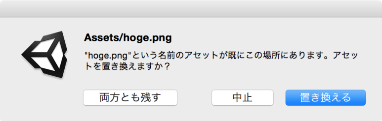

이번에는 "대체한다" "둘 다 남긴다" "중지" 의 3개 선택지가 필요하므로 DisplayDialogComplex입니다.

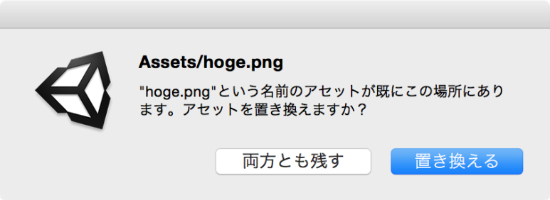

같은 기능으로서 EditorUtility.DisplayDialog가 있지만, 이쪽은 버튼이 2개로 됩니다. "네" "아니오"의 2개 선택지로 표현할 때만 사용합시다.

```csharp
var result = EditorUtility.DisplayDialogComplex (
    asset.originalAssetPath,
    overwriteMessage,
    "대체한다",    // 선택지의 반환값은 0
    "둘 다 남긴다",  //선택지의 반환값은 1
    "중지");        //선택지의 반환값은 2

if (result == 0) {
    asset.Overwrite ();
} else if (result == 2) {
    asset.Delete ();
}
```

# 7. 덮어쓰기 

AssetDatabase클래스에는 CopyAsset함수가 있지만, 덮어쓰기 하는 기능은 없습니다. 엄밀히 말하면 덮어쓸 수 있지만 Unity 데이터베이스에 오류가 생깁니다. 자세한 것은 "AssetDatabase.CopyAsset의 불량?"에서 소개합니다. 이번에는 에셋의 덮어쓰기에 FileUtil.ReplaceFile 함수를 사용합니다. 덮어쓰기 카피가 완료한 뒤 다른 에셋으로 Import 된 것은 AssetDatabase.DeleteAsset로 삭제합니다. 

중요:마지막으로 System.IO.File에 의해서 외부 데이터가 변경된 것을 Unity가 파악하게 하기 위해 AssetDatabase.ImportAsset를 실행합니다.

```csharp
public void Overwrite ()
{
    FileUtil.ReplaceFile (assetPath, originalAssetPath);
    Delete ();
    AssetDatabase.ImportAsset (originalAssetPath);
}

public void Delete ()
{
    AssetDatabase.DeleteAsset (assetPath);
}
```

## 7.1. [AssetDatabase.CopyAsset의 불량?]

에셋을 복사하고 복제하려면 이 함수를 사용합니다. 그렇지만 이 함수는 에셋의 덮어쓰기를 고려하지 않은 것으로 Unity측 데이터베이스에 오류가 생깁니다.

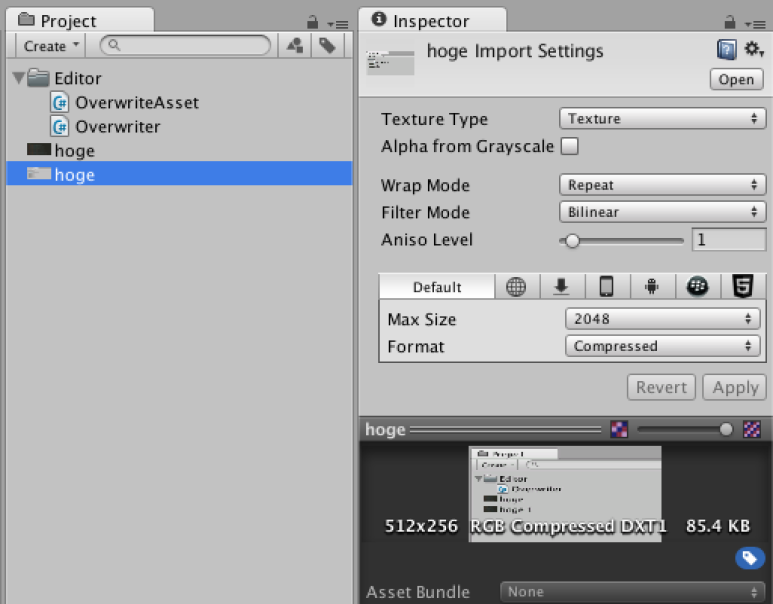


같은 이름의 hoge에셋이 2개 표시되고 있다. 이 그림에서는 올바른 인스팩터에 정보가 표시되고 있지만...

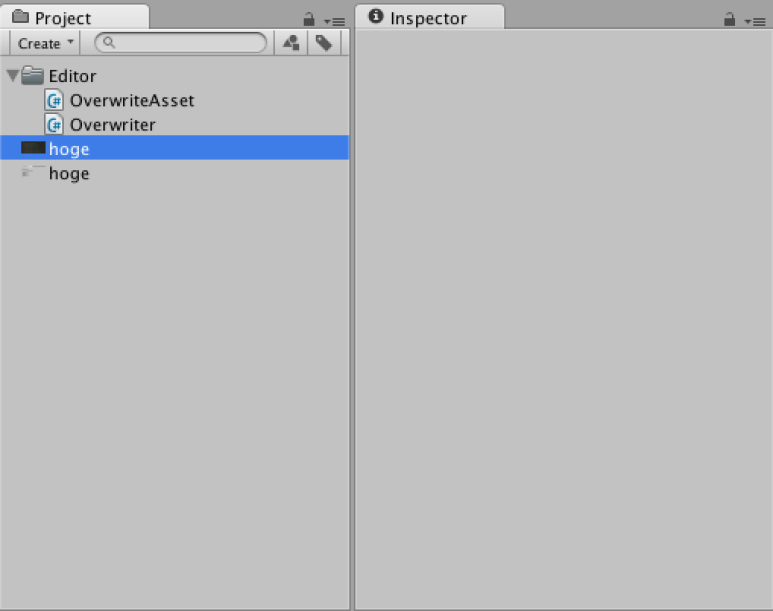


여기서는 인스펙터에서 정보가 표시되지 않는다

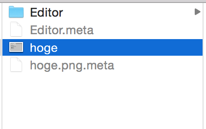


Finder에서 보면 한쪽의 이미지 밖에 없는 것을 알 수 있습니다.

이 오류를 원래대로 되돌리려면, ReImport All을 하고 Library에 있는 데이터베이스를 다시 생성해야 합니다.

```csharp
using System.IO;
using System.Text.RegularExpressions;
using UnityEditor;

public class OverwriteAsset
{
    public string originalAssetPath {
        get {
            return Path.Combine (directoryName, filename + "." + extension);
        }
    }

    public bool exists { get; private set; }

    public string filename { get; private set; }

    public string extension { get; private set; }

    private string directoryName;
    private string assetPath;
    const string pattern = "^(?<name>.*)\\s\\d+\\.(?<extension>.*)$";

    public OverwriteAsset (string assetPath)
    {
        this.assetPath = assetPath;
        directoryName = Path.GetDirectoryName (assetPath);
        var match = Regex.Match (Path.GetFileName (assetPath), pattern);

        exists = match.Success;

        if (exists) {
            filename = match.Groups ["name"].Value;
            extension = match.Groups ["extension"].Value;
        }
    }

    public void Overwrite ()
    {
        FileUtil.ReplaceFile (assetPath, originalAssetPath);
        Delete ();
        AssetDatabase.ImportAsset (originalAssetPath);
    }

    public void Delete ()
    {
        AssetDatabase.DeleteAsset (assetPath);
    }
}
```

```csharp
using UnityEditor;
using UnityEngine;

public class Overwriter : AssetPostprocessor
{

  const string message = "\"{0}.{1}\"라는 이름의 에셋이 이미 이 장소에 있습니다.에셋을 바꿉니까?";

  static void OnPostprocessAllAssets (
    string[] importedAssets,
    string[] deletedAssets,
    string[] movedAssets,
    string[] movedFromPath)
  {
    if (Event.current == null || Event.current.type != EventType.DragPerform)
      return;

    foreach (var assetPath in importedAssets) {

      var asset = new OverwriteAsset (assetPath);

      if (asset.exists) {

        var overwriteMessage =
                string.Format (message, asset.filename, asset.extension);

        var result = EditorUtility.DisplayDialogComplex (asset.originalAssetPath,
                                      overwriteMessage,
                                      "대체한다",
                                      "둘 다 남긴다",
                                      "중지");

        if (result == 0) {
          asset.Overwrite ();
        } else if (result == 2) {
          asset.Delete ();
        }

      }
    }
  }
}
```