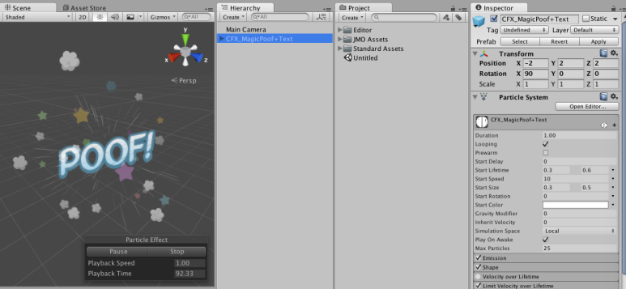
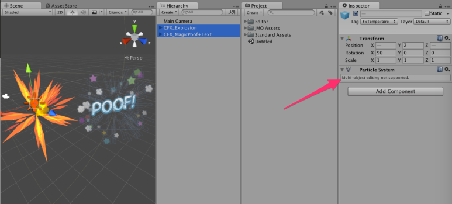
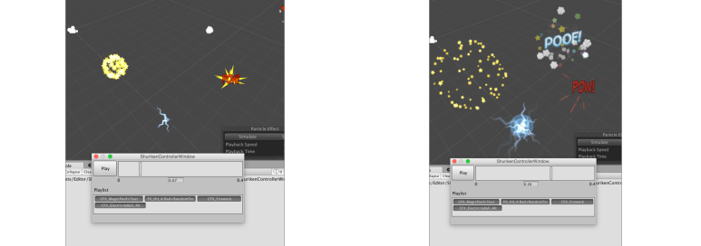
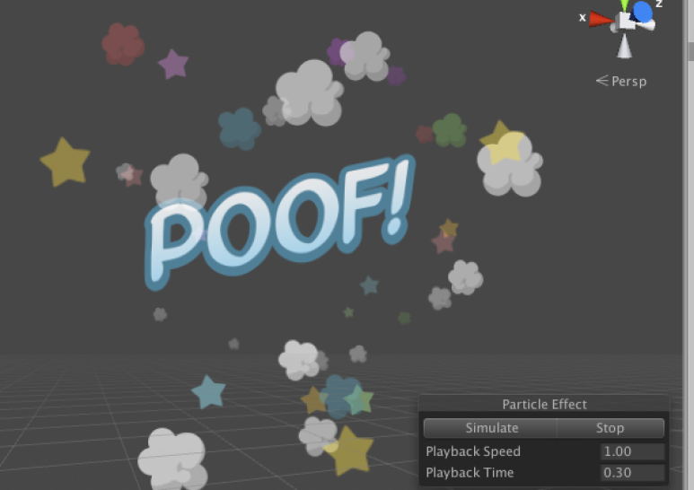
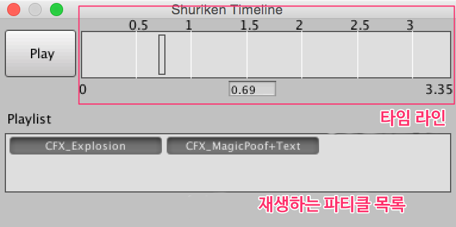
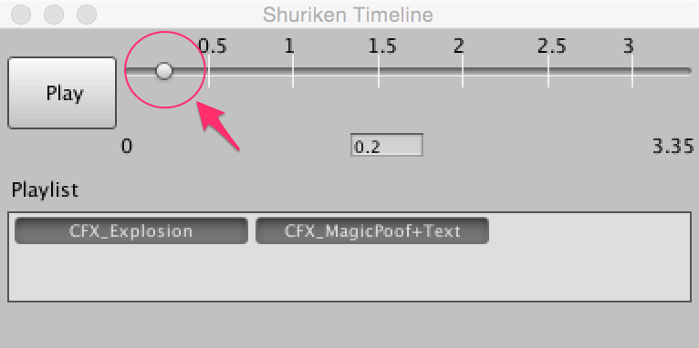
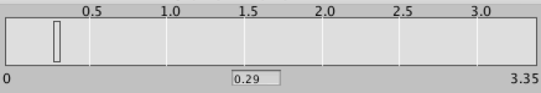

[에디터 확장 입문] 번역 21장 파티클을 제어하기

번역/유니티/유니티에디터확장입문


><주의>
원문의 작성 시기는 2016년경으로, 코드나 일부 설명이 최신 유니티 버젼과 다소 맞지 않을 수 있습니다.
원문 작성자 분 역시 2019년경에 내용에 다소 오류가 있다는 이유로 웹 공개 버젼을 비공개 처리하였습니다.
(2022.10.08 역자)

원문 링크 (2022.10.08 지금은 폐기)
http://anchan828.github.io/editor-manual/web/shuriken_controller.html

---
목록
- [1. 파티클 시스템의 제어](#1-파티클-시스템의-제어)
- [2. 다수 동시 편집을 하려면](#2-다수-동시-편집을-하려면)
  - [2.1. [파티클을 제어하는 Editor API는 존재하지 않는다]](#21-파티클을-제어하는-editor-api는-존재하지-않는다)
  - [2.2. [곤란할 때는 SerializedObject]](#22-곤란할-때는-serializedobject)
- [3. ParticleSystem을 SerializedObject로 만들기](#3-particlesystem을-serializedobject로-만들기)
- [4. ParticleSystem의 프로퍼티 이름을 알기](#4-particlesystem의-프로퍼티-이름을-알기)
  - [4.1. [Prefab을 작성하고 텍스트 에디터로 본다]](#41-prefab을-작성하고-텍스트-에디터로-본다)
  - [4.2. [SaveToSerializedFileAndForget을 사용]](#42-savetoserializedfileandforget을-사용)
  - [4.3. [SerializedObject.GetIterator를 사용]](#43-serializedobjectgetiterator를-사용)
  - [4.4. [편집한 값을 저장]](#44-편집한-값을-저장)
- [5. 타임 라인](#5-타임-라인)
- [6. 타임라인을 만들어 보자](#6-타임라인을-만들어-보자)
- [7. 씬 내의 ParticleSystem를 모두 얻어오기](#7-씬-내의-particlesystem를-모두-얻어오기)
- [8. ParticleSystem.Simulate에서 입자의 재생](#8-particlesystemsimulate에서-입자의-재생)
- [9. 부모의 ParticleSystem인지 아닌지를 판단하기](#9-부모의-particlesystem인지-아닌지를-판단하기)
- [10. 필요한 TimeControl](#10-필요한-timecontrol)
  - [10.1. [GUI을 만들기]](#101-gui을-만들기)
  - [10.2. [눈금을 매기기]](#102-눈금을-매기기)
  - [10.3. [화살표 키로 시간 이동]](#103-화살표-키로-시간-이동)
- [11. 재생 목록](#11-재생-목록)


# 1. 파티클 시스템의 제어 

평소 파티클 시스템을 다룰 때는 GameObject를 작성하고 선택해서 파티클의 재생이나 파라미터의 조정을 실시합니다.




하지만 다수를 동시 편집하는 기능은 없어서 귀찮은 일이 많이 있습니다.




인스펙터에서 "Multi-object editing not supported"라고 나오며 복수 동시 편집을 못하게 됩니다.

이펙트는 다양하지만 Duration(지속 시간)과 Start Lifetime(존속 시간)은 공통되고, 다수의 이펙트에 대해서 Color Over Lifetime을 써서 마지막에는 투명하게 사라지게 합니다. 


이미 여러 이펙트를 작성한 다음인데, 이들 파라미터를 모두 변경하지 않으면 안 되는 경우, 하나 하나 편집해야 합니다. 너무 수고가 많이 드는 작업이 되어 버립니다.

# 2. 다수 동시 편집을 하려면 

보통 상태로는 안 된다고 하면 에디터 확장을 사용하고 확장할 방법을 모색합니다. 

## 2.1. [파티클을 제어하는 Editor API는 존재하지 않는다]

안타깝게도 에디터 확장용 API는 준비되어 있지 않습니다. 런타임용 API을 구사하고 편집해야 합니다. 그래서 getter만의 프로퍼티라면 값을 설정할 수 없습니다. 


## 2.2. [곤란할 때는 SerializedObject]

본서에서는 몇번도 나오고 있지만 UnityEngine.Object인 것들은 모두 SerializedObject로 Serialize되고 있습니다. 이번에는 Serialize된 것을 직접 편집해서 파티클 시스템의 다수 동시 편집을 실시합니다. 


# 3. ParticleSystem을 SerializedObject로 만들기

SerializedObject로 변환하는 방법은 간단합니다. 우선은 확인을 위해 MenuItem에서 SerializedObject을 만들어 봅시다. 

다음 코드를 시험하면서 콘솔 창에 SerializedObject의 로그가 표시되는지 확인하세요.

```csharp
using UnityEngine;
using UnityEditor;
using System.Linq;
public class NewBehaviourScript
{
  [MenuItem ("Assets/Get SerializedObject")]
  static void GetSerializedObject ()
  {
    var particleSystems =
        Selection.gameObjects.Select (o => o.GetComponent<ParticleSystem> ());

    foreach (var particleSystem in particleSystems) {

      var so = new SerializedObject (particleSystem);
      Debug.Log (so);

    }
  }

  [MenuItem ("Assets/Get SerializedObject", true)]
  static bool GetSerializedObjectValidate ()
  {
    return Selection.gameObjects.Any (o => o.GetComponent<ParticleSystem> ());
  }
}
```

# 4. ParticleSystem의 프로퍼티 이름을 알기

SerializedObject를 취득했으므로 다음은 SerializedProperty를 가져옵니다. SerializedProperty를 취득하려면 프로퍼티 이름을 알아야 합니다. 


## 4.1. [Prefab을 작성하고 텍스트 에디터로 본다]

프로퍼티를 아는 가장 간단한 방법은 텍스트 베이스에 저장된 에셋을 텍스트 에디터로 보는 것입니다. ParticleSystem의 프로퍼티를 알고 싶은 경우는 ParticleSystem을 Attach한 게임 오브젝트를 프리펩으로 만듭니다. 

반드시 인스펙터에 표시되어 있는 프로퍼티 이름과 같은 것은 아니라는 것을 주의하세요. 다음은 프리펩의 YAML형식의 데이터입니다. 게다가, lengthInSec가 있지만, 이 프로퍼티는 duration을 가리키고 있습니다.

```
--- !u!198 &19810290
ParticleSystem:
  m_ObjectHideFlags: 1
  m_PrefabParentObject: {fileID: 0}
  m_PrefabInternal: {fileID: 100100000}
  m_GameObject: {fileID: 109222}
  lengthInSec: 5
  startDelay: 0
  speed: 1
  randomSeed: 0
  looping: 1
  prewarm: 0
  playOnAwake: 1
  moveWithTransform: 1
  ...
```

텍스트 에디터에서 직접 값을 바로잡아도 되지만 Unity의 관리 밖에서 변경하기 때문에, Unity를 실행한 채 텍스트 에디터에서 편집을 실시하면 데이터가 파손될 가능성이 있습니다. 꼭 텍스트 에디터에서 편집하고 싶다면 Unity를 끝내고 나서 하도록 하세요. 

## 4.2. [SaveToSerializedFileAndForget을 사용]

Prefab이나 에셋으로 만들 수 없는(에셋으로 만드는 방법이 제공되지 않는)것인 경우는 UnityEditorInternal에 있는 InternalEditorUtility.SaveToSerializedFileAndForget을 사용합니다. SaveToSerializedFileAndForget은 UnityEngine.Object를 Serialize를 해서 에셋으로서 저장하기 위한 API입니다.

```csharp
InternalEditorUtility.SaveToSerializedFileAndForget (
  new Object[]{ particleSystem },
  "particleSystem.txt",
  true);
```

위와 같이 API을 불러내면 프로젝트 폴더 아래에 particleSystem.txt가 생성된 YAML형식의 데이터를 볼 수 있습니다. 

## 4.3. [SerializedObject.GetIterator를 사용]

Iterator의 모든 SerializedProperty를 가져옵니다. Unity 상에서만으로 완결시키고 싶은 것이면 이 방법을 사용합니다. 그렇지만, 특정 프로퍼티 이름만을 파악하고자 하는 경우 이 방법으로는 수고가 많이 들어서 권장하지 않습니다.

```csharp
var so = new SerializedObject (particleSystem);

var prop = so.GetIterator ();

while (prop.NextVisible (true)) {
  Debug.Log (prop.propertyPath);
}
```

## 4.4. [편집한 값을 저장]

필요한 모든 정보가 모였으니, 나머지는 편집해서 값을 적용할 뿐입니다. GUI을 구현하면 설명이 길어지게 되니 이번에는 duration에 10을 하드 코딩으로 넣어 봅니다. 값을 대입하면 마지막에 반드시 ApplyModifiedProperties를 호출하고 갱신을 실시합니다.

```csharp
var so = new SerializedObject (particleSystem);

so.FindProperty ("lengthInSec").floatValue = 10;

so.ApplyModifiedProperties ();
```

# 5. 타임 라인




보통은 ParticleSystem 컴포넌트를 Attach한 게임 오브젝트를 선택함으로써 씬 뷰에서 파티클 애니메이션의 시뮬레이션을 실시할 수 있습니다.




하지만 이 기능은 여러 파티클 애니메이션에 대응하고 있지 않습니다.(자식 요소인 SubEmitter인 ParticleSystem은 재생됩니다)


그래서 애니메이션을 확인하려면 하나하나 확인하거나 다수를 동시에 확인하고 싶을 때는 게임을 재생시켜서 확인할 필요가 있습니다. 

이래서는, 작업 효율적으로도 좋지 않으므로 타임 라인을 만들어 봅시다.

# 6. 타임라인을 만들어 보자



본장에서 설명하기 위해서 작성한 것이므로 간소하지만 하고 싶은 것(다수의 파티클을 동시에 재생)은 구현되어 있습니다. 
이미지만으로는 알기 어렵다고 생각되므로 동영상을 준비했습니다.
https://www.youtube.com/watch?v=hZvEDxXgArg
이번에 작성한 타임 라인에서 다룬 방법이나 API등을 소개하겠습니다. 

# 7. 씬 내의 ParticleSystem를 모두 얻어오기

씬 내의 ParticleSystem은 FindObjectsOfType에서 얻어옵니다. 


# 8. ParticleSystem.Simulate에서 입자의 재생 

파티클 살리기는 Simulate함수로 실시하는 것이 가능합니다. Simulate함수에는 두번째 인자에 withChildren이 있고 자식 요소의 입자도 동시에 재생시켜 줍니다. 그래서 이전에 받은 모든 파티클로부터 자식 요소의 파티클을 뺍니다. 


# 9. 부모의 ParticleSystem인지 아닌지를 판단하기

판단 방법은 간단합니다.

```csharp
bool IsRoot (ParticleSystem ps)
{
  var parent = ps.transform.parent;
  //부모 없는 ParticleSystem이면 경로
  if (parent == null)
    return true;

  //부모가 있어도 ParticleSystem 컴포넌트가 아니면 루트
  return parent.GetComponent<ParticleSystem> () == false;
}
```

# 10. 필요한 TimeControl 

시간 제어의 기초가 되는 것은 25장 "시간을 제어하는 TimeControl"로 소개하고 있습니다. 계속 읽기 전에 25장을 한번 읽어보면 이해가 깊어질 것입니다. 

## 10.1. [GUI을 만들기]

타임 라인은 GUILayout.HorizontalSlider을 커스터마이즈한 것을 다룹니다. EditorGUILayout.Slider는 오른쪽에 FloatField가 붙어 있어서 필요 없으니 취급하지 않습니다. 

보통의 HorizontalSlider은 에디터 상에서 손잡이 부분이 작은 버튼으로 보입니다. 이것으로는 너무 작아서 다루기 어려울지도 모릅니다. 그래서 HorizontalSlider의 스타일에 맞춰서 외관을 크게 합니다.



배경을 박스로 하고, 또 손잡이 부분도 박스로 합니다. 이 때에 슬라이더의 높이를 변경하고, 스타일을 박스로 하면서 폭이 넓어지는 설정이 상실되었으므로, GUILayout.ExpandWidth를 설정합니다.

```csharp
GUILayout.HorizontalSlider(value, leftValue, rightValue,
"box","box", GUILayout.Height(40), GUILayout.ExpandWidth(true);
```
이로써 큰 슬라이더로, 손잡이 부분이 잡기 쉽도록 되었습니다. 


## 10.2. [눈금을 매기기]

간소한 것이지만 눈금을 달고 대략 어디쯤에 있는지 확인하게 합니다.

```csharp
var timeLength = timeControl.maxTime - timeControl.minTime; //시간 길이
var gridline = timeLength * 2; //0.5 눈금 간격
var sliderRect = new Rect(lastRect); //타임 라인 Slider의 Rect

for (int i = 1; i < gridline; i++) {

    var x = (sliderRect.width / gridline) * i;
    x += 4f - 1.5f * (i - 1);

    Handles.DrawLine (
    　　　　new Vector2 (sliderRect.x + x, sliderRect.y),
    　　　　new Vector2 (sliderRect.x + x, sliderRect.y + sliderRect.height));
    Handles.Label (
    　　　　new Vector2 (sliderRect.x + x - 10, sliderRect.y - 10),
    　　　　(timeLength / gridline * i).ToString ("0.0"));
}              
```

눈금(라인)은 Handles클래스를 사용해서 렌더링합니다. 또 Handles.Label이라는 라벨을 렌더링하는 API가 있으며 이를 사용하면 Vector2의 좌표로 라벨을 렌더링합니다. 이처럼 Handles는 평소 Scene뷰에 렌더링하기 위해서 준비된 것인데, EditorWindow, 인스펙터의 GUI 렌더링도 다룰 수 있습니다.




아래쪽에 있는 것은 별도로 탑재한 것. 가운데가 FloatField이기 때문에 값을 입력할 수 있다. 


## 10.3. [화살표 키로 시간 이동]

마지막으로 화살표 키로 시간을 조정할 수 있도록 하겠습니다.이번에는 0.01초 단위로 합니다.

```csharp
if (Event.current.type == EventType.KeyDown) {

    //재생중이면 일시정지합니다
    timeControl.Pause ();

    if (Event.current.keyCode == KeyCode.RightArrow)
      timeControl.currentTime += 0.01f;

    if (Event.current.keyCode == KeyCode.LeftArrow)
      timeControl.currentTime -= 0.01f;

    GUI.changed = true;
    Event.current.Use ();
    Repaint ();
}
```

시간이 변화하면서 GUI가 변화하기 때문에, GUI.changed를 true로 해서 통지합니다. 그럼으로써, EditorGUI.BeginChangeCheck에서 감시하고 있는 이벤트를 일으킬 수 있습니다. 


그리고 꼭 Event.current.Use()을 호출해주세요. 화살표 키로 시간 이동을 시키고 GUI을 갱신했기 때문에 이벤트를 1개 사용한 것이 됩니다. 이미 소비한 이벤트에서 그 후의 이벤트 처리를 실시한다고 하면 어떤 오류가 생기게 됩니다. 그래서 "이미 이벤트를 사용했다(Used). 그래서 향후의 이벤트 처리는 무시하도록 하게" 해야 합니다. 

# 11. 재생 목록

별로 설명할만 것도 아니지만, 재생 목록에는 각 파티클의 토글(외관은 버튼)이 있어 온/오프를 하는 것으로 재생 여부를 선택할 수 있습니다.

```csharp
playlist [key] = GUILayout.Toggle (
                     playlist [key], key.name,
                     EditorStyles.miniButton,
                     GUILayout.MaxWidth (position.width / 3));
```