[에디터 확장 입문] 번역 22장 SpriteAnimationPreview(스프라이트 목록을 표시)

번역/유니티/유니티에디터확장입문

><주의>
원문의 작성 시기는 2016년경으로, 코드나 일부 설명이 최신 유니티 버젼과 다소 맞지 않을 수 있습니다.
원문 작성자 분 역시 2019년경에 내용에 다소 오류가 있다는 이유로 웹 공개 버젼을 비공개 처리하였습니다.
(2022.10.08 역자)

원문 링크 (2022.10.08 지금은 폐기)

http://anchan828.github.io/editor-manual/web/spriteanimationpreview1.html

---
목차
- [1. 개요](#1-개요)
  - [1.1. [AnimationClip에 등록된 스프라이트의 확인 방법]](#11-animationclip에-등록된-스프라이트의-확인-방법)
  - [1.2. [Animation창에서 확인하기]](#12-animation창에서-확인하기)
  - [1.3. [AnimationClip를 인스펙터의 Debug모드에서 확인하기]](#13-animationclip를-인스펙터의-debug모드에서-확인하기)
  - [1.4. [좀 더 간편하게 스프라이트를 확인하는 방법을 확립하기]](#14-좀-더-간편하게-스프라이트를-확인하는-방법을-확립하기)
- [2. CustomPreview의 작성](#2-custompreview의-작성)
  - [2.1. [커스텀 프리뷰는 여러 개 가질 수 있습니다]](#21-커스텀-프리뷰는-여러-개-가질-수-있습니다)
  - [2.2. [프리뷰 표시]](#22-프리뷰-표시)
- [3. AnimationClip이 참조하고 있는 스프라이트를 얻어오기](#3-animationclip이-참조하고-있는-스프라이트를-얻어오기)
  - [3.1. [스프라이트는 ObjectReferenceKeyframe에서 관리되고 있다]](#31-스프라이트는-objectreferencekeyframe에서-관리되고-있다)
  - [3.2. [ObjectReferenceKeyframe과 Keyframe의 차이]](#32-objectreferencekeyframe과-keyframe의-차이)
  - [3.3. [ObjectReferenceKeyframe의 참고를 얻어오려면]](#33-objectreferencekeyframe의-참고를-얻어오려면)
  - [3.4. EditorCurveBinding](#34-editorcurvebinding)
  - [3.5. AnimationUtility.GetObjectReferenceCurve](#35-animationutilitygetobjectreferencecurve)
- [4. 스프라이트의 표시(첫번째)](#4-스프라이트의-표시첫번째)
- [5. 스프라이트의 표시(두번째)](#5-스프라이트의-표시두번째)
  - [5.1. [Initialize 함수]](#51-initialize-함수)
  - [5.2. [처음만 프리뷰 이미지가 표시되지 않는다]](#52-처음만-프리뷰-이미지가-표시되지-않는다)


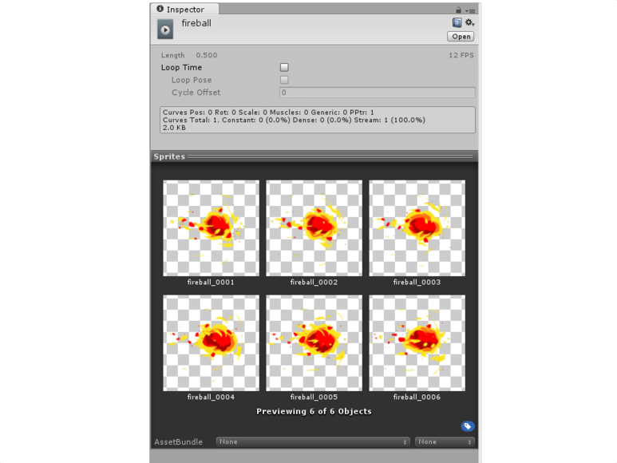


# 1. 개요 

스프라이트를 등록하고 있는 AnimationClip를 인스펙터의 미리 보기 화면에서 목록을 표시해 보겠습니다. 

## 1.1. [AnimationClip에 등록된 스프라이트의 확인 방법]

AnimationClip에 등록된 스프라이트의 확인 방법은 여러가지 있습니다. 

## 1.2. [Animation창에서 확인하기]

정규에서 할 수 있는 유일한 확인 방법입니다.

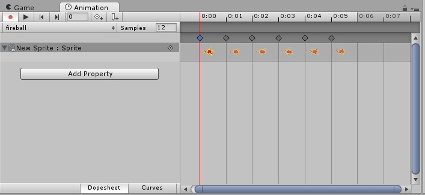


Window→ Animation에서 창을 표시할 수 있습니다.

하지만 이 방법으로는 애니메이션을 하는 게임 오브젝트를 선택하지 않으면 Animation윈도우는 확인할 수 없습니다. 


## 1.3. [AnimationClip를 인스펙터의 Debug모드에서 확인하기]

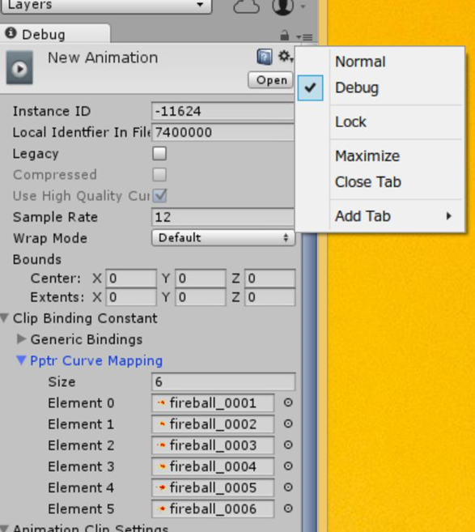


Inspector창 오른쪽 상단의 ≡ 버튼을 누르고 Debug을 선택하빈다.

그러면 Pptr Curve Mapping라는 프로퍼티에서 스프라이트를 참조하고 있는 배열을 확인할 수 있습니다. 이 스프라이트가 AnimationClip에서 사용되는 스프라이트입니다. 


## 1.4. [좀 더 간편하게 스프라이트를 확인하는 방법을 확립하기]

이번 장에서는 CustomPreview(커스텀 프리뷰)를 사용해서 인스펙터상에서 확인하도록 하겠습니다. 


# 2. CustomPreview의 작성 

커스텀 프리뷰를 작성하는 것은 간단합니다. 만드는 방법은, 커스텀 에디터를 작성하는 방법과 마찬가지로 ObjectPreview를 상속한 클래스를 작성하고 CustomPreview 속성을 부가합니다.

```csharp
[CustomPreview(typeof(AnimationClip))]
public class SpritePreview : ObjectPreview
{
}
```

다음으로, 인스팩터에 프리뷰를 추가하려면 HasPreviewGUI와 GetPreviewTitle을 설정할 필요가 있습니다.

```csharp
[CustomPreview(typeof(AnimationClip))]
public class SpritePreview : ObjectPreview
{
    private GUIContent previewTitle = new GUIContent("Sprites");

    public override bool HasPreviewGUI()
    {
        return true;
    }

    public override GUIContent GetPreviewTitle()
    {
        return previewTitle;
    }
}
```

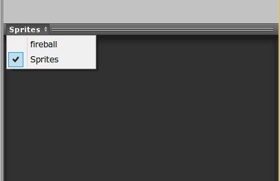


커스텀 프리뷰가 추가된 상태. 프리뷰 타이틀을 클릭함으로써 다른 프리뷰로 변경할 수 있습니다.

## 2.1. [커스텀 프리뷰는 여러 개 가질 수 있습니다]

커스텀 에디터와 달리 1개의 오브젝트에 대해서 다수의 프리뷰를 가질 수 있습니다. 

인스팩터에 표시되어 있는 에디터 오브젝트에는 반드시"디폴트 프리뷰"란 것이 존재합니다. 그것들에 포함되는 것으로서 커스텀 에디터는 구현됩니다. 그 상태가 "fireball"과 "Sprites"가 표시되고 있는 위의 그림입니다. 

그려보면 다음 사진처럼 됩니다.

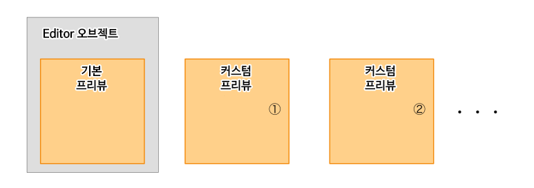


디폴트 프리뷰와 커스텀 프리뷰. 다수의 프리뷰를 가질 수 있습니다. 


## 2.2. [프리뷰 표시]

프리뷰를 실시하려면 OnPreviewGUI을 사용합니다. 시험삼아 다음 코드를 추가하고 프리뷰로 사용 가능한 범위를 살펴봅니다.

```csharp
public override void OnPreviewGUI(Rect r, GUIStyle background)
{
    GUI.Box(r, "表示領域");
}
```

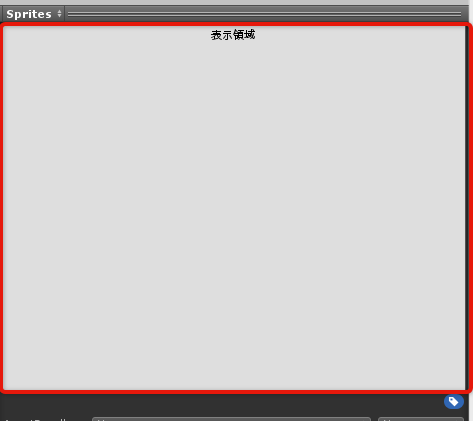


빨간 선으로 둘러싸인 부분이 사용 가능한 범위입니다.


자, 간단하긴 하지만, 커스텀 프리뷰의 기초가 되는 기능을 접할 수 있었습니다. 다음으로 AnimationClip에 등록된 스프라이트를 표시합니다. 


# 3. AnimationClip이 참조하고 있는 스프라이트를 얻어오기

우선은 스프라이트를 가져옵니다. 

## 3.1. [스프라이트는 ObjectReferenceKeyframe에서 관리되고 있다]

무엇을 애니메이션 시키느냐에 따라 사용하는 키 프레임이 바뀝니다. AnimationClip에는 ObjectReferenceKeyframe과 Keyframe의 2종류의 키 프레임이 있습니다. 평소 눈에 잘 띄는 것은 Keyframe의 Float형의 값을 유지하는 프레임입니다. 반면 ObjectReferenceKeyframe은 오브젝트의 참조를 유지하는 프레임입니다. 

## 3.2. [ObjectReferenceKeyframe과 Keyframe의 차이]

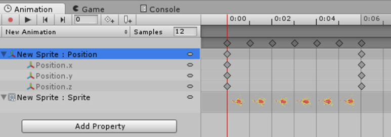

Position을 조작하는 것은 Keyframe, Sprite를 조작하는 것은 ObjectReferenceKeyframe입니다.

보유하는 값이 Float이나 참조냐의 차이는 있지만 나머지는 차이가 없습니다.


## 3.3. [ObjectReferenceKeyframe의 참고를 얻어오려면]

예를 들어 SpriteRenderer의 Sprite프로퍼티에서 "애니메이션 설정된 스프라이트 목록을 얻어오기" 위해서는 AnimationClip에 설정되어 있는 여러 애니메이션 커브의 프로퍼티에서 스프라이트를 애니메이션시키는 특정 프로퍼티를 얻지 않으면 안 됩니다. 그것을 위한 기능으로 EditorCurveBinding이 있습니다. 


## 3.4. EditorCurveBinding

EditorCurveBinding은 특정 애니메이션 커브를 얻어오기 위한 열쇠가 되는 것입니다. 예컨대 이번 장 같이 SpriteRenderer의 Sprite을 애니메이션하고 싶은 경우엔, 아래와 같이 됩니다.

```csharp
EditorCurveBinding.PPtrCurve("", typeof(SpriteRenderer), "m_Sprite");
```

이것은 루트의 게임 오브젝트에 Attach된 SpriteRenderer컴포넌트의 m_Sprite(Sprite)프로퍼티를 가리킵니다. 


## 3.5. AnimationUtility.GetObjectReferenceCurve

AnimationClip과 EditorCurveBinding을 사용하여 Sprite의 참조가 저장되어 있는 ObjectReferenceKeyframe을 취득하기 위해서 AnimationUtility.GetObjectReferenceCurve를 사용합니다.

```csharp
private Sprite[] GetSprites(AnimationClip animationClip)
{
  var sprites = new Sprite[0];

  if (animationClip != null)
  {
    var editorCurveBinding =
      EditorCurveBinding.PPtrCurve("", typeof(SpriteRenderer), "m_Sprite");

    var objectReferenceKeyframes =
      AnimationUtility.GetObjectReferenceCurve(animationClip, editorCurveBinding);

    sprites = objectReferenceKeyframes
       .Select(objectReferenceKeyframe => objectReferenceKeyframe.value)
       .OfType<Sprite>()
       .ToArray();
  }

  return sprites;
}
```

# 4. 스프라이트의 표시(첫번째)

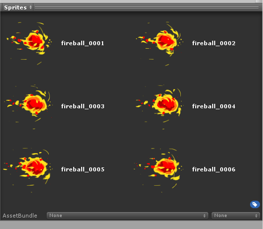

각 스프라이트와 스프라이트명이 표시되고 있습니다.

스프라이트를 표시합니다. 한정된 범위 안에서 다수의 스프라이트를 표시하려면 1개의 GUI요소에 사용할 수 있는 크기(Rect)를 요구해야 합니다. 그렇지만 그것은 귀찮으니 GUI.SelectionGrid를 사용합시다.

```csharp
public override void OnPreviewGUI(Rect r, GUIStyle background)
{
    var sprites = GetSprites(target as AnimationClip);

    var guiContents = sprites
       .Select(s => new GUIContent(s.name, AssetPreview.GetAssetPreview(s)))
       .ToArray();

    GUI.SelectionGrid(r, -1, guiContents, 2, EditorStyles.whiteBoldLabel);
}
```

GUI.SelectionGrid은 상당히 뛰어난 물건으로, 정해진 Rect값의 범위 내에서 균등하도록 GUIContent을 배치할 수 있습니다. 


# 5. 스프라이트의 표시(두번째)

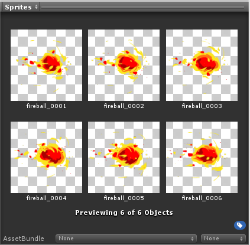

Unity표준의 표시 기능에서 스프라이트를 표시합니다. 


위 그림같은 표시 방식은 본 적이 있을지도 모릅니다. 이 표시는 스프라이트를 여러개 선택했을 때에 프리뷰로 표시되는 것과 거의 같은 것입니다.

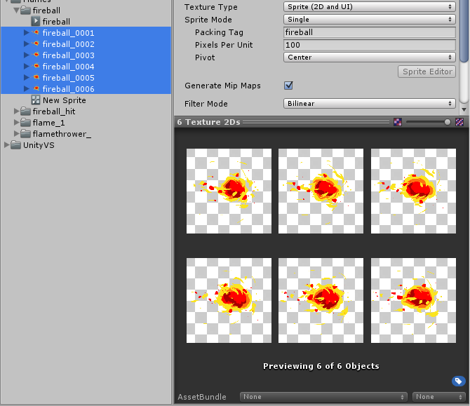

스프라이트를 여러개 선택한 상태입니다.

이번에는 AnimationClip을 선택했을 때 여러 스프라이트를 선택했다고 판단하는 것을 구현하겠습니다. 

## 5.1. [Initialize 함수]

CustomPreview클래스에는 초기화를 실시하는 Initialize 함수가 존재합니다.오버라이드가 가능하도록 조성되어 있으므로 조금 추가 작업을 합니다.

```csharp
public override void Initialize(Object[] targets)
{
    base.Initialize(targets);

    var sprites = new Object[0];

    foreach (AnimationClip animationClip in targets)
    {
        ArrayUtility.AddRange(ref sprites, GetSprites(animationClip));
    }

    m_Targets = sprites;
}
```

보통의 초기화를 실시한 다음 타깃이 되는 오브젝트를 바꿉니다. m_Targets가 프리뷰에서 다루는 UnityEngine.Object의 배열입니다. 

다음은 OnPreviewGUI을 구현할 뿐입니다. OnPreviewGUI는 m_Targets 요소의 수만큼 호출됩니다. OnPreviewGUI가 호출된 때의 m_Targets요소는 각각 target에 저장되고 당연히 취득할 r(Rect)는 프리뷰 범위 전체가 아닌 이미 계산된 1요소만큼 범위가 됩니다.

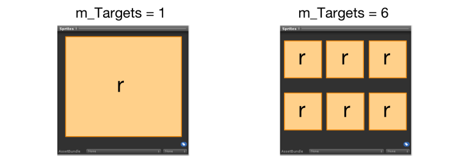

m_Targets에 요소가 1개일 때와 6개일 때의 인자 r로 얻을 수 있는 범위입니다.

다음으로 스프라이트를 렌더링합니다만, GUI 클래스에 스프라이트를 렌더링하는 기능은 존재하지 않습니다. 그래서 오브젝트에 대해서 프리뷰용의 텍스처를 생성하고 취득할 수 있는 AssetPreview.GetAssetPreview를 사용합니다.

```csharp
public override void OnPreviewGUI(Rect r, GUIStyle background)
{
    var previewTexture = AssetPreview.GetAssetPreview(target);
    EditorGUI.DrawTextureTransparent(r, previewTexture);
}
```

## 5.2. [처음만 프리뷰 이미지가 표시되지 않는다]

여기서 AssetPreview.GetAssetPreview의 특징을 알아봅시다. GetAssetPreview에서 작성하는 프리뷰 용의 텍스처는 캐시 되고 있습니다. 만약 오브젝트에 대한 텍스처가 캐시 되지 않은 경우(즉 처음)은 텍스처의 생성을 실시하기 위해서 GetAssetPreview는 null을 반환합니니다. null을 반환했을 때의 그 상태가 아래 그림입니다.

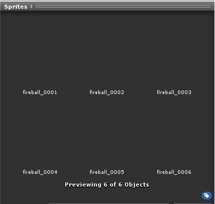


텍스처가 null이라 스프라이트 이름만 표시되고 있습니다.

본래라면 AssetPreview.IsLoadingAssetPreview를 사용하고 로드 중(생성 중)여부를 판단하며, 스킵 하는 구조를 구현해야 합니다.

```csharp
if (AssetPreview.IsLoadingAssetPreview (target.GetInstanceID ())) {
    var previewTexture = AssetPreview.GetAssetPreview (target);
    EditorGUI.DrawTextureTransparent (r, previewTexture);
}
```

하지만 이 문제를 회피하기에는 이미 1개 간단한 방법으로 회피할 수도 있습니다. 프리뷰 전에 프리뷰 용의 텍스처를 캐쉬하면 좋으니 적당한 곳에서 AssetPreview.GetAssetPreview를 실행합니다.

```csharp
public override void Initialize(Object[] targets)
{
    base.Initialize(targets);

    var sprites = new Object[0];

    foreach (AnimationClip animationClip in targets)
    {
        ArrayUtility.AddRange(ref sprites, GetSprites(animationClip));
    }

    // 여기서 스프라이트 프리뷰 용 텍스쳐를 생성/캐쉬한다
    foreach (var sprite in sprites)
    {
        AssetPreview.GetAssetPreview(sprite);
    }

    m_Targets = sprites;
}
```

이것으로 텍스처가 null이어서 프리뷰가 표시되지 않는는 문제는 해결됐습니다.

