[에디터 확장 입문] 번역 23장 SpriteAnimationPreview(스프라이트 애니메이션)

번역/유니티/유니티에디터확장입문

><주의>
원문의 작성 시기는 2016년경으로, 코드나 일부 설명이 최신 유니티 버젼과 다소 맞지 않을 수 있습니다.
원문 작성자 분 역시 2019년경에 내용에 다소 오류가 있다는 이유로 웹 공개 버젼을 비공개 처리하였습니다.
(2022.10.08 역자)

원문 링크 (2022.10.08 지금은 폐기)

http://anchan828.github.io/editor-manual/web/spriteanimationpreview2.html

---
목차
- [1. 기본 AnimationClip의 프리뷰](#1-기본-animationclip의-프리뷰)
- [2. 커스텀 에디터](#2-커스텀-에디터)
  - [2.1. [인스펙터의 표시는 기본 것을 쓰고 싶다]](#21-인스펙터의-표시는-기본-것을-쓰고-싶다)
  - [2.2. [Sprite 얻어오기]](#22-sprite-얻어오기)
  - [2.3. [스프라이트 애니메이션의 재생 버튼을 작성하기]](#23-스프라이트-애니메이션의-재생-버튼을-작성하기)
  - [2.4. [시간 관리"TimeControl"클래스를 작성하기]](#24-시간-관리timecontrol클래스를-작성하기)
  - [2.5. 재생하기](#25-재생하기)
  - [2.6. [재생하는 스프라이트를 얻어와 표시하기]](#26-재생하는-스프라이트를-얻어와-표시하기)
  - [2.7. [시간 속도를 조절하는 슬라이더를 작성하기]](#27-시간-속도를-조절하는-슬라이더를-작성하기)
  - [2.8. 완성](#28-완성)
- [3. 추가 기능을 추가하기](#3-추가-기능을-추가하기)
  - [3.1. [AssetPreview.GetAssetPreview의 텍스처는 사이즈가 작다]](#31-assetpreviewgetassetpreview의-텍스처는-사이즈가-작다)
  - [3.2. [Editor 오브젝트를 동적으로 작성]](#32-editor-오브젝트를-동적으로-작성)
  - [3.3. [프리뷰용 텍스처를 얻어오기]](#33-프리뷰용-텍스처를-얻어오기)
  - [3.4. [동적으로 작성한 오브젝트의 파기를 잊지 않기]](#34-동적으로-작성한-오브젝트의-파기를-잊지-않기)

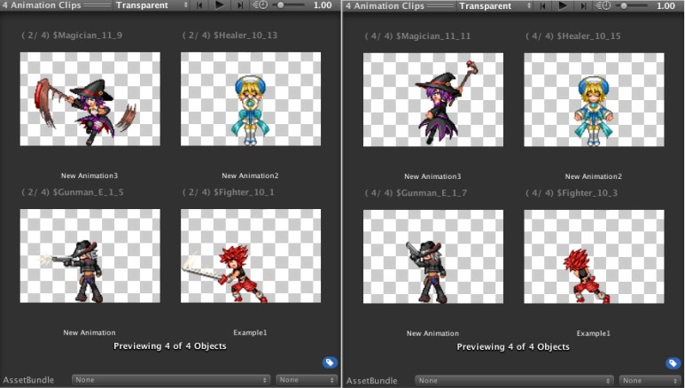


스프라이트를 재생하는 애니메이션 클립을 작성한 경우에, 인스펙터의 미리 보기 화면에서 스프라이트 애니메이션의 재생을 실시하는 시스템을 구현합니다. 


# 1. 기본 AnimationClip의 프리뷰

AnimationClip의 인스팩터는 3D모델을 위한 애니메이션을 기준으로 되어 있어서, 프리뷰 화면도 3D애니메이션밖에 재생 못하고 2D애니메이션에서는 사용할 수 없습니다.

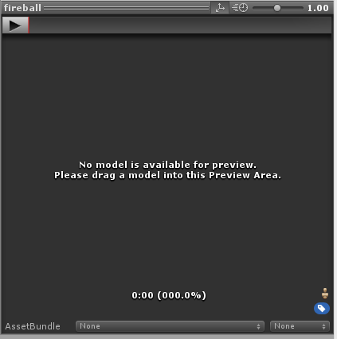


3D애니메이션의 프리뷰가 기본입니다.

인스펙터를 커스터마이즈 하여, 2D애니메이션에도 대응할 수 있도록 할 것입니다. 


# 2. 커스텀 에디터 

기존의 AnimationClip의 커스텀 에디터, AnimationClipEditor를 오버라이드 하는 형태로 새로 커스텀 에디터를 작성합니다. 이번에 작성하는 커스텀 에디터의 이름은 SpriteAnimationClipEditor으로 합니다. 

우선은 다음과 같은 클래스를 작성합니다. 여러개 선택했을 경우에서도 작동하도록 CanEditMultipleObjects 속성을 씁시다.

```csharp
using UnityEngine;
using UnityEditor;

[CustomEditor(typeof(AnimationClip), CanEditMultipleObjects)]
public class SpriteAnimationClipEditor : Editor
{

}
```

그러면 인스팩터의 표시가 아래 그림과 같아집니다.

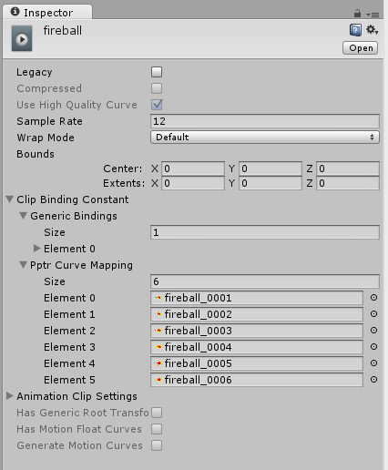

인스펙터로 표시할 수 있는 모든 것이 표시된 상태입니다.


이는 이미 Unity측의 AnimationClipEditor에서 구현된 OnInspectorGUI 함수가 적용되지 않기 때문입니다. 커스터마이즈 되지 않은 본연의 상태로 표시됩니다. 


## 2.1. [인스펙터의 표시는 기본 것을 쓰고 싶다]

이번에는 프리뷰 화면만을 변경하고 싶은거지, OnInspectorGUI의 부분이 변경되는 걸 바라는게 아닙니다. 그래서, 함수를 오버 라이드 하지 않는 한 바탕이 되는 Editor 오브젝트(커스텀 에디터에서 사용하는 것)를 사용하기 위한 OverrideEditor클래스를 만들어 봅시다.

```csharp
public abstract class OverrideEditor : Editor
{
    readonly static BindingFlags flags =
        BindingFlags.NonPublic | BindingFlags.Instance;

    readonly MethodInfo methodInfo =
        typeof(Editor).GetMethod("OnHeaderGUI", flags);

    private Editor m_BaseEditor;
    protected Editor baseEditor
    {
        get { return m_BaseEditor ?? (m_BaseEditor = GetBaseEditor()); }
        set { m_BaseEditor = value; }
    }

    protected abstract Editor GetBaseEditor();


    public override void OnInspectorGUI()
    {
        baseEditor.OnInspectorGUI();
    }

    // ...이하 GetInfoString, OnPreviewSettings와 같은 커스텀 에디터에서 사용할 수 있는 함수들을 열거한다
    // 다만 DrawPreview, OnPreviewGUI, OnInteractivePreviewGUI을 모두 오버 라이드 하면 작동 내용이 변경되어 버리므로 주의
}
```

방금 작성한 SpriteAnimationClipEditor 상속 클래스를 Editor에서 OverrideEditor로 변경합니다.

```csharp
[CustomEditor(typeof(AnimationClip)), CanEditMultipleObjects]
public class SpriteAnimationClipEditor : OverrideEditor
{
    protected override Editor GetBaseEditor()
    {
        Editor editor = null;
        var baseType = Types.GetType("UnityEditor.AnimationClipEditor", "UnityEditor.dll");
        CreateCachedEditor(targets, baseType, ref editor);
        return editor;
    }
}
```

이렇게 하면 이전에 쓰던대로 표시됩니다.

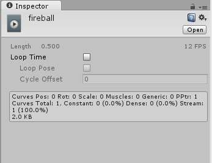


## 2.2. [Sprite 얻어오기]

제22장의 "22.3 AnimationClip이 참조하고 있는 스프라이트를 얻어오기"와 같은 구현으로 스프라이트를 가져옵니다.

```csharp
private Sprite[] GetSprites(AnimationClip animationClip)
{
    var sprites = new Sprite[0];

    if (animationClip != null)
    {
        var editorCurveBinding = EditorCurveBinding.PPtrCurve("", typeof(SpriteRenderer), "m_Sprite");

        var objectReferenceKeyframes = AnimationUtility.GetObjectReferenceCurve(animationClip, editorCurveBinding);

        var _sprites = objectReferenceKeyframes
            .Select(objectReferenceKeyframe => objectReferenceKeyframe.value)
            .OfType<Sprite>();

        foreach (var sprite in _sprites)
        {
            AssetPreview.GetAssetPreview(sprite);
        }
        sprites = _sprites.ToArray();
    }
    return sprites;
}
```
이 취득한 스프라이트를 애니메이션 재생 버튼을 누르는 것으로, 프리뷰 화면에서 스프라이트 애니메이션을 하도록 합니다. 

우선 1개의 스프라이트를 미리 보기 화면에 표시해 봅시다.

```csharp
public override bool HasPreviewGUI()
{
                return true;
}

public override void OnInteractivePreviewGUI(Rect r, GUIStyle background)
{
                //스프라이트가 없으면 통상(3D)의 프리뷰 화면으로 채웁니다
                if (sprites.Length != 0)
                {
                                var texture = AssetPreview.GetAssetPreview(sprites[0]);
                                EditorGUI.DrawTextureTransparent(r, texture, ScaleMode.ScaleToFit);
                }
                else
                                baseEditor.OnInteractivePreviewGUI(r, background);
}
```

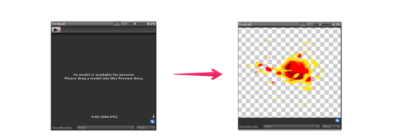

스프라이트가 표시되고 있습니다.


## 2.3. [스프라이트 애니메이션의 재생 버튼을 작성하기]

3D때처럼 프리뷰 렌더링 화면 안에 재생 버튼을 작성하면 보기엔 좋아질 것 같습니다만, 이번에는 OnPreviewSettings안에 재생 버튼을 작성합니다.

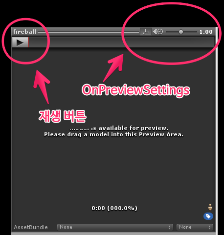

오른쪽 위의 부분이 OnPreviewSettings에서 구현할 수 있는 부분입니다.


OnPreviewSettings에서는 GUILayout을 사용할 수 있습니다. 빨리 재생 버튼을 표시해 봅시다. 재생 버튼은 재생(ss07)과 일시 정지(ss08)와 같은 " 온/오프"상태가 존재하므로 GUILayout.Button이 아니라 GUILayout.Toggle을 사용합니다.

```csharp
private bool isPlaying = false;

public override void OnPreviewSettings()
{
                var playButtonContent = EditorGUIUtility.IconContent("PlayButton");
                var pauseButtonContent = EditorGUIUtility.IconContent("PauseButton");
                var previewButtonSettingsStyle = new GUIStyle("preButton");
                var buttonContent = isPlaying ? pauseButtonContent : playButtonContent;
                isPlaying = GUILayout.Toggle(isPlaying, buttonContent, previewButtonSettingsStyle);
}
```

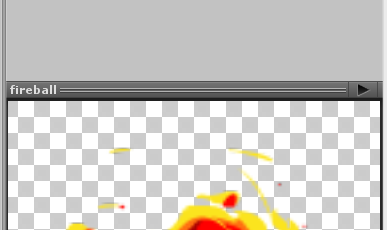

오른쪽 끝에 재생 버튼이 생겼습니다.

다음은 시간 관리"TimeControl"클래스를 작성합니다. 


## 2.4. [시간 관리"TimeControl"클래스를 작성하기]

이번의 용도에 맞는 시간을 관리하는 클래스를 작성합니다. 시간의 갱신 처리는 EditorApplication.update를 사용하여 이루어집니다.

```csharp
public class TimeControl
{
    public bool isPlaying { get; private set; }
    private float currentTime { get; set; }
    private double lastFrameEditorTime { get; set; }
    public float speed { get; set; }

    public TimeControl()
    {
        speed = 1;
        EditorApplication.update += Update;
    }

    public void Update()
    {
        if (isPlaying)
        {
            var timeSinceStartup = EditorApplication.timeSinceStartup;
            var deltaTime = timeSinceStartup - lastFrameEditorTime;
            lastFrameEditorTime = timeSinceStartup;
            currentTime += (float)deltaTime * speed;
        }
    }

    public float GetCurrentTime(float stopTime)
    {
        return Mathf.Repeat(currentTime, stopTime);
    }

    public void Play()
    {
        isPlaying = true;
        lastFrameEditorTime = EditorApplication.timeSinceStartup;
    }

    public void Pause()
    {
        isPlaying = false;
    }
}
```

## 2.5. 재생하기
TimeControl을 사용해서 재생을 하기 위한 트리거는 다음과 같이 구현합니다.

```csharp
private void DrawPlayButton()
{
                var playButtonContent = EditorGUIUtility.IconContent("PlayButton");
                var pauseButtonContent = EditorGUIUtility.IconContent("PauseButton");
                var previewButtonSettingsStyle = new GUIStyle("preButton");
                var buttonContent = timeControl.isPlaying ? pauseButtonContent : playButtonContent;

                EditorGUI.BeginChangeCheck();

                var isPlaying =
                                GUILayout.Toggle(timeControl.isPlaying,
                                                                                                                buttonContent, previewButtonSettingsStyle);

                if (EditorGUI.EndChangeCheck())
                {
                                if (isPlaying) timeControl.Play();
                                else timeControl.Pause();
                }
}
```

## 2.6. [재생하는 스프라이트를 얻어와 표시하기]

현재 어느 스프라이트를 재생할 것인가는 AnimationClip의 frameRate(프레임 레이트)와 AnimationClipSettings에 있는 stopTime을 사용합니다.

```csharp
var currentSpriteNum = Mathf.FloorToInt(timeControl.GetCurrentTime(settings.stopTime) * settings.frameRate);
```

Sprite의 유지 방법 등은 생략하지만, 실제로 사용하면 다음과 같습니다.

```csharp
public override void OnInteractivePreviewGUI(Rect r, GUIStyle background)
{
                SpriteAnimationSettings settings;

                if (dic.TryGetValue(target, out settings))
                {
                                var currentSpriteNum =
                                                Mathf.FloorToInt(timeControl.GetCurrentTime(settings.stopTime)
                                                                                                                                                                                                                                                        * settings.frameRate);
                                var sprite = settings.sprites[currentSpriteNum];
                                var texture = AssetPreview.GetAssetPreview(sprite);

                                if (texture != null)
                                                EditorGUI.DrawTextureTransparent(r, texture, ScaleMode.ScaleToFit);
                }
                else
                                baseEditor.OnInteractivePreviewGUI(r, background);
}
```

## 2.7. [시간 속도를 조절하는 슬라이더를 작성하기]

재생 버튼과 같은 곳에 시간을 n배속시키는 슬라이더를 작성합니다.

```csharp
private void DrawSpeedSlider()
{
                var preSlider = new GUIStyle("preSlider");
                var preSliderThumb = new GUIStyle("preSliderThumb");
                var preLabel = new GUIStyle("preLabel");
                var speedScale = EditorGUIUtility.IconContent("SpeedScale");

                GUILayout.Box(speedScale, preLabel);
                timeControl.speed =
                                GUILayout.HorizontalSlider(timeControl.speed, 0, 10, preSlider, preSliderThumb);
                GUILayout.Label(timeControl.speed.ToString("0.00"), preLabel, GUILayout.Width(40));
}
```

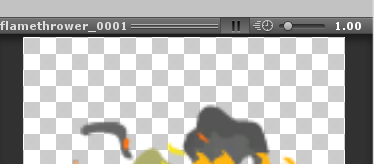

재생 단추 옆에 슬라이더가 추가됩니다.

## 2.8. 완성

프리뷰 화면에서 스프라이트 애니메이션의 재생을 확인할 수 있게 되었습니다.

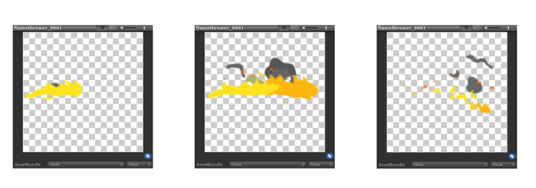

재생 버튼을 누르면 스프라이트 애니메이션이 재생됩니다.
CanEditMultipleObjects를 구현하면 여러개의 스프라이트 애니메이션을 동시에 재생 가능합니다.

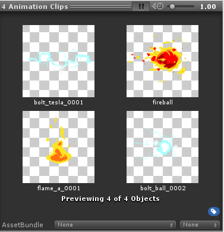


# 3. 추가 기능을 추가하기

더 개량한 것을 Sprite Animation Preview 로 에셋 스토어에서 배포하고 있습니다. 배포할 수준까지 가는 정밀한 구현에 대해서 설명합니다.

https://www.assetstore.unity3d.com/jp/#!/content/37611


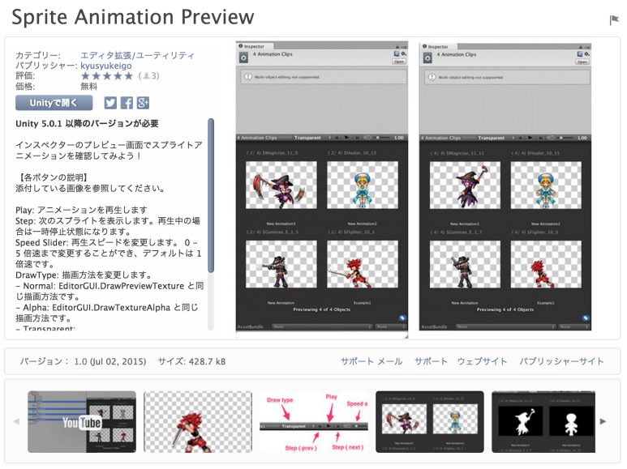


## 3.1. [AssetPreview.GetAssetPreview의 텍스처는 사이즈가 작다]

원래 AssetPreview.GetAssetPreview는 프로젝트 뷰 등으로 표시하기 위한 기능입니다. 프로젝트 뷰에서는 그렇게 고해상도인 텍스처 사이즈는 필요로 하지 않습니다. 그래서 강제로 128x128로 리사이즈합니다. 


"Sprite Animation Preview"에서는, 품질 면에서 프리뷰 표시에 AssetPreview.GetAssetPreview를 사용하지 않고 SpriteEditor에서 직접 프리뷰 이미지를 얻어오도록 했습니다. 

## 3.2. [Editor 오브젝트를 동적으로 작성]

Editor 오브젝트는 임의의 시점에서 사용자가 작성할 수 있습니다. 

Unity표준으로 사용되는 Sprite 오브젝트를 위한 SpriteInspector를 작성합니다.

```csharp
private List<Editor> GetSpriteEditors(params Sprite[] sprites)
{
    var type = Types.GetType("UnityEditor.SpriteInspector", "UnityEditor.dll");
    var editors = new List<Editor>();

        foreach (var sprite in sprites)
    {
                Editor _editor = Editor.CreateEditor(sprite, type);

        if (_editor != null)
            editors.Add(_editor);
    }

    return editors;
}
```

## 3.3. [프리뷰용 텍스처를 얻어오기]

프리뷰의 텍스처는 RenderStaticPreview에서 얻어올 수 있습니다.

```csharp
var editor = spriteEditors[i];
var previewTexture = editor.RenderStaticPreview("", null,
                        (int)previewRect.width,
                        (int)previewRect.height);
```

## 3.4. [동적으로 작성한 오브젝트의 파기를 잊지 않기]

반드시 작성한 Editor 오브젝트를 파기하는 코드를 구현하도록 하세요. 파기하는 타이밍은 OnDisable등 오브젝트가 필요 없게 된 타이밍에 호출합니다.

```csharp
public void OnDisable()
{
    foreach (var spriteEditor in spriteEditors)
    {
        Object.DestroyImmediate(spriteEditor);
    }
}
```

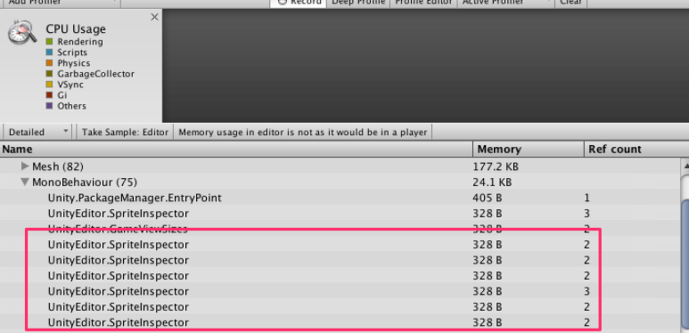


파기하지 않으면 작성한 Editor 오브젝트가 계속 남는 메모리를 압박합니다.
또 프리뷰에서 사용한 텍스처도 파기하도록 하겠습니다.

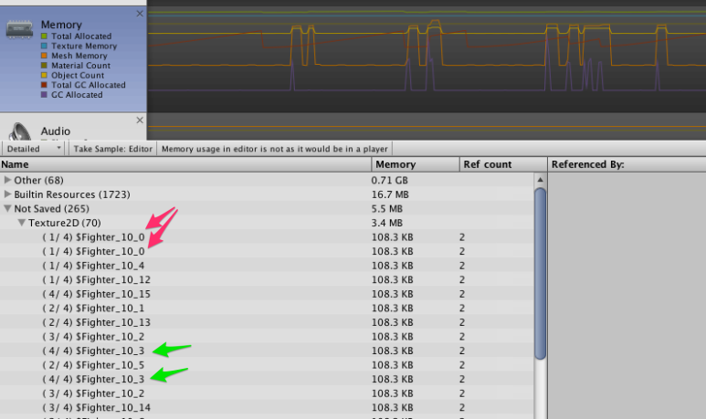


텍스처가 계속 남는 메모리를 압박하기 때문입니다.