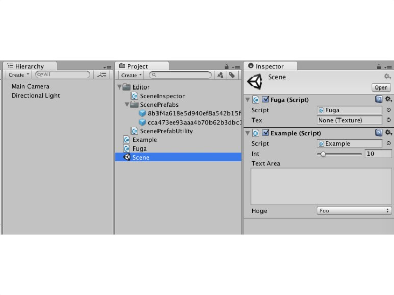
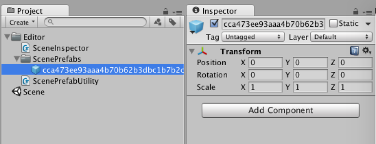

[에디터 확장 입문] 번역 24장 씬 에셋에 스크립트를 Attach

번역/유니티/유니티에디터확장입문

><주의>
원문의 작성 시기는 2016년경으로, 코드나 일부 설명이 최신 유니티 버젼과 다소 맞지 않을 수 있습니다.
원문 작성자 분 역시 2019년경에 내용에 다소 오류가 있다는 이유로 웹 공개 버젼을 비공개 처리하였습니다.
(2022.10.08 역자)

원문 링크 (2022.10.08 지금은 폐기)
http://anchan828.github.io/editor-manual/web/attach_script_to_scene.html

---

목차
- [1. GlobalManager 같은 게임 오브젝트](#1-globalmanager-같은-게임-오브젝트)
- [2. 씬 에셋의 커스텀 에디터](#2-씬-에셋의-커스텀-에디터)
  - [2.1. [SceneAsset의 커스텀 에디터]](#21-sceneasset의-커스텀-에디터)
- [3. 씬 에셋에 Attach한 컴포넌트를 어디에 유지할 것인가](#3-씬-에셋에-attach한-컴포넌트를-어디에-유지할-것인가)
  - [3.1. [씬 에셋에 대응한 프리펩을 생성한다]](#31-씬-에셋에-대응한-프리펩을-생성한다)
- [4. 컨테이너 컴포넌트를 씬 에셋의 인스팩터에 표시](#4-컨테이너-컴포넌트를-씬-에셋의-인스팩터에-표시)
  - [4.1. [Editor 오브젝트의 생성]](#41-editor-오브젝트의-생성)
- [5. 컴포넌트를 인스펙터에 드래그 앤 드롭](#5-컴포넌트를-인스펙터에-드래그-앤-드롭)
- [6. 씬 재생 시 / 빌드 시에 자동적으로 프리펩을 인스턴스화](#6-씬-재생-시--빌드-시에-자동적으로-프리펩을-인스턴스화)





일의 발단은 "빈 게임 오브젝트에 스크립트를 Attach 할 바에야, 씬 파일에 스크립트를 Attach하고 싶다"라고 하는 트윗을 봤기 때문입니다. 재밌다고 생각해서 만들어 보았습니다.


# 1. GlobalManager 같은 게임 오브젝트

전체를 관리하기 위한 관리 클래스 등을 빈 오브젝트에 Attach하지 않습니까?


저도 자주 하는 Manager클래스입니다.

이런 관리 클래스는 때론 필요 불가결한 것입니다. 

[만약 씬에 스크립트를 Attach하면?]

만약 씬 파일에 스크립트를 Attach할 수 있다면 관리 클래스를 위해 게임 오브젝트를 작성할 필요가 없어집니다. 그 이외에는 특별히 큰 변화는 없지만 "어쩌면" 이쪽이 관리 클래스를 연상하기 편해져서, 실수도 줄어들지도 모릅니다.


빈 게임 오브젝트를 생성하지 않고 스크립트를 Attach할 수 있습니다! 

이번 장에서는, 씬 에셋에 스크립트를 Attach할 때까지 사용한 기술을 해설합니다. 

# 2. 씬 에셋의 커스텀 에디터 

우선 씬 파일의 인스팩터를 커스터마이즈 할 수 있도록 해야 합니다. 그렇지만, Scene클래스라는 것은 존재하지 않으므로 조금 연구가 필요합니다. 

## 2.1. [SceneAsset의 커스텀 에디터]

우선은 씬 에셋인 SceneAsset클래스의 커스텀 에디터를 작성합니다.


씬 에셋을 선택하면 인스팩터에 라벨이 표시됩니다.


한가지 조심해야할 것은, 씬 에셋의 인스팩터는 GUI.enabled=false이며, GUI을 조작하는 것이 불가능하게 되어 있습니다. 강제적으로 true를 설정해 줘야 합니다.

```csharp
[CustomEditor (typeof(SceneAsset))]
public class SceneInspector : Editor
{
    public override void OnInspectorGUI ()
    {
        GUI.enabled = true;

        EditorGUILayout.LabelField ("씬 에셋의 인스펙터!");
    }
}
```

# 3. 씬 에셋에 Attach한 컴포넌트를 어디에 유지할 것인가 

보통 씬 에셋에 컴포넌트를 Attach할 수는 없습니다.  또, 에디터 확장으로 씬 에셋에 컴포넌트 정보를 추가할 수도 없어요. 


그래서 이번에는 외관만 씬 에셋에 컴포넌트가 Attach 할 수 있는 구조를 구현합니다. 

## 3.1. [씬 에셋에 대응한 프리펩을 생성한다]

씬에 Attach하는 기능은 자동 생성된 프리펩에 유지합니다. 

특정 폴더(다른 사용자가 만지지 않는 Editor폴더 이하가 바람직하다) 아래에 프리펩을 작성합니다. 이 때 컨테이너 이름을 씬 에셋과 관련된 것으로 합니다만, 씬 이름(패스도 마찬가지)은 같은 이름인 것이 존재할 가능성이 있으므로 guid로 관리합니다. 

우선은 이를 위한 유틸리티 클래스를 작성합니다.

```csharp
using UnityEngine;
using UnityEditor;
using System.IO;

public class ScenePrefabUtility
{
    const string PREFAB_FOLDER_PATH = "Assets/Editor/ScenePrefabs";

    [InitializeOnLoadMethod]
    static void CreatePrefabFolder ()
    {
        Directory.CreateDirectory (PREFAB_FOLDER_PATH);
    }

    public static GameObject CreateScenePrefab (string scenePath,
                                        params System.Type[] components)
    {
        var guid = ScenePathToGUID (scenePath);

        //HideFlags는 컴파일 오류 등 예상 밖의 에러로 중단된 때의 대책으로서
        //비표시 & 저장금지
        var go = EditorUtility.CreateGameObjectWithHideFlags (guid,
                                     HideFlags.HideAndDontSave, components);

        var prefabPath = string.Format ("{0}/{1}.prefab", PREFAB_FOLDER_PATH, guid);

        var prefab = PrefabUtility.CreatePrefab (prefabPath, go);

        // 프리팹 생성을 위해서 작성한 게임 오브젝트는 파기
        Object.DestroyImmediate (go);

        return prefab;
    }

    // 컨테이너 이름을 씬 에셋 guid로 한다
    public static GameObject GetScenePrefab (string scenePath)
    {
        // 씬 이름이라면 같은 이름이 존재할 가능성이 있으므로 guid로 합니다
        var guid = ScenePathToGUID (scenePath);
        var prefabPath = string.Format ("{0}/{1}.prefab", PREFAB_FOLDER_PATH, guid);
        return AssetDatabase.LoadAssetAtPath<GameObject> (prefabPath);
    }

    private static string ScenePathToGUID (string scenePath)
    {
        return AssetDatabase.AssetPathToGUID (scenePath);
    }
}
```

위 코드를 사용해서 인스펙터를 표시할 때에 프리펩을 얻어오거나 또는 생성합니다. 프리펩에 접속하는 타이밍은 인스펙터가 표시될 때, 즉 SceneInspector의 오브젝트가 생성될 때 OnEnable로 실시합니다.

```csharp
using UnityEngine;
using UnityEditor;
using System.IO;

[CustomEditor (typeof(SceneAsset))]
public class SceneInspector : Editor
{
    GameObject scenePrefab;

    void OnEnable ()
    {
        var assetPath = AssetDatabase.GetAssetPath (target);

        //프리펩 얻어오기
        scenePrefab = ScenePrefabUtility.GetScenePrefab (assetPath);

        //없으면 생성
        if (scenePrefab == null)
            scenePrefab = ScenePrefabUtility.CreateScenePrefab (assetPath);

    }
}
```

이로써 씬 에셋을 선택함과 동시에 프리펩이 생성되었습니다.



# 4. 컨테이너 컴포넌트를 씬 에셋의 인스팩터에 표시 

프리팹의 컴포넌트를 얻어온 후 컴포넌트에 대응한 Editor 오브젝트를 생성합니다. 그리고 Editor.OnInspectorGUI을 불러냄으로써 컴포넌트의 표시를 할 수 있습니다.


각 컴포넌트의 프로퍼티가 표시되고 있습니다.

## 4.1. [Editor 오브젝트의 생성]

Editor 오브젝트를 생성합니다. 

우선, 컴포넌트 얻어오기입니다. 이것은 "프리펩으로부터 GetComponents로 컴포넌트를 얻어오기만" 할 뿐입니다. 그 후 Editor.CreateEditor에서  Editor 오브젝트를 생성합니다. 

문제는 Editor 오브젝트 유지의 방법입니다. 우선 Dictionary<Editor, bool>으로 유지하는 것은 EditorGUI.InspectorTitlebar를 사용하기 위해서 bool값과 Editor 오브젝트를 연결하기 위해서 사용하고 있습니다.


foldout의 역할을 갖기 때문에 ▼을 클릭하는 것으로 개폐할 수 있습니다. 


다음으로 Editor 오브젝트의 파기입니다. 평소 커스텀 에디터의 구현 때문에 Editor 오브젝트는 사용합니다. 그 때는 자동적으로 Editor 오브젝트의 생성/폐기가 이뤄지고 있기 때문에 의식하지 않을지도 모릅니다만, 통상 어떤 오브젝트를 생성한 경우는 적절하게 파기를 처리해야 합니다. 

다음 코드에서는 OnDisable 함수와 Editor 오브젝트를 (다시) 얻어올 때 명시적으로 Object.DestroyImmediate를 호출하고 파기하고 있습니다. 

파기하지 않고 놓아두면 GenericInspector 오브젝트가 파기되지 않고 메모리를 압박해 갑니다.


메모리 프로파일러에서 보면 GenericInspector이 대량으로 나타납니다.

```csharp
GameObject scenePrefab;

Dictionary<Editor,bool> activeEditors = new Dictionary<Editor, bool> ();

void OnEnable ()
{
    var assetPath = AssetDatabase.GetAssetPath (target);

    scenePrefab = ScenePrefabUtility.GetScenePrefab (assetPath);

    if (scenePrefab == null)
        scenePrefab = ScenePrefabUtility.CreateScenePrefab (assetPath);

    InitActiveEditors ();

}

void OnDisable ()
{
    ClearActiveEditors ();
}

//생성한 Editor 오브젝트의 파기
void ClearActiveEditors ()
{
    foreach (var activeEditor in activeEditors) {
        Object.DestroyImmediate (activeEditor.Key);
    }
    activeEditors.Clear ();
}

void InitActiveEditors ()
{
    ClearActiveEditors ();

    // 컴포넌트에서 Editor 오브젝트를 생성
    foreach (var component in scenePrefab.GetComponents<Component> ()) {

        //Transform와 RectTransform는 생략합니다.
        //이번 장의 목적 달성에 필요하지 않다고 판단했기 때문입니다.
        if (component is Transform || component is RectTransform)
            continue;

        activeEditors.Add (Editor.CreateEditor (component), true);
    }
}
```
그리고 실제로 인스펙터에 렌더링하는 GUI의 부분입니다.

```csharp
public override void OnInspectorGUI ()
{
    GUI.enabled = true;

    var editors = new List<Editor> (activeEditors.Keys);

    foreach (var editor in editors) {

        DrawInspectorTitlebar (editor);

        GUILayout.Space (-5f);

        if (activeEditors [editor] && editor.target != null)
            editor.OnInspectorGUI ();

        DrawLine ();
    }

    // 컨텍스트의 Remove Component에 의해서 삭제된 경우 Editor.target은 null이 된다
    // 그 때는 초기화한다
    if (editors.All (e => e.target != null) == false) {
        InitActiveEditors ();
        Repaint ();
    }
}

void DrawInspectorTitlebar (Editor editor)
{
    var rect = GUILayoutUtility.GetRect (GUIContent.none,
                                         GUIStyle.none,
                                         GUILayout.Height (20));
    rect.x = 0;
    rect.y -= 5;
    rect.width += 20;
    activeEditors [editor] = EditorGUI.InspectorTitlebar (rect,
                                                          activeEditors [editor],
                                                          editor.target,
                                                          true);
}

void DrawLine ()
{
    EditorGUILayout.Space ();
    var lineRect = GUILayoutUtility.GetRect (GUIContent.none,
                                             GUIStyle.none,
                                             GUILayout.Height (2));
    lineRect.y -= 3;
    lineRect.width += 20;
    Handles.color = Color.black;

    var start = new Vector2 (0, lineRect.y);
    var end = new Vector2 (lineRect.width, lineRect.y);
    Handles.DrawLine (start, end);
}
```
이로써 아래 그림 처럼 표시할 수 있게 되었습니다. 그렇지만 아직 씬 에셋에 컴포넌트를 Attach할 수 없습니다.


게임 오브젝트에 Attach된 컴포넌트와 같게 표시합니다.

# 5. 컴포넌트를 인스펙터에 드래그 앤 드롭 

다음으로 아래 그림처럼 컴포넌트를 드래그 앤 드랍해서 Attach합니다.


```csharp
void OnEnable ()
{
    //Undo로 변경된 상태를 초기화
    Undo.undoRedoPerformed += InitActiveEditors;
}

void OnDisable ()
{
    Undo.undoRedoPerformed -= InitActiveEditors;
}

public override void OnInspectorGUI ()
{

    //생략

    //OnInspectorGUI의 마지막에 구현

    //나머지 남은 영역을 얻어오기
    var dragAndDropRect = GUILayoutUtility.GetRect (GUIContent.none,
                                                     GUIStyle.none,
                                                     GUILayout.ExpandHeight (true),
                                                     GUILayout.MinHeight (200));

    switch (Event.current.type) {
        //드래그 앤 드롭 실행
        case EventType.DragUpdated:
        case EventType.DragPerform:

            //마우스 위치가 지정 범위 밖이면 무시
            if (dragAndDropRect.Contains (Event.current.mousePosition) == false)
                break;

            // 커서를 복제 표시로 하기
            DragAndDrop.visualMode = DragAndDropVisualMode.Copy;

            //드롭 실행
            if (Event.current.type == EventType.DragPerform) {
                DragAndDrop.AcceptDrag ();

                //드롭한 오브젝트가 스크립트 에셋인지 아닌지
                var components = DragAndDrop.objectReferences
                    .Where (x => x.GetType () == typeof(MonoScript))
                    .OfType<MonoScript> ()
                    .Select (m => m.GetClass ());

                // 컴포넌트를 컨테이너에 Attach
                foreach (var component in components) {
                    Undo.AddComponent (scenePrefab, component);
                }

                InitActiveEditors ();
            }
            break;
    }

    //드롭할 수 있는 영역을 확보
    GUI.Label (dragAndDropRect, "");
}
```
이것으로 기본적인 기능이 완성되었습니다. 

마지막으로 Unity 에디터가 깨져버리면 프리펩의 사양대로(?) 미보존의 컴포넌트 정보가 사라지므로, 컴포넌트를 추가한 직후나 OnDisable안 등 적절한 시기에 AssetDatabase.SaveAssets를 호출하면 좋을지도 모릅니다.

```csharp
void OnDisable ()
{
    AssetDatabase.SaveAssets ();
}
```

# 6. 씬 재생 시 / 빌드 시에 자동적으로 프리펩을 인스턴스화 

씬 에셋에 Attach한 컴포넌트는 프리펩으로 관리하고 있습니다. 그래서"어느 시점에서 "장면 내에 프리펩을 인스턴스화해야 합니다. 

씬 재생 시나 빌드 시에 프리펩의 인스턴스화한 게임 객체를 포함하려면 UnityEditor.Callbacks의 PostProcessSceneAttribute를 사용합니다.

```csharp
using UnityEngine;
using UnityEditor;
using System.IO;
using UnityEditor.Callbacks;

public class ScenePrefabUtility
{
    [PostProcessScene]
    static void OnPostProcessScene ()
    {
        //현재 열고 있는 씬에서 씬 패스를 취득
        var scenePath = EditorBuildSettings.scenes [Application.loadedLevel].path;

        if (string.IsNullOrEmpty (scenePath))
            return;

        //자동으로 생성하고 있는 프리펩을 취득
        var prefab = GetScenePrefab (scenePath);

        //인스턴스화
        if (prefab)
            GameObject.Instantiate (prefab).name = "ScenePrefab";
    }
}
```
이로써 씬 에셋에 스크립트를 Attach"에서 "실제로 사용하는 "것이 가능하게 되었습니다.