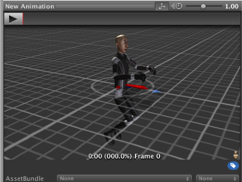
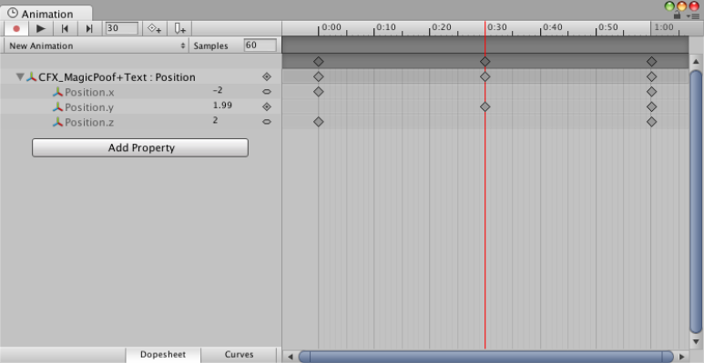

[에디터 확장 입문] 번역 25장 시간을 제어하는 TimeControl

번역/유니티/유니티에디터확장입문

><주의>
원문의 작성 시기는 2016년경으로, 코드나 일부 설명이 최신 유니티 버젼과 다소 맞지 않을 수 있습니다.
원문 작성자 분 역시 2019년경에 내용에 다소 오류가 있다는 이유로 웹 공개 버젼을 비공개 처리하였습니다.
(2022.10.08 역자)

원문 링크 (2022.10.08 지금은 폐기)
http://anchan828.github.io/editor-manual/web/time_control.html

---
목차
- [1. 시간의 원료 EditorApplication.timeSinceStartup](#1-시간의-원료-editorapplicationtimesincestartup)
- [2. 재생](#2-재생)
- [3. 일시 정지](#3-일시-정지)
- [4. 정지](#4-정지)
- [5. 시간의 하한/한도](#5-시간의-하한한도)
- [6. 재생 속도](#6-재생-속도)
- [7. 움직이는지 확인](#7-움직이는지-확인)

에디터 확장을 하고 있으면, Animation 윈도우와 AnimationClip의 프리뷰로 사용되는 타임 컨트롤을 다루고 싶을 때가 있습니다.






이번 장에서는 이들의 시간을 관리하기 위한 기반이 되는 TimeControl을 해설합니다. 


# 1. 시간의 원료 EditorApplication.timeSinceStartup 

경과 시간을 파악하기 위해서 EditorApplication.timeSinceStartup을 사용합니다. 이는 Unity 에디터가 실행된 이후 경과 시간을 취득할 수 있습니다. DateTime.Now.Ticks를 사용해도 문제 없습니다.소개 때문에 timeSinceStartup를 다루어 보았습니다.

다음 코드는 시간을 계측하는 구조로 되어 있습니다. 경과 시간의 갱신은 에디터의 갱신시에 호출되는 EditorApplication.update 경유로 실시합니다.

```csharp
public class TimeControl
{
    private double m_lastFrameEditorTime = 0;
    public float currentTime;

    public TimeControl ()
    {
        EditorApplication.update += TimeUpdate;
    }

    public void TimeUpdate ()
    {
        var timeSinceStartup = EditorApplication.timeSinceStartup;
        var deltaTime = timeSinceStartup - m_lastFrameEditorTime;
        m_lastFrameEditorTime = timeSinceStartup;
        currentTime += (float)deltaTime;
    }
}
```
이것만으로는 시간이 흘러갈 뿐이므로 "재생"이나 "일시 정지" "정지"를 구현합니다. 

# 2. 재생

```csharp
public bool isPlaying { get; private set; }

public void TimeUpdate ()
{
    if (isPlaying) {
        //略。currentTime 更新
    }
}

public void Play ()
{
    isPlaying = true;
    m_lastFrameEditorTime = EditorApplication.timeSinceStartup;
}
```
재생은 간단합니다. 트리거가 되는 Play 함수와 재생 중인지를 판단하는 isPLaying 프로퍼티를 작성하는 것만으로, 원하는 때에 재생을 실시할 수 있습니다. 

1가지 주의할 점으로, m_lastFrameEditorTime의 갱신도 동시에 행하지 않으면 안 됩니다. 이것을 하지 않으면 재생하기까지의 경과 시간도 갱신 할때 포함되어버려, 시간을 건너뛴 것 같이 작동되어 버립니다. 

# 3. 일시 정지

```csharp
public void Pause ()
{
    isPlaying = false;
}
```
isPlaying을 false으로 할 뿐입니다. 


# 4. 정지
```csharp
public void Stop ()
{
    isPlaying = false;
    currentTime = 0;
}
```
isPlaying을 false로, currentTime를 0으로 초기화합니다. 


# 5. 시간의 하한/한도 

Play 함수를 실행하고 오래 시간을 계측하는 것도 좋지만 "어느 일정한 경과 시간으로 루프 하는" 처리를 추가하면 AnimationClip로 다루듯이 작동시킬 수 있게 됩니다.

```csharp
public float minTime { get; private set; }

public float maxTime { get; private set; }

public float currentTime {
    get {
        m_currentTime = Mathf.Repeat (m_currentTime, maxTime);
        m_currentTime = Mathf.Clamp (m_currentTime, minTime, maxTime);
        return m_currentTime;
    }
    set {
        m_currentTime = value;
    }
}

public void SetMinMaxTime (float minTime, float maxTime)
{
    this.minTime = minTime;
    this.maxTime = maxTime;
}
```
우선 minTime과 maxTime프로퍼티를 작성합니다. 다음에 currentTime을 얻어올 때 Repeat과 Clamp로 시간을 가공합니다. Repeat는 시간 그룹을 위해서(기능적으로 루프 강제로 했습니다.루프를 옵션으로 하고 싶을 때에는 loop변수 등을 작성해서 제어하세요), Clamp은 minTime에 따른 시간 시작 위치를 지정하기 위해서 사용합니다. 

# 6. 재생 속도

```csharp
public float speed { get; set; }

public void TimeUpdate ()
{
    if (isPlaying) {
        var timeSinceStartup = EditorApplication.timeSinceStartup;
        var deltaTime = timeSinceStartup - m_lastFrameEditorTime;
        m_lastFrameEditorTime = timeSinceStartup;

        currentTime += (float)deltaTime * speed;
    }
}
```
마지막으로 재생 속도를 변경하게 합니다. speed 프로퍼티를 작성하고 시간 갱신 시에 곱셈합니다. 


# 7. 움직이는지 확인 

간단한 코드를 쓰고 동작을 확인하고 봅시다. 사이드 바의 손잡이를 이동시켜도 그 위치에서 재생되는 것을 확인하세요.

```csharp
using UnityEngine;
using UnityEditor;

public class Example : EditorWindow
{
    TimeControl timeControl;

    [MenuItem ("Window/Example")]
    static void Open ()
    {
        GetWindow<Example> ();
    }

    void OnEnable ()
    {
        timeControl = new TimeControl ();
        timeControl.SetMinMaxTime (0, 10);
    }

    void OnGUI ()
    {
        var buttonText = timeControl.isPlaying ? "Pause" : "Play";

        if (GUILayout.Button (buttonText)) {

            if (timeControl.isPlaying)
                timeControl.Pause ();
            else
                timeControl.Play ();
        }

        timeControl.currentTime = EditorGUILayout
            .Slider (timeControl.currentTime, 0, 10);

        //GUI 갱신
        if (timeControl.isPlaying)
            Repaint ();
    }
}
```
본장에서 작성한 TimeControl은 21장 "파티클을 제어하기", 23장"SpriteAnimationPreview(스프라이트 애니메이션)"에서 사용되고 있습니다. 사용 예로서 참고하세요.