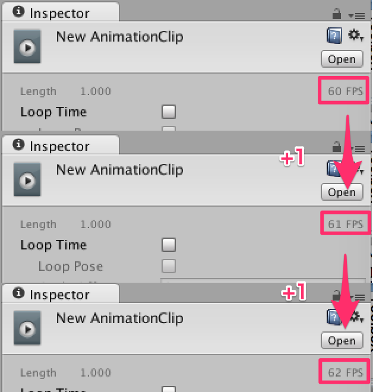

[에디터 확장 입문] 번역 26장 AssetDatabase

번역/유니티/유니티에디터확장입문

><주의>
원문의 작성 시기는 2016년경으로, 코드나 일부 설명이 최신 유니티 버젼과 다소 맞지 않을 수 있습니다.
원문 작성자 분 역시 2019년경에 내용에 다소 오류가 있다는 이유로 웹 공개 버젼을 비공개 처리하였습니다.
(2022.10.08 역자)

원문 링크 (2022.10.08 지금은 폐기)
http://anchan828.github.io/editor-manual/web/asset_database.html

---
목차
- [1. 오브젝트를 에셋으로서 보존](#1-오브젝트를-에셋으로서-보존)
- [2. 에셋이 갱신되는 타이밍](#2-에셋이-갱신되는-타이밍)
- [3. System.IO을 사용](#3-systemio을-사용)
  - [3.1. [Unity관리 외의 조작임을 파악하기]](#31-unity관리-외의-조작임을-파악하기)
  - [3.2. [프로젝트의 휴식과 에셋의 임포트]](#32-프로젝트의-휴식과-에셋의-임포트)
  - [3.3. AssetDatabase.Refresh](#33-assetdatabaserefresh)
  - [3.4. AssetDatabase.ImportAsset](#34-assetdatabaseimportasset)
  - [3.5. FileUtil](#35-fileutil)
- [4. 에셋은 패스가 아니라 GUID로 관리되고 있다](#4-에셋은-패스가-아니라-guid로-관리되고-있다)

AssetDatabase는 Unity 에디터 상에서 다루는 에셋을 관리하기 위한 중요한 클래스입니다. 오브젝트를 에셋으로서 보존하거나 에셋의 목록을 얻어오거나 하기 위한 중요한 클래스입니다. 이 클래스를 모르면 만족스럽게 프로젝트 내의 에셋을 조작할 수 없고 독자적인 에셋을 작성할 수도 없습니다. 본 장에서는 특히 중요한 에셋의 보존에 대해서 해설합니다. 

# 1. 오브젝트를 에셋으로서 보존 

에셋의 작성 자체는 매우 간단합니다. 

AnimationClip을 메뉴에서 작성하는 사례

```csharp
[MenuItem ("Assets/Create AnimationClip")]
static void Example ()
{
  // 아직 에셋으로서 존재하지 않는 오브젝트를 작성
  var clip = new AnimationClip ();

  // 에셋으로서 저장
  //AssetDatabase에서 다루는 패스는 Unity프로젝트에서 상대 경로로 지정할 수 있습니다
  AssetDatabase.CreateAsset (clip, "Assets/New AnimationClip.anim");
}
```

이로써 Project창을 보면 에셋이 작성된 것으로 나타납니다.


Assets폴더 바로 아래에 저장됩니다.


# 2. 에셋이 갱신되는 타이밍 

방금 저장한 AnimationClip의 프로퍼티를 스크립트로 변경해 보겠습니다. 변경 사항을 인스팩터에서 볼 수 있는 frameRate의 값을 변경합니다.

```csharp
[MenuItem ("Assets/Change FrameRate")]
static void ChangeFrameRate ()
{
  // 에셋 패스로부터 에셋을 오브젝트로 로드
  var clip = AssetDatabase.LoadAssetAtPath<AnimationClip>
                                      ("Assets/New AnimationClip.anim");
  clip.frameRate++;
}
```




Assets/Change FrameRate를 실행할 때마다 프레임 레이트가 +1 됩니다 

프레임 레이트를 변경하면 에셋의 Serialize 설정을 "Force Text"로 해서(Edit->Project Settings->Editor에 있는 Asset Serialization에서 변경할 수 있습니다) 에셋을 텍스트 에디터로 열어 봅시다.

```
%YAML 1.1
%TAG !u! tag:unity3d.com,2011:
--- !u!74 &7400000
AnimationClip:
　... 略 ...
  m_PPtrCurves: []
  m_SampleRate: 60 <- 여기가 프레임 레이트
  m_WrapMode: 0
```

프레임 레이트를 나타내는 m_SampleRate가 변경되었음에도 불구하고 60 그대로임을 알 수 있습니다. 

이 상태는 AssetDatabase.LoadAssetAtPath에 의해서 에셋에서 로드된 오브젝트의 프로퍼티가 변경된 것이지, 에셋에는 아직 변경 사항이 적용되지 않은 상태입니다. 

Unity 에디터 상에서는 오브젝트는 (SerializedObject로서) 캐시 되고 있어 "스크립트나 Unity에디터 상에서 만지는 한" 항상 최신의 데이터를 취급할 수 있습니다. 그러나 이 상태는 아직 에셋으로서 보존되고 있지 않습니다. 

에셋으로서 보존하려면 AssetDatabase.SaveAssets를 사용합니다. 이 함수는 메뉴의 File->Save Project와 같은 기능입니다. SaveAssets를 호출하면 더티 플래그가 선 오브젝트를, 에셋 오브젝트인 경우 에셋을 업데이트합니다.(AnimationClip.frameRate값을 설정하면 자동으로 더티 플래그가 세팅됩니다.)

```csharp
[MenuItem ("Assets/Change FrameRate")]
static void ChangeFrameRate ()
{
  //에셋 패스로부터 에셋을 오브젝트로서 로드
  var clip = AssetDatabase.LoadAssetAtPath<AnimationClip>
                                      ("Assets/New AnimationClip.anim");
  clip.frameRate++;

  //에셋을 최신으로 갱신
  AssetDatabase.SaveAssets ();
}
```

상기의 코드로 인해, 변경사항이 AnimationClip에셋에 적용됩니다.

```
%YAML 1.1
%TAG !u! tag:unity3d.com,2011:
--- !u!74 &7400000
AnimationClip:
　... 略 ...
  m_PPtrCurves: []
  m_SampleRate: 62 <- 여기가 갱신됨
  m_WrapMode: 0
```

# 3. System.IO을 사용 

C#에는 표준에서 주로 파일과 폴더를 다루는 System.IO 네임 스페이스가 존재합니다. 이 네임 스페이스를 사용해서 파일(에셋)을 작성하는 경우는 조금 주의가 필요합니다. 


Unity는 본장에서 소개하고 있는 AssetDatabase 클래스는 어디까지나 에셋과 인식할 수 있는 파일만&Unity프로젝트의 Assets폴더 안쪽만 관리합니다. 그래서 UnityEngine.Object 상속이 아닌 파일의 작성이나, Assets폴더 외에 파일을 작성하는 것은 허용되지 않습니다. 이 때 System.IO가 활약합니다. 

## 3.1. [Unity관리 외의 조작임을 파악하기]

AssetDatabase를 사용한 에셋의 조작은, 에셋의 상태를 파악하는 것을 Unity가 자동으로 하게 만듭니다. 그렇지만, System.IO에 의해서 에셋 조작한 경우는 Unity는 에셋의 상태를 파악할 수 없게 됩니다. 

시험삼아 다음 코드를 실행해 보겠습니다. 

System.IO경유해서 TextAsset를 작성

```csharp
[MenuItem ("Assets/Create TextAsset")]
static void CreateTextAsset ()
{
  var text = "text";
  File.WriteAllText ("Assets/New TextAsset.txt", text);
}
```

이렇게 하면 Finder에서는 파일이 작성되지만 Unity에디터 상의 Project윈도우에서는 에셋으로 표시되어 있지 않습니다. Unity 에디터 자체 애플리케이션의 포커스를 빼고 다시 포커스를 맞추면 에셋이 표시됩니다. 이는 포커스에 따라 에디터의 Refresh가 실행되는 구조이기 때문입니다.


왼쪽이 Finder, 오른쪽이 Project창. 각각. meta와 TextAsset이 없음을 알 수 있습니다

## 3.2. [프로젝트의 휴식과 에셋의 임포트]

Unity 에디터가 자동으로 에셋의 상태를 파악 못한다면 사용자 자신이 Unity에디터 에셋의 상태를 파악하는 구현을 실시하지 않으면 안 됩니다. 

에셋의 상태를 파악시키는 방법은 2종류가 있습니다.AssetDatabase.Refresh와 AssetDatabase.ImportAsset입니다.

## 3.3. AssetDatabase.Refresh

Refresh 기능은 Unity프로젝트를 최신 상태로 갱신하는 기능입니다. Refresh에 의해서 프로젝트 전체의 파일 구성이 체크됩니다. 그리고 최신 구성과 Unity 에디터에 차이가 있었을 경우에는 해당 에셋을 다시 가져옵니다.


Refresh에 의해서 프로젝트 상태가 체크된 뒤 Import되지 않은 에셋을 가져옵니다.

```csharp
[MenuItem ("Assets/Create TextAsset")]
static void CreateTextAsset ()
{
  var text = "text";
  File.WriteAllText ("Assets/New TextAsset.txt", text);

  //Refresh해서 에셋이 Import됨
  AssetDatabase.Refresh ();
}
```

## 3.4. AssetDatabase.ImportAsset

AssetDatabase.ImportAsset은 대상 에셋만을 가져올 때 사용합니다.(거대한 프로젝트에서 겨우 실감할 수 있는 정도라고 생각하지만) Refresh기능은 프로젝트 전체의 상태를 체크하기 때문에 다소 무거운 동작을 합니다. 특정 에셋 뿐인 경우엔, Refresh 경유의 Import가 아니라 직접 AssetDatabase.ImportAsset를 호출하고 Import 처리를 실행합니다.

```csharp
[MenuItem ("Assets/Create TextAsset")]
static void CreateTextAsset ()
{
  var path = "Assets/New TextAsset.txt";
  var text = "text";

  File.WriteAllText (path, text);

  //패스를 지정하고 가져옵니다
  AssetDatabase.ImportAsset (path);
}
```

## 3.5. FileUtil

System.IO클래스를 사용하고 에셋을 조작할 때 편리한 FileUtil클래스가 있습니다. 파일 조작을 실시할 때에는 이 클래스를 체크하세요. 

http://docs.unity3d.com/ScriptReference/FileUtil.html


# 4. 에셋은 패스가 아니라 GUID로 관리되고 있다 

모든 에셋은 독특한 ID로 관리하기 위해서 GUID로 관리하고 있습니다. 딱히 강제적인 것은 없지만, 자작 에셋으로서 파일 관리 주위를 작성하는 경우는 패스가 아니라 GUID를 보유한다고 예상 밖의 버그가 발생하지 않을수도 있습니다.


Library/metadata에서는 GUID로 에셋 정보가 관리되고 있다 

.meta파일에 guid가 있다

```
fileFormatVersion: 2
guid: 615b87de8357a4cba95fa8a92033e831
timeCreated: 1441513548
licenseType: Pro
TextScriptImporter:
  userData:
  assetBundleName:
  assetBundleVariant:
```