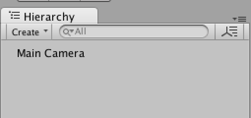
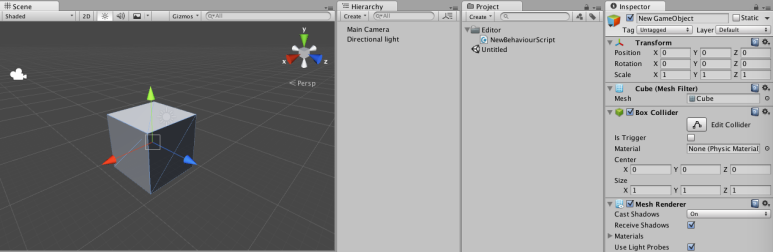

[에디터 확장 입문] 번역 27장 HideFlags Viewer

번역/유니티/유니티에디터확장입문


><주의>
원문의 작성 시기는 2016년경으로, 코드나 일부 설명이 최신 유니티 버젼과 다소 맞지 않을 수 있습니다.
원문 작성자 분 역시 2019년경에 내용에 다소 오류가 있다는 이유로 웹 공개 버젼을 비공개 처리하였습니다.
(2022.10.08 역자)

원문 링크 (2022.10.08 지금은 폐기)

http://anchan828.github.io/editor-manual/web/hideflags.html

---
목차
- [1. 게임 오브젝트를 숨기기](#1-게임-오브젝트를-숨기기)
- [2. HideFlags.HideInHierarchy의 작동방식](#2-hideflagshideinhierarchy의-작동방식)
  - [2.1. [게임 오브젝트에 대한 작동]](#21-게임-오브젝트에-대한-작동)
  - [2.2. [에셋에 대한 동작]](#22-에셋에-대한-동작)
- [3. HideFlags.DontSave의 작동 방식](#3-hideflagsdontsave의-작동-방식)
  - [3.1. HideFlags.DontSaveInEditor](#31-hideflagsdontsaveineditor)
  - [3.2. HideFlags.DontUnloadUnusedAsset](#32-hideflagsdontunloadunusedasset)
  - [3.3. [HideFlags.DontSave의 사용방식]](#33-hideflagsdontsave의-사용방식)


HideFlags는 "오브젝트가 보이는 방식"과 "오브젝트의 보존 대상"을 제어하기 위한 기능입니다. 씬 내에 있는 게임 오브젝트는 Hierarchy에 표시된 것이 전부라고 생각하고 있지 않습니까? 꼭 게임 오브젝트는 씬 파일에 저장될 것이라고 생각하고 있지 않습니까? 본 장에서는 몇가지 예를 들어 HideFlags의 구조에 대해서 소개하겠습니다. 


# 1. 게임 오브젝트를 숨기기

우선은 HideFlags의 효과를 실감해 보겠습니다. 다음 코드를 구현해 "Assets/Create New GameObject"메뉴로 게임 오브젝트를 작성합니다.

```csharp
[MenuItem ("Assets/Create New GameObject")]
static void CreateNewGameObject ()
{
  new GameObject ("New GameObject");
}
```
아무 문제 없이 처럼 게임 오브젝트가 작성됩니다.


씬 내에 New GameObject가 작성됩니다. 

작성된 게임 오브젝트를 삭제하여 다음과 같이 HideFlags에 대한 코드를 추가합니다.

```csharp
[MenuItem ("Assets/Create New GameObject")]
static void CreateNewGameObject ()
{
  var go = new GameObject ("New GameObject");

  //Hierarchy에 표시하지 않는다
  go.hideFlags = HideFlags.HideInHierarchy;
}
```

그러자 "Assets/Create New GameObject"메뉴를 실행하여도 Hierarchy에는 New GameObject는 표시되지 않습니다.



이 상태("Assets/Create New GameObject"을 실행했지만 New GameObject가 표시되지 않은 상태)에서 씬을 저장해 봅시다. 그리고 씬 파일을 텍스트 에디터로 봅시다. 그전에 에셋의 Serialize 모드를 Force Text에 둘 필요가 있습니다.

씬 파일의 해당 부분. New GameObject가 존재하는 것을 알 수 있습니다.

```
--- !u!1 &1082080032
GameObject:
  m_ObjectHideFlags: 1
  m_PrefabParentObject: {fileID: 0}
  m_PrefabInternal: {fileID: 0}
  serializedVersion: 4
  m_Component:
  - 4: {fileID: 1082080033}
  m_Layer: 0
  m_Name: New GameObject
  m_TagString: Untagged
  m_Icon: {fileID: 0}
  m_NavMeshLayer: 0
  m_StaticEditorFlags: 0
  m_IsActive: 1
```

또는 GameObject.Find에서 New GameObject가 존재함을 확인합니다.

```csharp
[MenuItem ("Assets/Find New GameObject")]
static void FindNewGameObject ()
{
  var go  = GameObject.Find ("New GameObject");
  Debug.Log (go);
}
```

# 2. HideFlags.HideInHierarchy의 작동방식 

## 2.1. [게임 오브젝트에 대한 작동]

HideFlags.HideInHierarchy는 씬 뷰에서 Selection조작을 무효로 합니다. 

Cube를 작성해봅시다.

```csharp
[MenuItem ("Assets/Create New GameObject")]
static void CreateNewGameObject ()
{
  var go =  GameObject.CreatePrimitive (PrimitiveType.Cube);
  go.name = "New GameObject";
  go.hideFlags = HideFlags.HideInHierarchy;
}
```


Cube를 클릭해도 아무 일도 일어나지 않습니다.

하지만 스크립트에서라면 Selection 조작이 가능하다는 점을 기억하세요.

```csharp
[MenuItem ("Assets/Create New GameObject")]
static void CreateNewGameObject ()
{
  var go =  GameObject.CreatePrimitive (PrimitiveType.Cube);
  go.name = "New GameObject";
  go.hideFlags = HideFlags.HideInHierarchy;
  Selection.activeGameObject = go;
}
```




핸들과 인스펙터가 표시되고 있습니다.


## 2.2. [에셋에 대한 동작]

HideFlags.HideInHierarchy는 에셋에 대해서도 효과가 있습니다. 다만 서브 에셋 뿐이라는 것을 기억하세요. 메인 에셋에 HideInHierarchy를 설정한 경우, 에셋으로 인식되지 않아 의존 관계에 불편이 생길 가능성이 있습니다. 

또 HideInHierarchy에 대해서 4장 "ScriptableObject"의 "ScriptableObject의 부모자식 관계"에서도 자세히 설명하고 있습니다.


왼쪽이 모두 표시, 오른쪽이 2nd와 3rd에 HideInHierarchy를 설정

```csharp
[MenuItem ("Assets/Create SubAssets")]
static void HideReference ()
{
  var path = "Assets/1st.anim";
  var first = new AnimationClip { name = "1st" };

  var second = new AnimationClip {
    name = "2nd",
    hideFlags = HideFlags.HideInHierarchy
  };
  var third = new AnimationClip {
    name = "3rd",
    hideFlags = HideFlags.HideInHierarchy
  };

  AssetDatabase.CreateAsset (first, path);

  //서브 에셋화
  AssetDatabase.AddObjectToAsset (second, first);
  AssetDatabase.AddObjectToAsset (third, first);

  AssetDatabase.ImportAsset (path);
}
```

# 3. HideFlags.DontSave의 작동 방식

Unity로, 게임 재생시에 변경한 파라메터가 게임을 정지시키면 초기화되는 현상을 자주 봅니다.


재생 중에 파라미터를 변경해서 정지시키면 원래 수치로 되돌아옵니다.

이 초기화되는 것은 리소스의 해방(오브젝트의 파기)도 포함됩니다. 아래에 "Unity에서의 오브젝트 관리를 간결하게 정리한 것"을 조목별로 씁니다. 

- 게임 재생 후에 생성된 오브젝트는 자동적으로 파기된다 
- 게임을 정지하면 오브젝트는 게임 재생 전의 상태로 되돌아가 
- 불필요한 리소스는 언로드된다 
- 이들은 모두 메모리상에만 존재하는 오브젝트를 대상으로 하고 있다 

상기 사양을 모두 무시할 수 있는 HideFlags.DontSave가 있습니다. HideFlags.DontSave는 실제로는 3개의 플래그로 구성되어 있습니다. 

HideFlags.DontSaveInBuild 
빌드 시 씬 내에 게임 오브젝트를 저장하지 않는다. 또는 리소스로서 에셋을 포함하지 않는다. 

HideFlags.DontSaveInEditor 
에디터 상에서 오브젝트를 저장 대상으로 하지 않는다. 

HideFlags.DontUnloadUnusedAsset 
Unity의 사양에 준거한 리소스 관리에서 제외한다. 

이 3가지 중에서 중요한 것은 HideFlags.DontSaveInEditor와 HideFlags.DontUnloadUnusedAsset  2개입니다. 

## 3.1. HideFlags.DontSaveInEditor

HideFlags.DontSaveInEditor는 오브젝트가 자동으로 파기되는 것을 무효화하는 플래그입니다. 

아래의 코드를 시험해 보겠습니다.

```csharp
public class Hoge : ScriptableObject {}

public class HogeWindow : EditorWindow
{
  [MenuItem ("Window/Hoge")]
  static void Hoge ()
  {
    GetWindow<HogeWindow> ();
  }

  Hoge hoge = null;

  void OnEnable ()
  {
    hoge = ScriptableObject.CreateInstance<Hoge> ();
  }

  void Update ()
  {
    Debug.Log (hoge);
  }
}
```

윈도우를 연 상태로 게임을 재생합니다.
  


게임 재생 직후의 상태. OnEnable에서 인스턴스가 생성되고, 오브젝트가 존재하는 것으로 나타났다.


게임 정지 직후의 상태. 객체가 리셋(파기) 된 null로 되어 있습니다.

이처럼 게임 재생 직후 생성된 오브젝트는, 에디터 확장 측의 오브젝트여도 파기되어 버립니다. 그래서 오브젝트를 자동으로 파기하지 않는 방법으로서 HideFlags.DontSaveInEditor이 있습니다. 

아까의 코드에 DontSaveInEditor를 추가하는 것으로 차이를 확인할 수 있습니다.

```csharp
public class Hoge : ScriptableObject {}

public class HogeWindow : EditorWindow
{
  [MenuItem ("Window/Hoge")]
  static void Hoge ()
  {
    GetWindow<HogeWindow> ();
  }

  Hoge hoge = null;

  void OnEnable ()
  {
    hoge = ScriptableObject.CreateInstance<Hoge> ();
    hoge.hideFlags = HideFlags.DontSaveInEditor;
  }

  void Update ()
  {
    Debug.Log (hoge);
  }
}
```


게임을 정지해도 null이 되지 않고 오브젝트가 존재합니다.


## 3.2. HideFlags.DontUnloadUnusedAsset

HideFlags.DontUnloadUnusedAsset은 오브젝트가 자동으로 Unload되는 것을 무효화하는 플래그입니다. 

아래의 코드를 시험해 보겠습니다.

```csharp
public class Hoge : ScriptableObject {}

public class HogeWindow : EditorWindow
{
  [MenuItem ("Window/Hoge")]
  static void Hoge ()
  {
    GetWindow<HogeWindow> ();
  }

  Hoge hoge = null;

  void OnEnable ()
  {
    hoge = ScriptableObject.CreateInstance<Hoge> ();

    var hoges = Resources.FindObjectsOfTypeAll<Hoge> ();

    Debug.Log (hoges.Length);
  }
}
```

게임 재생->게임 정지를 반복해도 오브젝트의 수가 항상 1이 되는 것을 볼 수 있습니다.(스크립트의 컴파일 직후에만 2가 됩니다. 이는 자동 Unload의 타이밍이 게임 정지할 때이기 때문입니다)


게임의 재생/정지를 반복하고 오브젝트의 수를 확인합니다.

다음으로, 스크립트의 컴파일 시의 작동방식입니다. 스크립트의 컴파일이 이루어지면 모든 클래스가 초기화되고 보유한 참조가 모두 떼어집니다. 

아래의 코드는 컴파일 후의 hoge변수 참조를 확인하는 코드입니다. 

Create->Check->Compile->Check의 순으로 실행합니다.

```csharp
public class Hoge : ScriptableObject {}

public class Test
{
  static Hoge hoge = null;

  [MenuItem ("Test/Create")]
  static void Create ()
  {
    hoge = ScriptableObject.CreateInstance<Hoge> ();
  }

  [MenuItem ("Test/Compile")]
  static void Compile ()
  {
    UnityEditorInternal.InternalEditorUtility.RequestScriptReload ();
  }

  [MenuItem ("Test/Check")]
  static void Check ()
  {
    Debug.Log (hoge);
  }
}
```
참조가 떼어진 뒤에는 Resources.FindObjectsOfTypeAll을 사용하고 메모리상에서 오브젝트를 얻어오고 참조를 할당합니다. 그렇지만 이 때 자동으로 열리는 리소스의 Unload를 고려하지 않으면 안 됩니다. 본 장에서 여러 차례 나오고 있습니다, 참조되어 있지 않은 메모리상에 있는 오브젝트는 특정 타이밍(게임 정지 시나 EditorUtility.UnloadUnusedAssetsImmediate의 호출 시)에서 파기됩니다. 

이처럼 컴파일 후 등에서 참조가 떼어졌을 때 자동으로 오브젝트가 메모리 영역에서 해방되지 않도록 HideFlags.DontUnloadUnusedAsset이 사용됩니다. 


## 3.3. [HideFlags.DontSave의 사용방식]

기본적으로, HideFlags.DontSaveInEditor와 HideFlags.DontUnloadUnusedAsset을 하나만 다루지 않고 그것들을 조합한 HideFlags.DontSave를 사용합니다. 이미 Unity측에서 구현된 HideFlags.DontSave를 사용한 대표적인 것은 EditorWindow입니다. 또 Animator창 같은 노드 베이스의 그래프 에디터에서 노드 및 트랜지션에서 취급되고 있습니다. 

이처럼 게임 재생/정지·컴파일에 관계 없이 계속 존재해야하는 오브젝트에 대해서 HideFlags.DontSave를 사용합니다.