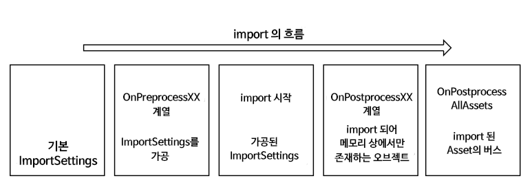
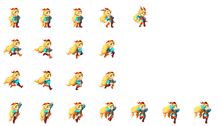
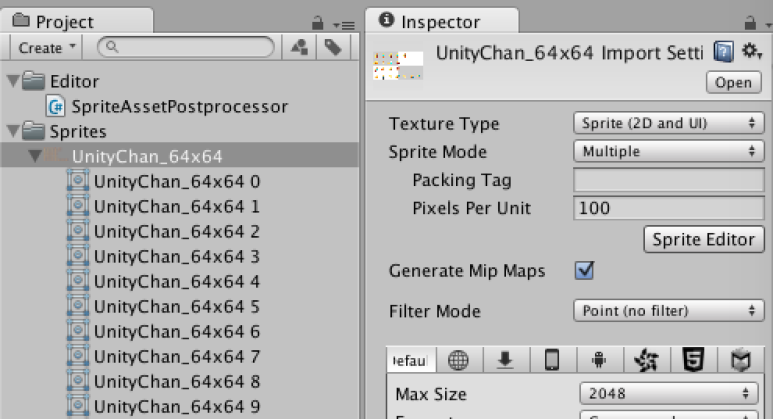

[에디터 확장 입문] 번역 28장 AssetPostprocessor (완)

번역/유니티/유니티에디터확장입문


><주의>
원문의 작성 시기는 2016년경으로, 코드나 일부 설명이 최신 유니티 버젼과 다소 맞지 않을 수 있습니다.
원문 작성자 분 역시 2019년경에 내용에 다소 오류가 있다는 이유로 웹 공개 버젼을 비공개 처리하였습니다.
(2022.10.08 역자)

원문 링크 (2022.10.08 지금은 폐기)
http://anchan828.github.io/editor-manual/web/assetpostprocessor.html

---
목차
- [1. Preprocess와 Postprocess](#1-preprocess와-postprocess)
- [2. AssetImporter](#2-assetimporter)
- [3. Version](#3-version)
- [4. 텍스처의 명명 규칙으로 스프라이트를 작성한다](#4-텍스처의-명명-규칙으로-스프라이트를-작성한다)


AssetPostprocessor는, 에셋을 가져올 때의 Hook으로써 기능합니다. Import 설정을 변경하거나 Import한 에셋을 재가공하기 위해서 사용할 수 있습니다. 


# 1. Preprocess와 Postprocess 

AssetPostprocessor에는 크게 2종류의 Hook이 있습니다. 


PreprocessXX계열 
에셋을 Import하기 위한 Import 설정을 가공하기 위해서 사용합니다. 이 Hook이 호출되는 시점에서는 에셋은 Import 되어 있지 않습니다. 

PostprocessXX계열
가져올 에셋을 더욱 가공하고 싶은 경우에 사용합니다. 이 Hook은 에셋이 Import된 후 호출됩니다. 그렇지만, 인자로서 전달되는 Import된 오브젝트는 아직 에셋으로서 보존되고 있지 않습니다. 또 인자로서 전달된 오브젝트는 에셋이 생성된 후에는 파기됩니다. 즉, PostprocessXX계열의 함수 내에서 참조를 갖는 것은 할 수 없습니다. 

아래 그림 은 에셋의 Import의 흐름을 그림으로 한 



에셋의 Import의 흐름 

# 2. AssetImporter 

AssetImporter는 Import 때 사용하는 ImportSettings와, AssetBundleName 및 사용자가 자유롭게 데이터를 저장할 수 userdata를 갖추고 있습니다. 이들 데이터는 Serialize화되어 meta파일(의 일부)로 저장됩니다.(meta파일에는 licenseType과 fileFormatVersion등 AssetImporter에서 다루지 않는 정보도 있습니다)


이미지적으로는 "AssetImporter ≒ meta파일"이라고 생각해도 됩니다.


# 3. Version 

AssetPostprocessor에는 버전의 개념이 존재합니다. 에셋의 Import 때 각 에셋(정확히는 AssetImporter)에 대해서 AssetPostprocessor의 버전이 할당됩니다. 이 버전을 사용자가 관리함으로써 에셋의 분류가 가능하고 버전의 변경 시에 몰아서 다시 가져올 수 있게 됩니다. 

예로서 생각할 수 있는 간결한 스토리로서는 아래와 같습니다.

```
1:AssetPostprocessor의 에디터 확장을 구현.
2:사양 변경이 있었기 때문에 AssetPostprocessor의 버전을 변경.
3:구현한 AssetPostprocessor에 의해 Import된 에셋이 모두 다시 Import되어 사양 변경 사항이 적용.
```

버전을 관리하는 클래스를 만듭니다.

```csharp
public class AssetImporterUtility
{
  public const int VERSION = 2015;
}
GetVersion을 오버라이드합니다.

using UnityEngine;
using UnityEditor;

public class NewBehaviourScript :  AssetPostprocessor
{
  public override uint GetVersion ()
  {
    return AssetImporterUtility.VERSION;
  }

  void OnPreprocessTexture ()
  {
    //뭔가 처리함
  }

  void OnPostprocessTexture (Texture2D texture)
  {
    //뭔가 처리함
  }
}
```

# 4. 텍스처의 명명 규칙으로 스프라이트를 작성한다 

AssetPostprocessor를 사용한 예로서 텍스처의 명명 규칙으로 스프라이트를 만들어 보겠습니다. 

아래의 그림처럼 파일 이름이 "UnityChan_64x64.png"인 텍스처를 준비합니다. 명명 규칙은 파일 이름에서 원하는 정보를 취득할 수 있도록 "{텍스처 이름}_{스프라이트의 width}x{스프라이트의 height}. png"으로 했습니다.




unitychan2d의 텍스처"UnityChan_64x64.png" 입니다.

우선 OnPreprocessTexture로 텍스처에 관한 Import 설정을 조정합니다.OnPreprocessTexture에서는 텍스처 정보를 아직 얻어올 수 없으므로 스프라이트의 설정을 실시할 수 없습니다.

```csharp
void OnPreprocessTexture ()
{
  //Sprites 폴더 아래에 있으면 실행
  if (assetPath.StartsWith ("Assets/Sprites/") == false)
    return;

  TextureImporter importer = (TextureImporter)assetImporter;
  importer.textureType = TextureImporterType.Sprite;
  importer.spriteImportMode = SpriteImportMode.Multiple;
  importer.filterMode = FilterMode.Point;
}
```

OnPostprocessTexture로, 스프라이트의 설정을 해나가겠습니다. 스프라이트의 Rect의 생성은 Internal로 비 권장 취급되지만 InternalSpriteUtility.GenerateGridSpriteRectangles를 사용하면 편하게 생성이 가능합니다. OnPostprocessXX 계열 가운데 Importer의 설정을 변경하고 있습니다만, 스프라이트의 Import 처리는 아직 행해지지 않으므로 문제 없습니다.

```csharp
void OnPostprocessTexture (Texture2D texture)
{
  int width, height;
  if (TryGetSpriteSize (out width, out height) == false)
    return;

  var filename = Path.GetFileNameWithoutExtension (assetPath);

  //스프라이트 생성에 관한 변수 설정
  var offset = Vector2.zero;
  var size = new Vector2 (width, height);
  var padding = Vector2.zero;

  var rects = InternalSpriteUtility
    .GenerateGridSpriteRectangles (texture, offset, size, padding);

  //생성한 스프라이트의 Rect를 기반으로 SpriteMetaData 를 생성
  var spriteMetadata = new List<SpriteMetaData> ();

  for (int i = 0; i < rects.Length; i++) {
    var rect = rects [i];
    spriteMetadata.Add (new SpriteMetaData {
      name = filename + " " + i,
      rect = rect
    });
  }

  TextureImporter importer = (TextureImporter)assetImporter;
  //마지막으로 스프라이트 정보를 적용
  importer.spritesheet = spriteMetadata.ToArray ();
}

//파일명으로부터 스프라이트의 사이즈를 얻어옴
bool TryGetSpriteSize (out int width, out int height)
{
  width = 0;
  height = 0;

  var filename = Path.GetFileNameWithoutExtension (assetPath);
  var pattern = @"(?<name>.*?)_(?<width>\d+)x(?<height>\d+)";
  var regex = new Regex (pattern);

  if (regex.IsMatch (filename) == false)
    return false;

  var groups = regex.Match (filename).Groups;
  width = int.Parse (groups ["width"].Value);
  height = int.Parse (groups ["height"].Value);
  return true;
}
```



Import와 동시에 스프라이트가 생성됩니다.

아래가 완전한 코드입니다.

```csharp
using UnityEngine;
using UnityEditor;
using UnityEditorInternal;
using System.Collections.Generic;
using System.IO;
using System.Text.RegularExpressions;

public class SpriteAssetPostprocessor :  AssetPostprocessor
{

  void OnPreprocessTexture ()
  {
    if (assetPath.StartsWith ("Assets/Sprites/") == false)
      return;

    TextureImporter importer = (TextureImporter)assetImporter;
    importer.textureType = TextureImporterType.Sprite;
    importer.spriteImportMode = SpriteImportMode.Multiple;
    importer.filterMode = FilterMode.Point;
  }


  void OnPostprocessTexture (Texture2D texture)
  {
    int width, height;
    if (TryGetSpriteSize (out width, out height) == false)
      return;

    var filename = Path.GetFileNameWithoutExtension (assetPath);

    var offset = Vector2.zero;
    var size = new Vector2 (width, height);
    var padding = Vector2.zero;

    var rects = InternalSpriteUtility
      .GenerateGridSpriteRectangles (texture, offset, size, padding);

    var spriteMetadata = new List<SpriteMetaData> ();

    for (int i = 0; i < rects.Length; i++) {
      var rect = rects [i];
      spriteMetadata.Add (new SpriteMetaData {
        name = filename + " " + i,
        rect = rect
      });
    }

    TextureImporter importer = (TextureImporter)assetImporter;
    importer.spritesheet = spriteMetadata.ToArray ();
  }

  bool TryGetSpriteSize (out int width, out int height)
  {
    width = 0;
    height = 0;

    var filename = Path.GetFileNameWithoutExtension (assetPath);
    var pattern = @"(?<name>.*?)_(?<width>\d+)x(?<height>\d+)";
    var regex = new Regex (pattern);

    if (regex.IsMatch (filename) == false)
      return false;

    var groups = regex.Match (filename).Groups;
    width = int.Parse (groups ["width"].Value);
    height = int.Parse (groups ["height"].Value);
    return true;
  }

}
```