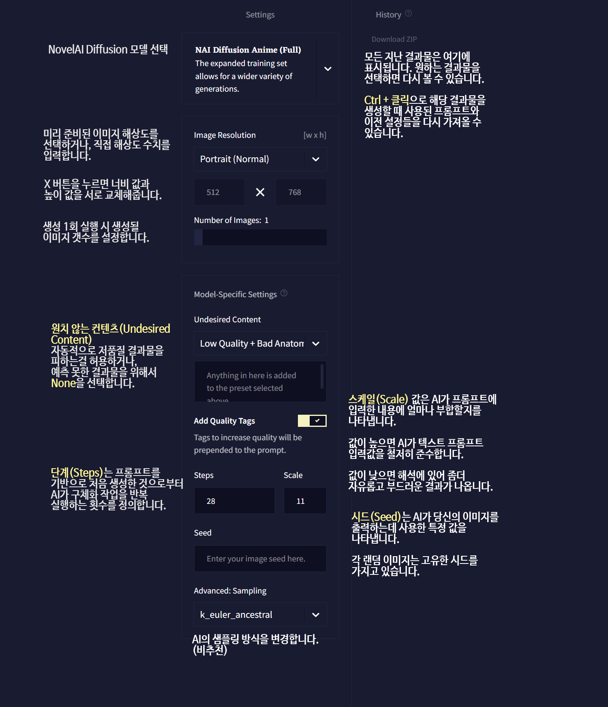

NovelAI 이미지 생성기 공식 가이드 문서 번역 1장 서문

AI/NovelAI/번역/가이드/Image Generation/사용법

2022.10.18 기준 공식 사이트 문서 번역

[원본 링크](https://docs.novelai.net/)

---

**1장 서문**

목차
- [1. 이미지 생성기(image generation)란?](#1-이미지-생성기image-generation란)
- [2. 어떻게 작동하는가?](#2-어떻게-작동하는가)
- [3. 설정 개요](#3-설정-개요)
- [4. 일반 결과물(Normal Generations)](#4-일반-결과물normal-generations)
- [5. 이미지 업로드 / Img2Img 생성 / 새 이미지 그리기 / 이미지 편집 / 캔버스 생성](#5-이미지-업로드--img2img-생성--새-이미지-그리기--이미지-편집--캔버스-생성)

# 1. 이미지 생성기(image generation)란?

NovelAI 확산 애니메이션 이미지 생셩기(Diffusion Anime image generation)는 당신의 상상 속 이야기를 그릴 수 있도록, 당신의 상상력을 마음껏 시각화할 수 있는 독특하고 창의적인 도구입니다.

태그를 사용하여 당신의 캐릭터 또는 구도의 시각적 특성을 정의합니다(혹은 원한다면 AI가 당신이 제공한 단어를 해석하도록 할 수 있습니다).

Novel AI Diffusion은 시각적 스토리텔링에 제한이 없도록 설계된 도구입니다.

NovelAI 이미지 생성기는 Stable Diffusion에 기반하여, 우리가 자체적으로 커스텀한 NovelAI 확산 모델이 적용되었습니다:

- NovelAI Diffusion Anime (Curated) : 우수한 기본 품질과 예측 가능한 주제.

- NovelAI Diffusion Anime (Full) : 추가적인 학습 세트로 다양한 결과물을 지원합니다.

- NovelAI Diffusion Furry (Beta) : 털이 났고 의인화된 동물 테마 컨텐츠를 쉽게 제작할 수 있는 베타 모델입니다. 이 모델은 아직 작업중이고, 곧 추가될 것입니다.

# 2. 어떻게 작동하는가?

Stable Diffusion은 텍스트 프롬프트(Prompt)에 근거하여 이미지를 생성하고, 처음엔 노이즈만으로 시작하여 노이즈가 전혀 남지 않을 때까지 이미지를 점진적으로 향상함으로써 작동합니다.

AI는 텍스트를 이미지에 연결하여, 당신이 프롬프트를 입력할 때마다 새로운 구도를 생성합니다.

NovelAI 확산 애니메이션 이미지 생셩기(Diffusion Anime image generation)는 당신의 상상 속 이야기를 그릴 수 있도록, 당신의 상상력을 마음껏 시각화할 수 있는 독특하고 창의적인 도구입니다. 태그를 사용하여 당신의 캐릭터 또는 구도의 특성을 쉽게 정의하고, 당신 상상 속의 비전에 좀더 가까이 갈 수 있습니다. (잘 안될수도 있지만, 이제 그건 전적으로 당신에게 달려있습니다!)

# 3. 설정 개요

(역주 : 원본 이미지 해상도가 낮아서, 직접 스샷 찍어서 번역합니다.)

- 이미지 해상도(Image Resolution) : 다양한 종횡비와 크기로 이미지를 생성할 수 있습니다. 드롭다운 메뉴를 사용하여 당신의 비전에 가장 적합한 옵션을 선택하십시오!
> 팁 : 높이와 너비를 빠르게 바꾸려면 해상도 숫자 사이에 있는 X를 누르세요.

# 4. 일반 결과물(Normal Generations)

- 단계(Steps) : AI가 미세 조정하는 반복 횟수를 정의합니다.
- 스케일(Scale) :  AI의 프롬프트 해석 정도를 나타냅니다. 스케일이 높을 경우 AI는 더 디테일하고 선명하게 당신이 입력한 프롬프트를 따릅니다. 스케일이 낮을 경우 AI에 더 많은 창조적 자유를 줍니다.

# 5. 이미지 업로드 / Img2Img 생성 / 새 이미지 그리기 / 이미지 편집 / 캔버스 생성

- 강도(Strength) : AI가 이미지 구도를 변경할 수 있도록 조절합니다. 강도가 낮을수록 원본에 더 가깝게 생성됩니다.

- 노이즈(Noise) : AI가 더 많은 디테일(세부요소)를 생성할 수 있도록 하지만, 너무 높으면 이상한 요소가 생성될 수 있습니다.

   > 참고: 강도 및 노이즈는 이미지를 사용하여 생성하는 경우에만 적용되므로, 해당 조건이 충족되지 않는 한 이러한 설정은 메뉴에 나타나지 않습니다!