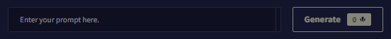

NovelAI 이미지 생성기 공식 가이드 문서 번역 2장 기본사항

AI/NovelAI/번역/가이드/Image Generation/사용법

2022.10.18 기준 공식 사이트 문서 번역

---

**2장 기본사항**

목차
- [1. 기본사항](#1-기본사항)
- [2. 내 프롬프트를 어떻게 표현하는가?](#2-내-프롬프트를-어떻게-표현하는가)
- [3. 이 세팅들은 다 무엇인가?](#3-이-세팅들은-다-무엇인가)
  - [3.1. 단계(Steps)](#31-단계steps)
  - [3.2. 규모(Scale)](#32-규모scale)
  - [3.3. 시드(Seed)란 무엇인가?](#33-시드seed란-무엇인가)
  - [3.4. 향상(Enhance)](#34-향상enhance)
- [4. 아직도 내 프롬프트를 어떻게 표현할지 모르겠습니다! 어떻게 해야 할까요?](#4-아직도-내-프롬프트를-어떻게-표현할지-모르겠습니다-어떻게-해야-할까요)
  - [4.1. 세대의 품질이 좋지 않으면 다음을 추가하십시오.](#41-세대의-품질이-좋지-않으면-다음을-추가하십시오)
  - [4.2. 초점(focus) / 주제](#42-초점focus--주제)
  - [4.3. 스타일 / 프레이밍 방법 / 아티스트 / 매체 / 시간 또는 시대](#43-스타일--프레이밍-방법--아티스트--매체--시간-또는-시대)
- [5. 그림 도구](#5-그림-도구)
- [6. 시간(Time) 또는 시대(Era)](#6-시간time-또는-시대era)
- [7. 오브젝트의 초점(focus)](#7-오브젝트의-초점focus)


# 1. 기본사항
1. 입력하고자 하는 프롬프트를 정합니다.
2. 다양한 결과를 편집, 생성 또는 향상시키기 위한 즐겨 찾기를 선택합니다.
3. (선택 사항) 이미지 편집 캔버스를 사용하여 텍스트 프롬프트, 생성 설정 또는 이미지 자체를 조정합니다.
4. 강도(Strength) 및 노이즈(Noise), 단계(Steps) 및 크기(Scale)를 조정해서, 텍스트 프롬프트를 좀더 정확하게 조정합니다
5. 다양한 결과를 도출하기 위해 다양하게 이미지 해상도 종횡비를 조정해 시도합니다.

이미 문제가 해결되었습니까? 고급 이미지 생성 방법을 시도해 봅시다: 이미지 업로드, 캔버스 사용 또는 프롬프트 혼합


# 2. 내 프롬프트를 어떻게 표현하는가?

- **산문체(Prose) vs 태그(Tagging)** : 프롬프트에 산문체를 사용하여 완성된 문장으로써 사물을 설명할 수 있지만 현재 시점에서 가장 효율적인 방법은 태그와 함께 주제를 설명하는 것입니다. AI는 사용자의 입력에 맞춰 비슷한 태그를 제안합니다.

- **토큰 제한(Token Limit)** : 컨텍스트 제한(Contaxt Limit) 표시줄을 확인하십시오! 프롬프트가 얼마나 남았는지 나타냅니다! 항상 그렇듯이 AI는 특정 수의 문자만 볼 수 있으므로, 지나치게 장황하고, 길게 태그가 지정된 설명으로는 향후 기술 발전이 있기 전까지는 당신이 목표하는 바에 도달하지 못할 수 있습니다.

   

   > 팁 : 프롬프트 텍스트 필드의 맨 오른쪽에 있는 게이지 막대를 확인하십시오! 텍스트 프롬프트 컨텍스트 크기의 한계에 얼마나 근접했는지 나타내는 표시이고, 천천히 채워집니다.

- **순서 문제(Order Matter)** : 주제와 태그의 순서를 바꿔보세요! 결과는 프롬프트에서 당신이 벡터들을 어디에 위치하느냐에 따라 크게 달라질 수 있습니다. 가장 중요한 요소는 프롬프트의 앞부분에 두는 것이 좋습니다.

- **강조(Emphasize)** : AI가 당신이 부여한 태그를 무시합니까? { }로 태그를 둘러싸면 해당 태그가 강화되고, [ ]로 둘러싸면 약화됩니다. 이것은 AI가 정말로 집중하기를 원하는 것을 다른 벡터들이 압도하는 문제를 해결할 수 있습니다!

   > 팁 : 프롬프트를 여러번 실험해 보는것을 적극 권장합니다. 일반적으로 생성하거나, 적은 양의 단계(Step)을 사용하여 당신이 목표하는 바에 가장 효과적으로 접근하는 단어를 확인하고, 다른 것들과 결합하여 당신이 선호하는 태그를 찾아보십시오.


# 3. 이 세팅들은 다 무엇인가?

## 3.1. 단계(Steps)

단계(Steps)는 프롬프트를 기반으로 처음 생성한 것으로부터 AI가 구체화 작업을 반복 실행하는 횟수를 정의합니다. 적은 양을 설정하여 이미지를 빠르게 생성하고 진행하는 방향을 확인하거나, 더 많은 단계를 설정하여 전체 이미지를 생성할 수 있습니다. 단계를 너무 많이 설정하면 비생산적일 수도 있고, 더 이상 세대를 개선할 수 없을 수도 있습니다. 사용되는 Anlas를 절약하고 싶으면 원하는 구성을 가진 세대를 찾을 때까지 단계를 비교적 낮게 유지한 다음, 추가 개선을 위해 Enhance 버튼을 사용합니다.

> 팁 : Enhance 는 계속해서 텍스트 프롬프트를 고려하므로, 텍스트 프롬프트를 조정함으로써 초기 생성 중에 부족하거나 무시되었던 영역에 집중시킬 수 있습니다.

## 3.2. 규모(Scale)

Scale 값은 AI가 프롬프트에 입력한 내용에 얼마나 부합할지와 얼마나 해석의 자유를 줄 것인지를 나타냅니다. 값이 높을수록 AI가 텍스트 프롬프트의 전체 의도에 더 가깝게 결과를 도출하는데 도움이 될 수 있지만, 너무 높게 설정하면 역효과가 발생할 수 있습니다. 값이 높을수록 더 많은 계산이 필요하고 생성하는데 더 오래 걸립니다!

때때로 Scale 값은 얼마나 더 정돈되고 선명한 최종 세대를 도출할지를 조정합니다. Scale 값이 낮을수록 더 회화적이고 몽환적이며 부드러울 수 있으며, Scale 값이 높을수록 더 세밀한 디테일과 선명도를 제공합니다.

## 3.3. 시드(Seed)란 무엇인가?

시드(Seed)는 AI가 당신의 개인적 이미지를 계산하는데 사용하는 특정 수치를 지정합니다. 각 무작위 세대에는 고유한 시드가 있습니다. 세대 위에 마우스를 놓고 왼쪽 하단의 시드 번호를 클릭하여 시드를 복사할 수 있습니다. 시드 번호는 다운로드한 세대의 파일 이름에서도 찾을 수 있습니다.

이전에 생성된 Seed를 적용하면 AI가 이전과 동일한 방향성을 가지고 생성하도록 도울 수 있습니다.

> 팁 : 한 세대의 시드는 해당 세대의 왼쪽 하단을 선택하면 항상 표시됩니다! 또한 저장된 파일의 Exif 데이터에서도 확인할 수 있습니다.

이전 세대의 시드를 찾으려면, 히스토리 바를 이용하여 원하는 세대 이미지를 찾아 왼쪽 하단에 보이는 숫자를 클릭하세요. 그러면 필요한 곳에 붙여넣을 수 있도록 시드가 자동으로 복사됩니다.

## 3.4. 향상(Enhance)

향상(Enhance)은 생성된 이미지를 재차 프로세스를 거쳐 이미지를 개선시키고, 프롬프트를 기반으로 진행합니다.

규모(Magnitude) 슬라이더는 강도(Strength) 및 노이즈(Noise) 값들을 조합한 것입니다. 규모 슬라이더를 사용하거나 "개별 설정 표시(Show Individual Settings)" 옵션을 선택하여 값을 직접 설정할 수 있습니다.

강도(Strength)를 높게 사용하면 AI가 이미지 구도를 변경할 수 있습니다. 강도를 낮게 사용하면 원래 세대에 더 가깝게 유지됩니다.

노이즈(Noise)를 사용하면 AI가 더 많은 세부 정보를 생성할 수 있지만 너무 높게 설정하면 이상한 아티팩트가 생성될 수 있습니다.


# 4. 아직도 내 프롬프트를 어떻게 표현할지 모르겠습니다! 어떻게 해야 할까요?

## 4.1. 세대의 품질이 좋지 않으면 다음을 추가하십시오.

당신의 프롬프트에 masterpiece, best quality, high quality 를 추가하세요. 더 높은 품질의 벡터 데이터를 가져와서 결과를 즉시 개선할 것입니다.

## 4.2. 초점(focus) / 주제

프롬프트의 초점(focus)은 세대의 전반부에 위치해 있어야 합니다. 예를 들어 마법사, 작은 새끼 고양이, 칼의 부딪침, 책 - 당신이 생각할 수 있는 모든 것이 당신이 원하는 이미지의 초점이어야 합니다. 놀라운 결과물을 가진 좀 더 난해한 세대를 원한다면, 뭐든지 마음 내키는 대로 입력하세요!

## 4.3. 스타일 / 프레이밍 방법 / 아티스트 / 매체 / 시간 또는 시대

스타일(Style)이나 프레이밍(Framing)을 추가하면 클로즈업, 인물화, 풍경, 광각 샷 등 당신의 주제에 AI의 비전을 집중시킬 수 있습니다. 또한 당신의 이미지의 스타일에 영향을 주는 기능도 있습니다.

예시 : 프롬프트 앞에 "portrait" 단어를 추가하면 훨씬 더 창의적인 구도와 역동적인 장면을 만들 수 있습니다.

```
portrait of a ...
```

당신은 항상 1x 로 세대의 개체를 정의하려고 할 수 있습니다.

# 5. 그림 도구

그림 도구를 정의하면 AI가 흥미로운 결과를 도출할 수 있습니다! 자신만의 독특한 태그를 시도하거나, 그림 도구를 입력하고 제안된 태그 중 일부를 확인하십시오!

예: 수채화(watercolor), 잉크(ink), 펜(pen), 코픽 마카(copics), 흑연(graphite), 수채화 연필(watercolor pencil), 스폿컬러(spot color) 등

> 팁: 섞어주세요! 다른 스타일을 결합하거나 독특한 그림 도구를 사용하여 놀라운 결과를 얻으십시오!


# 6. 시간(Time) 또는 시대(Era)

AI에 시간 정보를 제공하면 AI가 해당 요소를 이미지에 구현할 수 있습니다. 1990년대(1990s), 1980년대(1980s), 1800년대(1800s), 르네상스(renaissance), 로코코(rococo), 레트로 아트스타일(retro artstyle) 등. 팝업되는 태그 제안도 언제든지 확인할 수 있습니다!


# 7. 오브젝트의 초점(focus)

focus를 입력하면 AI가 세대가 가져야 할 초점 유형을 제안할 수 있습니다.
예: 동물 초점(animal focus), 눈 초점(eye focus), 구름 초점(cloud focus), 차량 초점(vehicle focus), 무기 초점(weapon focus), 소프트 초점(soft focus)

