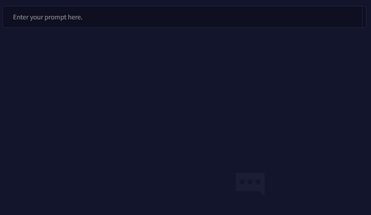
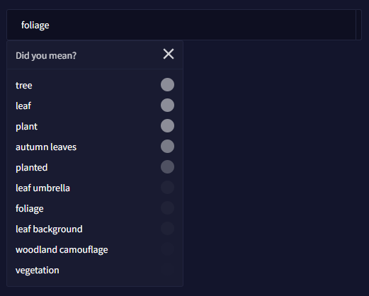

NovelAI 이미지 생성기 공식 가이드 문서 번역 3장 태깅

AI/NovelAI/번역/가이드/Image Generation/사용법

2022.10.18 기준 공식 사이트 문서 번역

---

**3장 태깅(Tagging)**

팀은 기존에 존재했던 이미지 모델 지식의 공백을 메우고 AI에게 태그에 대해 가르칠 기회를 잡았습니다!

이미지 생성 프롬프트를 입력하면 태그 제안이 나타납니다. 

완전히 재교육된 NovelAI Diffusion을 사용하면 생성할 주제에 대해 AI에게 훨씬 더 명확한 지침을 제공할 수 있습니다. AI는 특정 태그로 훈련되었기 때문에, 레이블이 지정된 정의를 훨씬 더 잘 인식할 수 있습니다.

# 태그 지식 지표

AI는 입력한 내용을 기반으로 태그를 제안하고, 각 태그에 대한 지식 수준을 나타내는 마커를 옆에 표시합니다.

태그 사용은 필수는 아니지만 AI를 원하는 방향으로 조종하는 데 중요한 역할을 할 수 있습니다. 이렇게 하면 모든 특성이 다른 여러 세대들을 거쳐도 일관성이 있다는 환상이 생깁니다.

> 메모 : NovelAI Diffusion 모델은 동일한 프롬프트와 시드를 사용하더라도 표준 Stable Diffusion 모델처럼 동일한 결과를 생성하지 않는다는 것을 명심하십시오.