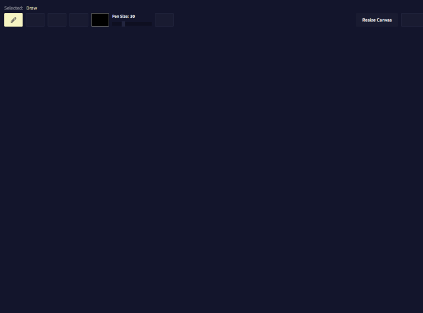
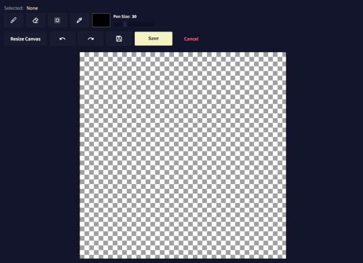
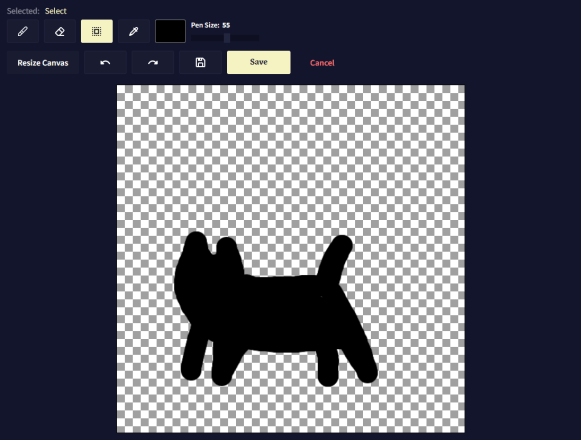
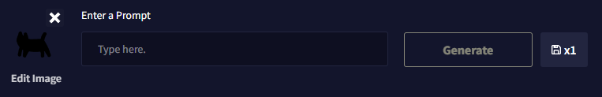

NovelAI 이미지 생성기 공식 가이드 문서 번역 7장 새 이미지를 그리기

AI/NovelAI/번역/가이드/Image Generation/사용법

2022.10.18 기준 공식 사이트 문서 번역

---
**7장 새 이미지를 그리기**

이미지를 업로드할 수 있을 뿐만 아니라 AI가 생성할 이미지와 주제를 그릴 수도 있습니다.

프롬프트 표시줄 위에 있는 새 이미지 그리기 버튼("Paint New Image")을 선택합니다. 이렇게 하면 캔버스가 열리고 외부 페인팅 소프트웨어를 사용할 필요가 없습니다(항상 외부 소스에서 만든 이미지를 업로드할 수 있습니다!).

**Canvas에서 편집하는 동안 사용할 수 있는 몇 가지 편리한 도구가 있습니다.**

- [Draw: The Pen Tool](#draw-the-pen-tool)
- [Erase : The Erase Tool](#erase--the-erase-tool)
- [Select : The Select Tool](#select--the-select-tool)
- [Color Picker : The Color Picker](#color-picker--the-color-picker)
- [The Color Pallette](#the-color-pallette)
- [Pen Size](#pen-size)
- [Resize Canvas](#resize-canvas)
- [Undo & Redo](#undo--redo)
- [Save File](#save-file)
- [Confirm](#confirm)
- [Cancel](#cancel)
- [Canvas로 그린 이미지를 생성하기 위한 팁](#canvas로-그린-이미지를-생성하기-위한-팁)

# Draw: The Pen Tool
Draw를 사용하면 업로드된 이미지 또는 이전 이미지 생성 위에 직접 캔버스에 AI에게 부여하는 가이드를 그려서 만들 수 있습니다. 펜 도구의 크기가 마음에 들지 않으면 오른쪽에 있는 펜 크기 슬라이더로 조정할 수 있습니다.

# Erase : The Erase Tool
지우기를 사용하면, 그려진 가이드에서 무엇이든 제거할 수 있습니다. 지우기 도구의 크기가 마음에 들지 않으면 오른쪽에 있는 펜 크기 슬라이더로 조정할 수 있습니다.

# Select : The Select Tool
선택을 사용하면 캔버스 어디에서나 이동할 수 있는 사각형을 자유롭게 그릴 수 있습니다.

# Color Picker : The Color Picker
그림의 아무 곳에서나 색상을 선택합니다. 이를 통해 색상 팔레트에서 올바른 값을 추측할 필요 없이 이미지의 모든 영역에서 색상을 신속하게 가져올 수 있습니다.

# The Color Pallette
색상 팔레트의 아무 곳이나 클릭하여 원하는 색상을 선택합니다.

# Pen Size
펜 크기 슬라이더를 편집하거나 크기 숫자를 클릭하고 원하는 숫자 값을 입력하여 펜 크기를 조정합니다.

# Resize Canvas
크기 값을 변경하여 캔버스 크기를 빠르게 조정하거나 가장자리 이동 필드를 사용하여 값을 수동으로 확장하거나 빼십시오.

# Undo & Redo
Canvas는 Canvas 이미지에 대한 모든 수정 사항을 기록하므로 원하는 경우 언제든지 변경 사항을 실행 취소 및 다시 실행할 수 있습니다.

# Save File
현재 Canvas 파일을 내보냅니다. 파일 저장 버튼 을 사용하여 언제든지 새로 그리거나 편집한 캔버스를 다운로드할 수 있습니다. 이미지 생성은 세션 기반 이며 종료하거나 다시 로드하면 모든 데이터가 손실되므로 캔버스 파일을 백업 하면 나중에 이미지 업로드 옵션의 파일로 캔버스 이미지를 사용할 수 있습니다.

# Confirm
캔버스에 대한 모든 변경 사항을 확인하고 이미지 생성 메뉴로 돌아갑니다. 이렇게 하면 캔버스가 닫히고 다음 이미지 생성을 위해 현재 이미지가 자동으로 사용됩니다. 프롬프트 입력 막대 옆에 있는 썸네일 보기에서 이를 확인할 수 있습니다.

# Cancel
캔버스에 대한 모든 변경 사항을 취소하고 이미지 생성 메뉴로 돌아갑니다. 이렇게 하면 모든 변경 사항이 취소되고 이미지 생성 메뉴로 돌아갑니다.

# Canvas로 그린 이미지를 생성하기 위한 팁

- 다음 세대의 강도(Strength) 및 노이즈(Noise)를 활용해 보십시오. 하나의 색상만 있는 큰 섹션을 사용하는 경우 그에 따라 노이즈 설정을 높여 AI에 텍스처 세부 정보를 제공할 수 있는 작업 기반을 제공해야 합니다.
- 많이 바꾸고 싶지 않으세요? 강도와 노이즈를 모두 0으로 낮추면 이미지가 영향을 받지 않고, 이미지를 재구성합니다. 이제 향상(Enhance) 기능을 사용하거나 다른 설정으로 놀 수 있습니다.
- 텍스트 프롬프트 고려: 다음 세대와 함께 작성하는 텍스트를 고려하는 것이 중요합니다. 이미지에 어떤 변형을 줄 것인지와 함께 이미지를 정확하게 설명하면 매우 좋은 결과를 볼 수 있습니다.

AI가 텍스트 입력을 더 많이 고려하도록 하려면 그에 따라 강도(Strength) 슬라이더와 스케일(Scale)을 높이십시오. AI가 당신이 올린 작업물 및 선택한 설정으로 수행하는 작업에 대한 적절한 미리보기를 얻으려면 낮은 수치의 단계(Steps)에서 다양한 슬라이더 강도를 테스트하십시오. 때로는 최소 10~15단계 정도는 해야 시도하기 좋은 미리보기와 센스를 제공할 수도 있습니다.
