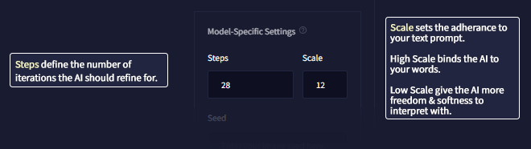

NovelAI 이미지 생성기 공식 가이드 문서 번역 8장 단계

AI/NovelAI/번역/가이드/Image Generation/사용법

2022.10.18 기준 공식 사이트 문서 번역

[원본 링크](https://docs.novelai.net/)

---
**8장 단계(Steps)**

단계(Steps)는 프롬프트를 기반으로 처음 생성한 것으로부터 AI가 구체화 작업을 반복 실행하는 횟수를 정의합니다. 적은 양을 설정하여 이미지를 빠르게 생성하고 진행하는 방향을 확인하거나, 더 많은 단계를 설정하여 전체 이미지를 생성할 수 있습니다. 단계를 너무 많이 설정하면 비생산적일 수도 있고, 더 이상 결과물을 개선할 수 없을 수도 있습니다. 사용되는 Anlas를 절약하고 싶으면 원하는 구성을 가진 결과물을 찾을 때까지 단계를 비교적 낮게 유지한 다음, 추가 개선을 위해 향상(Enhance) 버튼을 사용합니다.

> 팁 : 향상(Enhance)은 계속해서 텍스트 프롬프트를 고려하므로 부족한 부분에 집중하도록 프롬프트를 조정할 수 있습니다. 예를 들어 AI가 프롬프트의 일부를 무시하는 것처럼 보이는 경우 강화 기능을 반복 적용하여 선명도를 높이거나 결과물의 ​​초점(focus)을 이동할 수 있습니다.

- 단계 값 2 - 8: AI가 텍스트 프롬프트를 자유롭게 해석하도록 허용 
- 단계 값 9 - 13: 프롬프트는 약간의 안내 수준
- 단계 값 14 - 18: 텍스트 프롬프트를 준수 
- 단계 값 19+: 텍스트 프롬프트에 초점을 강하게 맞춤

# 스케일(Scale)

스케일(Scale) 값은 AI가 프롬프트에 응답하는 정도를 나타냅니다. 값이 클수록 AI가 텍스트 프롬프트의 전체 의도에 더 가깝게 유지되는 데 도움이 될 수 있지만 너무 높게 설정하면 역효과가 발생할 수 있습니다. 값이 높을수록 더 많은 계산이 필요하고 생성하는 데 더 오래 걸립니다.

때때로 Scale 값은 얼마나 더 정돈되고 선명한 최종 결과물을 도출할지를 조정합니다. Scale 값이 낮을수록 더 회화적이고 몽환적이며 부드러울 수 있으며, Scale 값이 높을수록 더 세밀한 디테일과 선명도를 제공합니다.