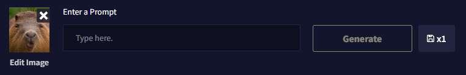
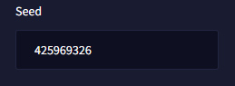

NovelAI 이미지 생성기 공식 가이드 문서 번역 13장 FAQ

AI/NovelAI/번역/가이드/Image Generation/사용법

2022.10.18 기준 공식 사이트 문서 번역

[원본 링크](https://docs.novelai.net/)

---
**13장 FAQ**

목차
- [1. 개인 데이터 관련](#1-개인-데이터-관련)
  - [1.1. 내 결과물이 저장되어 있습니까?](#11-내-결과물이-저장되어-있습니까)
  - [1.2. 내가 생성한 것을 누구나 볼 수 있습니까? 내 프롬프트, 이미지 업로드, 그림 또는 결과물을 추척합니까?](#12-내가-생성한-것을-누구나-볼-수-있습니까-내-프롬프트-이미지-업로드-그림-또는-결과물을-추척합니까)
  - [1.3. NovelAI는 업로드된 이미지 또는 캔버스 그림과 같은 img2img 데이터를 저장합니까?](#13-novelai는-업로드된-이미지-또는-캔버스-그림과-같은-img2img-데이터를-저장합니까)
  - [1.4. 내 결과물의 저작권은 누구에게 있습니까? 내 결과물을 수익화할 수 있습니까?](#14-내-결과물의-저작권은-누구에게-있습니까-내-결과물을-수익화할-수-있습니까)
  - [1.5. Novel AI 외부에서 제 결과물을 사용하려면 어떻게 합니까?](#15-novel-ai-외부에서-제-결과물을-사용하려면-어떻게-합니까)
  - [1.6. 이미지 생성기를 새로 고침했는데 모든것이 사라졌습니다! 왜죠?](#16-이미지-생성기를-새로-고침했는데-모든것이-사라졌습니다-왜죠)
- [2. 일반 팁](#2-일반-팁)
  - [2.1. 텍스트 프롬프트, 시드 또는 설정을 잃어버렸습니다! 복원할 수 있습니까?](#21-텍스트-프롬프트-시드-또는-설정을-잃어버렸습니다-복원할-수-있습니까)
- [3. 프롬프트 팁](#3-프롬프트-팁)
  - [3.1. 이전 프롬프트를 어떻게 복원할 수 있습니까?](#31-이전-프롬프트를-어떻게-복원할-수-있습니까)
  - [3.2. 반복되는 주제를 피하려면 어떻게 합니까?](#32-반복되는-주제를-피하려면-어떻게-합니까)
  - [3.3. 내 프롬프트의 주제가 희미해 보입니다. 어떡하죠?](#33-내-프롬프트의-주제가-희미해-보입니다-어떡하죠)
  - [3.4. 내 결과물에 서명이 있는 이유는 무엇입니까?](#34-내-결과물에-서명이-있는-이유는-무엇입니까)
  - [3.5. 내 텍스트 프롬프트의 대소문자가 중요합니까?](#35-내-텍스트-프롬프트의-대소문자가-중요합니까)
  - [3.6. 왜 모든 것이 동일한 이미지를 생성합니까?](#36-왜-모든-것이-동일한-이미지를-생성합니까)
  - [3.7. 사용자가 자신의 맞춤형 이미지 생성 모듈을 훈련할 수 있습니까?](#37-사용자가-자신의-맞춤형-이미지-생성-모듈을-훈련할-수-있습니까)
  - [3.8. AI가 작가의 작품을 베끼고 엮어주는건가요!?](#38-ai가-작가의-작품을-베끼고-엮어주는건가요)
- [4. 일반적인 질문들](#4-일반적인-질문들)
  - [4.1. 내 작업을 소셜 미디어에 게시하고 싶습니다! 사용할 수 있는 태그가 있습니까?](#41-내-작업을-소셜-미디어에-게시하고-싶습니다-사용할-수-있는-태그가-있습니까)

# 1. 개인 데이터 관련

## 1.1. 내 결과물이 저장되어 있습니까?

아니요, 당신의 결과물 중 어느 것도 저장되거나 저장되지 않습니다. 파일은 세션별로 생성됩니다. 생성된 이미지를 유지하려면 수동으로 다운로드해야 합니다. 그렇지 않으면 새로 고침 시 또는 이미지 생성 페이지를 나갈 때 생성된 이미지가 손실됩니다.

## 1.2. 내가 생성한 것을 누구나 볼 수 있습니까? 내 프롬프트, 이미지 업로드, 그림 또는 결과물을 추척합니까?

아니요, 귀하의 요청, 업로드, 편집 또는 생성은 당사 측에서 기록되거나 저장되지 않습니다.

## 1.3. NovelAI는 업로드된 이미지 또는 캔버스 그림과 같은 img2img 데이터를 저장합니까?

업로드한 이미지는 base64로 인코딩된 텍스트로 전송되어 생성을 요청하며 NovelAI에 저장되지 않습니다.

## 1.4. 내 결과물의 저작권은 누구에게 있습니까? 내 결과물을 수익화할 수 있습니까?

NovelAI는 귀하가 생성한 이미지에 대해 어떠한 소유권도 주장하지 않으며 서비스 외부에서 사용하여 발생하는 모든 책임을 포기합니다.

## 1.5. Novel AI 외부에서 제 결과물을 사용하려면 어떻게 합니까?

NovelAI는 파일에 대한 저작권 보호 또는 소유권을 주장하지 않습니다. 이미지는 서비스 약관의 섹션 1.4에 정의된 대로 컨텐츠로 취급됩니다. 생성된 이미지를 NovelAI 외부의 설정에 사용하려면 당신이 직접 자체적인 사전 조사를 수행해야 합니다.

## 1.6. 이미지 생성기를 새로 고침했는데 모든것이 사라졌습니다! 왜죠?

귀하의 결과물은 세션 기반입니다. 닫으면 모든 데이터가 제거되고 기록 대기열이 비워집니다 . 영구적으로 보관하고 싶은 컨텐츠는 자주 저장해 두세요!

# 2. 일반 팁

## 2.1. 텍스트 프롬프트, 시드 또는 설정을 잃어버렸습니다! 복원할 수 있습니까?

프롬프트 텍스트, 설정 및 결과물의 시드(seed)는 저장된 파일의 Exif 데이터를 통해서만 검색할 수 있습니다. 클립보드 내보내기 옵션을 사용하면 Exif 데이터가 포함되지 않습니다. 우클릭 & 저장으로 저장한 이미지 역시 Exif 데이터가 포함되어 있지 않으며, 저장 아이콘을 이용하여 데이터를 저장해야 합니다.

# 3. 프롬프트 팁

## 3.1. 이전 프롬프트를 어떻게 복원할 수 있습니까?

기록 표시줄(History Bar)에 이미지가 있는 경우 CTRL + 클릭을 사용하여 프롬프트와 이전 설정을 복원할 수 있습니다.

## 3.2. 반복되는 주제를 피하려면 어떻게 합니까?

반복되는 주제가 많은 경우 프롬프트에 주제를 지정하는 것도 도움이 될 수 있습니다. "1girl"(또는 "boy", "animal" 또는 뭐든 초점을 맞추고 싶은것), "solo" 또는 "single focus"와 같은 정의 태그를 추가해 보세요. , "couple focus" 등

## 3.3. 내 프롬프트의 주제가 희미해 보입니다. 어떡하죠?

결과물에 특별한 것이 부족하다고 생각되면 다음 태그를 추가해보십시오.

masterpiece, cinematic shot, highly detailed, dynamic angle, cinematic shadows, action shot, deep shadows, intricate details, award winning, beautifully lit, dramatic angle, intense angle, dynamic angle, cinematic lighting, cinematic angle, masterpiece portrait, dramatic angle, dramatic shadows 등.

## 3.4. 내 결과물에 서명이 있는 이유는 무엇입니까?

AI는 아티스트의 작품, 브랜딩 또는 특정 웹사이트에서 볼 수 있는 것과 같은 서명과 이미지 유형을 연결합니다. 사람이 하듯이 다양한 작품의 특징을 배웠습니다.

> 팁: "원하지 않는 컨텐츠" 텍스트 필드에 생성을 원하지 않는 주제를 추가하거나, 이미지 편집을 사용하여 일치하는 색상으로 영역을 칠하고 동일한 프롬프트를 다시 실행할 수 있습니다.

## 3.5. 내 텍스트 프롬프트의 대소문자가 중요합니까?

아니요. 텍스트 프롬프트의 기반이 되는 CLIP 임베딩은 대소문자를 구분하지 않습니다. 대문자 여부는 무시됩니다.

## 3.6. 왜 모든 것이 동일한 이미지를 생성합니까?

img2img 업로드 또는 편집된 캔버스를 사용중인지, 텍스트 프롬프트 입력 상자 왼쪽에 작은 썸네일이 표시되는지 다시 확인하십시오.

AI가 더 이상 조정할 수 없도록 동일한 시드를 생성했을 수도 있습니다. 사이드바를 살펴보고 필요한 경우 시드 번호를 제거하십시오.

## 3.7. 사용자가 자신의 맞춤형 이미지 생성 모듈을 훈련할 수 있습니까?

현재로서는 사용자가 자신의 이미지 모듈을 만들 수 있도록 허용하지 않을 계획입니다.

## 3.8. AI가 작가의 작품을 베끼고 엮어주는건가요!?

아니요, 그런식으로 작동하는게 아닙니다! 주제에 대한 몇 가지 훌륭한 설명은 다음을 참고해주십시오.

- [확산 기반 이미지 생성 설명](https://twitter.com/ai__pub/status/1561362542487695360)
- [Youtube의 Vox AI 아트 설명](https://www.youtube.com/watch?v=SVcsDDABEkM&feature=youtu.be)
- [AI는 자동 콜라주 기계가 아니다](https://threadreaderapp.com/thread/1564878372185989120.html)

# 4. 일반적인 질문들

## 4.1. 내 작업을 소셜 미디어에 게시하고 싶습니다! 사용할 수 있는 태그가 있습니까?
Twitter @novelaiofficial 과 같은 소셜 미디어에서 자유롭게 저희를 태그 하고 #NovelAI 또는 #NAIDiffusion으로 귀하의 결과물에 태그를 지정하여 귀하의 창작물의 여정을 따라갈 수 있도록 하십시오!