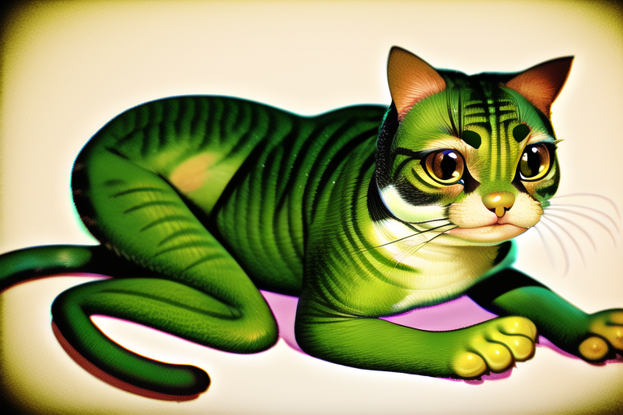
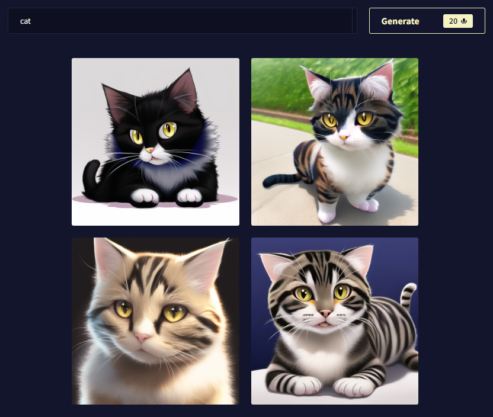
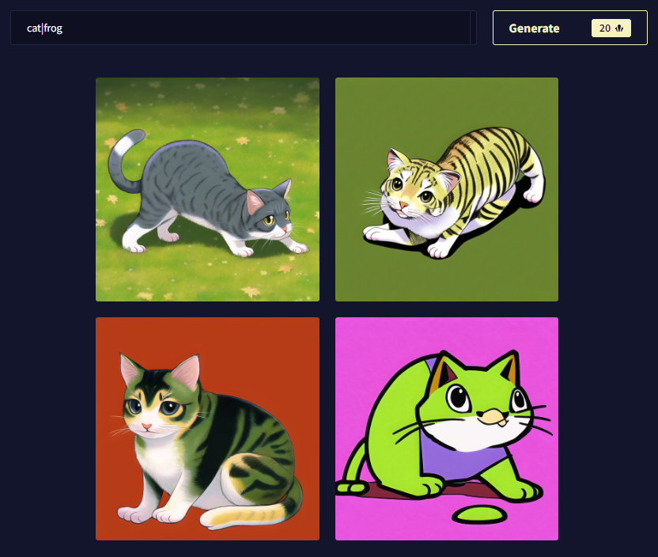
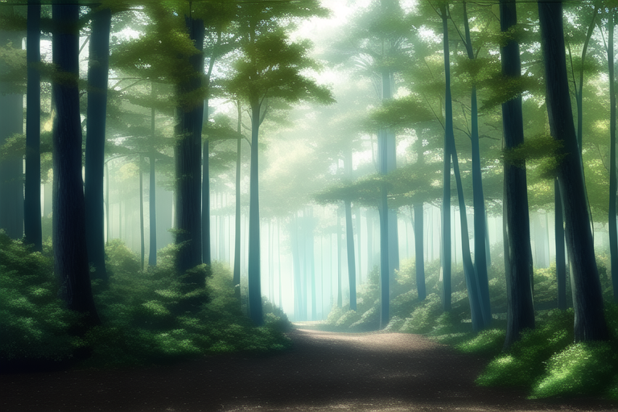
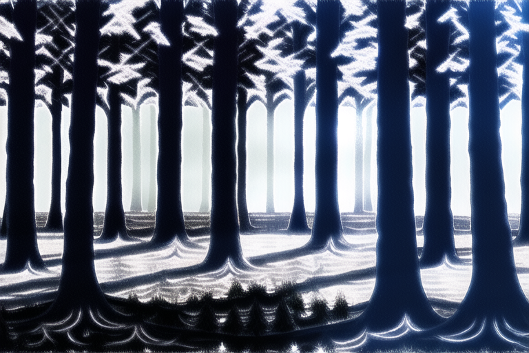

NovelAI 이미지 생성기 공식 가이드 문서 번역 14장 고급 : 프롬프트 혼합

AI/NovelAI/번역/가이드/Image Generation/사용법

2022.10.18 기준 공식 사이트 문서 번역

[원본 링크](https://docs.novelai.net/)

---
**14장 고급 : 프롬프트 혼합**


프롬프트 혼합은 서로 다른 두 프롬프트의 텍스트 벡터를 평균화합니다. 예를 들어 아티스트의 스타일을 삽입하고 싶지만 그것이 당신의 결과물에 너무 많은 영향을 미치고 싶지 않을 때 매우 유용합니다. 일부 태그는 프롬프트를 쉽게 압도하는 경향이 있습니다. 프롬프트 혼합을 사용하면 이 문제를 완화할 수 있습니다.

| 기호 앞이나 뒤에 공백은 필요하지 않습니다.

**예시:**

약간의 조정으로 당신도 완벽한 고양이 개구리를 가질 수 있습니다!



```
cat|frog
```





각 추가적인 이미지 프롬프트마다 AI가 이를 얼마나 중시할지, 프롬프트 뒤에 강도(Strength) 값을 추가할 수 있습니다. 값을 사용하지 않으면 기본값은 1입니다. **예:** :0.1 ~:100

매우 낮은 숫자의 음수 값은 이론적으로 벡터를 반전시켜야 합니다. 이건 아직 ​​테스트가 필요한 부분입니다. 음수 값 :-1은 항상 검은색 이미지를 생성합니다.

> 팁: 결과는 매우 다양하며, 음수 값을 동반한 프롬프트 혼합이 항상 간단한 것은 아닙니다. 일부 프롬프트에서 컨셉을 제거하면 매우 이상한 결과가 나타날 수 있습니다. 내부 테스트에서 우리는 :0.4 이상의 값은 다소 거슬리는 이미지를 생성한다는 것을 발견했습니다.

**예:** AI는 많은 녹지가 있는 단순한 숲 프롬프트를 렌더링하려고 합니다. 이 경우 조금 덜 건강한 숲을 목표로 해봅시다.



AI에게 프롬프트 "녹색(green)"에 대한 해석을 제거하도록 지시하면 훨씬 더 병약해 보이는 숲이 표시되지만 구성은 훨씬 더 답답하고 부자연스럽게 반복되는 것처럼 보입니다.



**예제 구문**

```
Prompt1|Prompt2 :0.3
```

> 참고: 이 숫자는 프롬프트 2의 강도에 해당하며, 아무 것도 주어지지 않으면 기본값은 1입니다.

**예**

```
cat:1|happy:-0.2|cute:-0:3
```