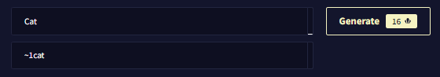

NovelAI 이미지 생성기 공식 가이드 문서 번역 16장 고급 : UI 기능

AI/NovelAI/번역/가이드/Image Generation/사용법

2022.10.18 기준 공식 사이트 문서 번역

[원본 링크](https://docs.novelai.net/)

---
**16장 고급 : UI 기능**

광범위한 이미지 생성을 좀 더 쉽게 만들기 위해 이미지 생성 UI를 확장하는 몇 가지 바로 가기를 추가했습니다.

# 프롬프트 텍스트 상자 확장
이것이 작동하려면 마우스 커서가 프롬프트 표시줄 안에 설정되어 있어야 합니다! **Shift + Enter** 는 행을 추가합니다. **Shift + 백스페이스** 는 행을 제거합니다.

# 프롬프트 혼합 텍스트 필드 확장
이것이 작동하려면 마우스 커서가 프롬프트 표시줄 안에 설정되어 있어야 합니다! **Ctrl + Shift + Enter** 를 눌러 프롬프트 혼합을 위한 추가 프롬프트 텍스트 필드를 만듭니다.

(역주 : **Ctrl + 백스페이스** 로 필드를 지울 수 있습니다. 가이드 원문에 없어서 직접 추가합니다.)

## 신속한 복제 + 확장
확장된 프롬프트 텍스트 필드의 텍스트 앞에 ~ 기호를 추가하면 생성 시 위의 프롬프트 + 아래 필드에 입력된 텍스트를 반복합니다.

> 참고: 첫 번째 태그를 입력할 때 AI가 자동 완성하도록 하면 ~ 기호가 제거될 수 있습니다!

