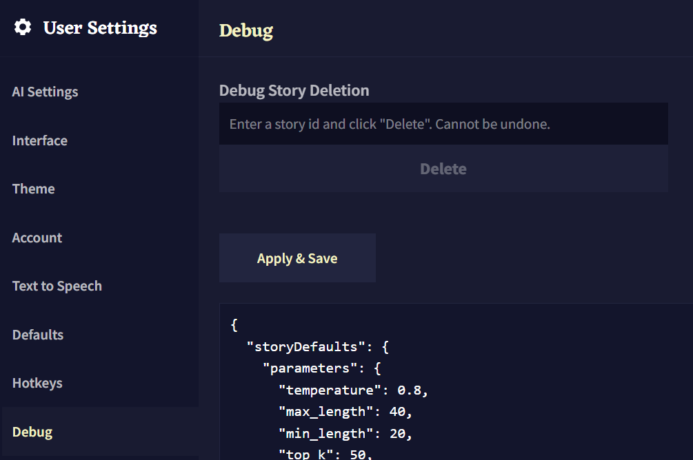

NovelAI 이미지 생성기 공식 가이드 문서 번역 17장 디버그 설정

AI/NovelAI/번역/가이드/Image Generation/사용법

2022.10.18 기준 공식 사이트 문서 번역

[원본 링크](https://docs.novelai.net/)

---
**17장 디버그 설정**

디버그 설정은 계정 문제를 해결하는 데 도움이 되는 고급 도구입니다. 일부 변경 사항은 의도하지 않은 영향을 미칠 수 있으므로 액세스할 때 주의하십시오!

# 디버그 설정 활성화
디버그 설정 메뉴를 활성화하려면 왼쪽 상단의 NovelAI 로고를 20번 클릭하십시오. 그러면 설정을 열고 디버그 설정에 액세스할 수 있습니다.

# 액세스할 수 없는 스토리 삭제
디버그 설정을 활성화하고 "디버그 스토리 삭제(Debug Story Deletion)" 옵션을 선택합니다. 영향을 받는 스토리가 선택되면 주소 표시줄에서 ID를 찾습니다. 

예시 : ?id=be6a65e2-d7c8-4218-bba3-1234a1234a3a 

디버그 필드에 ID를 입력하고 삭제를 클릭합니다. 새로고침하면 스토리가 사라집니다.