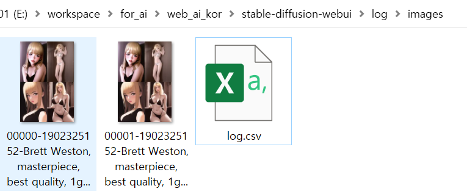
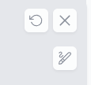

WebUI 기본 사용법 정리

AI/WebAI/StableDiffusion/사용법

목차
- [1. 통합팩 설치와 실행](#1-통합팩-설치와-실행)
- [2. 통합팩 전용 한글패치 설치](#2-통합팩-전용-한글패치-설치)
- [3. (참고) 통합팩 없이 직접 설치](#3-참고-통합팩-없이-직접-설치)
- [4. Web UI 내부 메뉴 별 설명](#4-web-ui-내부-메뉴-별-설명)
  - [4.1. 최상단 공통 UI](#41-최상단-공통-ui)
    - [4.1.1. Stable Diffusion 체크포인트 리스트](#411-stable-diffusion-체크포인트-리스트)
    - [4.1.2. Enable Autocomplete 체크박스](#412-enable-autocomplete-체크박스)
  - [4.2. 텍스트 -> 이미지(txt2img) 메뉴](#42-텍스트---이미지txt2img-메뉴)
    - [4.2.1. 프롬프트 입력란](#421-프롬프트-입력란)
    - [4.2.2. 프롬프트 입력 관련 편의기능](#422-프롬프트-입력-관련-편의기능)
    - [4.2.3. 샘플링 스텝 수, 샘플링 방법](#423-샘플링-스텝-수-샘플링-방법)
    - [4.2.4. 이미지 해상도](#424-이미지-해상도)
    - [4.2.5. 플러그인](#425-플러그인)
    - [4.2.6. 배치 수(Batch count), 배치 크기(Batch size)](#426-배치-수batch-count-배치-크기batch-size)
    - [4.2.7. CFG 스케일(CFG Scale)](#427-cfg-스케일cfg-scale)
    - [4.2.8. 시드(Seed)](#428-시드seed)
    - [4.2.9. 생성(Generate)](#429-생성generate)
    - [4.2.10. 결과창](#4210-결과창)
  - [4.3. 이미지 -> 이미지(img2img) 메뉴 - 이미지->이미지](#43-이미지---이미지img2img-메뉴---이미지-이미지)
    - [4.3.1. 프롬프트 입력란](#431-프롬프트-입력란)
    - [4.3.2. 참고 이미지 업로드 메뉴](#432-참고-이미지-업로드-메뉴)
    - [4.3.3. 리사이징 방법](#433-리사이징-방법)
    - [4.3.4. 샘플링 스탭 수, 샘플링 방법](#434-샘플링-스탭-수-샘플링-방법)
    - [4.3.5. 이미지 해상도](#435-이미지-해상도)
    - [4.3.6. CFG 스케일, 디노이즈 강도(Denoising strength)](#436-cfg-스케일-디노이즈-강도denoising-strength)
    - [4.3.7. 분석 버튼](#437-분석-버튼)
    - [4.3.8. 결과창](#438-결과창)
  - [4.4. 이미지 -> 이미지(img2img) 메뉴 - 인페인트](#44-이미지---이미지img2img-메뉴---인페인트)
    - [4.4.1. 인페인트용 이미지 업로드 메뉴](#441-인페인트용-이미지-업로드-메뉴)
    - [4.4.2. 마스크 설정 메뉴](#442-마스크-설정-메뉴)
  - [4.5. 이미지 -> 이미지(img2img) 메뉴 - 이미지->이미지 배치](#45-이미지---이미지img2img-메뉴---이미지-이미지-배치)
- [5. 각종 에러 상황에 대한 대처](#5-각종-에러-상황에-대한-대처)
  - [5.1. RuntimeError: CUDA out of memory](#51-runtimeerror-cuda-out-of-memory)
    - [5.1.1. 현상](#511-현상)
    - [5.1.2. 원인](#512-원인)
    - [5.1.3. 대처](#513-대처)
- [6. 프롬프트 모음](#6-프롬프트-모음)
  - [6.1. 메인 프롬프트](#61-메인-프롬프트)
    - [6.1.1. 통합팩 기본 메인 프롬프트](#611-통합팩-기본-메인-프롬프트)
  - [6.2. 부정 프롬프트](#62-부정-프롬프트)
    - [6.2.1. 통합팩 기본 부정 프롬프트](#621-통합팩-기본-부정-프롬프트)
    - [6.2.2. 중국발 부정 프롬프트](#622-중국발-부정-프롬프트)
- [7. 프롬프트, 설정 관련 유용한 외부 사이트](#7-프롬프트-설정-관련-유용한-외부-사이트)
  - [7.1. Deep Danbooru (프롬프트)](#71-deep-danbooru-프롬프트)
- [8. AI 그림 프롬프트 공유 사이트](#8-ai-그림-프롬프트-공유-사이트)
- [9. 기타 각종 설정 관련 짤 모음](#9-기타-각종-설정-관련-짤-모음)
- [10. 참고자료](#10-참고자료)


# 1. 통합팩 설치와 실행
[원본글 링크(아카라이브)](https://arca.live/b/aiart/60216616)

1. [Python 3.10.6](https://www.python.org/downloads/windows/) 설치. 설치 시 "Add Python to PATH" 옵션 반드시 선택.
2. [git](https://git-scm.com/download/win) 설치
3. "필수 설치파일"의 WEBUI.zip 을 웹 링크를 통해서 다운로드. 설치.ps1 (PowerShell) 실행해서 설치. 진행하다 보면 모델을 선택하라는 문구가 표시되는데, animefull-final-pruned 모델이 보편적으로 사용된다(19금 가능). 모델 종류에 대한 설명은 원본글을 참고. + 또 진행하다 보면 애드온(부가기능) 같은거 설치 여부를 묻는데 잘 모르겠으면 Y (yes) 입력하고 진행하자.
4. 설치가 완료되면 http://0.0.0.0:7860/ 문구가 나오고, http://127.0.0.1:7860/ Running 관련 문구가 나옴.


5. 현재 사용중인 PC의 로컬 호스트의 7860 포트를 통해 Web UI 서버가 동작 중이라는 것이므로 해당 주소로 접속하면 Web UI를 볼 수 있음.

6. 설치 이후에는 .tar 파일은 삭제해도 됨.

7. 향후 Web UI를 실행할 때는 webui가 설치된 폴더의 webui_user.bat 배치파일을 실행. (웹페이지는 자동으로 오픈됨)


# 2. 통합팩 전용 한글패치 설치
[원본글 링크(아카라이브)](https://arca.live/b/aiart/61057817)

통합팩 설치했으면 필요없지만, 나중에 한글패치 업데이트되면 아래 절차로 적용.


1. 구글 드라이브 링크에서 한글패치 json 파일 다운로드 [한글패치 링크(구글 드라이브)](https://drive.google.com/file/d/1ycx3cy_hLOQt04f5MK13XPJXyqALrcTk/view?usp=sharing)
2. webui 루트 폴더 / localizations 폴더에 해당 파일을 붙여넣기
   
3. Web UI 실행해서 설정 창으로 이동, 스크롤 내려서 Localization 설정을 찾은 후 ko-KR로 반드시 설정창 최상단의 "설정 적용하기" 버튼 클릭.
4. 변경된 설정 적용을 위해 Web UI 재시작. 한글패치 적용 확인.
5. 만약 이미 ko-KR로 적용되어 있어서, 한글패치 복붙해도 적용이 안된다면, Localization 설정을 None 으로 한번 변경 후 재시작, 그후 다시 ko-KR로 변경 후 재시작을 하면 적용됨.
6. 아무래도 설정 쪽은 번역이 안된 모양이다.


# 3. (참고) 통합팩 없이 직접 설치

[AUTOMATIC1111 GitHub 페이지](https://github.com/AUTOMATIC1111/stable-diffusion-webui)

참고로만 알아둘 것. 통합팩이 훨씬 편리함.

페이지의 Installation and Running -> Automatic Installation on Window 항목 참고 (2022.10.23 기준)

1. [Python 3.10.6](https://www.python.org/downloads/windows/) 설치. 설치 시 "Add Python to PATH" 옵션 반드시 선택.
2. [git](https://git-scm.com/download/win) 설치
3. 커맨드라인에서 아래 git 명령어 입력하고 github 링크로 리포지토리 clone 해서 받음
```
git clone https://github.com/AUTOMATIC1111/stable-diffusion-webui.git
```
4. 모델 체크포인트 파일들(확장자 .ckpt)를 models 폴더에 넣음
  
     [애니메 관련 모델 파일 리포지토리(Hugging Face)](https://huggingface.co/jcink0418/Arca2)
   - [animefull-final-pruned.tar](https://huggingface.co/jcink0418/Arca2/resolve/main/animefull-final-pruned.tar) : 일반적인 상황. 일반짤 ~ R-18까지 광범위 하게 사용가능
   - [animefull-latest.tar](https://huggingface.co/jcink0418/Arca2/resolve/main/animefull-latest.tar) : 일반적인 상황. 일반짤 ~ R-18까지 광범위 하게 사용가능. 중국발 부정 프롬프트 도배시 사용
   
   [runwayml의 stable-diffusion-v1-5 리포지토리](https://huggingface.co/runwayml/stable-diffusion-v1-5)
   - [v1-5-pruned.ckpt](https://huggingface.co/runwayml/stable-diffusion-v1-5/resolve/main/v1-5-pruned.ckpt)

5. 실행은 web-user.bat 으로 진행


# 4. Web UI 내부 메뉴 별 설명


## 4.1. 최상단 공통 UI


### 4.1.1. Stable Diffusion 체크포인트 리스트

webui 루트 폴더/models/Stable-diffusion 폴더에 있는 체크포인트 파일(확장자 ckpt)을 참고해서, 이미지 생성에서 사용할 모델을 설정하는 부분. 

### 4.1.2. Enable Autocomplete 체크박스


프롬프트 입력 시 자동완성 기능을 활성화/비활성화 체크박스


## 4.2. 텍스트 -> 이미지(txt2img) 메뉴


프롬프트 입력란에 기입된 텍스트(단어 혹은 문장)를 기반으로, AI 모델의 처리를 거쳐 이미지를 생성하는 기능이다.


### 4.2.1. 프롬프트 입력란

상단이 메인 프롬프트 입력란, 하단이 부정 프롬프트 입력란. 메인 프롬프트에 입력된 텍스트들을 기반으로 이미지를 생성하며, 이 과정에서 부정 프롬프트 입력란을 참고하여 부정적 요소를 제거하는 방향으로 처리가 진행된다.

### 4.2.2. 프롬프트 입력 관련 편의기능


프롬프트의 입력과 관련된 몇가지 편의기능이 제공되고 있다. 

**(1) 랜덤 아티스트 추가**


artists.csv 에 나열된 아티스트 이름 중 하나를 무작위로 선택해 프롬프트에 삽입한다.

**(2) 직전 프롬프트 불러오기**


프롬프트 란(메인 및 부정)이 비어있을 경우 바로 직전 세대(last generation)에서 사용되었던 프롬프트를 다시 가져와서 프롬프트 란을 채운다. 실수로 프롬프트 내용들을 삭제했을 경우의 편의기능이다.

프롬프트 란이 메인, 부정 모두 완전히 다 비어 있을때 제대로 동작한다.

**(3) 현재 사용된 프롬프트를 스타일로 저장**


현재 입력된 메인 및 부정 프롬프트 내용을 이름을 지정해서 스타일로서 styles.csv 파일에 저장한다. 저장된 스타일은 "생성(Generate)" 버튼 아래에서 스타일 지정 후 생성 기능 실행하면, 해당 스타일의 프롬프트 내용들과 현재 설정값(시드값 등)을 사용해서 이미지를 생성한다.

저장은 UI에서 가능하지만, 삭제는 styles.csv 파일을 직접 열어서 삭제해야 한다. 아래는 styles.csv 를 엑셀로 열어본 내용이다. 스타일 이름(name)과 메인 프롬프트(prompt), 부정 프롬프트(negative_prompt) 가 column 으로 설정되어 있다.


**(4) 현재 선택된 스타일을 프롬프트 입력란에 적용**


"생성(Generate)" 버튼 아래 있는 UI에서 선택한 스타일의 프롬프트 내용을 프롬프트 입력란에 적용한다.


### 4.2.3. 샘플링 스텝 수, 샘플링 방법


샘플링은 간단히 말해서 이미지를 만드는 과정이라고 생각하면 된다. AI가 이미지를 몇 스텝동안, 무슨 방식으로 만들어낼지 정하는 부분이다.

**(1) 샘플링 스텝 수**

스텝이 높을수록 퀄리티가 좋아지고(디테일, 화질이 좋아짐) 속도가 느려진다. SD 기본모델에서는 80, 90, 120까지도 돌려도 된다. 하지만 유출모델은 2D위주라 그런지 스텝이 너무 높으면 과잉계산?으로 퀄이 떨어지는 경우도 있으니 기본은 28로 놓고 늘리면서 자기 목표에 맞는 값을 찾을 것.


**(2) 샘플링 방법**

어떤 알고리즘을 통해서 이미지를 만들어낼거냐 하는것이다. 해외커뮤니티 많은 유저들은 Euler_a, DDIM을 가장 퀄리티 좋게 뽑힌다고 하니 이걸 쓰도록 하자.


### 4.2.4. 이미지 해상도

보이는 그대로 이미지의 해상도를 정한다(가로 및 세로). 해상도가 클수록 VRAM 점유와 결과 출력 속도가 느려진다. 인물의 경우 크기를 너무 크게 잡으면 인체구조가 박살나는 문제가 있다. 
유출판 기준 512 X 768을 놓고 보통 쓰는데 조금씩 바꿔가면서 써보자.


### 4.2.5. 플러그인


**(1) 얼굴 보정(Restore faces)**
얼굴 이상하게 나오는거 교정해주는 플러그인

**(2) 타일링(Tiling)**
닉값대로 뭔 이상한 타일 패턴이 나옴 그냥 없는셈쳐라

**(3) 고해상도 보정(Highres.fix)**
 해상도 커지면 인체 구조 박살나거나 그런 경우에 어느정도 잡아주는 플러그인

플러그인들은 전부 SD 기본모델용으로 만들어졌기 때문에 유출판이나 WD모델에서는 만족스러운 결과가 안나올 수 있으니 되면 좋고 안되면 말고 느낌으로 시도해보자

### 4.2.6. 배치 수(Batch count), 배치 크기(Batch size)


이미지는 1회 1장이 아니라 설정에 따라 여러장을 생성할 수 있으며, 이 설정으로 조절할 수 있다.

이미지 생성 작업 1번을 배치(Batch)라는 단위로 봤을때, 배치 수(batch count)는 배치의 갯수이고, 배치 크기(batch size)는 배치 1개에서 "동시작업"할 이미지 갯수를 의미한다. 

두 설정은 작업 단위와 내부 진행상의 차이는 있지만, 어쨌든 기본적으로 배치 수를 늘리거나, 혹은 배치 크기를 늘리거나 하면 여러장을 뽑을 수 있는 것이다. 1X4 혹은 4X1 모두 이미지 4장을 뽑아준다.

Web UI 콘솔창(webui_user.bat 파일 실행 시 표시되는 그 콘솔창)에서 로그를 보면 두 설정이 어떤 차이인지 알 수 있다.

배치 수를 4, 배치 크기를 1로 했을때의 Web UI 콘솔에 표기되는 로그를 확인해보면 아래와 같다.


배치 수를 1, 배치 크기를 4로 했을때의 Web UI 콘솔에 표기되는 로그를 확인해보면 아래와 같다.


시드 값(아래에서 설명)의 경우, 각 이미지마다 시드 값이 다르며, 최초 시드값에서 순서대로 +1, +2, +3 ...해서 각자 다른 형상의 이미지를 생성하는 식이다.

다만 이러한 점 때문에, 배치 수 X 배치 크기 로 봤을때 1X4, 4X1 로 뽑는것이 아니라, 2X4 혹은 4X2 등으로 설정하고 뽑을 경우 별도의 부가 설정 없이 기본적으로는 시드값을 중복으로 사용하여 중복된 결과물이 나오는 것을 볼 수 있다.

예를 들어 2X4 설정으로 진행했을때 최초 시드값이 703905855라면, 시드 값과 결과물 이미지는 아래와 같다. 시드값이 중복되었다면 결과도 중복으로 똑같다.

```
// 최초 시드값 : 703905855

// Batch 1
703905855 (최초 시드값 + 0 으로 시작)
703905856 (+1)
703905857 (+2)
703905858 (+3)

// Batch 2
703905856 (최초 시드값 + 1 으로 시작)
703905857 (+1)
703905858 (+2)
703905859 (+3)
```


### 4.2.7. CFG 스케일(CFG Scale)


AI가 유저가 넣은 프롬프트 입력값을 얼마나 따를지를 결정한다. 높으면 프롬프트에 나온 내용을 대체로 준수하면서 그림을 만들려고 하고, 낮으면 AI가 어느 정도 해석의 자유를 가지고 좀더 다양한 그림을 만들려고 한다.

너무 낮은값을 주면 프롬프트랑 별 상관없는게 나오게 되고 너무 높게 주면 너무 단순한 결과물(프롬프트 내용빼고는 아무것도 없다던가 그림체도 좀 투박한 느낌)을 내놓는다.

### 4.2.8. 시드(Seed)


시드(Seed) 값은 AI의 계산에 변수를 줘서 다양한 결과물이 나오게 유도하는 값이다. 다른 세팅값이 다 같아도 시드가 다르면 다른 결과물이 나온다. 좀더 정확히 말하면, 이미지 생성의 근간이 되는 최초의 노이즈 이미지를 생성할때 사용되는 값이고, 시드 값을 달리 할 때마다 샘플링 스텝 1단계에서의 최초의 노이즈 이미지가 다르다.

기본으로 -1(랜덤)로 설정되어있다. 여기에 특정 시드 값을 입력할 수 있다.


시드와 관련된 편의기능들이다.

(1) 랜덤값 설정(주사위 아이콘) : 랜덤 시드 설정값 (-1)을 시드 입력란에 넣는다.

(2) 직전 시드 값을 불러오기 (재활용 아이콘) : 직전 세대(last generation)에서 사용된 시드 값을 시드 입력란에 넣는다.

이미지 생성의 결과물 아래의 정보란에서 해당 이미지에 사용된 시드 값을 확인할 수 있다. 해당 시드 값을 직접 복사할수도 있고, 


다른 사람이 공유한 값을 쓰면 그 사람과 같은 결과물을 얻을 수 있는 기본을 갖추는것이다(다른 조건들도 같아야함).


### 4.2.9. 생성(Generate)


말 그대로, 프롬프트와 설정들을 가지고 이미지 생성 작업을 진행하는 버튼이다. 

스타일1, 스타일2는 styles.csv 파일에 저장된 스타일 목록을 보여주며, 스타일을 선택 후 생성을 실행하면 스타일에 설정된 프롬프트 내용과 현재 설정(시드 등)에 맞춰서 생성한다.


생성 버튼을 누르면 생성이 시작된다. 생성 작업 진행중에 표시되는 버튼들에 대해 알아보자.

(1) "중단(Interrupt)" : 생성 작업을 도중에 멈추는 기능이다.

(2) "건너뛰기(Skip)" : 설정으로 지정된 샘플링 스탭 수를 모두 진행하지 않고, 건너뛰기를 실행한 시점에서 스탭 진행을 중단하고 그대로 결과물을 출력한다.

샘플링 스텝 수를 28로 하고, 동일한 프롬프트와 시드 값을 설정하고, 도중에 건너뛰기를 실행한 경우와, 끝까지 작업을 실행한 경우의 결과물을 비교해보자. 건너뛰기를 실행한 경우엔 스텝을 끝까지 진행하지 않아 형태가 비교적 무너진 결과물을 보인다.

첫번째 예시이다.


두번째 예시에선 좀더 차이가 분명하다.


### 4.2.10. 결과창


**(1) 결과물 이미지**

프롬프트와 설정대로 AI가 생성한 이미지(혹은 이미지'들')이 표시되는 부분이다.


여러 장을 출력하도록 설정하면 이런 식으로 표시된다.

**(2) 저장(Save) 버튼**

기본 저장 경로는 (web ui 루트 폴더)/log/images 폴더이다. 폴더가 없으면 직접 만들어줘야 한다(폴더가 없으면 알아서 생성해준다). 



저장 시 해당 폴더에는, 현재 결과창에서 선택한 이미지(여러장 생성한 상태일 경우, 결과창에서 보고 있는 이미지)와 log.csv 파일이 출력된다. log.csv 파일은 이미지 생성에 사용됐던 프롬프트와 시드 등의 정보들을 담고 있는데, 한번 생성되면 계속 해당 파일에 데이터가 누적된다.

아래는 log.csv의 내용 일부이다.


**(3) 이미지->이미지로 전송(Send to img2img)**

현재 보고 있는 이미지를 이미지->이미지(img2img) 메뉴로 전송하고, 선택중인 메뉴를 이미지->이미지로 전환한다.

**(4) 인페인트로 전송(Send to inpaint)**

현재 보고 있는 이미지를 이미지->이미지(img2img) 메뉴 내부의 inpaint 기능으로 전송하고, 선택중인 메뉴를 이미지->이미지로 전환한다.

**(5) 부가기능으로 전송(Send to extras)**

현재 보고 있는 이미지를 부가기능(extras) 메뉴로 전송하고, 선택중인 메뉴를 부가기능 메뉴로 전환한다.

**(6) 이미지 자동 저장 폴더 열기**


생성된 이미지는 output/txt2img-images 폴더에 자동으로 생성된다. 여러장 생성시 그리드(grid) 형태로 보이는 이미지는 output/txt2img-grids 폴더에 따로 저장된다.

**(7) 생성된 이미지의 PNG 정보 확인**


결과창 하단부에 해당 이미지 생성에 사용된 프롬프트와 스텝, 시드 등의 설정, 그리고 소요 시간과 사용 VRAM 용량에 대한 텍스트가 표시된다.


## 4.3. 이미지 -> 이미지(img2img) 메뉴 - 이미지->이미지


프롬프트 입력란에 기입된 텍스트(단어 혹은 문장)에 더해서, 유저가 업로드한 참고 이미지를 기반으로, AI 모델의 처리를 거쳐 이미지를 생성하는 기능이다.

대체로 텍스트->이미지 메뉴 와 UI와 지원 기능은 거의 비슷하고, 참고 이미지를 업로드할 수 있다는 차이점과 몇가지 기능이 더 있다.

### 4.3.1. 프롬프트 입력란


텍스트->이미지 메뉴 설명 참고


### 4.3.2. 참고 이미지 업로드 메뉴


img2img 기능에서 프롬프트 텍스트와 함께 이미지 생성 처리에 참고할 이미지를 유저가 업로드할 수 있다. 대체로 이 이미지는 결과 이미지의 구도를 설정하고, 여기에 더해 프롬프트에 나열된 텍스트 요소들을 조합한다.


### 4.3.3. 리사이징 방법


참고 이미지를 Web UI에서 생성 전에 설정하는 결과 이미지 해상도에 맞추기 위해 크기 조정(resize)을 진행하는데, 그 방식에 대해 설정하는 부분이다.

- 리사이징(just resize) : 단순히 참고 이미지의 크기를 대상 해상도로 조정한다. 종횡비가 맞지 않는 결과물이 나올 수 있다.
- 잘라낸 후 리사이징(Crop and resize) : 참고 이미지의 크기를 종횡비를 유지하면서 조정하여 대상 해상도 전체를 채우고, 해상도 밖으로 튀어나온 부분을 자른다. 
- 리사이징 후 채우기(Resize and fill) - 참고 이미지의 크기를 종횡비를 유지하면서 대상 해상도에 완전히 맞도록 조정하고, 참고 이미지의 행/열에 따라 빈 공간을 채운다.

### 4.3.4. 샘플링 스탭 수, 샘플링 방법


텍스트->이미지 메뉴 설명 참고


### 4.3.5. 이미지 해상도


텍스트->이미지 메뉴 설명 참고


### 4.3.6. CFG 스케일, 디노이즈 강도(Denoising strength)


CFG 스케일은 텍스트->이미지 메뉴 설명 참고

디노이즈 강도(Denoising strength)라는 옵션이 이미지->이미지 메뉴에 추가적으로 있다. 이는 결과물 이미지 생성 처리 시작 전에,  유저가 업로드한 참고 이미지를 얼마나 참고할지 조절하는 설정이다.

0으로 설정하면 참고 이미지에서 아무 변화가 없는 결과물이 나오고, 1로 설정하면 참고 이미지에서 완전히 멀리 떨어진 결과물이 나온다.

따라서 CFG 스케일이 유저의 프롬프트 텍스트를 AI가 참고하는 정도를 조절한다면, 디노이즈 강도는 유저의 업로드 참고 이미지를 AI가 참고하는 정도를 조절한다고 이해하면 되겠다.

이는 Stable Diffusion 을 통한 이미지 생성 기본 원리와 관련있다.

텍스트->이미지 는 노이즈로 가득찬 참고 이미지를 Web UI에서 기본 제공하고, 여기에 유저가 입력한 프롬프트 텍스트를 기반으로 "노이즈를 어느정도 제거한" 결과물 이미지를 생성해주는 기능이다.

이미지->이미지 는 참고 이미지를 유저가 직접 업로드하고, 여기에 유저가 입력한 프롬프트 텍스트를 기반으로 "노이즈를 어느정도 제거한" 결과물 이미지를 생성해주는 기능이다.

따라서, 디노이즈 강도라는 것은 생성 처리할때 이 참고 이미지에 "노이즈"를 얼마나 강하게 주고 시작할지에 대한 수치인 것이다.


### 4.3.7. 분석 버튼


두 버튼 모두, 업로드한 참고 이미지를 설명하는 텍스트 혹은 태그를 프롬프트 입력란에 자동으로 채워넣기 위해 지원되는 기능들이다.

아래 이미지를 가지고 두 기능의 차이를 설명해보자.


**(1) CLIP 분석**

[CLIP Interrogator Github](https://github.com/pharmapsychotic/clip-interrogator)

CLIP(이미지를 분석해서 추천 텍스트를 출력하는 AI)를 사용해서, 유저가 업로드한 참고 이미지에서 추천 텍스트를 추출하는 기능이다.  실행하면 프롬프트 입력란에 loading... 텍스트 표시되고, 잠시 후 추천 텍스트를 프롬프트에 자동 입력된다.

아래는 예시 이미지를 CLIP으로 분석한 결과이다

```
a woman with blonde hair and a black bra top is posing for a picture with her hands on her hips, by Masaaki Sasamoto
```

**(2) DeepBooru 분석**

[Deepdanbooru 사이트](http://dev.kanotype.net:8003/deepdanbooru/)

유저가 업로드한 참고 이미지를 Danbooru 태그 기반으로 프롬프트 텍스트 추천해주는 기능이다. 실행하면 프롬프트 입력란에 loading... 텍스트 표시되고, 잠시 후 추천 태그가 프롬프트에 자동 입력된다.

아래는 예시 이미지를 DeepBooru로 분석한 결과이다

```
1girl, bangs, bare_shoulders, black_background, blonde_hair, breasts, cleavage, closed_mouth, collarbone, eyelashes, grey_eyes, lips, long_hair, looking_at_viewer, medium_breasts, simple_background, small_breasts, solo, upper_body
```

### 4.3.8. 결과창


텍스트->이미지 메뉴 설명 참고


## 4.4. 이미지 -> 이미지(img2img) 메뉴 - 인페인트


유저가 업로드한 참고 이미지의 특정 부분을 마스크 부분으로 설정하고, 해당 부분을 보완(inpaint) 처리하는 기능이다.

대부분 이미지->이미지 기능과 동일한 UI를 가지고 있기 때문에, 차이점 위주로 설명한다.

### 4.4.1. 인페인트용 이미지 업로드 메뉴


대체로 이미지->이미지 기능 쪽의 이미지 업로드와 동일하지만, 아래에서 설명할 마스크 설정을 "마스크 직접 그리기"로 설정할 경우, 인페인트 기능 적용을 위해 몇가지 기능이 우측 상단에 추가된다.



- 되돌리기(Undo) 기능
- 마스크 그리기 펜의 크기 조절 기능

이러한 기능들을 이용해서 별도의 마스크 이미지가 없어도 참고 이미지에서 마스크 부분을 그릴 수 있다.


### 4.4.2. 마스크 설정 메뉴


**(1) 마스크 블러**

이미지 생성 전, 마스크를 얼마나 블러처리할 지 결정하는 값. 픽셀 단위. 기본값은 4이다.

아래는 원본 이미지 + 마스크, 마스크 블러 4 결과, 마스크 블러 32(중간치) 결과의 비교이다. 


**(2) 마스크 직접 그리기 / 업로드**


마스크를 Web UI에서 제공하는 기능으로 직접 그릴수도 있고, 별도의 외부 그래픽 툴(포토샵 등)에서 직접 마스크용 이미지를 제작하여, 참고 이미지 + 마스크 이미지를 업로드해서 인페인트 처리할수 있다.

마스크 업로드하기 로 옵션을 변경할 경우, 이미지 업로드 메뉴가 참고 이미지 + 마스크 이미지 2개로 변경되며, 마스크 이미지의 흰색 부분을 인페인트 대상으로 인식한다. 조금이라도 흰색일 경우에도 인페인트 대상에 포함된다.

예를들면 아래와 같이 마스크 이미지를 올리면, 하단부 발 부분만 삭제된 결과물을 얻을수 있다.


**(3) 마스크된 부분 처리 옵션**


마스크로 설정된 부분을 어떤 식으로 채울 것인지를 정하는 부분이다. 기본값은 "원본 유지(Original)"이며, Web UI 공식 GitHub 페이지의 설명에서는 아래와 같이 차이점을 설명하고 있다.


**(4) 전체 해상도로 인페인트하기**

써본 적이 없기 때문에(+ 보통 상황에서는 쓸 일이 없기 때문에), Web UI GitHub 에서의 공식 설명으로 대체한다.

```
일반적으로 inpaint는 UI에서 지정된 목표 해상도로 이미지의 크기를 조정합니다. 최대 해상도가 활성화된 상태에서 inpaint를 실행할 경우, 마스크된 영역만 크기가 조정되고, 처리가 완료된 후 원래 사진에 다시 붙여넣습니다. 이렇게 하면 큰 그림을 대상으로 작업할 수 있고, inpaint 작업된 개체를 훨씬 더 큰 해상도로 렌더링할 수 있습니다.
```


## 4.5. 이미지 -> 이미지(img2img) 메뉴 - 이미지->이미지 배치


이미지->이미지 작업을 여러 참고 이미지에 대해서 1:1로 반복 처리하기 위한 기능이다. 인풋 이미지 경로에, 참고 이미지들을 모아둔 폴더 경로를 입력한다. 

이미지 저장 경로는 비워두면 이미지->이미지 기본 저장 경로인 outputs/img2img-images 폴더에 저장된다. 만약 별도의 경로로 지정하고 싶으면, 해당 경로의 폴더를 직접 만들어서 경로 지정하면 된다. (해당 경로의 폴더가 없을 경우 자동으로 만들어주지 않는다.) 이렇게 별도 지정할 경우 기본 저장 경로에는 이미지가 저장되지 않는다.

"생성" 버튼을 누르고 작업이 완료되어도 결과창에는 이미지가 표시되지 않는다. 하지만 기본 저장 경로 혹은 별도 지정한 경로로 가보면 결과 이미지들을 찾을 수 있다.

아래는 참고 이미지들과 그 결과 이미지들의 비교이다.


# 5. 각종 에러 상황에 대한 대처
## 5.1. RuntimeError: CUDA out of memory
### 5.1.1. 현상
이미지 생성 실행했는데 런타임 에러 표기됨. 

### 5.1.2. 원인
이미지 생성을 위해 할당할 수 있는 그래픽카드 잔여 메모리(VRAM) 부족으로 인한 에러. 

1. 진짜 그래픽카드 장치의 총 VRAM가 낮은 것이 원인.
2. 혹은 총 VRAM에 비해 용량이 너무 큰 모델을 선택해서 로드 중이라서 그만큼 잔여 VRAM 용량이 부족해진 것일 수 있다.
3. 생성하려는 이미지의 해상도가 클 경우에도 그만큼 생성 과정에서 VRAM을 차지한다.

"작업 관리자" -> "성능" 탭 -> GPU 0 을 선택하고 "전용 GPU 메모리"를 보면 잔여 메모리를 확인할 수 있다. 

예시)

그래픽카드 : RTX 3070 ti (VRAM 8GB)

사용 모델 : animefull-final-prunded.ckpt

Web UI : 일반 모드 (저사양 옵션 X)

아래는 생성을 아직 안했을때의 메모리 상태이다.


아래는 이미지 생성 과정에서 측정된 메모리 상태이다.


### 5.1.3. 대처
**(1) 그래픽카드 장치의 총 메모리가 낮은 경우의 대처**

실행용 배치파일(webui-user.bat)의 COMMANDLINE_ARGS에 --lowvram 옵션을 추가한다. (통합팩에서는 저사양용 배치파일이 이미 있다.)

일반 배치파일과 저사양용 배치파일의 COMMANDLINE_ARGS 부분을 비교해보자.

```
// 일반 배치파일
set COMMANDLINE_ARGS=--listen --deepdanbooru --autolaunch

// 저사양용 배치파일 
set COMMANDLINE_ARGS=--skip-torch-cuda-test --no-half --precision=full --listen --lowvram --deepdanbooru --autolaunch
```

AUTOMATIC1111의 web ui 공식 설명에서는 아래와 같이 대처방법이 기술되어 있음.
```
VRAM이 낮은 GPU에 대한 최적화. 이렇게 하면 4GB 메모리가 있는 비디오 카드에서 512x512 이미지를 생성할 수 있습니다.

--lowvram는 유저 basujindal 의 최적화 아이디어를 재구현한 것 입니다. 모델은 모듈들로 분리되며, GPU 메모리에는 하나의 모듈만 보관됩니다. 다른 모듈을 실행해야 하는 경우 이전 모듈이 GPU 메모리에서 제거됩니다. 이 최적화의 특성으로 인해 처리가 느리게 실행됩니다. RTX 3090에서 일반 작업에 비해 약 10배 더 느립니다.

--medvram는 동일한 배치(batch)에서 조건부 및 무조건 노이즈 제거 처리를 하지 않음으로써 VRAM 사용량을 크게 줄이는 또 다른 최적화입니다.

이 최적화 구현에서는 원본 Stable Diffusion 코드를 수정할 필요가 없습니다.
```

**(2) 용량이 좀더 적은 모델을 선택한다**

Stable Diffusion 체크포인트 메뉴에서 현재 모델보다 더 용량이 적은 모델을 선택 후 Web UI 재시작한다.


**(3) 생성하려는 이미지 해상도를 줄인다**

512 X 768을 놓고 보통 쓰는데 이보다 크거나 같은데 용량 부족이 발생한다면 해상도를 줄여보자.


# 6. 프롬프트 모음

## 6.1. 메인 프롬프트

### 6.1.1. 통합팩 기본 메인 프롬프트
```
masterpiece, best quality
```


## 6.2. 부정 프롬프트

### 6.2.1. 통합팩 기본 부정 프롬프트
```
lowres, bad anatomy, bad hands, text, error, missing fingers, extra digit, fewer digits, cropped, worst quality, low quality, normal quality, jpeg artifacts, signature, watermark, username, blurry, artist name
```

### 6.2.2. 중국발 부정 프롬프트
이 때는 모델을 animefull-latest로 사용.
```
multiple breasts, (mutated hands and fingers:1.5), (long body :1.3), (mutation, poorly drawn :1.2), black-white, bad anatomy, liquid body, liquid tongue, disfigured, malformed, mutated, anatomical nonsense, text font ui, error, malformed hands, long neck, blurred, lowers, low res, bad anatomy, bad proportions, bad shadow, uncoordinated body, unnatural body, fused breasts, bad breasts, huge breasts, poorly drawn breasts, extra breasts, liquid breasts, heavy breasts, missing breasts, huge haunch, huge thighs, huge calf, bad hands, fused hand, missing hand, disappearing arms, disappearing thigh, disappearing calf, disappearing legs, fused ears, bad ears, poorly drawn ears, extra ears, liquid ears, heavy ears, missing ears, fused animal ears, bad animal ears, poorly drawn animal ears, extra animal ears, liquid animal ears, heavy animal ears, missing animal ears, text, ui, error, missing fingers, missing limb, fused fingers, one hand with more than 5 fingers, one hand with less than 5 fingers, one hand with more than 5 digit, one hand with less than 5 digit, extra digit, fewer digits, fused digit, missing digit, bad digit, liquid digit, colorful tongue, black tongue, cropped, watermark, username, blurry, JPEG artifacts, signature, 3D, 3D game, 3D game scene, 3D character, malformed feet, extra feet, bad feet, poorly drawn feet, fused feet, missing feet, extra shoes, bad shoes, fused shoes, more than two shoes, poorly drawn shoes, bad gloves, poorly drawn gloves, fused gloves, bad cum, poorly drawn cum, fused cum, bad hairs, poorly drawn hairs, fused hairs, big muscles, ugly, bad face, fused face, poorly drawn face, cloned face, big face, long face, bad eyes, fused eyes poorly drawn eyes, extra eyes, malformed limbs, more than 2 nipples, missing nipples, different nipples, fused nipples, bad nipples, poorly drawn nipples, black nipples, colorful nipples, gross proportions. short arm, (((missing arms))), missing thighs, missing calf, missing legs, mutation, duplicate, morbid, mutilated, poorly drawn hands, more than 1 left hand, more than 1 right hand, deformed, (blurry), disfigured, missing legs, extra arms, extra thighs, more than 2 thighs, extra calf, fused calf, extra legs, bad knee, extra knee, more than 2 legs, bad tails, bad mouth, fused mouth, poorly drawn mouth, bad tongue, tongue within mouth, too long tongue, black tongue, big mouth, cracked mouth, bad mouth, dirty face, dirty teeth, dirty pantie, fused pantie, poorly drawn pantie, fused cloth, poorly drawn cloth, bad pantie, yellow teeth, thick lips, bad camel toe, colorful camel toe, bad asshole, poorly drawn asshole, fused asshole, missing asshole, bad anus, bad pussy, bad crotch, bad crotch seam, fused anus, fused pussy, fused anus, fused crotch, poorly drawn crotch, fused seam, poorly drawn anus, poorly drawn pussy, poorly drawn crotch, poorly drawn crotch seam, bad thigh gap, missing thigh gap, fused thigh gap, liquid thigh gap, poorly drawn thigh gap, poorly drawn anus, bad collarbone, fused collarbone, missing collarbone, liquid collarbone, strong girl, obesity, worst quality, low quality, normal quality, liquid tentacles, bad tentacles, poorly drawn tentacles, split tentacles, fused tentacles, missing clit, bad clit, fused clit, colorful clit, black clit, liquid clit, QR code, bar code, censored, safety panties, safety knickers, beard, furry,pony, pubic hair, mosaic, excrement, faeces, shit, futa, testis
```


# 7. 프롬프트, 설정 관련 유용한 외부 사이트

## 7.1. Deep Danbooru (프롬프트)


http://dev.kanotype.net:8003/deepdanbooru/
2D 이미지에서 Danbooru 기반 프롬프트 텍스트 추천


# 8. AI 그림 프롬프트 공유 사이트
https://lexica.art/


검색 란에 원하는 바와 비슷한 그림 올리면, 비슷한 AI 그림들과 사용 프롬프트 표시됨


# 9. 기타 각종 설정 관련 짤 모음


# 10. 참고자료

[AUTOMATIC1111의 WEB UI Github 링크](https://github.com/AUTOMATIC1111/stable-diffusion-webui)

[AUTOMATIC1111의 WEB UI Github 위키](https://github.com/AUTOMATIC1111/stable-diffusion-webui/wiki)

[SD RESOURCE GOLDMINE](https://rentry.org/sdupdates)

[Hugging Fate(SD 모델 파일 배포처)](https://huggingface.co/)

[인공지능 기본 - GAN 과 Diffusion model, Generative Model](https://arca.live/b/aiart/59916341)

[webui 튜토리얼 txt2img 기능설명 기초(아카라이브)](https://arca.live/b/aiart/60273123)