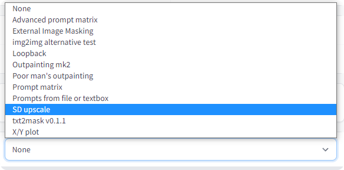

Stable Diffusion Web UI Github 위키 번역 1장 기능(Features)

AI/WebUI/Stable Diffusion/

[원본 링크](https://github.com/AUTOMATIC1111/stable-diffusion-webui/wiki/Features)

---
**1장 기능(Features)**

목차
- [Outpainting](#outpainting)
- [Inpainting](#inpainting)
  - [Inpainting 모델](#inpainting-모델)
  - [마스크 콘텐츠 (Masked content)](#마스크-콘텐츠-masked-content)
  - [최대 해상도에서 inpaint](#최대-해상도에서-inpaint)
  - [마스크 모드 (Masking mode)](#마스크-모드-masking-mode)
  - [알파 마스크(Alpha mask)](#알파-마스크alpha-mask)
- [프롬프트 매트릭스(Prompt matrix)](#프롬프트-매트릭스prompt-matrix)
- [컬러 스케치(Color Sketch)](#컬러-스케치color-sketch)
- [Stable Diffusion 이미지 업스케일링(upscale)](#stable-diffusion-이미지-업스케일링upscale)
- [주의(Attention) / 강조(Emphasis)](#주의attention--강조emphasis)
- [루프백](#루프백)
- [X/Y 플롯](#xy-플롯)
  - [프롬프트 S/R](#프롬프트-sr)
- [텍스트 반전(Texture Inversion)](#텍스트-반전texture-inversion)
- [크기 조정(Resizing)](#크기-조정resizing)
- [샘플링 방법 선택(Sampling method selection)](#샘플링-방법-선택sampling-method-selection)
- [시드 크기 조정(Seed resize)](#시드-크기-조정seed-resize)
- [변형(Variations)](#변형variations)
- [스타일(Styles)](#스타일styles)
- [부정적인 프롬프트(Negative prompt)](#부정적인-프롬프트negative-prompt)
- [CLIP 인터로게이터 (CLIP interrogator)](#clip-인터로게이터-clip-interrogator)
- [프롬프트 편집](#프롬프트-편집)
  - [대체 단어](#대체-단어)
- [고해상도 수정(Highres. fix)](#고해상도-수정highres-fix)
- [중지(Interrupt)](#중지interrupt)
- [4GB 비디오 카드 지원(4GB videocard support)](#4gb-비디오-카드-지원4gb-videocard-support)
- [얼굴 복원(Face restoration)](#얼굴-복원face-restoration)
- [저장(Saving)](#저장saving)
- [로딩 중(Loading)](#로딩-중loading)
- [프롬프트 검증(Prompt validation)](#프롬프트-검증prompt-validation)
- [PNG 정보](#png-정보)
- [설정](#설정)
- [파일 이름 형식(FileNames Format)](#파일-이름-형식filenames-format)
- [사용자 스크립트(User scripts)](#사용자-스크립트user-scripts)
- [UI 구성(UI Config)](#ui-구성ui-config)
- [ESRGAN](#esrgan)
- [img2img 대체 테스트](#img2img-대체-테스트)
- [user.css](#usercss)
- [notification.mp3](#notificationmp3)
- [조정(Tweaks)](#조정tweaks)
  - [CLIP 모델의 마지막 레이어 무시](#clip-모델의-마지막-레이어-무시)

이것은 Stable Diffusion Web UI의 기능 쇼케이스 페이지입니다.

# Outpainting

Outpainting은 원래 이미지를 확장하고, 생성된 빈 공간을 보완(inpaint)합니다.

예:


4chan에서 익명 사용자가 제공한 원본 이미지. 감사합니다, 익명의 사용자 님.

이 기능은 하단의 "img2img" 탭에서 "Script" -> "Poor man's outprinting" 아래에 있습니다.

Outpainting은 일반 이미지 생성과 다르게, 단계 카운트(Step Count)가 크면 클수록 많은 이익을 얻을 수 있습니다. 좋은 Outpainting을 위한 레시피에는 그림과 매칭되는 적절한 프롬프트, 최대값으로 설정된 노이즈 제거(Denoising) 및 CFG 스케일(Scale) 슬라이더, 그리고 단계 카운트(Step Count) 50~100, 오일러 조상(Euler Ancestral) 또는 DPM2 조상 샘플러(Ancestral samplers)가 필요하다.


# Inpainting

img2img 탭에서, 이미지의 일부 위에 마스크를 그려넣으면, 해당 부분이 덧칠됩니다(inpaint).


inpainting을 위한 옵션들 :

- 웹 에디터에서 직접 마스크를 그립니다.
- 외부 에디터에서 사진의 일부를 지우고 투명한 사진을 업로드합니다. 조금이라도 투명한 영역은 마스크의 일부가 됩니다. 일부 에디터는 기본 설정으로 완전히 투명한 영역을 검은색으로 저장한다는 것을 주의해주세요.
- 모드(사진 오른쪽 아래)를 "마스크 업로드(Upload mask)"로 변경하고, 별도로 준비된 마스크용 흑백 이미지를 선택합니다(흰색 = inpaint 대상).

## Inpainting 모델

RunwayML은 Inpainting을 위해 특별히 설계된 추가 모델을 훈련했습니다. 이 모델은 추가 입력(노이즈와 마스크가 없는 초기 이미지)을 허용하며 작업에서 훨씬 더 나은 것 같습니다. 모델에 대한 다운로드 및 추가 정보는 여기를 참고해주세요 : https://github.com/runwayml/stable-diffusion#inpainting-with-stable-diffusion

모델을 사용하려면 파일 이름이 inpainting.ckpt로 끝나도록 체크포인트의 이름을 바꿔야 합니다(예: 1.5-inpainting.ckpt). 

그런 다음 보통 체크포인트를 선택하는 것처럼 체크포인트를 선택하면 됩니다.

## 마스크 콘텐츠 (Masked content)
마스크 컨텐츠(Masked content) 필드에 기입한 내용은, inpaint 작업하기 전에 마스크된 영역에 채워넣을 내용을 결정합니다.


## 최대 해상도에서 inpaint

일반적으로 inpaint는 UI에서 지정된 목표 해상도로 이미지의 크기를 조정합니다. 최대 해상도가 활성화된 상태에서 inpaint를 실행할 경우, 마스크된 영역만 크기가 조정되고, 처리가 완료된 후 원래 사진에 다시 붙여넣습니다. 이렇게 하면 큰 그림을 대상으로 작업할 수 있고, inpaint 작업된 개체를 훨씬 더 큰 해상도로 렌더링할 수 있습니다.


## 마스크 모드 (Masking mode)

마스크 모드(Masking mode) 에는 다음 두 가지 옵션이 있습니다.

- Inpaint masked - 마스크 아래의 영역이 inpaint 됩니다.
- Inpaint not masked - 마스크 아래는 변경되지 않고, 다른 모든 부분이 inpaint 됩니다.

## 알파 마스크(Alpha mask)


# 프롬프트 매트릭스(Prompt matrix)

기호 | 를 사용하여 여러 프롬프트들을 구분하면, 시스템은 이것들을 모두 조합한 결과에 근거하여 이미지를 생성합니다. 예를 들어, <code>a busy city street in a modern city|illustration|cinematic lighting</code> 프롬프트를 사용하면, 다음 4가지 조합이 있을 수 있습니다(프롬프트의 첫 부분은 항상 유지됩니다).

a busy city street in a modern city
a busy city street in a modern city, illustration
a busy city street in a modern city, cinematic lighting
a busy city street in a modern city, illustration, cinematic lighting

아래 순서로 4개의 이미지가 생성되는데, 모두 동일한 시드(Seed)이고 각 프롬프트에 대응하고 있습니다.


다른 예시로, 이번에는 5개의 프롬프트로 16개의 바리에이션이 생성되었습니다.


이 기능은 "Script -> Prompt matrix"에서 찾을 수 있습니다.


# 컬러 스케치(Color Sketch)

img2img의 기본 컬러링 도구입니다. 이 기능을 사용하려면, 커맨드 라인(Command line)의 매개변수 값으로 <code>--gradio-img2img-tool color-sketch</code>를 사용하여 활성화하십시오. txt2img을 통해서 전송하는 것은 브라우저의 심각한 렉을 유발하므로, 그 대신 이미지를 업로드하는 식으로 진행하십시오. 크롬 기반 브라우저는 드래그 앤 드롭 도구를 지원합니다. (그림 참조)


# Stable Diffusion 이미지 업스케일링(upscale)

RealESRGAN/ESRGAN을 사용하여 이미지를 업스케일링(upscale)하고 나서 타일(tile) 단위로 그 결과물을 img2img로 개선합니다. 이 또한 외부 프로그램에서 사용자가 직접 업스케일링할 부분을 지정해서, img2img를 사용하여 타일 단위로 개선할 수 있는 옵션도 있습니다.

[오리지널 아이디어](https://github.com/jquesnelle/txt2imghd) (이것은 별개로 구현된 부분입니다.)

이 기능을 사용하려면, <code>SD upscale from the scripts dropdown selection</code>를 선택합니다(img2img 탭에서).



입력한 이미지가 원본의 너비 및 높이의 두 배까지 확대됩니다. 또한 UI의 너비 및 높이 슬라이더는 개별 타일들의 크기를 지정합니다. 겹침 현상 때문에, 타일의 크기 지정이 매우 중요할 수 있습니다 : 512x512 이미지에는 9개의 512x512 타일이 필요할 수도 있고(겹침 현상 때문에), 4개의 640x640 타일이 필요할 수도 있습니다.

업스케일링에 권장되는 파라미터:

- 샘플링 방법(Sampling method) : Euler a
- 노이즈 제거 강도(Denoising strength) : 0.2, 좀더 모험을 해보려면 최대 0.4까지 올려도 됩니다


# 주의(Attention) / 강조(Emphasis)
프롬프트에 () 기호를 사용하면, 기호에 감싸인 단어에 대한 모델의 주의를 높입니다. 반대로 [] 기호는 주의를 감소시킵니다. 수식자는 여러 개를 조합할 수 있습니다.


치트 시트:

- <code>a (word)</code> : word에 대한 주의를 1.1배 높입니다.
- <code>a ((word))</code> : word에 대한 주의를 1.21(= 1.1 * 1.1)배 높입니다.
- <code>a [word]</code> : word에 대한 주의를 1.1배 낮춥니다.
- <code>a (word:1.5)</code> : word에 대한 주의를 1.5배 높입니다.
- <code>a (word:0.25)</code> : word에 대한 주의를 4배 낮춥니다. (1 / 0.25)
- <code>a \(word\)</code> : ()를 리터럴 문자로서 프롬프트에서 사용합니다.
  
()와 함께, 가중치는 (text:1.4) 이런 식으로 수치를 지정할 수 있습니다. 가중치가 지정되지 않은 경우 1.1로 가정합니다. 가중치를 직접 지정하는 것은 ()로만 가능하고 []로는 할 수 없습니다.

()와 []를 리터럴 문자 중 하나로 사용하고 싶은 경우, 백슬래시를 사용하여 이스케이프합니다. <code>anime_\(character\)</code>.

2022-09-29 에는 이스케이프 문자와 수치 가중치를 지원하는 새로운 구현이 추가되었습니다. 이전 구현은 완벽하지 않아 "a (((farm))), daytime"을 "a farm daytime"같이 콤마를 떼어버리는 등 일부 문자를 지워버리기도 했습니다. 이 동작은 모든 텍스트를 올바르게 보존하는 새로운 구현에서는 공유되지 않습니다. 즉, 당신이 이전 구현에서 저장해둔 시드가 현재 구현에서는 다른 그림을 생성할 수도 있다는 것입니다. 현시점에서는, 이전의 구현을 사용한다는 옵션도 제공하고 있습니다.

NAI는 2022-09-29 이전부터 구현된 것을 사용하고 있습니다. 단, 곱셈할때 쓰는 수치가 1.05이고, () 대신 {}를 사용하고 있습니다. 따라서 각자의 방식을 변환해보면 아래와 같이 됩니다. (그들 : NAI, 우리 : WebUI)

- 그들의 <code>{word}</code> = 우리의 <code>(word:1.05)</code>
- 그들의 <code>{{word}}</code> = 우리의 <code>(word:1.1025)</code>
- 그들의 <code>[word]</code> = 우리의 <code>(word:0.952)</code> (0.952 = 1/1.05)
- 그들의 <code>[[word]]</code> = 우리의 <code>(word:0.907)</code> (0.907 = 1/1.05/1.05)

# 루프백

img2img에서 루프백 스크립트를 선택함으로써, 결과물 이미지를 다음 출력을 위한 입력 이미지로서 자동으로 공급할 수 있습니다. 출력 이미지를 저장하고 입력 이미지를 대체하는 것을 한꺼번에 합니다. 배치 카운트(Batch count) 설정은 얼마나 많은 반복을 진행할지를 제어합니다.

일반적으로 이 작업을 수행할 때, 다음 반복을 위해 많은 이미지 중 하나를 당신이 직접 선택하곤 하기 때문에, 이 기능의 유용성이 의심스러울 수 있지만 이 기능으로 기존에 얻을 수 없었던 아주 좋은 출력을 얻을 수 있습니다. 

예시: (엄선된 결과)


4chan의 익명 사용자의 원본 이미지입니다. 익명 사용자님, 감사합니다.

# X/Y 플롯

다양한 매개변수를 사용하여 이미지 그리드를 만듭니다. X 유형 및 Y 유형 필드를 사용하여 행과 열이 공유해야 하는 매개변수를 선택하고, 쉼표로 구분된 해당 매개변수를 X값 / Y값 필드에 입력합니다. 정수, 부동 소수점 숫자, 범위가 지원됩니다. 

예시:

- 단순 범위:
   - <code>1-5</code> = 1, 2, 3, 4, 5
- 대괄호로 증분된 범위:
   - <code>1-5 (+2)</code>= 1, 3, 5
   - <code>10-5 (-3)</code>= 10, 7
   - <code>1-3 (+0.5)</code>= 1, 1.5, 2, 2.5, 3
- 대괄호 안에 개수가 있는 범위:
   - <code>1-10 [5]</code>= 1, 3, 5, 7, 10
   - <code>0.0-1.0 [6]</code>= 0.0, 0.2, 0.4, 0.6, 0.8, 1.0


위의 그래프를 만드는 설정은 다음과 같습니다.


## 프롬프트 S/R

프롬프트 S/R은 X/Y 플롯의 작동 모드에서 이해하기 어려운 것들 중 하나입니다. S/R은 검색(Search)/교체(Replace)를 의미하며, 그 의미 그대로의 일들을 실행합니다. 단어 또는 문구의 목록을 입력하면, 목록에서 첫 번째 항목을 검색해서 이를 키워드로 취급하고, 해당 키워드의 모든 인스턴스들을 목록의 다른 항목으로 교체합니다.

예를 들어, 프롬프트 <code>a man holding an apple, 8k clean </code> 및 프롬프트 S/R <code>an apple, a watermelon, a gun</code>을 사용하면 세 가지 프롬프트가 표시됩니다.

- <code>a man holding an apple, 8k clean</code>
- <code>a man holding a watermelon, 8k clean</code>
- <code>a man holding a gun, 8k clean</code>

목록은 CSV 파일 안의 줄과 동일한 구문을 사용하므로, 항목에 쉼표까지 포함하려면, 해당 텍스트를 따옴표로 묶어야 하고, 따옴표와 쉼표 구분 사이에 공백이 없는지 확인해야 합니다.

- <code>darkness, light, green, heat</code> : 4개 항목 - darkness, light, green, heat
- <code>darkness, "light, green", heat</code> : 실패 - 4개 항목 - darkness, <u>"light</u>, <u>green"</u>, heat
- <code>darkness,"light, green",heat</code> : 성공 - 3개 항목 - darkness,<u>light,green</u>,heat

(역주 : 잘 구분이 안갈 수 있지만, 맨밑의 성공 사례는 light,green이 통째로 한 항목으로 분류된 것이고, 실패 사례는 따옴표까지 포함해 (1) "light (2) green" 으로 총 2개 항목으로 분류된 것입니다.)

# 텍스트 반전(Texture Inversion)

간단한 설명: 당신의 임베딩을 embeddings 디렉토리에 배치하고, 프롬프트에 파일 이름을 넣으십시오.

긴 설명: [텍스트 반전](https://github.com/AUTOMATIC1111/stable-diffusion-webui/wiki/Textual-Inversion)


# 크기 조정(Resizing)

img2img 모드에서 입력 이미지의 크기를 조정하는 세 가지 옵션이 있습니다.

- 크기 조정(just resize) : 단순히 입력 이미지의 크기를 대상 해상도로 조정합니다. 종횡비가 맞지 않는 결과물이 나올 수 있습니다.
- 자르기 및 크기 조정(Crop and resize) : 입력 이미지의 크기를 종횡비를 유지하면서 조정하여 대상 해상도 전체를 채우고, 해상도 밖으로 튀어나온 부분을 자릅니다.
- 크기 조정 및 채우기(Resize and fill) - 입력 이미지의 크기를 종횡비를 유지하면서 대상 해상도에 완전히 맞도록 조정하고, 입력 이미지의 행/열에 따라 빈 공간을 채웁니다.

예시:


# 샘플링 방법 선택(Sampling method selection)

txt2img에 대한 여러 샘플링 방법 중에서 선택하십시오.


# 시드 크기 조정(Seed resize)

이 기능을 사용하면 알려진 시드(Seed)에서 다양한 해상도의 이미지를 생성할 수 있습니다. 일반적으로 해상도를 변경하면 시드를 포함한 다른 모든 매개변수를 유지하더라도 이미지가 완전히 변경됩니다. 시드 크기 조정을 사용하여 원본 이미지의 해상도를 지정하면, 비록 해상도가 다르더라도, 모델이 매우 유사하게 보이는 것을 생성할 가능성이 큽니다. 아래 예시에서 가장 왼쪽 사진은 512x512이고 다른 사진은 정확히 동일한 매개변수로 더 큰 수직 해상도로 생성됩니다.


조상 샘플러(Ancestral Samplers)는 나머지보다 조금 더 나쁩니다.

시드 근처의 "추가(Extra)" 체크박스를 클릭하면 이 기능을 찾을 수 있습니다.

# 변형(Variations)

변형 강도(Variation strength) 슬라이더와 변형 시드(Variation Seed) 필드를 사용하면, 기존 그림을 얼마나 다른 그림처럼 보이도록 할 것인지를 지정할 수 있습니다. 최대 강도에서는, 당신은 변형 시드가 있는 사진을 얻을 수 있으며, 최소 강도에서는, 원본 시드가 있는 사진을 얻을 수 있습니다(조상 샘플러(Ancestral Samplers)를 사용하는 경우는 제외).


시드 근처의 "추가(Extra)" 체크박스를 클릭하여 이 기능을 찾을 수 있습니다.


# 스타일(Styles)

"프롬프트를 스타일로 저장(Save prompt as style)" 버튼을 눌러 현재 프롬프트를 스타일 모음이 있는 파일인 styles.csv로 작성합니다. 프롬프트 오른쪽에 있는 드롭박스는 이전에 저장한 스타일 중에서 원하는 스타일을 선택하고, 자동으로 입력에 추가할 수 있게 합니다. 스타일을 삭제하려면 styles.csv에서 수동으로 삭제하고 프로그램을 다시 시작하세요.

스타일에 특수 문자열 <code>{prompt}</code>을 사용하는 경우, 프롬프트 뒤에 스타일을 새로 추가하는 대신, 현재 프롬프트에 있는 모든 항목의 각 위치에 스타일을 하나씩 대입해 교체합니다.

# 부정적인 프롬프트(Negative prompt)

그림을 생성할 때 모델이 피해야 하는 다른 프롬프트를 지정할 수 있습니다. 

고급 설명: 부정적인 프롬프트


# CLIP 인터로게이터 (CLIP interrogator)

[원래 작성자](https://github.com/pharmapsychotic/clip-interrogator)

CLIP 인터로게이터를 사용하면 이미지에서 프롬프트를 검색할 수 있습니다. 프롬프트에서 이 정확한 이미지를 재생성할 수는 없지만 (때로는 근접하지도 않음), 좋은 시작점이 될 수는 있습니다.


CLIP 인터로게이터를 처음 실행하면 몇 GB 용량의 모델이 다운로드됩니다.

CLIP 인터로게이터는 두 부분으로 구성됩니다. 하나는 그림에서 텍스트 설명을 생성하는 BLIP 모델입니다. 다른 하나는 목록에서 그림과 관련된 줄을 선택하는 CLIP 모델입니다. 기본 설정 상으로 목록은 아티스트 목록(artists.csv) 하나뿐입니다. 아래 작업을 수행하여 더 많은 목록을 추가할 수 있습니다.

- interrogate 디렉토리를 webui와 같은 위치에 생성합니다.
- 해당 디렉토리에, 각 줄에 추가를 원하는 설명들이 들어있는 텍스트 파일을 넣습니다.
  
사용할 텍스트 파일의 예는 https://github.com/pharmapsychotic/clip-interrogator/tree/main/data 를 참조하십시오. 사실, 거기에서 파일을 가져 와서 사용할 수 있습니다. 이미 artists.csv에 아티스트 목록이 있으므로 artists.txt 파일은 건너 뛰십시오. 각 파일은 최종 설명에 한 줄의 텍스트를 추가합니다. 예를 들어 ".top3"을 추가하면(flavors.top3.txt 이런 식으로), 이 파일에서 가장 관련성이 높은 세 줄이 프롬프트에 추가됩니다(다른 번호도 작동함).

이 기능과 관련된 설정이 있습니다.

- <code>Interrogate: keep models in VRAM</code> : Interrogate 모델을 사용한 후 메모리에서 Unload하지 않습니다. VRAM이 많은 사용자에게 적합합니다.
- <code>Interrogate: use artists from artists.csvartists.csv</code> : 인터로게이트 작업 실행할 때 artist.csv에서 아티스트를 가져와 추가합니다. interrogate 디렉토리에 아티스트 목록이 있을 때는 비활성화하는게 유용할 수 있습니다.
- <code>Interrogate: num_beams for BLIP</code> : BLIP 모델로부터의 설명이 얼마나 자세한지 그 정도에 영향을 주는 매개변수(생성된 프롬프트의 첫 번째 부분)
- <code>Interrogate: minimum description length</code> : BLIP 모델 텍스트의 최소 길이
- <code>Interrogate: maximum descripton length</code> : BLIP 모델 텍스트의 최대 길이
- <code>Interrogate: maximum number of lines in text file</code> : 인터로게이터는 파일에서 이 수많은 첫 번째 줄만 고려합니다. 0으로 설정하면 기본값은 1500으로 4GB 비디오 카드가 처리할 수 있는 정도입니다.

# 프롬프트 편집


프롬프트 편집을 통해 한 장의 사진 샘플링을 시작하고 나서, 중간에 다른 사진으로 교체할 수 있습니다. 이에 대한 기본 구문은 다음과 같습니다.

```
[from:to:when]
```
from과 to는 임의의 텍스트이며, when은 어느 시점에 샘플링 주기 안에서 전환을 진행할지 정의하는 숫자입니다. 나중으로 할수록, 모델이 from 텍스트 대신 to 텍스트를 그려야 하는 힘이 줄어듭니다. when의 수치가 0과 1 사이의 숫자인 경우, 전환을 수행하기까지의 단계 수의 일부입니다. 0보다 큰 정수인 경우 전환을 수행하기 위한 단계일 뿐입니다.

프롬프트 편집을 다른 프롬프트 안에 중첩하면 작동하지 않습니다.

추가로:

- <code>[to:when]</code>: when에서 지정한 수의 단계 후에 to 텍스트를 프롬프트에 추가(when)
- <code>[from::when]</code>- when에서 지정한 수의 단계 후에 from 텍스트를 프롬프트에서 제거

**예시** : <code>a [fantasy:cyberpunk:16] landscape</code>

- 처음에는 모델이 "a fantasy landscape"를 그려줍니다.
- 16단계 이후에는, "a cyberpunk landscape"를 그려주는 걸로 전환되고 "fantasy"로 그리는걸 멈춘 곳에서부터 계속됩니다.

다음은 여러 편집이 포함된 보다 복잡한 예시입니다. 

```
fantasy landscape with a [mountain:lake:0.25] and [an oak:a christmas tree:0.75][ in foreground::0.6][ in background:0.25] [shoddy:masterful:0.5]
```
(샘플러에는 100단계가 있습니다)

처음 시작 시
```
fantasy landscape with a mountain and an oak in foreground shoddy
```

25단계 후
```
fantasy landscape with a lake and an oak in foreground in background shoddy
```

50단계 후
```
fantasy landscape with a lake and an oak in foreground in background masterful
```

60단계 후
```
fantasy landscape with a lake and an oak in background masterful
```

75단계 이후
```
fantasy landscape with a lake and a christmas tree in background masterful
```

맨 위의 사진은 아래 프롬프트로 만들어졌습니다.

```
`Official portrait of a smiling world war ii general, [male:female:0.99], cheerful, happy, detailed face, 20th century, highly detailed, cinematic lighting, digital art painting by Greg Rutkowski's
```

그리고 숫자 0.99는 이미지의 컬럼(column) 레이블에 표시되는 것으로 대체됩니다.

사진의 마지막 컬럼은 <code>[male:female:0.0]</code>인데, 기본적으로 남성 장군으로 시작하지 않고 처음부터 모델에게 여성을 그려달라고 요청하고 있기 때문에 다른것들과 너무 다르게 보입니다.

## 대체 단어

다른 모든 단계를 전환하기 위한 편리한 구문.

```
[cow|horse] in a field
```
1단계에서 프롬프트는 "들판의 소"입니다. 2단계는 "들판의 말"입니다. 3단계부터는 다시 "들판의 소" 등입니다.

아래의 고급 예제를 참조하십시오. 8단계에서 사슬은 "사람"에서 "소"로 되돌아갑니다.

```
[cow|cow|horse|man|siberian tiger|ox|man] in a field
```

# 고해상도 수정(Highres. fix)

이미지를 저해상도에서 부분적으로 렌더링하고 확대한 다음 고해상도로 세부정보를 추가할 수 있는 편리한 옵션입니다. 기본적으로 txt2img는 매우 높은 해상도에서 끔찍한 이미지를 생성하고, 작은 그림의 구도를 사용하는 것을 피할 수 있습니다. txt2img 페이지에서 "고해상도 수정(Highres. fix)" 체크박스를 선택하여 활성화합니다.


# 중지(Interrupt)

중지(Interrupt) 버튼을 눌러 현재 처리를 중지합니다.

# 4GB 비디오 카드 지원(4GB videocard support)

VRAM이 낮은 GPU에 대한 최적화. 이렇게 하면 4GB 메모리가 있는 비디오 카드에서 512x512 이미지를 생성할 수 있습니다.

<code>--lowvram</code>는 유저 basujindal 의 최적화 아이디어를 재구현한 것 입니다. 모델은 모듈들로 분리되며, GPU 메모리에는 하나의 모듈만 보관됩니다. 다른 모듈을 실행해야 하는 경우 이전 모듈이 GPU 메모리에서 제거됩니다. 이 최적화의 특성으로 인해 처리가 느리게 실행됩니다. RTX 3090에서 일반 작업에 비해 약 10배 더 느립니다.

<code>--medvram</code>는 동일한 배치(batch)에서 조건부 및 무조건 노이즈 제거 처리를 하지 않음으로써 VRAM 사용량을 크게 줄이는 또 다른 최적화입니다.

이 최적화 구현에서는 원본 Stable Diffusion 코드를 수정할 필요가 없습니다.


# 얼굴 복원(Face restoration)

GFPGAN 또는 CodeFormer를 사용하여 사진의 얼굴을 개선할 수 있습니다. 모든 탭에는 얼굴 복원을 사용한다는 체크박스가 있고, 어떠한 사진에서든 얼굴 복원을 사용할 수 있도록 별도의 탭이 있고, 얼마나 효과가 눈에 띄게 할지 조절하는 슬라이더가 있습니다. 설정에서 두 가지 방법 중에서 선택할 수 있습니다.


# 저장(Saving)

출력 섹션(output section)에서 저장 버튼을 클릭하면 생성된 이미지가 설정에 지정된 디렉토리에 저장됩니다. 생성 매개변수는 동일한 디렉토리의 csv 파일에 추가됩니다.

# 로딩 중(Loading)

Gradio의 로딩 그래픽은 신경망의 처리 속도에 매우 부정적인 영향을 미칩니다. 내 RTX 3090은 Gradio가 있는 탭이 활성화되어 있지 않을 때 이미지를 약 10% 더 빠르게 만듭니다. 기본적으로 UI는 이제 로딩 진행 애니메이션을 숨기고 정적 "Loading..." 텍스트로 대체하여 동일한 효과를 얻습니다. <code>--no-progressbar-hiding</code> 커맨드라인 옵션을 사용하여 이를 되돌리고 로딩 애니메이션을 표시합니다.

# 프롬프트 검증(Prompt validation)

Stable Diffusion 은 입력 텍스트 길이에 제한이 있습니다. 프롬프트가 너무 길면 텍스트 출력 필드에 경고가 표시되어 모델에서 잘리고 무시된 텍스트 부분을 보여줍니다.

# PNG 정보

생성 매개변수(generation parameters)에 대한 정보를 PNG에 텍스트 청크(text chunk)로 추가합니다. 이 정보는 나중에 PNG 청크 정보 보기를 지원하는 소프트웨어를 사용하여 볼 수 있습니다. 

예시: https://www.nayuki.io/page/png-file-chunk-inspector

# 설정

설정이 있는 탭에서는 UI를 사용하여 이전에 커맨드라인이었던 매개변수의 절반 이상을 편집할 수 있습니다. 설정은 config.js 파일에 저장됩니다. 커맨드라인 옵션으로 남아 있는 설정은 시작 시 필요한 설정입니다.

# 파일 이름 형식(FileNames Format)

설정 탭의 Images filename pattern 필드에서, 생성된 txt2img 및 img2img 이미지 파일 이름을 사용자 지정할 수 있습니다. 이 패턴은 파일 이름과 그 순서에 포함하고 싶은 생성 매개변수를 정의합니다. 지원되는 태그는 다음과 같습니다.

```
[steps], [cfg], [prompt], [prompt_no_styles], [prompt_spaces], [width], [height], [styles], [sampler], [seed], [model_hash], [prompt_words], [date], [datetime], [job_timestamp].
```

이 목록은 새로운 추가 사항과 함께 발전할 것입니다. UI에서 "이미지 파일 이름 패턴(Images filename pattern)" 레이블 위로 마우스를 가져가면 지원되는 태그의 최신 목록을 얻을 수 있습니다.

패턴의 예:
```
[seed]-[steps]-[cfg]-[sampler]-[prompt_spaces]
```

"prompt" 태그에 대한 참고 사항: [prompt]는 프롬프트 단어 사이에 밑줄을 추가하는 반면, [prompt_spaces]는 프롬프트를 손대지 않고 그대로 유지합니다(UI에 다시 복사/붙여넣기가 더 쉬움). [prompt_words]는 프롬프트의 단순화되고 정리된 버전인데, 당신의 프롬프트의 단어들(구두점 없음)만 포함된 하위 디렉토리 이름을 생성하는 데 이미 사용되었습니다.

이 필드를 비워두면 기본 패턴이 적용됩니다
```
[seed]-[prompt_spaces])
```

태그는 실제로 패턴 내부에서 교체된다는 점에 유의하십시오. 이는 이 패턴에 태그가 아닌 단어들을 추가하여 파일 이름을 더욱 명시적으로 만들 수도 있음을 의미합니다. 예를 들어:

```
s=[seed],p=[prompt_spaces]
```

# 사용자 스크립트(User scripts)

프로그램이 --allow-code 옵션과 함께 실행되면, 페이지 하단의 스크립트(Scripts) -> 커스텀(Custom) 코드에서 스크립트 코드에 대한 추가 텍스트 입력 필드를 사용할 수 있습니다. 이미지 작업을 수행할 파이썬 코드를 입력할 수 있습니다.

코드에서 p 변수를 사용하여 웹 UI의 매개변수에 접근하고, display(images, seed, info) 함수를 사용하여 웹 UI에 대한 출력을 제공합니다. 스크립트의 모든 전역 변수에도 접근할 수 있습니다.

이미지를 처리하고 정상적으로 출력하는 간단한 스크립트:

```python
import modules.processing

processed = modules.processing.process_images(p)

print("Seed was: " + str(processed.seed))

display(processed.images, processed.seed, processed.info)
```

# UI 구성(UI Config)

UI 요소에 대한 매개변수를 변경할 수 있습니다.

- 라디오 그룹(radio groups) : 기본 선택
- 슬라이더 : 기본값, 최소, 최대, 단계
- 체크박스 : 체크된 상태
- 텍스트 및 숫자 입력 : 기본값

관련 파일은 webui 디렉토리 안의 ui-config.json이며, 프로그램 시작 시 파일이 없으면 자동으로 생성됩니다.

일반적으로 숨겨진 섹션을 확장하는 체크박스는, UI 구성 항목으로 설정된 경우 처음에는 그렇게 하지 않습니다.

일부 설정은 처리를 중단시킵니다, 예를들면 너비와 높이에 대해 64로 나눌 수 없는 단계(Step)라든가, img2img 탭의 기본 기능을 변경하는 것이라든가 하는 것들은 UI를 중단할 수 있습니다. 당분간은 그것들을 수정할 계획이 없습니다.


# ESRGAN

Extras 탭과 SD upscale에서 ESRGAN 모델을 사용할 수 있습니다.

ESRGAN 모델을 사용하려면 webui.py와 같은 위치의 ESRGAN 디렉토리에 넣습니다. 확장자가 .pth인 파일은 모델로서 로드됩니다. 모델 데이터베이스에서 모델을 가져옵니다.

데이터베이스의 모든 모델이 지원되는 것은 아닙니다. 모든 2x 모델은 대부분 지원되지 않습니다.


# img2img 대체 테스트

오일러 디퓨저(Euler diffuser)의 역순을 사용하여 입력 이미지를 분해하여 입력 프롬프트를 구성하는 데 사용되는 노이즈 패턴을 만듭니다.

그 예시로서 당신은 이 이미지를 사용할 수 있습니다. 스크립트(scripts) 섹션에서 img2img 대체 테스트를 선택합니다.


재구성 프로세스에 대한 설정을 조정합니다.

- 장면에 대한 간략한 설명을 사용하십시오 : "A smile woman with brown hair." 변경하려는 기능을 설명하면 도움이 됩니다. 이것을 시작 프롬프트로 설정하고 스크립트 설정에서 '원래 입력 프롬프트(Original Input Prompt)'로 설정하십시오.
- 이 스크립트는 오일러 샘플링(Euler sampling) 방법을 기반으로 하므로, 이 방법을 반드시 사용해야 합니다.
- 샘플링 단계(Sampling steps) : 50-60. 이것은 스크립트의 디코드 단계(deocde steps) 값과 매우 일치합니다. 그렇지 않으면 좋지 않은 시간을 보내게 될 것입니다. 이 데모에서는 50을 사용합니다.
- CFG 스케일(CFC Scale) : 2 이하. 이 데모에서는 1.8을 사용합니다. (힌트 : ui-config.json을 편집하여 "img2img/CFG Scale/step" 설정을 .5 대신 .1로 변경할 수 있습니다.)
- 노이즈 제거 강도(Denoising strength) : 이것은 이전 문서가 말한 것과 반대로 중요합니다. 1로 설정합니다.
- 너비/높이(Width / Height) : 입력 이미지의 너비/높이를 사용합니다.
- 시드... 무시해도 됩니다. 역 오일러(reverse Euler)는 지금 이미지에 대한 노이즈를 생성하고 있습니다.
- 디코드 CFC 스케일(Decode cfg scale) : 1보다 낮은 값이 스위트 스폿입니다. 데모의 경우 1을 사용합니다.
- 디코드 단계(Decode steps) : 위에서 언급했듯이 샘플링 단계와 일치해야 합니다. 데모의 경우 50, 더 자세한 이미지를 보려면 60으로 늘리는 것이 좋습니다.

위의 모든 사항을 입력하고 "생성(Generate)"을 누르면 원본에 매우 가까운 결과를 얻을 수 있을 것입니다.

스크립트가 원본 사진을 높은 정확도로 재구성하는지 확인한 후, 프롬프트의 세부 정보를 변경할 수 있습니다. 원본의 변형이 크면 원본과 완전히 다른 구성의 이미지가 생성될 수 있습니다.

위의 설정과 아래 프롬프트를 사용한 예제 출력(빨간 머리/포니는 사진에 없음)


- "A smile woman with blue hair."
- "A frowning woman with brown hair."
- "A frowning woman with red hair." 
- "A frowning woman with red hair riding a horse."


# user.css

webui.py 근처에 user.css 라는 파일을 만들고 커스텀 CSS 코드를 넣습니다. 예를 들어 갤러리를 더 크게 만들 수 있습니다.

```
#txt2img_gallery, #img2img_gallery{
    min-height: 768px;
}
```

# notification.mp3

webui의 루트 폴더에 라는 이름의 오디오 파일 notification.mp3이 있으면 생성 프로세스가 완료되었을때 재생됩니다.

영감의 원천:

https://pixabay.com/sound-effects/search/ding/?duration=0-30
https://pixabay.com/sound-effects/search/notification/?duration=0-30

# 조정(Tweaks)

## CLIP 모델의 마지막 레이어 무시

이것은 설정에 있는 슬라이더이며, CLIP 네트워크에 의한 프롬프트 처리를 얼마나 일찍 중지해야 하는지를 제어합니다.

더 자세한 설명:

CLIP은 프롬프트 텍스트를 숫자 표현으로 변환하는 매우 진보된 신경망입니다. 신경망은 이 숫자 표현으로 매우 잘 작동하므로, SD 개발자는 Stable Diffusion 이미지 생성 방법과 관련된 3가지 모델 중 하나로 CLIP을 선택했습니다. CLIP은 신경망으로, 이는 레이어가 많다는 것을 의미합니다. 귀하의 프롬프트는 간단한 방법으로 디지털화되고 레이어를 통해 전달됩니다. 첫 번째 레이어 이후에 프롬프트의 숫자 표현을 얻고, 두 번째 레이어에 이를 입력하고, 그 결과를 세 번째 레이어에 제공하고, 마지막 레이어에 도달할 때까지 이를 반복합니다. 이것이 Stable Diffusion에 사용되는 CLIP의 결과물입니다. 이 때의 슬라이더 값은 1입니다. 그러나 일찍 중지하고 마지막 레이어 다음의 출력을 사용할 수 있습니다. 이 때의 슬라이더 값은 2입니다. 더 일찍 중지하면, 프롬프트에서 동작하는 신경망 레이어들이 더 적어집니다.

일부 모델은 이러한 종류의 조정으로 훈련되었으므로, 이 값을 설정하면 해당 모델에서 더 나은 결과를 생성하는 데 도움이 될 수 있습니다.
