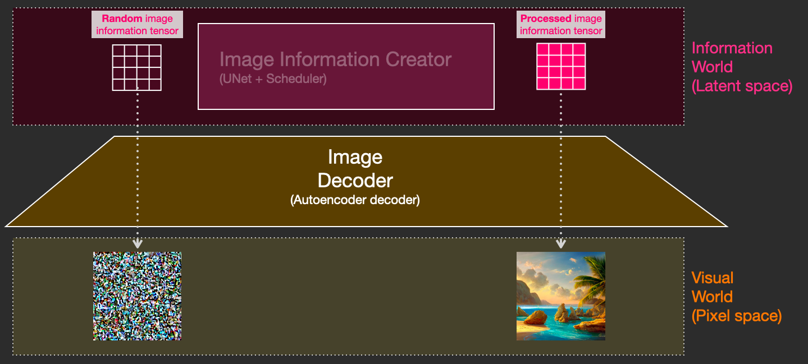

그림으로 이해하는 Stable Diffusion (번역)

AI/NovelAI/Stable Diffusion/번역/

[원본 링크 1 : 원본 포스트](https://jalammar.github.io/illustrated-stable-diffusion/)

[원본 링크 2 : 일본어 번역](https://okuranagaimo.blogspot.com/2022/10/stable-diffusion.html)

---
목차
- [Stable Diffusion의 구성 요소](#stable-diffusion의-구성-요소)
  - [1- 이미지 정보 크리에이터](#1--이미지-정보-크리에이터)
  - [2- 이미지 디코더](#2--이미지-디코더)
- [애당초 '확산'이란게 뭘 말하는 겁니까?](#애당초-확산이란게-뭘-말하는-겁니까)
  - [확산의 구조](#확산의-구조)
  - [노이즈를 제거하여 이미지를 그립니다.](#노이즈를-제거하여-이미지를-그립니다)
  - [속도 향상 : 픽셀 이미지가 아닌 압축된(잠재적인) 데이터에 대한 확산](#속도-향상--픽셀-이미지가-아닌-압축된잠재적인-데이터에-대한-확산)
  - [텍스트 인코더: Transformer 언어 모델](#텍스트-인코더-transformer-언어-모델)
  - [CLIP 학습 방법](#clip-학습-방법)
  - [이미지 및 캡션 데이터 세트](#이미지-및-캡션-데이터-세트)
  - [이미지 생성 프로세스에 텍스트 정보 입력](#이미지-생성-프로세스에-텍스트-정보-입력)
  - [Unet 노이즈 예측기 레이어 (텍스트 없음)](#unet-노이즈-예측기-레이어-텍스트-없음)
  - [텍스트가 포함된 Unet 노이즈 예측기 레이어](#텍스트가-포함된-unet-노이즈-예측기-레이어)
- [결론](#결론)

AI에 의한 이미지 생성은 (나를 포함하여) 사람들을 놀라게 한 최신 AI의 능력입니다. 텍스트 설명에서 인상적인 비주얼을 만드는 능력은 마법 같은 품질을 가지며, 인간이 예술을 창조하는 방식의 변화를 명확하게 가리킵니다. Stable Diffusion의 공개는 고성능(화질뿐만 아니라 속도와 비교적 낮은 리소스 / 메모리 요구 사항이라는 의미에서의 성능) 모델을 일반인에게 제공한다는 점에서, 개발 관점에서 명확한 마일스톤이라고 할 수 있겠습니다.

AI 이미지 생성을 시도해 보면 그 구조가 신경이 쓰이기 시작한 분도 많지 않을까요?

여기에서는 Stable Diffusion의 구조에 대해 상냥하게 소개합니다.

Stable Diffusion은 다양한 사용법이 가능한 범용성이 높은 것입니다. 첫째, 텍스트만을 이용한 이미지 생성(text2img)에 중점을 둡니다. 위의 이미지는 텍스트 입력과 생성된 이미지의 예입니다. 텍스트를 이미지로 변환하는 것 외에도 또 다른 주요 사용법은 이미지를 재가공하는 것입니다 (즉, 입력값은 텍스트 + 이미지).

이미지 생성의 옵션과 매개변수의 의미를 설명하는데 도움이 되는 구성 요소, 그들이 어떻게 상호 작용하는지, 내부를 살펴 보겠습니다.

# Stable Diffusion의 구성 요소

Stable Diffusion은 여러 구성 요소와 모델로 구성된 시스템입니다. 일체화된 모놀리식 모델이 아닙니다.

내부를 들여다 보면, 먼저 관찰할 수 있는 것은 텍스트 정보를 텍스트 내의 아이디어를 포착해 수치 표현으로 변환하는 텍스트 이해 컴포넌트가 있는 것을 알 수 있습니다.

여기에서는 대략적인 도면으로 시작하여 이 기사의 뒷부분에서 기계 학습에 대해 자세히 설명합니다. 그러나, 이 텍스트 인코더는 특수한 트랜스포머 언어 모델(기술적으로는, CLIP 모델의 텍스트 인코더)이라고 말할 수 있습니다. 입력된 텍스트를 받아서 텍스트의 각 단어/토큰을 나타내는 숫자 목록(벡터)을 출력합니다.

그런 다음 정보는 이미지 생성기에 전달됩니다. 이미지 생성기는 여러 컴포넌트로 구성됩니다.

이미지 생성기는 두 단계를 거쳐 수행됩니다.

## 1- 이미지 정보 크리에이터

이 컴포넌트가 Stable Diffusion의 비전 소스입니다. 이전 모델에 비해 성능적으로 많은 향상이 있었던 것은 여기에서 비롯된 것입니다.

이 컴포넌트는 이미지 정보를 생성하기 위해 여러 단계로 실행됩니다. 이것은 Stable Diffusion의 인터페이스와 라이브러리의 스텝 파라미터로, 종종 기본적으로 50과 100으로 설정됩니다.

이미지 정보 크리에이터는 전적으로 이미지 정보 공간(또는 잠재 공간)에서 동작합니다. 그것이 무엇을 의미하는지에 대해서는 후반부에서 자세히 설명합니다. 이 특성은 픽셀 공간에서 작동했던 이전의 확산 모델보다 빠르게 작동합니다. 기술적으로 말하면, 이 컴포넌트는 UNet 신경망과 스케줄링 알고리즘으로 구성됩니다.

"확산(diffusion)"이라는 단어는 이 컴포넌트에서 일어나는 일을 나타냅니다. 최종적으로 (다음 컴포넌트인 이미지 디코더에 의해) 고품질의 이미지가 생성되는 것은, 정보를 단계적으로 처리하기 때문입니다.

## 2- 이미지 디코더

이미지 디코더는 정보 크리에이터로부터 얻은 정보를 바탕으로 그림을 그립니다. 프로세스의 끝에 한 번만 실행되어 최종 픽셀 이미지가 생성됩니다.

이제 Stable Diffusion을 구성하는 3가지 주요 컴포넌트(각각 고유한 신경망을 가진다)가 보일 것입니다.

- 텍스트 인코딩을 위한 **ClipText**
   - 입력 : 텍스트
   - 출력 : 각각 768 차원의 77 개의 토큰 모음 벡터

- **UNet + Scheduler** 를 사용하여 정보(잠재) 공간 내의 정보를 점차 처리/확산합니다.
   - 입력 : 텍스트 포함 및 노이즈로 구성된 다차원 배열 (텐서라고도하는 구조화 된 숫자 목록)
   - 출력 : 처리 된 정보 배열

- **자동 인코더 및 디코더** 가 처리된 정보 배열을 사용하여 최종 이미지를 그립니다.
   - 입력 : 처리 된 정보 배열 (차원 : (4,64,64))
   - 출력 : 처리 후 이미지 (차원 : (3 , 512, 512) = (빨강/녹색/파랑, 폭, 높이))

# 애당초 '확산'이란게 뭘 말하는 겁니까?

확산은 도면에서 핑크색 "이미지 정보 크리에이터" 컴포넌트 내부에서 수행되는 프로세스를 말합니다. 입력 텍스트를 나타내는 토큰 모음과, 랜덤 이미지 정보 배열(이것을 '잠재'라고 함)을 사용하여 이미지 디코더가 최종 이미지를 그리는 데 사용하는 정보 배열을 생성합니다.

이 처리는 단계적으로 수행됩니다. 각 단계마다 더 관련성이 높은 정보가 추가됩니다. 이 처리를 직관적으로 이해하기 위해 무작위 잠재 배열을 검사하여 시각적 노이즈로 변환되는지 확인할 수 있습니다. 이 경우의 시각적 검사는, 이미지 디코더를 통과하는 것입니다.

확산은 여러 단계에서 수행되며, 각 단계는 입력 잠재 배열로 조작하여, 입력 텍스트와 모델이 학습된 모든 이미지에서 픽업한 시각 정보에 가까운 다른 잠재 배열을 생성합니다.

이 잠재의 모음을 시각화하면 각 단계에서 어떤 정보가 추가되는지 확인할 수 있습니다.

이 과정은 보고 숨을 삼킬 정도입니다.

이 경우 2단계와 4단계 사이에 특히 흥미로운 일이 발생합니다. 마치 노이즈 속에서 윤곽이 떠오르는 것 같습니다.

## 확산의 구조

확산 모델을 이용한 이미지 생성의 중심이 되는 아이디어는, 우리가 강력한 컴퓨터 비전 모델을 가지고 있다는 사실에 달려 있습니다. 충분한 크기의 데이터 세트가 있으면 이러한 모델은 복잡한 작업을 학습할 수 있습니다. 확산 모델은 다음과 같은 문제를 조립하여 이미지 생성에 접근합니다.

예를 들어, 어떤 이미지가 있다면 첫 번째 단계로 이미지에 노이즈를 추가해 봅시다.

이 이미지에 추가한 노이즈의 '슬라이스'를 '노이즈 슬라이스 1'이라고 합니다. 또 다른 단계, 노이즈가 많은 이미지에 노이즈를 추가해 봅시다 ("노이즈 슬라이스 2").

이 시점에서 모든 이미지는 노이즈로 만들어졌습니다. 그럼, 이것을 컴퓨터 비전의 신경망 학습의 예시로 합시다. 단계 번호와 이미지가 있으면 이전 단계에서 얼마나 잡음이 가해졌는지 예측합니다.

이 예시에서는 이미지에서 전체 노이즈까지 총 2단계입니다만, 이미지에 가하는 노이즈의 양을 제어할 수 있기 때문에 수십 단계로 나누어 학습 데이터 세트의 모든 이미지에 대해 이미지마다 수십 개의 학습 예제를 만들 수 있습니다.

놀라운 점은 이 노이즈 예측 네트워크가 제대로 작동하게 되면 몇 단계에 걸쳐 노이즈를 제거함으로써 효과적으로 그림을 그릴 수 있다는 것입니다.

주: 이것은, 확산 알고리즘을 조금 단순화 하고 있습니다. 아래의 자료는 수학적 전체 이미지를 보다 상세히 설명합니다.

## 노이즈를 제거하여 이미지를 그립니다.

학습된 노이즈 예측기는, 노이즈가 있는 이미지와 노이즈 제거 단계 수를 받아 노이즈 슬라이스를 예측할 수 있습니다.

노이즈 슬라이스는, 이미지에서 이를 빼면 모델이 학습한 이미지에 가까운 이미지를 얻을 수 있을 것으로 예측됩니다.

만약 학습 데이터 세트가 겉보기에 아름다운 이미지(예: Stable Diffusion이 학습한 LAION Aesthetics)라면, 결과 이미지는 겉보기에 아름답게 되는 경향이 있습니다.

이상으로, 확산 모델에 의한 이미지 생성의 설명을 끝냅니다. 주로 「확산 제거 확산 확률 모델」에서 설명한 대로입니다. 이런 식으로 확산에 대해 직관적으로 이해할 수 있었기 때문에 Stable Diffusion뿐만 아니라 Dall-E 2와 Google의 Imagen의 주요 구성 요소가 어떻게 작동하는지 알았습니다.

덧붙여 지금까지 설명한 확산 처리는, 텍스트 데이터를 사용하지 않고 이미지를 생성한 것이라는 점에 주의해 주세요. 다음 섹션에서는 텍스트를 캡처하는 방법을 설명합니다.

## 속도 향상 : 픽셀 이미지가 아닌 압축된(잠재적인) 데이터에 대한 확산

Stable Diffusion의 논문에서는, 이미지 생성 처리의 고속화를 위해서, 픽셀 화상 그 자체가 아니고, 이미지를 압축한 것으로 확산 처리를 실행합니다. 논문에서는 이것을 "잠재 공간으로의 여행"이라고 부릅니다.

이 압축 (그리고 이후 과정인 압축 해제 / 그리기)는 자동 인코더를 통해 이루어집니다. 자동 인코더는 인코더를 사용하여 이미지를 잠재 공간으로 압축하고 디코더를 사용하여 압축된 정보만을 사용하여 이미지를 재구성합니다.

여기서 압축된 잠재값에 대해 전방 확산 처리가 실행됩니다. 노이즈 슬라이스는 픽셀 이미지가 아니라 이 잠재 요소에 적용된 노이즈 슬라이스입니다. 그리고, 노이즈 예측기는 실제로는 압축된 표현(잠재 공간)의 노이즈를 예측하도록 학습되는 것입니다.

(자동 인코더의 인코더를 사용한) 순방향 프로세스는 노이즈 예측기를 학습시키기 위한 데이터를 생성하는 방법입니다. 학습이 완료되면 (자동 인코더의 디코더를 사용하여) 역방향 프로세스를 수행하여 이미지를 생성할 수 있습니다.

이 두 가지 흐름은 LDM / Stable Diffusion 논문의 그림 3에 나와 있습니다.

이 그림은 "조건부" 컴포넌트를 더 보여줍니다. 이 경우 모델이 생성하는 이미지를 설명하는 텍스트 프롬프트가 표시됩니다. 이제 텍스트 컴포넌트에 대해 알아봅시다.

## 텍스트 인코더: Transformer 언어 모델

텍스트 프롬프트를 입력받고, 토큰 모음을 생성하는 언어 이해 컴포넌트로서 Transformer 언어 모델이 사용됩니다. 공개된 Stable Diffusion 모델은 ClipText (GPT 기반 모델)를 사용하지만 논문에서는 BERT를 사용합니다.

언어 모델의 선택이 중요하다는 것이 Imagen의 논문에 제시되어 있습니다. 대규모 언어 모델로의 교체는, 대규모 이미지 생성 컴포넌트보다는,생성된 이미지의 품질에 더 큰 영향을 미쳤습니다.

언어 모델의 대규모화/개선은 이미지 생성 모델의 품질에 큰 영향을 미칩니다. 출처 : Saharia 등의 Google Imagen 논문 그림 A.5

초기 Stable Diffusion 모델은 OpenAI에서 출시한 학습된 ClipText 모델을 플러그인한 것입니다. 향후 모델은 새로 출시된 훨씬 더 큰 OpenCLIP 변종인 CLIP으로 전환될 수 있습니다. 이 새로운 배치(Batch)에는, ClipText의 63M 매개변수와는 달리 최대 354M 매개변수 크기의 텍스트 모델이 포함됩니다.

## CLIP 학습 방법

CLIP은 이미지와 캡션으로 구성된 데이터 세트로 학습합니다. 4억 개의 이미지와 캡션을 포함한, 다음과 같은 데이터 세트가 그 예시입니다.

CLIP은 이미지 인코더와 텍스트 인코더의 조합입니다. 그 학습 방법은 이미지와 그 캡션을 얻는다고 생각하면 간단합니다. 이 두 이미지를 각각의 이미지 인코더와 텍스트 인코더로 인코딩합니다.

## 이미지 및 캡션 데이터 세트

그런 다음 코사인 유사도를 사용하여 임베디드 결과를 비교합니다. 학습이 시작되면 텍스트가 이미지를 올바르게 설명하더라도 유사성은 낮습니다.

두 모델을 업데이트하여, 다음에 임베딩할 때는 결과값이 유사하도록 합니다.

이것을 데이터 세트 전체로 하여, 점차 큰 배치 사이즈로 반복하는 것으로, 최종적으로 인코더는 개의 이미지와 "개의 사진"이라고 하는 문장이 비슷한 결과값을 생성할 수 있게 되는 것입니다. word2vec 과 마찬가지로 학습 과정에서 일치하지 않는 이미지나 캡션의 부정적인 예도 포함해야 하며 모델에 낮은 유사성 점수를 할당해야 합니다.

## 이미지 생성 프로세스에 텍스트 정보 입력

텍스트를 이미지 생성 프로세스의 일부로 만들기 위해 텍스트를 입력으로 사용하도록 노이즈 예측기를 조정해야 합니다.

데이터 세트는 이제 인코딩된 텍스트를 포함합니다. 잠재 공간에서 작동하기 때문에 입력 이미지와 예상되는 노이즈가 모두 잠재 공간에 있습니다.

텍스트 토큰이 Unet에서 어떻게 사용되는지 더 잘 이해하기 위해 Unet 내부를 자세히 살펴 보겠습니다.

## Unet 노이즈 예측기 레이어 (텍스트 없음)
먼저 텍스트를 사용하지 않는 확산 Unet을 살펴 보겠습니다. 그 입력과 출력은 다음과 같습니다.

내부를 보면 이렇게 됩니다.

- Unet은 잠재적인 배열의 변환을 다루는 일련의 레이어입니다.
- 각 레이어는 이전 레이어의 출력에 대해 작동합니다.
- 출력의 일부는 (잔류 연결을 통해) 네트워크의 후속 처리에 제공됩니다.
- 타임 스텝은 타임 스텝 임베딩 벡터로 변환되어 각 레이어에서 사용됩니다.

## 텍스트가 포함된 Unet 노이즈 예측기 레이어

이제 이 시스템을 어떻게 변경하고 텍스트에 대한 주의를 포함하는지 살펴보겠습니다.

텍스트 입력 지원 (기술 용어 : 텍스트 조건부)을 추가하는데 요구되는 시스템의 주요 변경 사항은 ResNet 블록 사이에 주의(Attention) 레이어를 추가하는 것입니다.

또한 resnet 블록은 텍스트를 직접 보고 있는 것은 아닙니다. 그러나 주의 레이어는 잠재적인 텍스트 표현을 병합합니다. 그리고 그 다음 ResNet은, 내장된 텍스트 정보를 처리에 사용할 수 있습니다.

# 결론
Stable Diffusion의 구조에 대해, 이 글이 입문에 좋은 직관을 제공해줬기를 바라봅니다. 그 밖에도 많은 개념이 관련되어 있습니다만, 위에서 서술한 컴포넌트에 익숙해지면 이해하기 쉬워질 것이라 생각합니다. 아래의 참고자료들은 내가 도움이 될 것이라고 생각하는 양질의 심화자료입니다. 수정할 부분이나 피드백 사항이 있다면 Twitter 로 저에게 연락하십시오.

참고
Dream Studio 를 사용하여 Stable Diffusion에서 이미지를 생성하는 방법에 대해 1분 동안 YouTube의 짧은 동영상 이 있습니다.
🧨 디퓨저에 의한 Stable Diffusion
주석이 달린 확산 모델
Stable Diffusion은 어떻게 작동합니까? – 잠재 확산 모델 설명 [동영상]
Stable Diffusion - 무엇을, 왜, 어떻게? [비디오]
잠재 확산 모델에 의한 고해상도 화상 합성 [The Stable Diffusion의 논문]
알고리즘과 수학에 대한 자세한 내용은 Lilian Weng의 " What are Diffusion Models ?"를 참조하십시오.