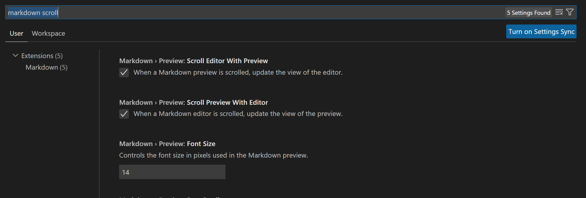

VSCode 에서 마크다운 Preview 자동 스크롤 설정 ON/OFF

VSCode/마크다운/팁/문제해결

목차
- [문제](#문제)
- [해결](#해결)

# 문제

VSCode 마크다운 문서 작성 중 Preivew (미리보기) 가, 원본 문서를 스크롤하면 같이 따라서 스크롤되는 기능을 끄고 싶다. 내가 원본 문서에서 보고 있는 곳을 정확히 보여줄 때도 있지만, 문서가 길어지거나 스크린샷 등 사진이 들어가면 부정확해서 기능의 의미가 없어지는 경우가 더 많다.

# 해결

File > Preference > Setting 에서 markdown scroll 검색해서 나오는 2개 옵션을 모두 꺼준다.