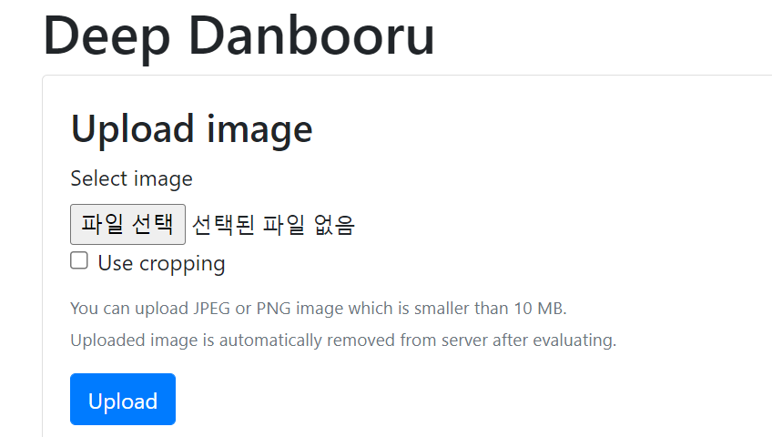
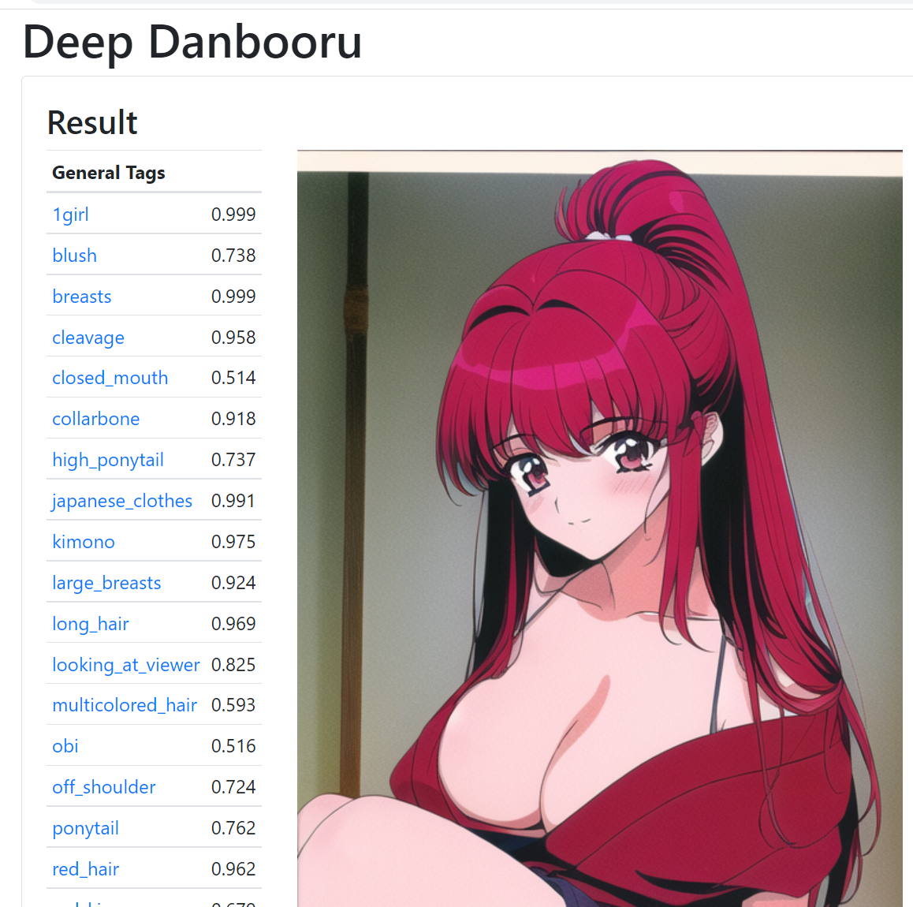
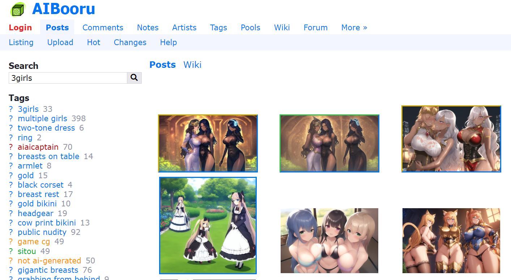
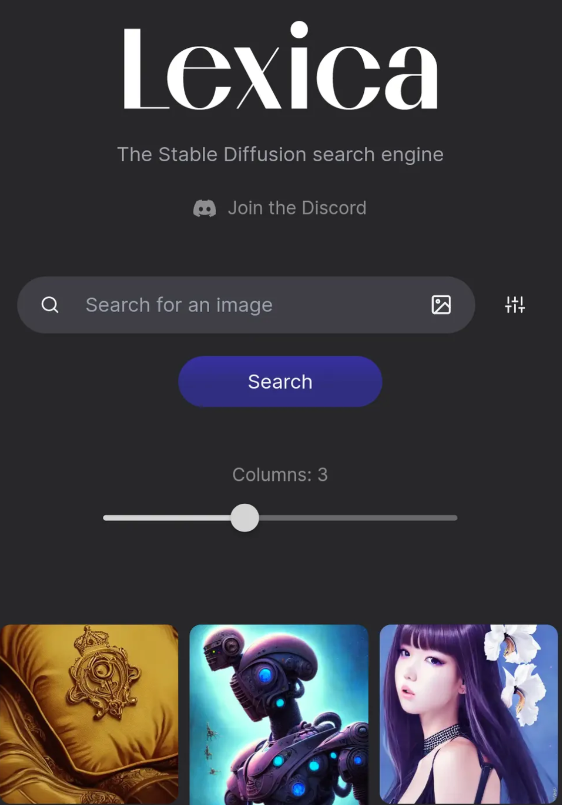
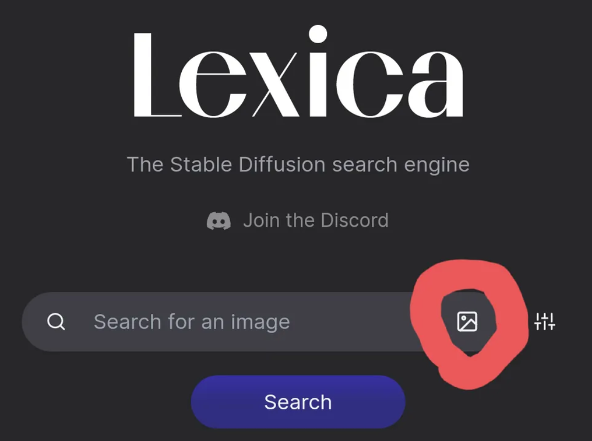
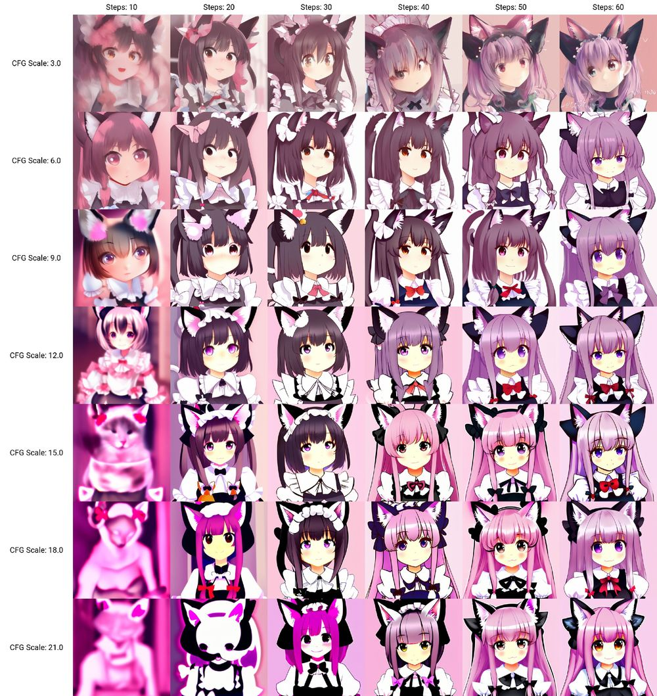
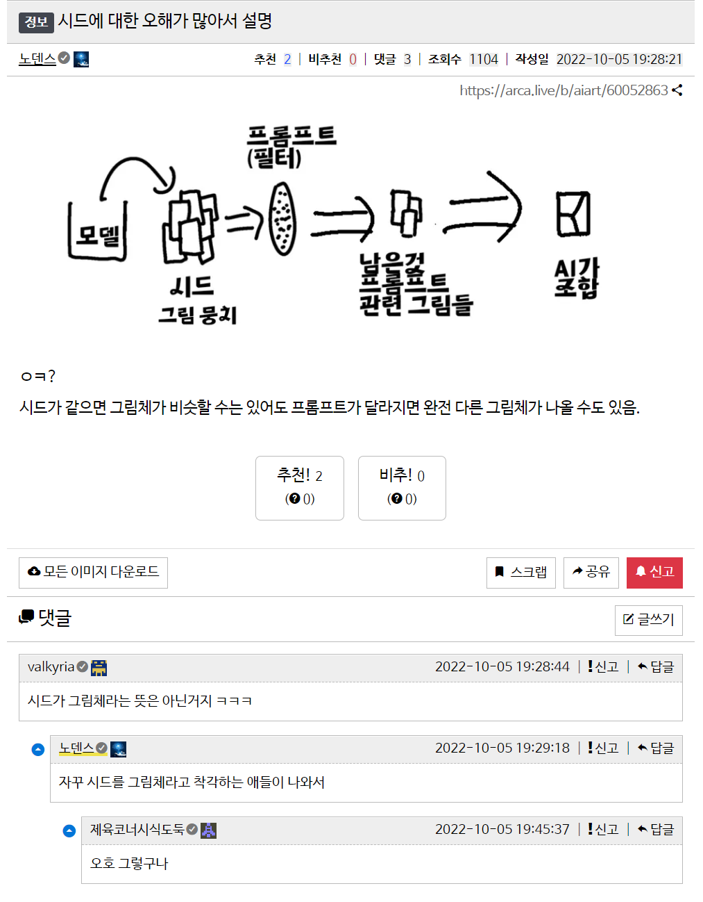

Web UI 관련 참고자료 모음

AI/WebAI/StableDiffusion/참고자료/

목차
- [1. 프롬프트, 설정 관련 유용한 외부 사이트](#1-프롬프트-설정-관련-유용한-외부-사이트)
  - [1.1. Deep Danbooru](#11-deep-danbooru)
  - [1.2. AI Booru](#12-ai-booru)
  - [1.3. AI 그림 프롬프트 공유 사이트](#13-ai-그림-프롬프트-공유-사이트)
- [2. 기타 각종 설정 관련 짤 모음](#2-기타-각종-설정-관련-짤-모음)
- [3. 참고자료](#3-참고자료)

# 1. 프롬프트, 설정 관련 유용한 외부 사이트

## 1.1. Deep Danbooru
http://dev.kanotype.net:8003/deepdanbooru/

2D 이미지에서 Danbooru 기반 프롬프트 텍스트 추천

## 1.2. AI Booru
https://aibooru.online/

다른 유저들이 생성한 이미지와 사용된 프롬프트, 설정을 공유하는 사이트

## 1.3. AI 그림 프롬프트 공유 사이트
https://lexica.art/

검색 란에 원하는 바와 비슷한 그림 올리면, 비슷한 AI 그림들과 사용 프롬프트 표시됨

# 2. 기타 각종 설정 관련 짤 모음

# 3. 참고자료

[AUTOMATIC1111의 WEB UI Github 링크](https://github.com/AUTOMATIC1111/stable-diffusion-webui)

[AUTOMATIC1111의 WEB UI Github 위키](https://github.com/AUTOMATIC1111/stable-diffusion-webui/wiki)

[SD RESOURCE GOLDMINE](https://rentry.org/sdupdates)

[Stable Diffusion 모델들 모음 사이트](https://rentry.org/sdmodels)

[Hugging Face(SD 모델 파일 배포처)](https://huggingface.co/)

[인공지능 기본 - GAN 과 Diffusion model, Generative Model](https://arca.live/b/aiart/59916341)

[webui 튜토리얼 txt2img 기능설명 기초(아카라이브)](https://arca.live/b/aiart/60273123)