Web UI 관련 프롬프트 분석

AI/WebAI/StableDiffusion/참고자료/프롬프트/

목차

- [표준 삼단술식의 기초 논리](#표준-삼단술식의-기초-논리)
  - [접두어](#접두어)
    - [기본 접두어](#기본-접두어)
    - [화풍 결정 단어](#화풍-결정-단어)
    - [화면 효과 단어](#화면-효과-단어)
  - [주체(화면상의 본체 부분)](#주체화면상의-본체-부분)
  - [풍경(배경, 환경)](#풍경배경-환경)
  - [주체와 풍경의 비율](#주체와-풍경의-비율)
    - [가중치 조절](#가중치-조절)
    - [여러 프롬프트 가중치 조절](#여러-프롬프트-가중치-조절)
    - [문장 강화](#문장-강화)
    - [다중 강화](#다중-강화)
    - [융합](#융합)
  - [넓은 의미의 삼단술식 구조](#넓은-의미의-삼단술식-구조)
- [현려술 구성 논리](#현려술-구성-논리)
  - [주의사항](#주의사항)
  - [기본 접두사](#기본-접두사)
  - [현려술의 기본효과 (극한 색채와 빛의 그림자)](#현려술의-기본효과-극한-색채와-빛의-그림자)
  - [현란한 화풍](#현란한-화풍)
    - [흔한 2차원 화풍](#흔한-2차원-화풍)
    - [사실적 화풍](#사실적-화풍)
  - [현려술 특수효과 (플래쉬 구축)](#현려술-특수효과-플래쉬-구축)
  - [일부 장면의 특수 효과.](#일부-장면의-특수-효과)
    - [태양의 자연 속성](#태양의-자연-속성)
    - [삼림수](#삼림수)
    - [얼음과 눈](#얼음과-눈)
    - [흐릿흐릿하다](#흐릿흐릿하다)
    - [불꽃](#불꽃)
    - [무지개](#무지개)
    - [피비린내 나다](#피비린내-나다)
    - [건축물](#건축물)
    - [슈퍼 세밀 캐릭터 특수효과](#슈퍼-세밀-캐릭터-특수효과)
    - [눈](#눈)
    - [얼굴](#얼굴)
    - [머리](#머리)
    - [인물 촬영 관계](#인물-촬영-관계)
    - [기타](#기타)
  - [실제 사례](#실제-사례)
    - [예 1 (장미법 장면)](#예-1-장미법-장면)
    - [예 2 (모리화법 장면)](#예-2-모리화법-장면)
    - [예 3 (미즈모리법 장면)](#예-3-미즈모리법-장면)
- [프롬프트 모음](#프롬프트-모음)
  - [메인 프롬프트](#메인-프롬프트)
    - [통합팩 기본 메인 프롬프트](#통합팩-기본-메인-프롬프트)
  - [부정 프롬프트](#부정-프롬프트)
    - [통합팩 기본 부정 프롬프트](#통합팩-기본-부정-프롬프트)
    - [중국발 부정 프롬프트](#중국발-부정-프롬프트)
- [참고자료](#참고자료)


[원본 주소](https://arca.live/b/aiart/61501508)

# 표준 삼단술식의 기초 논리

**접두어 + 주체 + 풍경 (+ 접미어)**

## 접두어

접두어 부분은 아래 3가지 종류를 합쳐 부르는 말이다.

1. 기본 접두어
2. 화풍 결정 단어
3. 화면 효과 단어 

이미지의 전체적인 느낌을 정의해서 퀄리티를 향상시키는 역할이다.

### 기본 접두어
이미지의 퀄리티를 강조.
- masterpiece
- bestquality
- 등등

### 화풍 결정 단어
이미지의 화풍을 강조.
- illustration : 일러스트 
- watercolor_medium : 수채화
- impasto : 임파스토. 유화의 기법 중 하나
- 등등

### 화면 효과 단어
빛이나 이미지 화면 전체에 적용되는 효과 관련.
- bestlighting
- lensflare : 렌즈 플레어 
- Depthoffield : 피사계 심도(Depth of field). 카메라 초점을 중심으로 그 뒤로는 흐릿해지는 효과.
- 등등

## 주체(화면상의 본체 부분)

본체는 그림이 부각하려는 주체로, 인물, 건축물, 배경물 등을 말한다. 다양한 주체를 묘사함으로써 디테일이 풍부한 그림을 얻을 수 있다.

**주제 부분은 세세하게 묘사해야 구체화된다. 보통 우리는 주체 부분의 단어들에 가중치를 줘서 그림의 선명도를 높인다.**

캐릭터의 경우, 보통 얼굴, 머리카락, 몸, 옷차림, 자세 등의 묘사가 포함된다.

캐릭터가 없을 때는 장면의 중요한 점, 즉 구름처럼 높이 솟은 성, 피어나는 꽃, 부서진 시계 등 화면의 중심에 있는 물체를 묘사한다.

## 풍경(배경, 환경)

풍경은 주체가 존재하는 주변 풍경을 말하고, 풍경 묘사가 없을 때는 단색 배경이거나, 효과 태그(tag)와 연관있는 풍경이 만들어지기 쉽고, 주체가 크게 보이게 만들어질 수 있다. 일부 주체는 그 자체가 풍경을 의미하기도 하는데, 건축물 혹은 배경물 등이 그렇다.

**단독 환경 어휘는 본체 주변과 함께 화면 전체의 풍경을 가득 채우는 장면을 형성한다.**

- flowerymeadow : 화초가 무성한 습지
- feather : 깃털 
- sunlight : 햇빛 
- river : 강
- Broken glass : 깨진 유리
- 등등

환경 어휘는 겹겹이 쌓아주면 풍경이 풍부해지는데, 주체에 대한 내용이 너무 적으면 안된다.

**배경 어휘는 환경 어휘의 뒤에 background 를 추가한 것**으로, 예를들면 clockbackground 같은 묘사는 주체의 배후에 배경 어휘가 안정적으로 나타나게 해준다.

clockbackground

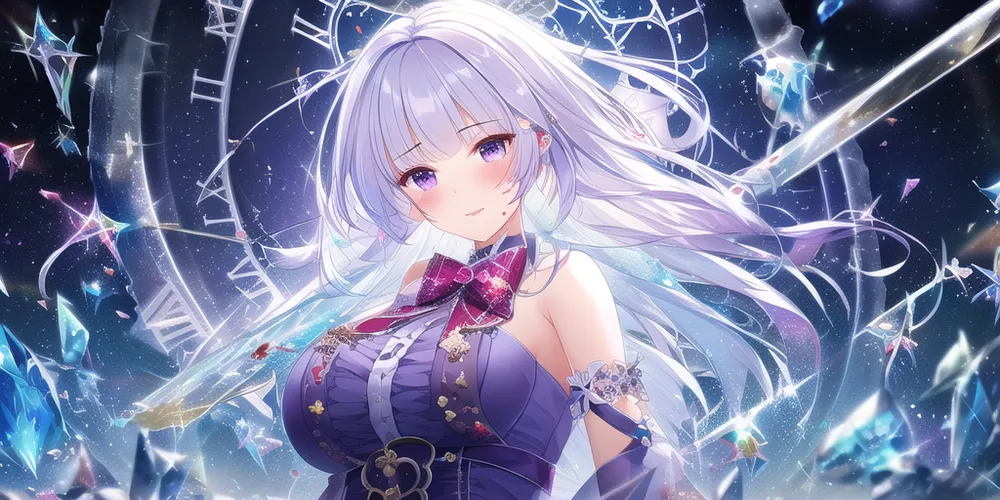

접미사는 보통 화면 효과 단어와 유사하게 풍경을 풍부하게 하는데 사용된다. 예를들면 깃털, 섬광, 별 등이 그렇다.

접두사 끝에 있는 화면 효과 단어에 접미사를 썼을때, 만약 주체의 묘사가 적다면, 풍경의 가중치가 너무 커져서 주체가 실종되는 결과를 낳는다.

## 주체와 풍경의 비율

주체와 풍경의 가중치를 조절함으로써 주체의 크기와 비중을 조절할 수 있다. 그 외에도 주체를 수식함으로써 주체의 표시 범위를 조절할 수 있는데, 사람에 대한 표현은 제2장의 인물 촬영 관계 란에서 볼 수 있다.

### 가중치 조절

**가중치 조절은 매우 중요한 부분이고, 이건 당신이 그리고 싶은 것이 AI의 주의(Attention)를 얻을 수 있느냐 없느냐와 관련 있는 부분이다.**

가장 기초적인 가중치 조절 방법은, 프롬프트의 위치를 조절하는 것이다. 앞쪽으로 어휘를 배치할수록 주의를 얻을 수 있다.

가중치는 프롬프트에 괄호를 추가함으로써 조절할 수 있다. **() 혹은 {}는 가중치 강화, []는 가중치 약화이다.**({}는 NovelAI에서 사용하는 방식.) (1girl:1.5) 이런 식으로 괄호 뒤에 ":1.5"를 추가하는 것은 직접 가중치를 설정하는 방식으로, 숫자가 곧 가중치의 크기이며, 숫자가 크면 클 수록 가중치도 커진다. 가중치 기본값은 1이고, 보통 0 ~ 2 사이의 수치를 입력한다.

Web UI에서 ()는 그 안의 내용의 가중치에 1.1을 곱하는 것이고, []는 그 안의 내용의 가중치를 1.1로 나누는 것이다. 또한 {}는 Web UI에서는 효과가 없다. 괄호를 계속 겹치는 방식으로도 효과는 있지만, 이 방식은 효율적이지 않고 보기에도 좋지 않다. 예를들면 ((((girl)))) 이렇게 4번 겹쳐서 괄호를 치는 것보다는, 그냥 (girl:1.4641) 이렇게 가중치를 증가시키면 된다.

**그러므로 (프롬프트:가중치) 방식으로 가중치를 조절하는 것을 강력하게 추천한다.**

한 묶음의 단어를 선택한 후 방향키를 누르면 위아래로 직접 가중치를 조절할 수 있다.

### 여러 프롬프트 가중치 조절

가중치 조절은 괄호 안의 모든 프롬프트의 가중치를 조절할 수 있다. 아래 이미지에서는 1girl 이 괄호 안에 있지 않아서 1.5배의 가중치를 얻지 못했기 때문에, 이미지에서 사라진 것을 볼 수 있다.


```
masterpiece,(1girl,flowers,tree,dog:1.5)
```


```
masterpiece,(1girl),(flowers,tree,dog:1.5)
```

### 문장 강화

한 문장이 'a girl stands with (flowers:1.5) and dog'로 묘사된다면, 그 중 flowers에 대해서만 부분적으로 1.5배의 가중치를 부여할 수 있다.


### 다중 강화

그 외에,가급적이면 괄호 여러개 쳐서 강조하지 말고 하나의 괄호 안에 한 번에 가중치를 재조정하면 된다. 예를들면 아래와 같은 표현들이 가능하다.

```
((promptA),promptB,promptC)

((promptA),promptB,promptC:1.5)

(promptA:1.5,promptB,promptC:1.5) 

```

최근의 예시를 돌아보면, 묶음으로 사용하는것은 가중치 설정에 혼란을 야기하기 쉬운데, (1girl,flowers,tree,dog:1.5) 이렇게 이미 가중치를 준 것에 더해서 flower:1.5 랑 tree:1.5 이런 식으로 또 가중치를 줘봤을때, 우리는 꽃과 나무에 우리가 예상한 만큼의 가중치 강화가 없다는 것을 알 수 있다.


```
masterpiece,(1girl,flowers,tree,dog:1.5)
```


### 융합

두개 혹은 여러 개의 키워드는 | 기호를 추가해서 융합이 가능하다. 하지만 많이 쓰지는 않는다. 예를 들어 cat|dog는 고양이와 개를 섞는 것으로, 혼합되었을때의 가중치는 1:1 이다. 

cat:0.2|dog 이렇게 혼합 비율을 조절할 수도 있다. 이 비율은 최대 100이며, 음수값을 줄 수도 있고, 음수값은 통제불능의 상반된 효과가 있을 수도 있다. 

```
cat:1|happy:-0.2|cute:-0:3
```


비록 기괴하지만, 개와 고양이의 변화를 볼 수 있다. 

[참고링크 : 서로 다른 개념을 쓰까보고 싶을때: Prompt editing과 alternating](https://arca.live/b/aiart/60911605)


## 넓은 의미의 삼단술식 구조

```
그림 한폭, 이게 어떤 그림인지, 구체적인 상황 ->

한 사람, 이게 어떤 사람인지, 사람의 구체적인 상황(사람의 모습, 어떤 옷인지, 사람이 뭘 원하는지) ->

한가지 배경, 이게 어떤 배경인지, 그 배경의 구체적인 상황(배경에 무엇이 있는지, 어떤 특색이 있는지) ->

배경의 물체, 이것이 어떤 물체인가, 그 물체의 구체적인 상황
```

이 논리를 사용함으로써, 이미지 장면 안의 모든 것을 일정한 규칙성을 지니고 큰 것부터 작은 것까지의 순서로 묘사할 수 있다 : 

```
전체 그림, 화풍 표현, 주요 목표의 수, 주요 목표의 종류, 주요 목표의 구체적인 표현, 주요 목표에 대한 특수효과와 수식어, 부차 목표의 수, 부차 목표의 종류, 부차 목표의 구체적인 표현, 부차 목표에 대한 특수 효과와 수식어
```

이런 식으로 한번 시험해보자.
```
그림 한폭, 유화 이미지, 여자가 숲 속에 있는 유화, 여자는 세련되게 입은 마법사, 그녀는 아름다운 얼굴을 가졌다, 매혹적인 붉은 입술과 반짝이는 큰 눈망울, 베이지색 긴 포니테일 헤어스타일과 별 귀걸이, 화려한 흰색 드레스에 금빛 무늬와 레이스 테두리를 장식했다, 그녀는 숲속에 조용히 앉아 있다, 숲 속에 꽃무더기와 나무와 강이 있다, 햇빛이 수풀을 뚫고 밝은 반점을 뿌렸다, 삼림 전체가 반짝반짝 빛나고 있다
```

이것은 아래와 같이 4개 부분으로 구분할 수 있다.

```
masterpiece, best quality, best 8k wallpaper, 
```

```
realistic oil painting, 
```

```
1 magic girl, beautiful face, attractive red lips and beautiful big shining eyes, cream colored long curly hair with high ponytail, gold hair ornaments and star earrings, gorgeous white dress, gold patterns and lace, solo, sit down near a river in the forest,
```

```
flowers, sunlight, bright spots, shine
```


보면 알수 있듯이, 이미지에서 우리가 구현되기 원했던 것들 중 일부는 성공했고 일부는 실패했다. 이는 가중치가 조절되지 않았기 때문이고, 이제 우리는 가중치를 조절해볼 것이다. 위 4개 중 우리가 당초 원했던 느낌에 가장 가까운 이미지는 좌측 하단의 것인데, 나머지 이미지들은 앉아있는 자세와 허벅지, 꽃 같은게 부각되지 않으므로, 우리는 이렇게 부각되지 않는 요소들을 좀더 강화시킬 것이다.

앞서 입력한 프롬프트와의 차이점을 보기 쉽게, 마찬가지로 4개 부분으로 나눠서 생각해보자.

```
masterpiece, best quality, best 8k wallpaper, 
```

```
realistic oil painting, 
```


```
1 magic girl, beautiful face, attractive red lips and beautiful big shining eyes, cream coloured long curly hair with high ponytail, gold hair ornaments and star earrings, gorgeous white dress, gold patterns and lace, solo,(sit down:1.2) near a river in the forest, upper body, (thigh:1.2), 
```

```
(flowers:1.1), sunlight, bright spots, shine
```

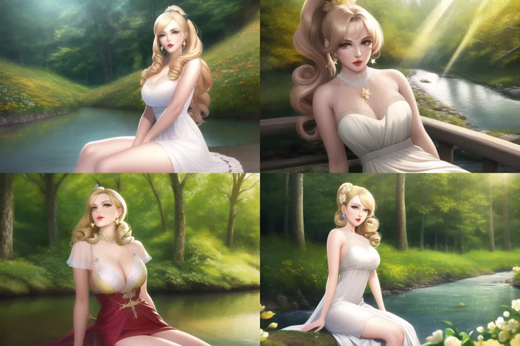

기본적으로 원하던 바를 충족했는데, 만약 꽃의 수량이 좀 부족해 보이면, 꽃에 0.1의 가중치를 추가할수도 있다. 그럼 이제 세부사항을 좀더 추가해보자. 묘사의 양을 좀더 늘리고, 더 많아진 세부사항을 수용하기 위해 그에 상응하도록 이미지의 사이즈를 키워야 한다. 이미지의 사이즈는 묘사되는 내용의 양에 맞춰야 한다. 

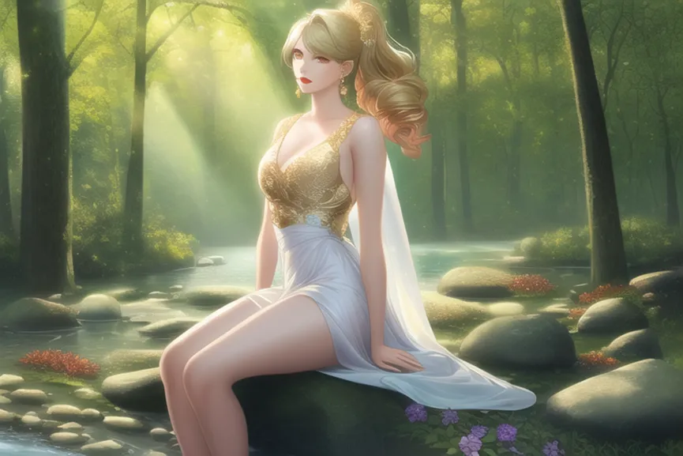

크기 768x512

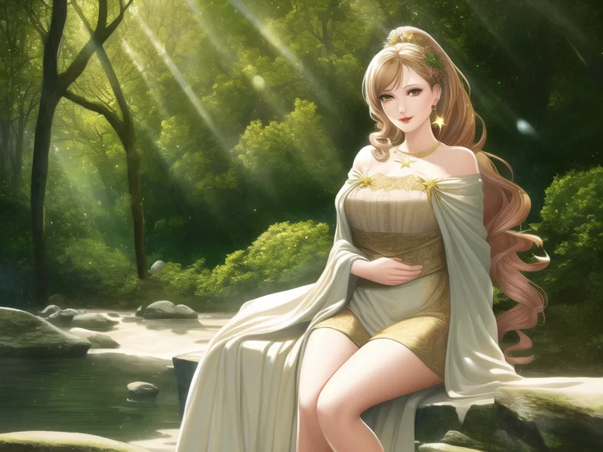

크기 1024x768

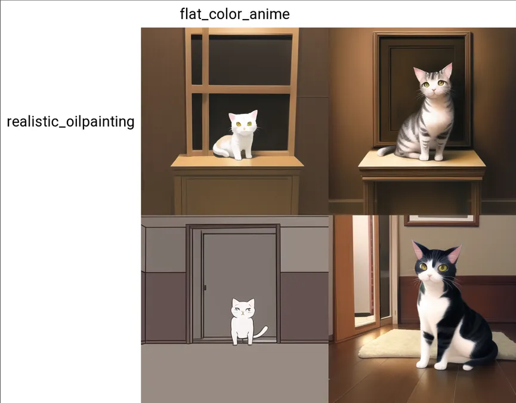

위의 예시는 한 장의 그림에 두 가지 화풍이 동시에 존재하는 그림이다, 원래는 할 수 없는 일이지만, AI 화풍이 뒤섞여 있는 경우, inpaint와 img2img 로 2차 처리를 하더라도, 화풍 수정은 비교적 어렵다.

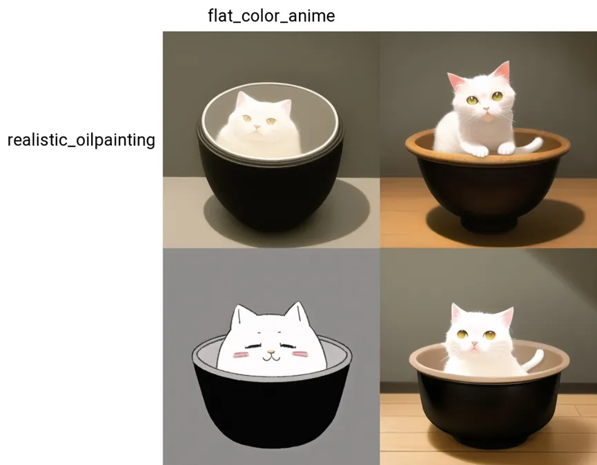

동시에 한 그림에 나오는, 화풍이 두 종류로 서로 다른 물체도 다루기 힘들다. AI는 두 개의 화풍이 나오도록 할 수는 있지만, 원하는 물체에 나타나게 할 수 있을지는 미지수이다.


# 현려술 구성 논리

기본 접두사 + 현려술 기본효과 + 현려술 특수효과 + 상세주체묘사 + 장면묘사 + 장면특효

## 주의사항

현려술은 장면을 미화하는 술법이기 때문에, 본체 묘사와 장면 묘사의 균형에 유의해야 한다는 점을 괄호로 개선할 수 있다. 현려술의 특효는 장면을 묘사하여 본체를 강조하고 장면을 보강하는 데 있다.

## 기본 접두사

고품질 이미지를 불러오는데 사용된다.

```
extremely detailed CG unity 8k wallpaper,masterpiece, best quality, ultra-detailed,
```

- extremely detailed CG unity 8k wallpaper
- masterpiece
- best quality
- ultra-detailed

## 현려술의 기본효과 (극한 색채와 빛의 그림자)

빛의 그림자와 색채는 화사한 기초이다.

```
best illumination, best shadow, an extremely delicate and beautiful
```

- best illumination
- best shadow
- an extremely delicate and beautiful

## 현란한 화풍

(선택가능) 상세화풍어를 첨가하면 화풍사의 품격을 개선하고, 화풍사는 변경할 수 있다

### 흔한 2차원 화풍 

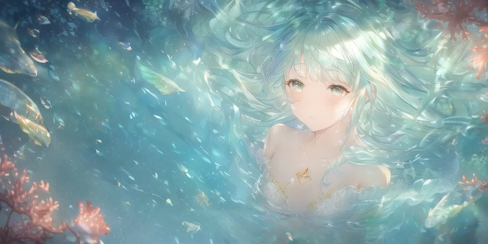


```
classic, illustration,painting, sketch,
```

### 사실적 화풍

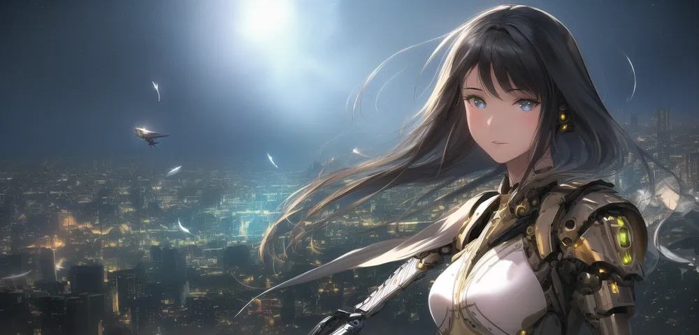

```
impasto, photorealistic, realistic, oilpainting
```


## 현려술 특수효과 (플래쉬 구축)

떠다니는 빛의 그림자, 풍부한 공간 속의 색채에 사용

```
dynamic angle, floating, finely detail, (bloom), (shine), glinting stars,
```

- dynamic angle
- floating
- finely detail
- (bloom)
- (shine)
- glinting stars,


## 일부 장면의 특수 효과.

### 태양의 자연 속성

```
feather,nature,(sunlight), fairyland,
```
- feather
- nature
- (sunlight)
- fairyland

### 삼림수

```
river, forest, flowers, beautiful and delicate water,
```
- river
- forest
- flowers
- beautiful and delicate water

### 얼음과 눈

```
Snowflakes, detailed ice, beautiful detailed water,
```
- Snowflakes
- detailed ice
- beautiful detailed water


### 흐릿흐릿하다

```
Hazy fog, mist
```
- Hazy fog
- mist

### 불꽃

```
Fire butterflys, Flying sparks, Flames
```
- Fire butterflys
- Flying sparks
- Flames


### 무지개

```
Iridescence and rainbow
```

### 피비린내 나다

```
Bloodstain, Blood drop, Blood fog,
```

- Bloodstain
- Blood drop
- Blood fog

### 건축물

```
the best building,
```


### 슈퍼 세밀 캐릭터 특수효과

```
Beautiful detailed girl, extremely delicate and beautiful girls,
```
- Beautiful detailed girl
- extremely delicate and beautiful girls


### 눈

```
beautiful detailed eyes, glowing eyes,blank stare,
```
- beautiful detailed eyes
- glowing eyes
- blank stare


### 얼굴

```
beautiful face,extremely_beautiful_detailed_anime_face, cute face, bright skin,
```
- beautiful face
- extremely_beautiful_detailed_anime_face
- cute face
- bright skin


### 머리

```
long wavy curly hair,dishevelled hair,
```
- long wavy curly hair
- dishevelled hair


### 인물 촬영 관계

- 몸 전체 장면 full body
- 정면 view straight on, selfie
- 전신을 굽어보다 aerial, full body, whole body, wide shot，vertical view


### 기타

- 미거리 촬영 macro shot
- 가까워 close up
- 여자의 반신사진 portrait of girl
- 반신상 bust shot
- 전망 long shot
- 중경 medium shot
- 카우보이 샷 cowboy shot : 인물의 머리부터 허벅지까지 보이는 샷. cowboy를 프롬프트의 두 번째 칸 안쪽으로 넣어야 한다, 안 그러면 카우보이가 나온다 (아무튼 그만큼 앞으로 놔야 한다는 뜻인듯?)
- 미들 샷 mid shot : 인물의 허리나 무릎 중간 부터 위쪽 전부를 보이는 샷.
- 횡단촬영 landscape
- 초상화 portrait 

## 실제 사례

```
Steps: 40, Sampler: Euler, CFG scale: 6, Size: 960x512, Model hash: e6e8e1fc, Eta: 0.67
```

시드 : 3036229208,3501793411

아래의 예에서 사용된 인물 묘사는 모두 원소법전인 은왕좌에서 온 것이다.

### 예 1 (장미법 장면)

프롬프트

(1) 기초 술식 + 순리술
```
(extremely detailed CG unity 8k wallpaper),(masterpiece), (best quality), (ultra-detailed), (best illustration),(best shadow), (an extremely delicate and beautiful), dynamic angle, floating, finely detail, (bloom), (shine), glinting stars, classic, (painting), (sketch),
```

(2) 인물묘사 : 여자 1명, 의복, 눈 색깔, 얼굴 색, 머리 형태
```
a girl, solo, bare shoulders, flat_chest, diamond and glaring eyes, beautiful detailed cold face, very long blue and sliver hair, floating black feathers, wavy hair,
```

(3) 인물강화 
```
extremely delicate and beautiful girls, beautiful detailed eyes, glowing eyes,
```

(4) 장면 묘사 : 묘사 단어가 매우 적고, 모두 단순명사이며, 괄호를 사용해서 강조했다
```
(rose), (blood), (blood), cage, bandage, (red rope), 
```

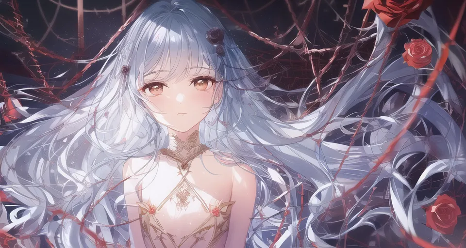

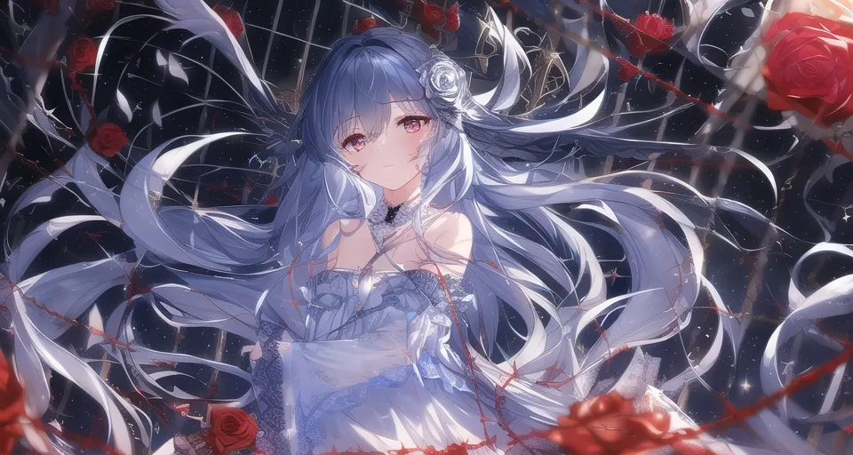


### 예 2 (모리화법 장면)

```
(extremely detailed CG unity 8k wallpaper),(masterpiece), (best quality), (ultra-detailed), (best illustration),(best shadow), (an extremely delicate and beautiful), dynamic angle, floating, finely detail, (bloom), (shine), glinting stars, classic, (painting), (sketch),

a girl, solo, bare shoulders, flat_chest, diamond and glaring eyes, beautiful detailed cold face, very long blue and sliver hair, floating black feathers, wavy hair, extremely delicate and beautiful girls, beautiful detailed eyes, glowing eyes,

palace, the best building, ((Fire butterflies, Flying sparks, Flames))
```

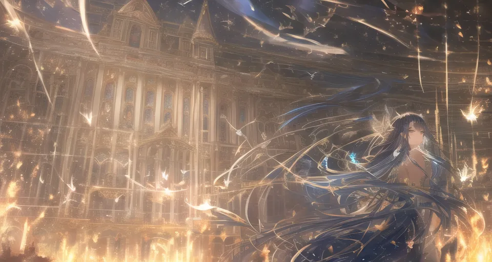

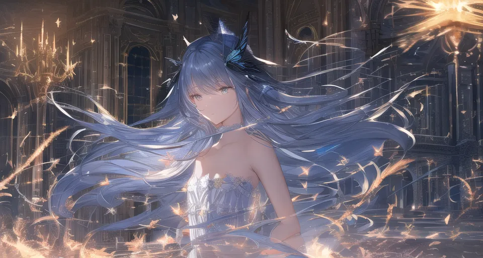


### 예 3 (미즈모리법 장면)

```
(extremely detailed CG unity 8k wallpaper),(masterpiece), (best quality), (ultra-detailed), (best illustration),(best shadow), (an extremely delicate and beautiful), classic, dynamic angle, floating, finely detail, Depth of field, classic, (painting), (sketch), (bloom), (shine), glinting stars,

a girl, solo, bare shoulders, flat_chest, diamond and glaring eyes, beautiful detailed cold face, very long blue and sliver hair, floating black feathers, wavy hair, extremely delicate and beautiful girls, beautiful detailed eyes, glowing eyes,

river, (forest),palace, (fairyland,feather,flowers, nature),(sunlight),Hazy fog, mist,
```

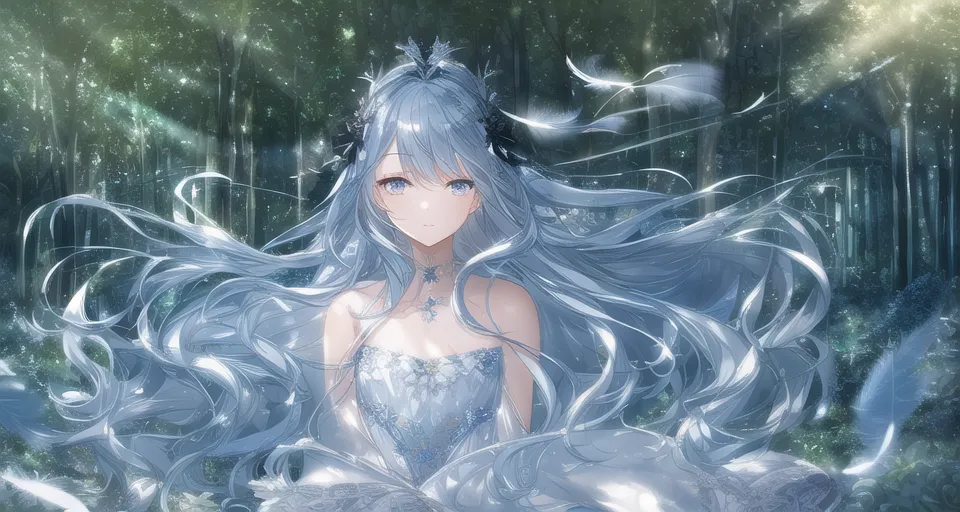

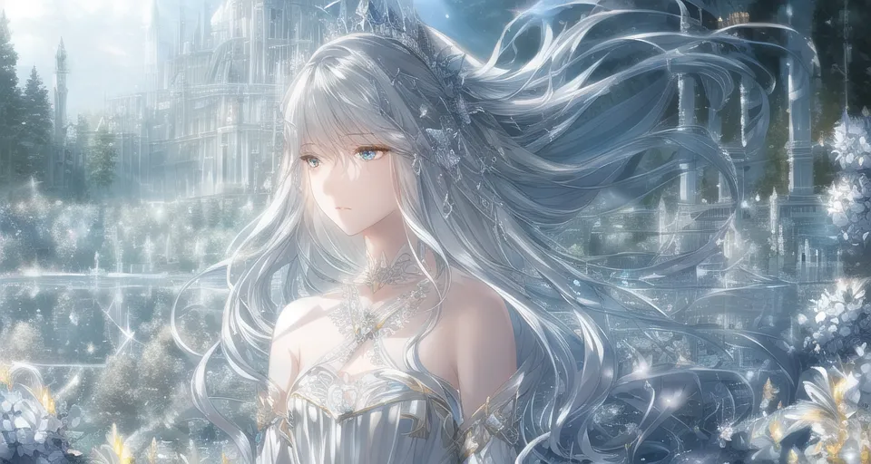


# 프롬프트 모음

## 메인 프롬프트

### 통합팩 기본 메인 프롬프트
```
masterpiece, best quality
```

## 부정 프롬프트

### 통합팩 기본 부정 프롬프트
```
lowres, bad anatomy, bad hands, text, error, missing fingers, extra digit, fewer digits, cropped, worst quality, low quality, normal quality, jpeg artifacts, signature, watermark, username, blurry, artist name
```

### 중국발 부정 프롬프트
이 때는 모델을 animefull-latest로 사용.
```
multiple breasts, (mutated hands and fingers:1.5), (long body :1.3), (mutation, poorly drawn :1.2), black-white, bad anatomy, liquid body, liquid tongue, disfigured, malformed, mutated, anatomical nonsense, text font ui, error, malformed hands, long neck, blurred, lowers, low res, bad anatomy, bad proportions, bad shadow, uncoordinated body, unnatural body, fused breasts, bad breasts, huge breasts, poorly drawn breasts, extra breasts, liquid breasts, heavy breasts, missing breasts, huge haunch, huge thighs, huge calf, bad hands, fused hand, missing hand, disappearing arms, disappearing thigh, disappearing calf, disappearing legs, fused ears, bad ears, poorly drawn ears, extra ears, liquid ears, heavy ears, missing ears, fused animal ears, bad animal ears, poorly drawn animal ears, extra animal ears, liquid animal ears, heavy animal ears, missing animal ears, text, ui, error, missing fingers, missing limb, fused fingers, one hand with more than 5 fingers, one hand with less than 5 fingers, one hand with more than 5 digit, one hand with less than 5 digit, extra digit, fewer digits, fused digit, missing digit, bad digit, liquid digit, colorful tongue, black tongue, cropped, watermark, username, blurry, JPEG artifacts, signature, 3D, 3D game, 3D game scene, 3D character, malformed feet, extra feet, bad feet, poorly drawn feet, fused feet, missing feet, extra shoes, bad shoes, fused shoes, more than two shoes, poorly drawn shoes, bad gloves, poorly drawn gloves, fused gloves, bad cum, poorly drawn cum, fused cum, bad hairs, poorly drawn hairs, fused hairs, big muscles, ugly, bad face, fused face, poorly drawn face, cloned face, big face, long face, bad eyes, fused eyes poorly drawn eyes, extra eyes, malformed limbs, more than 2 nipples, missing nipples, different nipples, fused nipples, bad nipples, poorly drawn nipples, black nipples, colorful nipples, gross proportions. short arm, (((missing arms))), missing thighs, missing calf, missing legs, mutation, duplicate, morbid, mutilated, poorly drawn hands, more than 1 left hand, more than 1 right hand, deformed, (blurry), disfigured, missing legs, extra arms, extra thighs, more than 2 thighs, extra calf, fused calf, extra legs, bad knee, extra knee, more than 2 legs, bad tails, bad mouth, fused mouth, poorly drawn mouth, bad tongue, tongue within mouth, too long tongue, black tongue, big mouth, cracked mouth, bad mouth, dirty face, dirty teeth, dirty pantie, fused pantie, poorly drawn pantie, fused cloth, poorly drawn cloth, bad pantie, yellow teeth, thick lips, bad camel toe, colorful camel toe, bad asshole, poorly drawn asshole, fused asshole, missing asshole, bad anus, bad pussy, bad crotch, bad crotch seam, fused anus, fused pussy, fused anus, fused crotch, poorly drawn crotch, fused seam, poorly drawn anus, poorly drawn pussy, poorly drawn crotch, poorly drawn crotch seam, bad thigh gap, missing thigh gap, fused thigh gap, liquid thigh gap, poorly drawn thigh gap, poorly drawn anus, bad collarbone, fused collarbone, missing collarbone, liquid collarbone, strong girl, obesity, worst quality, low quality, normal quality, liquid tentacles, bad tentacles, poorly drawn tentacles, split tentacles, fused tentacles, missing clit, bad clit, fused clit, colorful clit, black clit, liquid clit, QR code, bar code, censored, safety panties, safety knickers, beard, furry,pony, pubic hair, mosaic, excrement, faeces, shit, futa, testis
```


# 참고자료

[원소법전 제작자의 기초강의 요점정리 노트](https://arca.live/b/aiart/61501508)