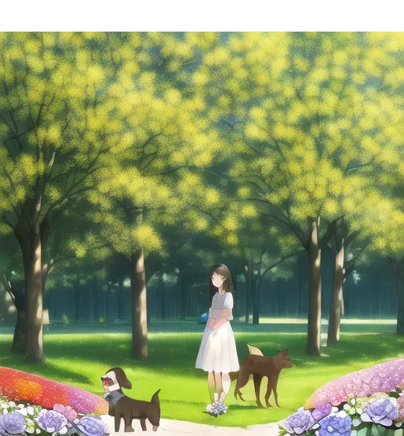
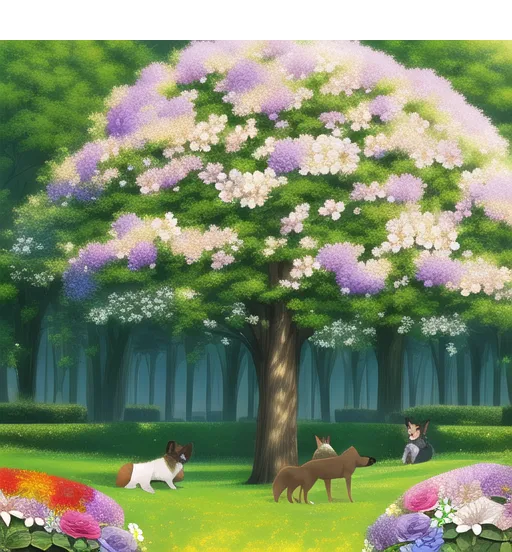
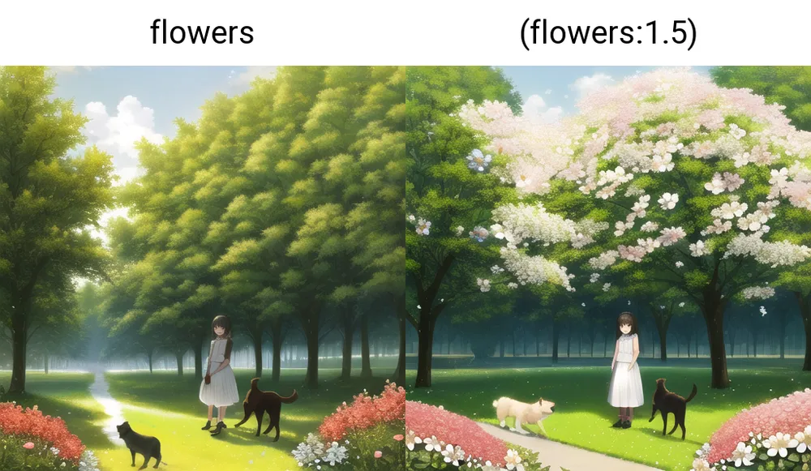
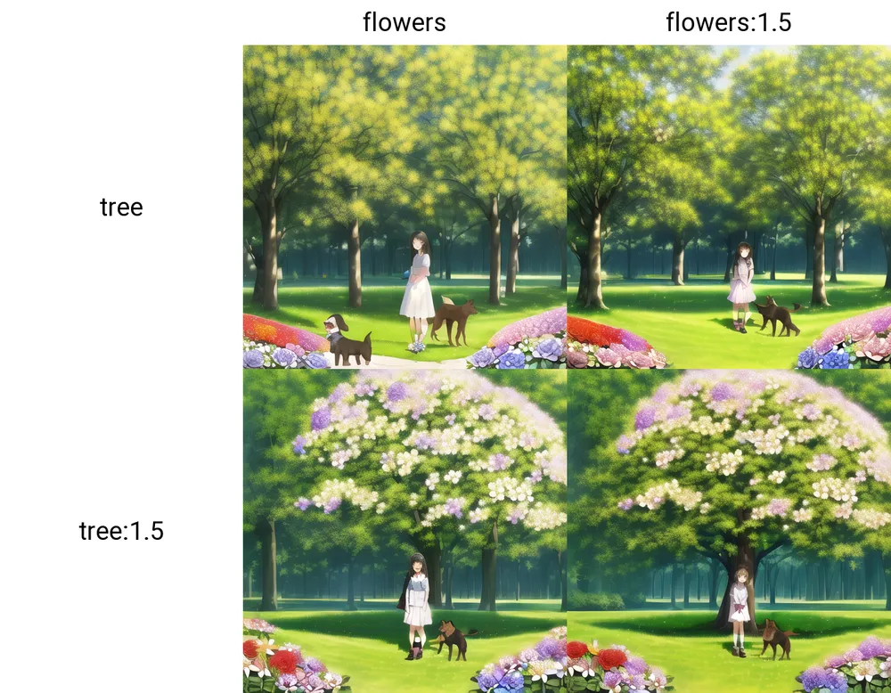
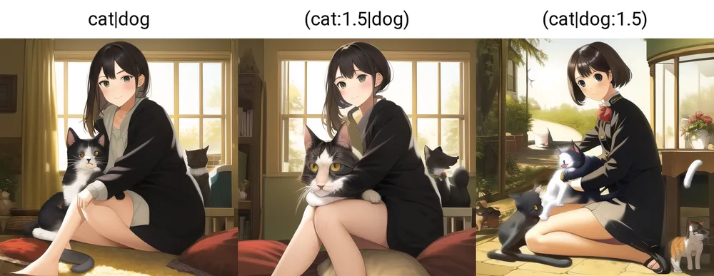
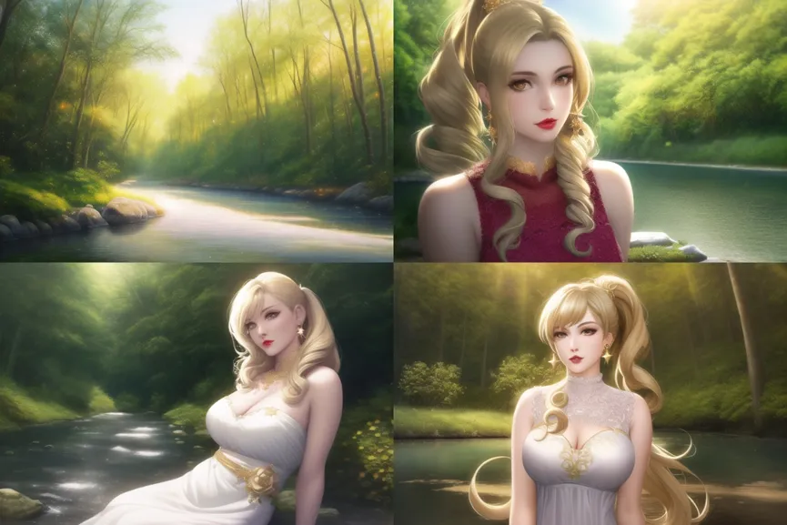

Web UI 관련 프롬프트 분석

AI/WebAI/StableDiffusion/참고자료/프롬프트/

목차

- [프롬프트의 구조](#프롬프트의-구조)
  - [기본 그림의 품질을 강조하는 단어](#기본-그림의-품질을-강조하는-단어)
  - [그림의 이미지를 부각시키는 화풍](#그림의-이미지를-부각시키는-화풍)
  - [효과기 (빛의 효과)](#효과기-빛의-효과)
- [주체(화면상의 본체 부분)](#주체화면상의-본체-부분)
- [장면(배경, 환경)](#장면배경-환경)
  - [환경 어휘](#환경-어휘)
  - [배경 어휘](#배경-어휘)
- [가중통제](#가중통제)
- [다중가중통제](#다중가중통제)
- [문장 강화](#문장-강화)
- [다중강화](#다중강화)
- [융합](#융합)
- [프롬프트의 구조2](#프롬프트의-구조2)
  - [넓은 의미의 삼단술식 구조](#넓은-의미의-삼단술식-구조)
- [프롬프트 모음](#프롬프트-모음)
  - [메인 프롬프트](#메인-프롬프트)
    - [통합팩 기본 메인 프롬프트](#통합팩-기본-메인-프롬프트)
  - [부정 프롬프트](#부정-프롬프트)
    - [통합팩 기본 부정 프롬프트](#통합팩-기본-부정-프롬프트)
    - [중국발 부정 프롬프트](#중국발-부정-프롬프트)
- [참고자료](#참고자료)


[원본 주소](https://arca.live/b/aiart/61501508)

# 프롬프트의 구조

## 기본 그림의 품질을 강조하는 단어

- masterpiece
- bestquality

등등

## 그림의 이미지를 부각시키는 화풍

- 일러스트 illustration
- 수채화 watercolor_medium
- 두껍게 바르다 impasto

등등

## 효과기 (빛의 효과)

- 광채 bestlighting
- 경심 lensflare 
- Depth of field

등등

# 주체(화면상의 본체 부분)

본체는 그림이 부각하려는 주체로 인물, 건축, 경물 등 다양한 주체를 묘사해야 디테일이 풍부한 그림을 얻을 수 있다.

주제 부분은 세세하게 묘사해야 구체화된다.우리는 보통 주체를 구체화하여 그림의 선명도를 높인다. 

캐릭터의 경우, 얼굴, 머리카락, 몸, 옷차림, 자세 등의 묘사가 대부분이다.

캐릭터가 없을 때는 장면의 중요한 점, 즉 구름처럼 높이 솟은 성, 피어나는 꽃, 부서진 시계 등 화면의 중심에 있는 물체를 묘사한다.


# 장면(배경, 환경)

## 환경 어휘

화면과 주변을 둘러싸고 있는 모습의 총칭.

- 화초밭과 같다 flowery meadow
- 깃털 feather
- 햇빛 sunlight 
- 하류 river
- 깨진 유리Broken glass

등등

## 배경 어휘

배경이 인물의 배후에 있게 도와주는 어휘.

- clock background

접미사는 보통 효과기와 유사하게 깃털, 섬광, 별 등 장면을 풍부하게 하는 데 사용된다.

접두사 효과기에 본체를 너무 적게 묘사하면 장면 쪽의 비중이 너무 커져 본체가 깨지기 시작한다.


# 가중통제

- 프롬프트는 앞에 있을수록 강하게 작용한다.
- 가중통제는 프롬프트에 괄호를 붙인다. ()는 Web UI식 강화, {}는 NovelAI식 강화, []는 약화이다.
- 괄호로 여러개 묶어서 단어를 강화해도 OK. 단어:숫자는 해당 프롬프트의 가중치를 직접 부여할 수 있다. 숫자가 커질수록 가중치가 커진다. 일반적으로 1이고, 보통 0~2 사이로 쓴다.
- () 사이에 숫자를 넣으면 권한 증가. [] 사이에 넣으면 권한 약화.

( []는 그 내용을 1.1로 나누기 위해  라고 쓰여져 있음. 확인 필요 )

프롬프트(prompt:권중수) 방식을 강력히 권한다.

{{{{}}}}이렇게 하면 ㅈㄴ 더럽기 때문이다. 발동은 하지만.

한 조의 단어를 선택한 후 방향키를 누르면 위아래로 직접 가중조정을 할 수 있다.


# 다중가중통제

{프롬1,프롬2,프롬3,프롬4_숫자}

괄호 안에 있는 프롬들의 가중치를 한꺼번에 올릴 수 있다.



```
masterpiece,(1girl,flowers,tree,dog_1.5)
```



```
masterpiece,(1girl),(flowers,tree,dog_1.5)
```

위 예시를 보면 위는 소녀1girl을 다른 프롬프트와 같이, 아래는 소녀를 분리해서 묶었다.

분리를 했더니 소녀가 사라진다. 상대적으로 적은 가중치를 부여했기 때문.


# 문장 강화

한 문장이 'a girl stands with (flowers:1.5) and dog'로 묘사된다면, 그 중 flowers에 대해서만 1.5권의 가중치를 부여하는 것이다.




# 다중강화

가급적이면 괄호 여러개 쳐서 강조하지 말고

하나의 괄호 안에 한 번 재조정하면 된다.

예를 들자면 아래 3개는 같은 가중치를 가진다.

```
((promptA),promptB,promptC)

((promptA),promptB,promptC:1.5)

(promptA:1.5,promptB,promptC:1.5) 

```




# 융합

두개 혹은 여러개의 키워드로 융합이 가능하다.

예를 들어 cat dog는 고양이와 개를 섞어서 1:1로 가능. 근데 많이 안 씀.

cat:0.2 dog 이렇게 해서 그 비율을 조정할 수도 있다. 이 비율은 최대 100이며 마이너스일 수 있고, 마이너스는 통제불능의 반대 효과가 있을 수 있다. 

```
cat:1 happy:-0.2 cute:-0:3
```



[참고링크 : 서로 다른 개념을 쓰까보고 싶을때: Prompt editing과 alternating](https://arca.live/b/aiart/60911605)


# 프롬프트의 구조2

## 넓은 의미의 삼단술식 구조

그림 한벌, 이게 어떤 그림인지, 구체적인 상황 ->

한 사람, 이게 어떤 사람인지, 사람의 구체적인 상황(사람의 모습, 어떤 옷인지, 사람이 뭘 원하는지) ->

한가지 배경, 이게 어떤 배경인지, 그 배경의 구체적인 상황(배경에 무엇이 있는지, 어떤 특색이 있는지) ->

배경의 물체, 이것이 어떤 물체인가, 그 물체의 구체적인 상황 ->

이 논리를 통해, 그러면 화면의 모든 것이 규칙적으로 할 수 있다. 큰 것부터 작은 것까지의 순서 묘사 : 

전체그림, (화풍 표현 1, 2), 주요 목표의 수(1girl), 주요 목표의 종류, 주요 목표의 구체적인 표현, 주요 목표에 대한 특수효과와 수식, 부차 목표의 수, 부차 목표의 종류, 부차 목표의 구체적인 표현, 부차 목표에 대한 특수 효과와 수식

예시 :

```
masterpiece, best quality, best 8k wallpaper, realistic oil painting, 1 magic girl, beautiful face, attractive red lips and beautiful big shining eyes, cream colored long curly hair with high ponytail, gold hair ornaments and star earrings, gorgeous white dress, gold patterns and lace, solo, sit down near a river in the forest, flowers, sunlight, bright spots, shine
```




# 프롬프트 모음

## 메인 프롬프트

### 통합팩 기본 메인 프롬프트
```
masterpiece, best quality
```

## 부정 프롬프트

### 통합팩 기본 부정 프롬프트
```
lowres, bad anatomy, bad hands, text, error, missing fingers, extra digit, fewer digits, cropped, worst quality, low quality, normal quality, jpeg artifacts, signature, watermark, username, blurry, artist name
```

### 중국발 부정 프롬프트
이 때는 모델을 animefull-latest로 사용.
```
multiple breasts, (mutated hands and fingers:1.5), (long body :1.3), (mutation, poorly drawn :1.2), black-white, bad anatomy, liquid body, liquid tongue, disfigured, malformed, mutated, anatomical nonsense, text font ui, error, malformed hands, long neck, blurred, lowers, low res, bad anatomy, bad proportions, bad shadow, uncoordinated body, unnatural body, fused breasts, bad breasts, huge breasts, poorly drawn breasts, extra breasts, liquid breasts, heavy breasts, missing breasts, huge haunch, huge thighs, huge calf, bad hands, fused hand, missing hand, disappearing arms, disappearing thigh, disappearing calf, disappearing legs, fused ears, bad ears, poorly drawn ears, extra ears, liquid ears, heavy ears, missing ears, fused animal ears, bad animal ears, poorly drawn animal ears, extra animal ears, liquid animal ears, heavy animal ears, missing animal ears, text, ui, error, missing fingers, missing limb, fused fingers, one hand with more than 5 fingers, one hand with less than 5 fingers, one hand with more than 5 digit, one hand with less than 5 digit, extra digit, fewer digits, fused digit, missing digit, bad digit, liquid digit, colorful tongue, black tongue, cropped, watermark, username, blurry, JPEG artifacts, signature, 3D, 3D game, 3D game scene, 3D character, malformed feet, extra feet, bad feet, poorly drawn feet, fused feet, missing feet, extra shoes, bad shoes, fused shoes, more than two shoes, poorly drawn shoes, bad gloves, poorly drawn gloves, fused gloves, bad cum, poorly drawn cum, fused cum, bad hairs, poorly drawn hairs, fused hairs, big muscles, ugly, bad face, fused face, poorly drawn face, cloned face, big face, long face, bad eyes, fused eyes poorly drawn eyes, extra eyes, malformed limbs, more than 2 nipples, missing nipples, different nipples, fused nipples, bad nipples, poorly drawn nipples, black nipples, colorful nipples, gross proportions. short arm, (((missing arms))), missing thighs, missing calf, missing legs, mutation, duplicate, morbid, mutilated, poorly drawn hands, more than 1 left hand, more than 1 right hand, deformed, (blurry), disfigured, missing legs, extra arms, extra thighs, more than 2 thighs, extra calf, fused calf, extra legs, bad knee, extra knee, more than 2 legs, bad tails, bad mouth, fused mouth, poorly drawn mouth, bad tongue, tongue within mouth, too long tongue, black tongue, big mouth, cracked mouth, bad mouth, dirty face, dirty teeth, dirty pantie, fused pantie, poorly drawn pantie, fused cloth, poorly drawn cloth, bad pantie, yellow teeth, thick lips, bad camel toe, colorful camel toe, bad asshole, poorly drawn asshole, fused asshole, missing asshole, bad anus, bad pussy, bad crotch, bad crotch seam, fused anus, fused pussy, fused anus, fused crotch, poorly drawn crotch, fused seam, poorly drawn anus, poorly drawn pussy, poorly drawn crotch, poorly drawn crotch seam, bad thigh gap, missing thigh gap, fused thigh gap, liquid thigh gap, poorly drawn thigh gap, poorly drawn anus, bad collarbone, fused collarbone, missing collarbone, liquid collarbone, strong girl, obesity, worst quality, low quality, normal quality, liquid tentacles, bad tentacles, poorly drawn tentacles, split tentacles, fused tentacles, missing clit, bad clit, fused clit, colorful clit, black clit, liquid clit, QR code, bar code, censored, safety panties, safety knickers, beard, furry,pony, pubic hair, mosaic, excrement, faeces, shit, futa, testis
```


# 참고자료

[원소법전 제작자의 기초강의 요점정리 노트](https://arca.live/b/aiart/61501508)