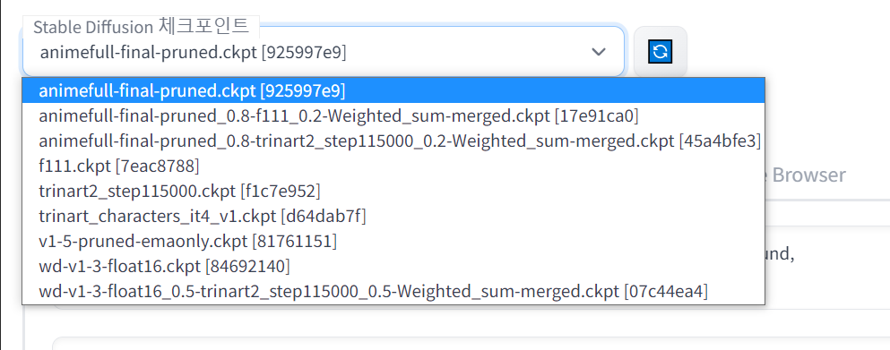
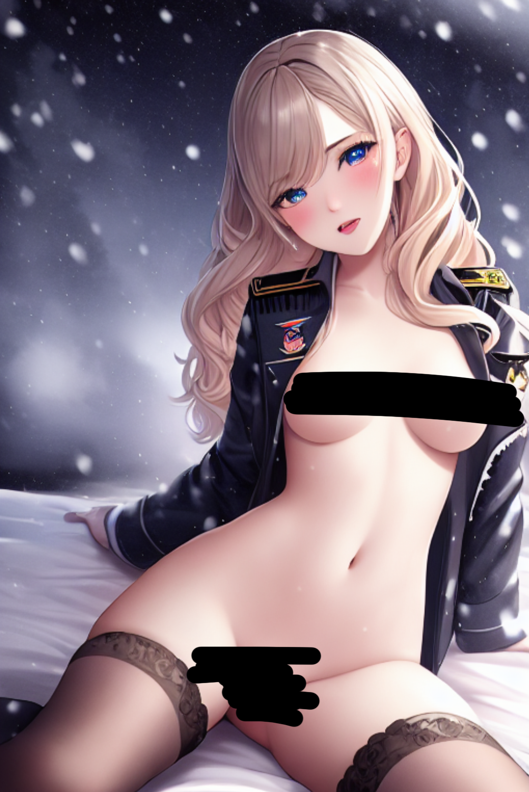
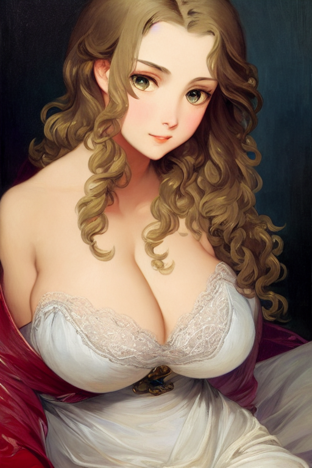

Web UI 관련 모델 모음

AI/WebAI/StableDiffusion/모델/

목차
- [현재 보유중 모델 목록과 hash값](#현재-보유중-모델-목록과-hash값)
- [Stable Diffusion(SD)](#stable-diffusionsd)
- [NAI 유출 모델](#nai-유출-모델)
  - [animefull-final-pruned](#animefull-final-pruned)
- [Waifu Diffusion(WD)](#waifu-diffusionwd)
  - [wd-v1-3-float16](#wd-v1-3-float16)
- [Trinart stable diffusion(Trinart)](#trinart-stable-diffusiontrinart)
  - [trinart2_step115000](#trinart2_step115000)
  - [trinart_characters_it4_v1](#trinart_characters_it4_v1)
- [Zeipher F111 Female Nude(F111)](#zeipher-f111-female-nudef111)
- [모델 병합](#모델-병합)
  - [NAI 0.8 + Trinart 0.2](#nai-08--trinart-02)
  - [NAI 0.8 + F111 0.2](#nai-08--f111-02)
  - [WD 0.5 + Trinart 0.5](#wd-05--trinart-05)
- [외부 링크](#외부-링크)

# 현재 보유중 모델 목록과 hash값


# Stable Diffusion(SD)
hash : 81761151

[배포 링크(huggingface)](https://huggingface.co/blog/stable_diffusion)

앞으로 설명될 모든 모델들의 근본이다.


# NAI 유출 모델

## animefull-final-pruned
hash : 17e91ca0


# Waifu Diffusion(WD)

## wd-v1-3-float16
hash : 84692140

[배포처 링크(github)](https://gist.github.com/harubaru/f727cedacae336d1f7877c4bbe2196e1)


# Trinart stable diffusion(Trinart)

## trinart2_step115000
hash : f1c7e952

[배포처 링크(huggingface)](https://huggingface.co/naclbit/trinart_stable_diffusion_v2)


## trinart_characters_it4_v1
hash : d64dab7f

[배포처 링크(huggingface)](https://huggingface.co/naclbit/trinart_characters_19.2m_stable_diffusion_v1)


# Zeipher F111 Female Nude(F111)
hash : 7eac8788

[배포처 링크](https://ai.zeipher.com/)

# 모델 병합

## NAI 0.8 + Trinart 0.2
hash : 45a4bfe3

animefull-final-pruned_0.8-trinart2_step115000_0.2-Weighted_sum-merged.ckpt



```
realistic painting, masterpiece, highest quality, high quality, highres,
nude, trembling, skirt, pussy, nipples, thigh highs, detailed face+eyes, falling snow,
(child), small breasts, cute, detailed face and eyes, wavy hair, frills, revealing lingerie, see-through, aroused, oversized (military jacket:1.3)
by Jeremy Lipking

Negative prompt: lowres, bad anatomy, disfigured hands, text, error, missing fingers, extra digit, fewer digits, cropped, worst quality, low quality, normal quality, jpeg artifacts, signature, watermark, username, blurry, out of focus, censorship, ugly, old, deformed, amateur drawing, odd, fat, adult, anime

Steps: 20
Sampler: DDIM
CFG scale: 18
Seed: 3809562064
Model: nai-aminefull-final-pruned_0.8-trinart2_step115000_0.2-Weighted_Sum-merged
Denoising strength: 0.6
```


## NAI 0.8 + F111 0.2
hash : 17e91ca0

[AIBooru 글](https://aibooru.online/posts/2738?q=realistic)

animefull-final-pruned_0.8-f111_0.2-Weighted_sum-merged.ckpt

[아카라이브 원본글](https://arca.live/b/aiart/61241925)


```
masterpiece, best quality, finely detailed beautiful eyes and detailed face, asian, (realistic:1.8), (photo), teenage, small breasts, blonde long hair, blue eyes, school uniform, kpop, light smile, looking at viewer, standing in school, depth of field

Negative prompt: lowres, bad anatomy, (mutated hands and fingers:1.5), (long body :1.3), (mutation, poorly drawn :1.2), bad hands, text, error, missing fingers, extra digit, fewer digits, cropped, worst quality, low quality, normal quality, jpeg artifacts, signature, watermark, username, blurry, artist name, one hand with more than 5 fingers, one hand with less than 5 fingers, error, malformed hands, long neck, fused ears, bad ears, bad face, fused face, poorly drawn face, cloned face, big face, long face, bad eyes, fused eyes, poorly drawn eyes, fused fingers, pubes, pubic hair

Steps: 40, Sampler: DDIM, CFG scale: 11, Seed: 842505225, Size: 512x768, Model hash: 17e91ca0, Batch size: 4, Batch pos: 1, Clip skip: 2
```


## WD 0.5 + Trinart 0.5
hash : 07c44ea4

wd-v1-3-float16_0.5-trinart2_step115000_0.5-Weighted_sum-merged.ckpt

[아카라이브 원본글 링크](https://arca.live/b/aiart/60816940)




```
best quality, masterpiece, highres, victorian girl, thick eyebrow, ( Francois Boucher), alphonse mucha, (krenz cushart), (photo realistic), ((cleavage)), ((HUGE BREASTS)), FEMININE, (((PERFECT FACE))), (thick thigh), intricate, SHARP, smik, (oil painting), simple background, ((cowboy shot)), detailed pupils, (sexy face), light, big eyes,
Negative prompt: ((nipple))((((ugly)))), (((duplicate))), (((hat))), ((morbid)), ((mutilated)), (((tranny))), (((trans))), (((transsexual))), (hermaphrodite), [out of frame], extra fingers, mutated hands, ((poorly drawn hands)), ((poorly drawn face)), (((mutation))), (((deformed))), ((ugly)), blurry, ((bad anatomy)), (((bad proportions))), ((extra limbs)), cloned face, (((disfigured))). (((more than 2 nipples))). [[[adult]]], out of frame, ugly, extra limbs, (bad anatomy), gross proportions, (malformed limbs), ((missing arms)), ((missing legs)), (((extra arms))), (((extra legs))), mutated hands, (fused fingers), (too many fingers), (((long neck))), (((hat)))
Steps: 40, Sampler: DDIM, CFG scale: 11, Seed: 928875659, Size: 512x768, Model hash: 07c44ea4, Clip skip: 2
```


# 외부 링크

[Stable Diffusion 모델들 모음 사이트](https://rentry.org/sdmodels)