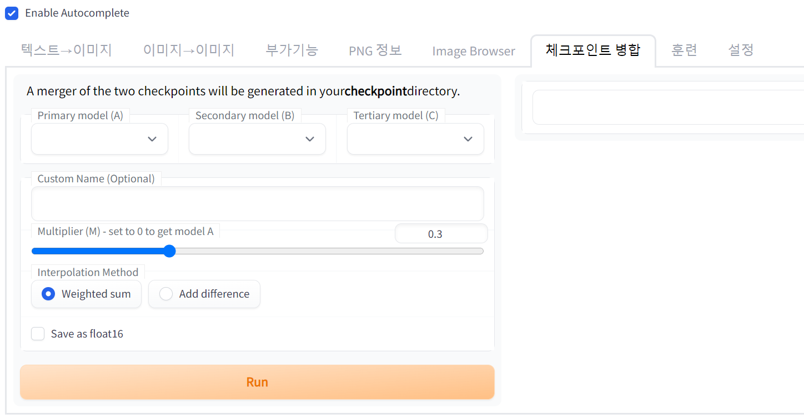
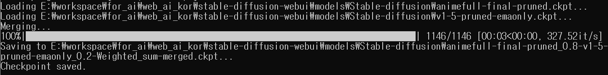
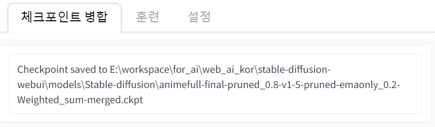
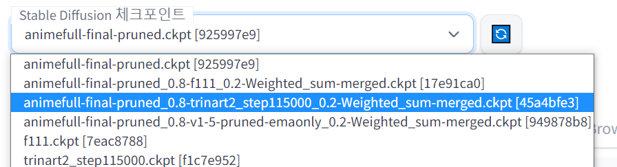
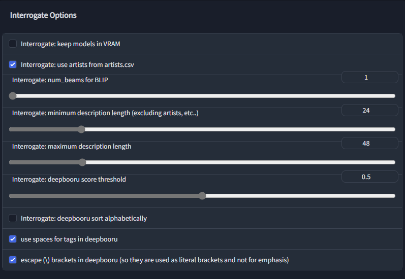
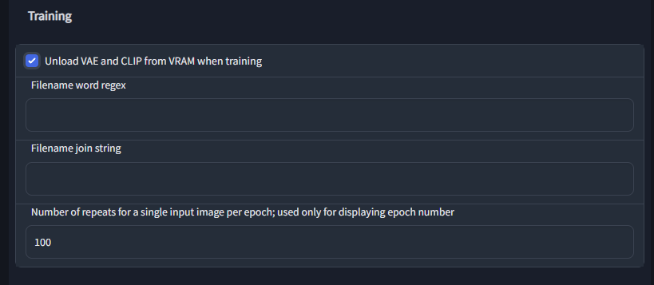
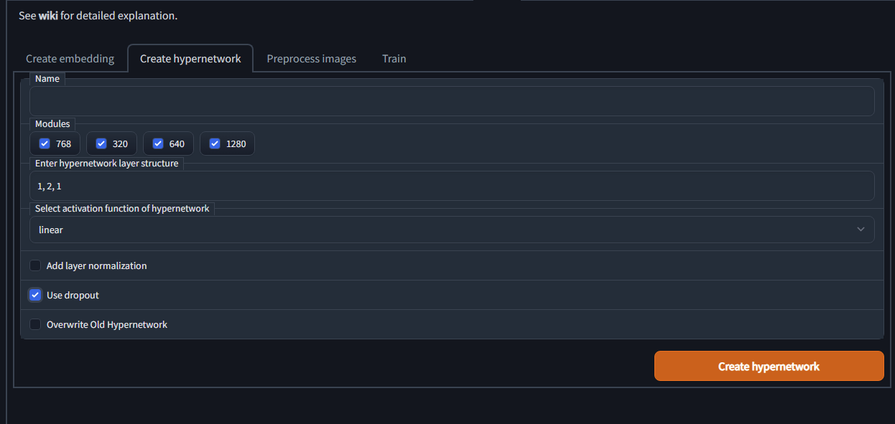
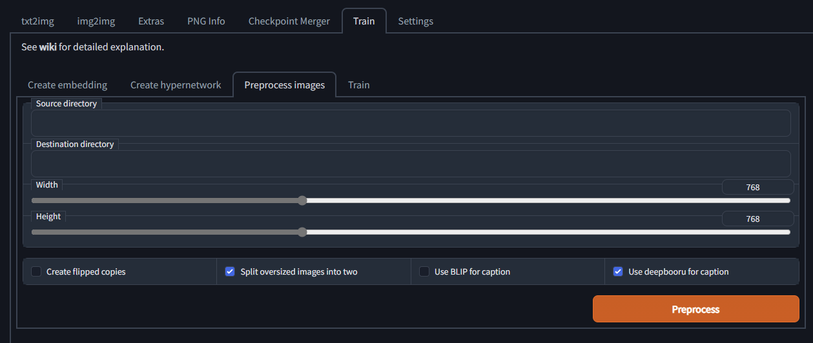
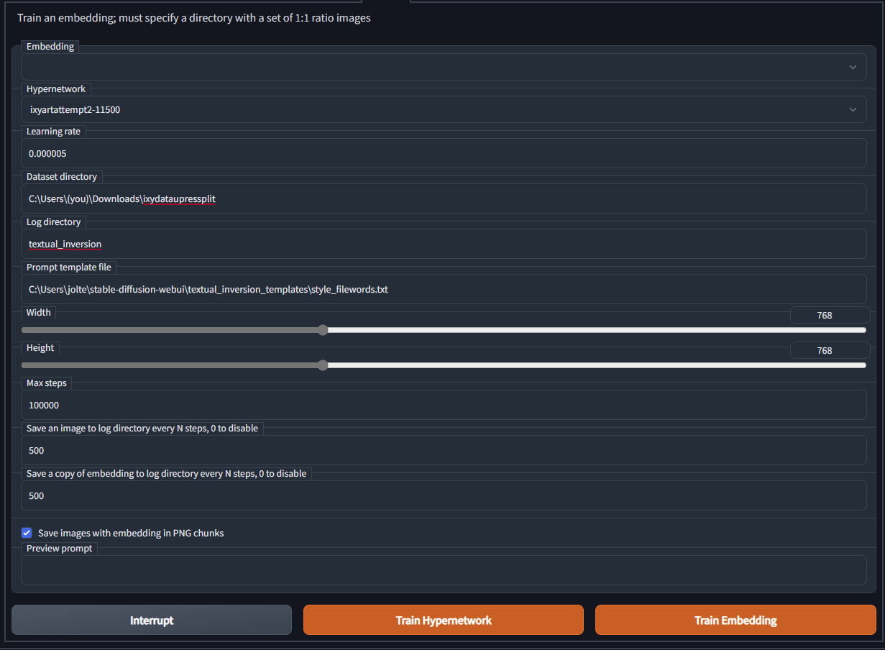
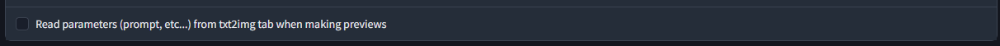

WebUI 중급 사용법 정리

AI/WebAI/StableDiffusion/사용법

목차

# 모델 체크포인트 병합

모델 ckpt 파일들을 병합해서 하나의 모델을 출력하는 기능이다. 두 모델의 특성을 어느정도 섞어서 좀더 좋은 결과물 출력을 원할때 사용한다. (반대로 역효과 감안도 해야 한다)

최대 3개까지 모델을 넣을 수 있는데 보통 2개(A, B)로 병합한다. 가끔 프롬프트 검색 사이트에서 이름에 0.8 이라든가 weighted sum 이라든가 하는 명칭이 붙은 모델을 썼다고 올라올 경우, 이 기능을 써서 병합된 모델을 사용한 것이다.

Multiplier(M) 옵션 : 모델 A에 모델 B를 비율 몇으로 병합할지를 정하는 옵션이다. 기본값은 0.3이다. 이 경우 모델 A가 0.7, 모델 B가 0.3 비율로 병합된다.

Interpolation Method : 보간(Interpolation) 방식에 대해서 설정한다. Weighted Sum은 가중합이라는 방식, Add difference 는 무슨 차이를 추가시킨다는 의미 같은데 둘다 뭔소린지 모르겠지만 보통 Weighted Sum을 쓰는것 같다.

Save as float16 : 학습 및 저장 자료형에 대한 옵션. 기본값은 OFF(체크해제)이며 이때는 float32 형태로 저장한다. float16 으로 저장된 버젼은 모델의 용량이 줄어서 로드했을때 VRAM 메모리 점유가 절반 정도가 되는 장점이 있지만, float32 보다는 정밀도가 떨어지므로 결과물의 품질 저하 가능성을 어느정도 감안해야 한다.

Run : 병합 기능을 실행한다.

병합 후에는 이렇게 결과물 이름과 경로가 출력되고, Web UI 최상단 체크포인트 목록에도 자동으로 표시된다. 바로 써보고 싶으면 선택해서 로드 후 사용하면 된다.

# 뉴비를 위한 하이퍼 네트워크(hypernetwork) 설명 요약 정리

[원본글 링크](https://rentry.org/hypernetwork4dumdums)

[아카라이브 번역글](https://arca.live/b/aiart/60913615)

번역글 당시 원문에서 일부 업데이트 된 사항이 있는데 그 부분도 요약 정리 내용에 포함했음.

2022년 10월 22일 기준의 지식으로 작성됨.(by ixynetworkanon)

## 하이퍼 네트워크 정의

특정한 프롬(특정 작화, 캐릭터)을 짜느라 쓸데없는 토큰을 사용하거나 추가하지 않고도 너가 출력하고픈 이미지에 모두 적용할 수 있는 방법.

## 하이퍼 네트워크 필요 사항

VRAM 8GB 이상 요구. 

절대로 Web UI 실행시 --medvram (저사양 옵션)을 활성화한 상태로 하이퍼 네트워크를 학습시키면 안된다. 매우 안좋은 결과를 낳는다고 검증되었다.

## 1단계 : 좋은 데이터를 수집한다

원하는 하이퍼 네트워크를 구축하는데 소요되는 시간의 대부분은 이 단계에서 소요된다.

**(1) 좋은 데이터의 기준**

1. 아티스트의 스타일이나 주제에 대한 더 명확한 레퍼런스일 것.
2. 일관된 품질과 스타일일 것.
3. 텍스트와 기호가 없을것. 있으면 지워라.

**(2) 질 나쁜 데이터를 양질의 데이터로 만들기 위해 해야 하는 일**

1. 이미지를 당신 스스로 편집하기 혹은 모델에게 먹이기 싫은 요소를 이미지에서 지우기 (텍스트 같은 것들)
2. 나중에 사전 처리(Preprocessing)하기에 더 좋은 비율로 이미지의 캔버스를 자르거나 크기를 조정하기
3. AI 학습용 해상도보다 작으면 AI 업스케일러로 고해상도로 바꿔주기(cupscale을 사용하는 것을 추천. 학습시키려는 이미지에 가장 적합한 모델을 찾을것).

## 2단계 : 설정 및 기타 사항

**(1) 우선, webui-user.bat 파일을 메모장 등으로 열어라.**

COMMANDLINE_ARGS에 --deepdanbooru 옵션이 들어있는지 확인하고 없으면 설정한다. 학습 목적으로 사용되기도 하고, 다른 기능에서도 유용하다.

**(2) 그 다음, 정확히 아래 설정대로 되어 있는지 확인한다.**

Interrogate: deepbooru sort alphabetically : OFF. deepbooru 태그를 알파벳 순으로 정렬하도록 하는 옵션이다. 프롬프트 입력 시 앞에 있는것이 우선순위가 높은데, 알파벳 순으로 정렬하는것은 우선순위 순으로 정렬하는것이 아니기 때문에 학습에 악영향이 있다. 

escape(\) brankets in deepbooru (so they are used as literal branckets and not for emphasis) : ON. deepbooru 태그 원본에 달려 있는 괄호에 이스케이프(\) 문자를 붙여서, 해당 괄호가 Web UI의 프롬프트에서의 태그 강조 문법(괄호로 태그를 감싸는것) 용도로 사용되지 않도록 하는 옵션이다.

Unload VAE and CLIP from VRAM when training : ON. 반드시 ON. 학습 중에는 VAE와 CLIP 기능을 꺼두는 옵션이다. 이 두 기능이 학습에 악영향을 끼치는 것을 막기 위해서.

다음은 VAE가 특정 시점 이후부터 하이퍼 네트워크 학습을 망치는 예시이다.

## 3단계 : 하이퍼 네트워크 파일 만들기, 전처리(Preprocessing)

이름은 뭘로 지어도 상관없지만 위 설정 중 하나라도 선택 취소하면 안된다. 

Layer structure : 레이어 구조. 기본값 그대로 둔다. (1,2,2,1 로 세팅하는 경우엔 8장 ~ 16장 정도의 소규모 데이터 세트를 통해 하이퍼 네트워크를 만들때 도움이 된다)

Activation funciton : 활성화 함수. 많은 시도를 통해 검증된 linear 로 세팅할 것. relu/leakyrelu 를 시도해봐도 되지만, 효과가 많이 검증되지 않은 방식이고 실망스러운 결과들이 보고되었으며, elu와 swish 역시 아직 탐구되지 않은 방식이다.

Use Dropout : ON. 과적합(overfitting)/artifacts 를 피하는데 유용해서 사용.

Layer normalization : OFF. 가치가 없어보이므로. (이 옵션에 대해 정말 많은 테스트를 진행했지만 성공적인 결과물은 아직 없다)

**(중요) 해상도(Width, Height) 설정에 대한 몇가지 숙지 사항**

1. 학습시킬 이미지들의 해상도를 설정하고, **절대 다른 해상도로 설정하지 말 것**. 
2. 학습시킬 이미지들의 해상도를 **1 : 1 종횡비로 정사각형 형태로 만들 것**. 다른 종횡비로도 학습은 가능하지만 권장하지 않는 사항이고 더 나쁜 결과가 출력된다.

Create flipped copies : 학습시킬 이미지의 양이 적다면 ON. 학습시킬 이미지들의 좌우반전된 이미지를 생성해서 학습 데이터 양을 늘리는 편의 기능.

Split oversized images into two : 앞서 말한 해상도 숙지 사항을 제대로 지켰다면 ON/OFF 양쪽 모두 영향 없음. 학습시킬 이미지가 설정된 해상도보다 더 큰 경우 이미지를 둘로 나누는 옵션이며, 둘로 잘랐을때 이로 인해 학습시키고 싶은 요소가 잘려나가 학습 결과에서 손실 발생 우려 있음.

Use deepbooru for caption : ON. deepbooru 자동 태그 기능이며, 프롬프트 학습에 매우 중요한 부분. 태그 정보가 없는 학습 이미지들의 경우 매우 유용.

Source Directory : 학습시킬 이미지 데이터를 모은 폴더의 경로

Destination Directory : 전처리 출력 결과를 저장할 폴더의 경로

Preprocess 버튼을 누르면 실행이 되고, 모든 결과는 결과 저장 폴더로 저장됨.

## 4단계 : 학습 설정

Hypernetwork : 앞서 단계에서 만든 하이퍼 네트워크 파일을 지정한다.

Learning rate : 0.000005. 5e-6이라고도 한다(표현의 차이). 소수점 0을 하나 더 붙여 0.0000005 (5e-7)로 진행하기도 한다. 학습률에 대한 설정이며, 값이 높을수록 학습이 빨라지지만, 너무 높으면 임베딩이 깨지는 위험성이 있다. 5e-6에서 괜찮은 결과가 보장되지만, 학습 데이터에 따라서는 과잉 학습(overtain)이 시작되어 9000~16000 정도 단계에서 하이퍼 네트워크가 죽을 수도 있다. 이는 학습 스케쥴러(training scheduler)를 설정하면 피해보도록 시도할 수 있는데, 학습률 5e-6일 경우 12000, 5e-7일 경우 30000 으로 설정한다. 이는 12000을 넘으면 더 낮은 학습률로 전환하여 과잉 학습을 막고 하이퍼 네트워크가 죽는것을 막는 효과가 있다.

최신에는 임베딩 Learning rate가 있고, 하이퍼 네트워크 Learning rate가 나뉘어져 있는데, 여기서는 하이퍼 네트워크 쓸거니까 하이퍼 네트워크 쪽 Learining rate 만 설정해주면 될듯?

Dataset directory : 앞서 단계에서의 전처리 출력 결과 폴더 경로를 지정.

Log directory : 학습되는 하이퍼 네트워크 및 미리보기 샘플들이 순서대로 저장될 경로.

Prompt template file : 학습하는 프롬프트가 어떤 형식을 지닐지 결정. 그다지 중요한 부분은 아닌듯. style_filewords.txt를 선택하면 프롬프트에 자동으로 art by [하이퍼네트워크이름]이 추가되고, subject_filewords.txt를 선택하면 a photo of [하이퍼네트워크이름]이 자동으로 추가됨. 두 경우 모두 딥단부루로 생성된 프롬을 가지고 있으니 걱정되면 학습시킬 태그를 추가해주자. 

해상도 (Width, Height) : 앞서 단계의 학습 이미지 숙지사항을 되새겨서 설정할 것.

Max steps : 기본값 100000. 아무 것도 건드리지 않았을때 끝까지 진행할 최대 단계를 정한다. 하지만 대부분의 경우 멈추고 싶을때 Stop을 누르면 멈추고 저장되기 때문에 설정 수치에 대해 걱정하지 않아도 된다. 다만 밤새도록 돌려서 전기세가 걱정되면 적당히 수치를 줄인다.

Save an image/embedding to log directory every N steps : 기본값 500. 앞서 지정한 Log directory 경로에, 여기서 지정한 단계만큼의 학습 진행 이미지와 임베딩을 저장한다. 하드 용량이 모자라다면 0으로 꺼둬도 되고, 아무튼 자기 사정에 맞게 기본값을 쓰거나 수치를 조절할 것.

Read parameters (prompt, etc ...) from txt2img tab when making previews : 이 옵션을 ON 하고 텍스트->이미지 메뉴로 가서 학습 결과 및 중간 과정에서 보고 싶은 프롬프트와 기타 설정들을 입력하면 확인할수 있다. 시드를 -1로 두면 여러 장의 샘플을 통해 전체적인 변화를 관찰 가능. 시드를 고정한다면 한 그림에 대해 내가 원하는 스타일/캐릭터가 정밀하게 나오는지 확인 가능.

이제 Train hypernetwork 버튼을 누르고 학습되는걸 기다린다.

