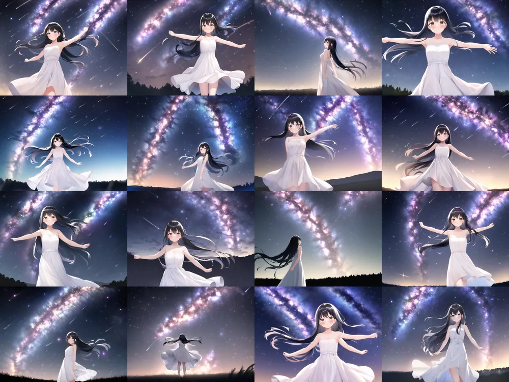
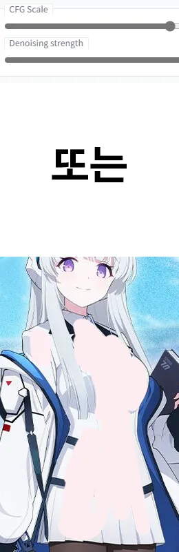

Web UI 관련 프롬프트 분석

AI/WebAI/StableDiffusion/참고자료/프롬프트/

목차


[공지글](https://arca.live/b/aiart/61139678?target=all&keyword=%EC%9B%90%EC%86%8C%EB%B2%95%EC%A0%84&p=1)

팁과 정보 모음 정독

# 프롬프트 팁 모음

## 공략 SD-WebUI 프롬프트 사용법 문법 총정리

[원본글](https://arca.live/b/aiart/60466181)

(1) 가중치를 쓰자. 다만 가중치를 과하게 주면, 아웃풋 그림 자체가 깨져서 제대로 안나온다. 1.5를 초과해서 주는 건 자제할 것.

(2) 프롬프트는 앞에 위치할 수록 더 잘 반영된다. 

(3) 태그로 묘사하는게 어렵다면 문장형으로 시도해보자.

(4) 색깔 관련된 프롬프트들을 많이 넣으면 많이 넣을수록, 서로가 서로를 망가뜨릴 확률이 꽤나 높아진다. 색깔과 전혀 상관없는 프롬프트들을 색깔 프롬프트 사이에 쿠션처럼 넣어주면 망가질 확률이 체감상 좀 낮아진다. 근본적으로는 색깔 관련 프롬프트의 수를 최대한 줄이는 것이 정신건강에 이롭지만, 내 머릿속의 환상의 그림을 뽑아내기 위해서 색깔을 포기할 순 없는 노릇. 가중치와 쿠션을 적절히 섞어가며 조절해보자.

(5) Negative Prompt.일반 Prompt에 주어진 프롬프트들을 AI는 정말 다양한 방식으로 해석한다. 단어별로 끊어서 가능한 거의 계통도를 그리는 느낌으로. 하지만 그런 무궁무진한 해석의 계통도를 그릴 때에도, AI가 절대 참조하지 않는 것이 있다. 바로 주어진 Negative prompt.

(6) 마지막 문법은 | 다. 얘는 기능 자체는 특정 스크립트를 활성화시켜야 작동한다.

Prompt matrix.

이 스크립트가 미적용된 상태여도, 파서 자체는 | 에 반응할 가능성이 높기 때문에, 사용법을 모르는 상황에서는 | 를 사용하지 않는 것이 좋다. 며칠동안 여기서 이거 넣었다가 태그 섞여서 나왔다고 절규하는 애들 몇명 봤다.

Prompt matrix는 예를 먼저 들어보겠다.

```
a girl standing|on the boat|on the lake
```

프롬프트 A| 프롬프트 B| 프롬프트 C 의 형식으로 구성되어 있다.

저렇게 입력 시, 4개의 이미지가 생성된다.

각각의 프롬프트들은 다음과 같다.


```
a girl standing
a girl standing on the boat
a girl standing on the lake
a girl standing on the boat on the lake
```

대충 감이 오는가?

| 를 사용 시, 제일 앞에 있는 프롬프트는 고정된 상태에서, 뒤에 있는 프롬프트들의 가능한 모든 조합으로 이미지들을 뽑아서 보여준다.

프롬프트 A | 프롬프트 B | 프롬프트 C | 프롬프트 D ... 같은 식으로 쭉 이어나갈 수 있다. 당연하지만 프롬프트가 많아질수록 경우의 수가 많아지기 때문에, 뽑아내는 이미지의 양도 많아진다.


(7) 태그에 괄호가 들어간 경우, 가중치 증가 용도로 사용할게 아니면 \ 를 사용하면 된다. ( 좌상단에서 우하단으로 뻗는 백슬래시 기호)

```
ganyu\(genshin impact\)
```

이렇게 프롬프트를 입력하면, 가중치를 주지 않고 순전히 괄호 그 자체로 사용할 수 있게 된다. 저 백슬래시를 괄호 앞에 붙이면 그냥 괄호로 인식이 되는 셈.


(7) 마지막으로, 태그를 입력할 때 그냥 스페이스바를 눌러서 띄우는 것과, 언더바(_)를 사용해서 띄우는 것에도 결과물이 미묘하게 달라지는 효과가 있다. 기호 때문에 노이즈가 섞여 들어간 결과이다.


## 원숭이도 따라할수있는 WebUI로 그림 뽑아내기 가이드 1편

[원본글](https://arca.live/b/aiart/60606603)

(1) looking afar / looking sideways는 조금 더 갬성있는 분위기를 연출해 보려고, 여자아이가 옆으로 먼산을 쳐다보게 해봤다.

비슷하게 windy도 머리가 조금더 휘날리게 해서 갬성을 추가해보려는 노력.

meteor shower는 유성우다. 유성우까지 있으면 갬성이 충분해질것 같아서 추가해봤다.

looking from afar가 생각했던 대로 작동하지 않았으니, 프롬프트를 고쳐봤다. the girl is very far away from viewer 정도면 시점이 존나 멀어지겠지? 싶어서 이대로 다시 뽑아봤다.

(2) 

scenery 프롬프트를 추가하면 AI는 배경도 묘사하려고 시도하는데, 그 과정에서 배경에 조금 더 무게가 가게 되고 상대적으로 묘사한 인물에게 포커스가 덜 주어지는 효과가 있다.

scenery 태그를 그냥 넣고 돌렸더니, 배경이 또 너무 강조되더라. 가중치를 조정해서 조금 약하게 바꿨다.

masterpiece, best quality, 1girl, black hair, long hair, touched face, white dress, standing, spreading arms, milky way, meteor shower, night sky, looking afar, looking sideways, (scenery:0.9), windy




## Inpaint 기능으로 캐릭터 벗짤을 만들어보자 (기능설명)

[원본글](https://arca.live/b/aiart/60364202)


사이트 확대기능과 펜 사이즈 조절을 적절히 이용해서 벗길부분을 칠하자


난 마스크블러 0, 스텝 40으로 작업함


그리고 벗길부분에 대한 설명 (유두, 가슴사이즈, 뷰지, 등등)을 적고 generate를 누르면




잘 안나온다면 아래의 Denoising Strength 옵션을 건드려보거나 짤 자체에 살색을 칠하고 하면 더 잘될거임


## 누더기 골렘 기법으로 AI 디테일 살리는법

[원본글](https://arca.live/b/aiart/60071669)

원본


어찌저찌 돌려서 나온 원하던 느낌의 짤


디테일 주고 싶은 요소 포토샵으로 짤라서 붙여준다. 3개잎 남색 머리띠, 기다란 분홍색들어간 땋은 머리, 쇠고리모양 머리묶는 악세서리, 앞머리 양쪽으로 땋은 머리, 앞치마의 하트, 젖소모양 슬리퍼, 등에 달린 하얀색 큰 리본을 짤라서 넣었음


Streagth를 5보다 적게 noise는 0.02이하 Scale은 5~10 돌리다보면


## 포토샵으로 더욱 더 완벽한 Ai다루는 방법

[원본글](https://arca.live/b/aiart/60052003)


포토샵을 같이 활용하면 구도 풍경 전신 가챠 돌릴 필요없이 바로 만들 수 있어


위 캐릭터의 특징들 적어서 Ai를 돌렸는데, 전신은 안나오고 이런식으로만 나올때, 포토샵을 같이 활용하면 구도 풍경 전신 가챠 돌릴 필요없이 바로 만들 수 있다.


풍경 및 구도를 참고할 짤을 하나 구하고


이렇게 대충 붙이고 streath를 5이하로 돌리다보면


요런식으로 나옴 


## 캐릭을 만드는 과정 A부터 Z까지 (with 블루아카 이로하)


요 캐릭터를 만들어 볼 것

아래는 이로하를 만들어보는 과정


여기에서 이로하의 특징중 헤어 부분만 넣은 것

long hair (긴머리)

red hair (빨간색)

messy hair (산발)

wavy hair (웨이브)

총 4개의 태그를 넣었고, 헤어는 어느정도 비슷하게 나오는 것 같다.

근데 가슴 크기의 상태가??


여기서 가슴을 줄여보겠다고 small breasts 태그를 넣었을 때 모습

가슴 태그를 사용하는 순간 크기 말고도 그냥 가슴을 강조하려고 하기 때문에 의상도 저렇게 변한다

괄호나 옷 태그를 사용하면 좀 달라지긴 하겠지만 몇몇 옷은 또 가슴이 강조되게 바뀌므로 별로 추천하지는 않음


제외 태그에 big breasts 를 넣은 모습

가슴을 강조하는 옷이나 앵글로 나오지 않으면서, 가슴 크기를 제한하는데 성공했다.


캐릭터 눈 색상을 추가 (blue eyes)

어느정도 틀이 잡혀가는 것 같다


여기서 의상 태그를 넣어준다

lack_long_coat, black_shirt, red_necktie, long_sleeves, red_armband


먼가 아직 좀 아쉽지만 그래도 어느정도 좀 틀이 잡히는 것 같다


black_navy_hat

모자 태그까지 추가한 모습


sitting on floor

포즈를 지정

근데 앞에 썻던 태그를 다 팔아먹고 파란넥타이랑 흰 셔츠로 바뀐 모습

저 두 부분을 제외하고는 대강 맘에 들게 나왔으므로 에디트 이미지로 편집에 들어감


대충 바꾸고 싶은 부분에 비슷한 색상으로 색칠을 해준다

너무 빈 공간이 많으면 이상하게 나오니 주의


그리고 태그 수정없이 다시 돌리면 요로콤 나온다


헤일로 색상을 바꾸기 위해 대충 또 색칠


확실하게 칠하지 않아서 색이 좀 뭉게졌는데 어차피 예시용으로 만든거니 여기서 스탑

100% 비슷하지는 않지만 한 70-80퍼는 비슷하게 나온 것 같다


Intricate details 태그를 추가하고 gloves 태그를 제외한 이미지


총 사용된 태그

iroha (blue archive), masterpiece, Intricate details, long hair, red hair, messy hair, wavy_hair, blue_eyes, blue_halo, black_long_coat, {black_shirt}, red_necktie, long_sleeves, red_armband, black_navy_hat, sitting on floor


더 쉽고 좋은 방법이 있을지도 모르겟지만 나는 이렇게 만들고 있어


어느정도 캐릭터 틀 완성되면 포즈 넣고 돌리면 된다


# 프롬프트 모음

## 메인 프롬프트

### 통합팩 기본 메인 프롬프트
```
masterpiece, best quality
```

## 부정 프롬프트

### 통합팩 기본 부정 프롬프트
```
lowres, bad anatomy, bad hands, text, error, missing fingers, extra digit, fewer digits, cropped, worst quality, low quality, normal quality, jpeg artifacts, signature, watermark, username, blurry, artist name
```

### 중국발 부정 프롬프트
이 때는 모델을 animefull-latest로 사용.
```
multiple breasts, (mutated hands and fingers:1.5), (long body :1.3), (mutation, poorly drawn :1.2), black-white, bad anatomy, liquid body, liquid tongue, disfigured, malformed, mutated, anatomical nonsense, text font ui, error, malformed hands, long neck, blurred, lowers, low res, bad anatomy, bad proportions, bad shadow, uncoordinated body, unnatural body, fused breasts, bad breasts, huge breasts, poorly drawn breasts, extra breasts, liquid breasts, heavy breasts, missing breasts, huge haunch, huge thighs, huge calf, bad hands, fused hand, missing hand, disappearing arms, disappearing thigh, disappearing calf, disappearing legs, fused ears, bad ears, poorly drawn ears, extra ears, liquid ears, heavy ears, missing ears, fused animal ears, bad animal ears, poorly drawn animal ears, extra animal ears, liquid animal ears, heavy animal ears, missing animal ears, text, ui, error, missing fingers, missing limb, fused fingers, one hand with more than 5 fingers, one hand with less than 5 fingers, one hand with more than 5 digit, one hand with less than 5 digit, extra digit, fewer digits, fused digit, missing digit, bad digit, liquid digit, colorful tongue, black tongue, cropped, watermark, username, blurry, JPEG artifacts, signature, 3D, 3D game, 3D game scene, 3D character, malformed feet, extra feet, bad feet, poorly drawn feet, fused feet, missing feet, extra shoes, bad shoes, fused shoes, more than two shoes, poorly drawn shoes, bad gloves, poorly drawn gloves, fused gloves, bad cum, poorly drawn cum, fused cum, bad hairs, poorly drawn hairs, fused hairs, big muscles, ugly, bad face, fused face, poorly drawn face, cloned face, big face, long face, bad eyes, fused eyes poorly drawn eyes, extra eyes, malformed limbs, more than 2 nipples, missing nipples, different nipples, fused nipples, bad nipples, poorly drawn nipples, black nipples, colorful nipples, gross proportions. short arm, (((missing arms))), missing thighs, missing calf, missing legs, mutation, duplicate, morbid, mutilated, poorly drawn hands, more than 1 left hand, more than 1 right hand, deformed, (blurry), disfigured, missing legs, extra arms, extra thighs, more than 2 thighs, extra calf, fused calf, extra legs, bad knee, extra knee, more than 2 legs, bad tails, bad mouth, fused mouth, poorly drawn mouth, bad tongue, tongue within mouth, too long tongue, black tongue, big mouth, cracked mouth, bad mouth, dirty face, dirty teeth, dirty pantie, fused pantie, poorly drawn pantie, fused cloth, poorly drawn cloth, bad pantie, yellow teeth, thick lips, bad camel toe, colorful camel toe, bad asshole, poorly drawn asshole, fused asshole, missing asshole, bad anus, bad pussy, bad crotch, bad crotch seam, fused anus, fused pussy, fused anus, fused crotch, poorly drawn crotch, fused seam, poorly drawn anus, poorly drawn pussy, poorly drawn crotch, poorly drawn crotch seam, bad thigh gap, missing thigh gap, fused thigh gap, liquid thigh gap, poorly drawn thigh gap, poorly drawn anus, bad collarbone, fused collarbone, missing collarbone, liquid collarbone, strong girl, obesity, worst quality, low quality, normal quality, liquid tentacles, bad tentacles, poorly drawn tentacles, split tentacles, fused tentacles, missing clit, bad clit, fused clit, colorful clit, black clit, liquid clit, QR code, bar code, censored, safety panties, safety knickers, beard, furry,pony, pubic hair, mosaic, excrement, faeces, shit, futa, testis
```

