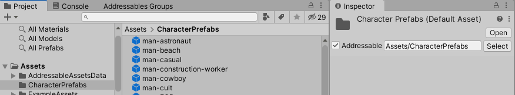

유니티 Addressables 문서 번역 1장 개요 및 시작

유니티/Addressables/유니티 문서/번역/

- [Addressables](#addressables)
  - [Addressables란?](#addressables란)
  - [기존의 Unity 프로젝트에 Addressables를 적용하려면](#기존의-unity-프로젝트에-addressables를-적용하려면)
- [Addressables 시스템으로 업그레이드하기](#addressables-시스템으로-업그레이드하기)
  - [Addressables로 변환하기](#addressables로-변환하기)
    - [씬 변환하기](#씬-변환하기)
      - [Addressable 에셋을 Addressable로 지정하지 않은 Scene에서 사용하는 방법](#addressable-에셋을-addressable로-지정하지-않은-scene에서-사용하는-방법)
    - [프리펩 변환하기](#프리펩-변환하기)
    - [Resources 폴더 변환하기](#resources-폴더-변환하기)
    - [AssetBundles 변환하기](#assetbundles-변환하기)
  - [StreamingAssets 폴더 안의 파일들](#streamingassets-폴더-안의-파일들)
- [시작하기](#시작하기)
  - [설치](#설치)
  - [에셋을 어드레서블로 만들기](#에셋을-어드레서블로-만들기)
  - [어드레서블 에셋 사용하기](#어드레서블-에셋-사용하기)
    - [에셋 레퍼런스(AssetReference)를 사용](#에셋-레퍼런스assetreference를-사용)
    - [주소(address)로 로드하기](#주소address로-로드하기)
    - [레이블(label)로 로드](#레이블label로-로드)
  - [어드레서블 에셋 관리하기](#어드레서블-에셋-관리하기)
  - [어드레서블 에셋 빌드](#어드레서블-에셋-빌드)
    - [전체 콘텐츠 빌드 시작](#전체-콘텐츠-빌드-시작)
  - [원격 콘텐츠 배포](#원격-콘텐츠-배포)
  - [점진적 콘텐츠 업데이트](#점진적-콘텐츠-업데이트)
    - [콘텐츠 업데이트 빌드 시작](#콘텐츠-업데이트-빌드-시작)
- [어드레서블 시스템 개요](#어드레서블-시스템-개요)
  - [에셋 주소(Asset addresses)](#에셋-주소asset-addresses)
  - [에셋 참조(AssetReference)](#에셋-참조assetreference)
  - [에셋 로드 및 해제](#에셋-로드-및-해제)
  - [종속성 및 리소스 관리](#종속성-및-리소스-관리)
  - [어드레서블 그룹 및 레이블 (Addressables groups and labels)](#어드레서블-그룹-및-레이블-addressables-groups-and-labels)
    - [그룹 스키마 (Group schemas)](#그룹-스키마-group-schemas)
  - [콘텐츠 카탈로그(Content catalogs)](#콘텐츠-카탈로그content-catalogs)
  - [콘텐츠 빌드(Content builds)](#콘텐츠-빌드content-builds)
  - [플레이 모드 스크립트 (Play mode scripts)](#플레이-모드-스크립트-play-mode-scripts)
  - [여러 플랫폼 지원](#여러-플랫폼-지원)
  - [어드레서블 툴](#어드레서블-툴)
- [어드레서블 구성하기](#어드레서블-구성하기)
  - [초기화](#초기화)
  - [시스템 세팅(System settings)](#시스템-세팅system-settings)
  - [그룹 설정(Group settings)](#그룹-설정group-settings)
  - [프로필(Profiles)](#프로필profiles)
  - [에셋 호스팅 서비스(Asset hosting service)](#에셋-호스팅-서비스asset-hosting-service)
  - [Unity 환경설정(Unity Preferences)](#unity-환경설정unity-preferences)
    - [빌드 레이아웃 디버그(Debug Build Layout)](#빌드-레이아웃-디버그debug-build-layout)
    - [플레이어 빌드에서 어드레서블 빌드(Build Addressables on Player Build)(Unity 2021.2+)](#플레이어-빌드에서-어드레서블-빌드build-addressables-on-player-buildunity-20212)


Addressables 1.21.12 기준 작성

---

# Addressables

## Addressables란?
Addressables 시스템은 응용 프로그램의 콘텐츠를 조직화하고 패키징하기 위한 도구와 스크립트, 그리고 런타임에서 에셋을 로드하고 해제하는 API를 제공합니다.

에셋을 "Addressable"로 지정하면 해당 에셋의 주소를 사용하여 어디에서든 로드할 수 있습니다. 해당 에셋이 로컬 응용 프로그램에 있는지 아니면 콘텐츠 전달 네트워크에 있는지에 상관없이 Addressable 시스템이 해당 에셋을 찾아서 반환합니다.

Addressables 시스템을 도입하여 프로젝트를 다음과 같은 영역에서 개선할 수 있습니다:

- 유연성: Addressables를 사용하면 에셋을 호스팅하는 위치를 유연하게 조정할 수 있습니다. 에셋을 응용 프로그램과 함께 설치하거나 필요할 때 다운로드할 수 있습니다. 프로젝트의 어느 단계에서든 특정 에셋에 액세스하는 위치를 변경할 수 있으며, 게임 코드를 다시 작성하지 않고도 가능합니다.
- 의존성 관리: 시스템은 로드하는 모든 에셋의 종속성을 자동으로 로드하여 메시, 셰이더, 애니메이션 등의 모든 에셋이 시스템이 콘텐츠를 반환하기 전에 로드되도록 합니다.
- 메모리 관리: 시스템은 에셋을 로드하는 것뿐만 아니라 언로드하는 것도 처리하며, 자동으로 참조를 계산하고 잠재적인 메모리 문제를 식별하는 강력한 프로파일러를 제공합니다.
- 콘텐츠 패킹: 시스템은 복잡한 종속성 체인을 매핑하고 이해하기 때문에 에셋을 효율적으로 패키징하여 AssetBundle을 생성합니다. 에셋을 이동하거나 이름을 변경하더라도 효율적인 패키징을 수행할 수 있습니다. 로컬 및 원격 배포를 위해 에셋을 준비할 수 있어, 다운로드 가능한 콘텐츠와 응용 프로그램 크기 축소를 지원할 수 있습니다.

Addressables 시스템에 대한 소개는 Simplify your content management with Addressables 문서를 참조하세요.

>**_NOTE :_** Addressables 시스템은 Unity의 AssetBundles을 기반으로 구축됩니다. 자체적으로 자세한 관리 코드를 작성하지 않고 AssetBundles을 프로젝트에서 사용하려면 Addressables를 사용해야 합니다.


## 기존의 Unity 프로젝트에 Addressables를 적용하려면 

Addressables 패키지를 설치해야 합니다. 이를 위해서는 에셋에 주소를 할당하고 런타임 로딩 코드를 리팩터링해야 합니다. 자세한 내용은 Addressables 시스템으로 업그레이드하기를 참조하세요.

Addressables를 프로젝트 개발 중 어느 시점에서든 통합할 수는 있지만, Unity는 새로운 프로젝트에서는 가능한 한 빠른 시점부터 Addressables를 사용하도록 권장합니다. 이렇게 하면 개발 중에 불필요한 코드 리팩터링과 콘텐츠 계획 변경을 피할 수 있습니다.


---
# Addressables 시스템으로 업그레이드하기

이 문서에서는 기존 프로젝트를 수정하여 Addressable 에셋의 장점을 활용하는 방법에 대해 다룹니다.

Addressables 시스템 이외에도 Unity는 몇 가지 "전통적인" 방법으로 에셋을 참조하고 로드할 수 있습니다:

- 씬 데이터 (Scene Data): 씬에 직접 추가하거나 씬의 컴포넌트에 추가하는 에셋으로, 응용 프로그램이 자동으로 로드합니다. Unity는 직렬화된 씬 데이터와 씬에서 직접 참조하는 에셋을 하나의 아카이브로 패키징하여 빌드된 플레이어 응용 프로그램에 포함합니다. "Addressable"이 아닌 씬에서 Addressable 에셋을 사용하는 방법은 Converting Scenes 및 Using Addressable assets in non-Addressable Scenes를 참조하세요.

- 프리팹 (Prefab) : GameObject 및 컴포넌트를 사용하여 생성하고 씬 외부에 저장하는 에셋입니다. Prefab 변환에 대해서는 Converting Prefabs를 참조하세요.

- Resources 폴더: 프로젝트의 Resources 폴더에 배치하고 Resources API를 사용하여 로드하는 에셋입니다. Unity는 Resources 파일에 있는 에셋을 하나의 아카이브로 패키징하여 빌드된 플레이어 응용 프로그램에 포함합니다. Resources 아카이브는 씬 데이터 아카이브와 별개입니다. Resources 폴더에 대한 변환 방법은 Converting Resources folders를 참조하세요.

- AssetBundle: AssetBundle에 패키지화하고 AssetBundle API로 로드하는 에셋입니다. AssetBundle 변환에 대해서는 Converting AssetBundles를 참조하세요.

- StreamingAssets: StreamingAssets 폴더에 배치하는 파일입니다. Unity는 StreamingAssets 폴더에 있는 모든 파일을 빌드된 플레이어 응용 프로그램에 그대로 포함합니다. StreamingAssets에 있는 파일에 대해서는 Files in StreamingAssets를 참조하세요.
  

## Addressables로 변환하기

Addressables를 사용하여 빌드된 콘텐츠는 해당 Addressables 빌드에서 빌드된 다른 에셋을 참조합니다. Addressables 및 Scene 데이터 및 Resource 폴더를 통해 Player 빌드에 포함된 사용되거나 참조되는 콘텐츠는 둘 다 로드될 경우 디스크 및 메모리에서 중복으로 발생합니다. 이 제한으로 인해 권장되는 모범 사례는 모든 Scene 데이터 및 Resource 폴더를 Addressables 빌드 시스템으로 변환하는 것입니다. 중복으로 인한 메모리 오버헤드를 줄이고 Addressables를 사용하여 모든 콘텐츠를 관리할 수 있도록 합니다. 콘텐츠를 로컬 또는 원격으로 사용하고 업데이트 가능하도록 Content Update 빌드를 통해 콘텐츠를 관리할 수 있게 됩니다.

### 씬 변환하기

프로젝트에 Addressables를 통합하는 가장 쉬운 방법은 씬을 빌드 설정 목록에서 제거하고 해당 씬을 Addressable로 만드는 것입니다. 응용 프로그램 시작 시 Unity가 로드하는 한 가지 씬이 목록에 있어야 합니다. 이를 위해 아무런 기능이 없이 첫 번째 Addressable 씬을 로드하는 새로운 씬을 만들 수 있습니다.

씬을 변환하는 방법은 다음과 같습니다:

1. "초기화(initialization)"라는 새로운 씬을 만듭니다.
2. 빌드 설정 창을 엽니다 (메뉴: File > Build Settings).
3. 초기화 씬을 씬 목록에 추가합니다.
4. 다른 씬들을 목록에서 제거합니다.
5. 프로젝트 목록에서 각 씬을 클릭하고 인스펙터 창에서 Addressable 옵션을 선택합니다. 또는 Addressables Groups 창에서 씬 에셋을 그룹으로 끌어올 수도 있습니다. (새로운 초기화 씬을 Addressable로 만들지 마세요.)
6. 씬을 로드하는 데 사용하는 코드를 SceneManager 메서드가 아닌 Addressables 클래스의 씬 로딩 메서드로 업데이트합니다.

이 시점에서 씬에 있는 모든 에셋을 Addressable 그룹에 포함시키고, Addressables 시스템은 Addressables 콘텐츠를 빌드할 때 해당 에셋을 AssetBundle로 패키징합니다. 모든 씬에 하나의 그룹만 사용하는 경우 런타임 로딩 및 메모리 성능은 프로젝트의 Addressables 적용 이전과 거의 동일할 것입니다.

이 시점에서 씬에 있는 모든 에셋을 Addressable 그룹에 포함시키고 Addressables 시스템은 Addressables 콘텐츠를 빌드할 때 해당 에셋을 AssetBundle로 패키징합니다. 모든 씬에 하나의 그룹만 사용하는 경우 런타임 로딩 및 메모리 성능은 프로젝트의 Addressables 적용 이전과 거의 동일할 것입니다.

이제 하나의 큰 Addressable 씬 그룹을 여러 그룹으로 분할할 수 있습니다. 어떻게 분할하는 것이 가장 좋을지는 프로젝트의 목표에 따라 다를 수 있습니다. 계속 진행하기 전에 각각의 씬을 독립적으로 로드하고 언로드할 수 있도록 해당 씬을 자체 그룹으로 이동할 수 있습니다. 이 과정에서 중복된 에셋을 확인하기 위해 Analyze 도구를 사용할 수 있습니다. 두 개의 다른 번들에서 참조하는 에셋의 중복을 피하기 위해 해당 에셋 자체를 Addressable로 만드는 것이 좋습니다. 공유 에셋을 고유한 그룹으로 이동하여 AssetBundle 간의 상호 의존성을 줄이는 것도 좋은 방법입니다.


#### Addressable 에셋을 Addressable로 지정하지 않은 Scene에서 사용하는 방법

Addressable 에셋을 Addressable로 만들지 않고도 Scene 데이터의 일부로 사용하려면 AssetReferences를 통해 가능합니다.

사용자 지정 MonoBehaviour 또는 ScriptableObject 클래스에 AssetReference 필드를 추가하면 Unity 에디터에서 직접 참조로 에셋을 할당하는 방식과 유사하게 해당 필드에 Addressable 에셋을 할당할 수 있습니다. 주요 차이점은 AssetReference 필드에 할당된 에셋을 로드하고 해제하기 위해 클래스에 코드를 추가해야 한다는 것입니다(Unity는 Scene에서 객체를 인스턴스화할 때 직접 참조를 자동으로 로드합니다).

>**_NOTE :_** 비-Addressable Scene의 UnityEngine 컴포넌트의 필드에는 Addressable 에셋을 사용할 수 없습니다. 예를 들어, 비-Addressable Scene의 MeshFilter 컴포넌트에 Addressable 메시 에셋을 할당하면 Unity는 해당 Scene에 대해 Addressable 버전의 메시 데이터를 사용하지 않습니다. 대신, Unity는 메시 에셋을 복사하고 두 가지 버전의 메시를 응용 프로그램에 포함시킵니다. 하나는 메시를 포함하는 Addressable 그룹을 위해 빌드된 AssetBundle에 있고, 다른 하나는 비-Addressable Scene의 내장 Scene 데이터에 있습니다. (Addressable Scene에서 사용될 때, Unity는 메시 데이터를 복사하지 않고 항상 AssetBundle에서 로드합니다.)

사용자 정의 클래스에서 직접 참조를 AssetReference로 대체하려면 다음 단계를 따르세요:

1. 객체에 대한 직접 참조를 에셋 참조로 대체합니다 (예: public GameObject directRefMember;는 public AssetReference assetRefMember;로 대체됩니다).
2. 에셋을 직접 참조와 같은 방식으로 해당 컴포넌트의 Inspector에 드래그하여 할당합니다.
3. 할당된 에셋을 로드하기 위해 Addressables API를 사용하는 런타임 코드를 추가합니다.
4. 더 이상 필요하지 않을 때 로드된 에셋을 해제하는 코드를 추가합니다.
AssetReference 필드 사용에 대한 자세한 내용은 "Asset References"를 참조하세요.

Addressable 에셋을 로드하는 방법에 대한 자세한 내용은 "Loading Addressable assets"를 참조하세요.

### 프리펩 변환하기

프리팹을 Addressable 에셋으로 변환하려면 해당 프리팹의 Inspector 창에서 Addressables 옵션을 확인하거나 Addressables 그룹 창에서 해당 그룹으로 끌어옵니다.

Addressable Scene에서 사용할 때는 항상 프리팹을 Addressable로 만들 필요는 없습니다. Addressables는 Scene 계층 구조에 추가하는 프리팹을 Scene의 AssetBundle에 포함되는 데이터의 일부로 자동으로 포함합니다. 그러나 한 개 이상의 Scene에서 프리팹을 사용하는 경우, 각 Scene마다 프리팹 데이터가 중복되지 않도록 프리팹을 Addressable 에셋으로 만들어야 합니다. 또한 런타임에서 프리팹을 동적으로 로드하고 인스턴스화하려면 프리팹을 Addressable로 만들어야 합니다.

>**_NOTE :_** 만약 프리팹을 Addressable하지 않은 Scene에서 사용한다면, Unity는 프리팹 데이터를 내장된 Scene 데이터에 복사합니다. 프리팹이 Addressable인지 여부에 상관없이 이러한 처리가 이루어집니다. 분석 도구의 "Check Scene to Addressable Duplicate Dependencies" 규칙을 사용하여 Addressable 에셋 그룹과 비-Addressable Scene 데이터 간에 중복된 에셋을 식별할 수 있습니다.

### Resources 폴더 변환하기

만약 프로젝트에서 Resources 폴더에 있는 에셋을 로드한다면, 해당 에셋을 Addressables 시스템으로 마이그레이션할 수 있습니다.

1. 에셋을 Addressable로 만드세요. 이를 위해 각 에셋의 Inspector 창에서 Addressable 옵션을 활성화하거나, Addressables Groups 창에서 에셋을 그룹에 끌어오세요.
2. 에셋을 로드하는 런타임 코드가 Resources API를 사용하는 것에서 Addressables API를 사용하여 에셋을 로드하도록 변경하세요.
3. 더 이상 필요하지 않은 경우 로드된 에셋을 해제하는 코드를 추가하세요.

씬과 마찬가지로, 이전 Resources 에셋을 모두 한 그룹에 유지한다면 로딩 및 메모리 성능은 동일할 것입니다. 프로젝트에 따라 에셋을 별도의 그룹으로 나누어 성능과 유연성을 향상시킬 수 있습니다. 분석 도구를 사용하여 AssetBundle 간의 중복을 확인하세요.

Resources 폴더에 있는 에셋을 Addressable로 표시하면, 시스템은 자동으로 해당 에셋을 프로젝트의 새로운 폴더인 Resources_moved로 이동시킵니다. 이동된 에셋의 기본 주소는 이전 경로로 설정되며, 폴더 이름은 제외됩니다. 예를 들어, 로딩 코드는 다음과 같이 변경될 수 있습니다. 

이것을
```
Resources.LoadAsync\<GameObject\>("desert/tank.prefab"); 
```

이렇게
```
Addressables.LoadAssetAsync\<GameObject\>("desert/tank.prefab");.
```


Addressables 시스템을 사용하도록 프로젝트를 수정한 후에는 Resources 클래스의 일부 기능을 다르게 구현해야 할 수도 있습니다.

예를 들어, Resources.LoadAll 함수를 살펴보겠습니다. 이전에는 Resources/MyPrefabs/ 폴더에 에셋이 있고 
```
Resources.LoadAll<SampleType>("MyPrefabs");
```
을 실행하면, SampleType과 일치하는 모든 에셋을 Resources/MyPrefabs/에서 로드했습니다. Addressables 시스템은 정확히 같은 기능을 지원하지 않지만, Addressable 레이블을 사용하여 유사한 결과를 얻을 수 있습니다.


### AssetBundles 변환하기

Addressables Groups 창을 처음 열 때, Unity는 모든 AssetBundle을 Addressables 그룹으로 변환하도록 제안합니다. 이는 AssetBundle 설정을 Addressables 시스템으로 마이그레이션하는 가장 간단한 방법입니다. 그러나 여전히 런타임 코드를 업데이트하여 Addressables API를 사용하여 에셋을 로드하고 해제해야 합니다.

수동으로 AssetBundle 설정을 변환하려면 "무시" 버튼을 클릭하세요. AssetBundle를 Addressables로 수동으로 마이그레이션하는 과정은 Scene과 Resources 폴더에 대한 설명과 유사합니다:

1. 각 에셋의 Inspector 창에서 Addressable 옵션을 활성화하거나, Addressables Groups 창에서 해당 에셋을 그룹에 끌어오는 방식으로 에셋을 Addressable로 만드세요. Addressables 시스템은 에셋에 대한 기존의 AssetBundle 및 레이블 설정을 무시합니다.
2. AssetBundle 또는 UnityWebRequestAssetBundle API를 사용하여 에셋을 로드하는 런타임 코드를 Addressables API를 사용하여 로드하도록 변경하세요. 에셋의 AssetBundle 객체 자체나 에셋의 종속성을 명시적으로 로드할 필요는 없습니다. Addressables 시스템이 이러한 측면을 자동으로 처리합니다.
3. 더 이상 필요하지 않을 때 로드된 에셋을 해제하는 코드를 추가하세요.

>**_NOTE :_** 에셋의 주소의 기본 경로는 해당 파일 경로입니다. 에셋의 주소로 경로를 사용하는 경우, 번들에서 로드하는 것과 동일한 방식으로 에셋을 로드할 수 있습니다. Addressable Asset 시스템은 번들과 해당 종속성의 로딩을 처리합니다.

자동 변환 옵션을 선택하거나 수동으로 에셋을 동등한 Addressables 그룹에 추가한 경우, 그룹 설정에 따라 동일한 에셋을 포함하는 동일한 번들 세트가 생성됩니다. (번들 파일 자체는 동일하지 않을 수 있습니다.) 분석 도구를 사용하여 중복 및 기타 잠재적인 문제를 확인할 수 있습니다. Event viewer 창을 사용하여 에셋의 로딩 및 해제 동작이 예상대로 작동하는지 확인할 수 있습니다.

## StreamingAssets 폴더 안의 파일들

Addressables 시스템을 사용할 때 StreamingAssets 폴더에서 파일을 계속해서 로드할 수 있습니다. 그러나 이 폴더에 있는 파일은 Addressable로 지정할 수 없으며 다른 에셋을 참조할 수도 없습니다.

Addressables 시스템은 빌드 중에 실행 구성 파일과 로컬 AssetBundle을 StreamingAssets 폴더에 배치합니다. (Addressables는 빌드 프로세스가 완료되면 이러한 파일을 제거하므로 에디터에서는 볼 수 없습니다.)

---

# 시작하기


Unity 프로젝트에 Addressables 패키지를 설치한 후에는 시작할 수 있습니다.

Addressables를 사용하는 기본적인 단계는 다음과 같습니다:

- 에셋을 Addressable로 만듭니다.
- Addressables API를 사용하여 코드에서 해당 에셋을 참조하고 로드합니다.
- Addressable 에셋을 빌드합니다.

Addressable 에셋을 사용하기 위해 프로젝트를 설정한 예제로 Addressables-Sample 저장소의 Space Shooter 프로젝트를 참조할 수 있습니다.

>**_NOTE :_** 이 "시작하기" 주제는 Addressable 콘텐츠를 구성하는 다양한 방법에 대해서는 다루지 않습니다. 해당 주제에 대한 정보는 "Addressable 에셋 구성"을 참조하십시오.

## 설치

프로젝트에 Addressables 패키지를 설치하려면 Unity 패키지 매니저를 사용하세요:

1. 패키지 매니저를 엽니다 (메뉴: Window > Package Manager).
2. 패키지 목록을 Unity 레지스트리의 패키지를 표시하도록 설정합니다.

3. 리스트에서 Addressables 패키지를 선택하세요.
4. 패키지 매니저 창 오른쪽 아래에 있는 Install을 클릭하세요.
   
설치 후 프로젝트에 Addressables 시스템을 설정하려면 Addressables 그룹 창을 열고 Create Addressables Settings를 클릭하세요.


Create Addressables Settings 명령을 실행하면, Addressables 시스템은 AddressableAssetsData라는 폴더를 생성합니다. 이 폴더에는 Addressables 설정 파일 및 기타 에셋이 저장되어 Addressables 설정을 유지하는 데 사용됩니다. 이 폴더의 파일을 소스 컨트롤 시스템에 추가해야 합니다. Addressables는 Addressables 구성을 변경할 때 추가적인 파일을 생성할 수 있습니다. 설정 자체에 대한 자세한 정보는 Addressables 설정을 참조하십시오.

>**_NOTE :_** 특정 버전의 어드레서블을 설치하는 방법이나 프로젝트의 패키지 관리에 대한 일반적인 정보는 패키지를 참조하세요.

## 에셋을 어드레서블로 만들기

다음과 같은 방법으로 에셋을 어드레서블로 표시할 수 있습니다:
- 에셋의 인스펙터에서 주소 지정 가능 확인란을 선택합니다:

- 에셋을 드래그하거나 인스펙터의 AssetReference 필드에 할당합니다:

- 에셋을 어드레서블 그룹 창의 그룹으로 드래그합니다:

- 에셋을 주소 지정 가능으로 표시된 프로젝트 폴더에 넣습니다:


에셋을 어드레서블로 만들면 어드레서블 시스템은 에셋을 기본 그룹(default group)에 추가합니다(특정 그룹에 배치하지 않는 한). 어드레서블은 콘텐츠 빌드를 만들 때 그룹 설정에 따라 그룹의 에셋을 에셋 번들에 패킹합니다. 이러한 에셋은 어드레서블 API를 사용하여 로드할 수 있습니다.

>**_NOTE :_** 리소스 폴더에 있는 에셋을 어드레서블로 설정하면 Unity는 해당 에셋을 리소스 폴더 밖으로 이동합니다. 에셋을 프로젝트의 다른 폴더로 이동할 수는 있지만 어드레서블 에셋을 리소스 폴더에 저장할 수는 없습니다.


## 어드레서블 에셋 사용하기

어드레서블 에셋을 로드하려면 다음과 같이 하면 됩니다:

- 에셋을 참조하는 에셋 레퍼런스(AssetReference)를 사용
- 주소(address) 문자열 사용
- 에셋에 할당된 레이블(label) 사용

어드레서블 에셋 로딩에 대한 자세한 내용은 에셋 로딩하기를 참조하세요.

어드레서블 에셋 로드는 비동기 연산을 사용합니다. Unity 스크립트에서 비동기 프로그래밍을 처리하는 다양한 방법에 대한 자세한 내용은 오퍼레이션을 참조하십시오.

>**_TIP :_** 어드레서블 에셋을 사용하는 방법에 대한 자세한 예시는 어드레서블-샘플 리포지토리에서 확인할 수 있습니다.

### 에셋 레퍼런스(AssetReference)를 사용

에셋 참조를 사용하려면 MonoBehaviour 또는 스크립터블 오브젝트에 에셋 참조 필드를 추가합니다. 해당 유형의 객체를 생성한 후 객체의 인스펙터 창에서 필드에 에셋을 할당할 수 있습니다.

>**_NOTE :_** 어드레서블 에셋이 아닌 에셋을 에셋 레퍼런스 필드에 할당하면 Unity는 해당 에셋을 자동으로 어드레서블로 설정하고 기본 어드레서블 그룹에 추가합니다. 또한 에셋 레퍼런스를 사용하면 씬에서 어드레서블 에셋이 아닌 에셋도 어드레서블 에셋으로 사용할 수 있습니다.

유니티는 참조된 에셋을 자동으로 로드하거나 해제하지 않으며, 사용자가 직접 어드레서블 API를 사용하여 에셋을 로드하고 해제해야 합니다:

```
using UnityEngine;
using UnityEngine.AddressableAssets;
using UnityEngine.ResourceManagement.AsyncOperations;

internal class LoadWithReference : MonoBehaviour
{
    // Assign in Editor
    public AssetReference reference;

    // Start the load operation on start
    void Start()
    {
        AsyncOperationHandle handle = reference.LoadAssetAsync<GameObject>();
        handle.Completed += Handle_Completed;
    }

    // Instantiate the loaded prefab on complete
    private void Handle_Completed(AsyncOperationHandle obj)
    {
        if (obj.Status == AsyncOperationStatus.Succeeded)
        {
            Instantiate(reference.Asset, transform);
        }
        else
        {
            Debug.LogError($"AssetReference {reference.RuntimeKey} failed to load.");
        }
    }

    // Release asset when parent object is destroyed
    private void OnDestroy()
    {
        reference.ReleaseAsset();
    }
}
```

에셋 참조 로딩에 대한 자세한 내용은 에셋 참조 로딩을 참조하세요.


### 주소(address)로 로드하기

주소 문자열을 사용하여 에셋을 로드할 수 있습니다:

```
using UnityEngine;
using UnityEngine.AddressableAssets;
using UnityEngine.ResourceManagement.AsyncOperations;

internal class LoadWithAddress : MonoBehaviour
{
    // Assign in Editor or in code
    public string address;

    // Retain handle to release asset and operation
    private AsyncOperationHandle<GameObject> handle;

    // Start the load operation on start
    void Start()
    {
        handle = Addressables.LoadAssetAsync<GameObject>(address);
        handle.Completed += Handle_Completed;
    }

    // Instantiate the loaded prefab on complete
    private void Handle_Completed(AsyncOperationHandle<GameObject> operation)
    {
        if (operation.Status == AsyncOperationStatus.Succeeded)
        {
            Instantiate(operation.Result, transform);
        }
        else
        {
            Debug.LogError($"Asset for {address} failed to load.");
        }
    }

    // Release asset when parent object is destroyed
    private void OnDestroy()
    {
        Addressables.Release(handle);
    }
}
```

에셋을 로드할 때마다 해제해야 한다는 점을 기억하세요.

자세한 내용은 단일 에셋 로드를 참조하세요.

### 레이블(label)로 로드
한 번의 작업으로 동일한 레이블을 가진 에셋 세트를 로드할 수 있습니다:

```
using System.Collections.Generic;
using UnityEngine;
using UnityEngine.AddressableAssets;
using UnityEngine.ResourceManagement.AsyncOperations;

internal class LoadWithLabels : MonoBehaviour
{
    // Label strings to load
    public List<string> keys = new List<string>() {"characters", "animals"};

    // Operation handle used to load and release assets
    AsyncOperationHandle<IList<GameObject>> loadHandle;

    // Load Addressables by Label
    void Start()
    {
        float x = 0, z = 0;
        loadHandle = Addressables.LoadAssetsAsync<GameObject>(
            keys, // Either a single key or a List of keys 
            addressable =>
            {
                //Gets called for every loaded asset
                if (addressable != null)
                {
                    Instantiate<GameObject>(addressable,
                        new Vector3(x++ * 2.0f, 0, z * 2.0f),
                        Quaternion.identity,
                        transform);
                    if (x > 9)
                    {
                        x = 0;
                        z++;
                    }
                }
            }, Addressables.MergeMode.Union, // How to combine multiple labels 
            false); // Whether to fail if any asset fails to load
        loadHandle.Completed += LoadHandle_Completed;
    }

    private void LoadHandle_Completed(AsyncOperationHandle<IList<GameObject>> operation)
    {
        if (operation.Status != AsyncOperationStatus.Succeeded)
            Debug.LogWarning("Some assets did not load.");
    }

    private void OnDestroy()
    {
        // Release all the loaded assets associated with loadHandle
        Addressables.Release(loadHandle);
    }
}
```

자세한 내용은 여러 에셋 로딩을 참조하세요.


## 어드레서블 에셋 관리하기

어드레서블 에셋을 관리하려면 어드레서블 그룹 창을 사용합니다. 이 창을 사용하여 어드레서블 그룹을 만들고, 그룹 간에 에셋을 이동하고, 에셋에 주소와 레이블을 할당할 수 있습니다.

어드레서블 패키지를 처음 설치하고 설정하면 어드레서블 에셋에 대한 기본 그룹이 생성됩니다. 어드레서블 시스템은 사용자가 어드레서블로 표시한 모든 에셋을 기본적으로 이 그룹에 할당합니다. 프로젝트 초기 단계에서는 이 단일 그룹에 에셋을 유지해도 괜찮을 수 있지만, 콘텐츠를 더 추가할수록 애플리케이션이 특정 시점에 로드하고 메모리에 유지하는 리소스를 더 잘 제어할 수 있도록 추가 그룹을 생성하는 것이 좋습니다.

주요 그룹 설정은 다음과 같습니다:

- 빌드 경로: 콘텐츠 빌드 후 콘텐츠를 저장할 위치입니다.
- 로드 경로: 앱 또는 게임이 런타임에 빌드된 콘텐츠를 찾는 위치입니다.

>**_NOTE :_** 프로필 변수를 사용하여 이러한 경로를 설정할 수 있으며, 일반적으로 프로필 변수를 사용해야 합니다. 자세한 내용은 프로필을 참조하세요.

- 번들 모드: 그룹의 콘텐츠를 번들로 패키징하는 방법입니다. 다음 옵션을 선택할 수 있습니다:
  - 모든 그룹 에셋을 포함하는 하나의 번들
  - 그룹의 각 항목에 대한 번들(전체 폴더를 주소 지정 가능으로 표시하고 해당 콘텐츠를 함께 빌드하려는 경우 특히 유용함)
  - 그룹 에셋에 할당된 레이블의 고유한 조합 각각에 대한 번들
- 콘텐츠 업데이트 제한: 이 값을 적절하게 설정하면 더 작은 콘텐츠 업데이트를 게시할 수 있습니다. 자세한 내용은 콘텐츠 업데이트 빌드를 참조하세요. 항상 전체 빌드를 게시하여 앱을 업데이트하고 원격 소스에서 콘텐츠를 다운로드하지 않는 경우 이 설정을 무시할 수 있습니다.
  
에셋을 구성하는 방법을 결정할 때 고려해야 할 전략에 대한 자세한 내용은 어드레서블 에셋 구성을 참조하세요.

어드레서블 그룹 창 사용에 대한 자세한 내용은 그룹을 참조하십시오.


## 어드레서블 에셋 빌드

어드레서블 콘텐츠 빌드 단계에서는 에디터에서 설정한 그룹 설정과 현재 플랫폼에 따라 어드레서블 그룹의 에셋을 에셋 번들로 변환합니다.

Unity 2021.2 이상에서는 모든 플레이어 빌드의 일부로 어드레서블 콘텐츠를 빌드하도록 어드레서블 시스템을 구성하거나 플레이어 빌드를 만들기 전에 콘텐츠를 별도로 빌드할 수 있습니다. 이러한 옵션 구성에 대한 자세한 내용은 플레이어 빌드로 어드레서블 콘텐츠 빌드하기를 참조하세요.

콘텐츠를 플레이어 빌드의 일부로 빌드하도록 Unity를 구성한 경우 에디터 빌드 설정 창에서 일반 빌드(Build) 또는 빌드 및 실행(Build and Run) 버튼을 사용하여 빌드를 시작합니다. Unity는 플레이어를 빌드하기 전에 사전 빌드 단계로 어드레서블 콘텐츠를 빌드합니다.

이전 버전의 Unity에서 또는 콘텐츠를 별도로 빌드하도록 Unity를 구성한 경우, "빌드 만들기"에 설명된 대로 어드레서블 그룹 창의 빌드 메뉴를 사용하여 어드레서블 빌드를 만들어야 합니다. 다음에 프로젝트의 플레이어를 빌드할 때 현재 플랫폼에 대해 마지막으로 실행한 어드레서블 콘텐츠 빌드에서 생성된 아티팩트를 사용합니다. 어드레서블 빌드 프로세스 자동화에 대한 자세한 내용은 "빌드 스크립팅"을 참조하십시오.

어드레서블 그룹 창에서 콘텐츠 빌드를 시작하려면 다음과 같이 하세요:


1. 어드레서블 그룹 창을 엽니다 (메뉴: Windows > 에셋 관리 > 어드레서블 > 그룹).
2. 빌드 메뉴에서 옵션을 선택합니다:
   - 새 빌드 (New Build) : 특정 빌드 스크립트로 빌드를 수행합니다. 사용자 지정 빌드 스크립트가 없는 경우 기본 빌드 스크립트를 사용합니다.
   - 이전 빌드 업데이트 (Update a Previous Build) : 기존 빌드를 기반으로 업데이트를 빌드합니다. 이전 빌드를 업데이트하려면 주소 지정 시스템에서 이전 빌드에서 생성한 addressables_content_state.bin 파일이 필요합니다. 이 파일은 Unity 프로젝트의 Assets/AddressableAssetsData/Platform 폴더에서 찾을 수 있습니다. 콘텐츠 업데이트에 대한 자세한 내용은 콘텐츠 업데이트를 참조하십시오.
   - 클린 빌드 (Clean Build) : 캐시된 빌드 파일을 삭제합니다.

기본적으로 빌드는 프로필 설정에서 LocalBuildPath 및 RemoteBuildPath 변수에 정의된 위치에 파일을 생성합니다. 유니티가 플레이어 빌드에 사용하는 파일에는 에셋 번들(.bundle), 카탈로그 JSON 및 해시 파일, 설정 파일이 포함됩니다.

>**_WARNING :_** 대부분의 경우 로컬 빌드 또는 로드 경로를 기본값에서 변경해서는 안 됩니다. 변경하는 경우, 플레이어 빌드를 만들기 전에 로컬 빌드 아티팩트를 커스텀 빌드 위치에서 프로젝트의 StreamingAssets 폴더로 복사해야 합니다. 이러한 경로를 변경하면 플레이어 빌드의 일부로 어드레서블을 빌드할 수 없습니다.

RemoteBuildPath로 빌드하는 그룹이 있는 경우 해당 에셋 번들, 카탈로그, 해시 파일을 호스팅 서버에 업로드하는 것은 사용자의 책임입니다. (프로젝트에서 원격 콘텐츠를 사용하지 않는 경우 모든 그룹이 로컬 빌드 및 로드 경로를 사용하도록 설정하세요.)

콘텐츠 빌드는 어드레서블이 플레이어 빌드에서 직접 사용하지 않는 다음 파일도 생성합니다:

- addressables_content_state.bin: 콘텐츠 업데이트 빌드를 만드는 데 사용됩니다. 동적 콘텐츠 업데이트를 지원하는 경우 각 콘텐츠 릴리스 후에 이 파일을 저장해야 합니다. 그렇지 않으면 이 파일을 무시해도 됩니다.
- AddressablesBuildTEP.json: 빌드 성능 데이터를 기록합니다. 빌드 프로파일링을 참조하세요.
  
콘텐츠 빌드를 설정하고 수행하는 방법에 대한 자세한 내용은 어드레서블 콘텐츠 빌드하기를 참조하세요.


### 전체 콘텐츠 빌드 시작

전체 콘텐츠 빌드를 만들려면 다음과 같이 하세요:

1. 빌드 설정(Build Settings) 창에서 원하는 플랫폼 타겟(Platform Target)을 설정합니다.
2. Addressables Groups 창을 엽니다(메뉴: Asset Management > Addressables > Groups).
3. Groups 창의 빌드 메뉴에서 New Build > Default Build Script 명령을 선택합니다.

빌드 프로세스가 시작됩니다.

빌드가 완료되면 플레이어 빌드를 수행하고 RemoteBuildPath에서 호스팅 서버로 원격 파일을 업로드할 수 있습니다.

>**_IMPORTANT :_** 애플리케이션을 다시 빌드하지 않고 원격 콘텐츠 업데이트를 게시하려는 경우 게시된 각 빌드에 대해 addressables_content_state.bin 파일을 보존해야 합니다. 이 파일이 없으면 업데이트가 아닌 전체 콘텐츠 빌드 및 플레이어 빌드만 생성할 수 있습니다. 자세한 내용은 콘텐츠 업데이트 빌드를 참조하세요.


## 원격 콘텐츠 배포

어드레서블을 사용하여 콘텐츠 전송 네트워크(CDN) 또는 기타 호스팅 서비스를 통한 콘텐츠의 원격 배포를 지원할 수 있습니다. 유니티는 이를 위해 Unity 클라우드 콘텐츠 전송(CCD) 서비스를 제공하지만, 원하는 CDN이나 호스트를 사용할 수 있습니다.

원격 배포용 콘텐츠를 빌드하기 전에 다음을 수행해야 합니다:

- 어드레서블 에셋 설정에서 Build Remote Catalog 옵션을 활성화합니다(메뉴: Windows > Asset Management > Addressables > Settings).
- 콘텐츠를 게시하는 데 사용하는 프로필에서 콘텐츠에 액세스하려는 원격 URL을 반영하도록 RemoteLoadPath를 구성합니다.
- 원격으로 전달하려는 에셋이 포함된 각 어드레서블 그룹에 대해 Build Path를 RemoteBuildPath로 설정하고 Load Path를 RemoteLoadPath로 설정합니다.
- Build Settings 창에서 원하는 Platform Target을 설정합니다.

콘텐츠 빌드(어드레서블 Groups 창 사용)와 플레이어 빌드(Build Settings 창 사용)를 수행한 후에는 프로필의 RemoteBuildPath로 지정된 폴더에 생성된 파일을 호스팅 서비스에 업로드해야 합니다. 업로드할 파일은 다음과 같습니다:

- 에셋번들(AssetBundles) (name.bundle)
- 카탈로그(Catalog) (카탈로그_타임스탬프.json)
- 해시(Hash) (카탈로그_타임스탬프.해시)

자세한 내용은 원격 콘텐츠 배포하기를 참조하세요.


## 점진적 콘텐츠 업데이트

콘텐츠를 원격으로 배포할 때 증분 콘텐츠 업데이트 빌드를 게시하면 사용자가 업데이트를 위해 다운로드해야 하는 데이터의 양을 줄일 수 있습니다. 증분 업데이트 빌드를 사용하면 모든 것을 다시 게시하지 않고 마지막으로 업데이트를 게시한 이후 변경된 에셋만 포함된 원격 번들을 게시할 수 있습니다. 이러한 소규모 업데이트 번들의 에셋은 기존 에셋을 재정의합니다.

>**_IMPORTANT :_** 증분 업데이트를 게시하는 옵션을 사용하려면 플레이어 빌드를 게시하기 전에 원격 카탈로그 빌드 옵션을 켜야 합니다. 원격 카탈로그가 없으면 설치된 애플리케이션이 업데이트를 확인하지 않습니다.

예시를 포함하여 콘텐츠 업데이트에 대한 자세한 내용은 콘텐츠 업데이트 빌드를 참조하세요.

### 콘텐츠 업데이트 빌드 시작

전체 빌드가 아닌 콘텐츠 업데이트를 만들려면 다음과 같이 하세요:

1. Build Settings 창에서 Platform Target을 현재 업데이트 중인 이전 콘텐츠 빌드의 타겟과 일치하도록 설정합니다.
2. Addressables Groups 창을 엽니다(메뉴: Asset Management > Addressables > Groups).
3. Tools 메뉴에서 콘텐츠 업데이트 제한 사항 확인(Check for Content Update Restrictions) 명령을 실행합니다. 데이터 파일 빌드(Build Data File) 브라우저 창이 열립니다.
4. 이전 빌드에서 생성한 addressables_content_state.bin 파일을 찾습니다. 이 파일은 대상 플랫폼에 맞게 명명된 Assets/AddressableAssestsData의 하위 폴더에 있습니다.
5. Open를 클릭합니다. Content Update Preview 창에서 변경 사항을 검색하고 업데이트를 위해 새 그룹으로 이동해야 하는 에셋을 식별합니다. '릴리스 후 변경 불가(Cannot Change Post Release)'로 설정된 그룹에서 에셋을 변경하지 않은 경우 미리 보기에 변경 사항이 표시되지 않습니다. ("출시 후 변경 가능(Can Change Post Release)"으로 설정된 그룹에서 에셋을 변경하면 해당 그룹의 모든 에셋 번들을 다시 빌드하며, 이 경우 변경된 에셋을 새 그룹으로 이동하지 않습니다.)
6. 변경 사항을 적용하려면 변경 사항 적용(Apply Changes)을 클릭합니다.
7. Build 메뉴에서 이전 빌드 업데이트(Update a Previous Build) 명령을 실행합니다.
8. 이전 빌드에서 생성한 addressables_content_state.bin 파일을 엽니다.
빌드 프로세스가 시작됩니다.

빌드가 완료되면 원격 빌드 경로에서 호스팅 서버로 파일을 업로드할 수 있습니다.

>**_IMPORTANT :_** 어드레서블은 addressables_content_state.bin 파일을 사용하여 변경한 에셋을 식별합니다. 게시된 각 빌드에 대해 이 파일의 사본을 보존해야 합니다. 이 파일이 없으면 업데이트가 아닌 전체 콘텐츠 빌드만 생성할 수 있습니다.

---
# 어드레서블 시스템 개요

어드레서블은 프로젝트와 함께 성장할 수 있는 시스템을 제공합니다. 간단한 설정으로 시작한 다음 프로젝트가 복잡해지고 팀 규모가 커짐에 따라 재구성할 수 있으며, 최소한의 코드 변경만으로 이 모든 작업을 수행할 수 있습니다.

예를 들어, Unity가 세트로 로드하는 단일 어드레서블 에셋 그룹으로 시작할 수 있습니다. 그런 다음 콘텐츠를 추가하면서 에셋을 여러 그룹으로 분할하여 특정 시점에 필요한 에셋만 로드할 수 있습니다. 팀 규모가 커지면 다양한 유형의 에셋을 개발하기 위해 별도의 Unity 프로젝트를 만들 수 있습니다. 이러한 보조 프로젝트는 메인 프로젝트에서 로드하는 자체 어드레서블 콘텐츠 빌드를 생성할 수 있습니다(최소한의 코드 변경으로).

이 개요에서는 어드레서블 시스템으로 에셋을 관리하고 사용하는 방법을 이해하는 데 도움이 되는 다음 개념에 대해 설명합니다:

- 에셋 주소(Asset address) : 어드레서블 에셋을 식별하는 문자열 ID입니다. 주소를 키로 사용하여 에셋을 로드할 수 있습니다.
- 에셋 참조(AssetReferences) : 인스펙터 창의 필드에 어드레서블 에셋을 할당하는 데 사용할 수 있는 유형입니다. AssetReference 인스턴스를 키로 사용하여 에셋을 로드할 수 있습니다. AssetReference 클래스는 자체 로드 메서드도 제공합니다.
- 레이블(Label) : 여러 에셋에 할당하고 관련 에셋을 그룹으로 함께 로드하는 데 사용할 수 있는 태그입니다. 레이블을 키로 사용하여 에셋을 로드할 수 있습니다.
- 에셋 위치(Asset location) : 에셋을 로드하는 방법과 종속성을 설명하는 런타임 객체입니다. 위치 객체를 키로 사용하여 에셋을 로드할 수 있습니다.
- 키(Key) : 어드레서블을 하나 더 식별하는 객체입니다. 키에는 주소, 레이블, AssetReference 인스턴스 및 위치 객체가 포함됩니다.
- 에셋 로딩 및 언로딩(Asset loading and unloading) : 어드레서블 API는 런타임에 에셋을 로드하고 해제하는 자체 함수를 제공합니다.
- 종속성(Dependencies) : 에셋 종속성은 씬 에셋에서 사용되는 프리팹 또는 프리팹 에셋에서 사용되는 머티리얼과 같이 다른 에셋에서 사용되는 하나의 에셋입니다.
- 종속성 및 리소스 관리(Dependency and resource management) : 어드레서블 시스템은 참조 카운팅을 사용하여 시스템이 종속성(참조된 다른 에셋)을 로드 또는 언로드해야 하는지 여부를 포함하여 사용 중인 에셋과 에셋 번들을 추적합니다.
- 그룹(Group) : 에디터에서 에셋을 그룹에 할당합니다. 그룹 설정에 따라 어드레서블이 그룹 에셋을 에셋번들에 패키징하는 방식과 런타임에 에셋을 로드하는 방식이 결정됩니다.
- 콘텐츠 카탈로그(Content catalogs) : 어드레서블은 카탈로그를 사용하여 에셋을 해당 에셋이 포함된 리소스에 매핑합니다.
- 콘텐츠 빌드(Content build) : 어드레서블을 사용할 때는 플레이어 빌드를 만들기 전에 별도의 단계로 에셋을 수집하고 패키징하는 콘텐츠 빌드를 만듭니다.
- 다중 플랫폼 지원(Multiple platform support) : 빌드 시스템은 플랫폼별로 빌드된 콘텐츠를 분리하고 런타임에 올바른 경로를 확인합니다.
- 어드레서블 툴(Addressables tools) : 어드레서블 패키지에는 콘텐츠를 구성, 빌드 및 최적화할 수 있는 여러 창과 툴이 포함되어 있습니다.

기본적으로 어드레서블은 에셋 번들을 사용하여 에셋을 패키징합니다. 에셋에 액세스하는 다른 방법을 지원하기 위해 자체 IResourceProvider 클래스를 구현할 수도 있습니다.


## 에셋 주소(Asset addresses)

어드레서블 시스템의 핵심 기능은 에셋에 주소를 할당하고 해당 주소를 사용하여 런타임에 에셋을 로드하는 것입니다. 어드레서블 리소스 관리자는 콘텐츠 카탈로그에서 주소를 조회하여 에셋이 저장된 위치를 찾습니다. (에셋은 애플리케이션에 내장되거나 로컬에 캐시되거나 원격으로 호스팅될 수 있습니다.) 리소스 관리자는 에셋과 모든 종속성을 로드하고 필요한 경우 콘텐츠를 먼저 다운로드합니다.


주소가 에셋의 실제 위치에 연결되지 않으므로 Unity 에디터와 런타임 모두에서 에셋을 관리하고 최적화할 때 훨씬 더 유연하게 작업할 수 있습니다. 카탈로그는 주소를 실제 위치에 매핑합니다.

일반적으로 에셋에 고유한 주소를 할당해야 하지만, 에셋 주소가 반드시 고유할 필요는 없습니다. 유용한 경우 둘 이상의 에셋에 동일한 주소 문자열을 할당할 수 있습니다. 예를 들어, 에셋의 이형 상품이 있는 경우 모든 이형 상품에 동일한 주소를 할당하고 레이블을 사용하여 이형 상품을 구분할 수 있습니다:

- Asset 1: 주소: "plate_armor_rusty", label: "hd"
- Asset 2: 주소: "plate_armor_rusty", 레이블: "sd"

LoadAssetAsync와 같이 단일 에셋만 로드하는 어드레서블 API 함수는 여러 에셋에 할당된 주소로 호출하면 가장 먼저 찾은 인스턴스를 로드합니다. LoadAssetsAsync와 같은 다른 함수는 한 번의 작업으로 여러 에셋을 로드하고 지정된 주소를 가진 모든 에셋을 로드합니다.

>**_TIP :_** LoadAssetsAsync의 MergeMode 파라미터를 사용하여 두 키의 교집합을 로드할 수 있습니다. 위의 예시에서는 주소 "plate_armor_rusty"와 레이블 "hd"를 키로 지정하고 교집합을 병합 모드로 지정하여 "Asset 1"을 로드할 수 있습니다. 레이블 값을 "sd"로 변경하여 "Asset 2"를 로드할 수 있습니다.

에셋에 주소를 할당하는 방법은 에셋을 주소 지정 가능으로 만들기를 참조하세요.

주소를 포함한 키별로 에셋을 로드하는 방법은 에셋 로드하기를 참조하세요.


## 에셋 참조(AssetReference)

에셋 레퍼런스는 모든 종류의 어드레서블 에셋에 설정할 수 있는 유형입니다. Unity는 레퍼런스에 할당된 에셋을 자동으로 로드하지 않으므로 로드 및 언로드 시기를 사용자가 직접 제어할 수 있습니다.

MonoBehaviours 및 ScriptableObjects에서 AssetReference 유형의 필드를 사용하면 주소를 지정하는 문자열을 사용하는 대신 해당 필드에 사용할 어드레서블 에셋을 지정할 수 있습니다. 에셋 레퍼런스는 드래그 앤 드롭 및 오브젝트 선택기 할당을 지원하므로 에디터 인스펙터에서 더욱 편리하게 사용할 수 있습니다.

어드레서블은 기본 AssetReference 유형 외에도 AssetReferenceGameObject 및 AssetReferenceTexture와 같은 몇 가지 특수한 유형을 더 제공합니다. 이러한 특수 서브클래스를 사용하면 AssetReference 필드에 잘못된 유형의 에셋을 할당할 가능성을 없앨 수 있습니다. 또한 AssetReferenceUILabelRestriction 어트리뷰트를 사용하여 특정 레이블이 있는 에셋에 대한 할당을 제한할 수 있습니다.

자세한 내용은 에셋 레퍼런스 사용을 참조하세요.


## 에셋 로드 및 해제

어드레서블 에셋을 로드하려면 해당 주소 또는 레이블이나 에셋 참조와 같은 기타 키를 사용할 수 있습니다. 자세한 내용은 어드레서블 에셋 로딩하기를 참조하세요. 주 에셋만 로드하면 되고, 어드레서블은 종속 에셋을 자동으로 로드합니다.

런타임에 애플리케이션에서 더 이상 어드레서블 에셋에 액세스할 필요가 없는 경우, 어드레서블이 관련 메모리를 확보할 수 있도록 해당 에셋을 해제해야 합니다. 어드레서블 시스템은 로드된 에셋의 참조 카운트를 유지합니다. 참조 카운트가 0으로 돌아올 때까지 에셋을 언로드하지 않습니다. 따라서 에셋이나 해당 종속 요소가 여전히 사용 중인지 추적할 필요가 없으며, 에셋을 명시적으로 로드할 때마다 애플리케이션에 해당 인스턴스가 더 이상 필요하지 않을 때 해제하기만 하면 됩니다. 자세한 내용은 어드레서블 에셋 릴리스하기를 참조하세요.


## 종속성 및 리소스 관리

Unity의 한 에셋은 다른 에셋에 종속될 수 있습니다. 씬은 하나 이상의 프리팹을 참조할 수 있고, 프리팹은 하나 이상의 머티리얼을 사용할 수 있습니다. 동일한 머티리얼을 둘 이상의 프리팹에서 사용할 수 있으며, 이러한 프리팹은 서로 다른 에셋 번들에 존재할 수 있습니다. 어드레서블 에셋을 로드하면 시스템이 참조하는 종속 에셋을 자동으로 찾아서 로드합니다. 시스템이 에셋을 언로드하면 다른 에셋에서 계속 사용 중인 경우를 제외하고 종속성도 언로드됩니다.

에셋을 로드하고 해제할 때 어드레서블 시스템은 각 항목에 대한 참조 수를 유지합니다. 에셋이 더 이상 참조되지 않으면 어드레서블은 해당 에셋을 언로드합니다. 에셋이 더 이상 사용 중인 에셋이 포함되지 않은 번들에 포함된 경우 Addressables도 해당 번들을 언로드합니다.

자세한 내용은 메모리 관리를 참조하세요.


## 어드레서블 그룹 및 레이블 (Addressables groups and labels)

어드레서블 그룹을 사용하여 콘텐츠를 구성할 수 있습니다. 모든 어드레서블 에셋은 그룹에 속합니다. 에셋을 그룹에 명시적으로 할당하지 않으면 어드레서블은 해당 에셋을 기본 그룹에 추가합니다.

그룹 설정을 설정하여 어드레서블 빌드 시스템이 그룹에 있는 에셋을 번들로 패키징하는 방법을 지정할 수 있습니다. 예를 들어, 그룹의 모든 에셋을 단일 AssetBundle 파일에 함께 패키징할지 여부를 선택할 수 있습니다.

레이블을 사용하여 어떤 방식으로든 함께 처리할 콘텐츠에 태그를 지정할 수 있습니다. 예를 들어 "빨간색", "모자", "깃털"에 대한 레이블을 정의한 경우 깃털이 있는 빨간색 모자는 동일한 에셋 번들의 일부인지 여부에 관계없이 한 번의 작업으로 모두 로드할 수 있습니다. 또한 레이블을 사용하여 그룹 내 에셋이 번들에 패킹되는 방식을 결정할 수 있습니다.

어드레서블 그룹 창을 사용하여 그룹에 에셋을 추가하고 그룹 간에 에셋을 이동할 수 있습니다. 그룹 창에서 에셋에 레이블을 할당할 수도 있습니다.


### 그룹 스키마 (Group schemas)

그룹에 할당된 스키마는 그룹에서 에셋을 빌드하는 데 사용되는 설정을 정의합니다. 서로 다른 스키마는 서로 다른 설정 그룹을 정의할 수 있습니다. 예를 들어, 하나의 표준 스키마는 에셋을 다른 옵션 중에서 에셋 번들로 패킹 및 압축하는 방법에 대한 설정을 정의합니다. 또 다른 표준 스키마는 그룹의 에셋이 "출시 후 변경 가능(Can Change Post Release)" 및 "출시 후 변경 불가(Cannot Change Post Releas)" 범주 중 어느 범주에 속할지를 정의합니다.

사용자 지정 빌드 스크립트와 함께 사용할 스키마를 직접 정의할 수 있습니다.

그룹 스키마에 대한 자세한 내용은 스키마를 참조하세요.


## 콘텐츠 카탈로그(Content catalogs)

어드레서블 시스템은 에셋의 주소를 실제 위치에 매핑하는 콘텐츠 카탈로그 파일을 생성합니다. 또한 카탈로그의 해시(Hash)(수학적 지문)가 포함된 해시 파일을 생성할 수도 있습니다. 어드레서블 에셋을 원격으로 호스팅하는 경우 시스템에서 이 해시 파일을 사용하여 콘텐츠 카탈로그가 변경되어 다운로드해야 하는지 여부를 결정합니다. 자세한 내용은 콘텐츠 카탈로그를 참조하세요.

콘텐츠 빌드를 수행할 때 선택한 프로필에 따라 콘텐츠 카탈로그의 주소가 리소스 로딩 경로에 매핑되는 방식이 결정됩니다. 자세한 내용은 프로필을 참조하세요.

원격으로 콘텐츠를 호스팅하는 방법에 대한 자세한 내용은 원격으로 콘텐츠 배포하기를 참조하세요.


## 콘텐츠 빌드(Content builds)

어드레서블 시스템은 어드레서블 콘텐츠 빌드와 플레이어 빌드를 분리합니다. 콘텐츠 빌드는 콘텐츠 카탈로그, 카탈로그 해시, 에셋이 포함된 에셋 번들을 생성합니다.

에셋 형식은 플랫폼별로 다르므로 플레이어를 빌드하기 전에 각 플랫폼에 맞는 콘텐츠 빌드를 만들어야 합니다.

자세한 내용은 어드레서블 콘텐츠 빌드를 참조하세요.


## 플레이 모드 스크립트 (Play mode scripts)

에디터 플레이 모드에서 게임이나 애플리케이션을 실행할 때 플레이 버튼을 누르기 전에 항상 콘텐츠 빌드를 수행하면 불편하고 속도가 느려질 수 있습니다. 동시에 가능한 한 빌드된 플레이어에 가까운 상태에서 게임을 실행할 수 있기를 원할 것입니다. 유연성을 위해 어드레서블은 어드레서블 시스템이 플레이 모드에서 에셋을 찾고 로드하는 방법을 결정하는 세 가지 옵션을 제공합니다:

- 에셋 데이터베이스 사용(Use the Asset database) : 어드레서블은 에셋 데이터베이스에서 직접 에셋을 로드합니다. 이 옵션은 일반적으로 코드와 에셋을 모두 변경하는 경우 가장 빠른 반복 속도를 제공하지만 프로덕션 빌드와 가장 유사하지도 않습니다.
- 그룹 시뮬레이션(Simulate groups) : 어드레서블은 그룹을 시뮬레이션하는 동안 에셋을 로드합니다. 이 옵션은 어드레서블 그룹 자체를 구성하고 최적화하는 작업에 유용합니다. 변경할 때마다 전체 콘텐츠를 다시 빌드할 필요 없이 어드레서블 이벤트를 제공합니다.
- 기존 빌드 사용(Use existing build) : 어드레서블은 마지막 콘텐츠 빌드에서 콘텐츠를 로드합니다. 이 옵션은 프로덕션 빌드와 가장 유사하며 에셋을 변경하지 않는 경우 빠른 반복 처리 시간을 제공할 수 있습니다.
자세한 내용은 재생 모드 스크립트를 참조하세요.


## 여러 플랫폼 지원

어드레서블은 빌드 경로에 대상 플랫폼 이름을 포함시키고 플레이어 빌드 시 올바른 플랫폼 파일을 스트리밍 에셋 폴더에 복사하도록 하여 여러 플랫폼용으로 설계된 프로젝트를 지원합니다.


## 어드레서블 툴

어드레서블 시스템은 어드레서블 에셋을 관리하는 데 도움이 되는 몇 가지 툴과 창을 제공합니다:

- 어드레서블 그룹 창(Addressable Groups window) : 그룹 창은 에셋, 그룹 설정을 관리하고 빌드를 만들기 위한 기본 인터페이스입니다.
- 프로필 창(Profiles window) : 빌드에 사용되는 경로를 설정하는 데 도움이 됩니다.
- 어드레서블 이벤트 뷰어(Addressables Event Viewer) : 어드레서블 에셋과 관련된 런타임 이벤트를 모니터링하고 프로파일링합니다.
- 분석 도구(Analyze tool) : 분석 도구는 어드레서블 콘텐츠가 정의한 규칙 집합을 준수하는지 확인하는 분석 규칙을 실행합니다. 어드레서블 시스템은 중복 에셋 확인과 같은 몇 가지 기본 규칙을 제공하며, 애널라이즈 룰 클래스를 사용하여 자신만의 규칙을 추가할 수 있습니다.
- 호스팅 툴(Hosting tool) : 호스팅 툴은 Unity 에디터에서 실행되는 간단한 에셋 호스팅 서비스를 제공하여 프로젝트의 개발과 테스트를 지원합니다.
- 빌드 레이아웃 보고서(Build layout report) : 콘텐츠 빌드에서 생성된 에셋 번들에 대해 설명합니다.


---


# 어드레서블 구성하기

다음 항목에서는 프로젝트에서 어드레서블 시스템을 설정하는 구성 옵션에 대한 개요와 자세한 정보에 대한 링크를 제공합니다:

- 초기화
- 시스템 설정
- 그룹 설정
- 프로필
- 에셋 호스팅 서비스
- 기본 설정
- 추가 주제
  
## 초기화

어드레서블 시스템은 스크립터블 오브젝트 에셋 세트를 사용하여 구성 설정을 저장합니다. 시스템은 이러한 설정 에셋을 Unity 프로젝트의 Assets/AddressableAssetsData 폴더에 저장합니다. 그룹 창에서 어드레서블을 초기화할 때 이 폴더와 기본 설정 오브젝트가 생성됩니다. 어드레서블 패키지를 설치한 후 그룹 창(메뉴: Window > Asset Management > Addressables > Groups)을 엽니다.

 Groups 창을 처음 열 때 어드레서블 설정 생성(Create Addressables Settings)을 클릭하여 초기화 명령을 실행하여 설정 폴더와 에셋을 생성합니다:


AddressableAssetsData 폴더와 그 콘텐츠를 소스 제어 시스템에 추가합니다.


## 시스템 세팅(System settings)

AddressableAssetsSettings 오브젝트에는 프로젝트의 글로벌 시스템 설정이 포함되어 있습니다. 메뉴에서 이 설정에 액세스할 수 있습니다: Window > Asset Management > Addressables > Settings 또는 Groups 창의 Tools 메뉴에서 액세스할 수 있습니다.

## 그룹 설정(Group settings)

어드레서블 시스템은 사용자가 정의한 그룹을 사용하여 어드레서블 에셋을 로컬 및 원격 에셋 번들에 패키징하는 방법을 결정합니다. 각 그룹에는 해당 그룹의 옵션을 제어하는 데 사용할 수 있는 자체 설정 오브젝트가 있습니다. 어드레서블은 그룹을 생성할 때마다 새 설정 오브젝트를 생성합니다.

## 프로필(Profiles)

프로필을 사용하면 빌드 목적에 따라 빌드 변수 집합을 적절하게 구성할 수 있습니다. 예를 들어 프로젝트의 개발 빌드에 사용할 프로필을 구성하고, 테스트 빌드에 사용할 프로필을 구성하고, 릴리스 빌드를 게시할 프로필을 구성할 수 있습니다. 필요한 만큼 프로필을 만들 수 있습니다.


## 에셋 호스팅 서비스(Asset hosting service)

어드레서블 시스템은 Unity 에디터 내에서 실행되는 에셋 호스팅 서비스를 제공합니다. 이 서비스를 사용하여 HTTP 연결을 통해 원격 콘텐츠를 테스트할 수 있습니다.


## Unity 환경설정(Unity Preferences)

어드레서블 패키지는 Unity 에디터 환경설정 창에 자체 섹션을 추가합니다. 어드레서블 환경설정에는 다음이 포함됩니다:

### 빌드 레이아웃 디버그(Debug Build Layout)

활성화하면 빌드 시스템에서 빌드 레이아웃 보고서(Build layout report)를 생성합니다. 이 옵션은 빌드를 생성하는 데 필요한 시간을 늘리기 때문에 기본적으로 비활성화되어 있습니다. 빌드 보고서에는 빌드에서 생성된 각 에셋 번들에 대한 자세한 설명이 포함됩니다.

### 플레이어 빌드에서 어드레서블 빌드(Build Addressables on Player Build)(Unity 2021.2+)

Unity에서 플레이어 빌드의 일부로 어드레서블 콘텐츠를 빌드할지 여부를 결정합니다.

플레이어와 함께 어드레서블 콘텐츠를 빌드하면 편리할 수 있지만, 에셋을 수정하지 않은 경우에도 어드레서블 콘텐츠가 리빌드되므로 특히 대규모 프로젝트의 경우 빌드 시간이 늘어날 수 있습니다. 대부분의 빌드 간에 어드레서블 콘텐츠를 변경하지 않는다면 이 옵션을 비활성화하는 것이 좋습니다.

옵션은 다음과 같습니다:

- Build Addressables content on Player Build : 플레이어를 빌드할 때 항상 어드레서블 콘텐츠를 빌드합니다.
- Do not Build Addressables content on Player Build : 플레이어를 빌드할 때 어드레서블 콘텐츠를 빌드하지 않습니다. (어드레서블 콘텐츠를 수정하는 경우 플레이어를 빌드하기 전에 수동으로 다시 빌드해야 합니다.)
- Use global Settings (stored in preferences) : Unity 에디터 환경설정(Addressables 아래)에 지정된 값을 사용합니다. 이 옵션을 사용하면 모든 프로젝트 기여자가 원하는 대로 옵션을 설정할 수 있습니다.
  
처음 두 옵션은 현재 프로젝트의 글로벌 환경설정을 재정의하며 프로젝트를 빌드하는 모든 기여자에게 영향을 줍니다. 그렇지 않으면 글로벌 환경설정이 모든 Unity 프로젝트에 적용됩니다.